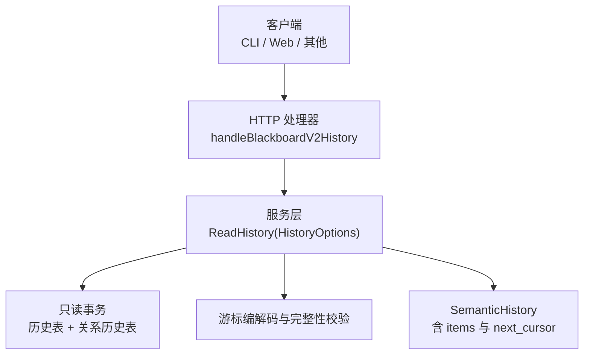
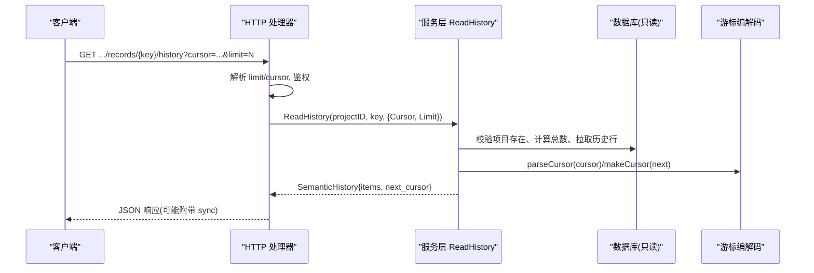
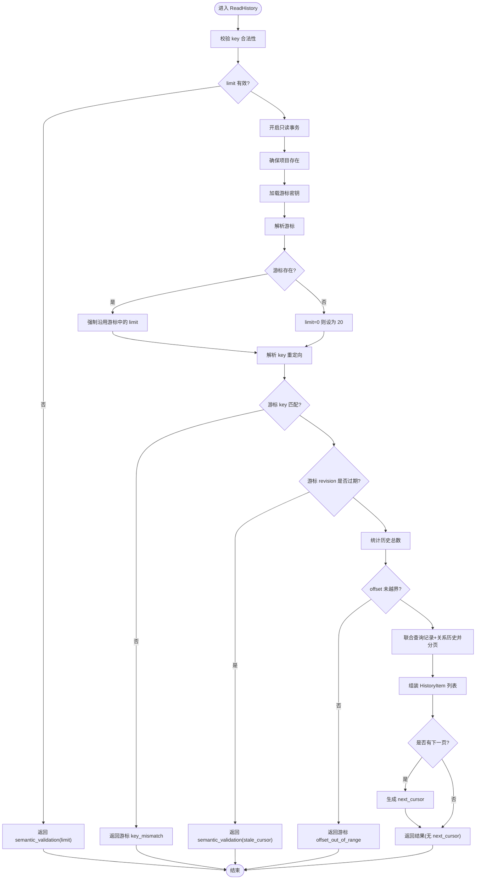
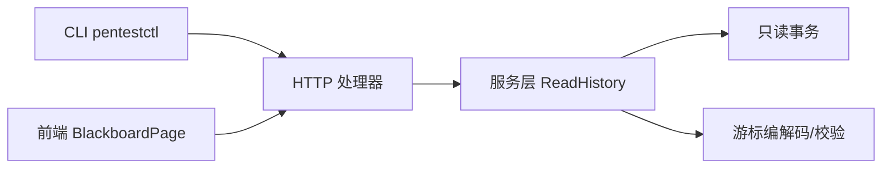

# blackboard_history工具

<cite>
**本文引用的文件**   
- [internal/daemon/blackboard_v2_http.go](file://internal/daemon/blackboard_v2_http.go)
- [internal/blackboardv2/service.go](file://internal/blackboardv2/service.go)
- [internal/pentestctl/blackboard_v2.go](file://internal/pentestctl/blackboard_v2.go)
- [internal/daemon/blackboard_v2_http_test.go](file://internal/daemon/blackboard_v2_http_test.go)
- [web/src/pages/BlackboardPage.tsx](file://web/src/pages/BlackboardPage.tsx)
</cite>

## 目录
1. [简介](#简介)
2. [项目结构](#项目结构)
3. [核心组件](#核心组件)
4. [架构总览](#架构总览)
5. [详细组件分析](#详细组件分析)
6. [依赖关系分析](#依赖关系分析)
7. [性能与存储考虑](#性能与存储考虑)
8. [错误处理与异常指南](#错误处理与异常指南)
9. [结论](#结论)
10. [附录：分页查询示例与最佳实践](#附录分页查询示例与最佳实践)

## 简介
blackboard_history 工具用于查询 Blackboard v2 语义记录的历史变更。它支持基于游标（cursor）的分页和限制（limit）查询，返回稳定、可重放的历史条目集合，并附带 next_cursor 以便客户端继续翻页。该工具通过 HTTP API 暴露，同时被 CLI 和前端页面使用。

## 项目结构
- HTTP 层负责路由、鉴权、参数解析与错误封装，将请求转发至服务层。
- 服务层实现历史读取逻辑、游标校验、分页计数与数据组装。
- CLI 层构造带 cursor/limit 的 URL 调用后端。
- 前端在“语义历史”面板中按需加载历史，并自动拼接下一页游标。

图表来源
- [internal/daemon/blackboard_v2_http.go:177-197](file://internal/daemon/blackboard_v2_http.go#L177-L197)
- [internal/blackboardv2/service.go:1214-1365](file://internal/blackboardv2/service.go#L1214-L1365)

章节来源
- [internal/daemon/blackboard_v2_http.go:177-197](file://internal/daemon/blackboard_v2_http.go#L177-L197)
- [internal/blackboardv2/service.go:1214-1365](file://internal/blackboardv2/service.go#L1214-L1365)

## 核心组件
- HistoryOptions：控制历史查询的参数对象，包含 Cursor 与 Limit 两个字段。
- SemanticHistory：历史响应体，包含 schema、revision、key、items 列表以及可选的 next_cursor。
- HistoryItem：单条历史项，可为 record 或 relationship 两类。

关键要点
- Limit 范围：1–100；未提供时默认 20。
- Cursor 为服务端签名的不透明字符串，携带 revision/key/limit/offset 等信息，且受 HMAC 保护。
- 同一会话翻页必须保持 limit 不变；否则返回游标无效错误。
- 若 key 发生重定向，服务会按 canonical_key 对齐，并在游标中绑定当前 revision，防止跨版本漂移。

章节来源
- [internal/blackboardv2/service.go:498-524](file://internal/blackboardv2/service.go#L498-L524)
- [internal/blackboardv2/service.go:1214-1267](file://internal/blackboardv2/service.go#L1214-L1267)
- [internal/blackboardv2/service.go:4796-4851](file://internal/blackboardv2/service.go#L4796-L4851)

## 架构总览
HTTP 接口 GET /api/v2/projects/{id}/blackboard/records/{key}/history 由 Daemon 注册，解析 query 参数后调用服务层 ReadHistory。服务层执行只读事务，统计总数、拉取历史项、计算 next_cursor 并返回。

图表来源
- [internal/daemon/blackboard_v2_http.go:177-197](file://internal/daemon/blackboard_v2_http.go#L177-L197)
- [internal/blackboardv2/service.go:1214-1365](file://internal/blackboardv2/service.go#L1214-L1365)
- [internal/blackboardv2/service.go:4796-4851](file://internal/blackboardv2/service.go#L4796-L4851)

## 详细组件分析

### HTTP 处理器：handleBlackboardV2History
- 路由：GET /api/v2/projects/{id}/blackboard/records/{key}/history
- 参数：
  - path: id, key
  - query: cursor（可选）、limit（可选，整数）
- 行为：
  - 解析 limit 为整数，非法则返回 invalid_schema 错误。
  - 构建 HistoryOptions{Cursor, Limit} 并调用服务层。
  - 统一错误封装与同步附件处理。

章节来源
- [internal/daemon/blackboard_v2_http.go:177-197](file://internal/daemon/blackboard_v2_http.go#L177-L197)

### 服务层：ReadHistory
- 输入：projectID、key、HistoryOptions{Cursor, Limit}
- 校验：
  - key 合法性
  - limit 范围 1–100；未提供时默认 20
  - cursor 存在性、格式、签名、所属项目、key、revision 一致性
- 流程：
  - 打开只读事务
  - 确认项目存在
  - 解析游标，必要时回退到默认 limit
  - 解析 key 重定向，确保游标中的 key 与当前 canonical_key 一致
  - 检查游标 revision 是否过期（stale），过期需重启读取
  - 统计总数，校验 offset 越界
  - 联合查询记录历史与关系历史，排序并分页
  - 生成 next_cursor（如仍有下一页）
- 输出：SemanticHistory{schema, revision, key, items[], next_cursor}

图表来源
- [internal/blackboardv2/service.go:1214-1365](file://internal/blackboardv2/service.go#L1214-L1365)
- [internal/blackboardv2/service.go:4796-4851](file://internal/blackboardv2/service.go#L4796-L4851)

章节来源
- [internal/blackboardv2/service.go:1214-1365](file://internal/blackboardv2/service.go#L1214-L1365)
- [internal/blackboardv2/service.go:4796-4851](file://internal/blackboardv2/service.go#L4796-L4851)

### CLI 集成：pentestctl
- 构造 URL：/blackboard/records/{key}/history
- 追加 query：cursor、limit
- 作为黑盒调用 HTTP 接口，透传分页参数

章节来源
- [internal/pentestctl/blackboard_v2.go:481-492](file://internal/pentestctl/blackboard_v2.go#L481-L492)

### 前端集成：BlackboardPage
- 点击“语义历史”按钮触发首次加载，默认 limit=20
- 用户点击“加载更多”时，使用上一次响应的 next_cursor 发起下一页请求
- 对错误进行格式化展示，并在组件卸载时忽略过时响应

章节来源
- [web/src/pages/BlackboardPage.tsx:785-803](file://web/src/pages/BlackboardPage.tsx#L785-L803)
- [web/src/pages/BlackboardPage.tsx:905-931](file://web/src/pages/BlackboardPage.tsx#L905-L931)

## 依赖关系分析
- HTTP 处理器依赖服务层的 ReadHistory 方法。
- 服务层依赖数据库只读事务、游标编解码与完整性校验。
- CLI 仅依赖 HTTP 接口的 URL 构造。
- 前端依赖 HTTP 接口的 JSON 结构与分页约定。

图表来源
- [internal/daemon/blackboard_v2_http.go:177-197](file://internal/daemon/blackboard_v2_http.go#L177-L197)
- [internal/blackboardv2/service.go:1214-1365](file://internal/blackboardv2/service.go#L1214-L1365)
- [internal/pentestctl/blackboard_v2.go:481-492](file://internal/pentestctl/blackboard_v2.go#L481-L492)
- [web/src/pages/BlackboardPage.tsx:785-803](file://web/src/pages/BlackboardPage.tsx#L785-L803)

## 性能与存储考虑
- 只读事务：历史读取走只读事务，避免写锁竞争。
- 分页策略：采用游标偏移（offset）+ limit 的方式，结合总数统计判断是否存在下一页。
- 排序规则：先按类型分组（record 优先于 relationship），再按时间、版本号、标识键等稳定顺序排列，保证分页稳定性。
- 游标安全：next_cursor 包含 revision、key、limit、offset，并以 HMAC 签名，防止篡改与跨项目复用。
- 默认页大小：未指定 limit 时默认 20，上限 100，兼顾网络与渲染开销。
- 键重定向：当 key 被重定向到 canonical_key 时，历史查询会按 canonical_key 聚合，游标也会绑定当前 revision，避免跨版本漂移导致的不一致。

章节来源
- [internal/blackboardv2/service.go:1214-1365](file://internal/blackboardv2/service.go#L1214-L1365)
- [internal/blackboardv2/service.go:4796-4851](file://internal/blackboardv2/service.go#L4796-L4851)

## 错误处理与异常指南
- 参数错误
  - limit 非整数或超出范围：invalid_schema 或 semantic_validation(limit)。
  - cursor 格式不正确、签名失败、所属项目不一致、key 不一致、offset 越界：semantic_validation(cusor)，并附带 reason 与 next_action=restart_history_read。
  - 游标 revision 过期：semantic_validation(stale_cursor)，提示 restart_history_read。
- 资源不存在
  - key 不存在且无任何历史记录：not_found(key)。
- 传输与鉴权
  - 鉴权失败、权限不足：authority_denied。
  - 请求体过大或 JSON 解析失败：invalid_schema(body)。
- 并发与存储
  - SQLite 写入繁忙：storage_busy（重试友好）。
  - 内部错误：internal。

HTTP 状态码映射
- invalid_schema → 400
- authority_denied → 401/403
- not_found → 404
- storage_busy → 503（Retry-After: 1）
- internal → 500
- 其他领域错误 → 422

章节来源
- [internal/daemon/blackboard_v2_http.go:539-642](file://internal/daemon/blackboard_v2_http.go#L539-L642)
- [internal/blackboardv2/service.go:1214-1365](file://internal/blackboardv2/service.go#L1214-L1365)
- [internal/blackboardv2/service.go:4796-4851](file://internal/blackboardv2/service.go#L4796-L4851)

## 结论
blackboard_history 工具提供了稳定、安全的语义历史分页查询能力。通过严格的游标校验与 revision 绑定，保证了跨进程、跨重启后的连续性与一致性。配合合理的默认页大小与上限，可在大量历史记录场景下获得良好的用户体验与系统性能。

## 附录：分页查询示例与最佳实践

### 基本用法
- 首次请求：GET /api/v2/projects/{id}/blackboard/records/{key}/history?limit=20
- 后续翻页：使用上一响应的 next_cursor 拼接 cursor 参数再次请求

### 完整分页流程
- 设置初始 limit（建议 20，最大 100）
- 循环读取直到 next_cursor 为空
- 遇到 stale_cursor 或 cursor 相关错误时，丢弃旧游标，从 limit 重新开始
- 翻页过程中不要修改 limit，否则会触发 page_size_mismatch

### 时间范围过滤与版本比较
- 当前接口不支持直接的时间范围过滤参数
- 如需时间范围筛选，建议在客户端根据 HistoryItem 的版本与时间戳进行二次过滤
- 版本比较可通过 HistoryItem.version 与响应中的 revision 辅助定位变更点

### 常见错误与处理
- limit 非法：检查是否为 1–100 的整数
- cursor 无效：检查是否来自同项目、同 key、同 limit 的上一次响应
- stale_cursor：重置游标，重新以相同 limit 从头开始
- not_found：确认 key 是否存在且有历史

章节来源
- [internal/daemon/blackboard_v2_http_test.go:676-690](file://internal/daemon/blackboard_v2_http_test.go#L676-L690)
- [internal/daemon/blackboard_v2_http_test.go:735-747](file://internal/daemon/blackboard_v2_http_test.go#L735-L747)
- [web/src/pages/BlackboardPage.test.tsx:475-492](file://web/src/pages/BlackboardPage.test.tsx#L475-L492)