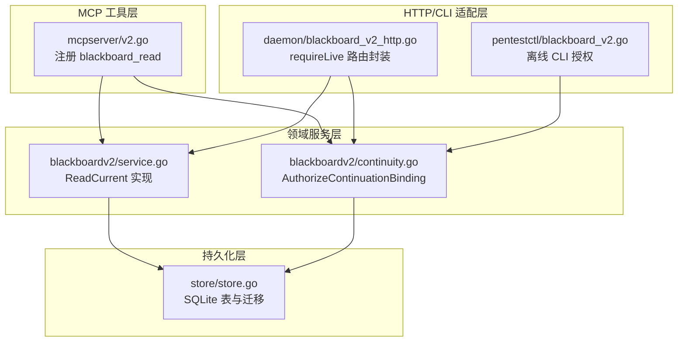
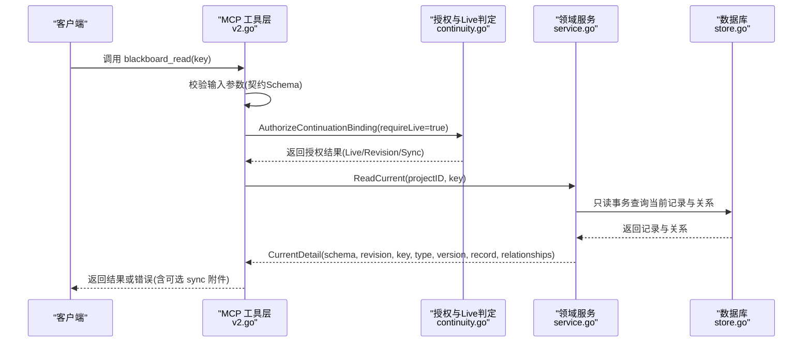
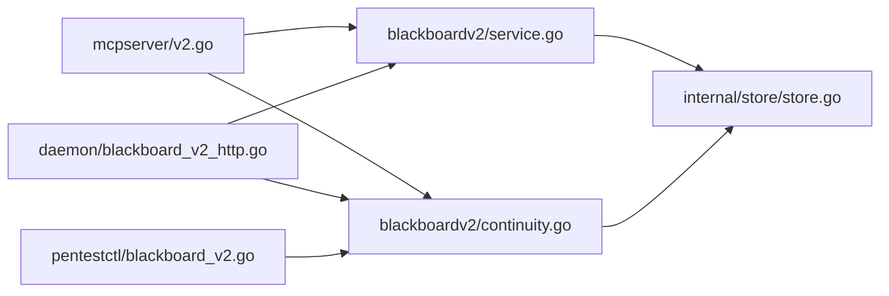

# blackboard_read工具

<cite>
**本文引用的文件**
- [internal/mcpserver/v2.go](file://internal/mcpserver/v2.go)
- [internal/blackboardv2/service.go](file://internal/blackboardv2/service.go)
- [internal/blackboardv2/continuity.go](file://internal/blackboardv2/continuity.go)
- [internal/daemon/blackboard_v2_http.go](file://internal/daemon/blackboard_v2_http.go)
- [internal/pentestctl/blackboard_v2.go](file://internal/pentestctl/blackboard_v2.go)
- [internal/store/store.go](file://internal/store/store.go)
- [docs/specs/blackboard-v2-spec.md](file://docs/specs/blackboard-v2-spec.md)
- [docs/specs/blackboard-graph-refactor.md](file://docs/specs/blackboard-graph-refactor.md)
- [docs/adr/0004-use-compact-semantic-runtime-blackboard-snapshots.md](file://docs/adr/0004-use-compact-semantic-runtime-blackboard-snapshots.md)
</cite>

## 目录
1. [简介](#简介)
2. [项目结构](#项目结构)
3. [核心组件](#核心组件)
4. [架构总览](#架构总览)
5. [详细组件分析](#详细组件分析)
6. [依赖关系分析](#依赖关系分析)
7. [性能考量](#性能考量)
8. [故障排查指南](#故障排查指南)
9. [结论](#结论)
10. [附录](#附录)

## 简介
blackboard_read 是 Blackboard v2 的只读工具，用于读取当前知识状态。该工具仅支持“实时（Live-only）”读取权限，即要求调用方处于活跃的 Continuation 上下文；对于已关闭的离线模式，不允许通过此工具进行“当前知识”读取。其底层实现基于 Blackboard v2 Service 的 ReadCurrent 方法，返回指定 Key 的当前语义记录详情与关系集合，并附带项目级 revision 信息。

## 项目结构
本工具涉及三层：
- MCP 工具层：注册 blackboard_read 工具、参数校验、权限与同步封装。
- 领域服务层：Blackboard v2 Service 提供 ReadCurrent 等能力。
- 运行时/持久化层：SQLite 存储、Continuation 绑定与 Live 判定、同步附件。

图表来源
- [internal/mcpserver/v2.go:84-99](file://internal/mcpserver/v2.go#L84-L99)
- [internal/blackboardv2/service.go:1178-1212](file://internal/blackboardv2/service.go#L1178-L1212)
- [internal/blackboardv2/continuity.go:157-192](file://internal/blackboardv2/continuity.go#L157-L192)
- [internal/daemon/blackboard_v2_http.go:367-392](file://internal/daemon/blackboard_v2_http.go#L367-L392)
- [internal/pentestctl/blackboard_v2.go:253-283](file://internal/pentestctl/blackboard_v2.go#L253-L283)
- [internal/store/store.go:215-270](file://internal/store/store.go#L215-L270)

章节来源
- [internal/mcpserver/v2.go:84-99](file://internal/mcpserver/v2.go#L84-L99)
- [internal/blackboardv2/service.go:1178-1212](file://internal/blackboardv2/service.go#L1178-L1212)
- [internal/blackboardv2/continuity.go:157-192](file://internal/blackboardv2/continuity.go#L157-L192)
- [internal/daemon/blackboard_v2_http.go:367-392](file://internal/daemon/blackboard_v2_http.go#L367-L392)
- [internal/pentestctl/blackboard_v2.go:253-283](file://internal/pentestctl/blackboard_v2.go#L253-L283)
- [internal/store/store.go:215-270](file://internal/store/store.go#L215-L270)

## 核心组件
- MCP 工具入口：在 MCP 服务器中注册 blackboard_read，解析输入参数，强制 requireLive=true，并调用领域服务 ReadCurrent。
- 领域服务 ReadCurrent：以只读事务查询当前记录与关系，返回 CurrentDetail。
- 授权与 Live 判定：AuthorizeContinuationBinding 根据 Continuation 状态与是否有更新后的新实例决定是否为 Live；当 requireLive=true 且非 Live 时拒绝访问。
- HTTP/CLI 适配：HTTP 路由与 CLI 均复用 requireLive 控制，确保黑产工具与离线场景的行为一致。

章节来源
- [internal/mcpserver/v2.go:84-99](file://internal/mcpserver/v2.go#L84-L99)
- [internal/blackboardv2/service.go:1178-1212](file://internal/blackboardv2/service.go#L1178-L1212)
- [internal/blackboardv2/continuity.go:157-192](file://internal/blackboardv2/continuity.go#L157-L192)
- [internal/daemon/blackboard_v2_http.go:367-392](file://internal/daemon/blackboard_v2_http.go#L367-L392)
- [internal/pentestctl/blackboard_v2.go:253-283](file://internal/pentestctl/blackboard_v2.go#L253-L283)

## 架构总览
blackboard_read 的请求路径从 MCP 工具进入，经过参数校验与权限检查，最终由 Service.ReadCurrent 执行只读事务查询，返回包含 schema、revision、key、type、version、record 与 relationships 的结构体。

图表来源
- [internal/mcpserver/v2.go:84-99](file://internal/mcpserver/v2.go#L84-L99)
- [internal/blackboardv2/continuity.go:157-192](file://internal/blackboardv2/continuity.go#L157-L192)
- [internal/blackboardv2/service.go:1178-1212](file://internal/blackboardv2/service.go#L1178-L1212)
- [internal/store/store.go:215-270](file://internal/store/store.go#L215-L270)

## 详细组件分析

### API 定义与参数
- 工具名称：blackboard_read
- 输入参数：
  - key: string（必填），Blackboard Key，如 entity:*、fact:*、attempt:* 等
- 输出结构：CurrentDetail
  - schema: string（固定值，标识记录版本）
  - revision: int（项目级当前图修订号）
  - key: string（请求的键）
  - type: string（记录类型，如 entity/fact/attempt 等）
  - version: int（记录的当前版本）
  - record: Record（按类型投影的字段集）
  - relationships: []RelationshipTuple（与该记录相关的关系边）

章节来源
- [internal/mcpserver/v2.go:84-99](file://internal/mcpserver/v2.go#L84-L99)
- [internal/blackboardv2/service.go:484-492](file://internal/blackboardv2/service.go#L484-L492)
- [internal/blackboardv2/service.go:1178-1212](file://internal/blackboardv2/service.go#L1178-L1212)

### 返回值结构与数据投影机制
- CurrentDetail 中的 record 字段采用“按类型投影”的闭合 DTO：
  - 实体（Entity）、事实（Fact）、尝试（Attempt）、发现（Finding）、解决方案（Solution）、证据（Evidence）各自有允许字段子集。
  - 空字段会被省略，保证序列化稳定与最小暴露面。
- relationships 为三元组数组，表示与当前记录关联的关系边。

章节来源
- [internal/blackboardv2/service.go:484-492](file://internal/blackboardv2/service.go#L484-L492)
- [internal/blackboardv2/service.go:1178-1212](file://internal/blackboardv2/service.go#L1178-L1212)

### Live-only 限制与离线模式区别
- Live-only：blackboard_read 强制 requireLive=true，仅在 Continuation 可写且无更新的活跃状态下允许读取“当前知识”。
- 离线模式：若 Continuation 已关闭或被后续实例替代，则 requireLive=true 会直接拒绝，返回 closed_continuation 语义错误。
- 对比：其他支持幂等重放的工具（如 change/finish）可设置 requireLive=false，以便在离线模式下进行精确重放；但 read 不在此列。

章节来源
- [internal/mcpserver/v2.go:84-99](file://internal/mcpserver/v2.go#L84-L99)
- [internal/blackboardv2/continuity.go:157-192](file://internal/blackboardv2/continuity.go#L157-L192)
- [internal/daemon/blackboard_v2_http.go:367-392](file://internal/daemon/blackboard_v2_http.go#L367-L392)
- [internal/pentestctl/blackboard_v2.go:253-283](file://internal/pentestctl/blackboard_v2.go#L253-L283)

### 权限检查机制
- 授权流程：
  - 解析 Continuation 接口授予（Grant）。
  - 调用 AuthorizeContinuationBinding(projectID, taskID, continuationID, requireLive=true)。
  - 若 requireLive=true 且非 Live，返回 authority_denied/closed_continuation。
- 错误包装：所有语义错误统一转换为 blackboardv2.Error 信封，便于上层处理。

章节来源
- [internal/mcpserver/v2.go:193-248](file://internal/mcpserver/v2.go#L193-L248)
- [internal/blackboardv2/continuity.go:157-192](file://internal/blackboardv2/continuity.go#L157-L192)

### 错误处理策略
- not_found：当 key 不存在时返回语义错误 code=not_found，并携带 details.key。
- authority_denied/closed_continuation：授权失败或 Live-only 限制触发。
- invalid_schema：输入参数不符合冻结契约 Schema。
- internal：未预期的内部错误。

章节来源
- [internal/blackboardv2/service.go:1178-1212](file://internal/blackboardv2/service.go#L1178-L1212)
- [internal/mcpserver/v2.go:193-248](file://internal/mcpserver/v2.go#L193-L248)

### 使用示例（请求与响应）
- 请求示例（MCP 工具调用）：
  - 参数：{"key": "entity:login"}
  - 说明：读取当前实体记录及其关系。
- 响应示例（CurrentDetail 结构）：
  - 包含 schema、revision、key、type、version、record、relationships。
  - record 字段按类型投影，仅包含允许字段。
- 不同键值的查询：
  - fact:*：读取当前事实摘要与置信度。
  - attempt:*：读取当前尝试的状态与摘要。
  - evidence:*：读取证据元数据（媒体类型、捕获时间等）。

章节来源
- [internal/mcpserver/v2.go:84-99](file://internal/mcpserver/v2.go#L84-L99)
- [internal/blackboardv2/service.go:484-492](file://internal/blackboardv2/service.go#L484-L492)
- [internal/blackboardv2/service.go:1178-1212](file://internal/blackboardv2/service.go#L1178-L1212)

### 实际使用场景
- 在任务运行期间，Agent 通过 blackboard_read 获取最新的事实或实体，辅助决策下一步动作。
- 在报告生成前，读取关键发现的当前状态与证据关系，确保报告内容一致。
- 在多轮对话中，依据 revision 判断是否需要重新拉取完整上下文。

章节来源
- [docs/specs/blackboard-v2-spec.md:26-353](file://docs/specs/blackboard-v2-spec.md#L26-L353)
- [docs/adr/0004-use-compact-semantic-runtime-blackboard-snapshots.md:60-66](file://docs/adr/0004-use-compact-semantic-runtime-blackboard-snapshots.md#L60-L66)

## 依赖关系分析
- MCP 工具层依赖：
  - 契约校验与工具注册（v2.go）
  - 授权与同步封装（continuity.go）
- 领域服务层依赖：
  - 只读事务与记录加载（service.go）
- 持久化层依赖：
  - SQLite 连接与迁移（store.go）

图表来源
- [internal/mcpserver/v2.go:84-99](file://internal/mcpserver/v2.go#L84-L99)
- [internal/blackboardv2/service.go:1178-1212](file://internal/blackboardv2/service.go#L1178-L1212)
- [internal/blackboardv2/continuity.go:157-192](file://internal/blackboardv2/continuity.go#L157-L192)
- [internal/daemon/blackboard_v2_http.go:367-392](file://internal/daemon/blackboard_v2_http.go#L367-L392)
- [internal/pentestctl/blackboard_v2.go:253-283](file://internal/pentestctl/blackboard_v2.go#L253-L283)
- [internal/store/store.go:215-270](file://internal/store/store.go#L215-L270)

章节来源
- [internal/mcpserver/v2.go:84-99](file://internal/mcpserver/v2.go#L84-L99)
- [internal/blackboardv2/service.go:1178-1212](file://internal/blackboardv2/service.go#L1178-L1212)
- [internal/blackboardv2/continuity.go:157-192](file://internal/blackboardv2/continuity.go#L157-L192)
- [internal/daemon/blackboard_v2_http.go:367-392](file://internal/daemon/blackboard_v2_http.go#L367-L392)
- [internal/pentestctl/blackboard_v2.go:253-283](file://internal/pentestctl/blackboard_v2.go#L253-L283)
- [internal/store/store.go:215-270](file://internal/store/store.go#L215-L270)

## 性能考量
- 只读事务：ReadCurrent 使用只读事务，避免写锁竞争，提升并发读取性能。
- 最小投影：record 字段按类型投影，减少不必要的数据传输。
- 关系聚合：一次性加载与 key 相关的关系，降低多次往返开销。
- 建议：
  - 在高并发场景下，结合 revision 做缓存与条件请求（HTTP 侧支持 ETag/If-None-Match）。
  - 对热点 key 进行应用层缓存，注意与 revision 一致性。

章节来源
- [internal/blackboardv2/service.go:1178-1212](file://internal/blackboardv2/service.go#L1178-L1212)
- [docs/specs/blackboard-v2-spec.md:26-353](file://docs/specs/blackboard-v2-spec.md#L26-L353)

## 故障排查指南
- 常见错误码与定位：
  - not_found：检查 key 是否存在于当前项目中。
  - authority_denied/closed_continuation：确认 Continuation 是否仍为 Live，且未被后续实例替代。
  - invalid_schema：核对传入参数是否符合冻结契约 Schema。
  - internal：查看服务端日志与堆栈。
- 诊断步骤：
  - 使用 blackboard_history 查看 key 的历史变更与关系变化。
  - 检查项目 revision 是否与预期一致。
  - 验证授权令牌与 Continuation 绑定是否正确。

章节来源
- [internal/blackboardv2/service.go:1178-1212](file://internal/blackboardv2/service.go#L1178-L1212)
- [internal/mcpserver/v2.go:193-248](file://internal/mcpserver/v2.go#L193-L248)

## 结论
blackboard_read 提供了安全、可控的“当前知识”读取能力，严格遵循 Live-only 限制与最小投影原则。通过 MCP 工具层、领域服务与持久化层的协同，确保了权限、一致性与性能。在实际使用中，应结合 revision 与历史查询，构建稳健的知识驱动工作流。

## 附录
- 相关规范与设计文档：
  - Blackboard v2 规范与原子切换流程
  - 运行时快照与 UI 行为说明
  - 架构重构概览与读写分离设计

章节来源
- [docs/specs/blackboard-v2-spec.md:26-353](file://docs/specs/blackboard-v2-spec.md#L26-L353)
- [docs/adr/0004-use-compact-semantic-runtime-blackboard-snapshots.md:60-66](file://docs/adr/0004-use-compact-semantic-runtime-blackboard-snapshots.md#L60-L66)
- [docs/specs/blackboard-graph-refactor.md:84-108](file://docs/specs/blackboard-graph-refactor.md#L84-L108)