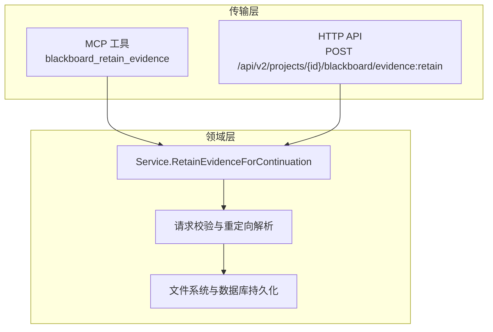
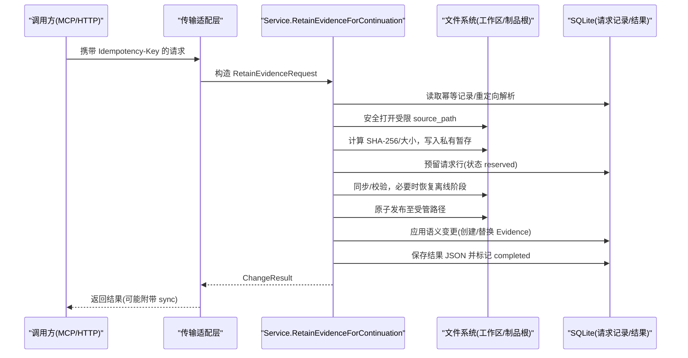
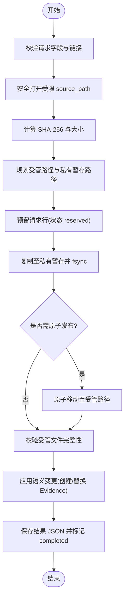
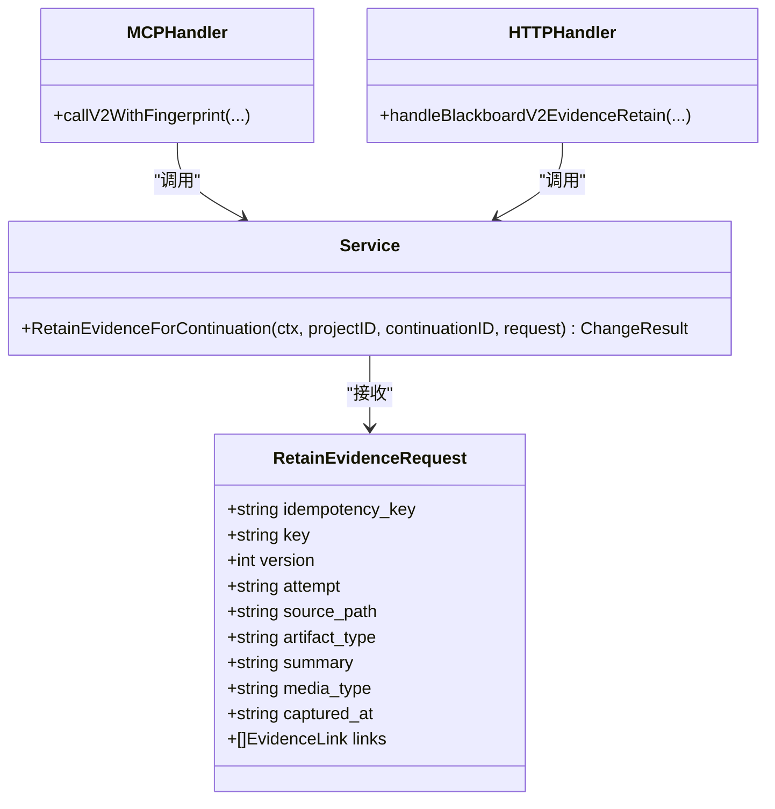

# blackboard_retain_evidence工具

<cite>
**本文引用的文件**   
- [internal/blackboardv2/evidence.go](file://internal/blackboardv2/evidence.go)
- [internal/daemon/blackboard_v2_http.go](file://internal/daemon/blackboard_v2_http.go)
- [internal/mcpserver/v2.go](file://internal/mcpserver/v2.go)
- [docs/specs/blackboard-v2-spec.md](file://docs/specs/blackboard-v2-spec.md)
- [internal/blackboardv2/evidence_service_test.go](file://internal/blackboardv2/evidence_service_test.go)
- [internal/mcpserver/v2_test.go](file://internal/mcpserver/v2_test.go)
- [internal/pentestctl/blackboard_v2_cli_test.go](file://internal/pentestctl/blackboard_v2_cli_test.go)
</cite>

## 目录
1. [简介](#简介)
2. [项目结构](#项目结构)
3. [核心组件](#核心组件)
4. [架构总览](#架构总览)
5. [详细组件分析](#详细组件分析)
6. [依赖关系分析](#依赖关系分析)
7. [性能与可靠性](#性能与可靠性)
8. [安全与访问控制](#安全与访问控制)
9. [证据检索与验证最佳实践](#证据检索与验证最佳实践)
10. [故障排查指南](#故障排查指南)
11. [结论](#结论)

## 简介
blackboard_retain_evidence 是 Blackboard v2 语义系统中的“保留证据”工具，用于在受控的运行时环境中将二进制或文本产物作为可审计的证据持久化，并建立与实体、发现等记录的关联。该工具由 MCP 服务暴露为可信工具，也可通过 HTTP API 调用；其请求体采用冻结的契约定义，确保字段严格校验与向后兼容。

## 项目结构
- 领域层：证据保留的核心逻辑位于 blackboardv2 包，包含请求结构、校验、存储路径规划、幂等与并发控制、完整性校验、生命周期管理等。
- 传输层：
  - MCP 工具：MCP Server 注册 blackboard_retain_evidence，对参数进行契约校验后转发到领域服务。
  - HTTP API：Daemon 提供 POST /api/v2/projects/{id}/blackboard/evidence:retain，要求 Idempotency-Key 头与受限的请求体。
- 规范文档：specs/blackboard-v2-spec.md 定义了证据保留请求的语义与约束。

图表来源
- [internal/mcpserver/v2.go:114-125](file://internal/mcpserver/v2.go#L114-L125)
- [internal/daemon/blackboard_v2_http.go:199-236](file://internal/daemon/blackboard_v2_http.go#L199-L236)
- [internal/blackboardv2/evidence.go:195-360](file://internal/blackboardv2/evidence.go#L195-L360)

章节来源
- [internal/mcpserver/v2.go:114-125](file://internal/mcpserver/v2.go#L114-L125)
- [internal/daemon/blackboard_v2_http.go:199-236](file://internal/daemon/blackboard_v2_http.go#L199-L236)
- [internal/blackboardv2/evidence.go:195-360](file://internal/blackboardv2/evidence.go#L195-L360)
- [docs/specs/blackboard-v2-spec.md:269-273](file://docs/specs/blackboard-v2-spec.md#L269-L273)

## 核心组件
- RetainEvidenceRequest：冻结的请求结构体，包含幂等键、证据键、版本（可选）、产生 Attempt、受限 source_path、artifact_type、summary，以及可选 media_type、captured_at、links。
- EvidenceLink：[relation, target_key] 二元组，仅允许 evidences 与 about 两种关系类型。
- Service.RetainEvidenceForContinuation：主流程入口，负责校验、权限检查、源文件安全打开、内容摘要计算、临时与受管路径规划、原子发布、语义提交与结果落盘。

章节来源
- [internal/blackboardv2/evidence.go:78-90](file://internal/blackboardv2/evidence.go#L78-L90)
- [internal/blackboardv2/evidence.go:61-75](file://internal/blackboardv2/evidence.go#L61-L75)
- [internal/blackboardv2/evidence.go:195-360](file://internal/blackboardv2/evidence.go#L195-L360)

## 架构总览
从调用方到领域服务的完整调用链如下：

图表来源
- [internal/mcpserver/v2.go:114-125](file://internal/mcpserver/v2.go#L114-L125)
- [internal/daemon/blackboard_v2_http.go:199-236](file://internal/daemon/blackboard_v2_http.go#L199-L236)
- [internal/blackboardv2/evidence.go:195-360](file://internal/blackboardv2/evidence.go#L195-L360)

## 详细组件分析

### RetainEvidenceRequest 字段定义
- idempotency_key：必填，幂等键，用于精确重试与去重。
- key：必填，证据键，唯一标识一条证据记录。
- version：可选，正整数；当 key 已存在时用于替换控制。
- attempt：必填，产生证据的 Attempt 键，必须为当前且 open。
- source_path：必填，受限路径，仅允许指向 Task 的 workdir/artifacts 下的常规文件。
- artifact_type：必填，证据分类（如 text、terminal_capture 等）。
- summary：必填，人类可读的简要说明。
- media_type：可选，MIME 类型，非空字符串。
- captured_at：可选，RFC3339 时间戳。
- links：可选，数组，元素为 [relation, target_key]，relation 仅允许 evidences 或 about。

注意：
- 未知字段将被拒绝。
- 空字符串、null、非法类型均会触发 invalid_schema 或 semantic_validation 错误。
- links 中每个 target_key 必须存在且类型合法。

章节来源
- [internal/blackboardv2/evidence.go:78-90](file://internal/blackboardv2/evidence.go#L78-L90)
- [internal/blackboardv2/evidence.go:94-161](file://internal/blackboardv2/evidence.go#L94-L161)
- [internal/blackboardv2/evidence.go:476-517](file://internal/blackboardv2/evidence.go#L476-L517)
- [docs/specs/blackboard-v2-spec.md:269-273](file://docs/specs/blackboard-v2-spec.md#L269-L273)

### 证据上传与处理流程
- 输入限制：HTTP 请求体上限 4 MiB；MCP 侧使用冻结 schema 校验。
- 源文件安全：
  - 仅允许相对路径或限定绝对前缀（/task/workdir、/task/artifacts），禁止符号链接与非普通文件。
  - 打开期间检测 inode/dev 一致性，防止替换竞态。
- 内容摘要：流式计算 SHA-256，记录 size。
- 路径规划：
  - 受管路径基于 project digest + sha256 + basename，保证内容寻址与命名安全。
  - 私有暂存路径按 continuationID+key 作用域隔离，避免命名冲突。
- 幂等与并发：
  - 首次调用预留请求行（reserved），后续相同 idempotency_key 且语义一致直接返回缓存结果。
  - 并发竞争下，若检测到 idempotency_conflict 或 evidence_source_changed 则失败。
- 发布与提交：
  - 先写入私有暂存，fsync 后再原子移动到受管路径。
  - 完成语义提交后，持久化结果 JSON，支持离线恢复与精确重试。

图表来源
- [internal/blackboardv2/evidence.go:195-360](file://internal/blackboardv2/evidence.go#L195-L360)
- [internal/blackboardv2/evidence.go:540-608](file://internal/blackboardv2/evidence.go#L540-L608)
- [internal/blackboardv2/evidence.go:705-773](file://internal/blackboardv2/evidence.go#L705-L773)
- [internal/blackboardv2/evidence.go:788-823](file://internal/blackboardv2/evidence.go#L788-L823)

章节来源
- [internal/blackboardv2/evidence.go:195-360](file://internal/blackboardv2/evidence.go#L195-L360)
- [internal/blackboardv2/evidence.go:540-608](file://internal/blackboardv2/evidence.go#L540-L608)
- [internal/blackboardv2/evidence.go:705-773](file://internal/blackboardv2/evidence.go#L705-L773)
- [internal/blackboardv2/evidence.go:788-823](file://internal/blackboardv2/evidence.go#L788-L823)

### 二进制与文本内容处理示例
- 文本内容：
  - 在 Task 的 workdir 下准备 proof.txt，设置 artifact_type=text，media_type=text/plain，links 可关联目标实体。
- 二进制内容：
  - 在 artifacts 目录下放置截图或日志归档，设置合适的 artifact_type 与 media_type，links 可关联发现项。
- 幂等重试：
  - 同一 idempotency_key 重复调用，若语义一致将返回已缓存的结果；若语义不同则返回 idempotency_conflict。

章节来源
- [internal/mcpserver/v2_test.go:382-400](file://internal/mcpserver/v2_test.go#L382-L400)
- [internal/pentestctl/blackboard_v2_cli_test.go:262-273](file://internal/pentestctl/blackboard_v2_cli_test.go#L262-L273)
- [internal/blackboardv2/evidence.go:211-234](file://internal/blackboardv2/evidence.go#L211-L234)

### 证据的生命周期管理与存储策略
- 生命周期状态：
  - reserved：已预留请求行，等待文件发布。
  - published：文件已发布至受管路径，待语义提交。
  - completed：语义提交完成，结果已持久化。
- 存储策略：
  - 受管路径：artifacts/<project_digest>/retained/<sha256>/<basename>，内容寻址，不可变。
  - 私有暂存：<project_root>/.evidence-staging/<scope>/<request_hash>，按作用域隔离，避免命名冲突。
  - 迁移兼容：支持历史 v24/v27 临时路径恢复与清理。
- 回收与清理：
  - 当证据被替换或不再被任何事实引用时，系统会回收共享负载并删除旧文件。
  - 回收过程具备失败点注入测试，确保跨重启可恢复。

章节来源
- [internal/blackboardv2/evidence.go:705-773](file://internal/blackboardv2/evidence.go#L705-L773)
- [internal/blackboardv2/evidence.go:788-823](file://internal/blackboardv2/evidence.go#L788-L823)
- [internal/blackboardv2/evidence.go:1291-1316](file://internal/blackboardv2/evidence.go#L1291-L1316)
- [internal/blackboardv2/evidence.go:1983-1999](file://internal/blackboardv2/evidence.go#L1983-L1999)
- [internal/blackboardv2/evidence_service_test.go:1911-1970](file://internal/blackboardv2/evidence_service_test.go#L1911-L1970)
- [internal/blackboardv2/evidence_service_test.go:2573-2676](file://internal/blackboardv2/evidence_service_test.go#L2573-L2676)

### 安全性考虑与访问控制机制
- 身份与授权：
  - 仅接受来自可信 Continuation 的调用，HTTP 需要 Bearer Token 或本地操作者模式；查询串 token 不被接受。
  - 校验 Project ID 与 Grant 绑定，拒绝越权访问。
- 源文件边界：
  - 仅允许访问 Task 的 workdir/artifacts 子树，禁止符号链接与目录穿越。
  - 打开文件时校验 inode/dev，防止替换竞态。
- 输出隔离：
  - 响应 DTO 不泄露 Project/Task/Continuation 内部标识，仅返回语义结果。
- 幂等与同步：
  - 通过 Idempotency-Key 与指纹实现精确重试与同步附件，避免重复提交。

章节来源
- [internal/daemon/blackboard_v2_http.go:52-95](file://internal/daemon/blackboard_v2_http.go#L52-L95)
- [internal/daemon/blackboard_v2_http.go:199-236](file://internal/daemon/blackboard_v2_http.go#L199-L236)
- [internal/mcpserver/v2.go:208-248](file://internal/mcpserver/v2.go#L208-L248)
- [internal/blackboardv2/evidence.go:540-608](file://internal/blackboardv2/evidence.go#L540-L608)
- [internal/mcpserver/v2_test.go:395-400](file://internal/mcpserver/v2_test.go#L395-L400)

### 证据检索与验证最佳实践
- 读取当前证据：
  - 使用 ReadCurrent 接口获取证据详情，包括 managed_path、digest、size、status 等。
- 历史回溯：
  - 使用 ReadHistory 查看证据版本与变更轨迹。
- 健康检查：
  - 使用 Health 接口检测证据完整性缺失或损坏情况。
- 验证建议：
  - 对比 managed_path 对应的文件 SHA-256 与记录值，确保未被篡改。
  - 关注 status=missing 的情况，结合健康诊断定位问题。

章节来源
- [internal/daemon/blackboard_v2_http.go:161-197](file://internal/daemon/blackboard_v2_http.go#L161-L197)
- [internal/daemon/blackboard_v2_http.go:144-159](file://internal/daemon/blackboard_v2_http.go#L144-L159)
- [internal/blackboardv2/evidence_service_test.go:698-746](file://internal/blackboardv2/evidence_service_test.go#L698-L746)
- [internal/blackboardv2/health_service_test.go:548-615](file://internal/blackboardv2/health_service_test.go#L548-L615)

## 依赖关系分析
- 传输层依赖领域层：
  - MCP 工具与 HTTP 路由均调用 Service.RetainEvidenceForContinuation。
- 领域层依赖：
  - 数据库：持久化请求行、结果 JSON、幂等收据。
  - 文件系统：读写受限源文件、私有暂存与受管路径。
  - 校验器：冻结 schema 与自定义语义校验。

图表来源
- [internal/mcpserver/v2.go:114-125](file://internal/mcpserver/v2.go#L114-L125)
- [internal/daemon/blackboard_v2_http.go:199-236](file://internal/daemon/blackboard_v2_http.go#L199-L236)
- [internal/blackboardv2/evidence.go:78-90](file://internal/blackboardv2/evidence.go#L78-L90)

章节来源
- [internal/mcpserver/v2.go:114-125](file://internal/mcpserver/v2.go#L114-L125)
- [internal/daemon/blackboard_v2_http.go:199-236](file://internal/daemon/blackboard_v2_http.go#L199-L236)
- [internal/blackboardv2/evidence.go:78-90](file://internal/blackboardv2/evidence.go#L78-L90)

## 性能与可靠性
- 性能特性：
  - 流式哈希与分块拷贝，避免一次性加载大文件。
  - 私有暂存与作用域隔离减少锁竞争。
- 可靠性保障：
  - 多阶段 fsync 与原子移动，确保崩溃恢复。
  - 幂等收据与结果 JSON 持久化，支持离线恢复与精确重试。
  - 并发竞争检测与回滚，避免脏写。

章节来源
- [internal/blackboardv2/evidence.go:195-360](file://internal/blackboardv2/evidence.go#L195-L360)
- [internal/blackboardv2/evidence.go:1291-1316](file://internal/blackboardv2/evidence.go#L1291-L1316)
- [internal/blackboardv2/evidence_service_test.go:1021-1088](file://internal/blackboardv2/evidence_service_test.go#L1021-L1088)

## 安全与访问控制
- 认证与授权：
  - 仅信任 Continuation Interface Grant，拒绝未授权或过期令牌。
  - 操作者模式需显式配置，否则所有写操作均需令牌。
- 数据边界：
  - 源文件路径严格受限，禁止符号链接与目录穿越。
  - 响应 DTO 不包含内部标识，防止信息泄露。
- 幂等与同步：
  - 通过 Idempotency-Key 与指纹确保精确重试与同步附件的一致性。

章节来源
- [internal/daemon/blackboard_v2_http.go:52-95](file://internal/daemon/blackboard_v2_http.go#L52-L95)
- [internal/mcpserver/v2.go:208-248](file://internal/mcpserver/v2.go#L208-L248)
- [internal/blackboardv2/evidence.go:540-608](file://internal/blackboardv2/evidence.go#L540-L608)
- [internal/mcpserver/v2_test.go:395-400](file://internal/mcpserver/v2_test.go#L395-L400)

## 证据检索与验证最佳实践
- 读取与历史：
  - 使用 ReadCurrent 与 ReadHistory 获取证据详情与版本轨迹。
- 健康诊断：
  - 使用 Health 接口检测 missing 或 integrity_failed 状态。
- 验证步骤：
  - 对比 managed_path 对应文件的 SHA-256 与记录值。
  - 检查 links 中的目标是否存在且类型合法。
  - 对于 critical 证据，建议在报告生成前进行二次校验。

章节来源
- [internal/daemon/blackboard_v2_http.go:161-197](file://internal/daemon/blackboard_v2_http.go#L161-L197)
- [internal/daemon/blackboard_v2_http.go:144-159](file://internal/daemon/blackboard_v2_http.go#L144-L159)
- [internal/blackboardv2/evidence_service_test.go:698-746](file://internal/blackboardv2/evidence_service_test.go#L698-L746)
- [internal/blackboardv2/health_service_test.go:548-615](file://internal/blackboardv2/health_service_test.go#L548-L615)

## 故障排查指南
- 常见错误码：
  - authority_denied：未通过授权或令牌无效。
  - invalid_schema：请求体或字段不符合冻结 schema。
  - idempotency_conflict：相同幂等键但语义不一致。
  - evidence_source_changed：源文件在重试过程中发生变化。
  - evidence_integrity_failed：受管文件完整性校验失败。
  - closed_continuation：Continuation 已关闭，不允许新写入。
- 排查步骤：
  - 检查 Idempotency-Key 与请求体是否一致。
  - 确认 source_path 是否在受限范围内且文件未被替换。
  - 查看 Health 接口输出，定位 missing 或 integrity_failed 的证据。
  - 使用 History 接口回溯证据版本与变更。

章节来源
- [internal/daemon/blackboard_v2_http.go:612-642](file://internal/daemon/blackboard_v2_http.go#L612-L642)
- [internal/blackboardv2/evidence.go:476-517](file://internal/blackboardv2/evidence.go#L476-L517)
- [internal/blackboardv2/evidence_service_test.go:23-116](file://internal/blackboardv2/evidence_service_test.go#L23-L116)

## 结论
blackboard_retain_evidence 提供了安全、可靠、幂等的证据保留能力，适用于渗透测试与审计场景。通过冻结的契约、严格的源文件边界、内容寻址的存储策略以及完善的幂等与恢复机制，确保了证据的可追溯性与完整性。建议在生产环境中结合健康诊断与历史回溯，定期验证关键证据的可用性。