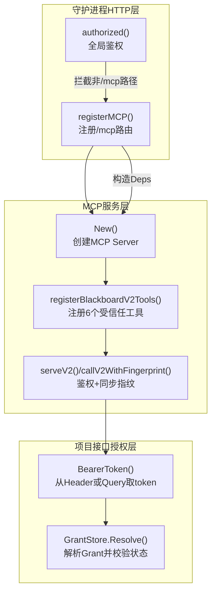
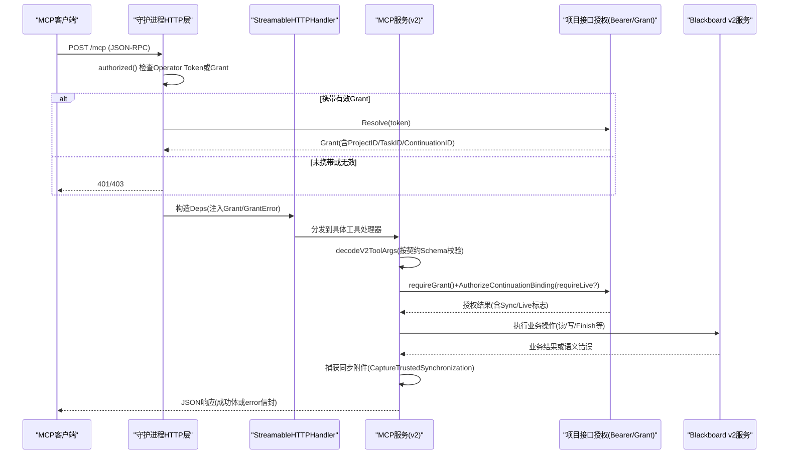
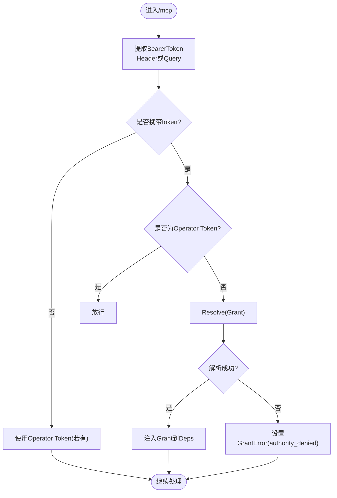
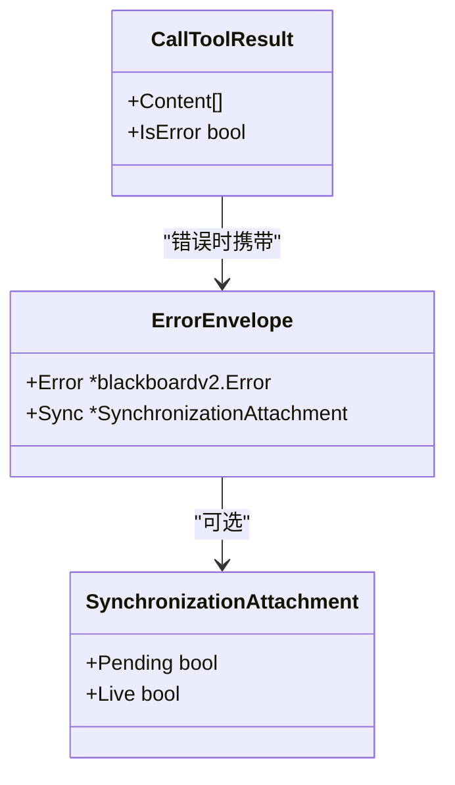
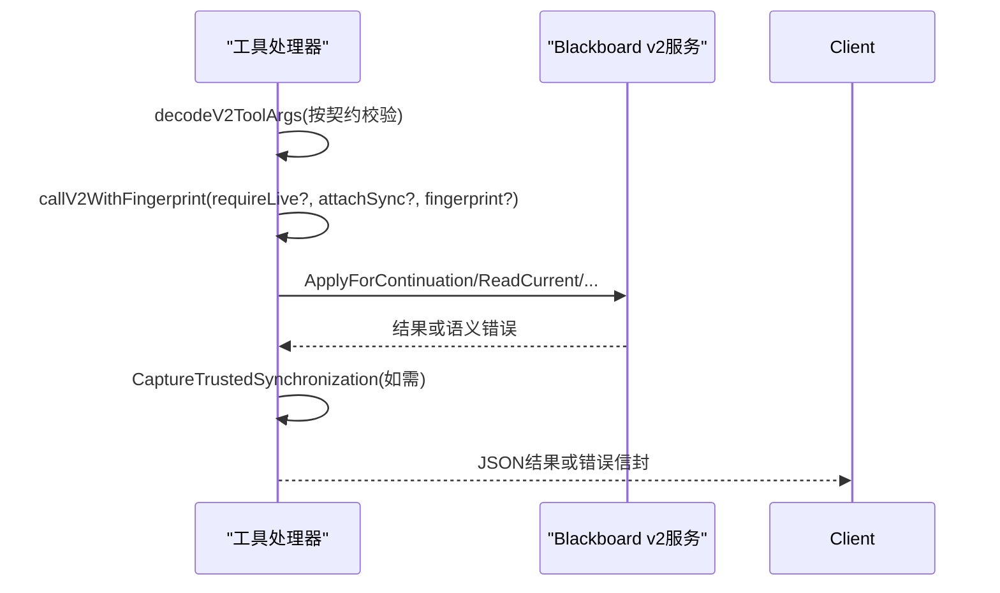
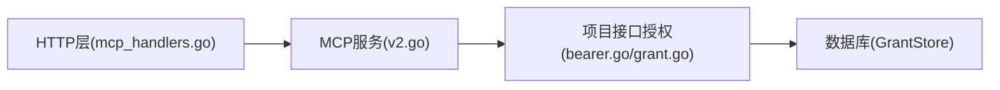

# MCP协议处理

<cite>
**本文引用的文件**
- [mcp_handlers.go](file://internal/daemon/mcp_handlers.go)
- [server.go](file://internal/daemon/server.go)
- [v2.go](file://internal/mcpserver/v2.go)
- [bearer.go](file://internal/projectinterface/bearer.go)
- [grant.go](file://internal/projectinterface/grant.go)
- [errors.go](file://internal/projectinterface/errors.go)
- [mcp_test.go](file://internal/daemon/mcp_test.go)
- [trusted_mcp_smoke_test.go](file://internal/daemon/trusted_mcp_smoke_test.go)
</cite>

## 目录
1. [简介](#简介)
2. [项目结构](#项目结构)
3. [核心组件](#核心组件)
4. [架构总览](#架构总览)
5. [详细组件分析](#详细组件分析)
6. [依赖关系分析](#依赖关系分析)
7. [性能与流式特性](#性能与流式特性)
8. [故障排查指南](#故障排查指南)
9. [结论](#结论)
10. [附录：客户端连接与调试](#附录客户端连接与调试)

## 简介
本文件聚焦于Model Context Protocol（MCP）在本项目中的HTTP流式处理实现，围绕以下主题展开：
- HTTP流式处理与无状态会话管理
- 请求认证与授权机制（Bearer Token、Continuation Interface Grant）
- StreamableHTTPHandler配置项与本地主机保护禁用原因
- JSON响应格式与错误传播机制
- 项目接口授权解析与权限控制策略
- MCP客户端连接示例与调试方法

## 项目结构
与MCP协议处理直接相关的代码主要分布在三个层次：
- 守护进程HTTP层：注册MCP路由、鉴权中间逻辑、StreamableHTTPHandler配置
- MCP服务层：基于SDK的MCP Server，注册受信任工具、参数校验、调用Blackboard v2
- 项目接口授权层：Bearer Token提取、Grant签发与解析、生命周期与权限判定

图表来源
- [mcp_handlers.go:14-43](file://internal/daemon/mcp_handlers.go#L14-L43)
- [server.go:431-461](file://internal/daemon/server.go#L431-L461)
- [v2.go:34-44](file://internal/mcpserver/v2.go#L34-L44)
- [v2.go:46-156](file://internal/mcpserver/v2.go#L46-L156)
- [v2.go:194-248](file://internal/mcpserver/v2.go#L194-L248)
- [bearer.go:14-21](file://internal/projectinterface/bearer.go#L14-L21)
- [grant.go:284-302](file://internal/projectinterface/grant.go#L284-L302)

章节来源
- [mcp_handlers.go:14-43](file://internal/daemon/mcp_handlers.go#L14-L43)
- [server.go:431-461](file://internal/daemon/server.go#L431-L461)

## 核心组件
- StreamableHTTPHandler配置
  - 无状态模式：Stateless=true，每个请求独立处理，不维护长连接会话状态
  - JSON响应：JSONResponse=true，统一返回结构化JSON
  - 禁用本地主机保护：DisableLocalhostProtection=true，允许来自host.docker.internal的请求通过，避免沙箱访问被拒
- MCP服务注册
  - 仅注册六个受信任的Blackboard v2工具，输入参数使用冻结契约的Schema严格校验
  - 所有工具调用均经过统一的鉴权与同步指纹流程
- 项目接口授权
  - 支持Authorization: Bearer <token>与?token=<token>两种传递方式
  - 通过GrantStore.Resolve将明文token转换为不可变执行上下文（ProjectID/TaskID/ContinuationID等），并校验Grant状态

章节来源
- [mcp_handlers.go:35-41](file://internal/daemon/mcp_handlers.go#L35-L41)
- [v2.go:34-44](file://internal/mcpserver/v2.go#L34-L44)
- [v2.go:46-156](file://internal/mcpserver/v2.go#L46-L156)
- [bearer.go:14-21](file://internal/projectinterface/bearer.go#L14-L21)
- [grant.go:284-302](file://internal/projectinterface/grant.go#L284-L302)

## 架构总览
下图展示了从HTTP请求到MCP工具调用的完整链路，包括鉴权、授权、参数校验、同步指纹与错误封装。

图表来源
- [server.go:431-461](file://internal/daemon/server.go#L431-L461)
- [mcp_handlers.go:14-43](file://internal/daemon/mcp_handlers.go#L14-L43)
- [v2.go:168-192](file://internal/mcpserver/v2.go#L168-L192)
- [v2.go:194-248](file://internal/mcpserver/v2.go#L194-L248)
- [grant.go:284-302](file://internal/projectinterface/grant.go#L284-L302)

## 详细组件分析

### StreamableHTTPHandler配置与本地主机保护
- Stateless=true：确保每个请求独立处理，适合沙箱内短连接场景
- JSONResponse=true：强制以JSON形式返回，便于上层统一解析与错误传播
- DisableLocalhostProtection=true：默认会拒绝Host为回环地址的请求；由于沙箱通过host.docker.internal访问宿主，必须显式禁用该保护，否则会被误判为本地攻击而返回403

章节来源
- [mcp_handlers.go:35-41](file://internal/daemon/mcp_handlers.go#L35-L41)
- [mcp_test.go:33-46](file://internal/daemon/mcp_test.go#L33-L46)

### 无状态会话管理与请求认证
- 全局鉴权函数authorized()优先检查Operator Token（Authorization: Bearer或?token=）
- 若存在Continuation Interface Grant token且当前端点为Blackboard v2 HTTP或/mcp，则尝试Resolve并作为更细粒度的授权凭据
- 对Operator Token采用常量时间比较，防止时序侧信道泄露

章节来源
- [server.go:431-461](file://internal/daemon/server.go#L431-L461)

### Bearer Token验证流程
- 支持两种来源：Authorization: Bearer <token>与URL查询参数?token=
- 在MCP路径下，若未提供Operator Token或提供的不是Operator Token，则尝试将其作为Continuation Interface Grant进行解析
- Grant解析成功后，将绑定ProjectID/TaskID/ContinuationID注入到MCP服务的Deps中

图表来源
- [bearer.go:14-21](file://internal/projectinterface/bearer.go#L14-L21)
- [server.go:431-461](file://internal/daemon/server.go#L431-L461)
- [mcp_handlers.go:19-33](file://internal/daemon/mcp_handlers.go#L19-L33)
- [grant.go:284-302](file://internal/projectinterface/grant.go#L284-L302)

### 项目接口授权解析与权限控制策略
- Grant包含ProjectID/TaskID/ContinuationID等绑定上下文，禁止由调用方伪造
- Grant状态机：open/finished/revoked/terminal
  - open：允许新写入
  - finished/terminal：允许读取与精确重放，但拒绝新写入
  - revoked：完全拒绝
- 工具调用前会再次校验Grant可读性，并通过AuthorizeContinuationBinding确认是否允许“实时”读取或仅允许历史回放

章节来源
- [grant.go:88-149](file://internal/projectinterface/grant.go#L88-L149)
- [grant.go:284-302](file://internal/projectinterface/grant.go#L284-L302)
- [v2.go:208-248](file://internal/mcpserver/v2.go#L208-L248)

### JSON响应格式与错误传播机制
- 成功响应：工具返回对象被序列化为JSON文本，放入Content字段
- 错误响应：统一封装为{ error, sync? }信封，IsError=true，便于上层识别
- 同步附件：当attachSync=true时，会在响应中附带sync字段，用于幂等重放与一致性保障
- 参数校验失败：始终返回invalid_schema错误，避免泄露SDK内部细节

图表来源
- [v2.go:260-303](file://internal/mcpserver/v2.go#L260-L303)
- [v2.go:168-192](file://internal/mcpserver/v2.go#L168-L192)

### 受信任工具与调用流程
- 仅暴露六个受信任工具：blackboard_change、blackboard_read、blackboard_history、blackboard_retain_evidence、blackboard_checkpoint_attempt、blackboard_finish
- 每个工具处理器：
  - 使用冻结契约Schema校验参数
  - 根据工具类型决定是否要求实时能力（requireLive）
  - 对于可重放的操作，附加同步指纹以支持精确重放
  - 调用Blackboard v2服务并封装结果或错误

图表来源
- [v2.go:46-156](file://internal/mcpserver/v2.go#L46-L156)
- [v2.go:194-248](file://internal/mcpserver/v2.go#L194-L248)

章节来源
- [v2.go:46-156](file://internal/mcpserver/v2.go#L46-L156)
- [v2.go:168-192](file://internal/mcpserver/v2.go#L168-L192)
- [v2.go:194-248](file://internal/mcpserver/v2.go#L194-L248)

## 依赖关系分析
- 守护进程HTTP层依赖MCP服务层，负责路由与鉴权
- MCP服务层依赖项目接口授权层，负责Grant解析与权限判定
- 项目接口授权层依赖数据库存储，负责Grant持久化与状态机

图表来源
- [mcp_handlers.go:14-43](file://internal/daemon/mcp_handlers.go#L14-L43)
- [v2.go:34-44](file://internal/mcpserver/v2.go#L34-L44)
- [bearer.go:14-21](file://internal/projectinterface/bearer.go#L14-L21)
- [grant.go:169-190](file://internal/projectinterface/grant.go#L169-L190)

章节来源
- [mcp_handlers.go:14-43](file://internal/daemon/mcp_handlers.go#L14-L43)
- [v2.go:34-44](file://internal/mcpserver/v2.go#L34-L44)
- [grant.go:169-190](file://internal/projectinterface/grant.go#L169-L190)

## 性能与流式特性
- 无状态模式减少服务端会话开销，提高吞吐与水平扩展能力
- JSONResponse简化序列化路径，降低网络传输复杂度
- 同步附件与幂等指纹支持可靠重试，避免重复写入与数据不一致
- 沙箱环境通过host.docker.internal访问宿主，禁用本地主机保护可减少额外代理开销

[本节为通用指导，无需源码引用]

## 故障排查指南
- 403 Forbidden（Host头为host.docker.internal）
  - 现象：沙箱访问被拒绝
  - 原因：默认启用本地主机保护
  - 解决：已配置DisableLocalhostProtection=true
- 401/403 Unauthorized
  - 现象：缺少Operator Token或Grant无效
  - 排查：确认Authorization或?token=是否正确；检查Grant是否已被撤销或关闭
- invalid_schema
  - 现象：工具参数不符合契约Schema
  - 排查：对照冻结契约定义修正参数结构与类型
- authority_denied
  - 现象：Grant无效或不可读
  - 排查：确认Grant状态是否为open/readable；检查绑定上下文是否与目标资源一致

章节来源
- [mcp_test.go:33-46](file://internal/daemon/mcp_test.go#L33-L46)
- [v2.go:168-192](file://internal/mcpserver/v2.go#L168-L192)
- [v2.go:208-248](file://internal/mcpserver/v2.go#L208-L248)
- [grant.go:88-149](file://internal/projectinterface/grant.go#L88-L149)

## 结论
本项目MCP实现采用无状态HTTP流式处理，结合Operator Token与Continuation Interface Grant双重认证授权，确保沙箱运行时的最小权限与强隔离。通过冻结契约Schema与统一错误信封，提升了安全性与可观测性。同步附件与幂等指纹进一步保障了操作的可靠性与一致性。

[本节为总结，无需源码引用]

## 附录：客户端连接与调试
- 健康检查
  - GET /health，返回中包含mcp.status与mcp.path，可用于快速验证MCP可用性
- 初始化与工具列表
  - POST /mcp，method="initialize"，随后tools/list列出受信任工具
- 使用SDK连接
  - 使用StreamableClientTransport连接到/mcp，并在URL中附带?token=或使用Authorization: Bearer
- 常见调试技巧
  - 打印JSON响应体，关注error信封与sync附件
  - 对比冻结契约Schema，定位invalid_schema问题
  - 检查Grant状态与绑定上下文，定位authority_denied问题

章节来源
- [mcp_test.go:11-31](file://internal/daemon/mcp_test.go#L11-L31)
- [mcp_test.go:48-100](file://internal/daemon/mcp_test.go#L48-L100)
- [trusted_mcp_smoke_test.go:250-282](file://internal/daemon/trusted_mcp_smoke_test.go#L250-L282)