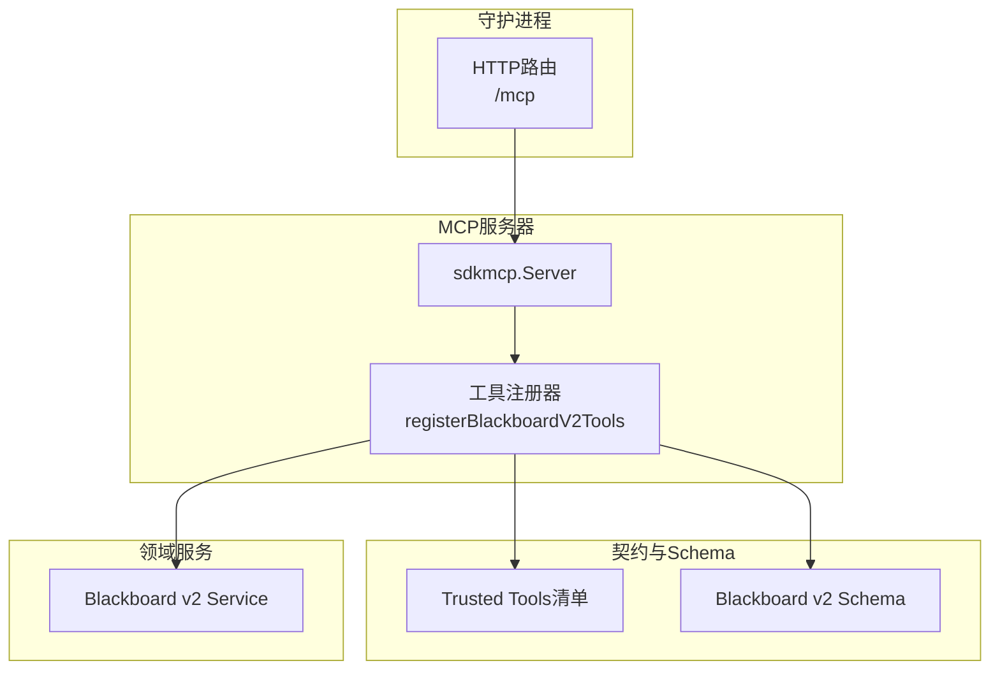
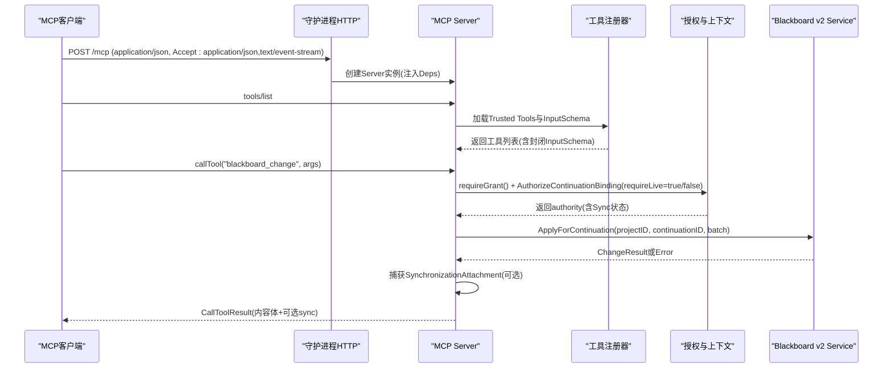
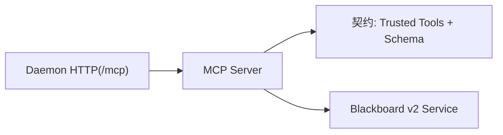

# MCP服务器集成

<cite>
**本文引用的文件**   
- [mcp_handlers.go](file://internal/daemon/mcp_handlers.go)
- [v2.go](file://internal/mcpserver/v2.go)
- [contract.go](file://internal/blackboardv2contract/contract.go)
- [trusted-tools.json](file://internal/blackboardv2contract/contractdata/trusted-tools.json)
- [blackboard-v2.schema.json](file://internal/blackboardv2contract/contractdata/schemas/blackboard-v2.schema.json)
- [service.go](file://internal/blackboardv2/service.go)
- [0014-use-one-versioned-blackboard-v2-project-interface.md](file://docs/adr/0014-use-one-versioned-blackboard-v2-project-interface.md)
- [smoke-sandbox-mcp-live.sh](file://scripts/smoke-sandbox-mcp-live.sh)
- [trusted_mcp_smoke_test.go](file://internal/daemon/trusted_mcp_smoke_test.go)
- [server_test.go](file://internal/mcpserver/server_test.go)
</cite>

## 目录
1. [简介](#简介)
2. [项目结构](#项目结构)
3. [核心组件](#核心组件)
4. [架构总览](#架构总览)
5. [详细组件分析](#详细组件分析)
6. [依赖关系分析](#依赖关系分析)
7. [性能与可靠性](#性能与可靠性)
8. [故障排查指南](#故障排查指南)
9. [结论](#结论)
10. [附录：六个Blackboard v2工具API规范](#附录六个blackboard-v2工具api规范)

## 简介
本文件面向MCP（Model Context Protocol）服务器的集成与使用，聚焦以下目标：
- 深入解析MCP服务器实现、Blackboard v2工具集暴露、运行时扩展接口与会话管理机制。
- 详细说明MCP协议握手过程、工具注册机制、消息路由与错误传播。
- 给出六个核心Blackboard v2工具的API规范、参数校验与返回值格式。
- 提供MCP客户端集成示例与调试技巧。

本项目为本地优先的渗透测试代理，包含Go守护进程、React仪表盘与沙箱化运行时。Blackboard v2作为语义记忆平面，通过MCP以“可信工具”形式向运行时暴露最小且稳定的接口面。

## 项目结构
与MCP集成相关的核心代码位于以下模块：
- Daemon HTTP层：负责将MCP端点挂载到HTTP服务，并处理能力令牌解析。
- MCP Server：基于官方SDK构建，按契约加载并注册六个Blackboard v2工具。
- Blackboard v2契约：冻结的JSON Schema与工具清单，保证输入输出稳定可验证。
- Blackboard v2服务：领域服务，承载原子变更、读取、历史、证据保留、检查点与结束等语义操作。

图表来源
- [mcp_handlers.go:14-43](file://internal/daemon/mcp_handlers.go#L14-L43)
- [v2.go:34-44](file://internal/mcpserver/v2.go#L34-L44)
- [contract.go:252-290](file://internal/blackboardv2contract/contract.go#L252-L290)
- [service.go:644-656](file://internal/blackboardv2/service.go#L644-L656)

章节来源
- [mcp_handlers.go:14-43](file://internal/daemon/mcp_handlers.go#L14-L43)
- [v2.go:34-44](file://internal/mcpserver/v2.go#L34-L44)
- [contract.go:252-290](file://internal/blackboardv2contract/contract.go#L252-L290)
- [service.go:644-656](file://internal/blackboardv2/service.go#L644-L656)

## 核心组件
- MCP服务端入口：在守护进程中注册HTTP处理器，创建MCP Server实例，并在请求级解析Continuation Interface Grant，注入Deps。
- 工具注册器：从冻结契约中加载六个可信工具及其输入Schema，逐个注册到MCP Server；所有调用走统一解码与授权流程。
- 契约与Schema：以嵌入资源的形式提供工具清单与JSON Schema，确保tools/list返回的InputSchema是封闭对象，避免泄露无关定义。
- 领域服务：提供ApplyForContinuation、ReadCurrent、ReadHistory、RetainEvidenceForContinuation、CheckpointAttemptForContinuation、FinishContinuation等方法，供工具调用。

章节来源
- [mcp_handlers.go:14-43](file://internal/daemon/mcp_handlers.go#L14-L43)
- [v2.go:46-156](file://internal/mcpserver/v2.go#L46-L156)
- [contract.go:74-110](file://internal/blackboardv2contract/contract.go#L74-L110)
- [service.go:644-656](file://internal/blackboardv2/service.go#L644-L656)

## 架构总览
下图展示了从HTTP请求到领域服务的完整链路，包括认证、授权、参数校验、同步附件与错误封装。

图表来源
- [mcp_handlers.go:14-43](file://internal/daemon/mcp_handlers.go#L14-L43)
- [v2.go:194-248](file://internal/mcpserver/v2.go#L194-L248)
- [service.go:644-656](file://internal/blackboardv2/service.go#L644-L656)

## 详细组件分析

### MCP服务器与HTTP挂载
- 在守护进程中将MCP端点挂载至/mcp，使用StreamableHTTPHandler，配置无状态、JSON响应、禁用本地回环保护（便于沙箱访问）。
- 每个请求解析Bearer Token，若启用Project Interface Grants则尝试Resolve得到Grant；失败时设置结构化GrantError以便后续工具返回权威拒绝错误。

章节来源
- [mcp_handlers.go:14-43](file://internal/daemon/mcp_handlers.go#L14-L43)

### 工具注册与输入Schema裁剪
- 从契约包加载Trusted Tools清单与主Schema，针对每个工具生成仅包含所需$defs的InputSchema，确保tools/list不泄露无关类型。
- 使用原始AddTool路径注册，使工具描述与Schema由契约驱动，同时调用侧进行严格校验，返回统一的invalid_schema错误信封。

章节来源
- [v2.go:46-156](file://internal/mcpserver/v2.go#L46-L156)
- [contract.go:126-165](file://internal/blackboardv2contract/contract.go#L126-L165)
- [contract.go:252-290](file://internal/blackboardv2contract/contract.go#L252-L290)

### 参数解码与错误传播
- decodeV2ToolArgs对空参数做规范化，先按冻结Schema校验再反序列化为DTO；失败一律返回invalid_schema错误，避免SDK内部文本泄漏。
- 所有工具调用进入serveV2，统一执行授权、续期同步声明、执行业务动作、捕获同步附件与错误封装。

章节来源
- [v2.go:168-192](file://internal/mcpserver/v2.go#L168-L192)
- [v2.go:208-248](file://internal/mcpserver/v2.go#L208-L248)

### 会话与授权模型
- 每个MCP请求级别解析Continuation Interface Grant，决定是否允许读/写以及是否要求live权限。
- 对于支持幂等重放的操作，使用requestFingerprint参与同步声明，确保下次认证后可投递完整的Runtime快照。

章节来源
- [v2.go:250-258](file://internal/mcpserver/v2.go#L250-L258)
- [v2.go:220-248](file://internal/mcpserver/v2.go#L220-L248)

### 领域服务调用
- change/read/history/retain_evidence/checkpoint_attempt/finish分别映射到Service对应方法，传入projectID与continuationID（来自Grant），不暴露任务/延续身份给模型侧。

章节来源
- [v2.go:71-156](file://internal/mcpserver/v2.go#L71-L156)
- [service.go:644-656](file://internal/blackboardv2/service.go#L644-L656)

## 依赖关系分析
- MCP Server依赖契约包提供的Trusted Tools清单与Schema，从而驱动工具注册与输入校验。
- MCP Server依赖Blackboard v2 Service完成语义变更与查询。
- Daemon HTTP层依赖Project Interface Grants解析能力令牌，并将结果注入MCP Server的Deps。

图表来源
- [mcp_handlers.go:14-43](file://internal/daemon/mcp_handlers.go#L14-L43)
- [v2.go:46-156](file://internal/mcpserver/v2.go#L46-L156)
- [contract.go:252-290](file://internal/blackboardv2contract/contract.go#L252-L290)
- [service.go:644-656](file://internal/blackboardv2/service.go#L644-L656)

章节来源
- [mcp_handlers.go:14-43](file://internal/daemon/mcp_handlers.go#L14-L43)
- [v2.go:46-156](file://internal/mcpserver/v2.go#L46-L156)
- [contract.go:252-290](file://internal/blackboardv2contract/contract.go#L252-L290)
- [service.go:644-656](file://internal/blackboardv2/service.go#L644-L656)

## 性能与可靠性
- 幂等性：change/retain_evidence/checkpoint_attempt/finish均接受idempotency_key，结合同步指纹支持丢失重试与精确重放。
- 同步附件：当存在待投递的同步时，可在下一次受信任响应中携带完整Runtime快照，即使语义操作未成功。
- 只读限制：read/history强制requireLive=true，关闭的Continuation无法读取当前知识，保障一致性。
- 错误信封：统一invalid_schema/authority_denied/internal等错误码，便于上层快速定位问题。

章节来源
- [v2.go:71-156](file://internal/mcpserver/v2.go#L71-L156)
- [v2.go:220-248](file://internal/mcpserver/v2.go#L220-L248)
- [0014-use-one-versioned-blackboard-v2-project-interface.md:1-4](file://docs/adr/0014-use-one-versioned-blackboard-v2-project-interface.md#L1-L4)

## 故障排查指南
- 连接与工具发现
  - 使用tools/list确认六个工具已正确注册。
  - 参考冒烟脚本，构造tools/list请求并通过容器内curl访问/mcp端点。
- 授权与能力令牌
  - 若未携带有效Continuation Interface capability，将收到authority_denied错误。
  - 检查守护进程是否启用了Project Interface Grants及token是否正确。
- 参数校验
  - invalid_schema表示arguments不符合冻结Schema；请对照InputSchema逐项核对必填字段与枚举值。
- 同步与重放
  - 若出现sync附件，说明存在跨任务的知识变更，建议拉取最新快照后再继续工作。
- 日志与断点
  - 在serveV2与decodeV2ToolArgs处增加日志，观察授权、同步声明与错误封装路径。

章节来源
- [smoke-sandbox-mcp-live.sh:29-60](file://scripts/smoke-sandbox-mcp-live.sh#L29-L60)
- [trusted_mcp_smoke_test.go:255-282](file://internal/daemon/trusted_mcp_smoke_test.go#L255-L282)
- [server_test.go:15-41](file://internal/mcpserver/server_test.go#L15-L41)
- [v2.go:168-192](file://internal/mcpserver/v2.go#L168-L192)
- [v2.go:208-248](file://internal/mcpserver/v2.go#L208-L248)

## 结论
MCP服务器以冻结契约为核心，将Blackboard v2的六个可信工具以最小、稳定、可验证的方式暴露给运行时。通过统一的授权、参数校验与同步附件机制，系统在保证一致性与幂等性的同时，提供了良好的可观测性与可排错性。

## 附录：六个Blackboard v2工具API规范

以下为六个可信工具的概览式规范，具体字段约束以冻结Schema为准。

- blackboard_change
  - 功能：对绑定项目应用一个atomic的semantic-change-batch/v2。
  - 输入：changeBatch（包含schema、idempotency_key、changes数组）。
  - 输出：changeResult（包含revision、records、relations、working_snapshot）。
  - 幂等：支持相同idempotency_key的重试重放。
  - 同步：可能附带sync附件。
  - 参考：[v2.go:71-84](file://internal/mcpserver/v2.go#L71-L84)、[service.go:644-656](file://internal/blackboardv2/service.go#L644-L656)、[trusted-tools.json:5-11](file://internal/blackboardv2contract/contractdata/trusted-tools.json#L5-L11)

- blackboard_read
  - 功能：按Blackboard Key读取当前完整记录与其当前关系。
  - 输入：readRequest（key）。
  - 输出：currentDetail（包含schema、revision、key、type、version、record、relationships）。
  - 限制：仅live读取；关闭的Continuation不可读当前知识。
  - 参考：[v2.go:85-99](file://internal/mcpserver/v2.go#L85-L99)、[trusted-tools.json:12-17](file://internal/blackboardv2contract/contractdata/trusted-tools.json#L12-L17)

- blackboard_history
  - 功能：按Key分页读取显式语义历史，默认limit=20，最大100。
  - 输入：historyRequest（key、cursor、limit）。
  - 输出：semanticHistory（包含schema、revision、key、items、next_cursor）。
  - 限制：仅live读取。
  - 参考：[v2.go:100-113](file://internal/mcpserver/v2.go#L100-L113)、[trusted-tools.json:18-23](file://internal/blackboardv2contract/contractdata/trusted-tools.json#L18-L23)

- blackboard_retain_evidence
  - 功能：保留由开放Attempt产生的受限证据，服务端派生managed_path、sha256、size等完整性字段。
  - 输入：retainEvidenceRequest（包含artifact_type、summary、source_path等）。
  - 输出：changeResult。
  - 幂等：支持idempotency_key。
  - 同步：可能附带sync附件。
  - 参考：[v2.go:114-125](file://internal/mcpserver/v2.go#L114-L125)、[trusted-tools.json:24-29](file://internal/blackboardv2contract/contractdata/trusted-tools.json#L24-L29)

- blackboard_checkpoint_attempt
  - 功能：对所属开放Attempt的版本化摘要，参与Pending同步。
  - 输入：checkpointAttemptRequest（包含idempotency_key、key、version、summary）。
  - 输出：changeResult。
  - 幂等：支持idempotency_key。
  - 同步：可能附带sync附件。
  - 参考：[v2.go:126-137](file://internal/mcpserver/v2.go#L126-L137)、[trusted-tools.json:30-35](file://internal/blackboardv2contract/contractdata/trusted-tools.json#L30-L35)

- blackboard_finish
  - 功能：在所有Attempt均为终态后结束绑定的Continuation；不接受Task Summary或结果拷贝。
  - 输入：finishRequest（包含idempotency_key）。
  - 输出：finishResult。
  - 幂等：支持idempotency_key。
  - 同步：可能附带sync附件。
  - 参考：[v2.go:138-151](file://internal/mcpserver/v2.go#L138-L151)、[trusted-tools.json:36-41](file://internal/blackboardv2contract/contractdata/trusted-tools.json#L36-L41)

章节来源
- [v2.go:71-151](file://internal/mcpserver/v2.go#L71-L151)
- [trusted-tools.json:1-44](file://internal/blackboardv2contract/contractdata/trusted-tools.json#L1-L44)
- [service.go:644-656](file://internal/blackboardv2/service.go#L644-L656)

## MCP客户端集成示例与调试技巧

- 基本连接与工具发现
  - 使用SDK建立连接后调用tools/list，确认六个工具名称与InputSchema。
  - 参考测试用例中的in-memory传输方式，便于本地联调。
- 调用工具
  - 根据InputSchema组装arguments，注意必填字段与枚举值。
  - 对写操作务必提供稳定的idempotency_key，以支持重试与重放。
- 处理同步附件
  - 若响应中包含sync字段，应拉取最新Runtime快照，再继续工作。
- 错误处理
  - invalid_schema：检查arguments是否符合冻结Schema。
  - authority_denied：检查Continuation Interface capability是否有效且未被撤销。
  - internal：服务端异常，需查看守护进程日志。
- 冒烟与端到端验证
  - 使用脚本在容器中发起tools/list，验证端口可达性与鉴权策略。
  - 在守护进程测试中验证工具集合与行为。

章节来源
- [server_test.go:15-41](file://internal/mcpserver/server_test.go#L15-L41)
- [trusted_mcp_smoke_test.go:255-282](file://internal/daemon/trusted_mcp_smoke_test.go#L255-L282)
- [smoke-sandbox-mcp-live.sh:29-60](file://scripts/smoke-sandbox-mcp-live.sh#L29-L60)