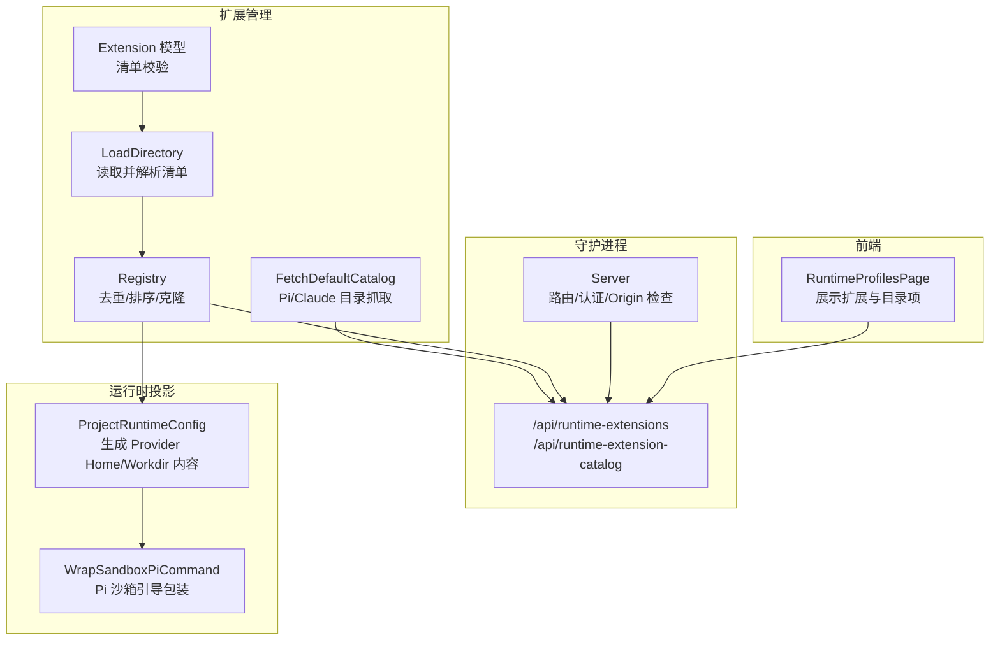
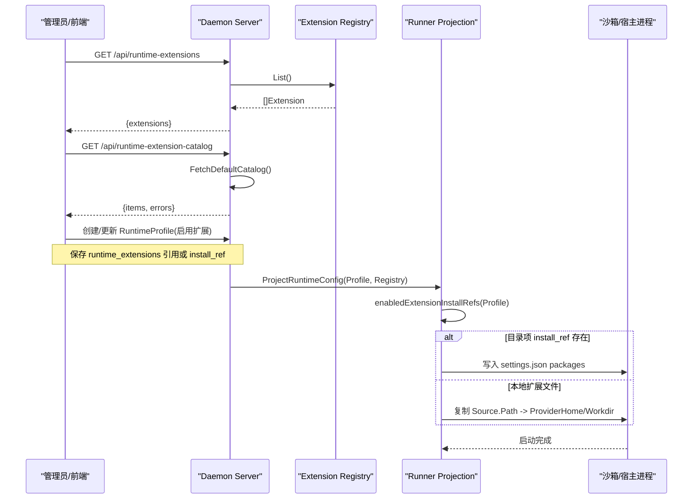
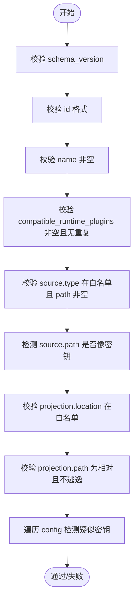
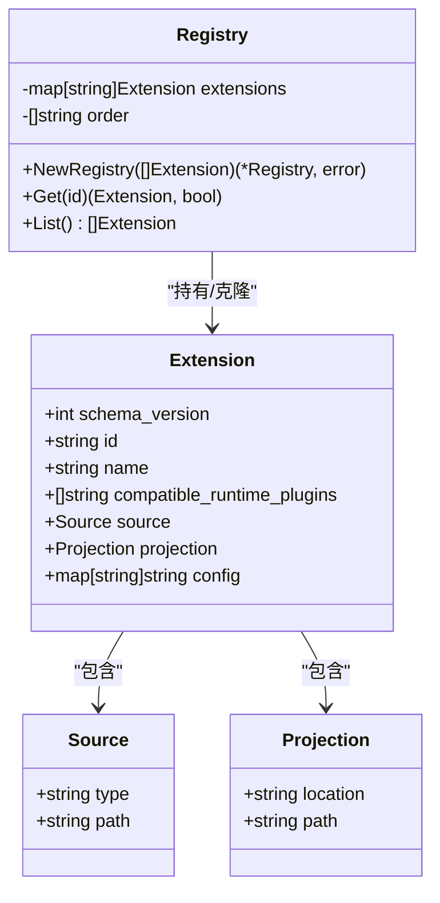
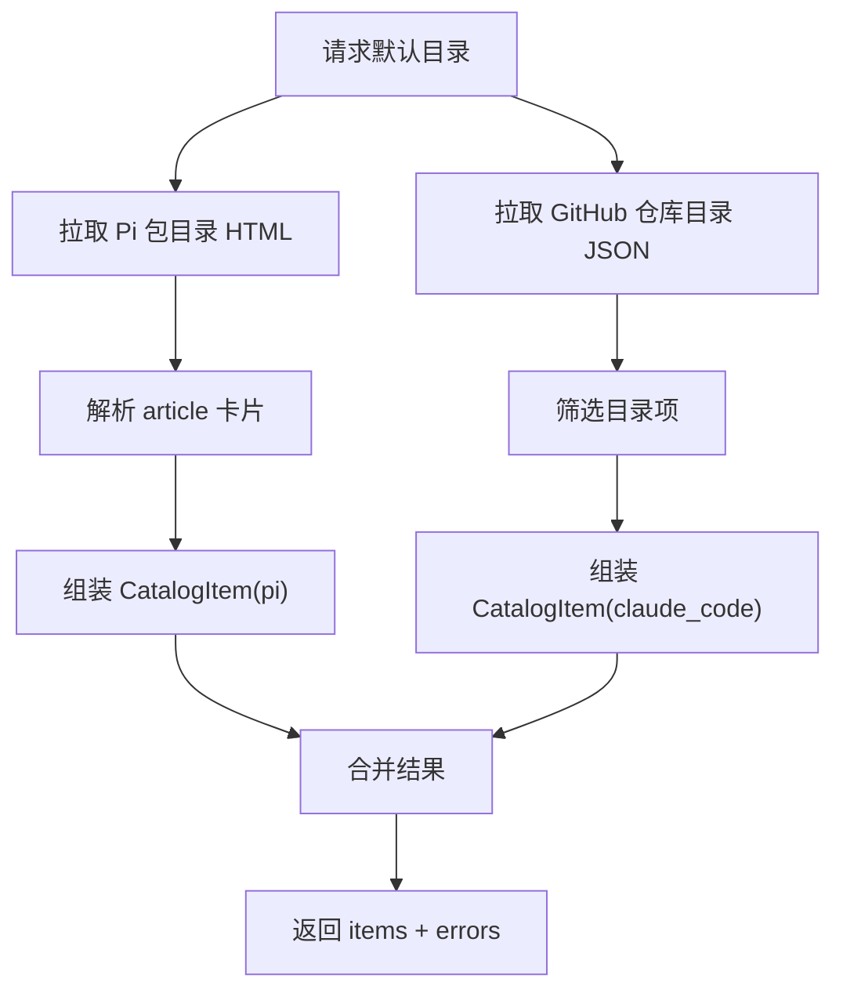
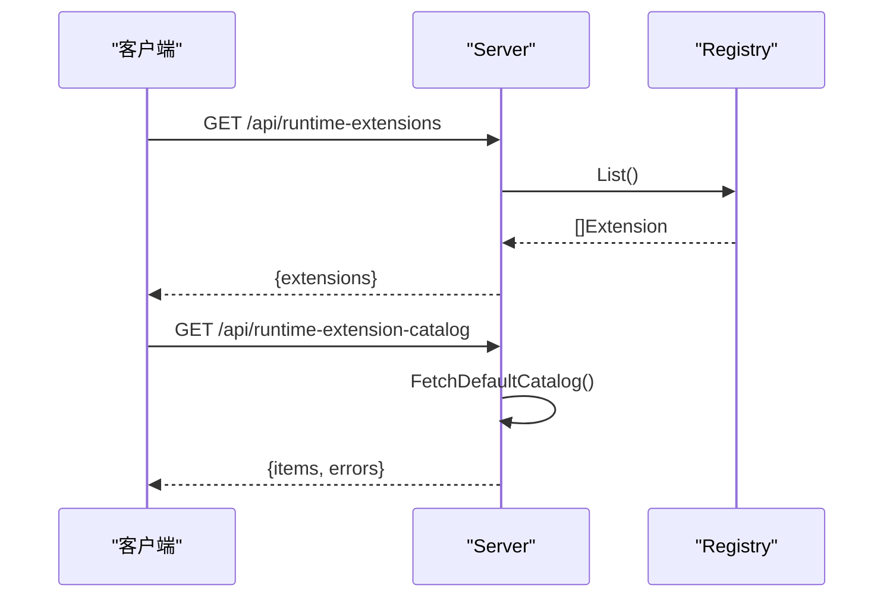
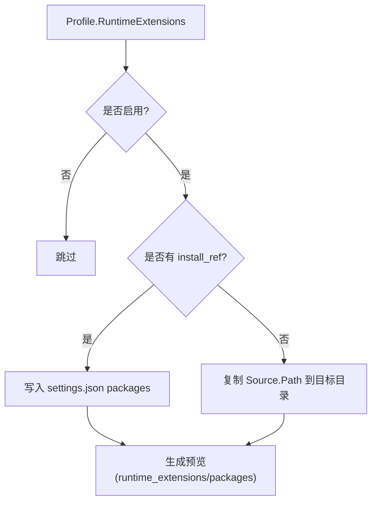
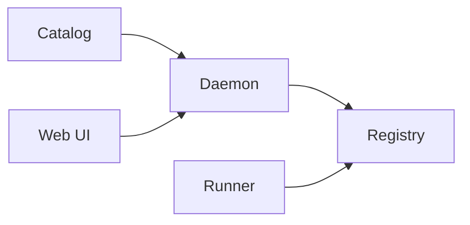

# 运行时扩展接口

<cite>
**本文引用的文件列表**
- [internal/runtimeextension/extension.go](file://internal/runtimeextension/extension.go)
- [internal/runtimeextension/loader.go](file://internal/runtimeextension/loader.go)
- [internal/runtimeextension/registry.go](file://internal/runtimeextension/registry.go)
- [internal/runtimeextension/catalog.go](file://internal/runtimeextension/catalog.go)
- [internal/daemon/server.go](file://internal/daemon/server.go)
- [internal/daemon/runtime_extension_handlers.go](file://internal/daemon/runtime_extension_handlers.go)
- [internal/runner/projection.go](file://internal/runner/projection.go)
- [internal/runner/pi_sandbox.go](file://internal/runner/pi_sandbox.go)
- [cmd/pentestd/main.go](file://cmd/pentestd/main.go)
- [internal/runner/projection_extension_test.go](file://internal/runner/projection_extension_test.go)
- [internal/runtimeextension/extension_test.go](file://internal/runtimeextension/extension_test.go)
- [web/src/pages/RuntimeProfilesPage.tsx](file://web/src/pages/RuntimeProfilesPage.tsx)
</cite>

## 目录
1. [简介](#简介)
2. [项目结构](#项目结构)
3. [核心组件](#核心组件)
4. [架构总览](#架构总览)
5. [详细组件分析](#详细组件分析)
6. [依赖关系分析](#依赖关系分析)
7. [性能与可扩展性](#性能与可扩展性)
8. [故障排查指南](#故障排查指南)
9. [结论](#结论)
10. [附录：自定义扩展开发指南](#附录自定义扩展开发指南)

## 简介
本文件聚焦于“运行时扩展”（Runtime Extension）的完整生命周期与接口设计，覆盖以下关键主题：
- 扩展注册机制、清单解析与校验
- 扩展发现与加载流程（本地可信目录 + 远程目录索引）
- 扩展在任务运行时的投影与注入（Provider Home/Workdir 等）
- 与 Runtime Plugin 的兼容性匹配
- 错误恢复与预检（Preflight）集成
- 前端展示与安装元数据持久化
- 自定义扩展的开发规范、安全边界与测试调试技巧

## 项目结构
运行时扩展相关代码主要分布在如下模块：
- internal/runtimeextension：扩展清单模型、加载器、注册表、目录索引抓取
- internal/daemon：HTTP API 路由与扩展查询端点
- internal/runner：任务启动前的配置投影（将扩展映射到沙箱/宿主环境）
- web：运行时配置页面中扩展选择与目录项展示

图表来源
- [internal/runtimeextension/extension.go:1-122](file://internal/runtimeextension/extension.go#L1-L122)
- [internal/runtimeextension/loader.go:1-46](file://internal/runtimeextension/loader.go#L1-L46)
- [internal/runtimeextension/registry.go:1-62](file://internal/runtimeextension/registry.go#L1-L62)
- [internal/runtimeextension/catalog.go:1-177](file://internal/runtimeextension/catalog.go#L1-L177)
- [internal/daemon/server.go:587-643](file://internal/daemon/server.go#L587-L643)
- [internal/daemon/runtime_extension_handlers.go:1-51](file://internal/daemon/runtime_extension_handlers.go#L1-L51)
- [internal/runner/projection.go:600-799](file://internal/runner/projection.go#L600-L799)
- [internal/runner/pi_sandbox.go:1-54](file://internal/runner/pi_sandbox.go#L1-L54)
- [web/src/pages/RuntimeProfilesPage.tsx:199-231](file://web/src/pages/RuntimeProfilesPage.tsx#L199-L231)

章节来源
- [internal/runtimeextension/extension.go:1-122](file://internal/runtimeextension/extension.go#L1-L122)
- [internal/runtimeextension/loader.go:1-46](file://internal/runtimeextension/loader.go#L1-L46)
- [internal/runtimeextension/registry.go:1-62](file://internal/runtimeextension/registry.go#L1-L62)
- [internal/runtimeextension/catalog.go:1-177](file://internal/runtimeextension/catalog.go#L1-L177)
- [internal/daemon/server.go:587-643](file://internal/daemon/server.go#L587-L643)
- [internal/daemon/runtime_extension_handlers.go:1-51](file://internal/daemon/runtime_extension_handlers.go#L1-L51)
- [internal/runner/projection.go:600-799](file://internal/runner/projection.go#L600-L799)
- [internal/runner/pi_sandbox.go:1-54](file://internal/runner/pi_sandbox.go#L1-L54)
- [web/src/pages/RuntimeProfilesPage.tsx:199-231](file://web/src/pages/RuntimeProfilesPage.tsx#L199-L231)

## 核心组件
- 扩展模型与校验
  - 定义扩展清单字段、兼容插件列表、源类型与投影位置白名单、相对路径与敏感信息检测。
- 清单加载器
  - 扫描指定目录下的 .json 清单，逐个解码并执行 Validate，收集成功项与错误集合。
- 注册表
  - 构建时再次校验、去重、按 ID 排序；提供 Get/List 返回深拷贝以避免外部修改。
- 目录索引抓取
  - 从 Pi 包目录与 Claude 官方仓库拉取扩展条目，统一为 CatalogItem 结构，供前端展示与安装参考。
- 守护进程 API
  - 暴露列出本地已注册扩展、获取单个扩展详情、拉取默认目录索引的 HTTP 接口。
- 运行时投影
  - 根据 Profile 中的启用扩展，将本地扩展文件投影至 Provider Home/Workdir，或将目录项 install_ref 写入 settings.json 由运行时按需安装。
- Pi 沙箱包装
  - 在无内置 pi 的二进制镜像中，通过 sh -c 包装首次安装 npm 包后 exec pi，确保扩展安装生效。

章节来源
- [internal/runtimeextension/extension.go:1-122](file://internal/runtimeextension/extension.go#L1-L122)
- [internal/runtimeextension/loader.go:1-46](file://internal/runtimeextension/loader.go#L1-L46)
- [internal/runtimeextension/registry.go:1-62](file://internal/runtimeextension/registry.go#L1-L62)
- [internal/runtimeextension/catalog.go:1-177](file://internal/runtimeextension/catalog.go#L1-L177)
- [internal/daemon/runtime_extension_handlers.go:1-51](file://internal/daemon/runtime_extension_handlers.go#L1-L51)
- [internal/runner/projection.go:600-799](file://internal/runner/projection.go#L600-L799)
- [internal/runner/pi_sandbox.go:1-54](file://internal/runner/pi_sandbox.go#L1-L54)

## 架构总览
下图展示了从“扩展清单发现”到“任务运行时投影”的端到端流程，以及前后端交互。

图表来源
- [internal/daemon/server.go:587-643](file://internal/daemon/server.go#L587-L643)
- [internal/daemon/runtime_extension_handlers.go:1-51](file://internal/daemon/runtime_extension_handlers.go#L1-L51)
- [internal/runtimeextension/catalog.go:1-177](file://internal/runtimeextension/catalog.go#L1-L177)
- [internal/runner/projection.go:600-799](file://internal/runner/projection.go#L600-L799)

## 详细组件分析

### 扩展清单模型与校验
- 关键字段
  - schema_version：当前固定版本，用于向后兼容控制
  - id/name/description：标识与描述
  - compatible_runtime_plugins：声明兼容的运行时插件 ID 列表
  - source.type/path：支持 local_dir/local_file，path 禁止包含疑似密钥片段
  - projection.location/path：仅允许 provider_home/runtime_home/workdir，path 必须为相对路径且不可逃逸根目录
  - config：键值对，同样进行疑似密钥检测
- 校验要点
  - 唯一性与重复插件 ID 检查
  - 路径安全：拒绝绝对路径、反斜杠、.. 和空段
  - 敏感信息防护：source.path 与 config 值均做模式匹配告警

图表来源
- [internal/runtimeextension/extension.go:51-121](file://internal/runtimeextension/extension.go#L51-L121)

章节来源
- [internal/runtimeextension/extension.go:1-122](file://internal/runtimeextension/extension.go#L1-L122)

### 清单加载与注册表
- 加载器
  - 遍历目录，仅处理 .json 文件；逐条读取、解码、Validate；汇总错误列表以便上层容错。
- 注册表
  - 构造时再次 Validate，拒绝重复 ID；内部维护有序 ID 列表；Get/List 返回深拷贝，避免共享可变状态。

图表来源
- [internal/runtimeextension/extension.go:19-49](file://internal/runtimeextension/extension.go#L19-L49)
- [internal/runtimeextension/registry.go:1-62](file://internal/runtimeextension/registry.go#L1-L62)

章节来源
- [internal/runtimeextension/loader.go:1-46](file://internal/runtimeextension/loader.go#L1-L46)
- [internal/runtimeextension/registry.go:1-62](file://internal/runtimeextension/registry.go#L1-L62)

### 目录索引抓取（Catalog）
- 数据来源
  - Pi 包目录：解析 HTML 卡片，提取名称、描述、install_ref（npm:xxx）、源码链接
  - Claude 官方仓库：列举 plugins/external_plugins 目录，生成 install_ref（name@claude-plugins-official）
- 错误聚合
  - 每个来源的错误以 CatalogSourceError 返回，便于前端提示

图表来源
- [internal/runtimeextension/catalog.go:37-177](file://internal/runtimeextension/catalog.go#L37-L177)

章节来源
- [internal/runtimeextension/catalog.go:1-177](file://internal/runtimeextension/catalog.go#L1-L177)

### 守护进程 API 与路由
- 路由
  - GET /api/runtime-extensions：返回已注册扩展列表
  - GET /api/runtime-extension-catalog：返回默认目录索引及错误
  - GET /api/runtime-extensions/{extension_id}：返回单个扩展详情
- 认证与 Origin 保护
  - 全局 Origin 检查、Token 鉴权、静态资源放行策略

图表来源
- [internal/daemon/server.go:587-643](file://internal/daemon/server.go#L587-L643)
- [internal/daemon/runtime_extension_handlers.go:1-51](file://internal/daemon/runtime_extension_handlers.go#L1-L51)

章节来源
- [internal/daemon/server.go:587-643](file://internal/daemon/server.go#L587-L643)
- [internal/daemon/runtime_extension_handlers.go:1-51](file://internal/daemon/runtime_extension_handlers.go#L1-L51)

### 运行时投影与注入
- 本地扩展文件
  - 若 Profile 启用了本地扩展，Runner 会将 Source.Path 的内容复制到目标位置（如 Provider Home/extensions/...），并在预览中记录 runtime_extensions 列表。
- 目录项安装引用
  - 若启用的扩展携带 install_ref（来自目录项），Runner 将其写入 settings.json 的 packages 字段，由运行时（如 Pi）在启动时自动安装。
- 兼容性过滤
  - 仅在扩展与所选 Runtime Plugin 兼容时才被投影或安装。

图表来源
- [internal/runner/projection.go:600-799](file://internal/runner/projection.go#L600-L799)
- [internal/runner/projection_extension_test.go:52-134](file://internal/runner/projection_extension_test.go#L52-L134)

章节来源
- [internal/runner/projection.go:600-799](file://internal/runner/projection.go#L600-L799)
- [internal/runner/projection_extension_test.go:52-134](file://internal/runner/projection_extension_test.go#L52-L134)

### Pi 沙箱引导与扩展安装
- 当镜像未内置 pi 二进制时，使用 WrapSandboxPiCommand 包装命令，首次运行时通过 npm 安装指定包，再 exec pi。
- 该包装不影响持久会话路径，后者需要裸 pi 令牌以正确重写容器命令。

章节来源
- [internal/runner/pi_sandbox.go:1-54](file://internal/runner/pi_sandbox.go#L1-L54)

### 前端集成与安装元数据持久化
- 运行时配置页并行拉取 profiles/plugins/extensions 与 catalog，展示可用扩展与目录项。
- 用户选择的目录项会持久化为 runtime_extensions 的 install_ref 等元数据，供后端投影使用。

章节来源
- [web/src/pages/RuntimeProfilesPage.tsx:199-231](file://web/src/pages/RuntimeProfilesPage.tsx#L199-L231)

## 依赖关系分析
- 组件耦合
  - Daemon 依赖 Registry 提供扩展查询能力；Runner 依赖 Registry 进行投影决策；Catalog 独立于运行时，仅用于发现。
- 外部依赖
  - 网络访问 Pi 包目录与 GitHub API，需考虑超时与限流。
- 潜在循环
  - 当前实现无循环依赖；Registry 不反向依赖 Runner/Daemon。

图表来源
- [internal/daemon/server.go:587-643](file://internal/daemon/server.go#L587-L643)
- [internal/runner/projection.go:600-799](file://internal/runner/projection.go#L600-L799)
- [internal/runtimeextension/catalog.go:1-177](file://internal/runtimeextension/catalog.go#L1-L177)

章节来源
- [internal/daemon/server.go:587-643](file://internal/daemon/server.go#L587-L643)
- [internal/runner/projection.go:600-799](file://internal/runner/projection.go#L600-L799)
- [internal/runtimeextension/catalog.go:1-177](file://internal/runtimeextension/catalog.go#L1-L177)

## 性能与可扩展性
- 清单加载
  - 目录扫描与 JSON 解析为 I/O 密集操作，建议批量加载与错误聚合，避免单文件失败导致整体失败。
- 注册表访问
  - Get/List 返回深拷贝，避免并发写冲突；ID 排序保证稳定输出顺序。
- 目录抓取
  - 设置合理超时与重试上限；对 GitHub API 可考虑缓存与增量更新。
- 运行时投影
  - 大体积扩展复制应评估磁盘 I/O 影响；必要时采用只读挂载或符号链接策略。

[本节为通用指导，无需具体文件来源]

## 故障排查指南
- 清单校验失败
  - 常见原因：schema_version 不匹配、id 非法、缺少必填字段、source.type 不在白名单、projection.path 非相对或逃逸、config 含疑似密钥。
  - 定位方法：查看 LoadDirectory 返回的错误列表，逐项修复。
- 重复 ID 或重复兼容插件
  - 注册表构造时会拒绝重复 ID；清单内也需避免重复的 compatible_runtime_plugins。
- 未知或不可达目录源
  - Catalog 返回 errors 数组，检查网络连通性与 URL 可达性。
- 运行时未生效
  - 确认 Profile 中启用了扩展；对于目录项，检查 install_ref 是否正确写入 settings.json；对于本地扩展，确认目标目录是否存在所需文件。
- 沙箱安装问题（Pi）
  - 检查镜像是否具备 npm 与网络访问；查看 bootstrap 日志；确认 WrapSandboxPiCommand 未被持久会话路径绕过。

章节来源
- [internal/runtimeextension/loader.go:1-46](file://internal/runtimeextension/loader.go#L1-L46)
- [internal/runtimeextension/registry.go:1-62](file://internal/runtimeextension/registry.go#L1-L62)
- [internal/runtimeextension/catalog.go:1-177](file://internal/runtimeextension/catalog.go#L1-L177)
- [internal/runner/projection.go:600-799](file://internal/runner/projection.go#L600-L799)
- [internal/runner/pi_sandbox.go:1-54](file://internal/runner/pi_sandbox.go#L1-L54)

## 结论
运行时扩展体系通过“清单+注册表+目录索引+运行时投影”的分层设计，实现了安全的扩展发现、严格的校验与可控的注入。结合 Preflight 与前端可视化，形成从管理到执行的闭环。未来可在目录缓存、增量同步、扩展签名验证等方面进一步增强安全性与可用性。

[本节为总结，无需具体文件来源]

## 附录：自定义扩展开发指南

### 清单结构与要求
- 必填字段
  - schema_version、id、name、compatible_runtime_plugins、source、projection
- 约束
  - id 符合小写字母开头与限定字符集
  - compatible_runtime_plugins 非空且无重复
  - source.type 仅支持 local_dir/local_file
  - projection.location 仅支持 provider_home/runtime_home/workdir
  - projection.path 必须为相对路径，不允许 .. 与空段
  - source.path 与 config 值不得包含疑似密钥片段

章节来源
- [internal/runtimeextension/extension.go:1-122](file://internal/runtimeextension/extension.go#L1-L122)

### 安全边界
- 路径逃逸防护：严格限制相对路径与目录穿越
- 敏感信息防护：对路径与配置值进行模式匹配，防止误放密钥
- 兼容性白名单：仅对声明兼容的 Runtime Plugin 生效，避免跨平台误用

章节来源
- [internal/runtimeextension/extension.go:51-121](file://internal/runtimeextension/extension.go#L51-L121)

### 性能考虑
- 大文件复制：优先使用只读挂载或符号链接减少 I/O
- 目录抓取：增加超时与重试上限，避免阻塞启动
- 注册表访问：避免频繁深拷贝，必要时提供迭代器接口

[本节为通用指导，无需具体文件来源]

### 测试方法与调试技巧
- 单元测试
  - 使用 LoadDirectory 与 NewRegistry 组合，验证清单解析、校验与注册行为
  - 使用 ProjectRuntimeConfig 断言投影结果与预览字段
- 集成测试
  - 通过 Daemon API 调用 /api/runtime-extensions 与 /api/runtime-extension-catalog，验证响应结构
  - 在沙箱环境中观察 Pi 的 settings.json 与安装日志
- 调试建议
  - 打印 LoadDirectory 的错误集合，快速定位问题清单
  - 检查 Runner 生成的预览，确认 packages 与 runtime_extensions 字段
  - 针对 Pi 沙箱，查看 bootstrap 日志与 session 文件

章节来源
- [internal/runtimeextension/extension_test.go:1-54](file://internal/runtimeextension/extension_test.go#L1-L54)
- [internal/runner/projection_extension_test.go:52-134](file://internal/runner/projection_extension_test.go#L52-L134)
- [internal/daemon/runtime_extension_handlers.go:1-51](file://internal/daemon/runtime_extension_handlers.go#L1-L51)