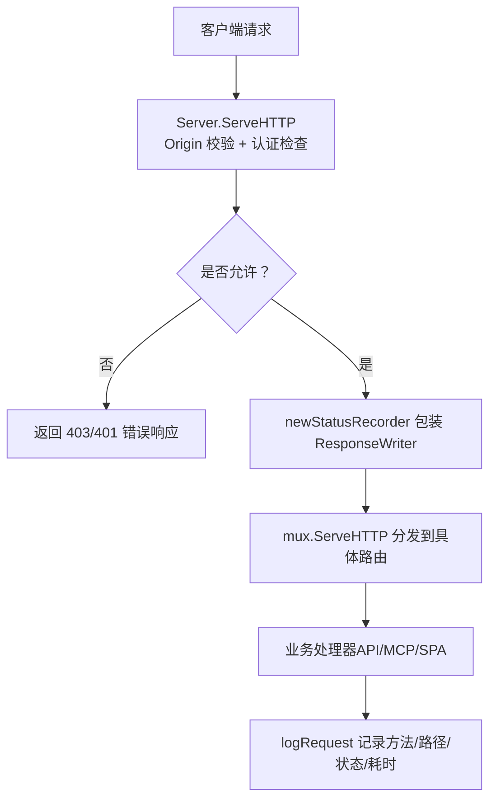
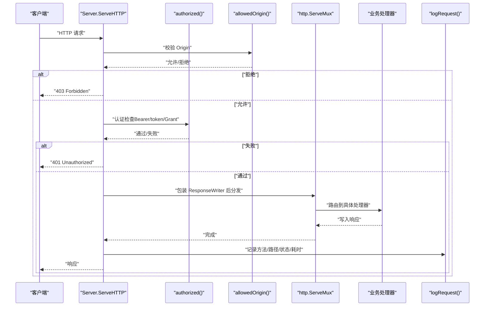
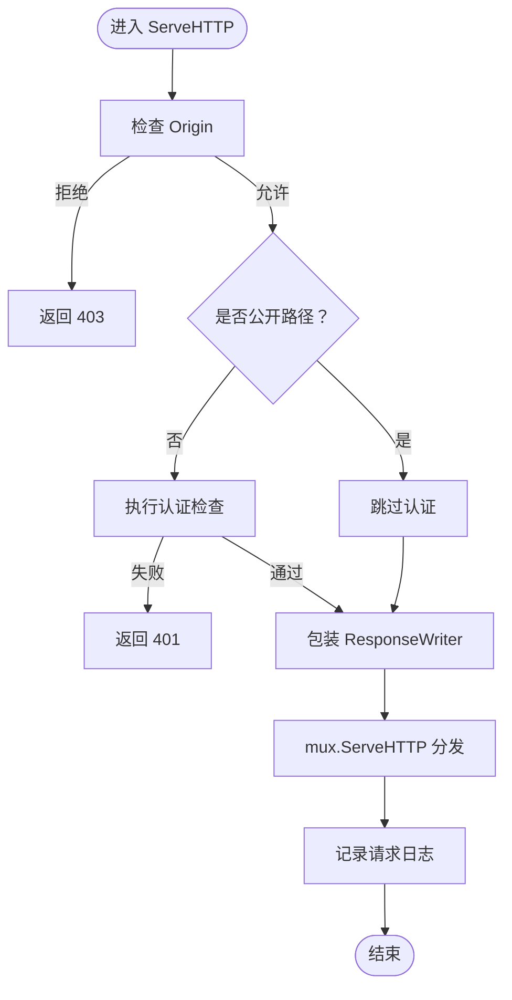
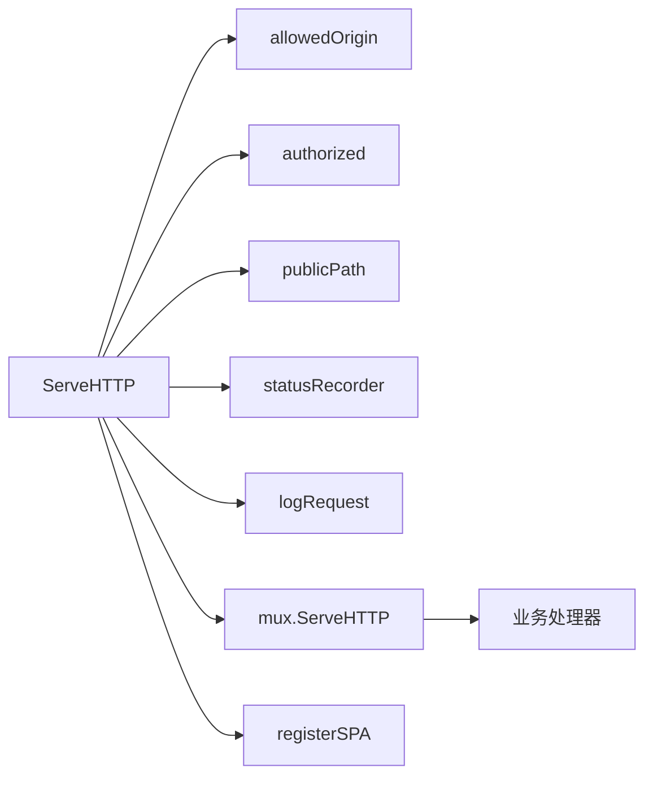

# 中间件与拦截器

<cite>
**本文引用的文件**   
- [server.go](file://internal/daemon/server.go)
- [logging.go](file://internal/daemon/logging.go)
</cite>

## 目录
1. [简介](#简介)
2. [项目结构](#项目结构)
3. [核心组件](#核心组件)
4. [架构总览](#架构总览)
5. [详细组件分析](#详细组件分析)
6. [依赖关系分析](#依赖关系分析)
7. [性能考量](#性能考量)
8. [故障排查指南](#故障排查指南)
9. [结论](#结论)
10. [附录](#附录)

## 简介
本文件聚焦于 HTTP 请求处理管道中的“中间件与拦截器”机制，围绕以下目标展开：
- 解析并说明请求进入后的统一入口、鉴权与来源校验流程
- 记录请求日志、状态码与耗时，并对高频轮询进行降噪
- 说明 Origin 验证、认证检查、CORS 预检放行与静态资源服务策略
- 提供自定义中间件开发指南、错误统一处理与响应格式化规范
- 给出可操作的示例路径与性能优化建议

## 项目结构
HTTP 中间件与拦截器逻辑集中在 Daemon 的 HTTP 服务器实现中。关键位置如下：
- 统一入口 ServeHTTP：负责 Origin 校验、认证检查、状态码捕获与请求日志
- 路由注册 routes：将 API、MCP、SPA 等子模块挂载到标准库 mux
- 日志与状态码记录：封装 statusRecorder 与 logRequest，支持对高频 GET 轮询降噪
- 静态资源与 SPA 回退：registerSPA 提供前端资源与路由回退

图表来源
- [server.go:383-411](file://internal/daemon/server.go#L383-L411)
- [logging.go:47-87](file://internal/daemon/logging.go#L47-L87)

章节来源
- [server.go:383-411](file://internal/daemon/server.go#L383-L411)
- [server.go:587-643](file://internal/daemon/server.go#L587-L643)
- [logging.go:16-87](file://internal/daemon/logging.go#L16-L87)

## 核心组件
- 统一入口与拦截链
  - ServeHTTP 作为唯一入口，执行 Origin 校验、认证检查、状态码捕获与请求日志
- Origin 验证中间件
  - allowedOrigin 仅允许无 Origin、本地回环、host.docker.internal 或与监听地址同主机的来源
- 认证检查中间件
  - authorized 支持 Authorization: Bearer 或 ?token= 查询参数；在特定传输上接受 Project Interface Grant
- 状态码记录与请求日志
  - statusRecorder 捕获首次 WriteHeader/Write 时的状态码
  - logRequest 输出结构化行，并对高频轮询 GET 成功响应进行抑制
- 静态资源与 SPA 服务
  - registerSPA 提供 /assets 直出与其余路径回退至 index.html 的 SPA 行为
- 错误与响应格式
  - writeJSON/writeError 统一 JSON 响应体结构

章节来源
- [server.go:383-411](file://internal/daemon/server.go#L383-L411)
- [server.go:518-534](file://internal/daemon/server.go#L518-L534)
- [server.go:435-461](file://internal/daemon/server.go#L435-L461)
- [logging.go:47-87](file://internal/daemon/logging.go#L47-L87)
- [server.go:1226-1258](file://internal/daemon/server.go#L1226-L1258)
- [server.go:1260-1272](file://internal/daemon/server.go#L1260-L1272)

## 架构总览
下图展示了从请求进入到最终响应的完整链路，包括安全拦截、日志与静态资源处理。

图表来源
- [server.go:383-411](file://internal/daemon/server.go#L383-L411)
- [server.go:435-461](file://internal/daemon/server.go#L435-L461)
- [server.go:518-534](file://internal/daemon/server.go#L518-L534)
- [logging.go:47-87](file://internal/daemon/logging.go#L47-L87)

## 详细组件分析

### 统一入口与拦截链（ServeHTTP）
- 职责
  - 最先执行 Origin 校验，防止 DNS Rebinding 与跨站访问
  - 在非公开路径下执行认证检查，必要时放行 Blackboard v2 HTTP 与 MCP 的独立授权路径
  - 使用 statusRecorder 包裹 ResponseWriter，确保能正确捕获状态码
  - 调用 mux 分发请求，并在完成后记录结构化日志
- 关键点
  - publicPath 定义无需认证的公开路径（健康检查、CORS 预检、静态资源）
  - authorized 同时支持 Bearer token 与 query token，便于沙箱内非浏览器场景
  - 对 Blackboard v2 HTTP 与 MCP 路径，若未通过 daemon 级认证，仍可由其内部 grant 机制放行

章节来源
- [server.go:383-411](file://internal/daemon/server.go#L383-L411)
- [server.go:463-501](file://internal/daemon/server.go#L463-L501)
- [server.go:435-461](file://internal/daemon/server.go#L435-L461)

#### 流程图：入口拦截决策

图表来源
- [server.go:383-411](file://internal/daemon/server.go#L383-L411)
- [server.go:463-501](file://internal/daemon/server.go#L463-L501)

### Origin 验证中间件（allowedOrigin）
- 设计动机
  - 阻止恶意页面通过 DNS Rebinding 向本地回环地址发起同源外观的请求
  - 允许无 Origin 的本地 UI、CLI 与沙箱运行时
  - 显式允许 host.docker.internal，以支持容器内进程访问宿主服务
- 规则摘要
  - 无 Origin：允许
  - Origin 为 null 或无法解析：拒绝
  - 主机为回环或 localhost：允许
  - 主机为 host.docker.internal：允许
  - 主机与监听地址相同（忽略端口与大小写）：允许
  - 其他情况：拒绝

章节来源
- [server.go:518-534](file://internal/daemon/server.go#L518-L534)
- [server.go:539-567](file://internal/daemon/server.go#L539-L567)
- [server.go:572-585](file://internal/daemon/server.go#L572-L585)

### 认证检查中间件（authorized）
- 支持的凭证形式
  - Authorization: Bearer <token>
  - URL 查询参数 ?token=<token>（用于沙箱 MCP 等非浏览器场景）
  - Project Interface Grant（仅限 Blackboard v2 HTTP 与 /mcp）
- 行为要点
  - 当配置了 AuthToken 且非公开路径时，必须通过认证
  - 对于 Blackboard v2 HTTP 与 MCP，即使未通过 daemon 级认证，仍可通过 grant 解析放行
  - 使用常量时间比较避免时序攻击

章节来源
- [server.go:435-461](file://internal/daemon/server.go#L435-L461)

### CORS 处理与预检放行
- 现状说明
  - 代码未实现通用 CORS 中间件（如动态设置 Access-Control-* 头）
  - 通过 publicPath 放行 OPTIONS 请求，使浏览器预检可直接到达后端
  - 结合 Origin 校验限制跨域来源，降低 CSRF 风险
- 影响与建议
  - 如需跨域访问，应在业务处理器中按需设置响应头，或在入口处增加统一的 CORS 中间件
  - 保持严格 Origin 白名单策略，避免过度宽松导致数据泄露

章节来源
- [server.go:463-470](file://internal/daemon/server.go#L463-L470)
- [server.go:518-534](file://internal/daemon/server.go#L518-L534)

### 静态资源服务与 SPA 回退（registerSPA）
- 功能
  - 将嵌入的前端构建产物作为静态资源提供
  - /assets/* 直接由文件服务器响应
  - 其他路径若存在真实文件则直接返回，否则回退到 index.html 以支持客户端路由刷新
  - 明确排除 /api 与 /mcp，避免被 SPA 覆盖
- 与认证的关系
  - 静态资源属于公开路径，可在未携带认证头的情况下加载（例如浏览器首次加载）

章节来源
- [server.go:1226-1258](file://internal/daemon/server.go#L1226-L1258)
- [server.go:463-501](file://internal/daemon/server.go#L463-L501)

### 请求日志、状态码记录与性能监控
- 状态码捕获
  - statusRecorder 在首次 WriteHeader 或 Write 时记录状态码，并透传到底层 ResponseWriter
- 请求日志
  - logRequest 输出方法、路径、状态码与耗时毫秒数
  - 针对高频轮询 GET（事件、转录、时间线、任务详情）的成功响应进行抑制，避免日志噪声
- 性能监控建议
  - 当前已包含耗时统计，可在此基础上扩展指标上报（如 Prometheus）
  - 可按路径维度聚合 P95/P99 耗时，识别慢接口

章节来源
- [logging.go:47-87](file://internal/daemon/logging.go#L47-L87)
- [logging.go:16-45](file://internal/daemon/logging.go#L16-L45)

### 错误统一处理与响应格式化
- 统一 JSON 响应
  - writeJSON 设置 Content-Type 并编码 payload
  - writeError 返回固定结构的 { error } 对象
- 最佳实践
  - 所有处理器应通过 writeError 返回错误，保证前端一致的错误处理体验
  - 敏感信息不应出现在错误消息中

章节来源
- [server.go:1260-1272](file://internal/daemon/server.go#L1260-L1272)

## 依赖关系分析
- 入口依赖
  - ServeHTTP 依赖 allowedOrigin、authorized、publicPath、statusRecorder、logRequest
- 路由依赖
  - routes 将 API、MCP、SPA 等子模块挂载到 http.ServeMux
- 静态资源依赖
  - registerSPA 依赖嵌入式文件系统与 http.FileServer

图表来源
- [server.go:383-411](file://internal/daemon/server.go#L383-L411)
- [server.go:587-643](file://internal/daemon/server.go#L587-L643)
- [server.go:1226-1258](file://internal/daemon/server.go#L1226-L1258)

章节来源
- [server.go:383-411](file://internal/daemon/server.go#L383-L411)
- [server.go:587-643](file://internal/daemon/server.go#L587-L643)
- [server.go:1226-1258](file://internal/daemon/server.go#L1226-L1258)

## 性能考量
- 日志降噪
  - 对高频轮询 GET 的成功响应不输出日志，减少 I/O 压力与磁盘占用
- 状态码捕获开销
  - statusRecorder 仅在首次写入时操作，后续透传，开销极低
- 静态资源缓存
  - 浏览器侧可利用默认缓存策略；服务端未显式设置强缓存，可根据需要补充 Cache-Control
- 可扩展性
  - 建议在 logRequest 基础上增加结构化指标采集（如延迟分位数、错误率），以便集中监控

[本节为通用指导，不涉及具体文件分析]

## 故障排查指南
- 常见现象与定位
  - 403 Forbidden：Origin 不在允许列表（非回环、非 host.docker.internal、非监听主机）
  - 401 Unauthorized：缺少或错误的认证令牌；确认是否命中公开路径或使用了正确的 Bearer/token 形式
  - 静态资源 404：路径不在 /assets 或未存在于嵌入 dist；检查 registerSPA 的回退逻辑
  - 日志过多：确认是否为高频轮询 GET，已被抑制；若非预期，检查 isNoisyPoll 匹配条件
- 快速自检清单
  - 检查 ListenAddr 与 Origin 是否匹配
  - 确认是否需要配置 AuthToken（非回环绑定强制要求）
  - 核对 publicPath 是否覆盖了预期路径
  - 观察 logRequest 输出是否包含期望的状态码与耗时

章节来源
- [server.go:518-534](file://internal/daemon/server.go#L518-L534)
- [server.go:435-461](file://internal/daemon/server.go#L435-L461)
- [server.go:463-501](file://internal/daemon/server.go#L463-L501)
- [logging.go:16-45](file://internal/daemon/logging.go#L16-L45)

## 结论
该项目的 HTTP 中间件与拦截器采用“入口统一拦截 + 轻量状态记录 + 结构化日志”的模式：
- 通过 Origin 校验与认证检查保障安全边界
- 通过 statusRecorder 与 logRequest 实现低开销的请求观测
- 通过 publicPath 与 registerSPA 兼顾安全与前端体验
- 错误与响应格式统一，便于前后端协作

## 附录

### 自定义中间件开发指南
- 何时添加
  - 需要在入口之后、路由之前插入横切逻辑（如审计、限流、额外头部注入）
- 如何添加
  - 在 ServeHTTP 中，于 mux.ServeHTTP 前插入新逻辑，或使用装饰器模式包装 ResponseWriter
  - 参考现有 statusRecorder 的实现方式，确保只捕获首次写入的状态码
- 注意事项
  - 不要破坏 publicPath 与认证检查的顺序
  - 新增中间件需考虑对高频轮询的影响，避免引入不必要的日志或阻塞

章节来源
- [server.go:383-411](file://internal/daemon/server.go#L383-L411)
- [logging.go:47-87](file://internal/daemon/logging.go#L47-L87)

### 中间件开发示例（路径指引）
- 参考入口拦截顺序
  - [server.go:383-411](file://internal/daemon/server.go#L383-L411)
- 参考状态码捕获实现
  - [logging.go:47-87](file://internal/daemon/logging.go#L47-L87)
- 参考公开路径判定
  - [server.go:463-501](file://internal/daemon/server.go#L463-L501)
- 参考 SPA 静态资源服务
  - [server.go:1226-1258](file://internal/daemon/server.go#L1226-L1258)

### 性能优化建议
- 在 logRequest 中增加指标上报（如延迟分位数、错误率）
- 对静态资源启用合适的缓存头（Cache-Control、ETag）
- 对高频轮询接口考虑增量更新或 SSE/WebSocket 替代方案

[本节为通用指导，不涉及具体文件分析]