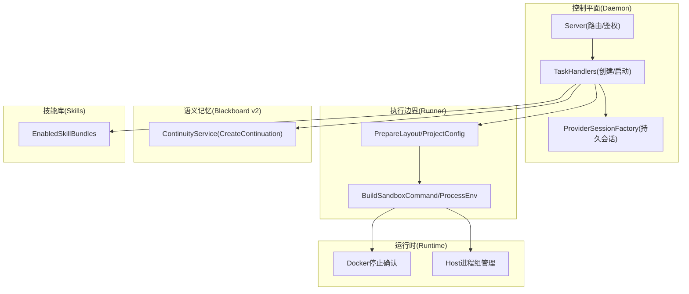
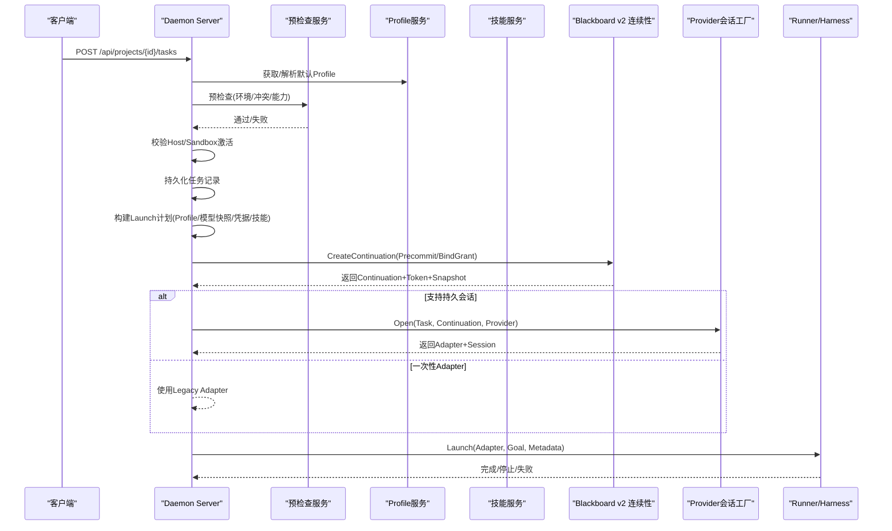
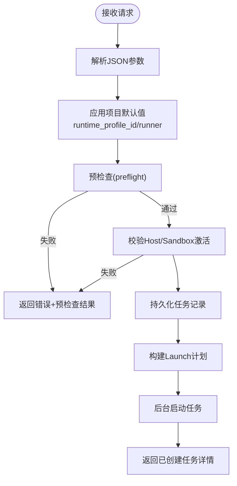
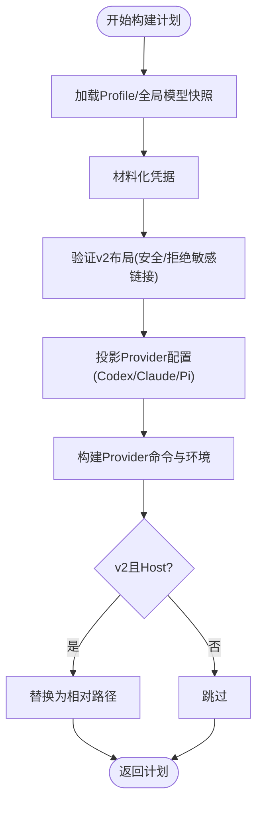
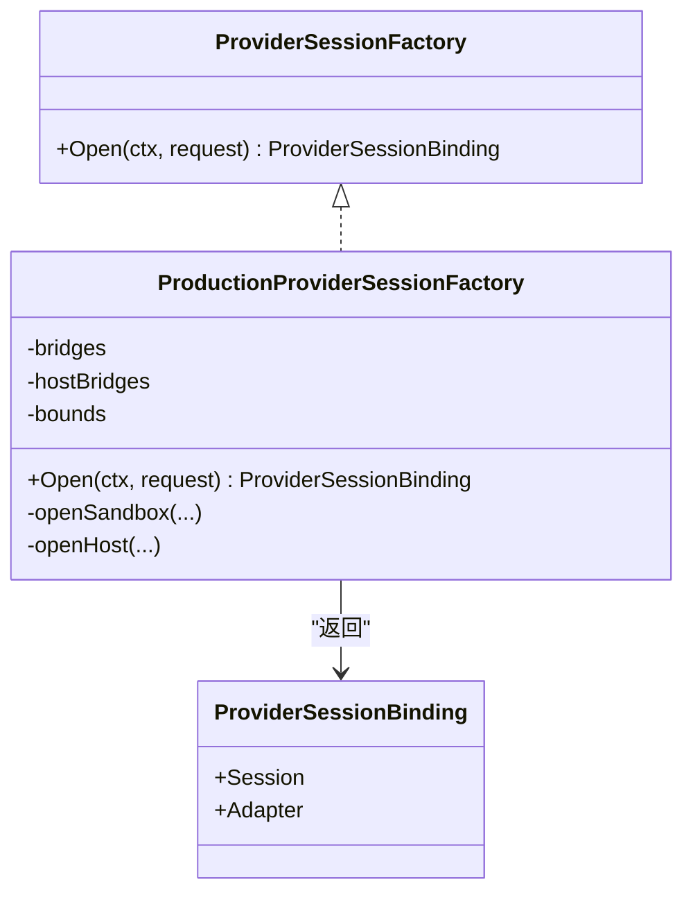
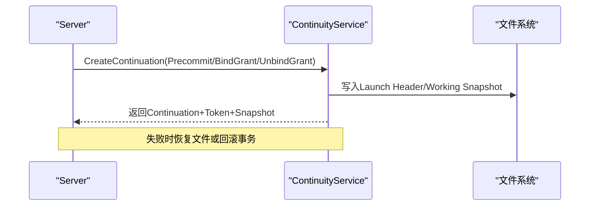
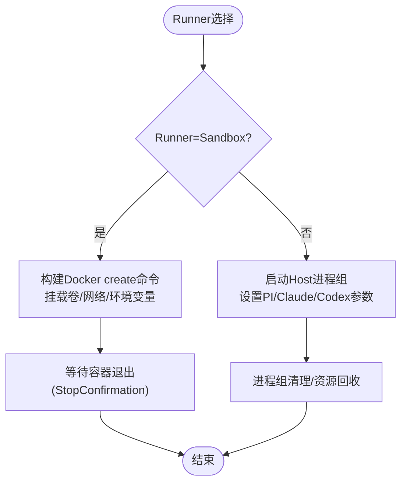
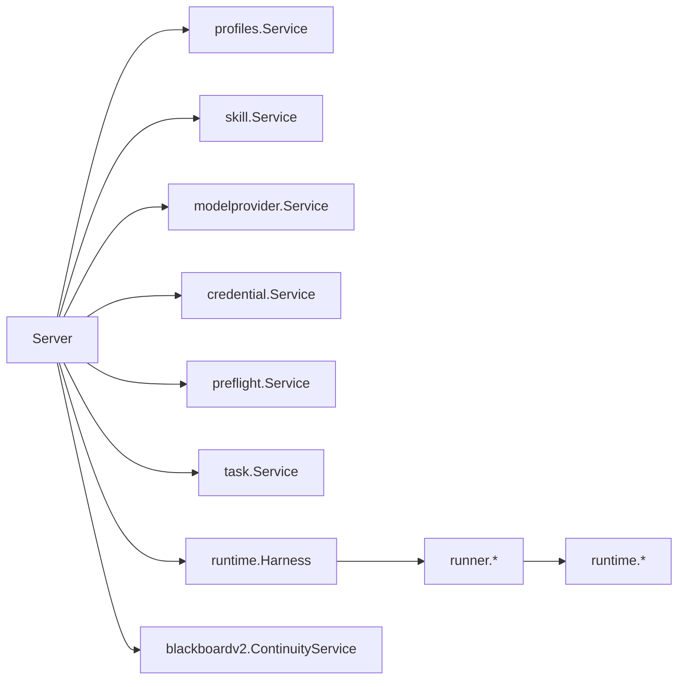

# 任务创建与启动

<cite>
**本文引用的文件**   
- [task_handlers.go](file://internal/daemon/task_handlers.go)
- [launch_handlers.go](file://internal/daemon/launch_handlers.go)
- [server.go](file://internal/daemon/server.go)
- [provider_session_factory.go](file://internal/daemon/provider_session_factory.go)
- [production_provider_session_factory.go](file://internal/daemon/production_provider_session_factory.go)
- [runner.go](file://internal/runner/runner.go)
- [blackboard_v2_layout.go](file://internal/runner/blackboard_v2_layout.go)
- [continuity.go](file://internal/blackboardv2/continuity.go)
- [service.go](file://internal/skill/service.go)
- [container.go](file://internal/runtime/container.go)
- [host_process_unix.go](file://internal/runtime/host_process_unix.go)
- [pi_sandbox.go](file://internal/runner/pi_sandbox.go)
</cite>

## 目录
1. [简介](#简介)
2. [项目结构](#项目结构)
3. [核心组件](#核心组件)
4. [架构总览](#架构总览)
5. [详细组件分析](#详细组件分析)
6. [依赖关系分析](#依赖关系分析)
7. [性能考虑](#性能考虑)
8. [故障排查指南](#故障排查指南)
9. [结论](#结论)
10. [附录：API参考与示例](#附录api参考与示例)

## 简介
本文件聚焦“任务创建与启动”的端到端流程，覆盖以下关键主题：
- HTTP API 接口、参数校验、默认值应用与预检查（preflight）
- 运行时 Profile 解析、技能包加载、Launch 计划构建
- Provider 会话工厂模式、Continuation 准备逻辑、Blackboard v2 布局初始化
- 沙箱与主机运行器的不同启动路径
- 完整的任务创建 API 参考与实际使用示例

## 项目结构
围绕任务创建与启动的关键代码分布在以下模块：
- Daemon 控制平面：HTTP 路由、鉴权、任务生命周期编排、Provider 会话装配
- Runner 执行边界：任务本地目录布局、配置投影、命令组装、容器/进程管理
- Blackboard v2 连续性服务：Continuation 原子化创建、工作快照发布、同步附件
- Skill 服务：按 Profile 启用技能包并生成可投影的技能清单
- Runtime 适配层：Docker 容器停止确认、Host 进程组管理、Pi 包装器

图表来源
- [server.go:587-643](file://internal/daemon/server.go#L587-L643)
- [task_handlers.go:73-167](file://internal/daemon/task_handlers.go#L73-L167)
- [provider_session_factory.go:35-41](file://internal/daemon/provider_session_factory.go#L35-L41)
- [runner.go:106-137](file://internal/runner/runner.go#L106-L137)
- [blackboard_v2_layout.go:27-113](file://internal/runner/blackboard_v2_layout.go#L27-L113)
- [continuity.go:764-800](file://internal/blackboardv2/continuity.go#L764-L800)
- [service.go:284-299](file://internal/skill/service.go#L284-L299)
- [container.go:26-33](file://internal/runtime/container.go#L26-L33)
- [host_process_unix.go:45-124](file://internal/runtime/host_process_unix.go#L45-L124)

章节来源
- [server.go:587-643](file://internal/daemon/server.go#L587-L643)
- [task_handlers.go:73-167](file://internal/daemon/task_handlers.go#L73-L167)

## 核心组件
- 任务创建入口：处理 POST /api/projects/{id}/tasks，完成参数解码、默认值填充、预检查、激活校验、任务持久化、Launch 计划构建与后台启动。
- Launch 计划构建：解析 Profile、模型提供者快照、材料化凭据、技能包、安全布局验证、配置投影、命令与环境组装。
- Provider 会话工厂：为支持持久会话的 Provider 在沙箱/主机上建立长连接适配器，绑定 Continuation，注入初始轮次选择。
- Blackboard v2 Continuity：原子化创建 Continuation，Precommit/BindGrant 钩子用于无感写入 Launch Header 与可信 MCP 授权。
- 布局与安全：严格校验 task_root 下目录与拒绝敏感符号链接，确保 v2 布局安全。
- 运行时装配：根据 Runner 类型分别走 Docker 容器或 Host 进程组；提供停止确认与进程组清理。

章节来源
- [task_handlers.go:73-167](file://internal/daemon/task_handlers.go#L73-L167)
- [task_handlers.go:522-592](file://internal/daemon/task_handlers.go#L522-L592)
- [task_handlers.go:607-800](file://internal/daemon/task_handlers.go#L607-L800)
- [provider_session_factory.go:35-91](file://internal/daemon/provider_session_factory.go#L35-L91)
- [production_provider_session_factory.go:133-142](file://internal/daemon/production_provider_session_factory.go#L133-L142)
- [continuity.go:764-800](file://internal/blackboardv2/continuity.go#L764-L800)
- [blackboard_v2_layout.go:27-113](file://internal/runner/blackboard_v2_layout.go#L27-L113)
- [runner.go:106-137](file://internal/runner/runner.go#L106-L137)
- [container.go:26-33](file://internal/runtime/container.go#L26-L33)
- [host_process_unix.go:45-124](file://internal/runtime/host_process_unix.go#L45-L124)

## 架构总览
下图展示从 HTTP 请求到任务实际运行的完整调用链，包括黑板 v2 连续性、Provider 会话工厂与 Runner 装配。

图表来源
- [server.go:587-643](file://internal/daemon/server.go#L587-L643)
- [task_handlers.go:73-167](file://internal/daemon/task_handlers.go#L73-L167)
- [task_handlers.go:196-285](file://internal/daemon/task_handlers.go#L196-L285)
- [continuity.go:764-800](file://internal/blackboardv2/continuity.go#L764-L800)
- [production_provider_session_factory.go:133-142](file://internal/daemon/production_provider_session_factory.go#L133-L142)

## 详细组件分析

### HTTP 任务创建接口与参数校验
- 路由：POST /api/projects/{id}/tasks
- 输入字段：goal、runtime_profile_id、model_override、reasoning_effort、runner、run_controls.host_activated、extras/run_controls.extras
- 默认值应用：若未指定 runtime_profile_id 或 runner，则回退至项目默认；未指定 runner 时默认 sandbox
- 预检查：基于 Profile、Model Provider、Skills、Runtime Extensions 的环境与冲突检查
- 激活校验：host runner 必须显式激活；sandbox 不允许自动回退 host
- 结果：创建任务后异步启动，返回任务详情

图表来源
- [task_handlers.go:73-167](file://internal/daemon/task_handlers.go#L73-L167)
- [task_handlers.go:463-483](file://internal/daemon/task_handlers.go#L463-L483)
- [runner.go:271-283](file://internal/runner/runner.go#L271-L283)

章节来源
- [task_handlers.go:73-167](file://internal/daemon/task_handlers.go#L73-L167)
- [task_handlers.go:463-483](file://internal/daemon/task_handlers.go#L463-L483)
- [runner.go:271-283](file://internal/runner/runner.go#L271-L283)

### 运行时 Profile 解析与默认值
- 解析入口：handleResolveLaunchRuntimeProfile（POST /api/runtime-profiles/resolve-launch）
- 输入：provider、model_provider_id、model_override、model_provider_name
- 输出：profile_id、profile、created（是否由解析自动生成）
- 默认值策略：Profile 结构化字段作为唯一事实源；GeneratedConfig 仅预览，不含密钥

章节来源
- [launch_handlers.go:12-54](file://internal/daemon/launch_handlers.go#L12-L54)
- [runtimeprofile.go:348-433](file://internal/daemon/runtimeprofile.go#L348-L433)

### 技能包加载与投影
- 按 Profile 启用技能包：EnabledSkillBundles(profileID)
- 投影阶段将技能包路径与沙箱内映射写入布局，供 Provider 消费
- 沙箱场景下，技能包目标路径可能重写到 /task/skills

章节来源
- [service.go:284-299](file://internal/skill/service.go#L284-L299)
- [blackboard_v2_layout.go:145-161](file://internal/runner/blackboard_v2_layout.go#L145-L161)
- [blackboard_v2_layout.go:254-276](file://internal/runner/blackboard_v2_layout.go#L254-L276)

### Launch 计划构建与配置投影
- 步骤概览：
  - 读取 Profile 与全局模型提供者快照
  - 材料化凭据（避免将密钥写入持久配置）
  - 安全布局验证（Blackboard v2）
  - 配置投影（Provider 特定：Codex/Claude/Pi）
  - 构建 Provider 启动命令与环境变量
  - 针对 v2 且 host runner 的路径，将绝对路径替换为相对路径
- 特殊处理：
  - Fake Provider 直接返回假适配器
  - v2 下对 Claude/Pi 使用可信 MCP grant，Codex 保持无网络写操作

图表来源
- [task_handlers.go:522-592](file://internal/daemon/task_handlers.go#L522-L592)
- [task_handlers.go:607-800](file://internal/daemon/task_handlers.go#L607-L800)
- [blackboard_v2_layout.go:27-113](file://internal/runner/blackboard_v2_layout.go#L27-L113)

章节来源
- [task_handlers.go:522-592](file://internal/daemon/task_handlers.go#L522-L592)
- [task_handlers.go:607-800](file://internal/daemon/task_handlers.go#L607-L800)
- [blackboard_v2_layout.go:27-113](file://internal/runner/blackboard_v2_layout.go#L27-L113)

### Provider 会话工厂模式与持久会话
- 接口：ProviderSessionFactory.Open(request) -> Binding(Session, Adapter)
- 支持范围：
  - Sandbox：Codex/Claude/Pi
  - Host：Codex/Claude/Pi（需满足各自前置条件）
- 行为：
  - 同一 Task 复用 Session/Adapter
  - 绑定 Continuation，设置初始轮次选择
  - 失败即关闭（fail-closed），不降级到一次性 Adapter
- 生产实现：ProductionProviderSessionFactory 负责桥接与进程/容器生命周期

图表来源
- [provider_session_factory.go:35-41](file://internal/daemon/provider_session_factory.go#L35-L41)
- [production_provider_session_factory.go:118-142](file://internal/daemon/production_provider_session_factory.go#L118-L142)
- [production_provider_session_factory.go:428-534](file://internal/daemon/production_provider_session_factory.go#L428-L534)

章节来源
- [provider_session_factory.go:35-91](file://internal/daemon/provider_session_factory.go#L35-L91)
- [production_provider_session_factory.go:133-142](file://internal/daemon/production_provider_session_factory.go#L133-L142)
- [production_provider_session_factory.go:428-534](file://internal/daemon/production_provider_session_factory.go#L428-L534)

### Continuation 准备与 Blackboard v2 布局初始化
- Continuity.CreateContinuation：
  - Precommit：在事务前投影当前 Snapshot，允许写入 Launch Header
  - BindGrant：在获得 grant 后再次投影（如可信 MCP 配置），失败则原子回滚
  - UnbindGrant：失败清理含 grant 的配置
- 布局初始化：
  - 严格校验 task_root、provider_home、skills/artifacts/logs 等目录
  - 拒绝敏感文件符号链接（如 AGENTS.md、settings.json、auth.json 等）
  - 为 Pi 额外要求 agent 目录存在

图表来源
- [continuity.go:764-800](file://internal/blackboardv2/continuity.go#L764-L800)
- [blackboard_v2_layout.go:27-113](file://internal/runner/blackboard_v2_layout.go#L27-L113)

章节来源
- [continuity.go:764-800](file://internal/blackboardv2/continuity.go#L764-L800)
- [blackboard_v2_layout.go:27-113](file://internal/runner/blackboard_v2_layout.go#L27-L113)

### 沙箱与主机运行器启动路径
- 沙箱路径：
  - 使用 Docker/Podman create 命令，挂载 task root，设置环境变量
  - 可选 host_proxy_only 网络模式，限制出站流量
  - 停止确认：通过 cidfile 轮询容器状态
- 主机路径：
  - 以进程组方式启动，支持优雅终止与强制杀死
  - 对 Pi 需要 PI_CODING_AGENT_DIR/SESSION_DIR 等环境变量
  - 对 Claude 使用版本固定的 SDK bridge
  - 对 Codex 启动 app-server 并保持自定义参数非冲突合并

图表来源
- [runner.go:139-217](file://internal/runner/runner.go#L139-L217)
- [container.go:26-33](file://internal/runtime/container.go#L26-L33)
- [host_process_unix.go:45-124](file://internal/runtime/host_process_unix.go#L45-L124)
- [pi_sandbox.go:14-47](file://internal/runner/pi_sandbox.go#L14-L47)

章节来源
- [runner.go:139-217](file://internal/runner/runner.go#L139-L217)
- [container.go:26-33](file://internal/runtime/container.go#L26-L33)
- [host_process_unix.go:45-124](file://internal/runtime/host_process_unix.go#L45-L124)
- [pi_sandbox.go:14-47](file://internal/runner/pi_sandbox.go#L14-L47)

## 依赖关系分析
- 控制面与服务：
  - Server 持有 profiles、skills、modelproviders、credentials、preflight、tasks、harness、bbv2 continuity
  - 路由注册集中在 routes()，统一鉴权与 Origin 校验
- 执行面：
  - Runner 负责布局与命令构建，不直接执行工具
  - Runtime 提供容器/进程抽象与停止确认
- 语义面：
  - Blackboard v2 Continuity 与 Task/Project 强耦合，保证原子性与一致性

图表来源
- [server.go:83-118](file://internal/daemon/server.go#L83-L118)
- [server.go:587-643](file://internal/daemon/server.go#L587-L643)
- [runner.go:1-16](file://internal/runner/runner.go#L1-L16)

章节来源
- [server.go:83-118](file://internal/daemon/server.go#L83-L118)
- [server.go:587-643](file://internal/daemon/server.go#L587-L643)
- [runner.go:1-16](file://internal/runner/runner.go#L1-L16)

## 性能考虑
- 预检查与配置投影尽量缓存全局快照，避免重复查询
- 持久会话减少频繁进程/容器创建开销，提升连续任务吞吐
- 沙箱 host_proxy_only 网络模式可减少不必要出站流量
- 停止确认采用轮询与超时，避免长时间阻塞

[本节为通用指导，无需引用具体文件]

## 故障排查指南
- 预检查失败：关注返回的 preflight 结果，定位缺失环境或冲突参数
- Host 激活问题：确保 run_controls.host_activated=true
- Provider 会话失败：查看日志中的 provider session setup failed 根因
- 布局不安全：检查是否存在敏感符号链接或不合法目录
- 容器未退出：确认 cidfile 存在与 docker inspect 状态
- Host 进程残留：检查进程组 ID 与 KillGroup 行为

章节来源
- [task_handlers.go:110-127](file://internal/daemon/task_handlers.go#L110-L127)
- [task_handlers.go:287-309](file://internal/daemon/task_handlers.go#L287-L309)
- [blackboard_v2_layout.go:27-113](file://internal/runner/blackboard_v2_layout.go#L27-L113)
- [container.go:26-33](file://internal/runtime/container.go#L26-L33)
- [host_process_unix.go:16-41](file://internal/runtime/host_process_unix.go#L16-L41)

## 结论
任务创建与启动是一个多阶段、强一致性的过程：从 HTTP 入口的参数校验与预检查，到 Profile 解析与技能包加载，再到 Blackboard v2 连续性保障与 Provider 会话装配，最终通过 Runner 在沙箱或主机上拉起执行。该设计在保证安全与可观测性的同时，提供了良好的扩展性与稳定性。

[本节为总结性内容，无需引用具体文件]

## 附录：API参考与示例

### 任务创建 API
- 方法：POST
- 路径：/api/projects/{id}/tasks
- 请求体字段：
  - goal: string（必填）
  - runtime_profile_id: string（可选，缺省使用项目默认）
  - model_override: string（可选）
  - reasoning_effort: string（可选）
  - runner: enum("sandbox","host")（可选，缺省使用项目默认，再缺省为 sandbox）
  - run_controls.host_activated: boolean（当 runner=host 时必须为 true）
  - extras/run_controls.extras: map[string]string（兼容字段）
- 成功响应：返回已创建的任务详情对象
- 失败响应：
  - 400：参数无效、预检查失败、激活校验失败
  - 500：内部错误（如加载项目默认失败）

章节来源
- [task_handlers.go:73-167](file://internal/daemon/task_handlers.go#L73-L167)
- [task_handlers.go:463-483](file://internal/daemon/task_handlers.go#L463-L483)
- [runner.go:271-283](file://internal/runner/runner.go#L271-L283)

### 运行时 Profile 解析 API
- 方法：POST
- 路径：/api/runtime-profiles/resolve-launch
- 请求体字段：
  - provider: enum("codex","claude_code","pi","fake")
  - model_provider_id: string（可选）
  - model_override: string（可选）
  - model_provider_name: string（可选）
- 成功响应：
  - profile_id: string
  - profile: 精简后的 Profile 对象
  - created: boolean（是否由解析自动生成）

章节来源
- [launch_handlers.go:12-54](file://internal/daemon/launch_handlers.go#L12-L54)

### 使用示例（概念性）
- 创建任务（沙箱）：
  - 请求体包含 goal、runtime_profile_id、runner="sandbox"
  - 系统应用项目默认值，进行预检查，创建任务并后台启动
- 创建任务（主机）：
  - 请求体包含 goal、runner="host"、run_controls.host_activated=true
  - 系统校验激活标志，构建 Launch 计划并通过 Host 进程组启动
- 解析 Profile：
  - 先调用 resolve-launch 获取 profile_id 与预览配置，再创建任务时使用该 profile_id

[本节为概念性示例，无需引用具体文件]