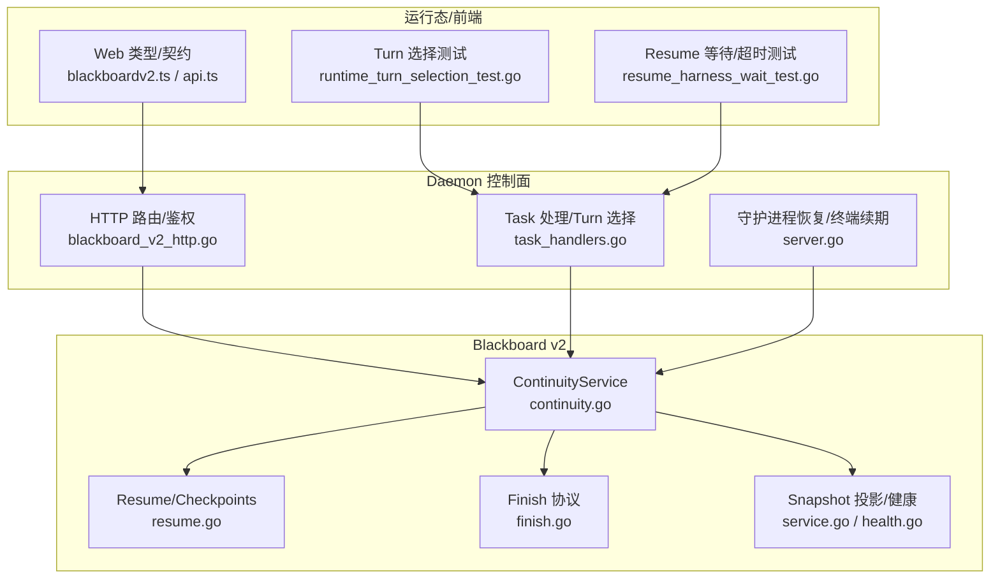
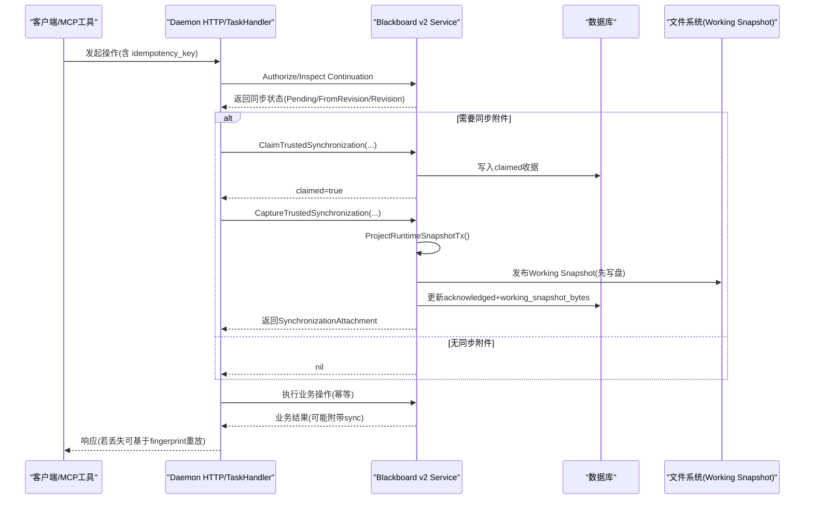
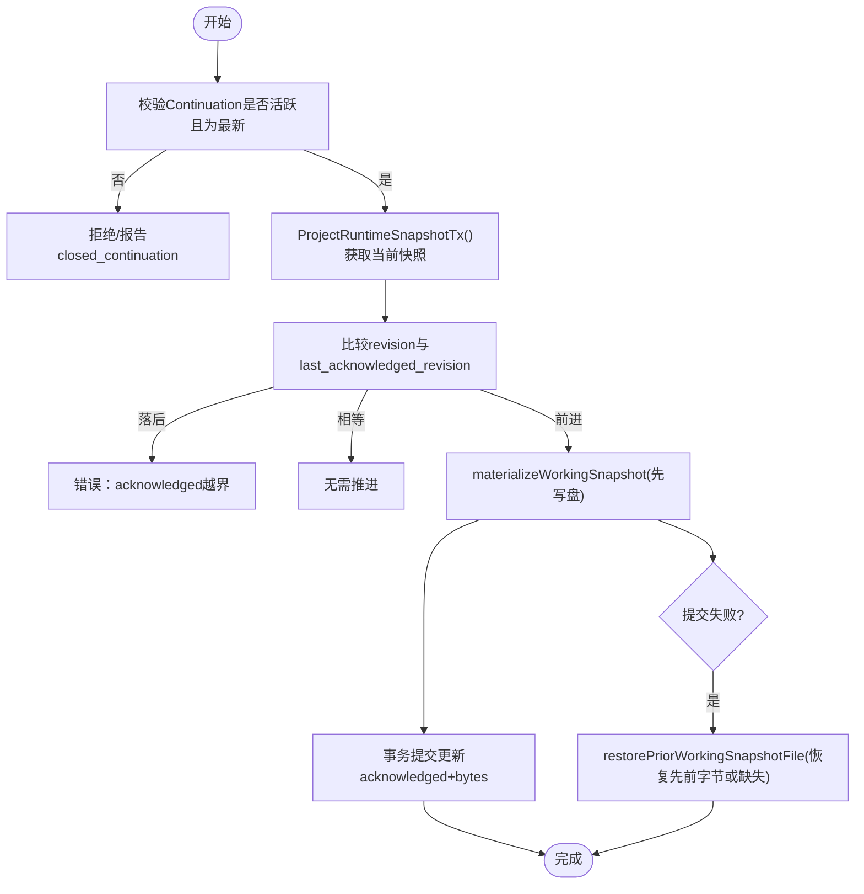
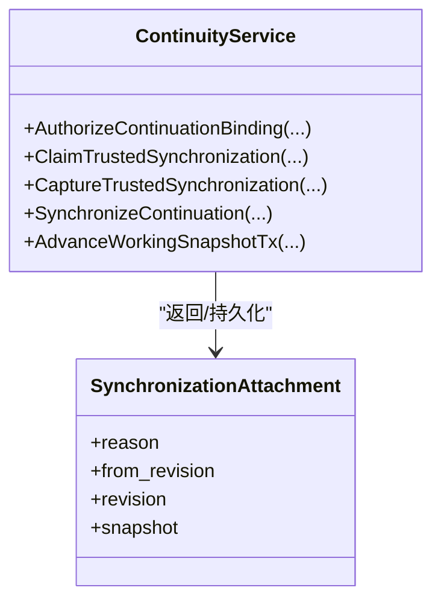
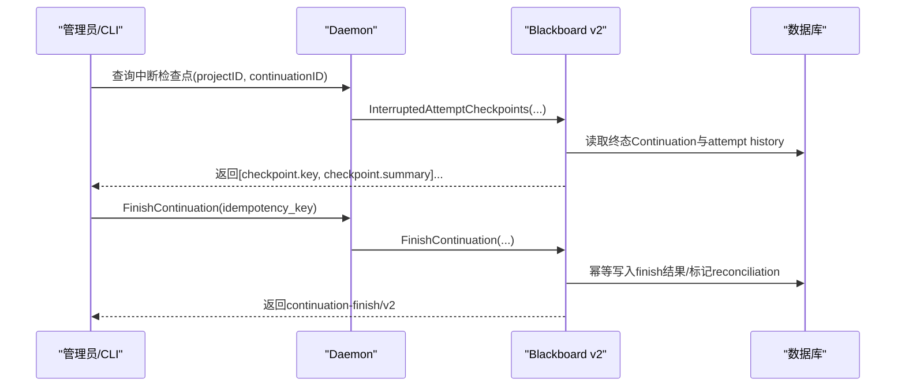
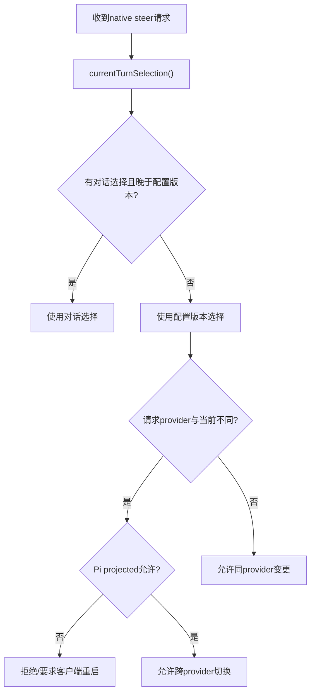
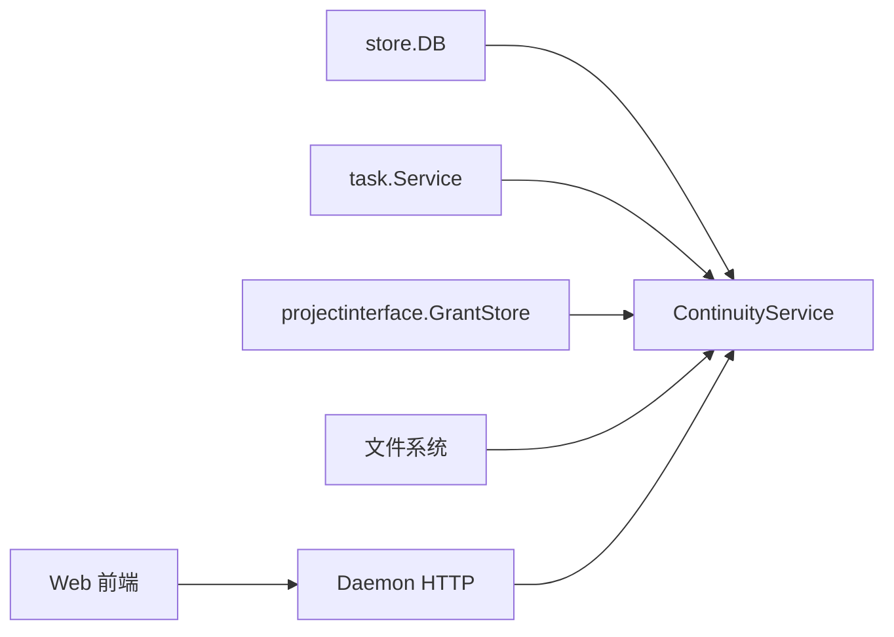

# 任务恢复与续传

<cite>
**本文引用的文件**   
- [continuity.go](file://internal/blackboardv2/continuity.go)
- [resume.go](file://internal/blackboardv2/resume.go)
- [finish.go](file://internal/blackboardv2/finish.go)
- [service.go](file://internal/blackboardv2/service.go)
- [health.go](file://internal/blackboardv2/health.go)
- [blackboard_v2_http.go](file://internal/daemon/blackboard_v2_http.go)
- [task_handlers.go](file://internal/daemon/task_handlers.go)
- [server.go](file://internal/daemon/server.go)
- [runtime_turn_selection_test.go](file://internal/daemon/runtime_turn_selection_test.go)
- [resume_harness_wait_test.go](file://internal/daemon/resume_harness_wait_test.go)
- [blackboard_v2_continuity_test.go](file://internal/daemon/blackboard_v2_continuity_test.go)
- [blackboard_v2_cli_test.go](file://internal/pentestctl/blackboard_v2_cli_test.go)
- [blackboardv2.ts](file://web/src/lib/blackboardv2.ts)
- [api.ts](file://web/src/lib/api.ts)
- [blackboard-v2-spec.md](file://docs/specs/blackboard-v2-spec.md)
- [blackboard-v2-tdd-plan.md](file://docs/specs/blackboard-v2-tdd-plan.md)
</cite>

## 目录
1. [引言](#引言)
2. [项目结构](#项目结构)
3. [核心组件](#核心组件)
4. [架构总览](#架构总览)
5. [详细组件分析](#详细组件分析)
6. [依赖关系分析](#依赖关系分析)
7. [性能考量](#性能考量)
8. [故障排查指南](#故障排查指南)
9. [结论](#结论)
10. [附录：恢复API参考](#附录恢复api参考)

## 引言
本文件聚焦“任务恢复与续传”能力，围绕 Blackboard v2 的 Continuation 机制、快照管理与恢复流程展开。重点覆盖以下主题：
- Blackboard v2 连续性保证：Launch Pin（不可变启动快照）、Working Snapshot（工作快照）、同步附件与幂等重放
- 工作快照同步：发布-提交前写盘、失败回滚、重启恢复
- 断点恢复：中断尝试检查点、Finish 后重建、跨任务共享知识同步
- 原生会话恢复与 Turn 选择重放：模型提供者/模型/推理强度在 resume 路径下的决策与一致性
- 配置版本管理：Runtime Config Version 与对话/配置时间线合并
- 数据一致性：原子事务、幂等键、唯一约束冲突处理、最终一致性与可重放性
- 恢复 API 参考与灾难恢复最佳实践

## 项目结构
与恢复相关的代码主要分布在以下模块：
- Blackboard v2 连续性服务：continuity.go、resume.go、finish.go、service.go、health.go
- Daemon HTTP 控制面：blackboard_v2_http.go、task_handlers.go、server.go
- 运行时与测试：runtime_turn_selection_test.go、resume_harness_wait_test.go、blackboard_v2_continuity_test.go、blackboard_v2_cli_test.go
- Web 前端契约与类型：blackboardv2.ts、api.ts
- 规范与设计文档：blackboard-v2-spec.md、blackboard-v2-tdd-plan.md

图表来源
- [continuity.go:1-134](file://internal/blackboardv2/continuity.go#L1-L134)
- [resume.go:1-82](file://internal/blackboardv2/resume.go#L1-L82)
- [finish.go:1-52](file://internal/blackboardv2/finish.go#L1-L52)
- [service.go:1451-1488](file://internal/blackboardv2/service.go#L1451-L1488)
- [health.go:260-309](file://internal/blackboardv2/health.go#L260-L309)
- [blackboard_v2_http.go:224-236](file://internal/daemon/blackboard_v2_http.go#L224-L236)
- [task_handlers.go:2818-2842](file://internal/daemon/task_handlers.go#L2818-L2842)
- [server.go:275-304](file://internal/daemon/server.go#L275-L304)
- [runtime_turn_selection_test.go:553-579](file://internal/daemon/runtime_turn_selection_test.go#L553-L579)
- [resume_harness_wait_test.go:137-167](file://internal/daemon/resume_harness_wait_test.go#L137-L167)
- [blackboardv2.ts:672-695](file://web/src/lib/blackboardv2.ts#L672-L695)
- [api.ts:365-407](file://web/src/lib/api.ts#L365-L407)

章节来源
- [continuity.go:1-134](file://internal/blackboardv2/continuity.go#L1-L134)
- [blackboard-v2-spec.md:250-267](file://docs/specs/blackboard-v2-spec.md#L250-L267)

## 核心组件
- ContinuityService：负责 Continuation 生命周期、Launch Pin 与 Working Snapshot 的原子化创建、同步、持久化与恢复；提供 Claim/Finalize 同步交付、SynchronizeContinuation 等关键方法
- Resume/Checkpoint：暴露中断尝试的检查点摘要，用于后续续传时仅携带语义摘要而非原始输出
- Finish 协议：幂等的 FinishContinuationRequest，支持重试与结果重放
- Service/Health：Project 级 Runtime Snapshot 投影、健康诊断、关系完整性校验
- Daemon 控制面：HTTP 鉴权绑定、Native Turn 选择解析、Resume 并发控制与状态机推进
- Web 契约：前端对 runtime-blackboard/v2 快照结构的解析与展示

章节来源
- [continuity.go:764-880](file://internal/blackboardv2/continuity.go#L764-L880)
- [resume.go:1-82](file://internal/blackboardv2/resume.go#L1-L82)
- [finish.go:1-52](file://internal/blackboardv2/finish.go#L1-L52)
- [service.go:1451-1488](file://internal/blackboardv2/service.go#L1451-L1488)
- [health.go:260-309](file://internal/blackboardv2/health.go#L260-L309)
- [blackboard_v2_http.go:224-236](file://internal/daemon/blackboard_v2_http.go#L224-L236)
- [task_handlers.go:2818-2842](file://internal/daemon/task_handlers.go#L2818-L2842)
- [api.ts:365-407](file://web/src/lib/api.ts#L365-L407)

## 架构总览
下图展示了从请求进入 Daemon 到 Blackboard v2 连续性服务的调用链，以及同步附件与 Working Snapshot 的落盘与回滚策略。

图表来源
- [continuity.go:227-325](file://internal/blackboardv2/continuity.go#L227-L325)
- [continuity.go:345-389](file://internal/blackboardv2/continuity.go#L345-L389)
- [continuity.go:647-751](file://internal/blackboardv2/continuity.go#L647-L751)
- [blackboard_v2_http.go:224-236](file://internal/daemon/blackboard_v2_http.go#L224-L236)

## 详细组件分析

### Continuation 生命周期与 Launch Pin/Working Snapshot
- Launch Pin：在 CreateContinuation 中，将当前 Project 的 Runtime Snapshot 以不可变形式持久化，并计算 SHA256 校验；后续任何恢复或重放均不得覆盖该字节
- Working Snapshot：每个 Continuation 维护 last_acknowledged_revision 与 working_snapshot_bytes；同步时采用“先写盘再提交”的策略，失败时精确回滚至之前字节或文件缺失状态
- 活跃快照恢复：RecoverActiveWorkingSnapshots 会扫描 pending/running/paused 的 Continuation，按 last_acknowledged_revision 对应的 bytes 重新生成 blackboard.json

图表来源
- [continuity.go:1021-1066](file://internal/blackboardv2/continuity.go#L1021-L1066)
- [continuity.go:1095-1147](file://internal/blackboardv2/continuity.go#L1095-L1147)
- [continuity.go:753-762](file://internal/blackboardv2/continuity.go#L753-L762)

章节来源
- [continuity.go:764-880](file://internal/blackboardv2/continuity.go#L764-L880)
- [continuity.go:941-976](file://internal/blackboardv2/continuity.go#L941-L976)
- [continuity.go:978-1019](file://internal/blackboardv2/continuity.go#L978-L1019)
- [continuity_restore_test.go:1-60](file://internal/blackboardv2/continuity_restore_test.go#L1-L60)

### 同步附件与幂等重放
- 同步指纹：SynchronizationDeliveryFingerprint(operation, idempotency_key) 用于标识一次可信请求，确保 response-loss 场景下可重放相同附件
- Claim/Finalize：ClaimTrustedSynchronization 在 Pending 状态下抢占通知；CaptureTrustedSynchronization 在已 claim 或 finalize 情况下直接返回历史附件；未 claim 但 Pending 则自动补 claim 并 finalize
- 幂等：同一 fingerprint 多次调用返回相同 attachment；不同 fingerprint 不会重复投递；Pending-only 路径不持久化，但必须保证“成功即交付”

图表来源
- [continuity.go:207-219](file://internal/blackboardv2/continuity.go#L207-L219)
- [continuity.go:227-325](file://internal/blackboardv2/continuity.go#L227-L325)
- [continuity.go:345-389](file://internal/blackboardv2/continuity.go#L345-L389)
- [continuity.go:435-611](file://internal/blackboardv2/continuity.go#L435-L611)

章节来源
- [continuity.go:207-219](file://internal/blackboardv2/continuity.go#L207-L219)
- [continuity.go:345-389](file://internal/blackboardv2/continuity.go#L345-L389)
- [continuity.go:435-611](file://internal/blackboardv2/continuity.go#L435-L611)

### 断点恢复与 Finish 协议
- 中断检查点：InterruptedAttemptCheckpoints 仅返回被终态 Continuation 所中断的 Attempt 的 key 与 summary，限制最大数量，屏蔽存储身份与原始输出
- Finish 幂等：FinishContinuationRequest 仅包含 idempotency_key；Finish 后可继续重放证据保留等操作
- 恢复一致性：Finish 后旧 Continuation 关闭，新 Continuation 获得更高 number；同步附件与 Working Snapshot 保持与磁盘一致

图表来源
- [resume.go:21-81](file://internal/blackboardv2/resume.go#L21-L81)
- [finish.go:27-52](file://internal/blackboardv2/finish.go#L27-L52)

章节来源
- [resume.go:1-82](file://internal/blackboardv2/resume.go#L1-L82)
- [finish.go:1-52](file://internal/blackboardv2/finish.go#L1-L52)

### 原生会话恢复与 Turn 选择重放
- 当前 Turn 选择优先级：优先最近应用的“对话事件中的选择”，否则使用“捕获的 Runtime Config Version”；两者时间戳决定最终值
- 同提供者变更：同一 provider 的 model/effort 变更总是允许；跨 provider 变更需受限于 Pi 的 projected_model_provider_ids，Codex/Claude 拒绝并要求客户端重启
- 恢复事件：daemon 重启后会为孤儿任务追加 provider_session_recovery_required 事件，指示 next_action=resume_creates_fresh_continuation

图表来源
- [task_handlers.go:2921-2940](file://internal/daemon/task_handlers.go#L2921-L2940)
- [task_handlers.go:2818-2842](file://internal/daemon/task_handlers.go#L2818-L2842)
- [server.go:275-304](file://internal/daemon/server.go#L275-L304)
- [runtime_turn_selection_test.go:553-579](file://internal/daemon/runtime_turn_selection_test.go#L553-L579)

章节来源
- [task_handlers.go:2818-2842](file://internal/daemon/task_handlers.go#L2818-L2842)
- [task_handlers.go:2921-2940](file://internal/daemon/task_handlers.go#L2921-L2940)
- [server.go:275-304](file://internal/daemon/server.go#L275-L304)
- [runtime_turn_selection_test.go:553-579](file://internal/daemon/runtime_turn_selection_test.go#L553-L579)

### 配置版本管理与数据一致性
- Runtime Config Version：每次 resume/queue/restart 都会记录新的配置版本，供 currentTurnSelection 使用；Task 的 profile 不变，影响的是下一个 Continuation
- 并发 Resume：并发 resume 只接受一个，其余返回冲突；确保最多新增一个 Continuation，避免多实例竞争
- 同步一致性：SynchronizeContinuation 与 Claim/Finalize 共同保证“至少一次”的同步附件投递，结合幂等键实现完全重放

章节来源
- [task.go:664-687](file://internal/task/task.go#L664-L687)
- [resume_harness_wait_test.go:137-167](file://internal/daemon/resume_harness_wait_test.go#L137-L167)
- [blackboard_v2_continuity_test.go:370-437](file://internal/daemon/blackboard_v2_continuity_test.go#L370-L437)

### 工作快照同步与重启恢复
- 发布-提交前写盘：SynchronizeContinuation 在事务提交前先 materializeWorkingSnapshot，失败时通过 restorePriorWorkingSnapshotFile 精确恢复
- 重启恢复：RecoverActiveWorkingSnapshots 遍历 active Continuation，按 last_acknowledged_revision 对应的 bytes 重建 blackboard.json，确保与数据库一致
- CLI 错误同步：当 read 遇到 closed_continuation 时，仍可在错误文档中附带 sync 附件，便于客户端刷新本地视图

章节来源
- [continuity.go:647-751](file://internal/blackboardv2/continuity.go#L647-L751)
- [continuity.go:978-1019](file://internal/blackboardv2/continuity.go#L978-L1019)
- [blackboard_v2_cli_test.go:574-589](file://internal/pentestctl/blackboard_v2_cli_test.go#L574-L589)

## 依赖关系分析
- ContinuityService 依赖 Store/DB、Task Service、GrantStore 与文件系统；通过事务与锁保证原子性与可见性
- Daemon 层通过 HTTP 鉴权绑定 Continuation，再调用 Blackboard v2 服务执行语义操作
- Web 前端遵循 runtime-blackboard/v2 快照结构，解析 objectives/entities/solutions/relations 等字段

图表来源
- [continuity.go:119-134](file://internal/blackboardv2/continuity.go#L119-L134)
- [blackboardv2.ts:672-695](file://web/src/lib/blackboardv2.ts#L672-L695)

章节来源
- [continuity.go:119-134](file://internal/blackboardv2/continuity.go#L119-L134)
- [blackboardv2.ts:672-695](file://web/src/lib/blackboardv2.ts#L672-L695)

## 性能考量
- 快照投影与合并：ProjectRuntimeSnapshotTx 在事务内投影，避免额外锁竞争；健康诊断加载所有关系用于完整性分类，注意在大图场景下的开销
- 文件 I/O：Working Snapshot 使用临时文件名+原子 rename，减少部分写入导致的损坏风险；必要时进行 fsync
- 并发控制：Claim/Finalize 使用唯一约束与行级锁避免重复投递；Resume 并发通过状态机与计数限制

章节来源
- [health.go:294-309](file://internal/blackboardv2/health.go#L294-L309)
- [continuity.go:1095-1147](file://internal/blackboardv2/continuity.go#L1095-L1147)
- [continuity.go:227-325](file://internal/blackboardv2/continuity.go#L227-L325)

## 故障排查指南
- 常见错误码
  - authority_denied：Continuation 不属于指定 Project/Task
  - closed_continuation：Continuation 已关闭或被替代，禁止离线读写/同步
  - reconciliation_incomplete：中断检查点需在 durable reconciliation 完成后才可用
  - stale Working Snapshot synchronization/acknowledgement：并发竞争导致 CAS 失败，应重试
- 典型问题定位
  - 同步附件未送达：检查是否有 open claim；确认 fingerprint 是否正确；查看 finalized receipt
  - Working Snapshot 不一致：核对 last_acknowledged_revision 与 disk 文件；必要时调用 RecoverActiveWorkingSnapshots
  - Resume 冲突：确认是否已有活跃 Harness；观察 409 冲突与 Accepted 行为

章节来源
- [continuity.go:157-192](file://internal/blackboardv2/continuity.go#L157-L192)
- [resume.go:21-40](file://internal/blackboardv2/resume.go#L21-L40)
- [blackboard_v2_continuity_test.go:370-437](file://internal/daemon/blackboard_v2_continuity_test.go#L370-L437)

## 结论
Blackboard v2 的 Continuation 机制通过 Launch Pin 与 Working Snapshot 的双轨设计，结合 Claim/Finalize 同步附件与幂等重放，实现了高可靠的断点恢复与跨任务知识同步。Daemon 层的 Turn 选择与配置版本管理确保了原生会话恢复的一致性与可控性。配合严格的发布-提交前写盘与失败回滚策略，系统在崩溃与网络丢包场景下仍能保持数据一致与可重放。

## 附录：恢复API参考
- 同步与鉴权
  - AuthorizeContinuationBinding：校验 Project/Task/Continuation 绑定与 Live 状态
  - InspectContinuationSynchronization：仅检查同步状态（Pending/FromRevision/Revision）
  - ClaimTrustedSynchronization：抢占 Pending 通知，返回 claimed 标志
  - CaptureTrustedSynchronization：返回同步附件或空；支持 late claim
  - SynchronizeContinuation：推进 Working Snapshot 并返回附件
- 快照与恢复
  - ReadLaunchPin：读取不可变启动快照并校验完整性
  - ReadWorkingSnapshot：读取 last_acknowledged_revision 与 working_snapshot_bytes
  - MaterializeWorkingSnapshot：将 Working Snapshot 写入 task-local .pentest/blackboard.json
  - RecoverActiveWorkingSnapshots：重启后恢复所有 active Continuation 的工作快照
- 中断与 Finish
  - InterruptedAttemptCheckpoints：返回被中断 Attempt 的 key/summary 列表
  - FinishContinuationRequest：幂等的 finish 请求，仅含 idempotency_key
- 前端契约
  - runtime-blackboard/v2 快照结构：schema/semantics/revision/work/knowledge/relations
  - RuntimeControls：native_resume_available、turn_selection、recovery_state 等

章节来源
- [continuity.go:157-192](file://internal/blackboardv2/continuity.go#L157-L192)
- [continuity.go:227-325](file://internal/blackboardv2/continuity.go#L227-L325)
- [continuity.go:345-389](file://internal/blackboardv2/continuity.go#L345-L389)
- [continuity.go:647-751](file://internal/blackboardv2/continuity.go#L647-L751)
- [continuity.go:882-976](file://internal/blackboardv2/continuity.go#L882-L976)
- [continuity.go:978-1019](file://internal/blackboardv2/continuity.go#L978-L1019)
- [resume.go:21-81](file://internal/blackboardv2/resume.go#L21-L81)
- [finish.go:27-52](file://internal/blackboardv2/finish.go#L27-L52)
- [blackboardv2.ts:672-695](file://web/src/lib/blackboardv2.ts#L672-L695)
- [api.ts:365-407](file://web/src/lib/api.ts#L365-L407)
- [blackboard-v2-spec.md:250-267](file://docs/specs/blackboard-v2-spec.md#L250-L267)
- [blackboard-v2-tdd-plan.md:48-63](file://docs/specs/blackboard-v2-tdd-plan.md#L48-L63)