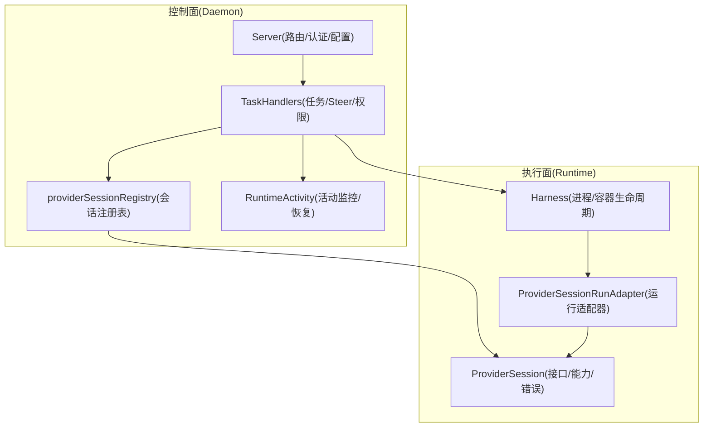
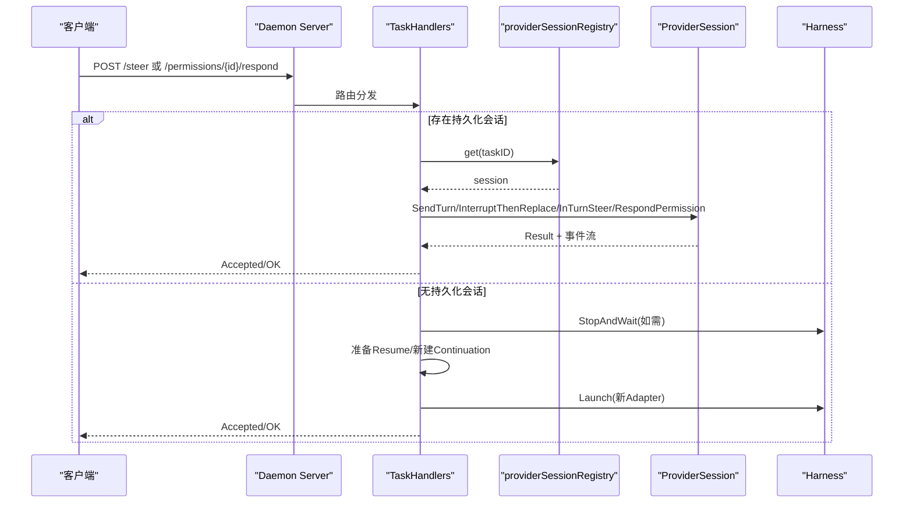
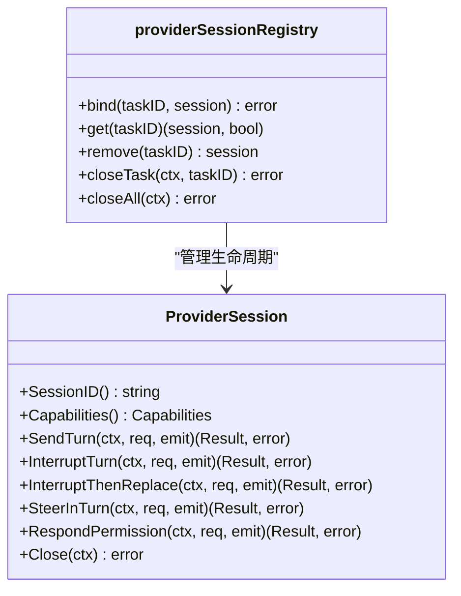
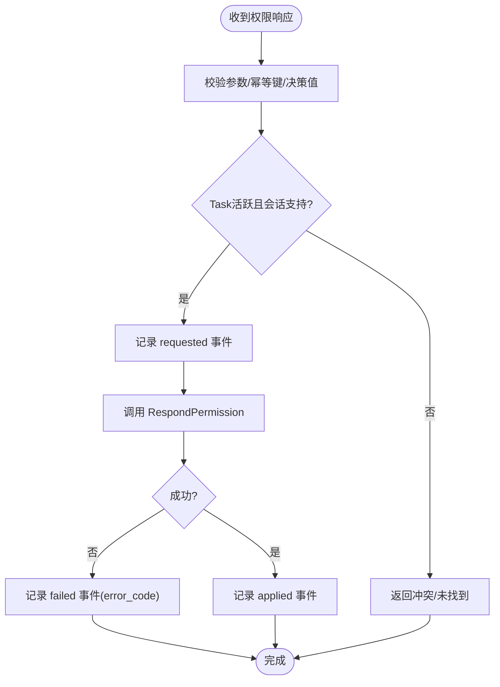
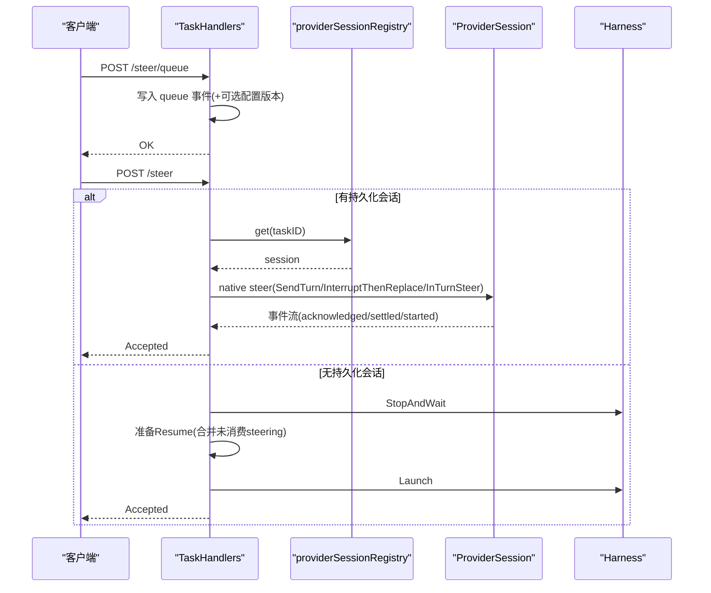
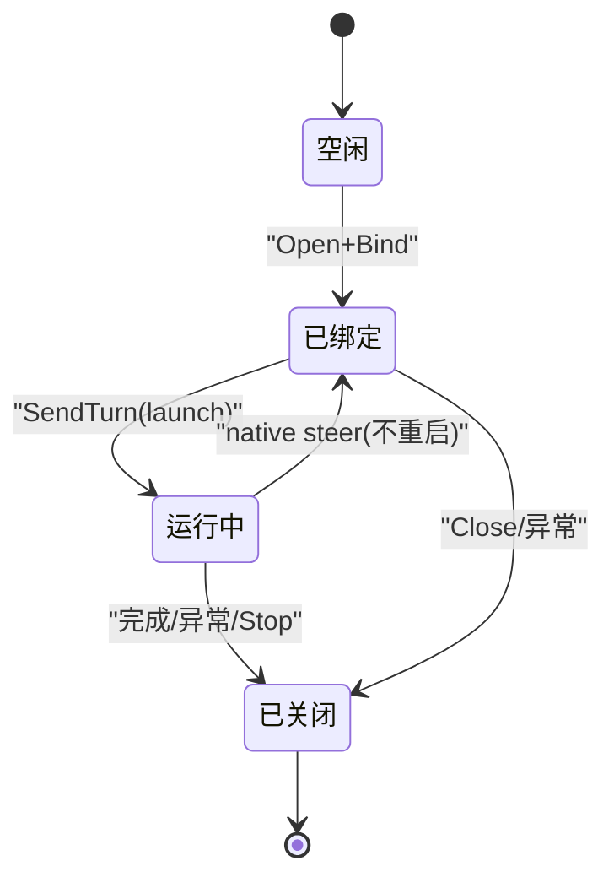
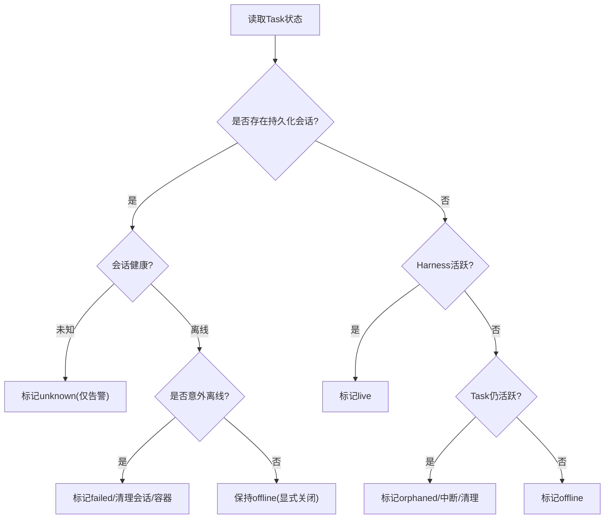
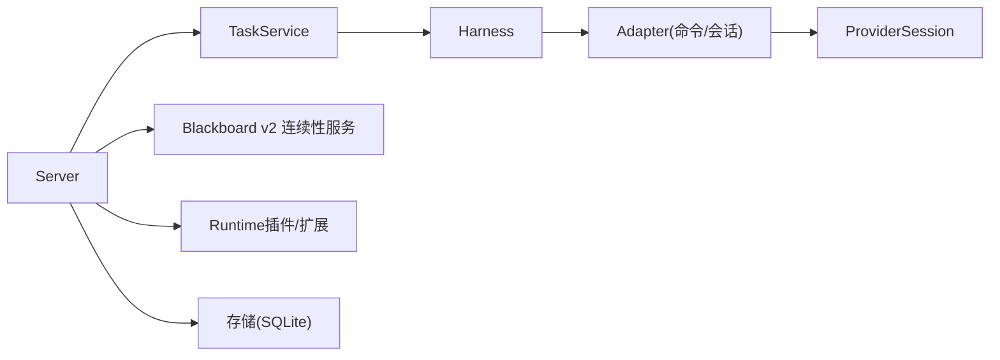

# 任务执行控制

<cite>
**本文引用的文件**   
- [internal/daemon/provider_session_control.go](file://internal/daemon/provider_session_control.go)
- [internal/runtime/provider_session.go](file://internal/runtime/provider_session.go)
- [internal/daemon/server.go](file://internal/daemon/server.go)
- [internal/runtime/runtime.go](file://internal/runtime/runtime.go)
- [internal/daemon/task_handlers.go](file://internal/daemon/task_handlers.go)
- [internal/runtime/provider_bridge_adapter.go](file://internal/runtime/provider_bridge_adapter.go)
- [internal/daemon/runtime_activity.go](file://internal/daemon/runtime_activity.go)
</cite>

## 目录
1. [简介](#简介)
2. [项目结构](#项目结构)
3. [核心组件](#核心组件)
4. [架构总览](#架构总览)
5. [详细组件分析](#详细组件分析)
6. [依赖关系分析](#依赖关系分析)
7. [性能与可靠性](#性能与可靠性)
8. [故障排除指南](#故障排除指南)
9. [结论](#结论)
10. [附录：API参考](#附录api参考)

## 简介
本文件聚焦于“任务执行控制”的完整机制，围绕以下关键主题展开：
- Provider会话管理：持久化会话的创建、绑定、解绑、关闭与恢复策略
- 权限响应处理：Provider发起的权限请求在Daemon侧的接收、幂等校验与下发
- Steer指令队列机制：队列式与即时式两种Steer路径，以及它们如何驱动原生会话或重启Continuation
- 运行时活动监控：心跳检测、健康状态判定、异常终止与资源清理
- API参考与故障排除：面向运维与开发者的排障要点

## 项目结构
与任务执行控制直接相关的代码分布在三个层次：
- Daemon层（控制面）：HTTP路由、任务生命周期、Provider会话注册表、活动监控与恢复
- Runtime层（执行面）：适配器与持久化会话接口、事件发射、结果与错误模型
- 桥接适配：将持久化会话包装为Harness可运行的Adapter，维持进程/容器生命周期

图表来源
- [internal/daemon/server.go:587-643](file://internal/daemon/server.go#L587-L643)
- [internal/daemon/task_handlers.go:2096-2324](file://internal/daemon/task_handlers.go#L2096-L2324)
- [internal/daemon/provider_session_control.go:18-93](file://internal/daemon/provider_session_control.go#L18-L93)
- [internal/runtime/runtime.go:46-179](file://internal/runtime/runtime.go#L46-L179)
- [internal/runtime/provider_bridge_adapter.go:12-128](file://internal/runtime/provider_bridge_adapter.go#L12-L128)
- [internal/daemon/runtime_activity.go:34-137](file://internal/daemon/runtime_activity.go#L34-L137)

章节来源
- [internal/daemon/server.go:587-643](file://internal/daemon/server.go#L587-L643)
- [internal/daemon/task_handlers.go:2096-2324](file://internal/daemon/task_handlers.go#L2096-L2324)
- [internal/daemon/provider_session_control.go:18-93](file://internal/daemon/provider_session_control.go#L18-L93)
- [internal/runtime/runtime.go:46-179](file://internal/runtime/runtime.go#L46-L179)
- [internal/runtime/provider_bridge_adapter.go:12-128](file://internal/runtime/provider_bridge_adapter.go#L12-L128)
- [internal/daemon/runtime_activity.go:34-137](file://internal/daemon/runtime_activity.go#L34-L137)

## 核心组件
- Provider会话注册表：维护Task到ProviderSession的绑定，提供bind/get/remove/close/closeAll等操作，确保单Task单会话且并发安全。
- Provider会话接口与错误模型：定义能力协商、操作模式、请求/结果结构、事件发射回调、统一错误类型（冲突、关闭、不支持能力等）。
- 持久化会话运行适配器：将ProviderSession包装为Harness.Adapter，负责首次SendTurn、元数据记录、关闭信号传播。
- 任务处理器：实现Steer队列/即时、权限响应、Resume/Finish/Stop等流程；对持久化会话走native steer路径，否则走队列+重启Continuation路径。
- 运行时活动监控：基于当前进程/会话健康与Harness活跃性计算liveness，并在异常时触发失败/中断与资源清理。

章节来源
- [internal/daemon/provider_session_control.go:18-93](file://internal/daemon/provider_session_control.go#L18-L93)
- [internal/runtime/provider_session.go:14-152](file://internal/runtime/provider_session.go#L14-L152)
- [internal/runtime/provider_bridge_adapter.go:12-128](file://internal/runtime/provider_bridge_adapter.go#L12-L128)
- [internal/daemon/task_handlers.go:2096-2324](file://internal/daemon/task_handlers.go#L2096-L2324)
- [internal/daemon/runtime_activity.go:34-137](file://internal/daemon/runtime_activity.go#L34-L137)

## 架构总览
下图展示了从HTTP请求到Provider会话操作的端到端调用链，包括Steer与权限响应的两条主路径。

图表来源
- [internal/daemon/server.go:587-643](file://internal/daemon/server.go#L587-L643)
- [internal/daemon/task_handlers.go:2175-2324](file://internal/daemon/task_handlers.go#L2175-L2324)
- [internal/daemon/provider_session_control.go:95-111](file://internal/daemon/provider_session_control.go#L95-L111)
- [internal/runtime/provider_session.go:140-152](file://internal/runtime/provider_session.go#L140-L152)
- [internal/runtime/runtime.go:75-179](file://internal/runtime/runtime.go#L75-L179)

## 详细组件分析

### Provider会话管理与会话注册表
- 绑定与解绑
  - bind：校验Task与Session身份唯一性，写入内存映射；重复绑定不同会话拒绝。
  - remove/closeTask：按TaskID移除并关闭底层会话，忽略已关闭错误。
  - closeAll：优雅关闭所有会话，聚合错误。
- 事件透传
  - BindProviderSession：将Provider事件Sink注入到会话，仅允许白名单字段持久化，避免泄露原始协议载荷。
  - persistProviderSessionEvent：根据当前Active Continuation决定写入位置，并对权限请求阶段进行标注。
- 生命周期
  - 启动时若未安装ProviderSessionFactory，则仅支持一次性Adapter；生产环境应装配工厂以启用持久化会话。
  - 重启恢复：标记需要恢复的Continuation，提示后续Resume会创建新的Continuation pin。

图表来源
- [internal/daemon/provider_session_control.go:18-93](file://internal/daemon/provider_session_control.go#L18-L93)
- [internal/runtime/provider_session.go:140-152](file://internal/runtime/provider_session.go#L140-L152)

章节来源
- [internal/daemon/provider_session_control.go:18-93](file://internal/daemon/provider_session_control.go#L18-L93)
- [internal/daemon/provider_session_control.go:95-147](file://internal/daemon/provider_session_control.go#L95-L147)
- [internal/daemon/server.go:255-304](file://internal/daemon/server.go#L255-L304)

### 权限响应处理
- 入口：POST /projects/{id}/tasks/{task_id}/permissions/{permission_id}/respond
- 幂等与一致性
  - RequestID可由客户端传入或自动构造；同一RequestID不允许变更决策。
  - 通过事件回溯判断是否仍在pending或已applied/failed。
- 执行路径
  - 校验Task处于运行/暂停态，且会话具备PermissionResponse能力。
  - 记录“requested/acknowledged/applied/failed”等阶段事件，屏蔽敏感字段。
  - 异步调用RespondPermission，超时/取消/冲突等错误映射为标准error_code。

图表来源
- [internal/daemon/task_handlers.go:2519-2718](file://internal/daemon/task_handlers.go#L2519-L2718)
- [internal/runtime/provider_session.go:140-152](file://internal/runtime/provider_session.go#L140-L152)

章节来源
- [internal/daemon/task_handlers.go:2519-2718](file://internal/daemon/task_handlers.go#L2519-L2718)

### Steer指令队列机制
- 队列式（非阻塞）
  - 入口：POST /.../steer/queue
  - 行为：追加一条“steering_requested(mode=queue)”事件；如包含Profile/Model/Effort选择，生成新的RuntimeConfigVersion。
  - 适用：无需立即生效，等待下次Resume或自然消费。
- 即时式（可能中断并重启）
  - 入口：POST /.../steer
  - 行为：
    - 若存在持久化会话：走native steer路径（SendTurn/InterruptThenReplace/InTurnSteer），不重启进程。
    - 若无持久化会话：先StopAndWait，再准备Resume（含未消费的harness steering），Launch新Continuation。
  - 适用：需要立刻改变执行方向或切换模型/推理强度。

图表来源
- [internal/daemon/task_handlers.go:2096-2324](file://internal/daemon/task_handlers.go#L2096-L2324)
- [internal/daemon/provider_session_control.go:168-224](file://internal/daemon/provider_session_control.go#L168-L224)
- [internal/runtime/runtime.go:75-179](file://internal/runtime/runtime.go#L75-L179)

章节来源
- [internal/daemon/task_handlers.go:2096-2324](file://internal/daemon/task_handlers.go#L2096-L2324)
- [internal/daemon/provider_session_control.go:168-224](file://internal/daemon/provider_session_control.go#L168-L224)

### 持久化会话的生命周期与绑定/解绑
- 启动装配
  - 当存在ProviderSessionFactory且目标Runner/Provider支持持久化会话时，Open后Bind到Task，并将初始Turn Selection注入适配器。
- 运行期
  - Harness通过ProviderSessionRunAdapter发送首个turn；随后所有native steer复用该会话，不再创建新容器。
- 结束与清理
  - 正常完成：关闭会话释放所有权。
  - 异常退出：强制关闭会话，防止所有权残留。
  - 重启恢复：标记需要恢复的Continuation，提示后续Resume重建pin。

图表来源
- [internal/daemon/task_handlers.go:196-285](file://internal/daemon/task_handlers.go#L196-L285)
- [internal/runtime/provider_bridge_adapter.go:70-112](file://internal/runtime/provider_bridge_adapter.go#L70-L112)
- [internal/daemon/server.go:255-304](file://internal/daemon/server.go#L255-L304)

章节来源
- [internal/daemon/task_handlers.go:196-285](file://internal/daemon/task_handlers.go#L196-L285)
- [internal/runtime/provider_bridge_adapter.go:70-112](file://internal/runtime/provider_bridge_adapter.go#L70-L112)
- [internal/daemon/server.go:255-304](file://internal/daemon/server.go#L255-L304)

### 运行时活动监控、心跳检测与异常终止
- 活动判定
  - 有持久化会话：以会话健康为准（未知/离线/忙碌/空闲）。
  - 无持久化会话：以Harness活跃性为准。
- 恢复策略
  - 意外离线：标记Task失败，清理会话与容器/进程组。
  - 孤儿态（活跃但无所有权）：标记中断，清理会话。
  - 未知健康：仅告警，不变更生命周期。
- 资源清理
  - 重启时清理遗留容器/主机进程组，并记录lifecycle事件。

图表来源
- [internal/daemon/runtime_activity.go:34-137](file://internal/daemon/runtime_activity.go#L34-L137)
- [internal/daemon/server.go:306-344](file://internal/daemon/server.go#L306-L344)

章节来源
- [internal/daemon/runtime_activity.go:34-137](file://internal/daemon/runtime_activity.go#L34-L137)
- [internal/daemon/server.go:306-344](file://internal/daemon/server.go#L306-L344)

## 依赖关系分析
- Daemon层依赖
  - TaskService：读写事件、Continuation、状态机
  - Blackboard v2连续性服务：用于v2任务的上下文恢复与投影
  - Runtime插件/扩展注册表：解析Provider能力与扩展
  - 存储：SQLite持久化
- Runtime层依赖
  - Adapter/Harness：封装进程/容器生命周期
  - ProviderSession：跨Provider的统一控制边界
- 耦合与内聚
  - 会话注册表与Daemon强耦合，保证单Task单会话语义
  - ProviderSessionRunAdapter将会话与Harness解耦，便于测试与替换
  - 错误类型分层清晰：能力不支持、冲突、关闭、操作失败等

图表来源
- [internal/daemon/server.go:83-118](file://internal/daemon/server.go#L83-L118)
- [internal/runtime/runtime.go:46-179](file://internal/runtime/runtime.go#L46-L179)
- [internal/runtime/provider_bridge_adapter.go:12-128](file://internal/runtime/provider_bridge_adapter.go#L12-L128)

章节来源
- [internal/daemon/server.go:83-118](file://internal/daemon/server.go#L83-L118)
- [internal/runtime/runtime.go:46-179](file://internal/runtime/runtime.go#L46-L179)
- [internal/runtime/provider_bridge_adapter.go:12-128](file://internal/runtime/provider_bridge_adapter.go#L12-L128)

## 性能与可靠性
- 幂等与去重
  - Steer与权限响应均支持Idempotency-Key/request_id，避免重复提交导致多次执行。
- 并发控制
  - 使用控制锁避免Stop/Resume/Steer等操作的竞态；会话级冲突错误明确区分。
- 超时与重试
  - Native steer操作设置30秒超时；StopAndWait带超时预算；本地取消不影响远端重放。
- 资源回收
  - 会话关闭与容器/进程组清理在异常路径与重启恢复中均有保障。
- 观测性
  - 事件流覆盖生命周期、对话、引导、运行时输出等维度，便于追踪与审计。

[本节为通用指导，不直接分析具体文件]

## 故障排除指南
- 常见错误码与含义
  - 控制冲突：已有其他控制操作在进行中，稍后重试
  - 会话关闭：会话已被显式关闭或进程退出
  - 不支持能力：当前Provider会话不具备所需能力（如in_turn_steer、interrupt_then_replace、permission_response）
  - 请求冲突：相同request_id对应不同内容
  - 超时/取消：服务端关闭或请求超时
- 定位步骤
  - 查看Task事件流中的phase/outcome字段，确认处于requested/acknowledged/settled/started/applied/failed哪一阶段
  - 检查是否有“provider_permission_requested”事件，必要时通过权限响应接口补答
  - 核对Native steer的mode与outcome是否与期望一致
  - 观察活动监控返回的liveness（live/offline/orphaned/unknown）与turn activity（busy/idle）
- 恢复建议
  - 对于orphaned：等待系统自动中断或手动Stop/Resume
  - 对于unexpected offline：检查容器/宿主进程是否存活，必要时重启Daemon
  - 对于能力不支持：更换Provider或调整Runtime Profile

章节来源
- [internal/runtime/provider_session.go:40-90](file://internal/runtime/provider_session.go#L40-L90)
- [internal/daemon/task_handlers.go:2326-2518](file://internal/daemon/task_handlers.go#L2326-L2518)
- [internal/daemon/runtime_activity.go:145-213](file://internal/daemon/runtime_activity.go#L145-L213)

## 结论
本方案通过“持久化会话 + 事件驱动 + 活动监控”的组合，实现了高可靠的任务执行控制：
- 持久化会话避免频繁拉起容器/进程，提升吞吐与稳定性
- 事件流提供完整的可观测性与审计能力
- 活动监控与恢复策略确保异常场景下的自愈与资源回收
- 统一的错误模型与幂等设计简化了上层集成与排障

[本节为总结，不直接分析具体文件]

## 附录：API参考
以下为与任务执行控制相关的关键HTTP端点与行为说明（不含具体JSON示例，详见各处理器实现）：
- POST /api/projects/{id}/tasks/{task_id}/steer/queue
  - 作用：将Steer指令入队，不立即执行；可选择更新Runtime Profile/Model/Effort并生成新的RuntimeConfigVersion
  - 关键输入：directive、runtime_profile_id、model_provider_id、model/model_override、reasoning_effort、submitted_by
  - 返回：event、可选runtime_config_version
- POST /api/projects/{id}/tasks/{task_id}/steer
  - 作用：即时Steer；若有持久化会话则走native steer，否则停止并重启Continuation
  - 关键输入：同上
  - 返回：event、可选runtime_config_version、task详情（接受后立即返回）
- POST /api/projects/{id}/tasks/{task_id}/permissions/{permission_id}/respond
  - 作用：对Provider权限请求做出allow/deny决策
  - 关键输入：decision、request_id（可选）、幂等键
  - 返回：accepted/accepted with prior outcome
- GET /health
  - 作用：健康探针，返回版本、数据库、MCP、Runner信息
- 其他任务控制
  - POST /stop、POST /finish、POST /resume、GET /events、GET /transcript、GET /timeline

章节来源
- [internal/daemon/server.go:587-643](file://internal/daemon/server.go#L587-L643)
- [internal/daemon/task_handlers.go:2096-2324](file://internal/daemon/task_handlers.go#L2096-L2324)
- [internal/daemon/task_handlers.go:2519-2718](file://internal/daemon/task_handlers.go#L2519-L2718)
- [internal/daemon/server.go:645-674](file://internal/daemon/server.go#L645-L674)