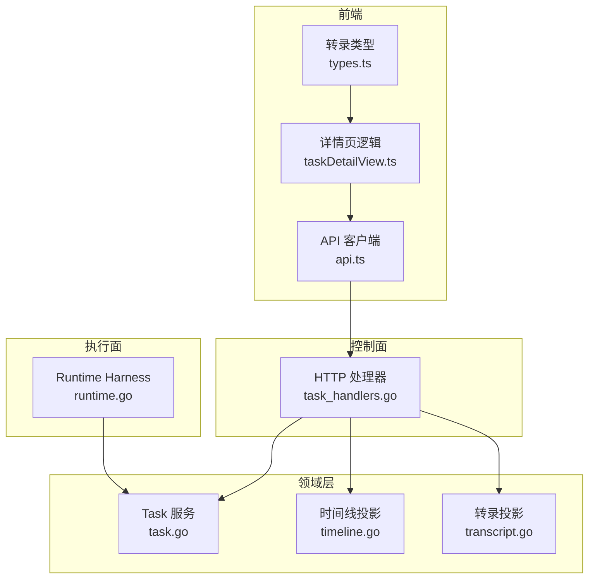
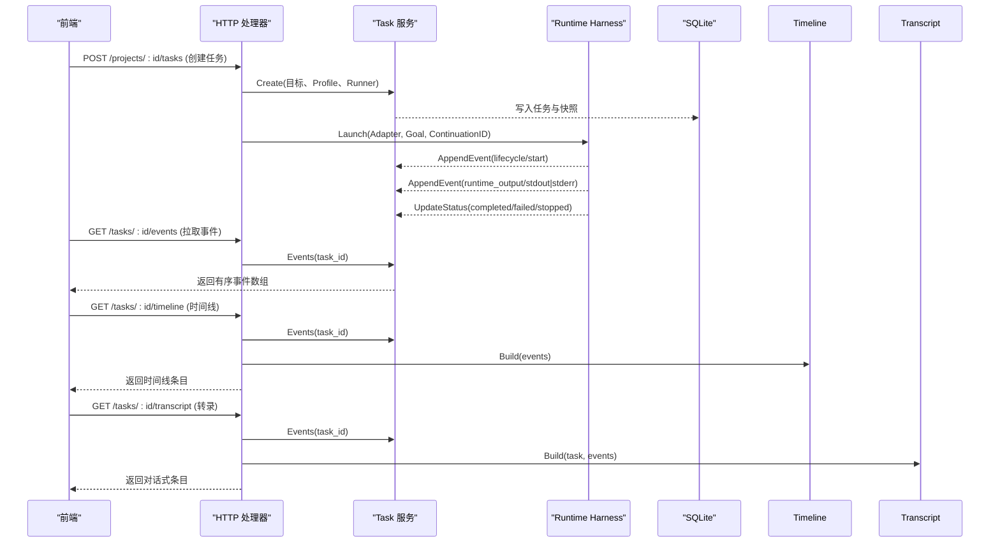
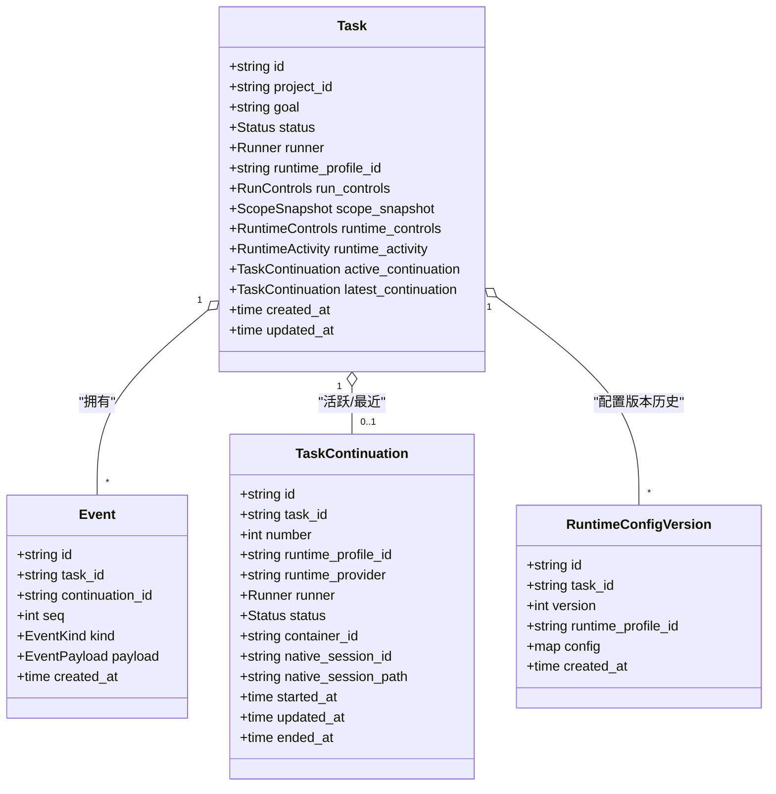
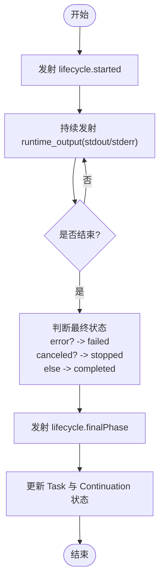
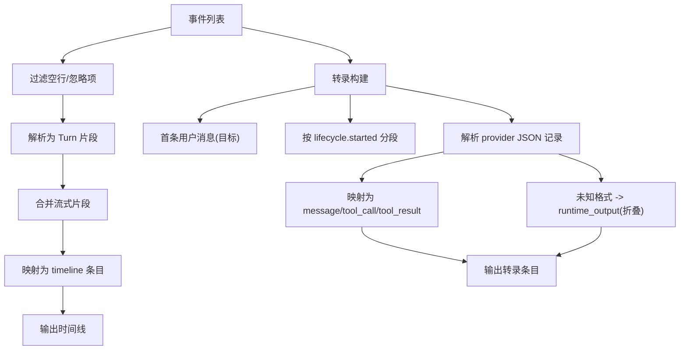
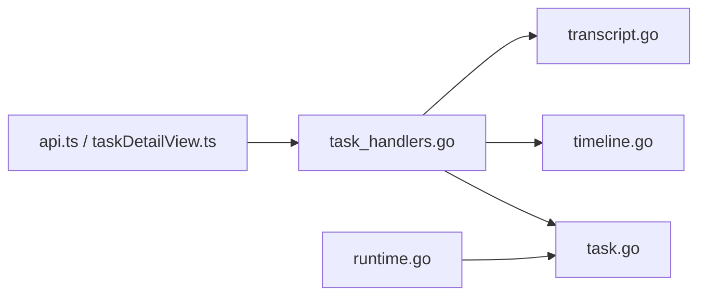

# 任务状态监控

<cite>
**本文引用的文件**   
- [internal/task/task.go](file://internal/task/task.go)
- [internal/timeline/timeline.go](file://internal/timeline/timeline.go)
- [internal/transcript/transcript.go](file://internal/transcript/transcript.go)
- [internal/daemon/task_handlers.go](file://internal/daemon/task_handlers.go)
- [internal/runtime/runtime.go](file://internal/runtime/runtime.go)
- [web/src/lib/api.ts](file://web/src/lib/api.ts)
- [web/src/pages/taskDetailView.ts](file://web/src/pages/taskDetailView.ts)
- [web/src/components/task-transcript/types.ts](file://web/src/components/task-transcript/types.ts)
- [scripts/smoke-runtime-tasks-live.py](file://scripts/smoke-runtime-tasks-live.py)
</cite>

## 目录
1. [简介](#简介)
2. [项目结构](#项目结构)
3. [核心组件](#核心组件)
4. [架构总览](#架构总览)
5. [详细组件分析](#详细组件分析)
6. [依赖关系分析](#依赖关系分析)
7. [性能与可扩展性](#性能与可扩展性)
8. [故障排查指南](#故障排查指南)
9. [结论](#结论)
10. [附录：API 参考与前端集成示例](#附录api-参考与前端集成示例)

## 简介
本文件围绕“任务状态监控”展开，系统性梳理任务状态机、事件驱动架构、时间线记录、转录日志收集、实时状态更新与事件订阅模式。文档覆盖任务生命周期事件的类型定义、事件序列化与查询接口，并提供完整的后端 API 参考与前端集成示例，帮助读者快速构建稳定可靠的任务监控能力。

## 项目结构
与任务状态监控直接相关的代码分布在以下模块：
- 领域模型与持久化：Task 服务（状态、事件、Continuation、运行时配置版本）
- 运行时执行与状态回写：Runtime Harness（进程/容器生命周期、最终状态落库）
- 事件投影与可读视图：Timeline（诊断时间线）、Transcript（对话式转录）
- HTTP 控制面：Daemon Task Handlers（创建、停止、事件/时间线/转录查询、转向控制）
- 前端 API 客户端与页面逻辑：TypeScript 类型、事件过滤与摘要、转录展示

图表来源
- [internal/daemon/task_handlers.go:1400-1467](file://internal/daemon/task_handlers.go#L1400-L1467)
- [internal/task/task.go:481-590](file://internal/task/task.go#L481-L590)
- [internal/timeline/timeline.go:29-76](file://internal/timeline/timeline.go#L29-L76)
- [internal/transcript/transcript.go:49-82](file://internal/transcript/transcript.go#L49-L82)
- [internal/runtime/runtime.go:153-179](file://internal/runtime/runtime.go#L153-L179)
- [web/src/lib/api.ts:425-467](file://web/src/lib/api.ts#L425-L467)
- [web/src/pages/taskDetailView.ts:1-41](file://web/src/pages/taskDetailView.ts#L1-L41)
- [web/src/components/task-transcript/types.ts:1-15](file://web/src/components/task-transcript/types.ts#L1-L15)

章节来源
- [internal/daemon/task_handlers.go:1400-1467](file://internal/daemon/task_handlers.go#L1400-L1467)
- [internal/task/task.go:481-590](file://internal/task/task.go#L481-L590)
- [internal/timeline/timeline.go:29-76](file://internal/timeline/timeline.go#L29-L76)
- [internal/transcript/transcript.go:49-82](file://internal/transcript/transcript.go#L49-L82)
- [internal/runtime/runtime.go:153-179](file://internal/runtime/runtime.go#L153-L179)
- [web/src/lib/api.ts:425-467](file://web/src/lib/api.ts#L425-L467)
- [web/src/pages/taskDetailView.ts:1-41](file://web/src/pages/taskDetailView.ts#L1-L41)
- [web/src/components/task-transcript/types.ts:1-15](file://web/src/components/task-transcript/types.ts#L1-L15)

## 核心组件
- 任务领域模型与状态机
  - 任务状态：pending、running、paused、completed、failed、stopped、interrupted
  - 事件种类：runtime_output、status、steering、conversation、lifecycle、blackboard_checkpoint
  - Continuation：一次运行实例的边界，支持运行时配置版本历史
  - 事件追加与序列号保证顺序性
- 运行时执行与状态回写
  - 启动适配器（Docker 沙箱或宿主机命令），输出经 Adapter 转为结构化事件
  - 结束时根据错误/上下文取消决定最终状态并落库
- 事件投影与可读视图
  - Timeline：将原始事件合并为工具调用/结果、思考、文本、错误、生命周期等条目
  - Transcript：将事件重构为对话式消息、工具调用/结果、运行时输出、Continuation 分隔
- HTTP 控制面
  - 提供任务列表/详情、事件/时间线/转录查询、停止/完成、转向（队列/中断）等接口
- 前端集成
  - TypeScript 类型映射后端结构
  - 详情页对事件进行过滤与摘要，渲染 Conversation/Timeline 双视图

章节来源
- [internal/task/task.go:31-69](file://internal/task/task.go#L31-L69)
- [internal/task/task.go:98-128](file://internal/task/task.go#L98-L128)
- [internal/task/task.go:481-590](file://internal/task/task.go#L481-L590)
- [internal/runtime/runtime.go:153-179](file://internal/runtime/runtime.go#L153-L179)
- [internal/timeline/timeline.go:29-76](file://internal/timeline/timeline.go#L29-L76)
- [internal/transcript/transcript.go:49-82](file://internal/transcript/transcript.go#L49-L82)
- [internal/daemon/task_handlers.go:1400-1467](file://internal/daemon/task_handlers.go#L1400-L1467)
- [web/src/lib/api.ts:425-467](file://web/src/lib/api.ts#L425-L467)
- [web/src/pages/taskDetailView.ts:1-41](file://web/src/pages/taskDetailView.ts#L1-L41)

## 架构总览
任务状态监控由“控制面 + 领域层 + 执行面 + 前端”四层协作完成：
- 控制面通过 HTTP 暴露任务相关接口，负责鉴权、参数校验、编排领域服务与运行时
- 领域层维护任务状态、事件、Continuation 及运行时配置版本，确保一致性与可审计
- 执行面以适配器抽象不同 Provider（Codex/Claude/Pi 等），统一产出结构化事件
- 前端基于事件/时间线/转录数据构建可读界面，并通过轮询获取最新状态

图表来源
- [internal/daemon/task_handlers.go:1400-1467](file://internal/daemon/task_handlers.go#L1400-L1467)
- [internal/task/task.go:481-590](file://internal/task/task.go#L481-L590)
- [internal/runtime/runtime.go:153-179](file://internal/runtime/runtime.go#L153-L179)

## 详细组件分析

### 任务状态机与事件模型
- 状态集合与含义
  - pending：已创建未启动
  - running：正在执行
  - paused：暂停
  - completed：正常结束
  - failed：异常结束
  - stopped：被外部停止
  - interrupted：守护进程重启后恢复标记
- 事件种类与用途
  - lifecycle：进程/会话生命周期阶段（started/completed/failed/stopped/process_started 等）
  - runtime_output：Provider 标准输出/错误流（stdout/stderr）
  - steering：转向指令（请求/应用/失败等）
  - conversation：对话消息（用户/助手/系统/工具）
  - blackboard_checkpoint：语义黑板检查点
- 事件持久化与顺序
  - 每个任务的事件按 seq 单调递增，事务内计算最大 seq 并插入，保证并发安全
- Continuation 与运行时配置版本
  - 每次启动会生成新的运行时配置版本，用于追踪 Profile/Model 切换而不新建任务
  - Continuation 有独立状态与重连/恢复标记，便于跨重启一致性

图表来源
- [internal/task/task.go:201-218](file://internal/task/task.go#L201-L218)
- [internal/task/task.go:74-84](file://internal/task/task.go#L74-L84)
- [internal/task/task.go:98-128](file://internal/task/task.go#L98-L128)
- [internal/task/task.go:86-96](file://internal/task/task.go#L86-L96)

章节来源
- [internal/task/task.go:31-69](file://internal/task/task.go#L31-L69)
- [internal/task/task.go:481-590](file://internal/task/task.go#L481-L590)
- [internal/task/task.go:98-128](file://internal/task/task.go#L98-L128)
- [internal/task/task.go:86-96](file://internal/task/task.go#L86-L96)

### 事件驱动与状态回写流程
- 运行时在启动时发射 lifecycle.started，随后持续产生 runtime_output
- 结束时根据错误/上下文取消决定 finalStatus，并先发射 lifecycle 事件再落库
- 若任务被外部停止，设置 stopped；若出现异常，设置 failed；否则 completed

图表来源
- [internal/runtime/runtime.go:153-179](file://internal/runtime/runtime.go#L153-L179)

章节来源
- [internal/runtime/runtime.go:153-179](file://internal/runtime/runtime.go#L153-L179)

### 时间线与转录投影
- Timeline 构建
  - 过滤空行与忽略项，解析 provider 输出为 thinking/text/tool_use/tool_result/error
  - 将 lifecycle/steering 事件转换为对应条目
- Transcript 构建
  - 首条为用户消息（任务目标）
  - 按 lifecycle.started 划分 Continuation 段
  - 将 provider JSON 记录解析为 assistant/user/system/tool 消息
  - 未知格式降级为折叠的 runtime_output 条目

图表来源
- [internal/timeline/timeline.go:29-76](file://internal/timeline/timeline.go#L29-L76)
- [internal/transcript/transcript.go:49-82](file://internal/transcript/transcript.go#L49-L82)

章节来源
- [internal/timeline/timeline.go:29-76](file://internal/timeline/timeline.go#L29-L76)
- [internal/transcript/transcript.go:49-82](file://internal/transcript/transcript.go#L49-L82)

### 实时状态更新与事件订阅模式
- 当前实现采用轮询方式：前端周期性调用事件/时间线/转录接口获取增量
- 未来可扩展为 SSE/WebSocket 推送，但需保持事件幂等与去重策略
- 前端侧可通过比较 last_seq 或 created_at 实现增量更新

章节来源
- [web/src/lib/api.ts:425-467](file://web/src/lib/api.ts#L425-L467)
- [scripts/smoke-runtime-tasks-live.py:176-211](file://scripts/smoke-runtime-tasks-live.py#L176-L211)

## 依赖关系分析
- 控制面依赖领域服务与运行时适配器
- 领域服务依赖数据库与可选的项目服务（用于捕获范围快照）
- 运行时适配器依赖容器 CLI 或命令执行环境
- 前端依赖 API 客户端类型定义与页面逻辑

图表来源
- [internal/daemon/task_handlers.go:1400-1467](file://internal/daemon/task_handlers.go#L1400-L1467)
- [internal/task/task.go:481-590](file://internal/task/task.go#L481-L590)
- [internal/timeline/timeline.go:29-76](file://internal/timeline/timeline.go#L29-L76)
- [internal/transcript/transcript.go:49-82](file://internal/transcript/transcript.go#L49-L82)
- [internal/runtime/runtime.go:153-179](file://internal/runtime/runtime.go#L153-L179)
- [web/src/lib/api.ts:425-467](file://web/src/lib/api.ts#L425-L467)
- [web/src/pages/taskDetailView.ts:1-41](file://web/src/pages/taskDetailView.ts#L1-L41)

章节来源
- [internal/daemon/task_handlers.go:1400-1467](file://internal/daemon/task_handlers.go#L1400-L1467)
- [internal/task/task.go:481-590](file://internal/task/task.go#L481-L590)
- [internal/timeline/timeline.go:29-76](file://internal/timeline/timeline.go#L29-L76)
- [internal/transcript/transcript.go:49-82](file://internal/transcript/transcript.go#L49-L82)
- [internal/runtime/runtime.go:153-179](file://internal/runtime/runtime.go#L153-L179)
- [web/src/lib/api.ts:425-467](file://web/src/lib/api.ts#L425-L467)
- [web/src/pages/taskDetailView.ts:1-41](file://web/src/pages/taskDetailView.ts#L1-L41)

## 性能与可扩展性
- 事件追加使用事务与 MAX(seq)+1 计算，避免并发冲突，适合高吞吐写入
- Timeline/Transcript 为只读投影，建议在服务端缓存或分页返回，减少重复解析
- 大任务建议增量拉取事件（基于 last_seq 或 created_at），降低带宽与 CPU 消耗
- 未来引入推送机制时，注意事件去重与断线重连幂等

[本节为通用指导，不直接分析具体文件]

## 故障排查指南
- 任务卡住无输出
  - 检查 lifecycle.process_started 是否出现
  - 观察 runtime_output 是否有 stdout/stderr 输出
  - 确认最终状态是否为 failed/stopped
- 状态不一致
  - 对比 Task 状态与 Continuation 状态
  - 检查 daemon 重启后的 ReconcileInterruptedStatuses 是否生效
- 转录不可读
  - 确认 provider 输出为 JSON 且能被解析器识别
  - 未知格式会降级为折叠的 runtime_output，展开查看原始内容

章节来源
- [scripts/smoke-runtime-tasks-live.py:176-211](file://scripts/smoke-runtime-tasks-live.py#L176-L211)
- [internal/task/task.go:1236-1266](file://internal/task/task.go#L1236-L1266)
- [internal/transcript/transcript.go:374-396](file://internal/transcript/transcript.go#L374-L396)

## 结论
任务状态监控以“事件为事实源”，通过领域服务保证一致性与顺序，运行时适配器统一产出结构化事件，控制面提供查询与控制接口，前端以时间线与转录两种视角呈现。该设计具备良好的扩展性与可观测性，适合长期演进为实时推送与更丰富的交互。

[本节为总结，不直接分析具体文件]

## 附录：API 参考与前端集成示例

### 后端 API 参考（任务相关）
- 列出任务
  - 方法：GET
  - 路径：/api/projects/{project_id}/tasks
  - 说明：返回项目下所有任务，附带运行时活动信息
- 获取任务详情
  - 方法：GET
  - 路径：/api/projects/{project_id}/tasks/{task_id}
  - 说明：返回任务详情，包括活跃/最近 Continuation 与运行时控制能力
- 删除任务
  - 方法：DELETE
  - 路径：/api/projects/{project_id}/tasks/{task_id}
  - 说明：仅允许非活跃任务删除
- 获取事件
  - 方法：GET
  - 路径：/api/projects/{project_id}/tasks/{task_id}/events
  - 说明：按 seq 升序返回事件数组
- 获取时间线
  - 方法：GET
  - 路径：/api/projects/{project_id}/tasks/{task_id}/timeline
  - 说明：返回时间线条目（thinking/text/tool_use/tool_result/error/lifecycle/steering）
- 获取转录
  - 方法：GET
  - 路径：/api/projects/{project_id}/tasks/{task_id}/transcript
  - 说明：返回对话式条目（message/tool_call/tool_result/runtime_output/continuation）
- 停止任务
  - 方法：POST
  - 路径：/api/projects/{project_id}/tasks/{task_id}/stop
  - 说明：尝试优雅停止，必要时等待超时并落库 stopped
- 完成任务（操作者触发）
  - 方法：POST
  - 路径：/api/projects/{project_id}/tasks/{task_id}/finish
  - 说明：要求运行时 live+idle，关闭资源后标记 completed
- 转向（队列/中断）
  - 方法：POST
  - 路径：/api/projects/{project_id}/tasks/{task_id}/steer
  - 说明：立即转向（可能中断当前 turn）
  - 方法：POST
  - 路径：/api/projects/{project_id}/tasks/{task_id}/steer/queue
  - 说明：排队转向，下次 continuation 应用

章节来源
- [internal/daemon/task_handlers.go:1120-1168](file://internal/daemon/task_handlers.go#L1120-L1168)
- [internal/daemon/task_handlers.go:1400-1467](file://internal/daemon/task_handlers.go#L1400-L1467)
- [internal/daemon/task_handlers.go:1469-1551](file://internal/daemon/task_handlers.go#L1469-L1551)
- [internal/daemon/task_handlers.go:1575-1599](file://internal/daemon/task_handlers.go#L1575-L1599)
- [internal/daemon/task_handlers.go:2137-2174](file://internal/daemon/task_handlers.go#L2137-L2174)

### 前端集成示例
- 类型定义
  - TaskEvent、TaskTimelineItem、TaskTranscriptEntry 等类型位于 api.ts
  - 转录 UI 类型 types.ts 定义了 TimelineItemType 与颜色映射
- 事件过滤与摘要
  - taskDetailView.ts 中 shouldShowInTimeline 与 summarizeTaskEvent 用于筛选与摘要
- 轮询策略
  - 脚本 smoke-runtime-tasks-live.py 展示了基于事件增量与状态判定的轮询范式

章节来源
- [web/src/lib/api.ts:425-467](file://web/src/lib/api.ts#L425-L467)
- [web/src/components/task-transcript/types.ts:1-15](file://web/src/components/task-transcript/types.ts#L1-L15)
- [web/src/pages/taskDetailView.ts:1-41](file://web/src/pages/taskDetailView.ts#L1-L41)
- [scripts/smoke-runtime-tasks-live.py:176-211](file://scripts/smoke-runtime-tasks-live.py#L176-L211)