# 任务生命周期管理

<cite>
**本文引用的文件**   
- [task_handlers.go](file://internal/daemon/task_handlers.go)
- [provider_session_control.go](file://internal/daemon/provider_session_control.go)
- [continuity.go](file://internal/blackboardv2/continuity.go)
- [provider_session.go](file://internal/runtime/provider_session.go)
- [runtime.go](file://internal/runtime/runtime.go)
- [task.go](file://internal/task/task.go)
- [blackboard_v2_continuity_test.go](file://internal/daemon/blackboard_v2_continuity_test.go)
- [finish_task_resume_test.go](file://internal/daemon/finish_task_resume_test.go)
- [runtime_turn_selection_test.go](file://internal/daemon/runtime_turn_selection_test.go)
- [smoke-runtime-tasks-live.py](file://scripts/smoke-runtime-tasks-live.py)
</cite>

## 目录
1. [简介](#简介)
2. [项目结构](#项目结构)
3. [核心组件](#核心组件)
4. [架构总览](#架构总览)
5. [详细组件分析](#详细组件分析)
6. [依赖关系分析](#依赖关系分析)
7. [性能与可靠性](#性能与可靠性)
8. [故障排查指南](#故障排查指南)
9. [结论](#结论)
10. [附录：API参考与使用示例](#附录api参考与使用示例)

## 简介
本文件面向本地优先的渗透测试代理系统，聚焦“任务生命周期管理”的完整闭环：创建、启动、监控、停止、恢复；并深入解析状态机转换、事件驱动架构、进度跟踪与日志收集机制。文档同时覆盖 Provider 会话控制、权限响应处理、Steer 指令队列与 Continuation 恢复逻辑，并提供完整的 API 参考与实际使用场景示例。

## 项目结构
围绕任务生命周期的关键代码分布在以下模块：
- Daemon HTTP 服务层：任务路由、编排、事件持久化、Provider 会话注册与控制
- Blackboard v2 连续性服务：Continuation 原子创建、Working Snapshot 同步与发布、授权令牌
- Runtime/Harness：进程/容器隔离、适配器、停止与完成语义
- Task 服务：事件存储、未消费指令、Reconciliation 标记
- Provider Session：能力协商、操作模式、幂等与冲突控制

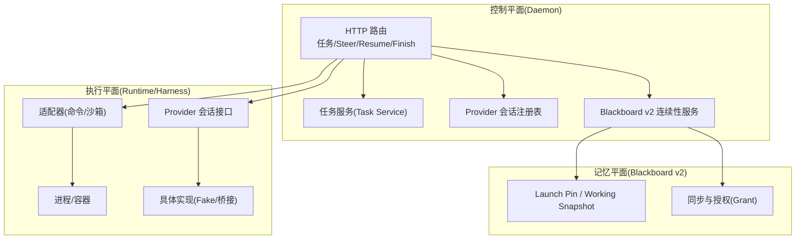

图表来源
- [task_handlers.go:1-800](file://internal/daemon/task_handlers.go#L1-L800)
- [continuity.go:764-880](file://internal/blackboardv2/continuity.go#L764-L880)
- [provider_session.go:140-152](file://internal/runtime/provider_session.go#L140-L152)
- [runtime.go:153-189](file://internal/runtime/runtime.go#L153-L189)

章节来源
- [task_handlers.go:1-800](file://internal/daemon/task_handlers.go#L1-L800)
- [continuity.go:764-880](file://internal/blackboardv2/continuity.go#L764-L880)
- [provider_session.go:140-152](file://internal/runtime/provider_session.go#L140-L152)
- [runtime.go:153-189](file://internal/runtime/runtime.go#L153-L189)

## 核心组件
- 任务服务与事件总线
  - 负责任务 CRUD、事件追加、未消费 Harness Steering 查询、Continuation 状态与 Reconciliation 标记维护。
- Blackboard v2 连续性服务
  - 提供 Continuation 原子创建（含 Launch Pin、Working Snapshot、Grant）、同步与重放、活跃快照恢复。
- Provider 会话控制
  - 在内存中注册与绑定 Task 级会话，支持 SendTurn/InterruptThenReplace/InTurnSteer/PermissionResponse 等操作，具备幂等键与冲突检测。
- Runtime/Harness
  - 封装命令或沙箱适配器，统一 Stop/StopAndWait/IsActive 语义，并在退出时写入 lifecycle 事件与最终状态。

章节来源
- [task.go:564-627](file://internal/task/task.go#L564-L627)
- [continuity.go:764-880](file://internal/blackboardv2/continuity.go#L764-L880)
- [provider_session_control.go:18-111](file://internal/daemon/provider_session_control.go#L18-L111)
- [runtime.go:153-189](file://internal/runtime/runtime.go#L153-L189)

## 架构总览
下图展示一次“中断式 Steer + Native Resume”的典型流程，包括状态切换、事件流与 Continuation 替换。

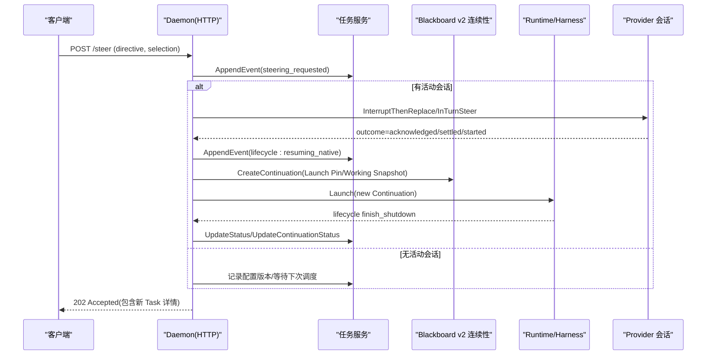

图表来源
- [task_handlers.go:2176-2324](file://internal/daemon/task_handlers.go#L2176-L2324)
- [continuity.go:764-880](file://internal/blackboardv2/continuity.go#L764-L880)
- [runtime.go:153-189](file://internal/runtime/runtime.go#L153-L189)

## 详细组件分析

### 任务状态机与事件流
- 状态集合
  - pending、running、paused、stopped、failed、completed
- 关键转换
  - 启动：pending → running（由 Harness 启动后更新）
  - 停止：running/paused → stopped（显式 Stop 或 Finish 失败回退）
  - 失败：running/paused → failed（异常或 Finish 失败回退）
  - 完成：仅 operator_finish 路径可写 completed（Finish 成功后）
- 事件类型
  - lifecycle：process_started、interrupting、resuming_native、finish_shutdown、completed、failed、stopped 等
  - steering：steering_requested、steering_applied（含 requested_event_id）
  - conversation/steering（Provider 会话）：mode/outcome/request_id/session_id/provider_turn_id
  - runtime_output：文本输出与流式日志

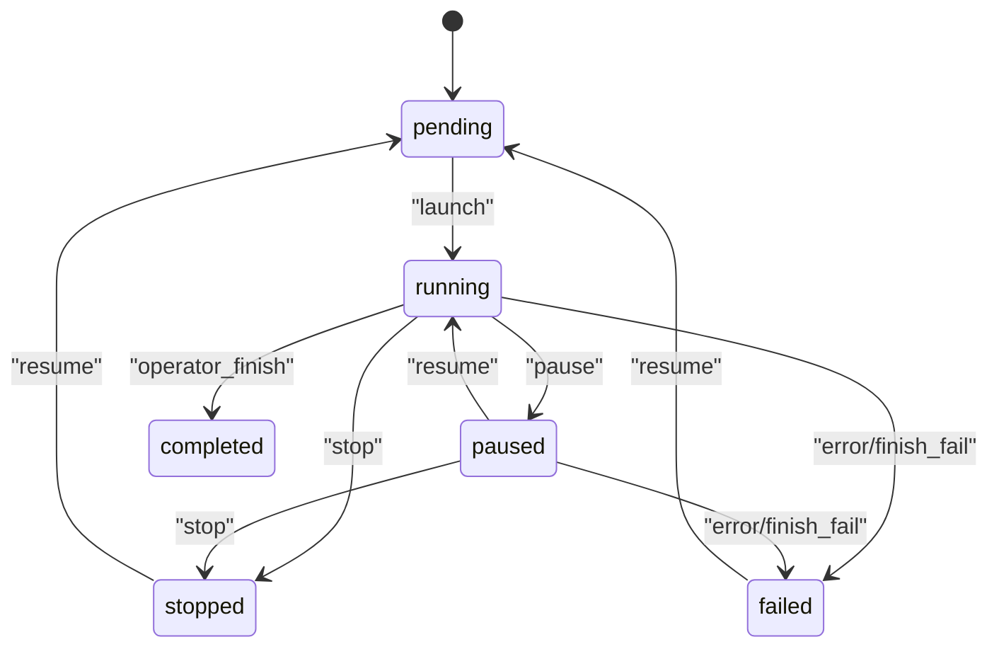

图表来源
- [runtime.go:153-189](file://internal/runtime/runtime.go#L153-L189)
- [task_handlers.go:1469-1551](file://internal/daemon/task_handlers.go#L1469-L1551)
- [task_handlers.go:1600-1714](file://internal/daemon/task_handlers.go#L1600-L1714)

章节来源
- [runtime.go:153-189](file://internal/runtime/runtime.go#L153-L189)
- [task_handlers.go:1469-1551](file://internal/daemon/task_handlers.go#L1469-L1551)
- [task_handlers.go:1600-1714](file://internal/daemon/task_handlers.go#L1600-L1714)

### 任务创建与启动流程
- 入口：handleCreateTask
  - 校验与默认值填充、预检（preflight）、激活校验
  - 构建 Launch Plan（含模型选择、推理强度、Skill Bundles、Layout）
  - 准备 Blackboard v2 Continuation（Precommit/BindGrant/UnbindGrant 钩子）
  - 可选打开持久化 Provider 会话（工厂模式），设置初始 Turn Selection
  - 后台 Launch，完成后根据结果清理会话并记录日志
- 关键点
  - Blackboard v2 必须启用；不支持的 Provider 直接拒绝
  - Precommit 阶段生成 Launch Header 与投影；BindGrant 注入一次性 Grant
  - 固定字段合并到 CapturedRuntimeConfig，避免敏感信息落盘

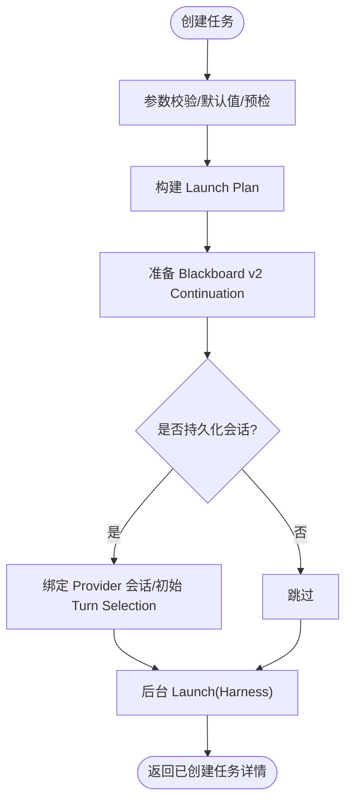

图表来源
- [task_handlers.go:73-167](file://internal/daemon/task_handlers.go#L73-L167)
- [task_handlers.go:196-285](file://internal/daemon/task_handlers.go#L196-L285)
- [task_handlers.go:311-397](file://internal/daemon/task_handlers.go#L311-L397)
- [continuity.go:764-880](file://internal/blackboardv2/continuity.go#L764-L880)

章节来源
- [task_handlers.go:73-167](file://internal/daemon/task_handlers.go#L73-L167)
- [task_handlers.go:196-285](file://internal/daemon/task_handlers.go#L196-L285)
- [task_handlers.go:311-397](file://internal/daemon/task_handlers.go#L311-L397)
- [continuity.go:764-880](file://internal/blackboardv2/continuity.go#L764-L880)

### 监控与进度跟踪
- 事件拉取：/events、/timeline、/transcript
- 运行时活动：attachRuntimeActivity 附加健康/空闲/忙碌状态
- 轮询脚本：smoke-runtime-tasks-live.py 基于 events 与 status 判定卡住/错误/超时

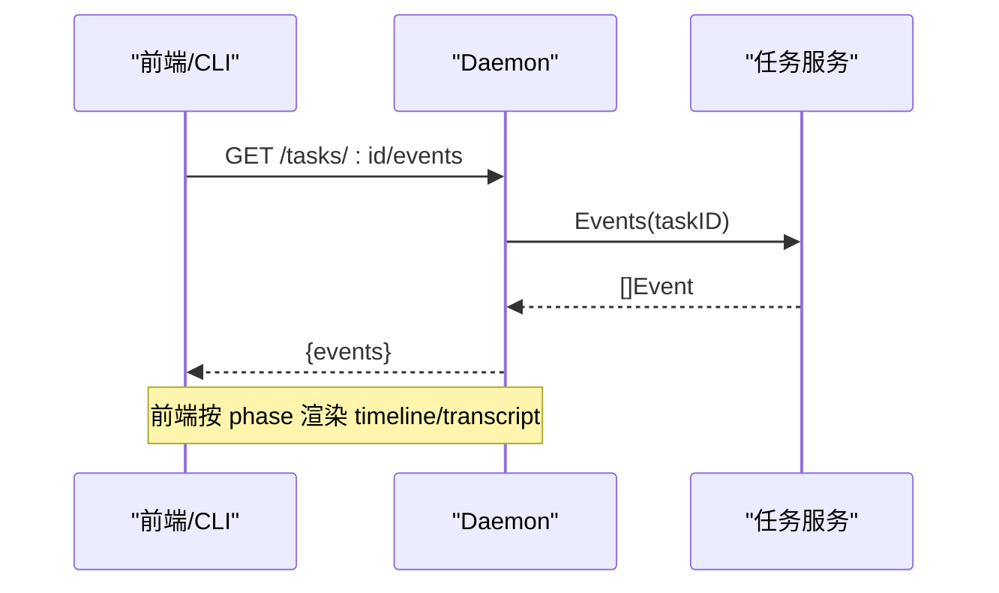

图表来源
- [task_handlers.go:1400-1467](file://internal/daemon/task_handlers.go#L1400-L1467)
- [smoke-runtime-tasks-live.py:176-211](file://scripts/smoke-runtime-tasks-live.py#L176-L211)

章节来源
- [task_handlers.go:1400-1467](file://internal/daemon/task_handlers.go#L1400-L1467)
- [smoke-runtime-tasks-live.py:176-211](file://scripts/smoke-runtime-tasks-live.py#L176-L211)

### 停止与完成（Finish）
- Stop
  - 请求关闭 Provider 会话与 Harness，等待退出；若超时则强制停止；最后 settleTaskStopped 确保状态一致
- Finish（operator_finish）
  - 要求 live+idle；先标记 Finish 意图，再关闭会话与等待 Harness 退出
  - 唯一拥有者将 Continuation 置为 completed，校验 ReconciliationCompleted，再置 Task 为 completed
  - 失败回退：settleTaskFailedAfterFinishAbort 保证不残留运行态

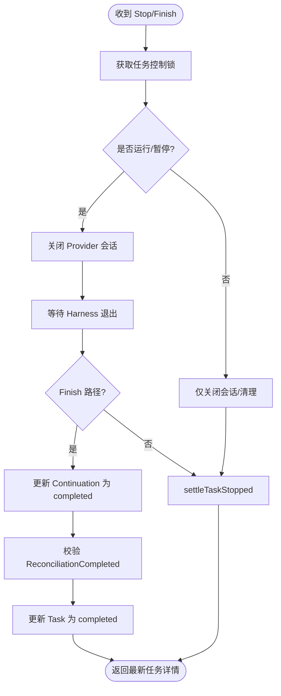

图表来源
- [task_handlers.go:1469-1551](file://internal/daemon/task_handlers.go#L1469-L1551)
- [task_handlers.go:1600-1714](file://internal/daemon/task_handlers.go#L1600-L1714)
- [task_handlers.go:1716-1751](file://internal/daemon/task_handlers.go#L1716-L1751)

章节来源
- [task_handlers.go:1469-1551](file://internal/daemon/task_handlers.go#L1469-L1551)
- [task_handlers.go:1600-1714](file://internal/daemon/task_handlers.go#L1600-L1714)
- [task_handlers.go:1716-1751](file://internal/daemon/task_handlers.go#L1716-L1751)

### 恢复（Resume）与 Continuation 重建
- 两种路径
  - 原生恢复：discoverNativeResumeSession + native resume args（保留会话上下文）
  - 新鲜恢复：从 Goal + 未消费 Harness Steering + 中断 Attempt 检查点 + 最新 Working Snapshot 重建
- 关键步骤
  - prepareFreshResumeContinuation 组装 resumeGoal 与 plan
  - prepareBlackboardV2ContinuationLaunch 创建 Continuation、写入 Launch Pin/Working Snapshot、颁发 Grant
  - launchTaskInBackground 启动新 Continuation，旧 Continuation 在完成时标记 completed

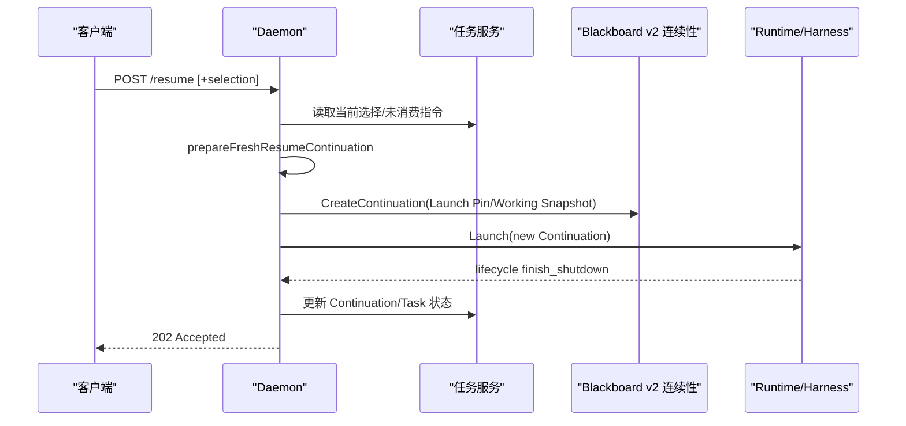

图表来源
- [task_handlers.go:1816-1912](file://internal/daemon/task_handlers.go#L1816-L1912)
- [task_handlers.go:1963-1987](file://internal/daemon/task_handlers.go#L1963-L1987)
- [continuity.go:764-880](file://internal/blackboardv2/continuity.go#L764-L880)

章节来源
- [task_handlers.go:1816-1912](file://internal/daemon/task_handlers.go#L1816-L1912)
- [task_handlers.go:1963-1987](file://internal/daemon/task_handlers.go#L1963-L1987)
- [continuity.go:764-880](file://internal/blackboardv2/continuity.go#L764-L880)

### Provider 会话控制与权限响应
- 会话注册表
  - 内存绑定 Task→Session，支持事件回调（只保留白名单字段）
- 能力与模式
  - persistent_session/send_turn/interrupt_then_replace/in_turn_steer/permission_response/resume_session
  - mode 决定操作语义与 outcome 序列（requested→acknowledged→settled/started）
- 权限响应
  - handleProviderPermissionResponse：幂等 key 校验、状态去重、写入 redacted 事件、调用 RespondPermission
  - 失败码映射：timeout/server_closing/session_closed/provider_rejected

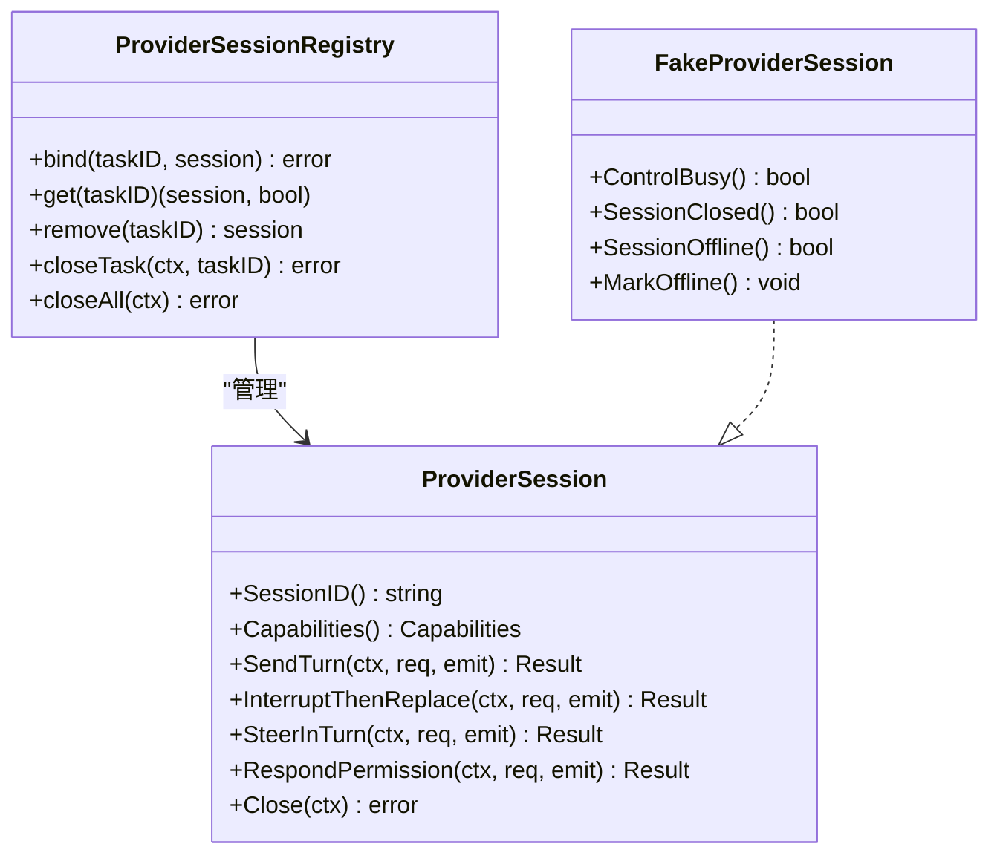

图表来源
- [provider_session_control.go:18-111](file://internal/daemon/provider_session_control.go#L18-L111)
- [provider_session.go:140-152](file://internal/runtime/provider_session.go#L140-L152)
- [provider_session.go:261-305](file://internal/runtime/provider_session.go#L261-L305)

章节来源
- [provider_session_control.go:18-111](file://internal/daemon/provider_session_control.go#L18-L111)
- [provider_session.go:140-152](file://internal/runtime/provider_session.go#L140-L152)
- [provider_session.go:261-305](file://internal/runtime/provider_session.go#L261-L305)

### Steer 指令队列与中断式转向
- 队列模式（queue）
  - 记录 steering_requested(mode=queue)，可选记录 Runtime Config Version（profile/model/effort 变更）
- 中断模式（active steer）
  - 记录 steering_requested，尝试 native resume；若成功，停止当前 Harness，新建 Continuation，记录 resuming_native 与 steering_applied
- 幂等与冲突
  - native steer 通过 request_id 与 delivery=native_steer 做幂等冲突检测
  - 并发控制：acquireTaskControl/acquireProviderTaskControl 互斥

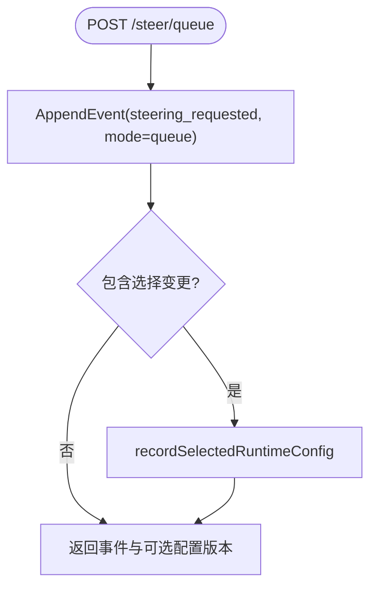

图表来源
- [task_handlers.go:2097-2174](file://internal/daemon/task_handlers.go#L2097-L2174)
- [task_handlers.go:2176-2324](file://internal/daemon/task_handlers.go#L2176-L2324)
- [task_handlers.go:2326-2399](file://internal/daemon/task_handlers.go#L2326-L2399)

章节来源
- [task_handlers.go:2097-2174](file://internal/daemon/task_handlers.go#L2097-L2174)
- [task_handlers.go:2176-2324](file://internal/daemon/task_handlers.go#L2176-L2324)
- [task_handlers.go:2326-2399](file://internal/daemon/task_handlers.go#L2326-L2399)

### Blackboard v2 连续性：Launch Pin、Working Snapshot 与同步
- Launch Pin：不可变快照（schema/revision/bytes/digest），用于一致性验证
- Working Snapshot：最近已确认的运行时快照，支持原子发布与回滚
- 同步与重放：ClaimTrustedSynchronization/CaptureTrustedSynchronization/SynchronizeContinuation
- 恢复：MaterializeWorkingSnapshot/MaterializeLaunchPin/ActiveSnapshots/RecoverActiveWorkingSnapshots

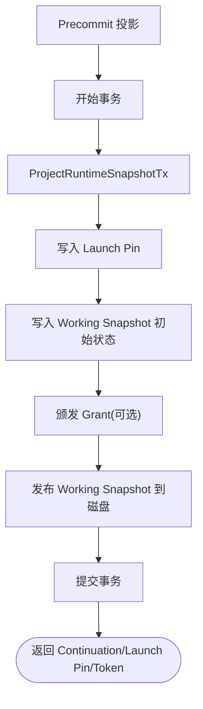

图表来源
- [continuity.go:764-880](file://internal/blackboardv2/continuity.go#L764-L880)
- [continuity.go:882-976](file://internal/blackboardv2/continuity.go#L882-L976)
- [continuity.go:941-1019](file://internal/blackboardv2/continuity.go#L941-L1019)

章节来源
- [continuity.go:764-880](file://internal/blackboardv2/continuity.go#L764-L880)
- [continuity.go:882-976](file://internal/blackboardv2/continuity.go#L882-L976)
- [continuity.go:941-1019](file://internal/blackboardv2/continuity.go#L941-L1019)

## 依赖关系分析
- Daemon 对 Task 服务的强依赖：事件追加、状态更新、未消费指令查询
- Daemon 对 Blackboard v2 连续性：Continuation 创建、Working Snapshot 同步、活跃快照恢复
- Daemon 对 Provider 会话：能力探测、操作模式选择、事件回调
- Runtime/Harness 对 Adapter：命令/沙箱封装，统一停止与完成语义

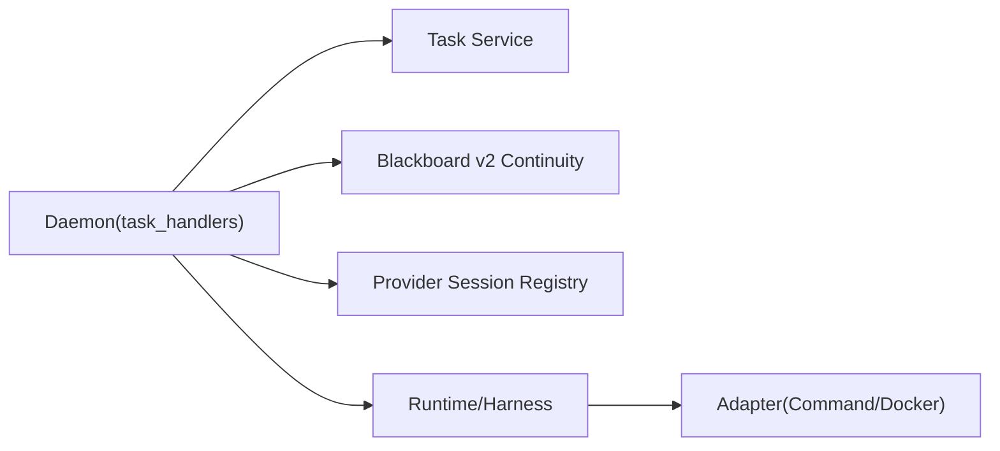

图表来源
- [task_handlers.go:1-800](file://internal/daemon/task_handlers.go#L1-L800)
- [continuity.go:764-880](file://internal/blackboardv2/continuity.go#L764-L880)
- [provider_session_control.go:18-111](file://internal/daemon/provider_session_control.go#L18-L111)
- [runtime.go:153-189](file://internal/runtime/runtime.go#L153-L189)

章节来源
- [task_handlers.go:1-800](file://internal/daemon/task_handlers.go#L1-L800)
- [continuity.go:764-880](file://internal/blackboardv2/continuity.go#L764-L880)
- [provider_session_control.go:18-111](file://internal/daemon/provider_session_control.go#L18-L111)
- [runtime.go:153-189](file://internal/runtime/runtime.go#L153-L189)

## 性能与可靠性
- 幂等与冲突
  - Provider 会话操作通过 request_id 与模式约束避免重复执行；冲突返回明确错误码
- 原子性与一致性
  - Continuation 创建采用事务+Launch Pin/Working Snapshot 双保险；失败回滚并恢复磁盘状态
- 健壮性
  - Finish 失败回退至 failed/stopped，避免悬挂运行态
  - 活跃快照恢复确保重启后可继续工作

[本节为通用指导，无需特定文件引用]

## 故障排查指南
- 常见错误码与原因
  - provider session control conflict：同一会话并发控制冲突
  - session closed：会话已关闭
  - invalid provider session request：缺少 request_id
  - provider session request id is already bound to different content：幂等键冲突
- 定位方法
  - 查看 lifecycle/steering/conversation 事件中的 phase/outcome/mode/request_id
  - 检查 UnconsumedHarnessSteering 是否仍有待消费指令
  - 核对 Continuation 的 ReconciliationCompleted 标记

章节来源
- [provider_session.go:40-75](file://internal/runtime/provider_session.go#L40-L75)
- [task.go:599-627](file://internal/task/task.go#L599-L627)
- [finish_task_resume_test.go:315-351](file://internal/daemon/finish_task_resume_test.go#L315-L351)

## 结论
本系统以事件驱动为核心，结合 Blackboard v2 连续性保障与 Provider 会话控制，实现了任务从创建到完成的全链路可控、可观测、可恢复。通过明确的幂等与冲突策略、严格的 Finish 所有权与 Reconciliation 校验，系统在复杂交互与异常场景下仍保持高可靠性。

[本节为总结，无需特定文件引用]

## 附录：API参考与使用示例

### 任务相关 API
- 创建任务
  - POST /api/projects/{id}/tasks
  - 输入：goal、runtime_profile_id、model_override、reasoning_effort、runner、run_controls、extras
  - 输出：已创建的任务详情
- 列出任务
  - GET /api/projects/{id}/tasks
- 获取任务详情
  - GET /api/projects/{id}/tasks/{task_id}
- 删除任务
  - DELETE /api/projects/{id}/tasks/{task_id}
- 事件与时间线
  - GET /api/projects/{id}/tasks/{task_id}/events
  - GET /api/projects/{id}/tasks/{task_id}/timeline
  - GET /api/projects/{id}/tasks/{task_id}/transcript
- 停止任务
  - POST /api/projects/{id}/tasks/{task_id}/stop
- 完成任务（operator_finish）
  - POST /api/projects/{id}/tasks/{task_id}/finish
- 恢复任务
  - POST /api/projects/{id}/tasks/{task_id}/resume
  - 可选 body：runtime_profile_id、model_provider_id、model、model_override、reasoning_effort
- 指令（Steer）
  - 队列模式：POST /api/projects/{id}/tasks/{task_id}/steer/queue
    - 输入：directive、可选 selection
    - 输出：event、可选 runtime_config_version
  - 中断模式：POST /api/projects/{id}/tasks/{task_id}/steer
    - 输入：directive、可选 selection
    - 输出：event、可选 runtime_config_version、task（新 Continuation 详情）
- Provider 权限响应
  - POST /api/projects/{id}/tasks/{task_id}/permissions/{permission_id}
    - 输入：request_id、decision(allow/deny)、可选 Idempotency-Key
    - 输出：request_id、permission_request_id、session_id、decision、outcome

章节来源
- [task_handlers.go:73-167](file://internal/daemon/task_handlers.go#L73-L167)
- [task_handlers.go:1120-1168](file://internal/daemon/task_handlers.go#L1120-L1168)
- [task_handlers.go:1400-1467](file://internal/daemon/task_handlers.go#L1400-L1467)
- [task_handlers.go:1469-1551](file://internal/daemon/task_handlers.go#L1469-L1551)
- [task_handlers.go:1600-1714](file://internal/daemon/task_handlers.go#L1600-L1714)
- [task_handlers.go:1816-1912](file://internal/daemon/task_handlers.go#L1816-L1912)
- [task_handlers.go:2097-2174](file://internal/daemon/task_handlers.go#L2097-L2174)
- [task_handlers.go:2176-2324](file://internal/daemon/task_handlers.go#L2176-L2324)
- [task_handlers.go:2517-2654](file://internal/daemon/task_handlers.go#L2517-L2654)

### 实际使用场景示例
- 场景一：首次创建并启动任务
  - 调用创建接口，后端构建 Launch Plan、准备 Continuation、后台 Launch，返回已创建任务详情
- 场景二：向运行中任务发送中断式指令
  - 调用 steer（非 queue），后端记录 steering_requested，尝试 native resume，停止当前 Harness，创建新 Continuation，返回 202 与新任务详情
- 场景三：排队后续指令
  - 调用 steer/queue，后端记录 steering_requested(mode=queue)，如包含选择变更则记录新的 runtime_config_version
- 场景四：恢复已完成/失败的任务
  - 调用 resume，后端优先尝试原生恢复，否则基于 Goal+未消费指令+中断检查点+Working Snapshot 重建 Continuation 并启动
- 场景五：处理 Provider 权限请求
  - 监听 provider_permission_requested 事件，调用权限响应接口，传入 decision 与幂等键，后端写入 redacted 事件并转发给 Provider 会话

章节来源
- [blackboard_v2_continuity_test.go:538-569](file://internal/daemon/blackboard_v2_continuity_test.go#L538-L569)
- [blackboard_v2_continuity_test.go:203-288](file://internal/daemon/blackboard_v2_continuity_test.go#L203-L288)
- [finish_task_resume_test.go:1134-1166](file://internal/daemon/finish_task_resume_test.go#L1134-L1166)
- [runtime_turn_selection_test.go:141-179](file://internal/daemon/runtime_turn_selection_test.go#L141-L179)