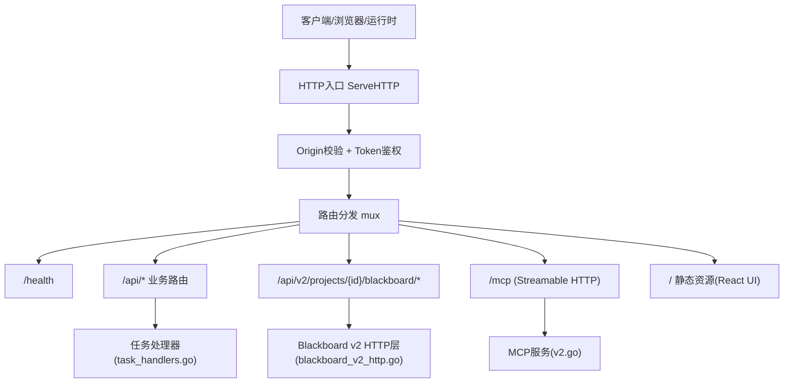
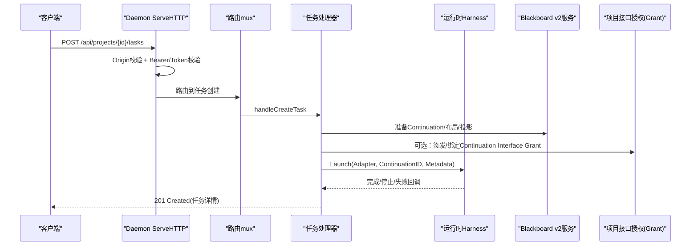
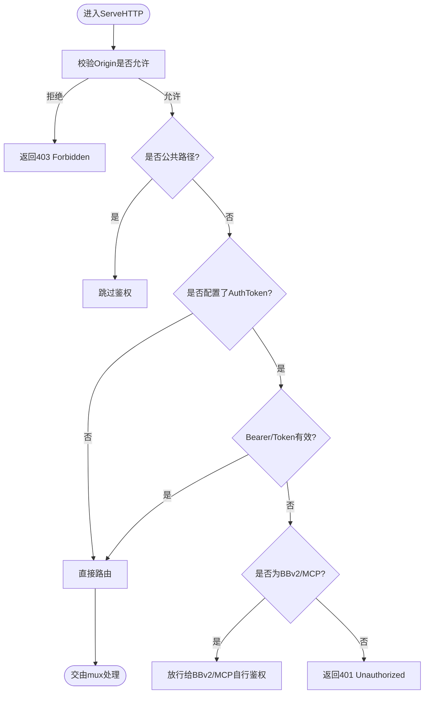
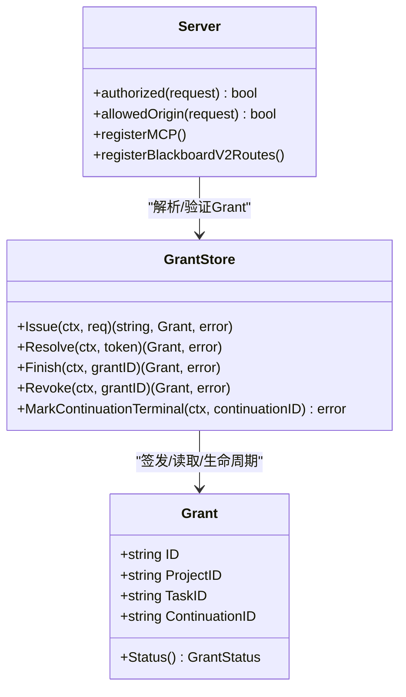
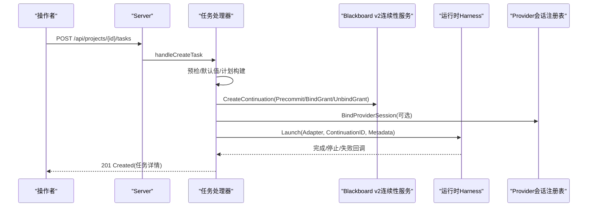
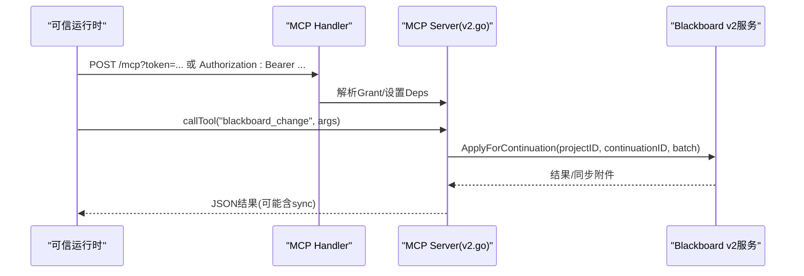
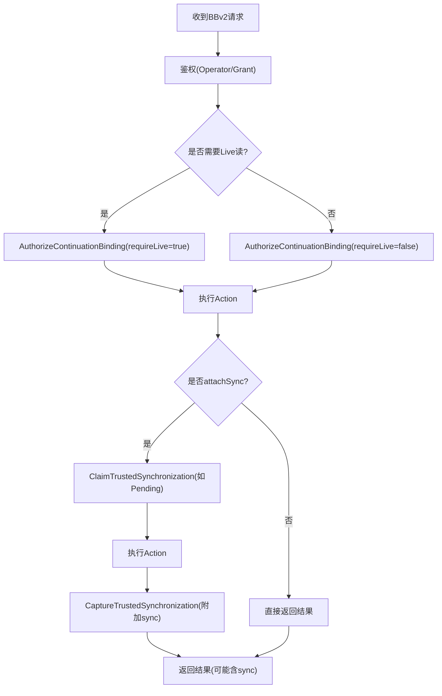
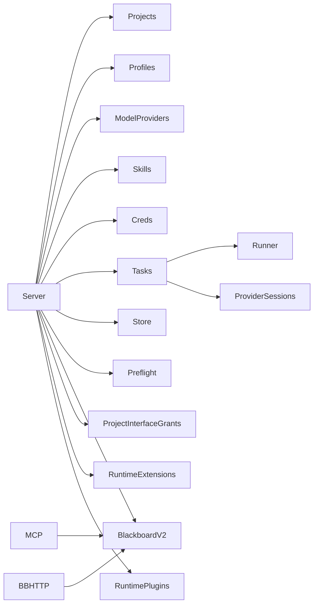

# 控制平面 - Daemon服务

<cite>
**本文引用的文件列表**
- [server.go](file://internal/daemon/server.go)
- [task_handlers.go](file://internal/daemon/task_handlers.go)
- [mcp_handlers.go](file://internal/daemon/mcp_handlers.go)
- [blackboard_v2_http.go](file://internal/daemon/blackboard_v2_http.go)
- [grant.go](file://internal/projectinterface/grant.go)
- [v2.go](file://internal/mcpserver/v2.go)
- [auth_test.go](file://internal/daemon/auth_test.go)
</cite>

## 目录
1. [简介](#简介)
2. [项目结构](#项目结构)
3. [核心组件](#核心组件)
4. [架构总览](#架构总览)
5. [详细组件分析](#详细组件分析)
6. [依赖关系分析](#依赖关系分析)
7. [性能与可扩展性](#性能与可扩展性)
8. [故障排查指南](#故障排查指南)
9. [结论](#结论)
10. [附录：API端点规范与安全最佳实践](#附录api端点规范与安全最佳实践)

## 简介
本文件聚焦于Daemon服务的控制平面，系统性梳理其HTTP API设计、路由组织、认证授权机制与中间件处理；深入解析任务生命周期管理、项目接口权限控制（Continuation Interface Grant）以及MCP服务器集成。文档同时给出API端点规范、请求响应格式、错误处理策略与安全考虑，并提供实际调用示例与最佳实践指导，帮助读者快速理解并安全使用Daemon作为渗透测试代理的控制面。

## 项目结构
Daemon服务位于internal/daemon包，提供统一的HTTP入口、路由注册、鉴权中间件、任务编排、Blackboard v2 HTTP接口、MCP Server挂载及SPA静态资源服务。关键文件职责如下：
- server.go：Server构造、全局配置、ServeHTTP中间件、路由注册、健康检查、通用JSON/错误封装、SPA静态资源服务。
- task_handlers.go：任务创建、查询、停止、完成、恢复、事件/时间线/转录等处理器，以及启动计划构建、沙箱/宿主适配器装配、Provider会话绑定与原生转向能力。
- blackboard_v2_http.go：Blackboard v2的HTTP传输层，包含鉴权、幂等键校验、同步附件注入、条件响应（ETag）、语义错误映射。
- mcp_handlers.go：MCP Streamable HTTP端点注册，基于Project Interface Grant进行工具级鉴权。
- grant.go：Continuation Interface Grant的签发、解析、生命周期管理与状态机。
- v2.go：MCP服务端实现，将Blackboard v2的六个受信任工具暴露为MCP工具，复用同一套鉴权与同步逻辑。

图表来源
- [server.go:587-643](file://internal/daemon/server.go#L587-L643)
- [mcp_handlers.go:14-43](file://internal/daemon/mcp_handlers.go#L14-L43)
- [blackboard_v2_http.go:29-46](file://internal/daemon/blackboard_v2_http.go#L29-L46)

章节来源
- [server.go:38-118](file://internal/daemon/server.go#L38-L118)
- [server.go:587-643](file://internal/daemon/server.go#L587-L643)

## 核心组件
- Server与配置：集中管理数据库、项目、运行期插件/扩展、模型提供者、技能库、凭证、任务、运行时Harness、Blackboard v2服务、项目接口授权存储等。
- 鉴权与中间件：统一在ServeHTTP中执行Origin校验、公共路径豁免、Bearer/Query token校验、Project Interface Grant解析。
- 任务生命周期：从创建到启动、运行、停止、完成、恢复的全流程，包括预检、计划构建、持久化上下文、Provider会话绑定、沙箱/宿主适配。
- Blackboard v2 HTTP：面向操作者与可信运行时的读写、证据保留、尝试检查点、Finish、报告导出等，具备幂等键、同步附件、条件响应与语义错误映射。
- MCP集成：通过Streamable HTTP暴露六个Blackboard v2受信任工具，严格基于Grant进行项目/任务/Continuation边界控制。

章节来源
- [server.go:120-248](file://internal/daemon/server.go#L120-L248)
- [server.go:383-411](file://internal/daemon/server.go#L383-L411)
- [task_handlers.go:73-167](file://internal/daemon/task_handlers.go#L73-L167)
- [blackboard_v2_http.go:52-95](file://internal/daemon/blackboard_v2_http.go#L52-L95)
- [mcp_handlers.go:14-43](file://internal/daemon/mcp_handlers.go#L14-L43)
- [v2.go:34-44](file://internal/mcpserver/v2.go#L34-L44)

## 架构总览
Daemon作为控制平面，承担以下职责：
- 对外暴露REST API与MCP端点，统一鉴权与CORS/Origin防护。
- 协调任务生命周期，驱动Runtime/Sandbox执行具体Agent（Codex/Claude/Pi等）。
- 维护Blackboard v2语义记忆平面，提供变更、快照、历史、证据、检查点、Finish与报告导出。
- 通过Project Interface Grant对可信运行时进行细粒度授权，限制其对特定Project/Task/Continuation的访问范围。

图表来源
- [server.go:383-411](file://internal/daemon/server.go#L383-L411)
- [task_handlers.go:73-167](file://internal/daemon/task_handlers.go#L73-L167)
- [task_handlers.go:196-285](file://internal/daemon/task_handlers.go#L196-L285)
- [blackboard_v2_http.go:29-46](file://internal/daemon/blackboard_v2_http.go#L29-L46)
- [grant.go:196-252](file://internal/projectinterface/grant.go#L196-L252)

## 详细组件分析

### HTTP入口与中间件处理
- Origin校验：拒绝非回环且带Origin的请求，允许无Origin或来自host.docker.internal的请求，防止DNS重绑定攻击。
- 公共路径豁免：/health、OPTIONS预检、SPA静态资源GET可免令牌访问。
- 鉴权：支持Authorization: Bearer <token>与?token=<token>两种形式；对于Blackboard v2与MCP，还支持Project Interface Grant（Continuation Interface capability）。
- 记录器：统一记录请求耗时与状态码。

图表来源
- [server.go:383-411](file://internal/daemon/server.go#L383-L411)
- [server.go:431-461](file://internal/daemon/server.go#L431-L461)
- [server.go:467-501](file://internal/daemon/server.go#L467-L501)
- [server.go:518-534](file://internal/daemon/server.go#L518-L534)

章节来源
- [server.go:383-411](file://internal/daemon/server.go#L383-L411)
- [server.go:431-461](file://internal/daemon/server.go#L431-L461)
- [server.go:467-501](file://internal/daemon/server.go#L467-L501)
- [server.go:518-534](file://internal/daemon/server.go#L518-L534)
- [auth_test.go:60-110](file://internal/daemon/auth_test.go#L60-L110)

### 路由组织与API分组
- 健康检查：GET /health
- 项目管理：/api/projects
- 运行期配置：/api/runtime-profiles、/api/model-providers、/api/runtime-plugins、/api/runtime-extensions
- 技能与凭证：/api/skills、/api/credential-bindings
- 项目预检与仪表板：/api/projects/{id}/preflight、/api/projects/{id}/dashboard
- 任务管理：/api/projects/{id}/tasks及其子资源（事件、时间线、转录、停止、完成、恢复、转向、权限响应）
- Blackboard v2：/api/v2/projects/{id}/blackboard/*
- MCP：/mcp
- SPA：/ 静态资源与回退

章节来源
- [server.go:587-643](file://internal/daemon/server.go#L587-L643)
- [server.go:1226-1258](file://internal/daemon/server.go#L1226-L1258)

### 认证与授权机制
- 操作者令牌：Bearer或query参数，用于所有非公开API。
- Project Interface Grant：仅对Blackboard v2与MCP生效，由Daemon在Continuation创建时签发，绑定Project/Task/Continuation，支持open/finished/revoked/terminal状态机。
- 安全细节：常量时间比较、禁止在BBv2查询串传Bearer、只读/写权限按Grant状态控制。

图表来源
- [grant.go:169-190](file://internal/projectinterface/grant.go#L169-L190)
- [grant.go:196-252](file://internal/projectinterface/grant.go#L196-L252)
- [grant.go:284-302](file://internal/projectinterface/grant.go#L284-L302)
- [grant.go:321-351](file://internal/projectinterface/grant.go#L321-L351)
- [server.go:431-461](file://internal/daemon/server.go#L431-L461)
- [mcp_handlers.go:14-43](file://internal/daemon/mcp_handlers.go#L14-L43)
- [blackboard_v2_http.go:52-95](file://internal/daemon/blackboard_v2_http.go#L52-L95)

章节来源
- [grant.go:88-149](file://internal/projectinterface/grant.go#L88-L149)
- [grant.go:196-252](file://internal/projectinterface/grant.go#L196-L252)
- [grant.go:284-302](file://internal/projectinterface/grant.go#L284-L302)
- [grant.go:321-351](file://internal/projectinterface/grant.go#L321-L351)
- [server.go:431-461](file://internal/daemon/server.go#L431-L461)
- [blackboard_v2_http.go:52-95](file://internal/daemon/blackboard_v2_http.go#L52-L95)
- [mcp_handlers.go:14-43](file://internal/daemon/mcp_handlers.go#L14-L43)

### 任务生命周期管理
- 创建任务：预检（环境/凭据/自定义参数冲突）、默认值填充、构建Launch Plan、准备Blackboard v2 Continuation、可选持久化Provider会话、后台启动。
- 运行期控制：停止（优雅关闭Provider会话+Harvest等待）、完成（要求当前活动空闲）、恢复（原生会话发现与Resume）、转向（In-turn/Interrupt-then-replace）。
- 事件与视图：事件流、时间线聚合、转录生成。

图表来源
- [task_handlers.go:73-167](file://internal/daemon/task_handlers.go#L73-L167)
- [task_handlers.go:196-285](file://internal/daemon/task_handlers.go#L196-L285)
- [task_handlers.go:311-397](file://internal/daemon/task_handlers.go#L311-L397)
- [provider_session_control.go:95-111](file://internal/daemon/provider_session_control.go#L95-L111)

章节来源
- [task_handlers.go:73-167](file://internal/daemon/task_handlers.go#L73-L167)
- [task_handlers.go:196-285](file://internal/daemon/task_handlers.go#L196-L285)
- [task_handlers.go:311-397](file://internal/daemon/task_handlers.go#L311-L397)
- [task_handlers.go:1469-1551](file://internal/daemon/task_handlers.go#L1469-L1551)
- [task_handlers.go:1575-1599](file://internal/daemon/task_handlers.go#L1575-L1599)
- [provider_session_control.go:95-111](file://internal/daemon/provider_session_control.go#L95-L111)

### 项目接口权限控制（Continuation Interface Grant）
- 签发：在Continuation创建阶段原子性地签发Grant，绑定Project/Task/Continuation/Runtime配置版本，仅返回一次明文token，后端仅存哈希。
- 解析：通过Bearer头解析，常量时间比对哈希，校验Grant状态（open/finished/revoked/terminal），确保Project/Task/Continuation一致性。
- 生命周期：Finish/Revoked/Terminal分别控制写入与读取能力，终端Continuation自动标记为terminal。

章节来源
- [grant.go:196-252](file://internal/projectinterface/grant.go#L196-L252)
- [grant.go:284-302](file://internal/projectinterface/grant.go#L284-L302)
- [grant.go:321-351](file://internal/projectinterface/grant.go#L321-L351)
- [grant.go:336-351](file://internal/projectinterface/grant.go#L336-L351)

### MCP服务器集成
- 端点：/mcp，采用Streamable HTTP，禁用本地Host保护以允许host.docker.internal访问。
- 工具：六个Blackboard v2受信任工具（变更、读取、历史、保留证据、尝试检查点、Finish），输入Schema由冻结契约生成，严格校验。
- 鉴权：优先使用Operator Token；否则解析Continuation Interface Grant，绑定Project/Task/Continuation上下文。

图表来源
- [mcp_handlers.go:14-43](file://internal/daemon/mcp_handlers.go#L14-L43)
- [v2.go:34-44](file://internal/mcpserver/v2.go#L34-L44)
- [v2.go:46-156](file://internal/mcpserver/v2.go#L46-L156)

章节来源
- [mcp_handlers.go:14-43](file://internal/daemon/mcp_handlers.go#L14-L43)
- [v2.go:34-44](file://internal/mcpserver/v2.go#L34-L44)
- [v2.go:46-156](file://internal/mcpserver/v2.go#L46-L156)

### Blackboard v2 HTTP端点与错误处理
- 端点：changes、snapshot、health、records/{key}、records/{key}/history、evidence:retain、attempts/{action}:checkpoint、continuation:finish、reports/pentest、reports/ctf-solution。
- 鉴权：区分操作者与可信Continuation；禁止在查询串传Bearer；必须携带Idempotency-Key（写操作）。
- 同步附件：对需要幂等重放的路径，根据Idempotency-Key计算指纹，捕获Pending同步并在响应中附带sync字段。
- 条件响应：Snapshot/Health/Read等支持ETag与If-None-Match，返回304或带sync的完整响应。
- 错误映射：invalid_schema、authority_denied、not_found、closed_continuation、version_conflict、storage_busy等，对应不同HTTP状态码与Retry-After策略。

图表来源
- [blackboard_v2_http.go:52-95](file://internal/daemon/blackboard_v2_http.go#L52-L95)
- [blackboard_v2_http.go:368-438](file://internal/daemon/blackboard_v2_http.go#L368-L438)
- [blackboard_v2_http.go:440-471](file://internal/daemon/blackboard_v2_http.go#L440-L471)
- [blackboard_v2_http.go:515-562](file://internal/daemon/blackboard_v2_http.go#L515-L562)
- [blackboard_v2_http.go:612-642](file://internal/daemon/blackboard_v2_http.go#L612-L642)

章节来源
- [blackboard_v2_http.go:29-46](file://internal/daemon/blackboard_v2_http.go#L29-L46)
- [blackboard_v2_http.go:52-95](file://internal/daemon/blackboard_v2_http.go#L52-L95)
- [blackboard_v2_http.go:368-438](file://internal/daemon/blackboard_v2_http.go#L368-L438)
- [blackboard_v2_http.go:440-471](file://internal/daemon/blackboard_v2_http.go#L440-L471)
- [blackboard_v2_http.go:515-562](file://internal/daemon/blackboard_v2_http.go#L515-L562)
- [blackboard_v2_http.go:612-642](file://internal/daemon/blackboard_v2_http.go#L612-L642)

## 依赖关系分析
- Server依赖多个Service：project、runtimeprofile、modelprovider、skill、credential、task、store、preflight、blackboardv2、projectinterface、runtimeextension、runtimeplugin。
- 任务处理器依赖Runner/Adapter抽象，支持沙箱与宿主模式，并通过ProviderSessionFactory与ProviderSessionRegistry管理持久化会话。
- Blackboard v2 HTTP与MCP共享同一套鉴权与同步逻辑，但传输层不同（HTTP vs MCP）。

图表来源
- [server.go:83-118](file://internal/daemon/server.go#L83-L118)
- [task_handlers.go:196-285](file://internal/daemon/task_handlers.go#L196-L285)
- [mcp_handlers.go:14-43](file://internal/daemon/mcp_handlers.go#L14-L43)
- [blackboard_v2_http.go:29-46](file://internal/daemon/blackboard_v2_http.go#L29-L46)

章节来源
- [server.go:83-118](file://internal/daemon/server.go#L83-L118)
- [task_handlers.go:196-285](file://internal/daemon/task_handlers.go#L196-L285)
- [mcp_handlers.go:14-43](file://internal/daemon/mcp_handlers.go#L14-L43)
- [blackboard_v2_http.go:29-46](file://internal/daemon/blackboard_v2_http.go#L29-L46)

## 性能与可扩展性
- 并发与锁：任务控制操作使用互斥锁避免竞态；Provider会话关闭重试短轮询避免冲突。
- 资源清理：Daemon重启后自动清理僵尸容器/进程组，并记录中断事件。
- 缓存与条件响应：BBv2 Snapshot/Health支持ETag减少带宽与CPU消耗。
- 可扩展点：Runtime Plugin与Extension目录加载、Skill导入器、Model刷新客户端、Provider Session工厂均可插拔。

[本节为通用性能建议，不直接分析具体文件]

## 故障排查指南
- 401 Unauthorized：确认Bearer/Token是否正确；BBv2不允许在查询串传Bearer；MCP需正确传递token。
- 403 Forbidden：Origin校验失败（跨站/DNS重绑定）；检查请求来源与host.docker.internal白名单。
- 409 Conflict：任务控制操作冲突或Provider会话未关闭；稍后重试或检查任务状态。
- 503 Service Unavailable：BBv2 storage_busy或retryable错误；遵循Retry-After重试。
- 422 Unprocessable Entity：BBv2语义校验失败（例如schema不匹配、attempt限制等）。
- 日志与事件：查看任务事件与时间线，定位provider session setup失败、host_process_group_cleaned、container_cleaned等阶段。

章节来源
- [blackboard_v2_http.go:515-562](file://internal/daemon/blackboard_v2_http.go#L515-L562)
- [blackboard_v2_http.go:612-642](file://internal/daemon/blackboard_v2_http.go#L612-L642)
- [task_handlers.go:287-309](file://internal/daemon/task_handlers.go#L287-L309)
- [server.go:255-304](file://internal/daemon/server.go#L255-L304)

## 结论
Daemon服务作为控制平面，提供了健壮的HTTP API与MCP集成，结合严格的Origin校验、多形态鉴权与Project Interface Grant，确保了操作者与可信运行时的安全边界。任务生命周期管理覆盖从创建到完成的完整流程，并支持沙箱隔离与宿主运行。Blackboard v2 HTTP层实现了幂等、同步附件与条件响应，提升了可靠性与效率。建议在部署时启用AuthToken、最小化公开路径、合理配置Grant生命周期，并结合事件与时间线进行排障与审计。

[本节为总结性内容，不直接分析具体文件]

## 附录：API端点规范与安全最佳实践

### 常用API端点（节选）
- GET /health：健康检查，无需鉴权。
- GET /api/projects：列出项目。
- POST /api/projects：创建项目。
- GET /api/projects/{id}：获取项目。
- PATCH /api/projects/{id}：更新项目。
- POST /api/projects/{id}/tasks：创建任务（需鉴权）。
- GET /api/projects/{id}/tasks：列出任务。
- GET /api/projects/{id}/tasks/{task_id}：获取任务详情。
- DELETE /api/projects/{id}/tasks/{task_id}：删除任务。
- GET /api/projects/{id}/tasks/{task_id}/events：获取事件。
- GET /api/projects/{id}/tasks/{task_id}/timeline：获取时间线。
- GET /api/projects/{id}/tasks/{task_id}/transcript：获取转录。
- POST /api/projects/{id}/tasks/{task_id}/stop：停止任务。
- POST /api/projects/{id}/tasks/{task_id}/finish：完成任务。
- POST /api/projects/{id}/tasks/{task_id}/resume：恢复任务。
- POST /api/projects/{id}/tasks/{task_id}/steer/queue：排队转向。
- POST /api/projects/{id}/tasks/{task_id}/steer：立即转向。
- POST /api/projects/{id}/tasks/{task_id}/permissions/{permission_id}/respond：响应Provider权限请求。
- GET /api/v2/projects/{id}/blackboard/snapshot：获取语义快照（支持ETag）。
- GET /api/v2/projects/{id}/blackboard/health：语义健康检查（支持ETag）。
- GET /api/v2/projects/{id}/blackboard/records/{key}：读取当前值。
- GET /api/v2/projects/{id}/blackboard/records/{key}/history：读取历史。
- POST /api/v2/projects/{id}/blackboard/changes：提交变更（需Idempotency-Key）。
- POST /api/v2/projects/{id}/blackboard/evidence:retain：保留证据（需Idempotency-Key）。
- POST /api/v2/projects/{id}/blackboard/attempts/{action}:checkpoint：尝试检查点（需Idempotency-Key）。
- POST /api/v2/projects/{id}/continuation:finish：结束Continuation（需Idempotency-Key）。
- GET /api/v2/projects/{id}/reports/pentest：导出渗透报告（markdown/json）。
- GET /api/v2/projects/{id}/reports/ctf-solution：导出CTF解决方案（markdown/json）。
- POST /mcp：MCP工具调用（支持Bearer或?token）。

章节来源
- [server.go:587-643](file://internal/daemon/server.go#L587-L643)
- [blackboard_v2_http.go:29-46](file://internal/daemon/blackboard_v2_http.go#L29-L46)
- [mcp_handlers.go:14-43](file://internal/daemon/mcp_handlers.go#L14-L43)

### 请求与响应格式要点
- 所有API返回JSON，错误统一包含error字段；BBv2错误包含结构化Error对象与可选sync附件。
- BBv2写操作必须携带Idempotency-Key；读操作可选择携带If-None-Match以利用ETag。
- MCP工具调用返回JSON文本，错误以{error,sync}信封返回。

章节来源
- [blackboard_v2_http.go:515-562](file://internal/daemon/blackboard_v2_http.go#L515-L562)
- [v2.go:260-303](file://internal/mcpserver/v2.go#L260-L303)

### 安全最佳实践
- 生产环境必须设置AuthToken，禁止在非回环地址上无令牌暴露。
- 谨慎开放公共路径，仅允许必要的健康检查与静态资源GET。
- 使用Project Interface Grant限定可信运行时的访问范围，及时Finish或Revocation。
- 对BBv2写操作始终使用幂等键，避免重复提交导致的状态不一致。
- 监控任务事件与时间线，及时发现异常与资源泄漏。

章节来源
- [server.go:178-185](file://internal/daemon/server.go#L178-L185)
- [server.go:467-501](file://internal/daemon/server.go#L467-L501)
- [grant.go:196-252](file://internal/projectinterface/grant.go#L196-L252)
- [blackboard_v2_http.go:440-471](file://internal/daemon/blackboard_v2_http.go#L440-L471)