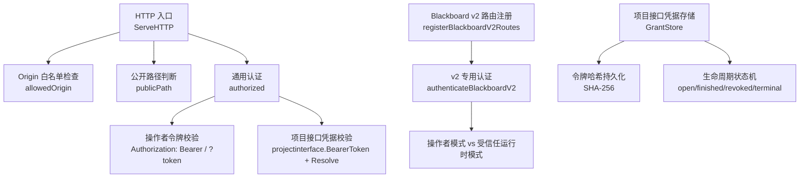
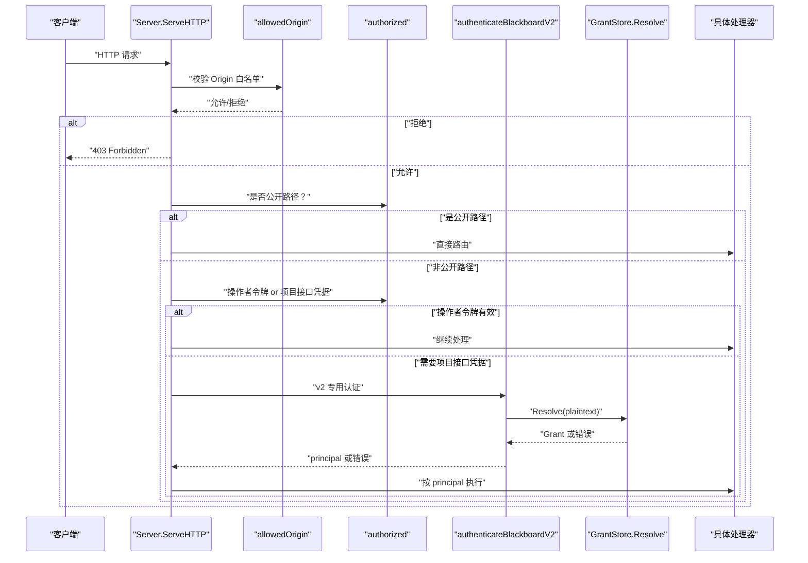
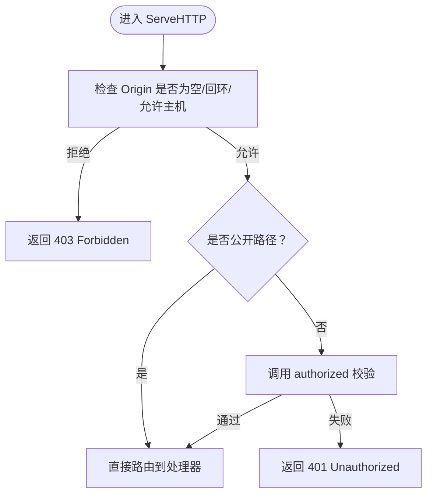
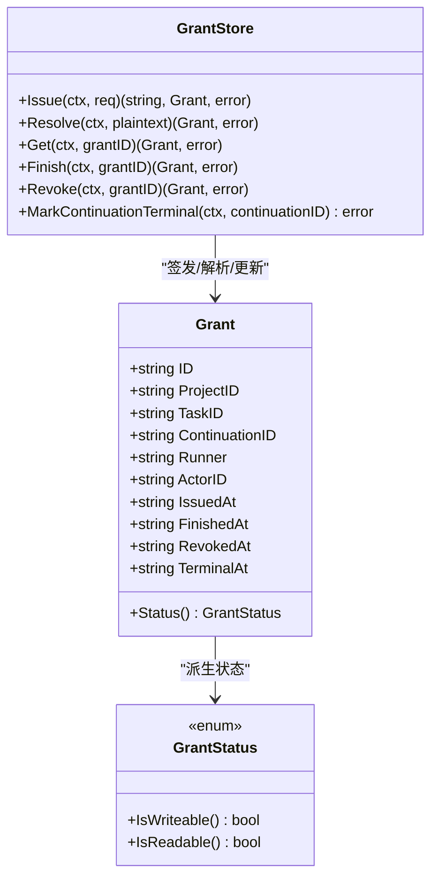
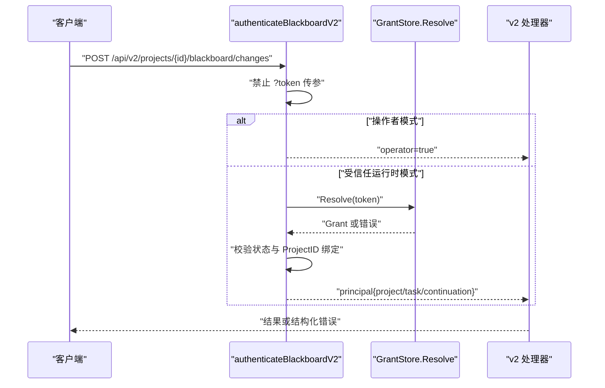
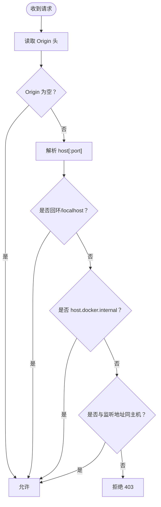
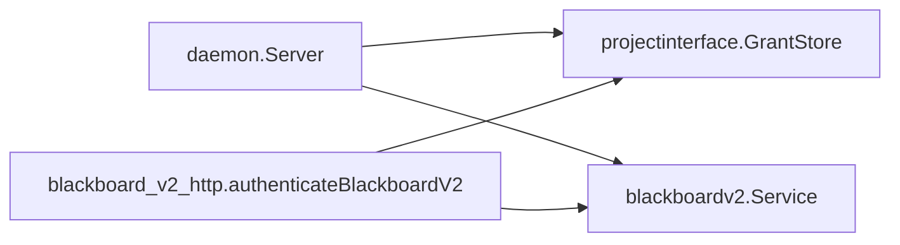

# 认证与授权机制

<cite>
**本文引用的文件**   
- [server.go](file://internal/daemon/server.go)
- [auth_test.go](file://internal/daemon/auth_test.go)
- [origin_guard_test.go](file://internal/daemon/origin_guard_test.go)
- [blackboard_v2_http.go](file://internal/daemon/blackboard_v2_http.go)
- [bearer.go](file://internal/projectinterface/bearer.go)
- [grant.go](file://internal/projectinterface/grant.go)
</cite>

## 目录
1. [简介](#简介)
2. [项目结构](#项目结构)
3. [核心组件](#核心组件)
4. [架构总览](#架构总览)
5. [详细组件分析](#详细组件分析)
6. [依赖关系分析](#依赖关系分析)
7. [性能与安全特性](#性能与安全特性)
8. [故障排除指南](#故障排除指南)
9. [结论](#结论)
10. [附录：配置与最佳实践](#附录配置与最佳实践)

## 简介
本文件系统性阐述 Daemon 服务的安全边界与多层认证授权体系，覆盖以下关键主题：
- 操作者令牌（Operator Token）认证
- 项目接口凭据（Continuation Interface Grant）授权
- Origin 头防护与 DNS 重绑定攻击防护
- Bearer Token 验证流程、权限粒度控制、安全边界设计
- 跨域访问控制策略
- 认证中间件实现、令牌生命周期管理
- 实际认证配置示例与故障排除建议

Daemon 在请求进入路由之前执行统一入口校验，依次进行 Origin 白名单检查与认证鉴权；对 Blackboard v2 接口进一步实施基于“操作者 vs 受信任运行时”的细粒度权限模型。

## 项目结构
与认证授权相关的核心代码位于 Daemon HTTP 层与项目接口凭据子系统：
- Daemon 入口 ServeHTTP 负责全局前置校验（Origin、公开路径、Bearer/Query token、项目接口凭据）
- Blackboard v2 专用认证器 authenticateBlackboardV2 区分操作者与受信任 Continuation 上下文
- 项目接口凭据子系统提供令牌的签发、解析、状态机与持久化

图表来源
- [server.go:383-411](file://internal/daemon/server.go#L383-L411)
- [server.go:431-461](file://internal/daemon/server.go#L431-L461)
- [server.go:518-534](file://internal/daemon/server.go#L518-L534)
- [blackboard_v2_http.go:29-46](file://internal/daemon/blackboard_v2_http.go#L29-L46)
- [blackboard_v2_http.go:52-95](file://internal/daemon/blackboard_v2_http.go#L52-L95)
- [grant.go:169-190](file://internal/projectinterface/grant.go#L169-L190)
- [grant.go:284-302](file://internal/projectinterface/grant.go#L284-L302)

章节来源
- [server.go:383-411](file://internal/daemon/server.go#L383-L411)
- [server.go:431-461](file://internal/daemon/server.go#L431-L461)
- [server.go:518-534](file://internal/daemon/server.go#L518-L534)
- [blackboard_v2_http.go:29-46](file://internal/daemon/blackboard_v2_http.go#L29-L46)
- [blackboard_v2_http.go:52-95](file://internal/daemon/blackboard_v2_http.go#L52-L95)
- [grant.go:169-190](file://internal/projectinterface/grant.go#L169-L190)
- [grant.go:284-302](file://internal/projectinterface/grant.go#L284-L302)

## 核心组件
- 操作者令牌（Operator Token）
  - 通过 Authorization: Bearer <token> 或查询参数 ?token=<token> 传入
  - 非回环监听时强制要求设置，防止未认证的控制面暴露
- 项目接口凭据（Continuation Interface Grant）
  - 由 Daemon 在服务端签发，仅对受信任的 Runtime/MCP 传输开放
  - 以 Bearer Token 形式携带，服务端仅保存其 SHA-256 哈希
  - 支持 open/finished/revoked/terminal 生命周期，读写能力随状态变化
- Origin 防护与 DNS 重绑定防护
  - 拒绝任何非回环且非允许的 Origin，阻断恶意页面重绑定到本地后发起跨站请求
  - 允许无 Origin 的请求（CLI、沙箱运行时、同页 GET），以及 host.docker.internal
- Blackboard v2 专用认证器
  - 禁止在查询字符串中传递 Bearer 凭证
  - 区分操作者模式与受信任 Continuation 模式，并校验 ProjectID 绑定一致性

章节来源
- [server.go:178-185](file://internal/daemon/server.go#L178-L185)
- [server.go:431-461](file://internal/daemon/server.go#L431-L461)
- [server.go:518-534](file://internal/daemon/server.go#L518-L534)
- [blackboard_v2_http.go:52-95](file://internal/daemon/blackboard_v2_http.go#L52-L95)
- [grant.go:88-114](file://internal/projectinterface/grant.go#L88-L114)
- [grant.go:284-302](file://internal/projectinterface/grant.go#L284-L302)

## 架构总览
下图展示了从 HTTP 入口到具体业务处理器的认证与授权链路，包括 Origin 校验、公开路径放行、操作者令牌与项目接口凭据两条认证分支，以及 Blackboard v2 的二次认证与权限判定。

图表来源
- [server.go:383-411](file://internal/daemon/server.go#L383-L411)
- [server.go:431-461](file://internal/daemon/server.go#L431-L461)
- [blackboard_v2_http.go:52-95](file://internal/daemon/blackboard_v2_http.go#L52-L95)
- [grant.go:284-302](file://internal/projectinterface/grant.go#L284-L302)

## 详细组件分析

### 组件一：HTTP 入口与通用认证中间件
- 入口职责
  - 首先执行 Origin 白名单检查，拒绝来自非回环或非允许主机的请求
  - 对健康检查、CORS 预检与 SPA 静态资源等公开路径放行
  - 其余 API/MCP 路由需通过 authorized 校验
- 认证逻辑
  - 优先检查 Authorization: Bearer 头部；若为空则回退到查询参数 ?token
  - 当存在项目接口凭据 Bearer Token 且目标为 Blackboard v2 或 MCP 时，尝试解析并授权
- 安全要点
  - 使用常量时间比较避免时序侧信道
  - 非回环监听时强制要求设置操作者令牌，否则拒绝启动

图表来源
- [server.go:383-411](file://internal/daemon/server.go#L383-L411)
- [server.go:431-461](file://internal/daemon/server.go#L431-L461)
- [server.go:467-501](file://internal/daemon/server.go#L467-L501)
- [server.go:518-534](file://internal/daemon/server.go#L518-L534)

章节来源
- [server.go:383-411](file://internal/daemon/server.go#L383-L411)
- [server.go:431-461](file://internal/daemon/server.go#L431-L461)
- [server.go:467-501](file://internal/daemon/server.go#L467-L501)
- [server.go:518-534](file://internal/daemon/server.go#L518-L534)

### 组件二：项目接口凭据（Continuation Interface Grant）
- 令牌生成与存储
  - 随机生成高熵明文令牌，仅持久化其 SHA-256 哈希
  - 绑定项目、任务、Continuation、运行器、插件等可信上下文
- 解析与校验
  - 通过 BearerToken 提取令牌，Resolve 进行哈希匹配与状态校验
  - 常量时间比较确保安全性
- 生命周期与权限
  - open：可写可读
  - finished：只读与幂等回放
  - revoked：完全禁用
  - terminal：由系统协调器标记，限制后续语义变更

图表来源
- [grant.go:169-190](file://internal/projectinterface/grant.go#L169-L190)
- [grant.go:284-302](file://internal/projectinterface/grant.go#L284-L302)
- [grant.go:88-114](file://internal/projectinterface/grant.go#L88-L114)
- [grant.go:116-149](file://internal/projectinterface/grant.go#L116-L149)

章节来源
- [grant.go:169-190](file://internal/projectinterface/grant.go#L169-L190)
- [grant.go:284-302](file://internal/projectinterface/grant.go#L284-L302)
- [grant.go:88-114](file://internal/projectinterface/grant.go#L88-L114)
- [grant.go:116-149](file://internal/projectinterface/grant.go#L116-L149)

### 组件三：Blackboard v2 专用认证与权限模型
- 认证分支
  - 操作者模式：当未提供项目接口凭据且未配置操作者令牌时，视为受限；若同时提供了操作者令牌，则提升为操作者模式
  - 受信任运行时模式：必须提供有效的 Continuation Interface Grant，且 ProjectID 必须与路径一致
- 权限粒度
  - 操作者可读取当前快照与健康信息，但某些能力要求受信任 Continuation
  - 受信任运行时只能在其绑定的 Continuation 上下文中执行写入/读取
- 安全约束
  - 禁止在查询字符串中传递 Bearer 凭证
  - 所有敏感错误不泄露内部细节，仅返回结构化错误码

图表来源
- [blackboard_v2_http.go:52-95](file://internal/daemon/blackboard_v2_http.go#L52-L95)
- [grant.go:284-302](file://internal/projectinterface/grant.go#L284-L302)

章节来源
- [blackboard_v2_http.go:52-95](file://internal/daemon/blackboard_v2_http.go#L52-L95)
- [grant.go:284-302](file://internal/projectinterface/grant.go#L284-L302)

### 组件四：Origin 防护与 DNS 重绑定攻击防护
- 策略
  - 拒绝任何非空且非回环、非 host.docker.internal、非与监听地址同主的 Origin
  - 允许无 Origin 的请求（CLI、沙箱运行时、同页 GET）
- 目的
  - 阻止恶意网页将自身域名重绑定到 127.0.0.1 后发起跨站请求
  - 在认证前即阻断潜在的攻击链

图表来源
- [server.go:518-534](file://internal/daemon/server.go#L518-L534)

章节来源
- [server.go:518-534](file://internal/daemon/server.go#L518-L534)

## 依赖关系分析
- 模块耦合
  - server.go 依赖 projectinterface 包用于 BearerToken 提取与 GrantStore 解析
  - blackboard_v2_http.go 依赖 projectinterface 与 blackboardv2 领域服务
- 外部依赖
  - 数据库持久化（GrantStore 使用 store.DB）
  - 标准库 crypto/subtle 用于常量时间比较
- 循环依赖
  - 未见循环导入；认证与授权逻辑集中在 daemon 与 projectinterface 两个包内

图表来源
- [server.go:383-411](file://internal/daemon/server.go#L383-L411)
- [blackboard_v2_http.go:52-95](file://internal/daemon/blackboard_v2_http.go#L52-L95)
- [grant.go:169-190](file://internal/projectinterface/grant.go#L169-L190)

章节来源
- [server.go:383-411](file://internal/daemon/server.go#L383-L411)
- [blackboard_v2_http.go:52-95](file://internal/daemon/blackboard_v2_http.go#L52-L95)
- [grant.go:169-190](file://internal/projectinterface/grant.go#L169-L190)

## 性能与安全特性
- 性能
  - 常量时间比较开销极低，适合高频认证路径
  - 公开路径快速放行减少不必要的鉴权开销
- 安全
  - Origin 白名单在认证前拦截跨站请求
  - 令牌仅存哈希，降低泄露风险
  - 严格的输入限制与结构化错误输出，避免信息泄露

[本节为通用指导，无需源码引用]

## 故障排除指南
- 现象：API 返回 401 Unauthorized
  - 可能原因：缺少操作者令牌或未正确设置 Authorization: Bearer
  - 排查步骤：确认 ListenAddr 是否为非回环；检查是否设置了操作者令牌；确认请求是否命中公开路径
- 现象：Blackboard v2 返回 authority_denied
  - 可能原因：未提供 Continuation Interface Grant 或 Grant 已失效/被撤销
  - 排查步骤：确认 Bearer Token 是否正确；检查 Grant 状态；核对 ProjectID 绑定
- 现象：请求被 403 Forbidden
  - 可能原因：Origin 为非回环或非允许主机
  - 排查步骤：检查浏览器或代理是否附加了 Origin；确认是否来自 host.docker.internal 或回环地址
- 现象：MCP 无法认证
  - 可能原因：MCP 传输不支持每请求 Header，应使用 ?token= 查询参数
  - 排查步骤：确认 /mcp 请求携带了正确的 token 参数

章节来源
- [auth_test.go:60-110](file://internal/daemon/auth_test.go#L60-L110)
- [origin_guard_test.go:16-38](file://internal/daemon/origin_guard_test.go#L16-L38)
- [blackboard_v2_http.go:52-95](file://internal/daemon/blackboard_v2_http.go#L52-L95)

## 结论
Daemon 的多层认证与授权体系通过“入口级 Origin 防护 + 通用认证中间件 + Blackboard v2 专用认证器 + 项目接口凭据生命周期管理”，实现了清晰的安全边界与细粒度权限控制。该设计兼顾了本地开发体验与生产环境的安全性，并通过常量时间比较、最小化敏感信息暴露与严格的输入校验提升了整体健壮性。

[本节为总结，无需源码引用]

## 附录：配置与最佳实践
- 配置建议
  - 在非回环监听时必须设置操作者令牌，避免未认证控制面暴露
  - 为每个受信任运行时生成独立的 Continuation Interface Grant，并严格限定 ProjectID 与 Continuation 绑定
  - 仅在必要时启用 host.docker.internal 访问，避免扩大信任面
- 最佳实践
  - 使用 Authorization: Bearer 传递操作者令牌；对于不支持 Header 的传输，使用 ?token= 作为回退
  - 定期轮换操作者令牌与项目接口凭据；对已终止的 Continuation 及时 Finish 或 Revoke
  - 在生产环境中开启日志记录与审计，关注 401/403 异常频率与来源
  - 对 Blackboard v2 客户端实现幂等重试与同步附件处理，遵循 Idempotency-Key 与 sync 字段约定

[本节为通用指导，无需源码引用]