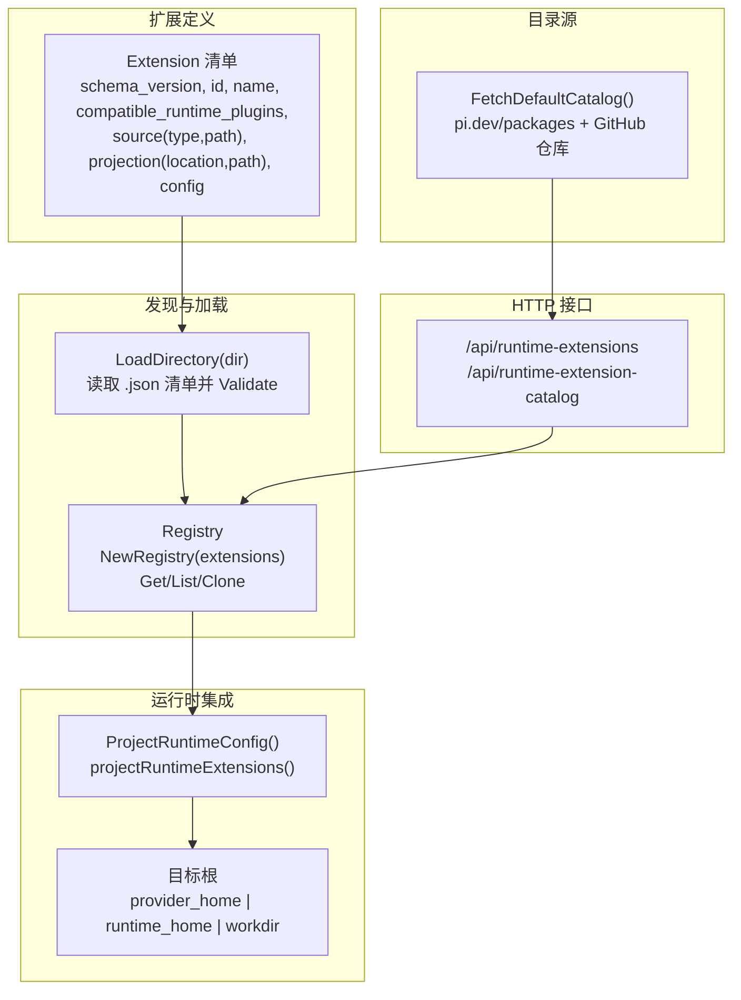
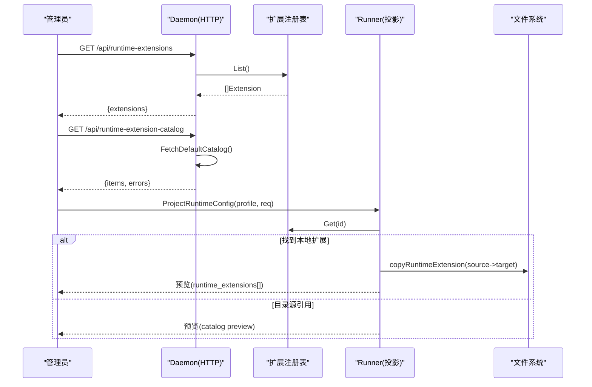
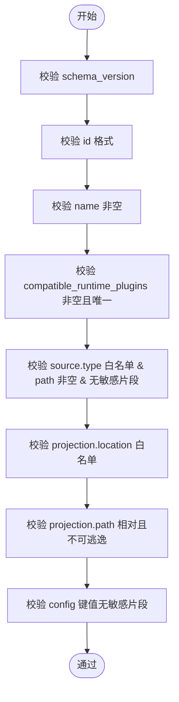
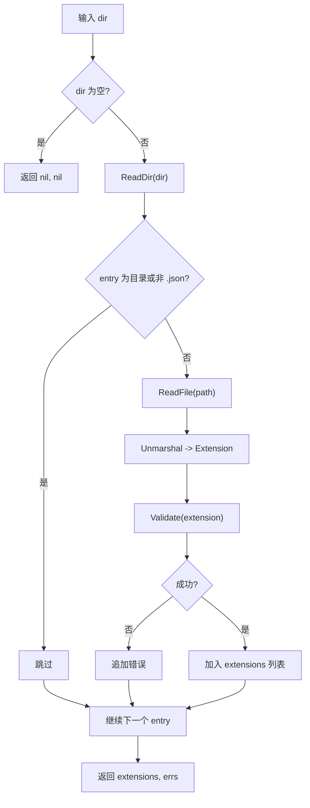
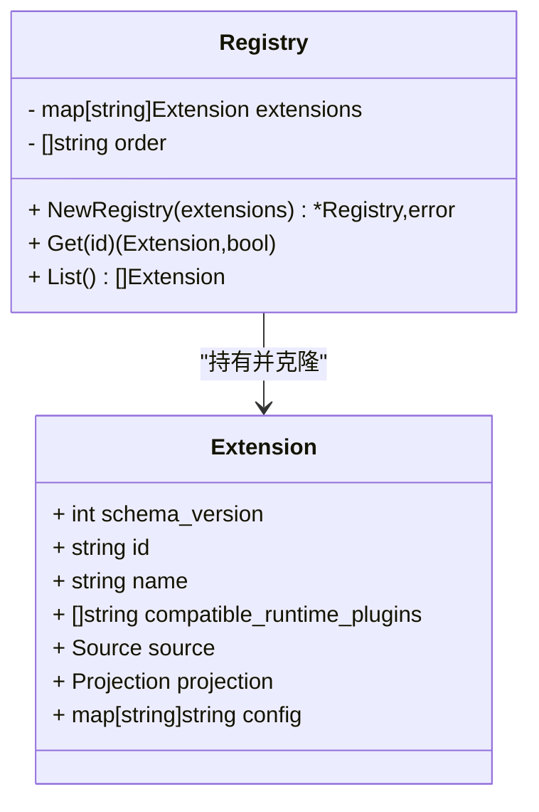
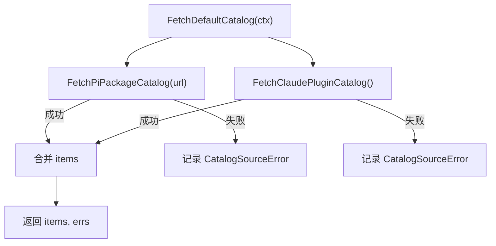
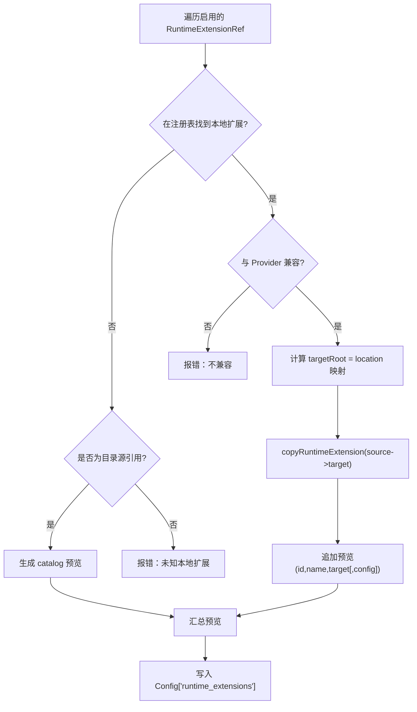
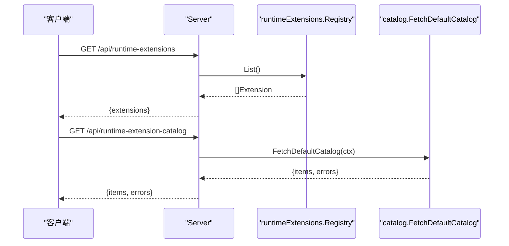
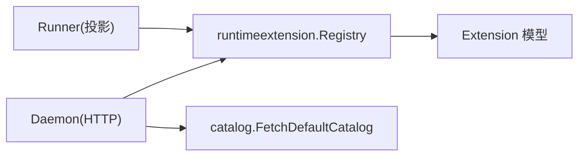

# 扩展机制与生命周期

<cite>
**本文引用的文件**   
- [extension.go](file://internal/runtimeextension/extension.go)
- [loader.go](file://internal/runtimeextension/loader.go)
- [registry.go](file://internal/runtimeextension/registry.go)
- [catalog.go](file://internal/runtimeextension/catalog.go)
- [plugin.go](file://internal/runtimeplugin/plugin.go)
- [runtime_extension_handlers.go](file://internal/daemon/runtime_extension_handlers.go)
- [server.go](file://internal/daemon/server.go)
- [projection.go](file://internal/runner/projection.go)
- [projection_extension_test.go](file://internal/runner/projection_extension_test.go)
- [runtime_extension_test.go](file://internal/daemon/runtime_extension_test.go)
</cite>

## 目录
1. [简介](#简介)
2. [项目结构](#项目结构)
3. [核心组件](#核心组件)
4. [架构总览](#架构总览)
5. [详细组件分析](#详细组件分析)
6. [依赖关系分析](#依赖关系分析)
7. [性能与安全考量](#性能与安全考量)
8. [故障排查指南](#故障排查指南)
9. [结论](#结论)
10. [附录：开发规范与示例](#附录开发规范与示例)

## 简介
本文件系统性阐述 CyberPenda 的运行时扩展系统，覆盖扩展清单、发现与加载、注册与版本控制、与运行时的集成（投影与安装）、以及安全边界与调试方法。扩展分为两类：
- 本地可信扩展：由管理员在受信任目录放置的 JSON 清单描述，用于将本地文件或目录投影到任务沙箱或宿主环境。
- 目录源扩展：通过外部目录扫描发现的扩展清单集合，供运行时选择并启用。

此外，系统提供“目录源”能力，可从默认目录拉取可安装的扩展项（如 npm: 包），并在 Pi 代理启动时自动安装。

## 项目结构
扩展相关代码主要分布在以下模块：
- internal/runtimeextension：扩展清单模型、校验、目录加载、注册表与目录源抓取
- internal/runtimeplugin：声明式运行时插件清单（扩展与之协作，但独立）
- internal/daemon：HTTP API 暴露扩展列表与目录源
- internal/runner：将扩展投影到任务布局（provider_home / runtime_home / workdir）

图示来源
- [extension.go:19-49](file://internal/runtimeextension/extension.go#L19-L49)
- [loader.go:11-45](file://internal/runtimeextension/loader.go#L11-L45)
- [registry.go:13-27](file://internal/runtimeextension/registry.go#L13-L27)
- [catalog.go:37-57](file://internal/runtimeextension/catalog.go#L37-L57)
- [projection.go:183-229](file://internal/runner/projection.go#L183-L229)
- [runtime_extension_handlers.go:9-36](file://internal/daemon/runtime_extension_handlers.go#L9-L36)

章节来源
- [extension.go:19-49](file://internal/runtimeextension/extension.go#L19-L49)
- [loader.go:11-45](file://internal/runtimeextension/loader.go#L11-L45)
- [registry.go:13-27](file://internal/runtimeextension/registry.go#L13-L27)
- [catalog.go:37-57](file://internal/runtimeextension/catalog.go#L37-L57)
- [projection.go:183-229](file://internal/runner/projection.go#L183-L229)
- [runtime_extension_handlers.go:9-36](file://internal/daemon/runtime_extension_handlers.go#L9-L36)

## 核心组件
- Extension 清单模型与校验
  - 字段：schema_version、id、name、compatible_runtime_plugins、source(type/path)、projection(location/path)、config
  - 校验规则：ID 格式、名称必填、兼容插件非空且唯一、source.type 白名单、path 非空且不包含敏感信息、projection.location 白名单、projection.path 相对路径且不可逃逸
- 目录加载器 LoadDirectory
  - 仅读取顶层 .json 清单，解析后执行 Validate，收集错误与有效清单
- 注册表 Registry
  - 去重 ID、按 ID 排序、返回深拷贝以避免共享可变状态
- 目录源 Catalog
  - 聚合 pi.dev/packages 与 GitHub 官方仓库的扩展项，返回可安装引用（install_ref）
- 运行时投影 ProjectRuntimeConfig
  - 根据 profile 中的 RuntimeExtensions 引用，匹配本地注册表或目录源预览；对本地扩展进行内容复制与目标根定位；输出预览配置

章节来源
- [extension.go:51-96](file://internal/runtimeextension/extension.go#L51-L96)
- [loader.go:11-45](file://internal/runtimeextension/loader.go#L11-L45)
- [registry.go:13-27](file://internal/runtimeextension/registry.go#L13-L27)
- [catalog.go:37-57](file://internal/runtimeextension/catalog.go#L37-L57)
- [projection.go:183-229](file://internal/runner/projection.go#L183-L229)

## 架构总览
扩展从“清单定义 -> 目录发现 -> 注册表 -> HTTP 查询 -> 运行时投影 -> 目标位置”的流水线工作。

图示来源
- [runtime_extension_handlers.go:9-36](file://internal/daemon/runtime_extension_handlers.go#L9-L36)
- [registry.go:29-49](file://internal/runtimeextension/registry.go#L29-L49)
- [catalog.go:37-57](file://internal/runtimeextension/catalog.go#L37-L57)
- [projection.go:183-229](file://internal/runner/projection.go#L183-L229)

## 详细组件分析

### 清单模型与校验（Extension）
- 关键约束
  - schema_version 固定为当前版本
  - id 小写字母开头，允许数字、下划线、点、连字符
  - compatible_runtime_plugins 非空且无重复
  - source.type 仅支持 local_dir/local_file；path 非空且不含疑似密钥片段
  - projection.location 仅支持 provider_home/runtime_home/workdir；path 必须相对且不可使用 .. 或绝对路径
- 兼容性判断
  - CompatibleWith(extension, pluginID) 基于清单中声明的兼容插件列表

图示来源
- [extension.go:51-96](file://internal/runtimeextension/extension.go#L51-L96)

章节来源
- [extension.go:19-49](file://internal/runtimeextension/extension.go#L19-L49)
- [extension.go:51-96](file://internal/runtimeextension/extension.go#L51-L96)
- [extension.go:98-105](file://internal/runtimeextension/extension.go#L98-L105)

### 目录加载器（LoadDirectory）
- 行为
  - 遍历指定目录，仅处理 .json 文件
  - 解析 JSON 为 Extension，调用 Validate
  - 返回有效清单与错误列表（不中断）
- 用途
  - 作为受信任扩展的来源，供 NewRegistry 构建注册表

图示来源
- [loader.go:11-45](file://internal/runtimeextension/loader.go#L11-L45)

章节来源
- [loader.go:11-45](file://internal/runtimeextension/loader.go#L11-L45)

### 注册表（Registry）
- 功能
  - 构造时再次 Validate，拒绝重复 ID
  - 内部维护有序 ID 列表，便于稳定枚举
  - Get/List 返回深拷贝，避免外部修改影响内部状态
- 典型用法
  - Daemon 启动时从多个 RuntimeExtensionDirs 合并构建
  - Runner 投影阶段按 ID 查找扩展

图示来源
- [registry.go:8-27](file://internal/runtimeextension/registry.go#L8-L27)
- [registry.go:29-49](file://internal/runtimeextension/registry.go#L29-L49)
- [extension.go:19-49](file://internal/runtimeextension/extension.go#L19-L49)

章节来源
- [registry.go:13-27](file://internal/runtimeextension/registry.go#L13-L27)
- [registry.go:29-49](file://internal/runtimeextension/registry.go#L29-L49)

### 目录源（Catalog）
- 数据源
  - pi.dev/packages：HTML 页面解析出扩展卡片
  - GitHub 官方仓库 anthropics/claude-plugins-official：列出 plugins/external_plugins 下的目录
- 返回结构
  - CatalogItem：id/name/description/provider/registry/registry_url/install_ref/source_url
  - CatalogSourceError：记录每个源的失败原因
- 超时与限制
  - HTTP 客户端设置超时，响应体限制大小

图示来源
- [catalog.go:37-57](file://internal/runtimeextension/catalog.go#L37-L57)
- [catalog.go:59-94](file://internal/runtimeextension/catalog.go#L59-L94)
- [catalog.go:96-141](file://internal/runtimeextension/catalog.go#L96-L141)

章节来源
- [catalog.go:37-57](file://internal/runtimeextension/catalog.go#L37-L57)
- [catalog.go:59-94](file://internal/runtimeextension/catalog.go#L59-L94)
- [catalog.go:96-141](file://internal/runtimeextension/catalog.go#L96-L141)

### 运行时投影（ProjectRuntimeConfig）
- 流程要点
  - 若 profile 未启用任何扩展，直接返回
  - 对每个启用的 RuntimeExtensionRef：
    - 优先在本地注册表中查找；找不到则尝试生成目录源预览
    - 若为本地扩展：检查与当前 Provider 的兼容性，计算目标根（provider_home/runtime_home/workdir），复制源到目标路径，写入预览
    - 若为目录源引用：保留 registry/install_ref/source_url 等元信息作为预览
  - 最终在 Config["runtime_extensions"] 中输出预览数组
- 目标根映射
  - provider_home：对应具体 Agent 的配置目录
  - runtime_home：运行时公共目录
  - workdir：任务工作目录

图示来源
- [projection.go:183-229](file://internal/runner/projection.go#L183-L229)
- [projection.go:260-279](file://internal/runner/projection.go#L260-L279)

章节来源
- [projection.go:183-229](file://internal/runner/projection.go#L183-L229)
- [projection.go:260-279](file://internal/runner/projection.go#L260-L279)

### HTTP 接口（Daemon）
- 路由
  - GET /api/runtime-extensions：返回已加载的本地扩展列表
  - GET /api/runtime-extension-catalog：返回目录源聚合结果及错误
- 实现
  - 直接从 Server.runtimeExtensions 注册表获取
  - 调用 FetchDefaultCatalog 获取目录源

图示来源
- [runtime_extension_handlers.go:9-36](file://internal/daemon/runtime_extension_handlers.go#L9-L36)

章节来源
- [runtime_extension_handlers.go:9-36](file://internal/daemon/runtime_extension_handlers.go#L9-L36)

## 依赖关系分析
- 组件耦合
  - Daemon 依赖 runtimeextension.Registry 提供扩展查询能力
  - Runner 依赖 runtimeextension.Registry 完成扩展投影
  - Catalog 独立于运行时，仅被 HTTP 层调用
- 外部依赖
  - 网络访问 pi.dev/packages 与 GitHub API，具备超时与限流保护
- 潜在循环
  - 各模块单向依赖，未发现循环导入

图示来源
- [server.go:126-133](file://internal/daemon/server.go#L126-L133)
- [runtime_extension_handlers.go:9-36](file://internal/daemon/runtime_extension_handlers.go#L9-L36)
- [projection.go:183-229](file://internal/runner/projection.go#L183-L229)
- [catalog.go:37-57](file://internal/runtimeextension/catalog.go#L37-L57)

章节来源
- [server.go:126-133](file://internal/daemon/server.go#L126-L133)
- [runtime_extension_handlers.go:9-36](file://internal/daemon/runtime_extension_handlers.go#L9-L36)
- [projection.go:183-229](file://internal/runner/projection.go#L183-L229)
- [catalog.go:37-57](file://internal/runtimeextension/catalog.go#L37-L57)

## 性能与安全考量
- 性能
  - 目录加载为一次性操作，按文件顺序串行读取与校验
  - 注册表构造时对 ID 排序，保证枚举稳定性
  - 目录源请求带超时与响应体大小限制，避免长时间阻塞
- 安全
  - 清单校验阻止绝对路径与路径穿越（..）
  - 禁止在 source.path 与 config 中出现疑似密钥片段
  - 仅受信任目录（RuntimeExtensionDirs）会被扫描，防止任意目录注入
  - 投影目标严格限定在白名单位置，避免越权写入

章节来源
- [extension.go:51-96](file://internal/runtimeextension/extension.go#L51-L96)
- [catalog.go:143-162](file://internal/runtimeextension/catalog.go#L143-L162)
- [server.go:60-66](file://internal/daemon/server.go#L60-L66)

## 故障排查指南
- 常见问题
  - 清单校验失败：检查 schema_version、id 格式、name 是否缺失、compatible_runtime_plugins 是否为空或重复、source.type 是否在白名单、source.path 是否包含敏感片段、projection.location 是否合法、projection.path 是否相对且不可逃逸
  - 未知本地扩展：确保扩展已在受信任目录中并以 .json 命名，且已被加载到注册表
  - 不兼容扩展：确认 extension.compatible_runtime_plugins 包含当前 Provider（如 codex/pi/claude_code）
  - 目录源拉取失败：检查网络连通性与超时，查看 errors 列表中的具体源错误
- 验证步骤
  - 使用 GET /api/runtime-extensions 确认扩展已加载
  - 使用 GET /api/runtime-extension-catalog 确认目录源可用
  - 在测试中参考投影用例，验证目标文件是否被正确复制

章节来源
- [extension.go:51-96](file://internal/runtimeextension/extension.go#L51-L96)
- [runtime_extension_test.go:15-69](file://internal/daemon/runtime_extension_test.go#L15-L69)
- [projection_extension_test.go:13-67](file://internal/runner/projection_extension_test.go#L13-L67)

## 结论
CyberPenda 的扩展机制以“清单驱动 + 受信任目录 + 注册表 + 投影”为核心，既支持本地可信扩展的安全部署，也支持目录源的可安装扩展生态。通过严格的清单校验与路径限制，系统在易用性与安全性之间取得平衡。

## 附录：开发规范与示例

### 扩展清单规范
- 必需字段
  - schema_version：当前版本
  - id：符合小写字母开头的标识符
  - name：人类可读名称
  - compatible_runtime_plugins：至少一个运行时插件 ID
  - source.type：local_dir 或 local_file
  - source.path：非空且不含敏感片段
  - projection.location：provider_home / runtime_home / workdir
  - projection.path：相对路径，不允许 .. 或绝对路径
- 可选字段
  - description：扩展说明
  - config：键值对配置，不得包含敏感片段

章节来源
- [extension.go:19-49](file://internal/runtimeextension/extension.go#L19-L49)
- [extension.go:51-96](file://internal/runtimeextension/extension.go#L51-L96)

### 目录结构与清单放置
- 在受信任目录（RuntimeExtensionDirs）下放置若干 .json 清单文件
- 每个清单对应一个扩展，文件名即清单名（不影响 id）
- 清单中 source.path 指向实际资源（文件或目录）

章节来源
- [loader.go:11-45](file://internal/runtimeextension/loader.go#L11-L45)
- [server.go:60-66](file://internal/daemon/server.go#L60-L66)

### 依赖管理与版本控制
- 本地扩展：通过清单声明与受信任目录管理
- 目录源扩展：通过 install_ref 与 registry 元数据管理，由目标运行时（如 Pi）在安装期拉取
- 版本策略：清单 schema_version 固定，向后兼容需升级 schema 并更新校验逻辑

章节来源
- [catalog.go:37-57](file://internal/runtimeextension/catalog.go#L37-L57)
- [extension.go:11-17](file://internal/runtimeextension/extension.go#L11-L17)

### 权限控制与安全沙箱
- 仅受信任目录会被扫描
- 投影目标严格受限，禁止路径穿越
- 禁止在清单与配置中泄露敏感信息
- 与运行时插件（runtimeplugin）解耦，扩展不直接获得进程级权限

章节来源
- [extension.go:51-96](file://internal/runtimeextension/extension.go#L51-L96)
- [projection.go:260-279](file://internal/runner/projection.go#L260-L279)
- [plugin.go:136-215](file://internal/runtimeplugin/plugin.go#L136-L215)

### 调试方法
- 使用 HTTP 接口
  - GET /api/runtime-extensions：确认扩展加载情况
  - GET /api/runtime-extension-catalog：确认目录源可用性
- 使用单元测试参考
  - 参考 daemon 与 runner 的测试用例，快速验证清单加载、注册表查询与投影结果

章节来源
- [runtime_extension_test.go:15-69](file://internal/daemon/runtime_extension_test.go#L15-L69)
- [projection_extension_test.go:13-67](file://internal/runner/projection_extension_test.go#L13-L67)