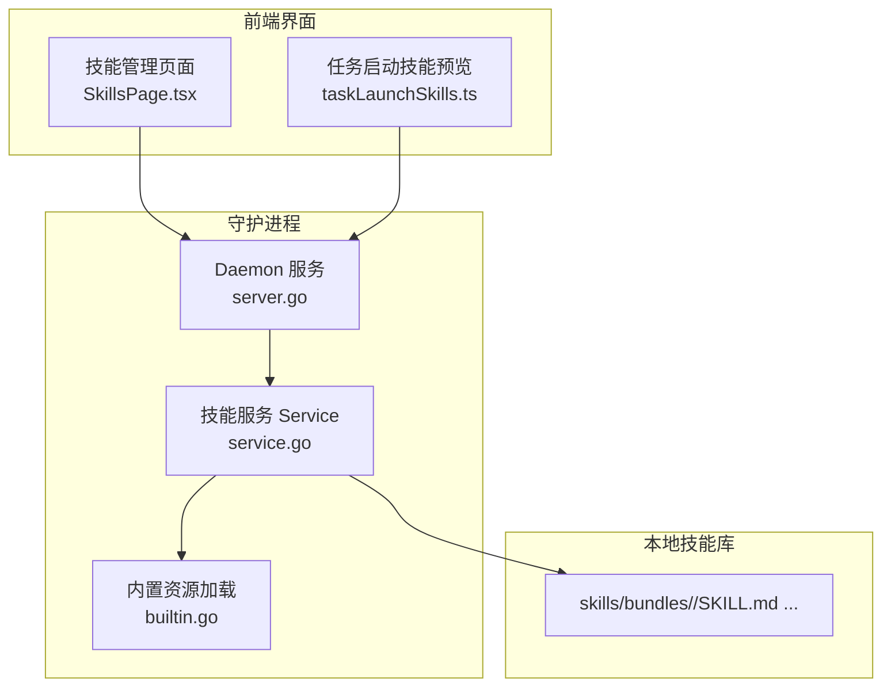
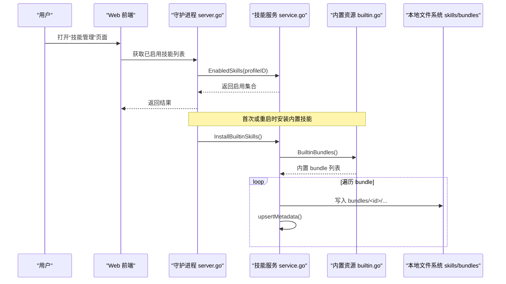
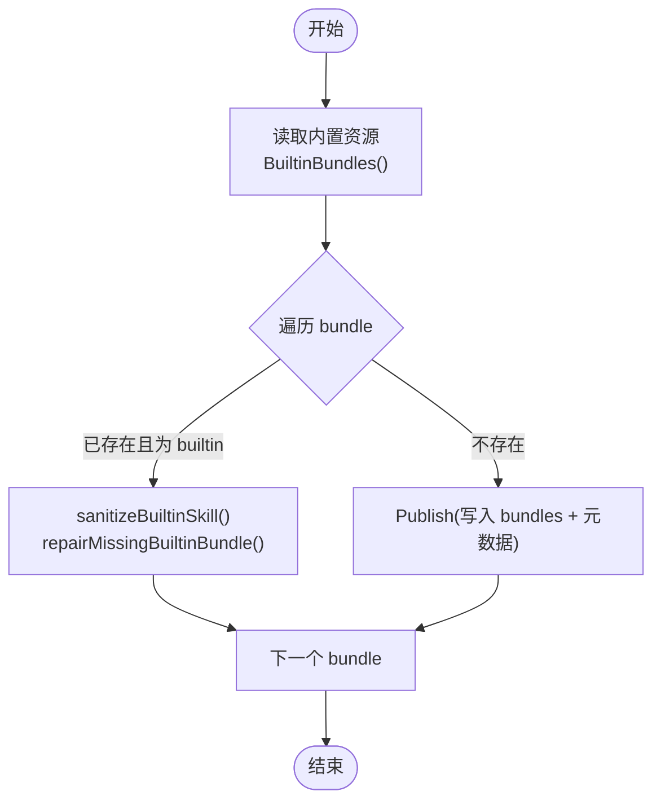
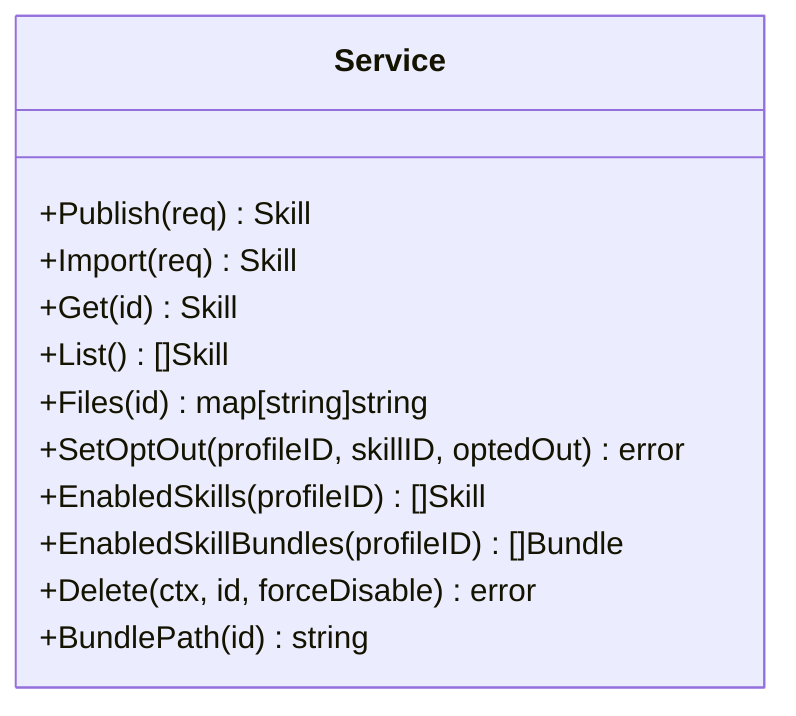

# 内置技能包

<cite>
**本文引用的文件**   
- [internal/skill/builtin.go](file://internal/skill/builtin.go)
- [internal/skill/service.go](file://internal/skill/service.go)
- [internal/daemon/server.go](file://internal/daemon/server.go)
- [web/src/pages/SkillsPage.tsx](file://web/src/pages/SkillsPage.tsx)
- [web/src/pages/taskLaunchSkills.ts](file://web/src/pages/taskLaunchSkills.ts)
- [internal/skill/builtins/assets/tooling-nmap/SKILL.md](file://internal/skill/builtins/assets/tooling-nmap/SKILL.md)
- [internal/skill/builtins/assets/tooling-sqlmap/SKILL.md](file://internal/skill/builtins/assets/tooling-sqlmap/SKILL.md)
- [internal/skill/builtins/assets/tooling-nuclei/SKILL.md](file://internal/skill/builtins/assets/tooling-nuclei/SKILL.md)
- [internal/skill/builtins/assets/tooling-ffuf/SKILL.md](file://internal/skill/builtins/assets/tooling-ffuf/SKILL.md)
- [internal/skill/builtins/assets/tooling-httpx/SKILL.md](file://internal/skill/builtins/assets/tooling-httpx/SKILL.md)
- [internal/skill/builtins/assets/tooling-katana/SKILL.md](file://internal/skill/builtins/assets/tooling-katana/SKILL.md)
- [internal/skill/builtins/assets/tooling-naabu/SKILL.md](file://internal/skill/builtins/assets/tooling-naabu/SKILL.md)
- [internal/skill/builtins/assets/tooling-semgrep/SKILL.md](file://internal/skill/builtins/assets/tooling-semgrep/SKILL.md)
- [internal/skill/builtins/assets/tooling-subfinder/SKILL.md](file://internal/skill/builtins/assets/tooling-subfinder/SKILL.md)
- [internal/skill/builtins/assets/frameworks-nextjs/SKILL.md](file://internal/skill/builtins/assets/frameworks-nextjs/SKILL.md)
- [internal/skill/builtins/assets/frameworks-fastapi/SKILL.md](file://internal/skill/builtins/assets/frameworks-fastapi/SKILL.md)
- [internal/skill/builtins/assets/vulnerabilities-sql-injection/SKILL.md](file://internal/skill/builtins/assets/vulnerabilities-sql-injection/SKILL.md)
- [internal/skill/builtins/assets/vulnerabilities-xss/SKILL.md](file://internal/skill/builtins/assets/vulnerabilities-xss/SKILL.md)
- [internal/skill/builtins/assets/vulnerabilities-csrf/SKILL.md](file://internal/skill/builtins/assets/vulnerabilities-csrf/SKILL.md)
</cite>

## 目录
1. [简介](#简介)
2. [项目结构](#项目结构)
3. [核心组件](#核心组件)
4. [架构总览](#架构总览)
5. [详细组件分析](#详细组件分析)
6. [依赖关系分析](#依赖关系分析)
7. [性能与执行环境](#性能与执行环境)
8. [故障排除指南](#故障排除指南)
9. [结论](#结论)
10. [附录：内置技能清单与要点](#附录内置技能清单与要点)

## 简介
本文件系统化介绍 CyberPenda 预置的“内置技能包”，覆盖工具类、框架类与漏洞类型三大类别。内容包含每个技能包的功能特性、使用场景、配置参数、执行环境要求，以及启用/禁用方法、自定义配置与故障排除建议。文档同时给出代码级架构图与流程图，帮助读者理解从安装到启用的完整生命周期。

## 项目结构
CyberPenda 将内置技能以“bundle”形式打包进二进制，并在守护进程启动时按需安装至本地库目录；运行时通过“运行配置（Profile）”对技能进行启用/禁用控制。前端提供技能库管理与导入能力。

图表来源
- [internal/daemon/server.go:126-169](file://internal/daemon/server.go#L126-L169)
- [internal/skill/service.go:46-55](file://internal/skill/service.go#L46-L55)
- [internal/skill/builtin.go:25-28](file://internal/skill/builtin.go#L25-L28)
- [web/src/pages/SkillsPage.tsx:1-488](file://web/src/pages/SkillsPage.tsx#L1-L488)
- [web/src/pages/taskLaunchSkills.ts:1-23](file://web/src/pages/taskLaunchSkills.ts#L1-L23)

章节来源
- [internal/daemon/server.go:126-169](file://internal/daemon/server.go#L126-L169)
- [internal/skill/service.go:46-55](file://internal/skill/service.go#L46-L55)
- [internal/skill/builtin.go:25-28](file://internal/skill/builtin.go#L25-L28)
- [web/src/pages/SkillsPage.tsx:1-488](file://web/src/pages/SkillsPage.tsx#L1-L488)
- [web/src/pages/taskLaunchSkills.ts:1-23](file://web/src/pages/taskLaunchSkills.ts#L1-L23)

## 核心组件
- 内置资源加载器：扫描并解析嵌入的 SKILL.md 前缀元数据，生成内置 bundle 列表。
- 技能服务：负责发布、导入、查询、删除技能，维护本地 bundles 目录与数据库元数据，并提供按 Profile 的启用/禁用控制。
- 守护进程集成：在启动阶段调用安装流程，确保内置技能存在且可被后续模块消费。
- 前端技能管理：提供新建、导入、发布、删除等交互入口，并与后端 API 协作。

章节来源
- [internal/skill/builtin.go:25-28](file://internal/skill/builtin.go#L25-L28)
- [internal/skill/service.go:57-113](file://internal/skill/service.go#L57-L113)
- [internal/skill/service.go:218-250](file://internal/skill/service.go#L218-L250)
- [internal/daemon/server.go:155-163](file://internal/daemon/server.go#L155-L163)
- [web/src/pages/SkillsPage.tsx:458-488](file://web/src/pages/SkillsPage.tsx#L458-L488)

## 架构总览
下图展示“内置技能安装与生效”的关键流程：守护进程初始化 → 安装内置技能 → 写入本地库 → 根据 Profile 计算可用技能集 → 前端展示与用户操作。

图表来源
- [internal/daemon/server.go:155-163](file://internal/daemon/server.go#L155-L163)
- [internal/skill/builtin.go:25-28](file://internal/skill/builtin.go#L25-L28)
- [internal/skill/service.go:69-103](file://internal/skill/service.go#L69-L103)
- [internal/skill/service.go:382-403](file://internal/skill/service.go#L382-L403)
- [web/src/pages/SkillsPage.tsx:1-488](file://web/src/pages/SkillsPage.tsx#L1-L488)

## 详细组件分析

### 内置技能安装与迁移机制
- 安装流程：读取嵌入资源，解析每个 bundle 的 SKILL.md 前缀元数据，若本地不存在则发布；若已存在且为“builtin”来源，则修复元数据与缺失文件。
- 历史兼容：支持旧 ID 迁移与废弃 ID 清理，自动将 opt-out 映射到新 ID。
- 安全校验：禁止符号链接，强制相对路径校验，原子替换 live 目录。

图表来源
- [internal/skill/builtin.go:267-305](file://internal/skill/builtin.go#L267-L305)
- [internal/skill/builtin.go:222-234](file://internal/skill/builtin.go#L222-L234)
- [internal/skill/builtin.go:236-254](file://internal/skill/builtin.go#L236-L254)
- [internal/skill/service.go:57-113](file://internal/skill/service.go#L57-L113)

章节来源
- [internal/skill/builtin.go:25-28](file://internal/skill/builtin.go#L25-L28)
- [internal/skill/builtin.go:69-103](file://internal/skill/builtin.go#L69-L103)
- [internal/skill/builtin.go:105-146](file://internal/skill/builtin.go#L105-L146)
- [internal/skill/builtin.go:164-193](file://internal/skill/builtin.go#L164-L193)
- [internal/skill/service.go:57-113](file://internal/skill/service.go#L57-L113)
- [internal/skill/service.go:178-216](file://internal/skill/service.go#L178-L216)

### 技能启用/禁用与 Profile 绑定
- 启用/禁用：基于 profileID 与 skillID 的 opt-out 表实现；未显式 opt-out 的技能默认启用。
- 查询：EnabledSkills 返回当前 profile 下实际可用的技能集合。
- 删除保护：若仍有 profile 启用该技能，需强制模式才能删除。

图表来源
- [internal/skill/service.go:57-113](file://internal/skill/service.go#L57-L113)
- [internal/skill/service.go:218-250](file://internal/skill/service.go#L218-L250)
- [internal/skill/service.go:252-282](file://internal/skill/service.go#L252-L282)
- [internal/skill/service.go:301-356](file://internal/skill/service.go#L301-L356)

章节来源
- [internal/skill/service.go:218-250](file://internal/skill/service.go#L218-L250)
- [internal/skill/service.go:252-282](file://internal/skill/service.go#L252-L282)
- [internal/skill/service.go:301-356](file://internal/skill/service.go#L301-L356)

### 前端技能管理与导入
- 技能管理页：支持新建、导入（npx）、发布、编辑、删除等操作。
- 任务启动预览：根据所选 preset/profile 计算预览时的可用技能集合。

章节来源
- [web/src/pages/SkillsPage.tsx:458-488](file://web/src/pages/SkillsPage.tsx#L458-L488)
- [web/src/pages/taskLaunchSkills.ts:14-23](file://web/src/pages/taskLaunchSkills.ts#L14-L23)

## 依赖关系分析
- 守护进程依赖技能服务，技能服务依赖数据库与本地文件系统。
- 内置资源通过 Go embed 注入，不依赖外部网络即可安装。
- 前端通过 HTTP API 与守护进程交互，读取/更新技能状态。

图表来源
- [internal/daemon/server.go:126-169](file://internal/daemon/server.go#L126-L169)
- [internal/skill/service.go:46-55](file://internal/skill/service.go#L46-L55)
- [internal/skill/builtin.go:22-28](file://internal/skill/builtin.go#L22-L28)
- [web/src/pages/SkillsPage.tsx:1-488](file://web/src/pages/SkillsPage.tsx#L1-L488)

章节来源
- [internal/daemon/server.go:126-169](file://internal/daemon/server.go#L126-L169)
- [internal/skill/service.go:46-55](file://internal/skill/service.go#L46-L55)
- [internal/skill/builtin.go:22-28](file://internal/skill/builtin.go#L22-L28)
- [web/src/pages/SkillsPage.tsx:1-488](file://web/src/pages/SkillsPage.tsx#L1-L488)

## 性能与执行环境
- 并发与速率控制：多数工具类技能均强调显式设置并发、速率限制与超时，避免对目标造成过大压力。
- 输出格式：优先使用结构化输出（JSON/JSONL）以便下游自动化处理。
- 代理与网络：支持显式代理参数，便于在受限网络环境中稳定执行。
- 沙箱与权限：部分扫描需要特权（如 SYN），无特权时使用替代模式（如 TCP connect）。

章节来源
- [internal/skill/builtins/assets/tooling-nmap/SKILL.md:1-67](file://internal/skill/builtins/assets/tooling-nmap/SKILL.md#L1-L67)
- [internal/skill/builtins/assets/tooling-sqlmap/SKILL.md:1-68](file://internal/skill/builtins/assets/tooling-sqlmap/SKILL.md#L1-L68)
- [internal/skill/builtins/assets/tooling-nuclei/SKILL.md:1-68](file://internal/skill/builtins/assets/tooling-nuclei/SKILL.md#L1-L68)
- [internal/skill/builtins/assets/tooling-ffuf/SKILL.md:1-73](file://internal/skill/builtins/assets/tooling-ffuf/SKILL.md#L1-L73)
- [internal/skill/builtins/assets/tooling-httpx/SKILL.md:1-83](file://internal/skill/builtins/assets/tooling-httpx/SKILL.md#L1-L83)
- [internal/skill/builtins/assets/tooling-katana/SKILL.md:1-88](file://internal/skill/builtins/assets/tooling-katana/SKILL.md#L1-L88)
- [internal/skill/builtins/assets/tooling-naabu/SKILL.md:1-69](file://internal/skill/builtins/assets/tooling-naabu/SKILL.md#L1-L69)
- [internal/skill/builtins/assets/tooling-semgrep/SKILL.md:1-73](file://internal/skill/builtins/assets/tooling-semgrep/SKILL.md#L1-L73)
- [internal/skill/builtins/assets/tooling-subfinder/SKILL.md:1-67](file://internal/skill/builtins/assets/tooling-subfinder/SKILL.md#L1-L67)

## 故障排除指南
- 内置技能未出现：检查守护进程是否允许安装内置技能；确认本地库目录是否存在并可写；查看是否有 opt-out 导致不可见。
- 导入失败：确认导入源配置有效；注意某些导入方式会被拒绝（例如原始命令导入）。
- 删除报错：若仍有 profile 启用该技能，需先禁用或删除相关 profile 绑定，或使用强制删除。
- 扫描异常：调整并发/速率/超时；必要时切换扫描模式（如 connect vs syn）；使用结构化输出定位问题。

章节来源
- [internal/daemon/server.go:155-163](file://internal/daemon/server.go#L155-L163)
- [internal/skill/service.go:301-356](file://internal/skill/service.go#L301-L356)
- [internal/skill/service.go:218-250](file://internal/skill/service.go#L218-L250)
- [internal/skill/builtins/assets/tooling-nmap/SKILL.md:60-67](file://internal/skill/builtins/assets/tooling-nmap/SKILL.md#L60-L67)
- [internal/skill/builtins/assets/tooling-naabu/SKILL.md:62-69](file://internal/skill/builtins/assets/tooling-naabu/SKILL.md#L62-L69)

## 结论
内置技能包为 CyberPenda 提供了开箱即用的渗透测试知识体系与工具编排指引。通过“安装—发布—启用—执行”的闭环，结合前端管理能力与 Profile 粒度控制，既保证了易用性，也兼顾了安全性与可审计性。建议在团队内统一规范各工具的并发、速率与输出格式，以获得稳定、可复现的执行效果。

## 附录：内置技能清单与要点

### 工具类技能
- nmap
  - 功能特性：双阶段扫描工作流、Agent 安全基线、关键标志说明与恢复策略。
  - 使用场景：端口发现与服务识别，适合在受控范围内快速验证。
  - 配置参数：端口范围、重试、超时、脚本超时、输出格式等。
  - 执行环境：可能需要特权（SYN），无特权时使用 TCP connect 模式。
  - 参考路径：[tooling-nmap/SKILL.md:1-67](file://internal/skill/builtins/assets/tooling-nmap/SKILL.md#L1-L67)

- sqlmap
  - 功能特性：非交互式执行、参数化测试、批量枚举与提取。
  - 使用场景：SQL 注入检测与数据提取。
  - 配置参数：级别、风险、线程、超时、WAF 绕过脚本等。
  - 执行环境：需具备目标上下文（认证 Cookie/Header）。
  - 参考路径：[tooling-sqlmap/SKILL.md:1-68](file://internal/skill/builtins/assets/tooling-sqlmap/SKILL.md#L1-L68)

- nuclei
  - 功能特性：模板驱动的高吞吐扫描、标签/严重级别过滤、结构化输出。
  - 使用场景：大规模主机/URL 的快速漏洞探测。
  - 配置参数：并发、速率、超时、OAST 开关、输出文件等。
  - 执行环境：需准备模板集与目标列表。
  - 参考路径：[tooling-nuclei/SKILL.md:1-68](file://internal/skill/builtins/assets/tooling-nuclei/SKILL.md#L1-L68)

- ffuf
  - 功能特性：灵活匹配/过滤策略、递归发现、结构化输出。
  - 使用场景：路径、Header、Body 等多位置模糊测试。
  - 配置参数：匹配码、大小过滤、线程、速率、递归深度等。
  - 执行环境：需准备词表与 FUZZ 占位符。
  - 参考路径：[tooling-ffuf/SKILL.md:1-73](file://internal/skill/builtins/assets/tooling-ffuf/SKILL.md#L1-L73)

- httpx
  - 功能特性：存活探测、技术指纹、重定向跟随、响应存储。
  - 使用场景：主机/URL 快速存活与基础信息收集。
  - 配置参数：并发、速率、超时、端口/路径探测、代理等。
  - 执行环境：支持显式代理与 JSONL 输出。
  - 参考路径：[tooling-httpx/SKILL.md:1-83](file://internal/skill/builtins/assets/tooling-httpx/SKILL.md#L1-L83)

- katana
  - 功能特性：JS 解析、已知文件抓取、混合头爬取、XHR 提取。
  - 使用场景：站点结构与隐藏端点发现。
  - 配置参数：深度、并发、扩展过滤、Chrome 选项等。
  - 执行环境：可选本地 Chrome 与代理。
  - 参考路径：[tooling-katana/SKILL.md:1-88](file://internal/skill/builtins/assets/tooling-katana/SKILL.md#L1-L88)

- naabu
  - 功能特性：端口扫描、连接/SYN 模式、速率控制、结果验证。
  - 使用场景：大范围端口发现与后续扫描前置。
  - 配置参数：端口集、扫描类型、速率、超时、并发等。
  - 执行环境：无特权时使用 connect 模式。
  - 参考路径：[tooling-naabu/SKILL.md:1-69](file://internal/skill/builtins/assets/tooling-naabu/SKILL.md#L1-L69)

- semgrep
  - 功能特性：规则集选择、SARIF/JSON 输出、Pro/OSS 引擎切换。
  - 使用场景：静态代码安全扫描与合规检查。
  - 配置参数：规则包、严重级别、并行度、超时、基线提交等。
  - 执行环境：需指定明确的目标目录与规则集。
  - 参考路径：[tooling-semgrep/SKILL.md:1-73](file://internal/skill/builtins/assets/tooling-semgrep/SKILL.md#L1-L73)

- subfinder
  - 功能特性：被动子域枚举、多源聚合、速率限制、JSONL 输出。
  - 使用场景：域名资产发现与后续探测输入。
  - 配置参数：源选择、递归、代理、超时、最大时间等。
  - 执行环境：部分源需 API Key。
  - 参考路径：[tooling-subfinder/SKILL.md:1-67](file://internal/skill/builtins/assets/tooling-subfinder/SKILL.md#L1-L67)

### 框架类技能
- Next.js
  - 功能特性：App Router/Server Actions/RSC/Edge 运行时差异、中间件绕过、缓存边界、NextAuth 陷阱。
  - 使用场景：现代全栈应用的安全评估与加固建议。
  - 配置参数：无（指导型技能）。
  - 执行环境：无需额外工具，侧重方法论与验证步骤。
  - 参考路径：[frameworks-nextjs/SKILL.md:1-229](file://internal/skill/builtins/assets/frameworks-nextjs/SKILL.md#L1-L229)

- FastAPI
  - 功能特性：依赖注入缺陷、CORS/CSRF、Jinja2 模板注入、SSRF、WebSocket 安全。
  - 使用场景：Python ASGI 应用的安全测试与最佳实践。
  - 配置参数：无（指导型技能）。
  - 执行环境：无需额外工具，侧重方法论与验证步骤。
  - 参考路径：[frameworks-fastapi/SKILL.md:1-192](file://internal/skill/builtins/assets/frameworks-fastapi/SKILL.md#L1-L192)

### 漏洞类型技能
- SQL 注入
  - 功能特性：Union/盲注/错误/带外通道、ORM 绕过、常见 DBMS 原语。
  - 使用场景：各类注入点的检测与利用。
  - 配置参数：无（指导型技能）。
  - 执行环境：无需额外工具，侧重方法论与验证步骤。
  - 参考路径：[vulnerabilities-sql-injection/SKILL.md:1-191](file://internal/skill/builtins/assets/vulnerabilities-sql-injection/SKILL.md#L1-L191)

- XSS
  - 功能特性：反射/存储/DOM XSS、CSP/Trusted Types 绕过、框架特定向量。
  - 使用场景：跨站脚本攻击面分析与验证。
  - 配置参数：无（指导型技能）。
  - 执行环境：无需额外工具，侧重方法论与验证步骤。
  - 参考路径：[vulnerabilities-xss/SKILL.md:1-207](file://internal/skill/builtins/assets/vulnerabilities-xss/SKILL.md#L1-L207)

- CSRF
  - 功能特性：Token 绕过、SameSite 行为、CORS 误配、登录/注销链式攻击。
  - 使用场景：状态变更请求的伪造与防护验证。
  - 配置参数：无（指导型技能）。
  - 执行环境：无需额外工具，侧重方法论与验证步骤。
  - 参考路径：[vulnerabilities-csrf/SKILL.md:1-199](file://internal/skill/builtins/assets/vulnerabilities-csrf/SKILL.md#L1-L199)