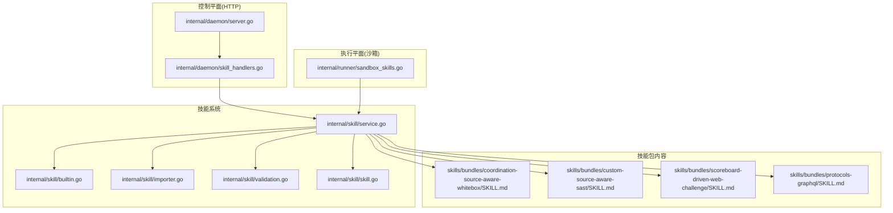
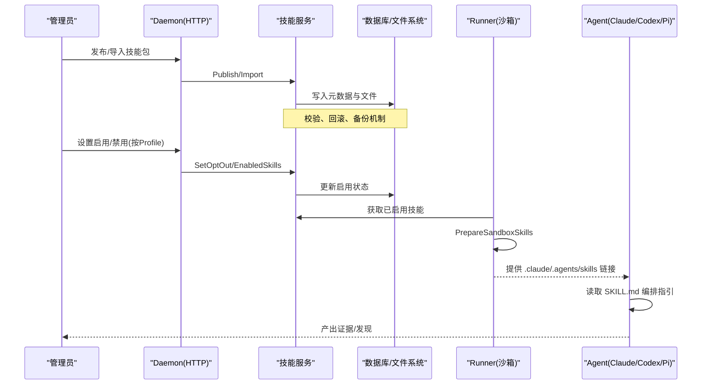
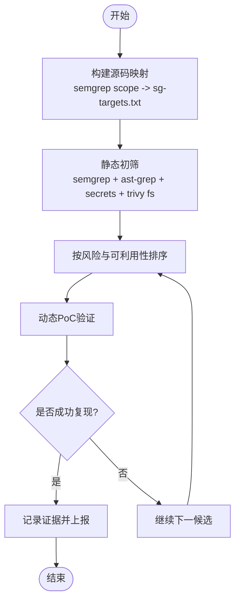
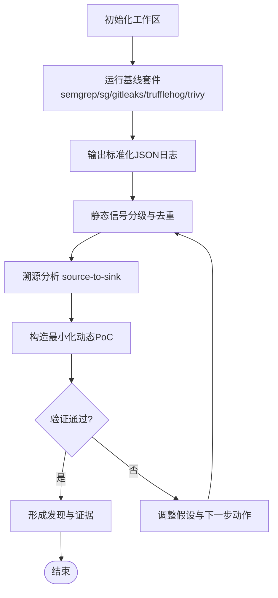
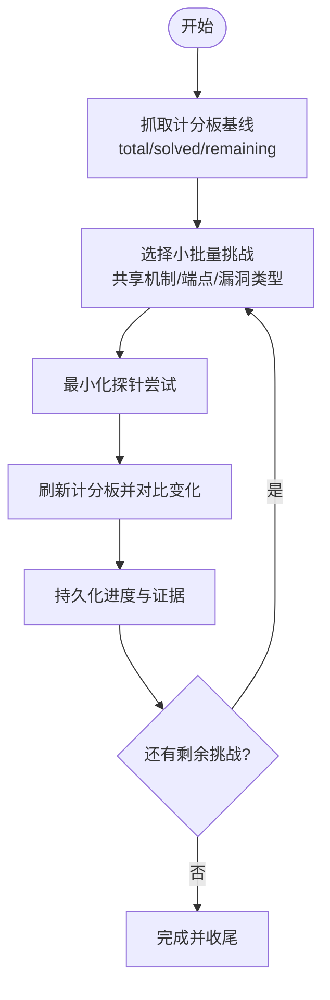
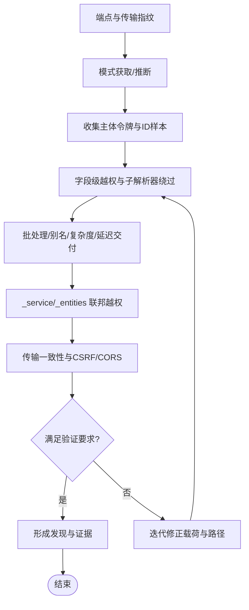
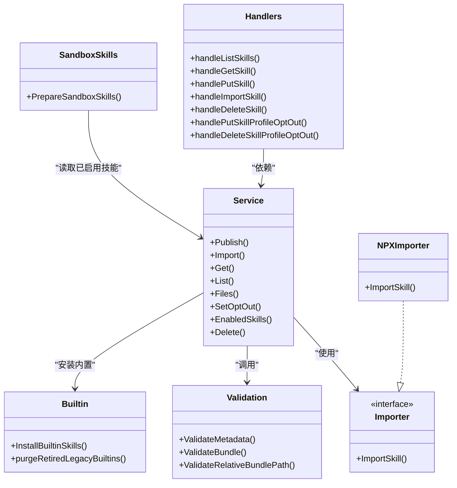

# 协调与编排技能包

<cite>
**本文引用的文件**   
- [internal/skill/builtin.go](file://internal/skill/builtin.go)
- [internal/skill/service.go](file://internal/skill/service.go)
- [internal/skill/skill.go](file://internal/skill/skill.go)
- [internal/skill/importer.go](file://internal/skill/importer.go)
- [internal/skill/validation.go](file://internal/skill/validation.go)
- [internal/daemon/skill_handlers.go](file://internal/daemon/skill_handlers.go)
- [internal/daemon/server.go](file://internal/daemon/server.go)
- [internal/runner/sandbox_skills.go](file://internal/runner/sandbox_skills.go)
- [skills/bundles/coordination-source-aware-whitebox/SKILL.md](file://skills/bundles/coordination-source-aware-whitebox/SKILL.md)
- [skills/bundles/custom-source-aware-sast/SKILL.md](file://skills/bundles/custom-source-aware-sast/SKILL.md)
- [skills/bundles/scoreboard-driven-web-challenge/SKILL.md](file://skills/bundles/scoreboard-driven-web-challenge/SKILL.md)
- [skills/bundles/protocols-graphql/SKILL.md](file://skills/bundles/protocols-graphql/SKILL.md)
</cite>

## 目录
1. [简介](#简介)
2. [项目结构](#项目结构)
3. [核心组件](#核心组件)
4. [架构总览](#架构总览)
5. [详细组件分析](#详细组件分析)
6. [依赖关系分析](#依赖关系分析)
7. [性能考虑](#性能考虑)
8. [故障诊断指南](#故障诊断指南)
9. [结论](#结论)
10. [附录](#附录)

## 简介
本文件聚焦于“协调与编排”类高级技能包，覆盖以下能力：
- 源感知白盒测试协调：在具备源码时，结合静态分析与动态验证的编排流程。
- 自定义 SAST 集成：以 semgrep、ast-grep、gitleaks、trivy 等工具为核心的可组合式静态扫描工作流。
- 计分板驱动的 Web 挑战测试：以在线计分板为事实来源的黑盒解题策略与持久化状态管理。
- GraphQL 协议测试：面向 GraphQL 的探测、鉴权绕过、批处理滥用、联邦边界等安全测试方法。

文档同时给出这些技能包的配置方式、运行时集成路径、实际应用场景、高级用法示例、性能优化建议与故障诊断要点。

## 项目结构
与协调与编排相关的代码与资源主要分布在如下位置：
- 技能包定义与内置分发：internal/skill/*（服务、导入器、校验、内置包安装）
- HTTP 接口层：internal/daemon/skill_handlers.go（技能列表、发布、导入、删除、启用/禁用）
- 运行时发现与挂载：internal/runner/sandbox_skills.go（将技能包链接到沙箱工作目录）
- 具体技能包说明：skills/bundles/{bundle}/SKILL.md（编排与使用方法）

图表来源
- [internal/daemon/server.go:120-163](file://internal/daemon/server.go#L120-L163)
- [internal/daemon/skill_handlers.go:31-137](file://internal/daemon/skill_handlers.go#L31-L137)
- [internal/skill/service.go:57-142](file://internal/skill/service.go#L57-L142)
- [internal/skill/builtin.go:66-103](file://internal/skill/builtin.go#L66-L103)
- [internal/skill/importer.go:18-46](file://internal/skill/importer.go#L18-L46)
- [internal/skill/validation.go:23-65](file://internal/skill/validation.go#L23-L65)
- [internal/runner/sandbox_skills.go:27-81](file://internal/runner/sandbox_skills.go#L27-L81)

章节来源
- [internal/daemon/server.go:120-163](file://internal/daemon/server.go#L120-L163)
- [internal/daemon/skill_handlers.go:31-137](file://internal/daemon/skill_handlers.go#L31-L137)
- [internal/skill/service.go:57-142](file://internal/skill/service.go#L57-L142)
- [internal/skill/builtin.go:66-103](file://internal/skill/builtin.go#L66-L103)
- [internal/skill/importer.go:18-46](file://internal/skill/importer.go#L18-L46)
- [internal/skill/validation.go:23-65](file://internal/skill/validation.go#L23-L65)
- [internal/runner/sandbox_skills.go:27-81](file://internal/runner/sandbox_skills.go#L27-L81)

## 核心组件
- 技能服务（Service）：负责技能的发布、导入、查询、启用/禁用、删除、元数据与文件存储、以及内置技能安装与修复。
- 内置技能分发（Builtin）：从嵌入的文件系统中读取并安装内置技能包，支持 ID 迁移、废弃清理与缺失修复。
- 导入器（Importer）：通过受控命令（npx skills import）拉取外部包形式的技能包，禁止直接传入 shell 命令。
- 校验器（Validation）：对技能 ID、名称、包根目录、SKILL.md 存在性与相对路径进行严格校验。
- HTTP 处理器（Handlers）：暴露技能 CRUD、导入、按运行期配置文件启用/禁用的 REST 接口。
- 沙箱技能准备（Sandbox Skills）：将技能包链接到不同 Provider 的工作目录，使其在任务中可被发现。

章节来源
- [internal/skill/service.go:57-142](file://internal/skill/service.go#L57-L142)
- [internal/skill/builtin.go:66-103](file://internal/skill/builtin.go#L66-L103)
- [internal/skill/importer.go:18-46](file://internal/skill/importer.go#L18-L46)
- [internal/skill/validation.go:23-65](file://internal/skill/validation.go#L23-L65)
- [internal/daemon/skill_handlers.go:31-137](file://internal/daemon/skill_handlers.go#L31-L137)
- [internal/runner/sandbox_skills.go:27-81](file://internal/runner/sandbox_skills.go#L27-L81)

## 架构总览
协调与编排技能包的生命周期包括：
- 安装阶段：Daemon 启动时安装内置技能包；或管理员通过 API 发布/导入自定义技能包。
- 选择阶段：根据运行期配置文件（Runtime Profile）启用/禁用特定技能。
- 发现阶段：Runner 将技能包链接到沙箱工作目录，供 Claude/Codex/Pi 等 Provider 自动发现。
- 使用阶段：Agent 依据 SKILL.md 中的编排指引执行具体测试流程。

图表来源
- [internal/daemon/skill_handlers.go:31-137](file://internal/daemon/skill_handlers.go#L31-L137)
- [internal/skill/service.go:57-142](file://internal/skill/service.go#L57-L142)
- [internal/runner/sandbox_skills.go:27-81](file://internal/runner/sandbox_skills.go#L27-L81)

## 详细组件分析

### 源感知白盒测试协调（source-aware-whitebox）
- 目标：在拥有源码时，先构建快速源码映射，再进行静态初筛与动态验证，确保每个发现都有验证证据。
- 推荐工作流：
  - 基于 semgrep 范围生成 AST 扫描目标清单，优先使用 sg/tree-sitter 做结构化扫描。
  - 用静态结果指导动态 PoC 构造与端点选择。
  - 仅报告经动态验证的发现。
- 适用场景：大型仓库、多语言混合、需要高覆盖率与低噪声的白盒测试。

图表来源
- [skills/bundles/coordination-source-aware-whitebox/SKILL.md:1-48](file://skills/bundles/coordination-source-aware-whitebox/SKILL.md#L1-L48)

章节来源
- [skills/bundles/coordination-source-aware-whitebox/SKILL.md:1-48](file://skills/bundles/coordination-source-aware-whitebox/SKILL.md#L1-L48)

### 自定义 SAST 集成（custom-source-aware-sast）
- 目标：提供一套可组合的静态扫描基线，驱动后续动态测试。
- 基线覆盖：
  - Semgrep：默认规则集与语言专用规则集。
  - AST-Grep：无规则的结构化模式扫描。
  - 密钥检测：gitleaks 与 trufflehog。
  - 依赖与配置检查：trivy fs（vuln/misconfig）。
  - JS 侧补充：retire、eslint 等。
- 关键原则：静态结果为假设，必须动态验证后方可报告。

图表来源
- [skills/bundles/custom-source-aware-sast/SKILL.md:1-153](file://skills/bundles/custom-source-aware-sast/SKILL.md#L1-L153)

章节来源
- [skills/bundles/custom-source-aware-sast/SKILL.md:1-153](file://skills/bundles/custom-source-aware-sast/SKILL.md#L1-L153)

### 计分板驱动的 Web 挑战测试（scoreboard-driven-web-challenge）
- 目标：以在线计分板为唯一事实来源，避免盲目广撒网式测试，强制每个动作映射到具体挑战与证据。
- 工作流要点：
  - 建立计分板基线，维护已解/未解集合。
  - 小批量推进，共享证据与前置条件。
  - 每次尝试后刷新计分板并持久化进度。
  - 使用 MCP 工具持久化 Fact/Evidence/Attempt 状态。
- 边界约束：黑盒测试，除非明确授权不得访问目标源码或外部答案。

图表来源
- [skills/bundles/scoreboard-driven-web-challenge/SKILL.md:1-78](file://skills/bundles/scoreboard-driven-web-challenge/SKILL.md#L1-L78)

章节来源
- [skills/bundles/scoreboard-driven-web-challenge/SKILL.md:1-78](file://skills/bundles/scoreboard-driven-web-challenge/SKILL.md#L1-L78)

### GraphQL 协议测试（protocols-graphql）
- 目标：覆盖 GraphQL 的鉴权、字段级越权、批处理滥用、复杂度攻击、联邦信任边界等。
- 方法论：
  - 指纹识别与端点发现。
  - 模式获取（内省或推断），构建类型图。
  - 主体矩阵（匿名/用户/管理员）+ 对象ID样本。
  - 字段级越权与子解析器绕过。
  - 批处理与别名枚举、游标操纵、@defer/@stream 增量交付。
  - 联邦 _service/_entities 跨子图越权。
  - 传输一致性（HTTP/WebSocket）、持久化查询复用。
- 验证要求：成对请求证明、最小载荷、精确选择集、明确越权路径。

图表来源
- [skills/bundles/protocols-graphql/SKILL.md:1-277](file://skills/bundles/protocols-graphql/SKILL.md#L1-L277)

章节来源
- [skills/bundles/protocols-graphql/SKILL.md:1-277](file://skills/bundles/protocols-graphql/SKILL.md#L1-L277)

## 依赖关系分析
- 组件耦合与职责：
  - skill.Service 作为中心协调者，聚合导入器、校验器与持久化逻辑。
  - daemon.SkillHandlers 对外暴露 HTTP 接口，屏蔽内部实现细节。
  - runner.SandboxSkills 负责将技能包链接到 Provider 可发现路径。
- 外部依赖：
  - 导入器通过 npx skills import 拉取外部包，限制命令注入风险。
  - 内置技能来自嵌入文件系统，保证离线可用与版本稳定。
- 潜在循环依赖：当前设计分层清晰，未见循环依赖迹象。

图表来源
- [internal/skill/service.go:57-142](file://internal/skill/service.go#L57-L142)
- [internal/skill/builtin.go:66-103](file://internal/skill/builtin.go#L66-L103)
- [internal/skill/importer.go:18-46](file://internal/skill/importer.go#L18-L46)
- [internal/skill/validation.go:23-65](file://internal/skill/validation.go#L23-L65)
- [internal/daemon/skill_handlers.go:31-137](file://internal/daemon/skill_handlers.go#L31-L137)
- [internal/runner/sandbox_skills.go:27-81](file://internal/runner/sandbox_skills.go#L27-L81)

章节来源
- [internal/skill/service.go:57-142](file://internal/skill/service.go#L57-L142)
- [internal/skill/builtin.go:66-103](file://internal/skill/builtin.go#L66-L103)
- [internal/skill/importer.go:18-46](file://internal/skill/importer.go#L18-L46)
- [internal/skill/validation.go:23-65](file://internal/skill/validation.go#L23-L65)
- [internal/daemon/skill_handlers.go:31-137](file://internal/daemon/skill_handlers.go#L31-L137)
- [internal/runner/sandbox_skills.go:27-81](file://internal/runner/sandbox_skills.go#L27-L81)

## 性能考虑
- 静态扫描基线：
  - 使用确定性范围（如 semgrep paths.scanned）减少无关文件扫描。
  - 对大仓库增加超时与离线扫描选项，避免网络开销。
- 结构化扫描：
  - 通过 sg-targets.txt 限定目标文件数量，分批处理，避免内存峰值。
- 动态验证：
  - 小批量推进，失败多次即标记假设并切换目标，降低无效请求量。
- 运行时：
  - 使用符号链接而非复制，减少磁盘占用与同步时间。
  - 仅在必要时刷新计分板，避免频繁网络往返。

[本节为通用指导，不直接分析具体文件]

## 故障诊断指南
- 导入失败：
  - 检查 npx 命令是否可用、网络连通性与包名/版本是否正确。
  - 查看导入器返回的错误信息，确认 JSON 解码是否成功。
- 发布失败：
  - 校验 ID 格式、名称是否为空、包根是否存在且包含 SKILL.md。
  - 检查相对路径是否越界或包含非法字符。
- 删除冲突：
  - 若技能仍被某个运行期配置文件启用，需先禁用或删除引用后再删除。
- 沙箱不可见：
  - 确认 PrepareSandboxSkills 已将技能链接至 .claude/skills 或 .agents/skills。
  - 检查 Provider Home 下是否有对应链接。

章节来源
- [internal/skill/importer.go:18-46](file://internal/skill/importer.go#L18-L46)
- [internal/skill/validation.go:23-65](file://internal/skill/validation.go#L23-L65)
- [internal/daemon/skill_handlers.go:139-165](file://internal/daemon/skill_handlers.go#L139-L165)
- [internal/runner/sandbox_skills.go:27-81](file://internal/runner/sandbox_skills.go#L27-L81)

## 结论
协调与编排技能包通过“静态先行、动态验证、证据驱动”的方法论，显著提升了复杂目标的测试效率与准确性。配合可控的导入机制、严格的校验与清晰的运行时发现路径，使得团队能够在不同环境与安全边界下高效复用与扩展编排能力。

[本节为总结，不直接分析具体文件]

## 附录
- 高级用法示例（路径参考）：
  - 源感知白盒协调：[skills/bundles/coordination-source-aware-whitebox/SKILL.md:1-48](file://skills/bundles/coordination-source-aware-whitebox/SKILL.md#L1-L48)
  - 自定义 SAST 基线与进阶技巧：[skills/bundles/custom-source-aware-sast/SKILL.md:1-153](file://skills/bundles/custom-source-aware-sast/SKILL.md#L1-L153)
  - 计分板驱动的挑战求解与状态契约：[skills/bundles/scoreboard-driven-web-challenge/SKILL.md:1-78](file://skills/bundles/scoreboard-driven-web-challenge/SKILL.md#L1-L78)
  - GraphQL 全栈安全测试方法与验证要求：[skills/bundles/protocols-graphql/SKILL.md:1-277](file://skills/bundles/protocols-graphql/SKILL.md#L1-L277)

[本节为索引，不直接分析具体文件]