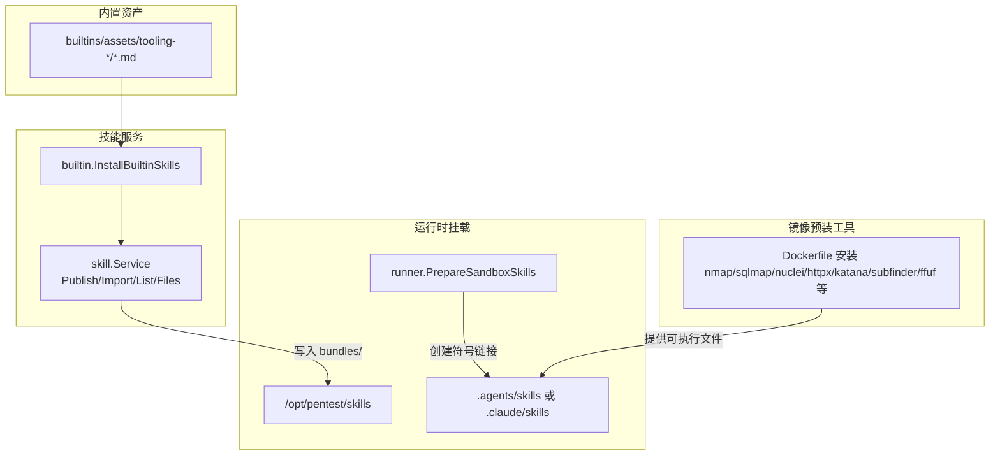
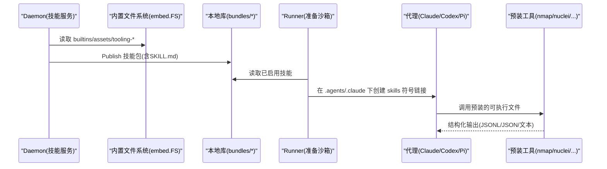
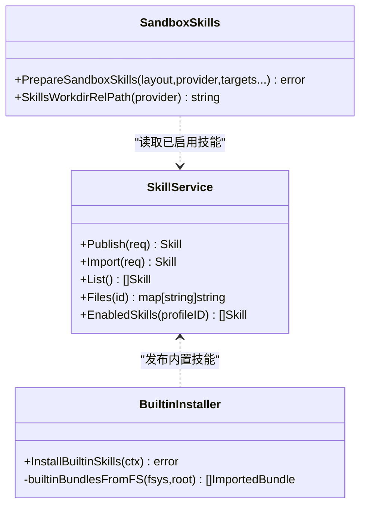
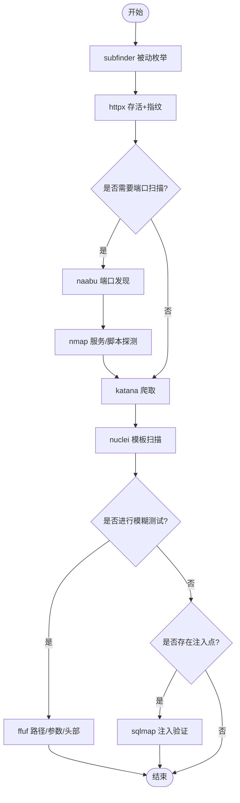

# 工具类技能包

<cite>
**本文引用的文件**
- [internal/skill/builtins/assets/tooling-nmap/SKILL.md](file://internal/skill/builtins/assets/tooling-nmap/SKILL.md)
- [internal/skill/builtins/assets/tooling-naabu/SKILL.md](file://internal/skill/builtins/assets/tooling-naabu/SKILL.md)
- [internal/skill/builtins/assets/tooling-nuclei/SKILL.md](file://internal/skill/builtins/assets/tooling-nuclei/SKILL.md)
- [internal/skill/builtins/assets/tooling-semgrep/SKILL.md](file://internal/skill/builtins/assets/tooling-semgrep/SKILL.md)
- [internal/skill/builtins/assets/tooling-ffuf/SKILL.md](file://internal/skill/builtins/assets/tooling-ffuf/SKILL.md)
- [internal/skill/builtins/assets/tooling-sqlmap/SKILL.md](file://internal/skill/builtins/assets/tooling-sqlmap/SKILL.md)
- [internal/skill/builtins/assets/tooling-httpx/SKILL.md](file://internal/skill/builtins/assets/tooling-httpx/SKILL.md)
- [internal/skill/builtins/assets/tooling-katana/SKILL.md](file://internal/skill/builtins/assets/tooling-katana/SKILL.md)
- [internal/skill/builtins/assets/tooling-subfinder/SKILL.md](file://internal/skill/builtins/assets/tooling-subfinder/SKILL.md)
- [internal/skill/builtin.go](file://internal/skill/builtin.go)
- [internal/skill/service.go](file://internal/skill/service.go)
- [internal/skill/skill.go](file://internal/skill/skill.go)
- [internal/runner/sandbox_skills.go](file://internal/runner/sandbox_skills.go)
- [docker/pentest-sandbox/Dockerfile](file://docker/pentest-sandbox/Dockerfile)
</cite>

## 目录
1. [简介](#简介)
2. [项目结构](#项目结构)
3. [核心组件](#核心组件)
4. [架构总览](#架构总览)
5. [详细组件分析](#详细组件分析)
6. [依赖关系分析](#依赖关系分析)
7. [性能与资源控制](#性能与资源控制)
8. [故障排除指南](#故障排除指南)
9. [结论](#结论)
10. [附录：组合工作流示例](#附录组合工作流示例)

## 简介
本文件系统化介绍 CyberPenda 预置的“工具类技能包”，覆盖网络扫描（nmap、naabu）、漏洞扫描（nuclei、semgrep）、模糊测试（ffuf、sqlmap）、信息收集（httpx、katana、subfinder）等工具的用法、参数配置、输出格式、执行环境要求与最佳实践。文档同时说明技能包在运行时如何被沙箱发现与挂载，并提供常见组合流程与排障建议。

## 项目结构
CyberPenda 将每个工具的使用规范以“技能包”形式内嵌于二进制中，并在启动时安装到运行库；任务运行时通过符号链接将技能包暴露给代理（Claude Code/Codex/Pi），使其可在沙箱内自动发现并遵循这些规范。

图示来源
- [internal/skill/builtin.go:22-28](file://internal/skill/builtin.go#L22-L28)
- [internal/skill/service.go:57-113](file://internal/skill/service.go#L57-L113)
- [internal/runner/sandbox_skills.go:24-81](file://internal/runner/sandbox_skills.go#L24-L81)
- [docker/pentest-sandbox/Dockerfile:5-17](file://docker/pentest-sandbox/Dockerfile#L5-L17)

章节来源
- [internal/skill/builtin.go:22-28](file://internal/skill/builtin.go#L22-L28)
- [internal/skill/service.go:57-113](file://internal/skill/service.go#L57-L113)
- [internal/runner/sandbox_skills.go:24-81](file://internal/runner/sandbox_skills.go#L24-L81)
- [docker/pentest-sandbox/Dockerfile:5-17](file://docker/pentest-sandbox/Dockerfile#L5-L17)

## 核心组件
- 技能包定义与解析：每个工具对应一个 SKILL.md，包含 front-matter（name/description）与正文规范。
- 内置技能安装：daemon 启动时将内置资产打包为 ImportedBundle，发布到本地库，并对已存在记录进行元数据修复与路径迁移。
- 运行时发现：根据 Provider 类型在任务工作区创建符号链接，使代理能按约定路径发现技能包。
- 镜像预装：sandbox 镜像预装常用安全工具与模板，确保命令可用且行为一致。

章节来源
- [internal/skill/skill.go:9-46](file://internal/skill/skill.go#L9-L46)
- [internal/skill/builtin.go:26-103](file://internal/skill/builtin.go#L26-L103)
- [internal/skill/service.go:57-113](file://internal/skill/service.go#L57-L113)
- [internal/runner/sandbox_skills.go:15-22](file://internal/runner/sandbox_skills.go#L15-L22)
- [docker/pentest-sandbox/Dockerfile:83-92](file://docker/pentest-sandbox/Dockerfile#L83-L92)

## 架构总览
下图展示从“内置技能资产”到“运行时可执行”的端到端链路：

图示来源
- [internal/skill/builtin.go:26-103](file://internal/skill/builtin.go#L26-L103)
- [internal/runner/sandbox_skills.go:24-81](file://internal/runner/sandbox_skills.go#L24-L81)
- [docker/pentest-sandbox/Dockerfile:5-17](file://docker/pentest-sandbox/Dockerfile#L5-L17)

## 详细组件分析

### 网络扫描：nmap
- 典型用法要点
  - 两阶段扫描：先快速发现，再对关键端口做服务/脚本探测。
  - 自动化基线：禁用 DNS、跳过主机发现、限定 top 端口、设置超时与重试上限、使用 -oA 保存多格式结果。
  - 无 root 回退：使用 TCP connect 模式。
- 关键参数
  - 目标与范围：显式指定目标与端口集，避免全端口扫描。
  - 速度与稳定性：-T4、--max-retries、--host-timeout、--script-timeout。
  - 输出：-oA 前缀生成 normal/XML/grepable 三格式。
- 输出格式
  - 文本、XML、Grepable 三种，便于后续处理。
- 执行环境
  - 需要 nmap 可执行文件；沙箱镜像已预装。
- 最佳实践
  - 优先使用小端口集或 --top-ports；在受限环境中避免 -p-。
  - 结合 naabu 做广域端口发现，再用 nmap 做精细化验证。

章节来源
- [internal/skill/builtins/assets/tooling-nmap/SKILL.md:1-67](file://internal/skill/builtins/assets/tooling-nmap/SKILL.md#L1-L67)
- [docker/pentest-sandbox/Dockerfile:12](file://docker/pentest-sandbox/Dockerfile#L12)

### 网络扫描：naabu
- 典型用法要点
  - 基于 host 列表或单主机进行端口扫描，支持 SYN/CONNECT 两种模式。
  - 速率与并发控制：-rate/-c/-timeout/-retries。
  - 验证：-verify 确认开放端口后再交给下游工具。
- 关键参数
  - 输入：-host/-list/-top-ports/-p。
  - 扫描类型：-scan-type syn/connect（无特权时使用 connect）。
  - 输出：-j/-o 输出 JSONL。
- 输出格式
  - 文本与 JSONL，适合流水线。
- 执行环境
  - 需要 naabu 可执行文件；沙箱镜像已预装。
- 最佳实践
  - 明确设置 -timeout（毫秒）与 -rate，避免不稳定或噪声过大。
  - 无特权时强制使用 connect 模式。

章节来源
- [internal/skill/builtins/assets/tooling-naabu/SKILL.md:1-69](file://internal/skill/builtins/assets/tooling-naabu/SKILL.md#L1-L69)
- [docker/pentest-sandbox/Dockerfile:13](file://docker/pentest-sandbox/Dockerfile#L13)

### 漏洞扫描：nuclei
- 典型用法要点
  - 模板驱动：-as 自动技术映射、-tags 标签筛选、-t 指定模板路径。
  - 吞吐控制：-rl/-c/-bs 限制全局速率、并发与批量大小。
  - 确定性：-ni 关闭 OAST 外联，-stats 输出统计。
- 关键参数
  - 输入：-u/-l/-input-mode。
  - 过滤：-s 严重级别、-tags。
  - 输出：-j -o 输出 JSONL。
- 输出格式
  - JSONL，便于聚合与去重。
- 执行环境
  - 需要 nuclei 可执行文件与模板目录；镜像已预装模板并配置更新目录。
- 最佳实践
  - 始终显式选择模板集合；保守的重试与超时；对外网敏感场景使用 -ni。

章节来源
- [internal/skill/builtins/assets/tooling-nuclei/SKILL.md:1-68](file://internal/skill/builtins/assets/tooling-nuclei/SKILL.md#L1-L68)
- [docker/pentest-sandbox/Dockerfile:86-92](file://docker/pentest-sandbox/Dockerfile#L86-L92)

### 代码审计：semgrep
- 典型用法要点
  - 规则集：--config p/default 或更窄的 pack。
  - 指标与隐私：--metrics=off 关闭遥测。
  - 输出：--json/--sarif 配合 --output 持久化。
- 关键参数
  - 范围：--include/--exclude/--exclude-rule。
  - 并行与超时：--jobs/--timeout。
  - Pro/OSS：--pro/--oss-only。
- 输出格式
  - JSON 或 SARIF，便于集成 CI/CD。
- 执行环境
  - 需要 semgrep 可执行文件；由宿主或镜像提供。
- 最佳实践
  - 始终显式 --config；缩小目标路径；必要时用 --severity 过滤。

章节来源
- [internal/skill/builtins/assets/tooling-semgrep/SKILL.md:1-73](file://internal/skill/builtins/assets/tooling-semgrep/SKILL.md#L1-L73)

### 模糊测试：ffuf
- 典型用法要点
  - 位置标记：FUZZ 必须出现在待变异点；-w file:KEYWORD 需与 URL/header/body 中的 KEYWORD 匹配。
  - 非交互：-noninteractive 防止进入控制台模式。
  - 结构化输出：-of json -o <file>。
- 关键参数
  - 匹配/过滤：-mc/-fc/-fs。
  - 并发与限速：-t/-rate/-timeout。
  - 递归：-recursion/-recursion-depth。
- 输出格式
  - JSON/eJSON/CSV/HTML 等，推荐 JSON。
- 执行环境
  - 需要 ffuf 可执行文件；沙箱镜像已预装。
- 最佳实践
  - 保守的 -rate/-t；严格 matcher/filter；避免默认仅输出。

章节来源
- [internal/skill/builtins/assets/tooling-ffuf/SKILL.md:1-73](file://internal/skill/builtins/assets/tooling-ffuf/SKILL.md#L1-L73)
- [docker/pentest-sandbox/Dockerfile:13](file://docker/pentest-sandbox/Dockerfile#L13)

### SQL 注入：sqlmap
- 典型用法要点
  - 非交互：--batch。
  - 目标与参数：-u/-r/-p；表单：--forms。
  - 深度与风险：--level/--risk 逐步提升。
  - 认证上下文：--cookie/--headers。
- 关键参数
  - 线程与超时：--threads/--timeout/--retries。
  - 绕过：--tamper/--random-agent。
  - 枚举与导出：--dbs/-D/-T/-C/--dump。
- 输出格式
  - 文本为主，建议结合会话清理 --flush-session 保证可重复性。
- 执行环境
  - 需要 sqlmap 可执行文件；沙箱镜像已预装。
- 最佳实践
  - 明确 -p 指定参数；保守 level/risk；按需缩小提取范围。

章节来源
- [internal/skill/builtins/assets/tooling-sqlmap/SKILL.md:1-68](file://internal/skill/builtins/assets/tooling-sqlmap/SKILL.md#L1-L68)
- [docker/pentest-sandbox/Dockerfile:12](file://docker/pentest-sandbox/Dockerfile#L12)

### Web 存活与指纹：httpx
- 典型用法要点
  - 双协议探测：-nf 同时探测 HTTP/HTTPS。
  - 指纹：-title/-server/-td。
  - 存储响应：-sr/-srd 用于后续内容解析。
- 关键参数
  - 过滤：-mc/-fc；路径/端口：-path/-ports。
  - 并发与限速：-t/-rl/-timeout/-retries。
  - 输出：-j -o 输出 JSONL。
- 输出格式
  - JSONL，便于下游消费。
- 执行环境
  - 需要 httpx 可执行文件；镜像通过 go install 安装。
- 最佳实践
  - 保持 -rl/-t 显式；谨慎使用 -path/-ports；需要原始响应时用 -sr。

章节来源
- [internal/skill/builtins/assets/tooling-httpx/SKILL.md:1-83](file://internal/skill/builtins/assets/tooling-httpx/SKILL.md#L1-L83)
- [docker/pentest-sandbox/Dockerfile:83-84](file://docker/pentest-sandbox/Dockerfile#L83-L84)

### 爬虫与 JS 端点：katana
- 典型用法要点
  - 深度与 JS：-d/-jc/-jsl/-kf。
  - 并发与限速：-c/-p/-rl/-timeout/-retry。
  - 头浏览器：-hl/-sc/-nos/-noi/-cdd。
- 关键参数
  - 已知文件：-kf all|robotstxt|sitemapxml。
  - 扩展过滤：-ef 减少静态噪音。
  - 输出：-j -o 输出 JSONL。
- 输出格式
  - JSONL，可选 XHR 端点。
- 执行环境
  - 需要 katana 可执行文件；镜像已预装。
- 最佳实践
  - 明确 -d 至少为 3 以覆盖 known-files；-proxy 指向单一代理 URL；-ho 逗号分隔 Chrome 选项。

章节来源
- [internal/skill/builtins/assets/tooling-katana/SKILL.md:1-88](file://internal/skill/builtins/assets/tooling-katana/SKILL.md#L1-L88)
- [docker/pentest-sandbox/Dockerfile:62-78](file://docker/pentest-sandbox/Dockerfile#L62-L78)

### 子域名枚举：subfinder
- 典型用法要点
  - 被动枚举：-all/-recursive 扩大来源；-s/-es 精确控制源。
  - 速率与超时：-rl/-rls/-timeout/-max-time。
  - 活跃过滤：-nW 主动校验（会丢弃纯被动命中）。
- 关键参数
  - 输出：-oJ/-cs 输出带来源信息的 JSONL。
  - 代理：-proxy。
- 输出格式
  - 文本或 JSONL（-oJ）。
- 执行环境
  - 需要 subfinder 可执行文件；镜像已预装。
- 最佳实践
  - 先被动枚举，再用 httpx 验证存活；低结果时检查 API Key 配置。

章节来源
- [internal/skill/builtins/assets/tooling-subfinder/SKILL.md:1-67](file://internal/skill/builtins/assets/tooling-subfinder/SKILL.md#L1-L67)
- [docker/pentest-sandbox/Dockerfile:13](file://docker/pentest-sandbox/Dockerfile#L13)

## 依赖关系分析
- 技能包生命周期
  - 构建期：内置 SKILL.md 随二进制一起编译。
  - 启动期：InstallBuiltinSkills 扫描内置资产，发布到本地库 bundles/<id>。
  - 运行期：PrepareSandboxSkills 在任务工作区创建符号链接，供代理发现。
- 外部依赖
  - Dockerfile 预装各工具二进制与模板，确保命令可用性与一致性。

图示来源
- [internal/skill/service.go:57-113](file://internal/skill/service.go#L57-L113)
- [internal/skill/builtin.go:26-103](file://internal/skill/builtin.go#L26-L103)
- [internal/runner/sandbox_skills.go:24-81](file://internal/runner/sandbox_skills.go#L24-L81)

章节来源
- [internal/skill/service.go:57-113](file://internal/skill/service.go#L57-L113)
- [internal/skill/builtin.go:26-103](file://internal/skill/builtin.go#L26-L103)
- [internal/runner/sandbox_skills.go:24-81](file://internal/runner/sandbox_skills.go#L24-L81)

## 性能与资源控制
- 通用原则
  - 显式设置并发与限速：nmap(-T)、naabu(-rate/-c)、nuclei(-rl/-c/-bs)、httpx(-t/-rl)、katana(-c/-p/-rl)、ffuf(-t/-rate)。
  - 显式超时与重试：nmap(--host-timeout/--script-timeout)、naabu(-timeout/-retries)、nuclei(-timeout/-retries)、httpx(-timeout/-retries)、katana(-timeout/-retry)、ffuf(-timeout)。
  - 缩小范围：端口集、模板/标签、路径/规则集、URL 列表。
- 输出优化
  - 优先结构化输出（JSONL/JSON/SARIF），减少日志噪音（-silent/--quiet）。
- 内存与 CPU
  - katana 的 -jsl 较耗内存，必要时禁用或降低 -c/-p。
  - semgrep 的 --jobs 与 --timeout 影响 CPU 与 I/O。

[本节为通用指导，不直接分析具体文件]

## 故障排除指南
- 权限与模式
  - nmap 无 root：改用 -sT；naabu 无特权：使用 -scan-type c。
- 超时与丢包
  - 降低 -rate/-c/-t，收紧端口/模板/路径范围；适当提高 -timeout。
- 输出异常
  - 确认 -j/-of 与 -o 参数；确保父目录存在（如 katana 输出到文件）。
- 代理与网络
  - 显式使用工具级 -proxy 而非全局环境变量；注意 katana 的 -ho 选项格式。
- 模板与配置
  - nuclei 模板目录与更新开关已在镜像配置；若结果为空，检查模板选择策略（-as/-t/-tags）。
- 交互式阻塞
  - ffuf 缺少 -noninteractive 可能进入控制台；sqlmap 缺少 --batch 会等待输入。

章节来源
- [internal/skill/builtins/assets/tooling-nmap/SKILL.md:45-67](file://internal/skill/builtins/assets/tooling-nmap/SKILL.md#L45-L67)
- [internal/skill/builtins/assets/tooling-naabu/SKILL.md:47-69](file://internal/skill/builtins/assets/tooling-naabu/SKILL.md#L47-L69)
- [internal/skill/builtins/assets/tooling-nuclei/SKILL.md:50-68](file://internal/skill/builtins/assets/tooling-nuclei/SKILL.md#L50-L68)
- [internal/skill/builtins/assets/tooling-ffuf/SKILL.md:49-73](file://internal/skill/builtins/assets/tooling-ffuf/SKILL.md#L49-L73)
- [internal/skill/builtins/assets/tooling-sqlmap/SKILL.md:50-68](file://internal/skill/builtins/assets/tooling-sqlmap/SKILL.md#L50-L68)
- [internal/skill/builtins/assets/tooling-httpx/SKILL.md:58-83](file://internal/skill/builtins/assets/tooling-httpx/SKILL.md#L58-L83)
- [internal/skill/builtins/assets/tooling-katana/SKILL.md:54-88](file://internal/skill/builtins/assets/tooling-katana/SKILL.md#L54-L88)
- [docker/pentest-sandbox/Dockerfile:86-92](file://docker/pentest-sandbox/Dockerfile#L86-L92)

## 结论
CyberPenda 的工具类技能包将“怎么做”的最佳实践固化为可复用的指令，并通过 daemon 安装与运行时符号链接机制，让代理在沙箱中即可遵循统一、可控、可观测的执行方式。配合镜像预装的工具链，可实现从信息收集、端口扫描、漏洞扫描到模糊测试的完整流水线，并以结构化输出对接下游分析与报告。

[本节为总结性内容，不直接分析具体文件]

## 附录：组合工作流示例
以下示例描述典型串联流程与关键控制点，实际命令请参考各工具技能包的“Agent-safe baseline”与“Common patterns”。

- 子域名与存活探测
  - subfinder 被动枚举 -> httpx 存活与指纹 -> 输出 JSONL 供下游使用。
- 端口发现与服务识别
  - naabu 广域端口发现 -> nmap 关键端口服务/脚本探测 -> 输出 XML/grepable。
- Web 爬取与漏洞扫描
  - katana 爬取 URL -> httpx 二次确认 -> nuclei 模板扫描（-as/-tags/-s）。
- 路径/参数模糊测试
  - httpx 收集路径 -> ffuf FUZZ 路径/参数/头部 -> 结构化输出。
- SQL 注入验证
  - httpx/katana 定位参数 -> sqlmap 保守 level/risk 验证 -> 按需枚举数据库。

[此图为概念流程图，不直接映射具体源码文件]