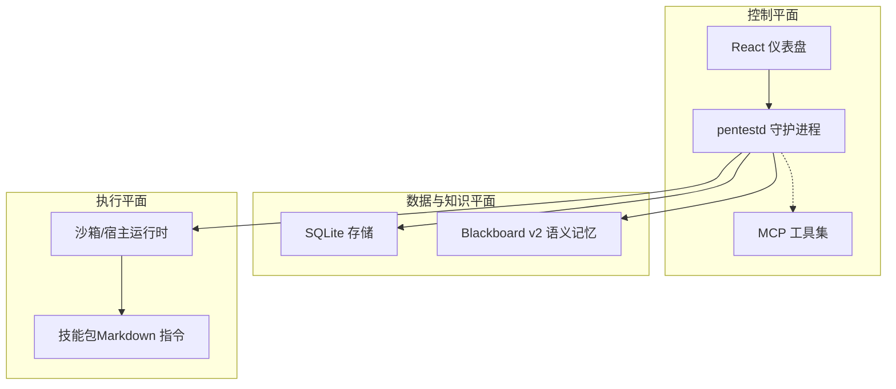
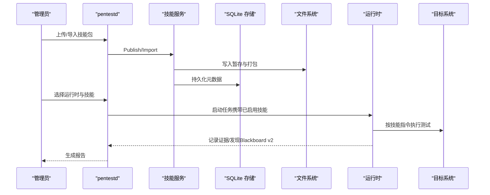
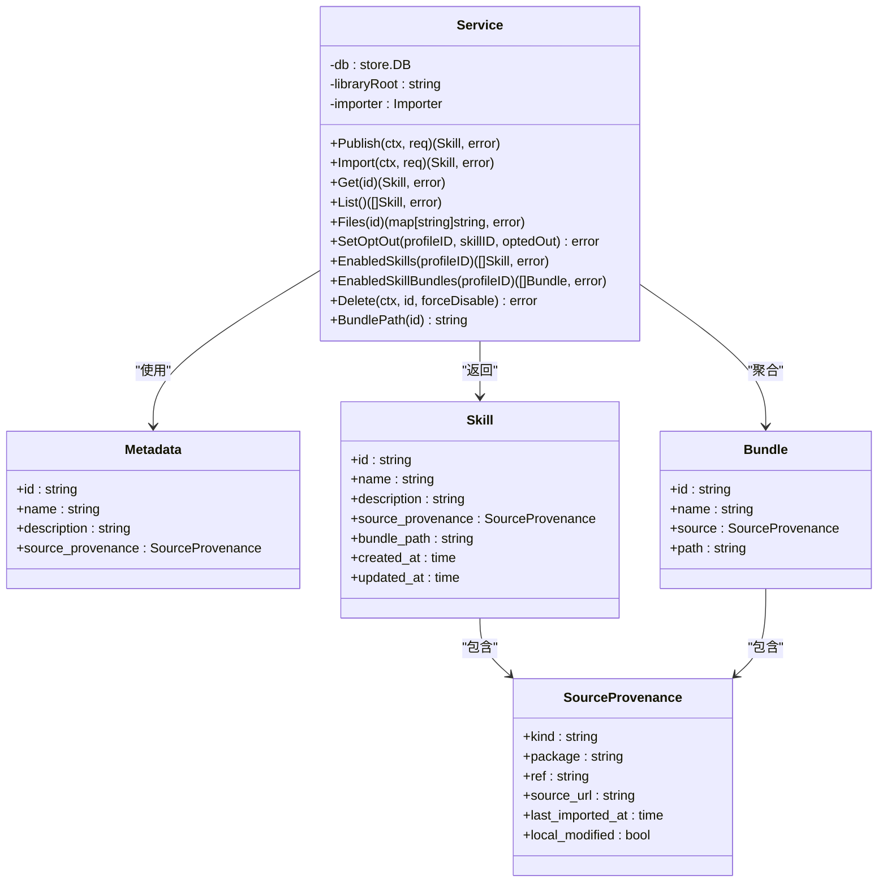
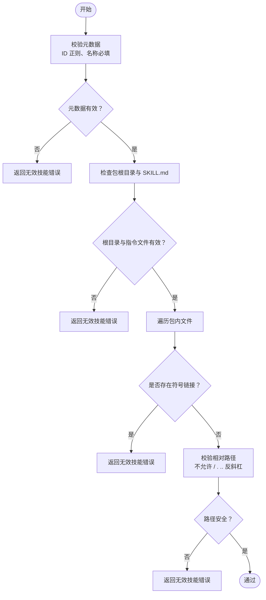
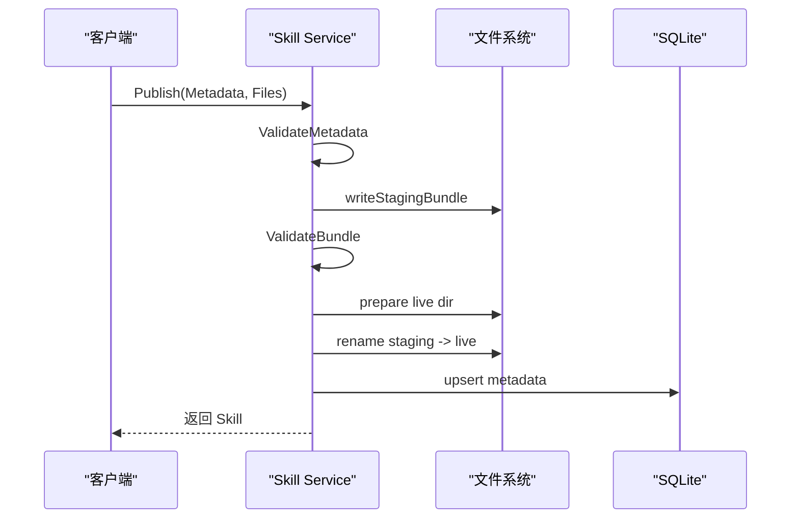
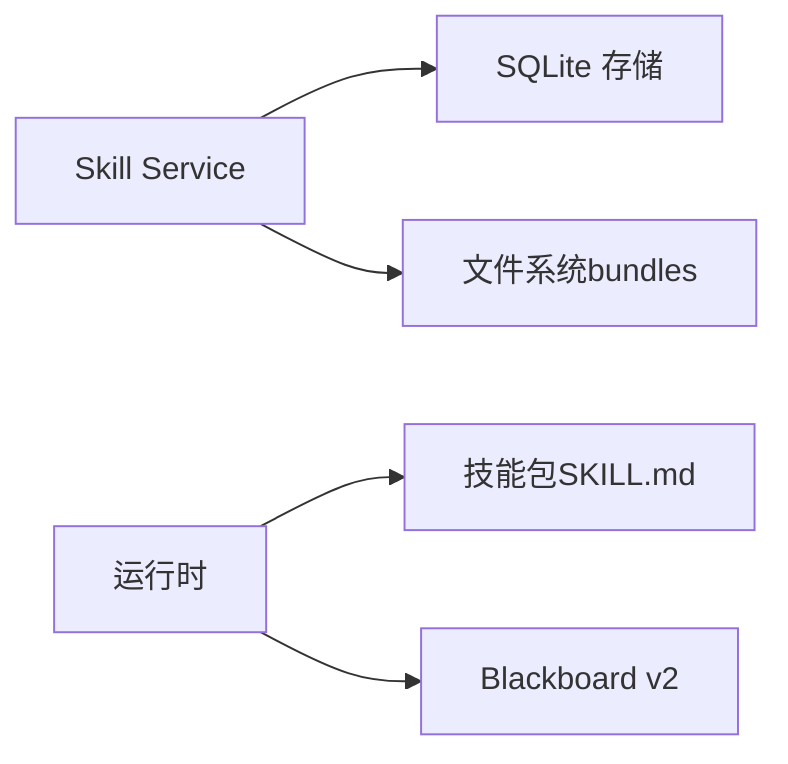

# 技术栈技能包

<cite>
**本文引用的文件**
- [README.md](file://README.md)
- [docker-compose.yaml](file://docker-compose.yaml)
- [internal/skill/service.go](file://internal/skill/service.go)
- [internal/skill/skill.go](file://internal/skill/skill.go)
- [internal/skill/validation.go](file://internal/skill/validation.go)
- [skills/bundles/technologies-firebase-firestore/SKILL.md](file://skills/bundles/technologies-firebase-firestore/SKILL.md)
- [skills/bundles/technologies-supabase/SKILL.md](file://skills/bundles/technologies-supabase/SKILL.md)
</cite>

## 目录
1. [引言](#引言)
2. [项目结构](#项目结构)
3. [核心组件](#核心组件)
4. [架构总览](#架构总览)
5. [详细组件分析](#详细组件分析)
6. [依赖关系分析](#依赖关系分析)
7. [性能与可扩展性](#性能与可扩展性)
8. [故障排查指南](#故障排查指南)
9. [结论](#结论)
10. [附录：技术特定测试方法与最佳实践](#附录技术特定测试方法与最佳实践)

## 引言
本文件聚焦于“技术栈技能包”在 CyberPenda 中的设计与落地，围绕 Firebase Firestore、Supabase 等现代数据库与服务的安全测试能力展开。文档将说明技能包的加载、发布、校验与启用机制，并给出针对各技术栈的常见配置错误、权限模型、安全特性与最佳实践，以及可操作的测试场景与风险评估方法。

## 项目结构
CyberPenda 采用本地优先架构：Go 守护进程提供 HTTP API、MCP 工具与嵌入式 UI；React 仪表盘用于项目管理、任务编排与结果展示；沙箱运行时隔离执行环境；Skills 为运行时无感知的技能包集合，以 Markdown 指令形式驱动自动化测试流程。

图表来源
- [README.md:11-24](file://README.md#L11-L24)

章节来源
- [README.md:11-24](file://README.md#L11-L24)

## 核心组件
- 技能服务（Skill Service）：负责技能包的导入、发布、元数据管理、文件读取、启用/禁用与删除，确保包内容安全与一致性。
- 技能包（Bundle）：以 Markdown 指令为核心的技术特定测试方法论，包含攻击面、架构、高价值目标、测试步骤、工具链与验证要求。
- 运行时集成：通过运行时插件与扩展包，将技能包注入到受控的执行环境中，由代理按指令执行具体测试动作。

章节来源
- [internal/skill/service.go:40-113](file://internal/skill/service.go#L40-L113)
- [internal/skill/skill.go:9-40](file://internal/skill/skill.go#L9-L40)

## 架构总览
技能包作为“运行时无感知”的知识载体，被 Skill Service 持久化与分发；运行时在执行阶段按需加载对应技能的指令，结合 Blackboard v2 记录证据与发现，最终生成报告。

图表来源
- [internal/skill/service.go:57-113](file://internal/skill/service.go#L57-L113)
- [README.md:82-91](file://README.md#L82-L91)

## 详细组件分析

### 技能服务（Skill Service）
职责与边界
- 发布（Publish）：校验元数据与包结构，原子替换 live 目录，回滚失败变更，更新元数据。
- 导入（Import）：通过 Importer 接口拉取外部资源，合并来源信息后调用 Publish。
- 列表与获取（List/Get）：从 SQLite 查询元数据，返回基础信息与时间戳。
- 文件访问（Files）：遍历 bundle 目录，拒绝符号链接与路径穿越，返回相对路径映射的内容。
- 启用/禁用（SetOptOut/EnabledSkills/EnabledSkillBundles）：基于 profile 维度的 opt-out 表决定生效范围。
- 删除（Delete）：检查是否仍被启用，事务清理 opt-out 与元数据，移除 bundle 目录。

关键实现要点
- 元数据校验：ID 正则、名称必填、来源字段规范化。
- 包结构校验：必须存在 SKILL.md，禁止符号链接，路径相对且不可逃逸根目录。
- 原子发布：先写 staging，再 rename 到 live，失败时回滚备份。
- 安全限制：Files 读取时严格校验相对路径与符号链接。

图表来源
- [internal/skill/service.go:40-113](file://internal/skill/service.go#L40-L113)
- [internal/skill/skill.go:9-40](file://internal/skill/skill.go#L9-L40)

章节来源
- [internal/skill/service.go:57-113](file://internal/skill/service.go#L57-L113)
- [internal/skill/service.go:144-176](file://internal/skill/service.go#L144-L176)
- [internal/skill/service.go:178-216](file://internal/skill/service.go#L178-L216)
- [internal/skill/service.go:218-282](file://internal/skill/service.go#L218-L282)
- [internal/skill/service.go:301-356](file://internal/skill/service.go#L301-L356)
- [internal/skill/skill.go:9-40](file://internal/skill/skill.go#L9-L40)

### 技能包校验与约束
- 元数据校验：ID 符合规范、名称必填。
- 包根校验：必须是目录，必须包含 SKILL.md，且不能是符号链接或目录。
- 路径安全：所有相对路径不得包含空段、`.`、`..`，不得绝对路径或反斜杠。
- 文件遍历：禁止符号链接，防止绕过目录隔离。

图表来源
- [internal/skill/validation.go:13-21](file://internal/skill/validation.go#L13-L21)
- [internal/skill/validation.go:23-65](file://internal/skill/validation.go#L23-L65)
- [internal/skill/validation.go:67-78](file://internal/skill/validation.go#L67-L78)

章节来源
- [internal/skill/validation.go:13-21](file://internal/skill/validation.go#L13-L21)
- [internal/skill/validation.go:23-65](file://internal/skill/validation.go#L23-L65)
- [internal/skill/validation.go:67-78](file://internal/skill/validation.go#L67-L78)

### 技能包生命周期（发布与导入）
- 发布流程：校验 → 写入暂存 → 校验包 → 准备 live 目录 → 重命名 staging 到 live → 更新元数据 → 清理备份。
- 导入流程：调用 Importer 拉取资源 → 填充来源信息 → 调用 Publish。

图表来源
- [internal/skill/service.go:57-113](file://internal/skill/service.go#L57-L113)
- [internal/skill/service.go:362-380](file://internal/skill/service.go#L362-L380)
- [internal/skill/service.go:382-403](file://internal/skill/service.go#L382-L403)

章节来源
- [internal/skill/service.go:57-113](file://internal/skill/service.go#L57-L113)
- [internal/skill/service.go:115-142](file://internal/skill/service.go#L115-L142)

## 依赖关系分析
- 技能服务依赖 SQLite 存储进行元数据持久化与 opt-out 管理。
- 技能包以 Markdown 指令驱动运行时执行，不直接耦合后端逻辑。
- 运行时根据启用的技能包加载相应指令，结合 Blackboard v2 记录证据与发现。

图表来源
- [internal/skill/service.go:144-176](file://internal/skill/service.go#L144-L176)
- [internal/skill/service.go:218-282](file://internal/skill/service.go#L218-L282)
- [README.md:82-91](file://README.md#L82-L91)

章节来源
- [internal/skill/service.go:144-176](file://internal/skill/service.go#L144-L176)
- [internal/skill/service.go:218-282](file://internal/skill/service.go#L218-L282)
- [README.md:82-91](file://README.md#L82-L91)

## 性能与可扩展性
- 发布与导入：采用暂存目录与原子重命名，避免并发读写导致的不一致；批量文件写入前进行路径与安全校验，减少 I/O 失败重试。
- 列表与读取：仅读取元数据与必要字段，Files 接口按需遍历 bundle 目录，适合中小规模技能库。
- 可扩展点：Importer 接口支持外部源导入；opt-out 表支持按 profile 维度精细控制启用范围。

[本节为通用指导，无需引用具体文件]

## 故障排查指南
- 发布失败：检查元数据是否符合 ID 与名称规则；确认 SKILL.md 存在且非符号链接；查看暂存目录写入权限。
- 文件读取异常：确认 bundle 目录未被破坏；检查相对路径是否包含非法字符或逃逸片段；确认无符号链接。
- 删除失败：若技能仍被启用，需先禁用或删除 opt-out 记录；检查数据库事务与文件系统权限。
- 导入失败：确认 Importer 配置正确；核对来源 URL 与 Ref 有效性；检查网络与鉴权。

章节来源
- [internal/skill/validation.go:13-21](file://internal/skill/validation.go#L13-L21)
- [internal/skill/validation.go:23-65](file://internal/skill/validation.go#L23-L65)
- [internal/skill/service.go:301-356](file://internal/skill/service.go#L301-L356)

## 结论
技能包体系将技术特定的安全测试方法论以 Markdown 指令的形式标准化，并通过严格的元数据与包结构校验保障安全性与一致性。Firebase Firestore 与 Supabase 的技能包覆盖了各自的关键攻击面、常见配置错误与测试方法，配合运行时与 Blackboard v2，形成端到端的安全测试闭环。

[本节为总结，无需引用具体文件]

## 附录：技术特定测试方法与最佳实践

### Firebase Firestore 技能包
- 攻击面
  - 数据存储：Firestore（文档/集合、规则、REST/SDK）、Realtime Database（JSON 树、规则）、Cloud Storage（规则、签名 URL）。
  - 认证：Auth ID Token、自定义声明、匿名/登录提供者、App Check 证明及其局限。
  - 服务端：Cloud Functions（onCall/onRequest、触发器）、Admin SDK（绕过规则）。
  - 基础设施：Hosting 重写、CDN/缓存、CORS。
- 高价值目标
  - 含敏感数据的 Firestore 集合、Realtime Database 高层节点、私有 Cloud Storage 桶、特权授予函数、导出/报表函数。
- 关键漏洞与测试要点
  - Firestore 规则：避免宽泛的 `auth != null`；强制字段白名单与所有权校验；跨租户隔离；REST vs SDK 行为差异。
  - Realtime Database：根节点与高层节点规则宽松导致的整树泄露；尝试写入特权节点。
  - Cloud Storage：公开桶、长 TTL 签名 URL 重用、枚举对象键、Content-Type 与 Content-Disposition 控制。
  - Cloud Functions：onCall 自动上下文 vs onRequest 手动验证；CORS 与 SSRF；触发器越权。
  - Auth & Token：iss/aud/签名/过期校验；App Check 不是授权替代；多租户绑定应来自服务端上下文。
- 测试方法论
  - 提取项目配置 → 收集不同主体令牌 → 构建资源×动作×主体矩阵 → SDK vs REST 对比 → 种子 ID 收集 → 跨主体交叉测试。
- 工具链
  - httpie/curl + jq、Firebase Emulator、Rules Playground、JWT 校验工具。
- 验证要求
  - 所有者与非所有者请求的差异；Storage 越权读写；Functions 接受伪造身份；最小可复现请求与角色上下文。

章节来源
- [skills/bundles/technologies-firebase-firestore/SKILL.md:10-48](file://skills/bundles/technologies-firebase-firestore/SKILL.md#L10-L48)
- [skills/bundles/technologies-firebase-firestore/SKILL.md:70-104](file://skills/bundles/technologies-firebase-firestore/SKILL.md#L70-L104)
- [skills/bundles/technologies-firebase-firestore/SKILL.md:106-125](file://skills/bundles/technologies-firebase-firestore/SKILL.md#L106-L125)
- [skills/bundles/technologies-firebase-firestore/SKILL.md:126-140](file://skills/bundles/technologies-firebase-firestore/SKILL.md#L126-L140)
- [skills/bundles/technologies-firebase-firestore/SKILL.md:141-156](file://skills/bundles/technologies-firebase-firestore/SKILL.md#L141-L156)
- [skills/bundles/technologies-firebase-firestore/SKILL.md:157-168](file://skills/bundles/technologies-firebase-firestore/SKILL.md#L157-L168)
- [skills/bundles/technologies-firebase-firestore/SKILL.md:169-176](file://skills/bundles/technologies-firebase-firestore/SKILL.md#L169-L176)
- [skills/bundles/technologies-firebase-firestore/SKILL.md:177-189](file://skills/bundles/technologies-firebase-firestore/SKILL.md#L177-L189)
- [skills/bundles/technologies-firebase-firestore/SKILL.md:190-212](file://skills/bundles/technologies-firebase-firestore/SKILL.md#L190-L212)

### Supabase 技能包
- 攻击面
  - 数据访问：PostgREST（CRUD、过滤器、嵌入、RPC）、GraphQL（pg_graphql 与 RLS 交互）、Realtime（订阅、广播/存在通道）。
  - 存储：桶、对象、签名 URL、公开/私有策略。
  - 认证：GoTrue（JWT、Cookie/会话、魔法链接、OAuth）。
  - 服务端：Edge Functions（Deno）调用 Supabase 并使用密钥。
- 高价值目标
  - 含敏感数据的表、RPC 函数（SECURITY DEFINER）、私有存储桶、带 service_role 的 Edge Functions、导出/报表端点、管理员路由。
- 关键漏洞与测试要点
  - Row Level Security（RLS）：缺失或全放行策略；UPDATE/DELETE/INSERT 未覆盖；缺少租户约束；复杂连接推断泄露。
  - PostgREST & REST：过滤器滥用、嵌入 overfetch、Prefer 头暴露计数、IDOR 模式、Mass Assignment。
  - RPC 函数：SECURITY DEFINER 越权、search_path 不安全、信任客户端 user_id/tenant_id。
  - Storage：公开桶、枚举前缀、签名 URL 跨租户重用、Content-Type 滥用、路径混淆。
  - Realtime：频道名泄露、跨房间加入/发布无鉴权。
  - GraphQL：Schema 内省、嵌套 overfetch、全局 Node ID 复用。
  - Auth & Tokens：issuer/audience/过期/签名/租户上下文；localStorage 泄露；apikey 误用；service_role 泄露；Refresh Token 管理。
  - Edge Functions：信任 Authorization/apikey 头而不校验 JWT；CORS 与反射；SSRF；错误日志泄露密钥。
- 测试方法论
  - 盘点表面 → 收集主体令牌 → 构建矩阵 → REST vs GraphQL 对比 → 种子 ID 收集 → 跨主体交叉测试。
- 工具链
  - PostgREST 探测、GraphQL 探查、Realtime 自定义 ws 客户端、Storage 枚举脚本、JWT 校验工具、策略差异对比。
- 验证要求
  - 所有者与非所有者请求差异；Mis-scoped RPC 或 Storage 签名 URL 跨用户可用；Realtime/GraphQL 暴露与策略缺失匹配；最小可复现请求与角色上下文。

章节来源
- [skills/bundles/technologies-supabase/SKILL.md:10-55](file://skills/bundles/technologies-supabase/SKILL.md#L10-L55)
- [skills/bundles/technologies-supabase/SKILL.md:75-101](file://skills/bundles/technologies-supabase/SKILL.md#L75-L101)
- [skills/bundles/technologies-supabase/SKILL.md:102-124](file://skills/bundles/technologies-supabase/SKILL.md#L102-L124)
- [skills/bundles/technologies-supabase/SKILL.md:125-143](file://skills/bundles/technologies-supabase/SKILL.md#L125-L143)
- [skills/bundles/technologies-supabase/SKILL.md:144-167](file://skills/bundles/technologies-supabase/SKILL.md#L144-L167)
- [skills/bundles/technologies-supabase/SKILL.md:168-179](file://skills/bundles/technologies-supabase/SKILL.md#L168-L179)
- [skills/bundles/technologies-supabase/SKILL.md:180-192](file://skills/bundles/technologies-supabase/SKILL.md#L180-L192)
- [skills/bundles/technologies-supabase/SKILL.md:193-209](file://skills/bundles/technologies-supabase/SKILL.md#L193-L209)
- [skills/bundles/technologies-supabase/SKILL.md:210-223](file://skills/bundles/technologies-supabase/SKILL.md#L210-L223)
- [skills/bundles/technologies-supabase/SKILL.md:224-231](file://skills/bundles/technologies-supabase/SKILL.md#L224-L231)
- [skills/bundles/technologies-supabase/SKILL.md:232-244](file://skills/bundles/technologies-supabase/SKILL.md#L232-L244)
- [skills/bundles/technologies-supabase/SKILL.md:245-269](file://skills/bundles/technologies-supabase/SKILL.md#L245-L269)

### 部署与运行注意事项
- 默认监听地址与端口：127.0.0.1:8787；可通过环境变量覆盖。
- 认证：当绑定非回环地址时需设置 PENTEST_AUTH_TOKEN；API/MCP 路由支持 Bearer token 或 query token。
- Docker Compose：挂载 Docker socket以允许守护进程创建沙箱容器；健康检查与卷挂载确保数据持久化。

章节来源
- [README.md:110-126](file://README.md#L110-L126)
- [docker-compose.yaml:1-34](file://docker-compose.yaml#L1-L34)