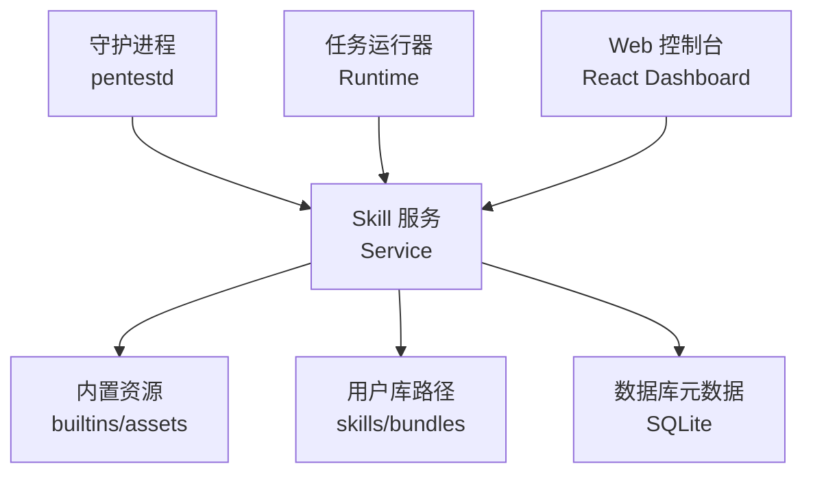
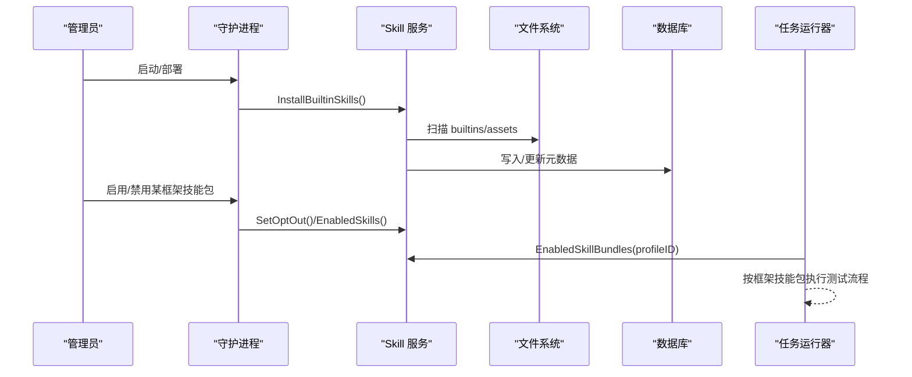
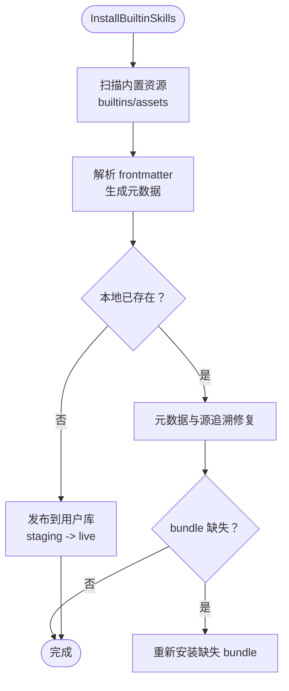
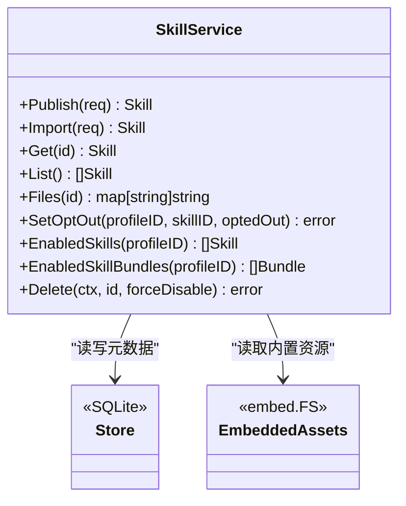

# 框架类技能包

<cite>
**本文引用的文件**
- [README.md](file://README.md)
- [frameworks-nextjs/SKILL.md](file://skills/bundles/frameworks-nextjs/SKILL.md)
- [frameworks-fastapi/SKILL.md](file://skills/bundles/frameworks-fastapi/SKILL.md)
- [frameworks-nestjs/SKILL.md](file://skills/bundles/frameworks-nestjs/SKILL.md)
- [service.go](file://internal/skill/service.go)
- [builtin.go](file://internal/skill/builtin.go)
- [skill.go](file://internal/skill/skill.go)
</cite>

## 目录
1. [简介](#简介)
2. [项目结构](#项目结构)
3. [核心组件](#核心组件)
4. [架构总览](#架构总览)
5. [详细组件分析](#详细组件分析)
6. [依赖关系分析](#依赖关系分析)
7. [性能与可维护性考量](#性能与可维护性考量)
8. [故障排查指南](#故障排查指南)
9. [结论](#结论)
10. [附录：测试策略与验证清单](#附录测试策略与验证清单)

## 简介
本文件聚焦“框架类技能包”，系统化梳理针对特定技术框架的渗透测试方法，覆盖前端框架 Next.js、后端框架 FastAPI 与 NestJS。文档基于仓库内内置技能包内容，提炼每个框架特有的安全测试点、常见漏洞模式、测试策略与结果验证要求，并给出配置要点与用例组织建议，帮助使用者在受控环境中高效开展授权测试。

## 项目结构
CyberPenda 将“技能包”以 Markdown 规范（SKILL.md）形式打包为 bundle，由守护进程在安装时嵌入并管理。框架类技能包位于 skills/bundles 下，分别对应 nextjs、fastapi、nestjs。运行时通过 Skill Service 加载、发布、启用/禁用这些 bundle，并在任务执行中作为知识指导与流程约束。

图表来源
- [README.md:11-24](file://README.md#L11-L24)
- [service.go:40-55](file://internal/skill/service.go#L40-L55)
- [builtin.go:25-28](file://internal/skill/builtin.go#L25-L28)

章节来源
- [README.md:11-24](file://README.md#L11-L24)
- [service.go:40-55](file://internal/skill/service.go#L40-L55)
- [builtin.go:25-28](file://internal/skill/builtin.go#L25-L28)

## 核心组件
- 技能包定义与元数据
  - 每个框架技能包以 SKILL.md 为入口，包含 frontmatter 元信息（name、description），正文提供攻击面、高价值目标、关键漏洞、绕过技巧、测试方法与验证要求等结构化内容。
- 技能服务（Skill Service）
  - 负责技能的导入、发布、校验、启用/禁用、删除、文件读取与路径解析；支持从内置资源安装默认技能包，并维护与运行时的关联。
- 内置技能包安装与迁移
  - 启动时将内置 assets 中的 bundle 安装到用户库，处理历史 ID 迁移、废弃清理与缺失修复，确保一致性。

章节来源
- [skill.go:9-46](file://internal/skill/skill.go#L9-L46)
- [service.go:57-113](file://internal/skill/service.go#L57-L113)
- [builtin.go:66-103](file://internal/skill/builtin.go#L66-L103)

## 架构总览
框架类技能包在系统中的角色：
- 知识载体：以 Markdown 描述框架特定的测试要点与验证标准。
- 运行时驱动：任务执行时，运行器根据启用的技能包选择测试策略与检查项。
- 生命周期管理：通过 Skill Service 完成安装、更新、启用/禁用与删除。

图表来源
- [builtin.go:66-103](file://internal/skill/builtin.go#L66-L103)
- [service.go:218-282](file://internal/skill/service.go#L218-L282)
- [service.go:284-299](file://internal/skill/service.go#L284-L299)

## 详细组件分析

### Next.js 框架技能包
- 攻击面与高价值目标
  - App Router 与 Pages Router 共存、Route Handlers、Middleware、Edge vs Node 运行时差异、RSC 与缓存边界、Server Actions、NextAuth 回调与鉴权漂移、Image Optimizer SSRF、__NEXT_DATA__ 过度暴露、Draft/Preview 模式。
- 关键漏洞模式
  - Middleware 绕过（路径规范化、参数污染、子请求头）、Server Actions 鉴权假设、RSC/ISR 缓存越界、NextAuth 配置缺陷、跨运行时不一致、客户端 XSS 与 Hydration 不匹配。
- 测试策略
  - 枚举构建产物与源映射、构造 Edge/Node 矩阵、角色矩阵（未认证/用户/管理员）、缓存探测、中间件路径变体与头部操纵、跨路由鉴权对比。
- 验证要求
  - 跨用户/租户访问证据、缓存边界失败证明、Server Actions 越权调用、中间件绕过显式响应差异、运行时一致性检查、泄露字段不在 DOM 且跨用户不可见。

章节来源
- [frameworks-nextjs/SKILL.md:1-229](file://skills/bundles/frameworks-nextjs/SKILL.md#L1-L229)

### FastAPI 框架技能包
- 攻击面与高价值目标
  - ASGI 中间件、Router 与子应用挂载、依赖注入（Depends/Security/OAuth2PasswordBearer/HTTPBearer）、Pydantic v1/v2、文件上传/下载、WebSocket、后台任务、OpenAPI 暴露。
- 关键漏洞模式
  - 依赖注入缺口（仅 token 存在不等于鉴权）、JWT 误用（算法混淆、kid 注入、缺少 issuer/audience）、Session 弱密钥、CORS/CSRF 配置不当、ProxyHeaders/TrustedHost 滥用、Jinja2 模板注入、SSRF、文件上传路径穿越、WebSocket 鉴权缺失、子应用绕过全局中间件。
- 测试策略
  - OpenAPI 挖掘与隐藏端点模糊测试、依赖链分析、多通道（HTTP/WebSocket）一致性、内容类型切换、参数大小写与重复、上游代理行为差异。
- 验证要求
  - 跨通道与跨租户访问证据、Header/Host/CORS 操纵影响、最小化模板注入/SSRF/Token 误用载荷、明确缺失鉴权的依赖路径。

章节来源
- [frameworks-fastapi/SKILL.md:1-192](file://skills/bundles/frameworks-fastapi/SKILL.md#L1-L192)

### NestJS 框架技能包
- 攻击面与高价值目标
  - 装饰器管线（Guards/Pipes/Interceptors/Filters/Metadata）、模块系统（动态模块/全局模块/DI 作用域）、控制器与多传输（REST/GraphQL/WebSocket/Microservices）、ORM（TypeORM/Prisma/Mongoose）、Passport/JWT、Throttler、Swagger/OpenAPI。
- 关键漏洞模式
  - Guard 跳过（装饰器栈缺口、上下文切换、Reflector 键名不一致）、ValidationPipe 白名单与嵌套对象校验缺失、类型转换副作用、JWT 策略与安全配置问题、序列化泄漏（ClassSerializerInterceptor 缺失）、拦截器缓存毒化、模块边界泄漏、WebSocket 鉴权延迟、微服务传输无鉴权、ORM 注入（QueryBuilder/$queryRaw 等）。
- 测试策略
  - Swagger 发现与装饰器审计、多传输矩阵（HTTP/WS/微服务）、验证管道压力测试（额外字段/错误类型/数组元素）、模块边界与配置注入检查、序列化输出比对。
- 验证要求
  - Guard 绕过点定位、验证绕过对业务逻辑的影响、跨传输不一致、模块边界越权、序列化泄露字段、IDOR、ORM 注入证据、缓存毒化复现。

章节来源
- [frameworks-nestjs/SKILL.md:1-226](file://skills/bundles/frameworks-nestjs/SKILL.md#L1-L226)

### 技能包管理与安装流程（代码级）
- 内置资源扫描与安装
  - 启动时扫描内置 assets，解析 frontmatter 生成元数据，若本地不存在则发布至用户库；已存在的内置技能进行元数据与源追溯修复，并修复缺失 bundle。
- 发布与回滚
  - 发布流程先写入 staging，校验通过后原子替换 live 目录，失败则回滚备份，保证可用性。
- 启用/禁用与列表
  - 通过 opt-out 表控制 profile 维度启用状态；提供按 profile 查询已启用技能与 bundle 列表。
- 删除保护
  - 若仍有 profile 启用该技能，禁止删除（除非强制禁用）。

图表来源
- [builtin.go:66-103](file://internal/skill/builtin.go#L66-L103)
- [builtin.go:222-234](file://internal/skill/builtin.go#L222-L234)
- [service.go:57-113](file://internal/skill/service.go#L57-L113)

章节来源
- [builtin.go:66-103](file://internal/skill/builtin.go#L66-L103)
- [service.go:57-113](file://internal/skill/service.go#L57-L113)
- [service.go:218-282](file://internal/skill/service.go#L218-L282)
- [service.go:301-356](file://internal/skill/service.go#L301-L356)

## 依赖关系分析
- 组件耦合
  - Skill Service 依赖 Store（SQLite）与文件系统；内置安装依赖 embed.FS 提供的内置资源。
- 外部依赖
  - 无网络依赖；通过 Docker/Podman 隔离运行任务，技能包本身为纯文本与脚本集合。
- 潜在循环
  - 当前实现为单向依赖：Service 读/写元数据与文件，无反向引用。

图表来源
- [service.go:40-55](file://internal/skill/service.go#L40-L55)
- [builtin.go:22-28](file://internal/skill/builtin.go#L22-L28)

章节来源
- [service.go:40-55](file://internal/skill/service.go#L40-L55)
- [builtin.go:22-28](file://internal/skill/builtin.go#L22-L28)

## 性能与可维护性考量
- 性能
  - 内置安装仅在启动阶段执行，使用内存 FS 扫描与批量写入，避免频繁磁盘 I/O。
  - 发布采用 staging 目录与原子替换，减少并发冲突与回滚成本。
- 可维护性
  - 以 Markdown 为中心的技能包易于审阅与版本化管理；frontmatter 标准化元数据便于 UI 展示与筛选。
  - 内置迁移与修复机制保障升级平滑，避免用户定制被覆盖。

[本节为通用指导，无需具体文件分析]

## 故障排查指南
- 技能包缺失或无法读取
  - 检查 bundle 路径是否存在、是否包含 SKILL.md；确认 Files() 返回 ErrNotFound 时，尝试 repairMissingBuiltinBundle。
- 发布失败
  - 查看 staging 目录写入权限与 ValidateBundle 校验错误；确认 live 目录创建与重命名操作是否成功。
- 删除被拒绝
  - 若仍有 profile 启用该技能，需先禁用或删除 opt-out 记录后再删除。
- 内置技能元数据不一致
  - 使用 sanitizeBuiltinSkill 修复 name/description/source_provenance，并移除过时 UPSTREAM.md。

章节来源
- [service.go:178-216](file://internal/skill/service.go#L178-L216)
- [service.go:301-356](file://internal/skill/service.go#L301-L356)
- [builtin.go:222-234](file://internal/skill/builtin.go#L222-L234)
- [builtin.go:236-254](file://internal/skill/builtin.go#L236-L254)

## 结论
框架类技能包为 CyberPenda 提供了面向 Next.js、FastAPI、NestJS 的结构化渗透测试知识体系。结合 Skill Service 的安装、发布与启用机制，可在受控沙箱中自动化执行框架专属的安全测试流程，并以明确的验证要求产出高质量证据。建议在团队内建立统一的技能包评审与更新流程，持续完善各框架的测试策略与验证清单。

[本节为总结，无需具体文件分析]

## 附录：测试策略与验证清单

### Next.js 测试策略与验证要点
- 策略
  - 构建产物与源映射枚举、Edge/Node 双运行时矩阵、Server Actions 越权、RSC/ISR 缓存越界、中间件路径与头部绕过、NextAuth 回调与鉴权漂移、__NEXT_DATA__ 泄露、Image Optimizer SSRF。
- 验证
  - 跨用户/租户访问、缓存边界失败、Server Actions 越权调用、中间件绕过差异、运行时一致性、泄露字段不在 DOM 且不可跨用户获取。

章节来源
- [frameworks-nextjs/SKILL.md:1-229](file://skills/bundles/frameworks-nextjs/SKILL.md#L1-L229)

### FastAPI 测试策略与验证要点
- 策略
  - OpenAPI 挖掘与隐藏端点模糊、依赖注入链路分析、多通道一致性、内容类型切换、参数大小写与重复、上游代理行为差异、Jinja2 模板注入、SSRF、文件上传穿越、WebSocket 鉴权。
- 验证
  - 跨通道与跨租户访问、Header/Host/CORS 操纵影响、最小化载荷与 OAST 证据、缺失鉴权依赖路径定位。

章节来源
- [frameworks-fastapi/SKILL.md:1-192](file://skills/bundles/frameworks-fastapi/SKILL.md#L1-L192)

### NestJS 测试策略与验证要点
- 策略
  - Swagger 发现与装饰器审计、Guard 跳过与上下文切换、ValidationPipe 白名单与嵌套对象校验、类型转换副作用、JWT 策略与安全配置、序列化泄漏、拦截器缓存毒化、模块边界泄漏、WebSocket 鉴权延迟、微服务传输无鉴权、ORM 注入。
- 验证
  - Guard 绕过点定位、验证绕过对业务逻辑影响、跨传输不一致、模块边界越权、序列化泄露字段、IDOR、ORM 注入证据、缓存毒化复现。

章节来源
- [frameworks-nestjs/SKILL.md:1-226](file://skills/bundles/frameworks-nestjs/SKILL.md#L1-L226)