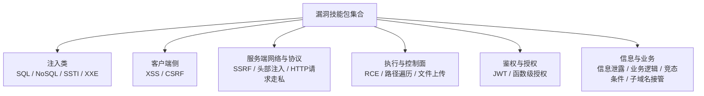
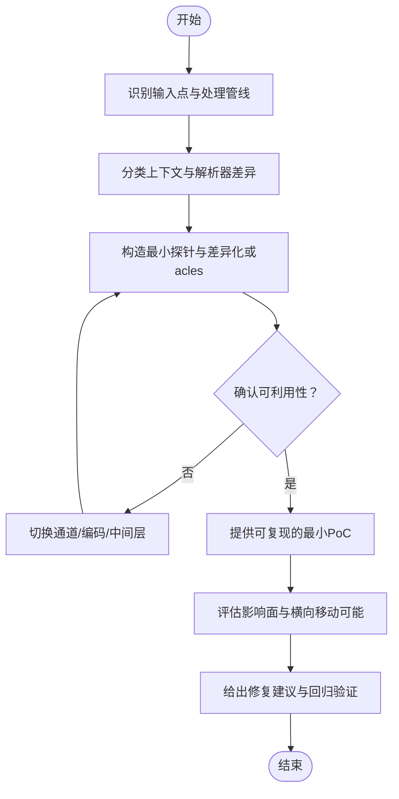

# 漏洞类型技能包

<cite>
**本文引用的文件**
- [vulnerabilities-sql-injection/SKILL.md](file://internal/skill/builtins/assets/vulnerabilities-sql-injection/SKILL.md)
- [vulnerabilities-nosql-injection/SKILL.md](file://internal/skill/builtins/assets/vulnerabilities-nosql-injection/SKILL.md)
- [vulnerabilities-ssti/SKILL.md](file://internal/skill/builtins/assets/vulnerabilities-ssti/SKILL.md)
- [vulnerabilities-xxe/SKILL.md](file://internal/skill/builtins/assets/vulnerabilities-xxe/SKILL.md)
- [vulnerabilities-xss/SKILL.md](file://internal/skill/builtins/assets/vulnerabilities-xss/SKILL.md)
- [vulnerabilities-csrf/SKILL.md](file://internal/skill/builtins/assets/vulnerabilities-csrf/SKILL.md)
- [vulnerabilities-ssrf/SKILL.md](file://internal/skill/builtins/assets/vulnerabilities-ssrf/SKILL.md)
- [vulnerabilities-rce/SKILL.md](file://internal/skill/builtins/assets/vulnerabilities-rce/SKILL.md)
- [vulnerabilities-authentication-jwt/SKILL.md](file://internal/skill/builtins/assets/vulnerabilities-authentication-jwt/SKILL.md)
- [vulnerabilities-broken-function-level-authorization/SKILL.md](file://internal/skill/builtins/assets/vulnerabilities-broken-function-level-authorization/SKILL.md)
- [vulnerabilities-path-traversal-lfi-rfi/SKILL.md](file://internal/skill/builtins/assets/vulnerabilities-path-traversal-lfi-rfi/SKILL.md)
- [vulnerabilities-insecure-file-uploads/SKILL.md](file://internal/skill/builtins/assets/vulnerabilities-insecure-file-uploads/SKILL.md)
- [vulnerabilities-information-disclosure/SKILL.md](file://internal/skill/builtins/assets/vulnerabilities-information-disclosure/SKILL.md)
- [vulnerabilities-open-redirect/SKILL.md](file://internal/skill/builtins/assets/vulnerabilities-open-redirect/SKILL.md)
- [vulnerabilities-header-injection/SKILL.md](file://internal/skill/builtins/assets/vulnerabilities-header-injection/SKILL.md)
- [vulnerabilities-http-request-smuggling/SKILL.md](file://internal/skill/builtins/assets/vulnerabilities-http-request-smuggling/SKILL.md)
- [vulnerabilities-business-logic/SKILL.md](file://internal/skill/builtins/assets/vulnerabilities-business-logic/SKILL.md)
- [vulnerabilities-race-conditions/SKILL.md](file://internal/skill/builtins/assets/vulnerabilities-race-conditions/SKILL.md)
- [vulnerabilities-subdomain-takeover/SKILL.md](file://internal/skill/builtins/assets/vulnerabilities-subdomain-takeover/SKILL.md)
</cite>

## 目录
1. [简介](#简介)
2. [项目结构](#项目结构)
3. [核心组件](#核心组件)
4. [架构总览](#架构总览)
5. [详细组件分析](#详细组件分析)
6. [依赖关系分析](#依赖关系分析)
7. [性能与效率考量](#性能与效率考量)
8. [故障排查指南](#故障排查指南)
9. [结论](#结论)
10. [附录](#附录)

## 简介
本文件系统化梳理“漏洞类型技能包”，覆盖注入类（SQL、NoSQL、SSTI、XXE）、跨站脚本（XSS）、跨站请求伪造（CSRF）、服务器端请求伪造（SSRF）、远程代码执行（RCE）、身份认证绕过（JWT/函数级授权）、路径遍历、文件上传、信息泄露、开放重定向、头部注入、HTTP请求走私、业务逻辑漏洞、竞态条件、子域名接管等。每个技能包均包含检测方法、利用技巧、验证步骤与修复建议，帮助渗透测试人员快速定位、验证并闭环修复问题。

## 项目结构
本项目将各漏洞类型的测试方法沉淀为“技能包”文档，位于内置资产目录中，便于在任务编排、自动化扫描与人工复现时按需调用。每个技能包以统一的 SKILL.md 形式组织，涵盖攻击面、探测通道、关键漏洞、绕过技术、测试方法论、验证标准、误报识别、影响评估与实战技巧。

[本节不直接分析具体源文件，故无“章节来源”]

## 核心组件
- 注入类：SQLi、NoSQLi、SSTI、XXE
- 客户端侧：XSS、CSRF
- 服务端网络与协议：SSRF、头部注入、HTTP请求走私
- 执行与控制面：RCE、路径遍历/LFI/RFI、文件上传
- 鉴权与授权：JWT/OIDC、函数级授权（BFLA）
- 信息与业务：信息泄露、业务逻辑、竞态条件、子域名接管

上述分类对应仓库中的独立技能包，便于按目标系统特征组合使用。

**章节来源**
- [vulnerabilities-sql-injection/SKILL.md:1-191](file://internal/skill/builtins/assets/vulnerabilities-sql-injection/SKILL.md#L1-L191)
- [vulnerabilities-nosql-injection/SKILL.md:1-289](file://internal/skill/builtins/assets/vulnerabilities-nosql-injection/SKILL.md#L1-L289)
- [vulnerabilities-ssti/SKILL.md:1-271](file://internal/skill/builtins/assets/vulnerabilities-ssti/SKILL.md#L1-L271)
- [vulnerabilities-xxe/SKILL.md:1-224](file://internal/skill/builtins/assets/vulnerabilities-xxe/SKILL.md#L1-L224)
- [vulnerabilities-xss/SKILL.md:1-207](file://internal/skill/builtins/assets/vulnerabilities-xss/SKILL.md#L1-L207)
- [vulnerabilities-csrf/SKILL.md:1-199](file://internal/skill/builtins/assets/vulnerabilities-csrf/SKILL.md#L1-L199)
- [vulnerabilities-ssrf/SKILL.md:1-187](file://internal/skill/builtins/assets/vulnerabilities-ssrf/SKILL.md#L1-L187)
- [vulnerabilities-rce/SKILL.md:1-250](file://internal/skill/builtins/assets/vulnerabilities-rce/SKILL.md#L1-L250)
- [vulnerabilities-authentication-jwt/SKILL.md:1-167](file://internal/skill/builtins/assets/vulnerabilities-authentication-jwt/SKILL.md#L1-L167)
- [vulnerabilities-broken-function-level-authorization/SKILL.md:1-155](file://internal/skill/builtins/assets/vulnerabilities-broken-function-level-authorization/SKILL.md#L1-L155)
- [vulnerabilities-path-traversal-lfi-rfi/SKILL.md:1-191](file://internal/skill/builtins/assets/vulnerabilities-path-traversal-lfi-rfi/SKILL.md#L1-L191)
- [vulnerabilities-insecure-file-uploads/SKILL.md:1-189](file://internal/skill/builtins/assets/vulnerabilities-insecure-file-uploads/SKILL.md#L1-L189)
- [vulnerabilities-information-disclosure/SKILL.md:1-184](file://internal/skill/builtins/assets/vulnerabilities-information-disclosure/SKILL.md#L1-L184)
- [vulnerabilities-open-redirect/SKILL.md:1-166](file://internal/skill/builtins/assets/vulnerabilities-open-redirect/SKILL.md#L1-L166)
- [vulnerabilities-header-injection/SKILL.md:1-211](file://internal/skill/builtins/assets/vulnerabilities-header-injection/SKILL.md#L1-L211)
- [vulnerabilities-http-request-smuggling/SKILL.md:1-256](file://internal/skill/builtins/assets/vulnerabilities-http-request-smuggling/SKILL.md#L1-L256)
- [vulnerabilities-business-logic/SKILL.md:1-200](file://internal/skill/builtins/assets/vulnerabilities-business-logic/SKILL.md#L1-L200)
- [vulnerabilities-race-conditions/SKILL.md:1-200](file://internal/skill/builtins/assets/vulnerabilities-race-conditions/SKILL.md#L1-L200)
- [vulnerabilities-subdomain-takeover/SKILL.md:1-200](file://internal/skill/builtins/assets/vulnerabilities-subdomain-takeover/SKILL.md#L1-L200)

## 架构总览
从“技能包”到“实际测试流程”的通用工作流如下：

[此图为概念流程图，不映射具体源码，故无“图示来源”]

## 详细组件分析

### 注入类（SQL / NoSQL / SSTI / XXE）
- SQL注入
  - 检测通道：错误型、布尔型、时间型、OOAST；关注ORM/raw片段、JSON/CTE/GIS等新表面
  - 利用技巧：UNION对齐列、盲注位提取、OOAST外带、写权限滥用
  - 验证步骤：稳定oracle + 元数据提取 + 可控修改/读取
  - 修复建议：参数化绑定、避免动态标识符、严格校验与白名单
- NoSQL注入
  - 检测通道：操作符注入（$ne/$gt/$regex）、聚合管道、GraphQL变量直入过滤器
  - 利用技巧：登录绕过、盲取敏感字段、SSJS（$where/$function）
  - 验证步骤：至少两种不同操作符生效、对比正常/注入前后响应
  - 修复建议：严格模式/强类型Schema、禁止原始对象直通查询
- SSTI
  - 检测通道：数学表达式差分、引擎指纹、沙箱逃逸
  - 利用技巧：语言反射链、模板引擎特定gadgets、间接执行（写文件/OAST）
  - 验证步骤：两次不同表达式输出、反射能力、副作用（DNS/睡眠/写文件）
  - 修复建议：仅渲染数据、禁用危险全局、启用安全沙箱策略
- XXE
  - 检测通道：DOCTYPE/外部实体、XInclude/XSLT、OOAST
  - 利用技巧：本地文件读取、SSRF、DoS
  - 验证步骤：最小payload证明解析能力、受控访问与可复现证据
  - 修复建议：禁用DOCTYPE/外部实体、关闭网络访问、统一配置

**章节来源**
- [vulnerabilities-sql-injection/SKILL.md:1-191](file://internal/skill/builtins/assets/vulnerabilities-sql-injection/SKILL.md#L1-L191)
- [vulnerabilities-nosql-injection/SKILL.md:1-289](file://internal/skill/builtins/assets/vulnerabilities-nosql-injection/SKILL.md#L1-L289)
- [vulnerabilities-ssti/SKILL.md:1-271](file://internal/skill/builtins/assets/vulnerabilities-ssti/SKILL.md#L1-L271)
- [vulnerabilities-xxe/SKILL.md:1-224](file://internal/skill/builtins/assets/vulnerabilities-xxe/SKILL.md#L1-L224)

### 客户端侧（XSS / CSRF）
- XSS
  - 检测通道：DOM源→汇映射、上下文分类、框架特性
  - 利用技巧：多上下文polyglot、CSP/Trusted Types绕过、SVG/MathML
  - 验证步骤：最小payload + 浏览器执行证据 + 绕过防护的证明
  - 修复建议：严格上下文编码、CSP/Trusted Types、安全默认值
- CSRF
  - 检测通道：SameSite/CORS/Token/Origin检查、预检绕过
  - 利用技巧：导航型GET、text/plain/form/multipart、方法覆盖
  - 验证步骤：跨源页面触发状态变更、移除控制即失败
  - 修复建议：令牌+Origin校验、严格SameSite、非简单请求强制预检

**章节来源**
- [vulnerabilities-xss/SKILL.md:1-207](file://internal/skill/builtins/assets/vulnerabilities-xss/SKILL.md#L1-L207)
- [vulnerabilities-csrf/SKILL.md:1-199](file://internal/skill/builtins/assets/vulnerabilities-csrf/SKILL.md#L1-L199)

### 服务端网络与协议（SSRF / 头部注入 / HTTP请求走私）
- SSRF
  - 检测通道：OOAST、内部地址族、协议变体、URL混淆
  - 利用技巧：云元数据、Kubelet/Redis/FCGI/Docker、重定向链
  - 验证步骤：出站请求证据、内网可达性与最小影响凭证获取
  - 修复建议：白名单scheme/host/port、禁止重定向或严格校验、统一解析
- 头部注入
  - 检测通道：CR/LF注入、Host/X-Forwarded-*信任、Vary/Cache-Control操纵
  - 利用技巧：缓存投毒、会话固定、请求走私、Open Redirect
  - 验证步骤：跨用户可见的缓存污染、密码重置链接指向攻击者域
  - 修复建议：严格规范化、拒绝非法字符、明确信任边界
- HTTP请求走私
  - 检测通道：CL.TE/TE.CL/H2.CL/H2.TE、时序与差异响应
  - 利用技巧：前端安全控制绕过、跨用户请求捕获、WebSocket劫持
  - 验证步骤：10秒以上延迟、后续请求出现异常响应、唯一标记串
  - 修复建议：端到端HTTP/2、拒绝冲突CL/TE、代理层标准化

**章节来源**
- [vulnerabilities-ssrf/SKILL.md:1-187](file://internal/skill/builtins/assets/vulnerabilities-ssrf/SKILL.md#L1-L187)
- [vulnerabilities-header-injection/SKILL.md:1-211](file://internal/skill/builtins/assets/vulnerabilities-header-injection/SKILL.md#L1-L211)
- [vulnerabilities-http-request-smuggling/SKILL.md:1-256](file://internal/skill/builtins/assets/vulnerabilities-http-request-smuggling/SKILL.md#L1-L256)

### 执行与控制面（RCE / 路径遍历 / 文件上传）
- RCE
  - 检测通道：时间/OAST/输出差分；命令注入、反序列化、模板、媒体管线
  - 利用技巧：短延时门控、OAST回调、容器/K8s提权
  - 验证步骤：最小可靠oracle、进程上下文、持久化尝试
  - 修复建议：最小权限、沙箱、禁用危险API、严格输入校验
- 路径遍历/LFI/RFI
  - 检测通道：编码/归一化差异、绝对路径、别名/根不一致
  - 利用技巧：PHP包装器、日志/会话投毒、Zip Slip
  - 验证步骤：出根读取、包含无害本地文件、远端包含OAST
  - 修复建议：规范路径、白名单、禁用远程包含、严格解压
- 文件上传
  - 检测通道：扩展名/MIME/魔数/归档结构、处理流水线、CDN/对象存储
  - 利用技巧：Webshell、Stored XSS、工具链RCE、Presigned滥用
  - 验证步骤：可执行/可渲染、过滤绕过、头/渲染差异
  - 修复建议：严格类型与大小、转码/去活、私有存储、签名限制

**章节来源**
- [vulnerabilities-rce/SKILL.md:1-250](file://internal/skill/builtins/assets/vulnerabilities-rce/SKILL.md#L1-L250)
- [vulnerabilities-path-traversal-lfi-rfi/SKILL.md:1-191](file://internal/skill/builtins/assets/vulnerabilities-path-traversal-lfi-rfi/SKILL.md#L1-L191)
- [vulnerabilities-insecure-file-uploads/SKILL.md:1-189](file://internal/skill/builtins/assets/vulnerabilities-insecure-file-uploads/SKILL.md#L1-L189)

### 鉴权与授权（JWT / 函数级授权）
- JWT/OIDC
  - 检测通道：算法混淆（RS→HS、“none”）、kid/jku/x5u/jwk注入、claims校验缺失
  - 利用技巧：跨服务复用、刷新令牌重用、PKCE降级
  - 验证步骤：伪造/跨上下文接受、最小PoC展示持久访问
  - 修复建议：严格绑定iss/aud/typ/key、轮换与撤销、DPoP/mTLS
- 函数级授权（BFLA）
  - 检测通道：角色×动作矩阵、传输漂移、网关信任、后台作业
  - 利用技巧：路由别名、Feature Gate绕过、GraphQL/gRPC/Ws越权
  - 验证步骤：低权限成功调用受限动作、跨传输一致失败
  - 修复建议：在服务边界对actor×action做最终校验、统一中间件

**章节来源**
- [vulnerabilities-authentication-jwt/SKILL.md:1-167](file://internal/skill/builtins/assets/vulnerabilities-authentication-jwt/SKILL.md#L1-L167)
- [vulnerabilities-broken-function-level-authorization/SKILL.md:1-155](file://internal/skill/builtins/assets/vulnerabilities-broken-function-level-authorization/SKILL.md#L1-L155)

### 信息与业务（信息泄露 / 业务逻辑 / 竞态条件 / 子域名接管）
- 信息泄露
  - 检测通道：错误页/调试端点/DVCS/备份/源码映射/观测面板
  - 利用技巧：版本→CVE、路径→LFI/RCE、密钥→云控制台
  - 验证步骤：最小可复现实例、影响范围与敏感度分级
  - 修复建议：最小化错误信息、禁用调试、严格访问控制
- 业务逻辑
  - 检测通道：流程顺序、幂等性、并发、状态机、价格/配额/审批
  - 利用技巧：负数金额、重复发放、跳过必要步骤、竞争下单
  - 验证步骤：相同输入下产生非法状态变化
  - 修复建议：原子事务、服务端权威校验、幂等键与防抖
- 竞态条件
  - 检测通道：高并发/重试/异步队列、锁粒度、数据库隔离级别
  - 利用技巧：双重消费、优惠券叠加、库存超卖
  - 验证步骤：并发窗口内触发非法结果
  - 修复建议：行级锁/乐观锁、幂等与去重、审计与补偿
- 子域名接管
  - 检测通道：第三方托管资源未释放、CNAME残留、证书/记录过期
  - 利用技巧：在第三方平台创建同名资源、注入恶意内容
  - 验证步骤：解析到攻击者资源并可被访问
  - 修复建议：定期清理、监控告警、最小权限与回收流程

**章节来源**
- [vulnerabilities-information-disclosure/SKILL.md:1-184](file://internal/skill/builtins/assets/vulnerabilities-information-disclosure/SKILL.md#L1-L184)
- [vulnerabilities-business-logic/SKILL.md:1-200](file://internal/skill/builtins/assets/vulnerabilities-business-logic/SKILL.md#L1-L200)
- [vulnerabilities-race-conditions/SKILL.md:1-200](file://internal/skill/builtins/assets/vulnerabilities-race-conditions/SKILL.md#L1-L200)
- [vulnerabilities-subdomain-takeover/SKILL.md:1-200](file://internal/skill/builtins/assets/vulnerabilities-subdomain-takeover/SKILL.md#L1-L200)

## 依赖关系分析
- 技能包之间并非代码级耦合，而是“方法论互补”。例如：
  - SSRF → 云元数据 → 云API访问（信息泄露/控制面）
  - 头部注入 → 缓存投毒 → 跨用户XSS/会话固定
  - 路径遍历 → 读取配置/密钥 → 进一步RCE/SSRF
  - JWT弱校验 → 跨服务复用 → 函数级授权绕过
- 建议在测试编排中将相关技能包串联，形成“发现→利用→持久化/横向移动”的完整链路。

[本节为概念性说明，不直接分析具体源文件，故无“章节来源”]

## 性能与效率考量
- 优先选择安静或acles（OOAST/长度/ETag），避免长时间sleep造成噪声
- 使用二进制搜索与最小payload减少请求量
- 针对代理/缓存差异进行分层探测，先定位差异再放大影响
- 批量枚举前先建立基线，降低误报与噪音

[本节为通用指导，不直接分析具体源文件，故无“章节来源”]

## 故障排查指南
- 常见误报与排除
  - 注入类：静态模板反射、参数化查询、WAF拦截导致的假阳性
  - XSS：CSP/Trusted Types严格、nosniff、仅客户端模板
  - CSRF：令牌有效且绑定、SameSite严格、无简单请求可触发的状态变更
  - SSRF：纯客户端请求、严格白名单+DNS锁定、无重定向
  - 头部注入：外层代理已剥离CR/LF、缓存键正确包含个性化字段
  - 请求走私：后端无连接复用、代理层已标准化TE/CL
- 建议
  - 提供最小可复现请求集与差异证据
  - 在不同传输/上下文中交叉验证
  - 结合日志与观测面板定位差异点

**章节来源**
- [vulnerabilities-sql-injection/SKILL.md:150-191](file://internal/skill/builtins/assets/vulnerabilities-sql-injection/SKILL.md#L150-L191)
- [vulnerabilities-xss/SKILL.md:170-207](file://internal/skill/builtins/assets/vulnerabilities-xss/SKILL.md#L170-L207)
- [vulnerabilities-csrf/SKILL.md:160-199](file://internal/skill/builtins/assets/vulnerabilities-csrf/SKILL.md#L160-L199)
- [vulnerabilities-ssrf/SKILL.md:150-187](file://internal/skill/builtins/assets/vulnerabilities-ssrf/SKILL.md#L150-L187)
- [vulnerabilities-header-injection/SKILL.md:180-211](file://internal/skill/builtins/assets/vulnerabilities-header-injection/SKILL.md#L180-L211)
- [vulnerabilities-http-request-smuggling/SKILL.md:220-256](file://internal/skill/builtins/assets/vulnerabilities-http-request-smuggling/SKILL.md#L220-L256)

## 结论
通过“漏洞类型技能包”体系化沉淀，可将复杂的安全测试方法模块化、可组合、可复用。建议在实际项目中按目标栈特征挑选相应技能包，并以“最小PoC+稳定oracles+可复现证据”为原则完成验证与修复闭环。

[本节为总结性内容，不直接分析具体源文件，故无“章节来源”]

## 附录
- 术语速查
  - Oracle：用于判断注入是否成功的可观察信号（错误/布尔/时间/OAST）
  - OAST：带外攻击通道（DNS/HTTP回调）
  - HRS：HTTP请求走私（Content-Length/Transfer-Encoding歧义）
  - BFLA：函数级授权失效
- 参考实践
  - 使用交互式OOAST工具（如interactsh）作为安静oracles
  - 在代理/缓存/后端三层分别验证行为一致性
  - 对所有“用户可控→协议头/路径/模板/序列化”的落点保持警惕

[本节为补充信息，不直接分析具体源文件，故无“章节来源”]