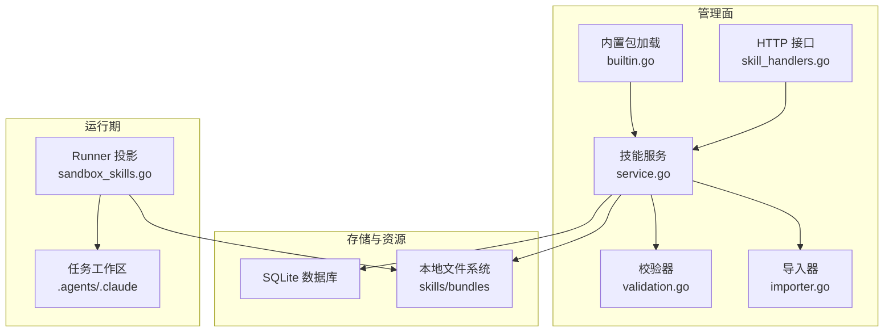
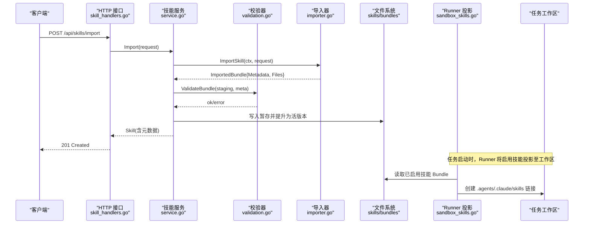
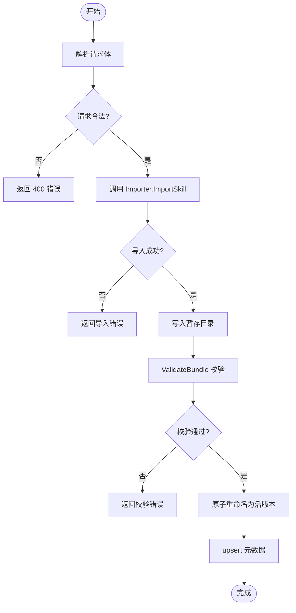
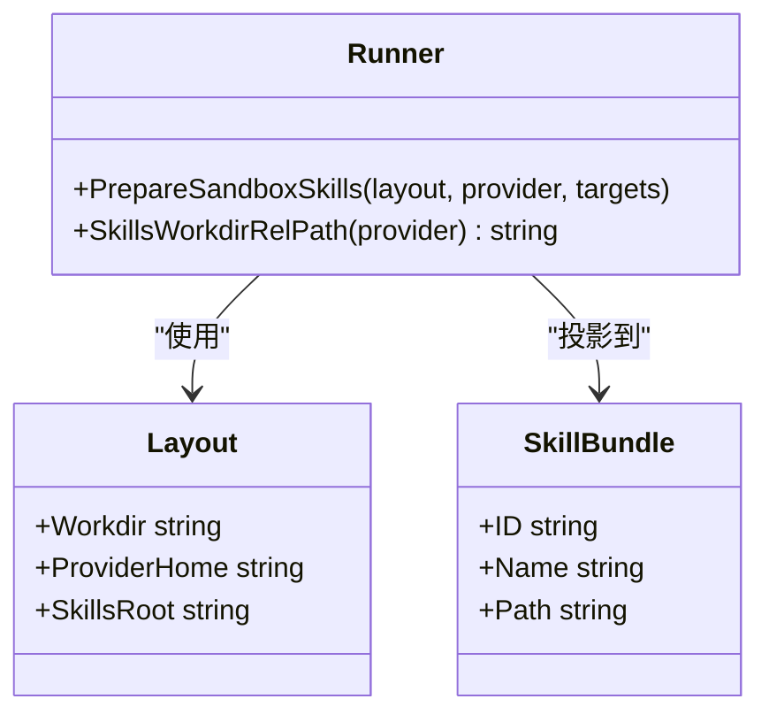
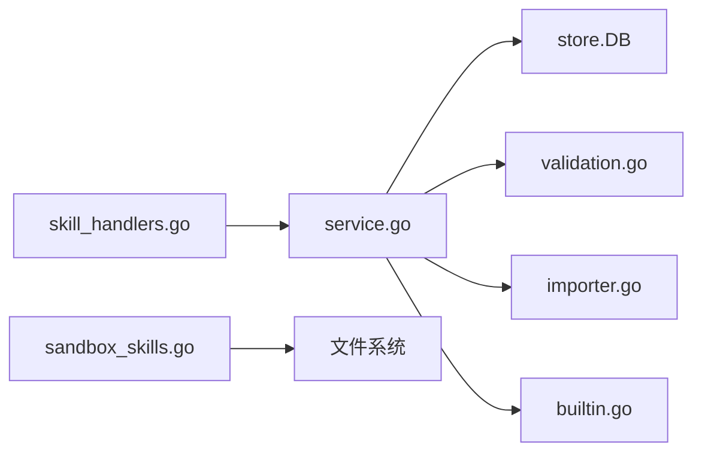

# 技能包系统

<cite>
**本文引用的文件**   
- [README.md](file://README.md)
- [CONTEXT.md](file://CONTEXT.md)
- [internal/skill/service.go](file://internal/skill/service.go)
- [internal/skill/skill.go](file://internal/skill/skill.go)
- [internal/skill/validation.go](file://internal/skill/validation.go)
- [internal/skill/importer.go](file://internal/skill/importer.go)
- [internal/skill/builtin.go](file://internal/skill/builtin.go)
- [internal/daemon/skill_handlers.go](file://internal/daemon/skill_handlers.go)
- [internal/runner/sandbox_skills.go](file://internal/runner/sandbox_skills.go)
- [internal/runner/skill_projection_test.go](file://internal/runner/skill_projection_test.go)
- [skills/bundles/tooling-nmap/SKILL.md](file://skills/bundles/tooling-nmap/SKILL.md)
- [skills/bundles/vulnerabilities-sql-injection/SKILL.md](file://skills/bundles/vulnerabilities-sql-injection/SKILL.md)
</cite>

## 目录
1. [简介](#简介)
2. [项目结构](#项目结构)
3. [核心组件](#核心组件)
4. [架构总览](#架构总览)
5. [详细组件分析](#详细组件分析)
6. [依赖关系分析](#依赖关系分析)
7. [性能与安全性考量](#性能与安全性考量)
8. [故障排查指南](#故障排查指南)
9. [结论](#结论)
10. [附录：开发示例与测试方法](#附录开发示例与测试方法)

## 简介
本文件系统性阐述 CyberPenda 的“技能包（Skill）”体系，覆盖 SKILL.md 格式、预置技能包结构、导入与发布流程、验证规则、分类体系、元数据定义、执行上下文与投影机制，并提供自定义技能包的开发指南、最佳实践与部署方式。文档同时给出端到端示例与测试方法，帮助读者从零构建可复用的安全能力单元。

## 项目结构
技能包系统贯穿“管理面（Daemon API + Service）—存储与校验（DB + Validation）—运行时投影（Runner）—任务工作区（Sandbox/Host）”。关键路径如下：
- 管理与持久化：internal/skill/*
- HTTP 接口层：internal/daemon/skill_handlers.go
- 运行时投影与发现：internal/runner/sandbox_skills.go
- 内置技能包资源：skills/bundles/*（通过内嵌资源安装）
- 概念与术语：CONTEXT.md

图表来源
- [internal/daemon/skill_handlers.go:1-221](file://internal/daemon/skill_handlers.go#L1-L221)
- [internal/skill/service.go:1-458](file://internal/skill/service.go#L1-L458)
- [internal/skill/validation.go:1-79](file://internal/skill/validation.go#L1-L79)
- [internal/skill/importer.go:1-47](file://internal/skill/importer.go#L1-L47)
- [internal/skill/builtin.go:1-360](file://internal/skill/builtin.go#L1-L360)
- [internal/runner/sandbox_skills.go:1-93](file://internal/runner/sandbox_skills.go#L1-L93)

章节来源
- [README.md:1-173](file://README.md#L1-L173)
- [CONTEXT.md:319-345](file://CONTEXT.md#L319-L345)

## 核心组件
- 数据结构与元数据
  - 元数据：ID、名称、描述、来源溯源（kind/package/ref/source_url/last_imported_at/local_modified）
  - 技能实体：包含创建/更新时间、Bundle 路径等
  - Bundle：供 Runner 投影使用的轻量视图（ID/Name/Source/Path）
- 服务层
  - 发布（Publish）：写入暂存目录 → 校验 → 原子替换为活版本 → 更新元数据
  - 导入（Import）：调用受控 Importer（默认 npx skills import）→ 合并来源信息 → 发布
  - 列表/详情/删除：基于 SQLite 查询与文件操作；删除前检查是否被启用
  - 启用/禁用（Opt-out）：按 Runtime Profile 粒度控制
- 内置技能包
  - 启动时扫描内嵌资源，若未存在则安装；对已存在的用户编辑进行修复与清理
- 运行时投影
  - 将启用的 Skill 投影到任务工作区特定目录，并通过符号链接使各 Provider 自动发现

章节来源
- [internal/skill/skill.go:1-47](file://internal/skill/skill.go#L1-L47)
- [internal/skill/service.go:1-458](file://internal/skill/service.go#L1-L458)
- [internal/skill/builtin.go:1-360](file://internal/skill/builtin.go#L1-L360)
- [internal/runner/sandbox_skills.go:1-93](file://internal/runner/sandbox_skills.go#L1-L93)

## 架构总览
下图展示从 API 到运行时发现的完整链路，包括导入、发布、校验、投影与发现。

图表来源
- [internal/daemon/skill_handlers.go:111-137](file://internal/daemon/skill_handlers.go#L111-L137)
- [internal/skill/service.go:115-142](file://internal/skill/service.go#L115-L142)
- [internal/skill/validation.go:23-65](file://internal/skill/validation.go#L23-L65)
- [internal/skill/importer.go:18-46](file://internal/skill/importer.go#L18-L46)
- [internal/runner/sandbox_skills.go:24-81](file://internal/runner/sandbox_skills.go#L24-L81)

## 详细组件分析

### 1) SKILL.md 格式与内容规范
- 必需字段
  - 文件：每个技能包根目录必须包含 SKILL.md
  - Front Matter：支持 name/description 等键值，用于显示名与描述解析
- 内容建议
  - 明确目标、输入输出、使用边界、失败恢复策略、与沙箱安全的约束
  - 提供最小可用基线命令或步骤，避免无界扫描或高噪声行为
- 参考示例
  - 工具类：nmap 技能包（包含语法、两阶段扫描、超时与脚本限制等）
  - 漏洞类型：SQLi 技能包（攻击面、检测通道、绕过技巧、方法论、验证与误报说明）

章节来源
- [skills/bundles/tooling-nmap/SKILL.md:1-67](file://skills/bundles/tooling-nmap/SKILL.md#L1-L67)
- [skills/bundles/vulnerabilities-sql-injection/SKILL.md:1-191](file://skills/bundles/vulnerabilities-sql-injection/SKILL.md#L1-L191)
- [internal/skill/builtin.go:333-355](file://internal/skill/builtin.go#L333-L355)

### 2) 预置技能包结构与分类体系
- 目录组织
  - 以功能域分桶：tooling-*、vulnerabilities-*、frameworks-*、technologies-*、protocols-*、scoreboard-*、coordination-* 等
- 分类语义
  - 工具类：封装 CLI 用法与安全基线（如 nmap、sqlmap、nuclei、semgrep 等）
  - 漏洞类型：针对某类漏洞的探测与验证方法论（如 SQLi、XSS、SSRF、RCE 等）
  - 框架/技术：面向特定框架或云服务的适配指引（如 Next.js、FastAPI、Supabase 等）
  - 协议/编排：GraphQL 等协议或协调型技能（如 scoreboard-driven-web-challenge）
- 内置安装与修复
  - 启动时扫描内嵌资源，缺失则安装；对已有用户编辑保留，仅修复元数据与清理上游文件

章节来源
- [internal/skill/builtin.go:25-103](file://internal/skill/builtin.go#L25-L103)
- [internal/skill/builtin.go:267-305](file://internal/skill/builtin.go#L267-L305)
- [internal/skill/builtin.go:222-254](file://internal/skill/builtin.go#L222-L254)

### 3) 元数据定义与来源溯源
- 关键字段
  - id：稳定标识符，需符合命名正则
  - name/description：显示名与描述
  - source_provenance：kind/package/ref/source_url/last_imported_at/local_modified
- 来源类型
  - builtin：由 daemon 内嵌资源安装，不暴露上游仓库细节
  - package/import：通过结构化参数导入，记录包名、版本/引用、来源 URL 与时间戳
- 公开过滤
  - 对外返回时，builtin 类型的 source 会被精简，仅保留 kind=builtin

章节来源
- [internal/skill/skill.go:9-40](file://internal/skill/skill.go#L9-L40)
- [internal/daemon/skill_handlers.go:179-184](file://internal/daemon/skill_handlers.go#L179-L184)

### 4) 导入与发布流程
- 导入（Import）
  - 入口：POST /api/skills/import，接受结构化 JSON（source_kind/package/ref/source_url），拒绝原始 shell 命令
  - 实现：NPXImporter 固定调用 npx skills import --package/--ref/--source-url --json，严格白名单式参数拼接
- 发布（Publish）
  - 写入暂存目录 → 校验（元数据+Bundle 结构）→ 原子重命名为活版本 → 更新元数据
  - 失败回滚：若重命名失败，尝试恢复备份
- 列表/详情/删除
  - 列表支持按 Runtime Profile 返回 enabled 标记
  - 删除前检查是否仍被启用，除非显式 force_disable

图表来源
- [internal/daemon/skill_handlers.go:111-137](file://internal/daemon/skill_handlers.go#L111-L137)
- [internal/skill/service.go:57-113](file://internal/skill/service.go#L57-L113)
- [internal/skill/validation.go:23-65](file://internal/skill/validation.go#L23-L65)
- [internal/skill/importer.go:18-46](file://internal/skill/importer.go#L18-L46)

章节来源
- [internal/daemon/skill_handlers.go:111-147](file://internal/daemon/skill_handlers.go#L111-L147)
- [internal/skill/service.go:57-142](file://internal/skill/service.go#L57-L142)
- [internal/skill/validation.go:13-21](file://internal/skill/validation.go#L13-L21)

### 5) 验证规则与安全检查
- 元数据校验
  - ID 正则匹配、name 必填
- Bundle 校验
  - 根目录必须存在且为目录
  - 必须包含 SKILL.md，且不能为符号链接或目录
  - 禁止任何符号链接
  - 所有相对路径不得越界（不允许 ..、空段、绝对路径）
- 文件读取与遍历
  - 读取时再次校验相对路径，防止路径穿越

章节来源
- [internal/skill/validation.go:11-79](file://internal/skill/validation.go#L11-L79)

### 6) 运行时投影与发现
- 投影目标
  - 根据 Provider 选择不同发现路径：Claude Code 使用 .claude/skills，其他使用 .agents/skills
  - 同时在 Provider Home 下建立 skills 链接，确保多位置可见
- 投影过程
  - 将启用的 Skill Bundle 复制到任务工作区的 SkillsRoot
  - 在配置预览中注入 skills 清单（id/name 等）
- 测试验证
  - 单元测试验证了投影后的文件存在性与链接正确性

图表来源
- [internal/runner/sandbox_skills.go:14-81](file://internal/runner/sandbox_skills.go#L14-L81)
- [internal/runner/skill_projection_test.go:13-60](file://internal/runner/skill_projection_test.go#L13-L60)

章节来源
- [internal/runner/sandbox_skills.go:1-93](file://internal/runner/sandbox_skills.go#L1-L93)
- [internal/runner/skill_projection_test.go:1-60](file://internal/runner/skill_projection_test.go#L1-L60)

### 7) 执行上下文与权限边界
- 执行边界
  - 技能本身不扩展 Scope、Runner、凭证或 Project Interface 权限
  - 所有执行受限于当前 Task、Scope、Runner、Credential Bindings 与 Project Interface
- 生命周期
  - 任务启动时加载已启用技能；运行期间保持已投影的技能不变
  - 删除技能会结束其启用生命周期；重新导入遵循默认启用策略而非恢复旧 opt-out

章节来源
- [CONTEXT.md:1234-1260](file://CONTEXT.md#L1234-L1260)

## 依赖关系分析
- 组件耦合
  - Daemon 接口层依赖 skill.Service；Service 依赖 store.DB、validation、importer
  - Runner 依赖 runtimeprofile.Provider 与文件系统布局
- 外部依赖
  - NPXImporter 依赖 npx 二进制与 skills 子命令
  - 内置资源通过 Go embed 打包进 daemon
- 潜在循环
  - 模块间单向依赖清晰，未发现循环依赖迹象

图表来源
- [internal/daemon/skill_handlers.go:1-110](file://internal/daemon/skill_handlers.go#L1-L110)
- [internal/skill/service.go:1-56](file://internal/skill/service.go#L1-L56)
- [internal/skill/validation.go:1-22](file://internal/skill/validation.go#L1-L22)
- [internal/skill/importer.go:1-17](file://internal/skill/importer.go#L1-L17)
- [internal/skill/builtin.go:1-28](file://internal/skill/builtin.go#L1-L28)
- [internal/runner/sandbox_skills.go:1-23](file://internal/runner/sandbox_skills.go#L1-L23)

章节来源
- [internal/daemon/skill_handlers.go:1-110](file://internal/daemon/skill_handlers.go#L1-L110)
- [internal/skill/service.go:1-56](file://internal/skill/service.go#L1-L56)

## 性能与安全性考量
- 性能
  - 发布采用“先写暂存再原子重命名”，减少并发写入导致的中间态
  - 列表/详情走 SQLite 索引查询，文件读取按需进行
- 安全
  - 严格的路径与符号链接校验，杜绝路径穿越与软链接逃逸
  - 导入器固定参数拼接，拒绝任意 shell 命令注入
  - 内置资源只读嵌入，避免运行时下载不可信代码
  - 对外返回精简的 builtin 来源信息，隐藏上游仓库细节

[本节为通用指导，无需具体文件分析]

## 故障排查指南
- 常见错误码与原因
  - 400 Bad Request：非法 JSON、缺少必要字段、原始命令导入被拒
  - 404 Not Found：技能不存在
  - 409 Conflict：技能仍被启用，需先禁用或删除启用关系
  - 500 Internal Server Error：数据库/文件系统异常
- 定位要点
  - 查看导入日志中的 npx stderr 输出
  - 确认 bundle 根目录与 SKILL.md 是否存在且非符号链接
  - 检查相对路径是否越界
  - 确认目标 Runtime Profile 是否 opt-out 该技能

章节来源
- [internal/daemon/skill_handlers.go:200-221](file://internal/daemon/skill_handlers.go#L200-L221)
- [internal/skill/service.go:115-142](file://internal/skill/service.go#L115-L142)
- [internal/skill/validation.go:23-65](file://internal/skill/validation.go#L23-L65)

## 结论
CyberPenda 的技能包系统以“结构化元数据 + 强校验 + 可控导入 + 原子发布 + 运行时投影”为核心，既保证可复用与可审计，又兼顾安全与稳定性。通过清晰的分类体系与严格的执行边界，技能成为跨运行时、跨项目的标准化安全能力载体。

[本节为总结，无需具体文件分析]

## 附录：开发示例与测试方法

### A. 自定义技能包开发步骤
- 准备目录
  - 新建目录，例如 my-skill/
  - 编写 SKILL.md，包含 Front Matter（name/description）与正文（目标、用法、边界、失败恢复）
- 可选资源
  - 可在同目录下放置 scripts/、references/ 等辅助文件，注意路径不得越界
- 本地发布
  - 通过 PUT /api/skills/:id 提交 files 映射（key 为相对路径，value 为文本内容）
  - 或通过 POST /api/skills/import 使用结构化导入（推荐）
- 启用与预览
  - 在 Runtime Profile 中启用该技能，或在 Launch Preflight 中预览
  - 任务启动后，Runner 会将技能投影到 .agents/.claude/skills 等目录

章节来源
- [internal/daemon/skill_handlers.go:78-109](file://internal/daemon/skill_handlers.go#L78-L109)
- [internal/daemon/skill_handlers.go:111-137](file://internal/daemon/skill_handlers.go#L111-L137)
- [internal/runner/sandbox_skills.go:24-81](file://internal/runner/sandbox_skills.go#L24-L81)

### B. 内置技能包维护
- 新增内置
  - 在 internal/skill/builtins/assets 下新增目录与 SKILL.md
  - 启动时会自动安装到 skills/bundles/<id>
- 升级与修复
  - 若用户有本地修改，不会覆盖；仅修复元数据与清理上游文件
  - 若缺失文件，会在下次启动时自动修复

章节来源
- [internal/skill/builtin.go:66-103](file://internal/skill/builtin.go#L66-L103)
- [internal/skill/builtin.go:222-254](file://internal/skill/builtin.go#L222-L254)

### C. 测试方法
- 单测参考
  - 校验器：构造有效/无效 bundle，断言错误路径
  - 导入器：模拟 npx 输出，断言 ImportedBundle 解析
  - 投影：验证 .agents/.claude/skills 链接与 Config.skills 预览
- 集成/冒烟
  - 通过 HTTP 接口完成导入/发布/启用/删除全流程
  - 启动任务后检查工作区是否存在对应 SKILL.md

章节来源
- [internal/skill/skill_test.go:16-38](file://internal/skill/skill_test.go#L16-L38)
- [internal/runner/skill_projection_test.go:13-60](file://internal/runner/skill_projection_test.go#L13-L60)
- [internal/daemon/skill_test.go:107-142](file://internal/daemon/skill_test.go#L107-L142)