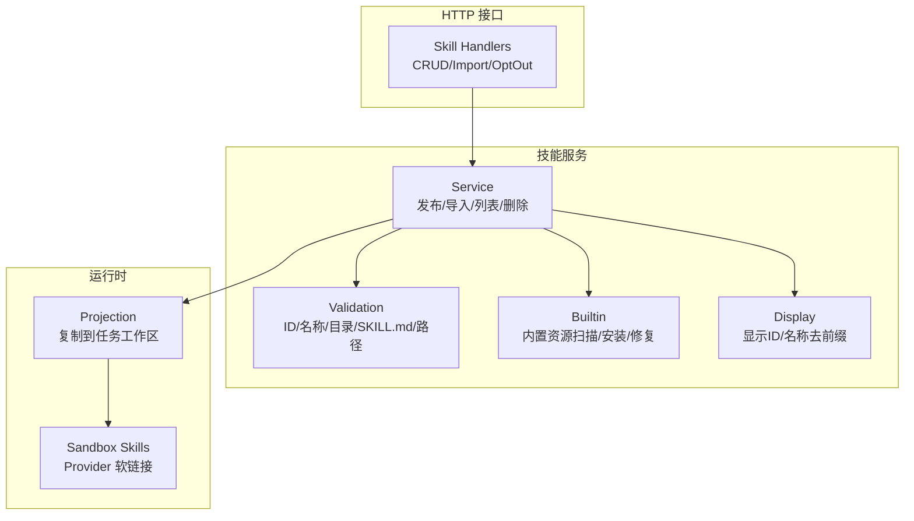
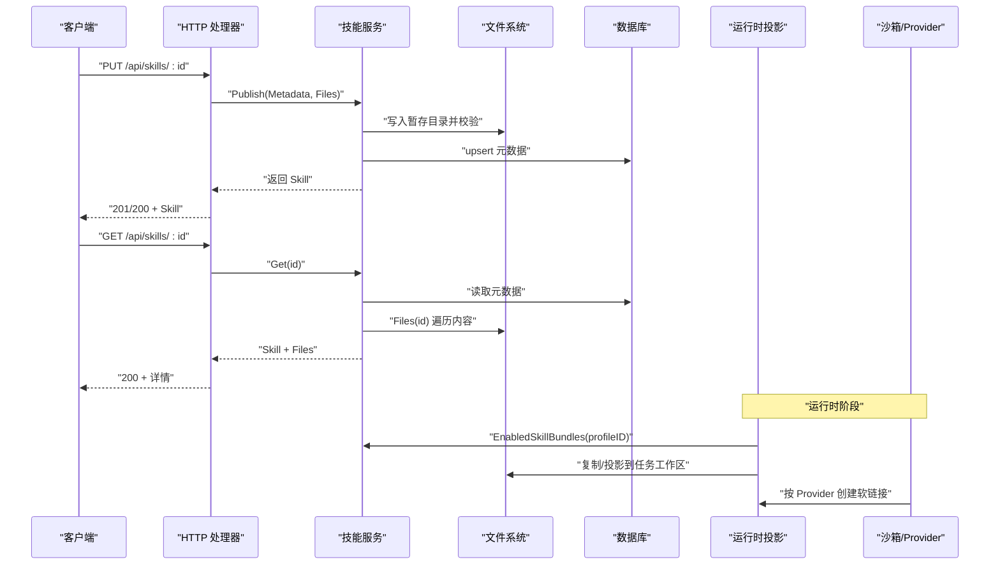
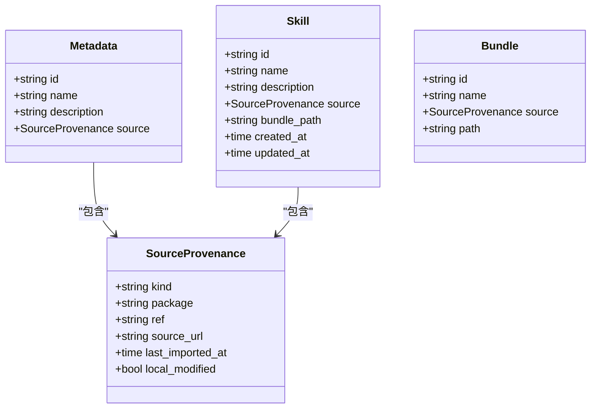
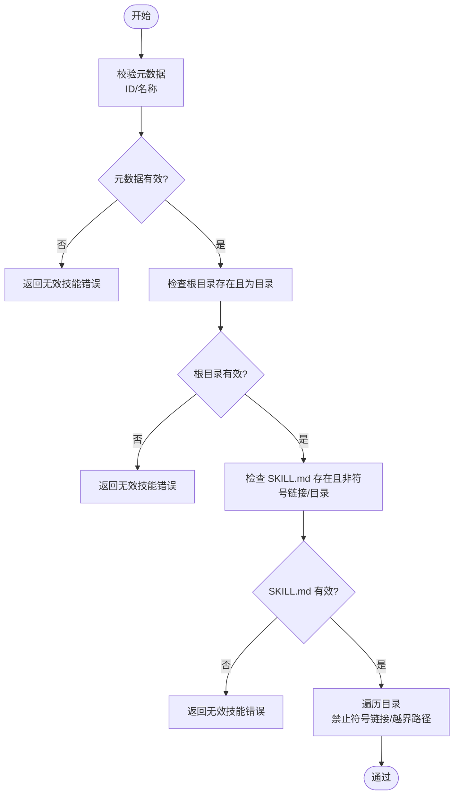
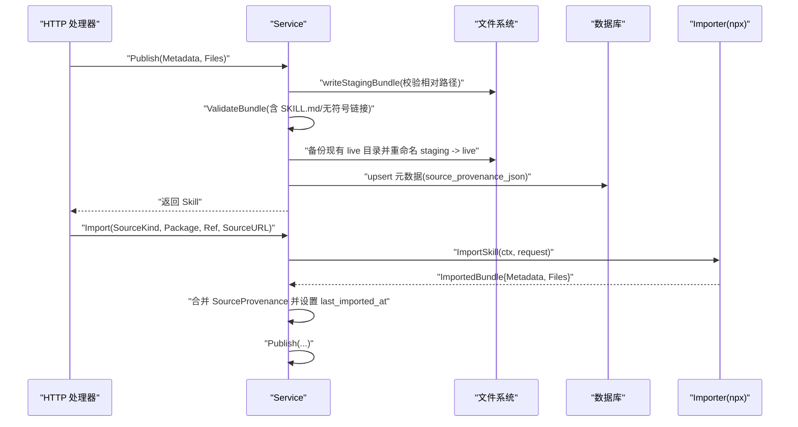
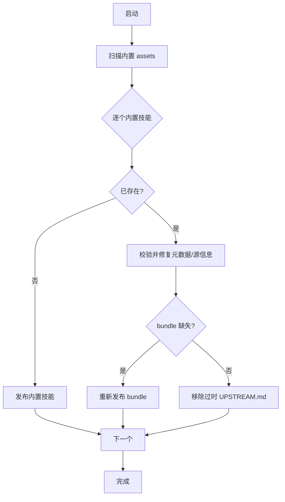
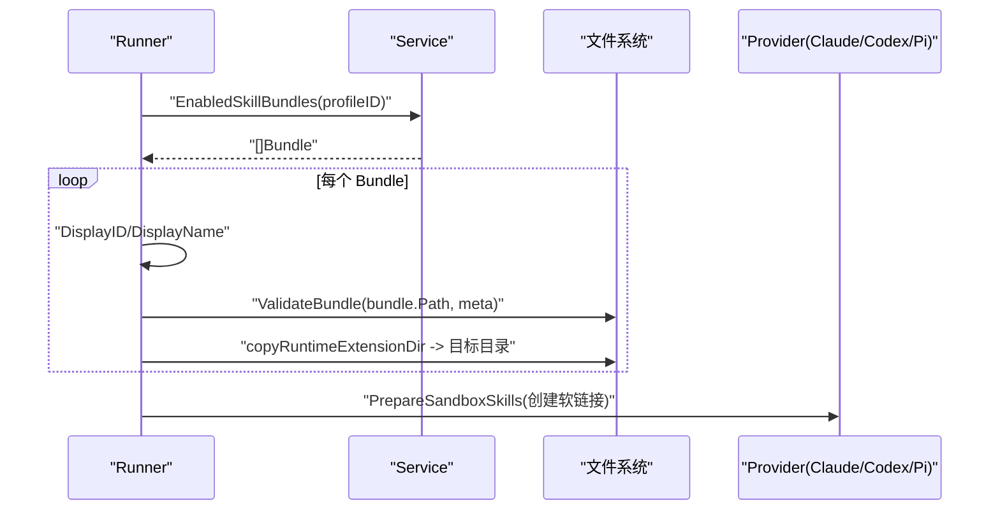
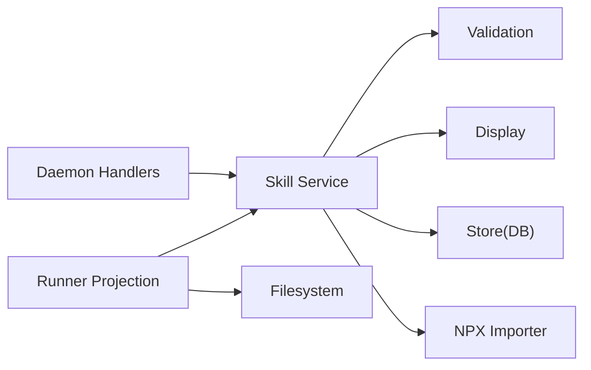

# 技能包结构与格式

<cite>
**本文引用的文件**   
- [internal/skill/skill.go](file://internal/skill/skill.go)
- [internal/skill/validation.go](file://internal/skill/validation.go)
- [internal/skill/service.go](file://internal/skill/service.go)
- [internal/skill/importer.go](file://internal/skill/importer.go)
- [internal/skill/builtin.go](file://internal/skill/builtin.go)
- [internal/skill/display.go](file://internal/skill/display.go)
- [internal/daemon/skill_handlers.go](file://internal/daemon/skill_handlers.go)
- [internal/runner/projection.go](file://internal/runner/projection.go)
- [internal/runner/sandbox_skills.go](file://internal/runner/sandbox_skills.go)
- [skills/bundles/tooling-nmap/SKILL.md](file://skills/bundles/tooling-nmap/SKILL.md)
- [skills/bundles/vulnerabilities-sql-injection/SKILL.md](file://skills/bundles/vulnerabilities-sql-injection/SKILL.md)
- [.claude/skills/playwright-cli/SKILL.md](file://.claude/skills/playwright-cli/SKILL.md)
</cite>

## 目录
1. [简介](#简介)
2. [项目结构](#项目结构)
3. [核心组件](#核心组件)
4. [架构总览](#架构总览)
5. [详细组件分析](#详细组件分析)
6. [依赖关系分析](#依赖关系分析)
7. [性能与一致性考虑](#性能与一致性考虑)
8. [故障排查指南](#故障排查指南)
9. [结论](#结论)
10. [附录：SKILL.md 模板与字段规范](#附录skillmd-模板与字段规范)

## 简介
本文件系统化阐述“技能包”的结构与格式，覆盖 SKILL.md 文件格式、元数据定义（Metadata）、源追溯信息（SourceProvenance）、版本管理策略、目录组织与命名约定、必需字段与校验规则、错误处理机制，以及打包、分发与部署的最佳实践。文档面向开发者与使用者，既提供代码级实现细节，也给出可操作的规范与示例路径。

## 项目结构
技能包在系统中的关键位置与职责如下：
- 存储与生命周期：服务层负责发布、导入、查询、删除、启用/禁用等；持久化元数据，文件系统存放 bundle 内容。
- 验证与安全：对 ID、名称、根目录、SKILL.md 存在性与类型、符号链接、相对路径等进行严格校验。
- 内置资源：通过嵌入的 assets 安装内置技能包，支持历史 ID 迁移与清理。
- 运行时投影：将已发布的技能包投影到任务工作区，供代理发现与使用。
- 沙箱集成：为不同 Provider 创建指向统一 skills 根的软链接，确保可被 Agent 发现。

图示来源
- [internal/skill/service.go:57-113](file://internal/skill/service.go#L57-L113)
- [internal/skill/validation.go:13-65](file://internal/skill/validation.go#L13-L65)
- [internal/skill/builtin.go:69-103](file://internal/skill/builtin.go#L69-L103)
- [internal/skill/display.go:5-27](file://internal/skill/display.go#L5-L27)
- [internal/daemon/skill_handlers.go:31-147](file://internal/daemon/skill_handlers.go#L31-L147)
- [internal/runner/projection.go:133-181](file://internal/runner/projection.go#L133-L181)
- [internal/runner/sandbox_skills.go:27-81](file://internal/runner/sandbox_skills.go#L27-L81)

章节来源
- [internal/skill/service.go:57-113](file://internal/skill/service.go#L57-L113)
- [internal/skill/validation.go:13-65](file://internal/skill/validation.go#L13-L65)
- [internal/skill/builtin.go:69-103](file://internal/skill/builtin.go#L69-L103)
- [internal/skill/display.go:5-27](file://internal/skill/display.go#L5-L27)
- [internal/daemon/skill_handlers.go:31-147](file://internal/daemon/skill_handlers.go#L31-L147)
- [internal/runner/projection.go:133-181](file://internal/runner/projection.go#L133-L181)
- [internal/runner/sandbox_skills.go:27-81](file://internal/runner/sandbox_skills.go#L27-L81)

## 核心组件
- 元数据结构体 Metadata
  - id：技能唯一标识，需符合正则约束，且非空。
  - name：显示名称，必填。
  - description：可选描述。
  - source_provenance：源追溯信息，见下节。
- 源追溯 SourceProvenance
  - kind：来源类型，如 builtin、npx 等。
  - package：包名（例如 npm 包）。
  - ref：引用（分支/标签/提交）。
  - source_url：来源地址。
  - last_imported_at：最近导入时间。
  - local_modified：本地是否被修改。
- 技能实体 Skill
  - 除元数据外，包含 BundlePath、CreatedAt、UpdatedAt 等运行时与持久化字段。
- 包结构 Bundle
  - 用于运行时投影时携带 ID、Name、Source、Path。

章节来源
- [internal/skill/skill.go:9-40](file://internal/skill/skill.go#L9-L40)

## 架构总览
从 HTTP 请求到运行时发现的端到端流程如下：

图示来源
- [internal/daemon/skill_handlers.go:78-109](file://internal/daemon/skill_handlers.go#L78-L109)
- [internal/daemon/skill_handlers.go:62-76](file://internal/daemon/skill_handlers.go#L62-L76)
- [internal/skill/service.go:57-113](file://internal/skill/service.go#L57-L113)
- [internal/skill/service.go:144-176](file://internal/skill/service.go#L144-L176)
- [internal/skill/service.go:178-216](file://internal/skill/service.go#L178-L216)
- [internal/runner/projection.go:133-181](file://internal/runner/projection.go#L133-L181)
- [internal/runner/sandbox_skills.go:27-81](file://internal/runner/sandbox_skills.go#L27-L81)

## 详细组件分析

### 元数据与源追溯模型
- Metadata 与 SourceProvenance 定义了技能的声明式元数据与来源追踪能力，便于审计与溯源。
- DisplayID/DisplayName 对外展示时去除内置来源前缀，保持用户界面简洁。

图示来源
- [internal/skill/skill.go:9-40](file://internal/skill/skill.go#L9-L40)
- [internal/skill/display.go:5-27](file://internal/skill/display.go#L5-L27)

章节来源
- [internal/skill/skill.go:9-40](file://internal/skill/skill.go#L9-L40)
- [internal/skill/display.go:5-27](file://internal/skill/display.go#L5-L27)

### 验证与安全检查
- ID 必须匹配正则，name 必填。
- 根目录必须存在且为目录。
- 必须包含 SKILL.md，且不能是符号链接或目录。
- 禁止任何符号链接，所有路径必须是相对路径且不越界。

图示来源
- [internal/skill/validation.go:13-65](file://internal/skill/validation.go#L13-L65)

章节来源
- [internal/skill/validation.go:13-65](file://internal/skill/validation.go#L13-L65)

### 发布与导入流程
- Publish：接收元数据与文件映射，写入暂存目录，执行完整校验，原子替换 live 目录，更新数据库元数据。
- Import：调用外部导入器（如 npx），解析结构化 JSON 结果，合并 SourceProvenance，再走 Publish。

图示来源
- [internal/skill/service.go:57-113](file://internal/skill/service.go#L57-L113)
- [internal/skill/service.go:115-142](file://internal/skill/service.go#L115-L142)
- [internal/skill/importer.go:18-46](file://internal/skill/importer.go#L18-L46)

章节来源
- [internal/skill/service.go:57-113](file://internal/skill/service.go#L57-L113)
- [internal/skill/service.go:115-142](file://internal/skill/service.go#L115-L142)
- [internal/skill/importer.go:18-46](file://internal/skill/importer.go#L18-L46)

### 内置技能包安装与修复
- 启动时扫描嵌入的 assets，若未安装则发布；若已存在但缺失 bundle 文件或元数据不一致，进行修复与清理。
- 支持历史 ID 迁移与废弃清理，避免破坏用户编辑内容。

图示来源
- [internal/skill/builtin.go:69-103](file://internal/skill/builtin.go#L69-L103)
- [internal/skill/builtin.go:222-254](file://internal/skill/builtin.go#L222-L254)
- [internal/skill/builtin.go:267-305](file://internal/skill/builtin.go#L267-L305)

章节来源
- [internal/skill/builtin.go:69-103](file://internal/skill/builtin.go#L69-L103)
- [internal/skill/builtin.go:222-254](file://internal/skill/builtin.go#L222-L254)
- [internal/skill/builtin.go:267-305](file://internal/skill/builtin.go#L267-L305)

### 运行时投影与沙箱发现
- 根据 profile 获取启用的技能包，计算显示 ID/名称，校验后复制到任务工作区。
- 为不同 Provider 创建软链接，使 Claude/Codex/Pi 能发现 skills。

图示来源
- [internal/runner/projection.go:133-181](file://internal/runner/projection.go#L133-L181)
- [internal/runner/sandbox_skills.go:27-81](file://internal/runner/sandbox_skills.go#L27-L81)

章节来源
- [internal/runner/projection.go:133-181](file://internal/runner/projection.go#L133-L181)
- [internal/runner/sandbox_skills.go:27-81](file://internal/runner/sandbox_skills.go#L27-L81)

### HTTP 接口与错误映射
- 列出/获取/发布/导入/删除技能，支持按 profile 查询启用状态与 opt-out。
- 错误码映射：无效输入 400、未找到 404、冲突（被启用）409、内部错误 500。

章节来源
- [internal/daemon/skill_handlers.go:31-147](file://internal/daemon/skill_handlers.go#L31-L147)
- [internal/daemon/skill_handlers.go:200-211](file://internal/daemon/skill_handlers.go#L200-L211)

## 依赖关系分析
- 模块内聚性
  - skill 包内聚了模型、校验、服务、内置资源与显示逻辑，职责清晰。
- 直接依赖
  - service 依赖 store.DB 与 validation、display。
  - daemon handlers 依赖 service。
  - runner 依赖 service 与 filesystem。
- 外部集成点
  - importer 通过固定命令形状调用外部工具（npx），不暴露任意 shell 命令。
  - 前端 UI 仅消费公开字段，并对内置来源做前缀剥离展示。

图示来源
- [internal/daemon/skill_handlers.go:31-147](file://internal/daemon/skill_handlers.go#L31-L147)
- [internal/skill/service.go:57-113](file://internal/skill/service.go#L57-L113)
- [internal/skill/validation.go:13-65](file://internal/skill/validation.go#L13-L65)
- [internal/skill/display.go:5-27](file://internal/skill/display.go#L5-L27)
- [internal/skill/importer.go:18-46](file://internal/skill/importer.go#L18-L46)
- [internal/runner/projection.go:133-181](file://internal/runner/projection.go#L133-L181)

章节来源
- [internal/daemon/skill_handlers.go:31-147](file://internal/daemon/skill_handlers.go#L31-L147)
- [internal/skill/service.go:57-113](file://internal/skill/service.go#L57-L113)
- [internal/skill/validation.go:13-65](file://internal/skill/validation.go#L13-L65)
- [internal/skill/display.go:5-27](file://internal/skill/display.go#L5-L27)
- [internal/skill/importer.go:18-46](file://internal/skill/importer.go#L18-L46)
- [internal/runner/projection.go:133-181](file://internal/runner/projection.go#L133-L181)

## 性能与一致性考虑
- 发布采用“先写暂存、再原子重命名”的策略，降低并发写入风险。
- 批量操作（列表、启用集合）尽量单次查询与流式扫描，减少内存占用。
- 运行时投影仅在需要时复制必要目录，避免全量拷贝。
- 建议：
  - 大文件内容应限制大小并在上传前校验。
  - 对频繁读的路径（如 SKILL.md）可引入缓存层（注意失效策略）。
  - 对导入流程增加超时与重试上限，避免阻塞。

[本节为通用指导，无需源码引用]

## 故障排查指南
- 常见错误与定位
  - 无效技能：检查 ID 是否符合正则、name 是否为空、是否存在 SKILL.md、是否包含符号链接或越界路径。
  - 未找到：确认 ID 是否存在、bundle 目录是否被误删。
  - 冲突（被启用）：删除前需先禁用或在删除参数中强制禁用。
  - 导入失败：检查外部工具（npx）是否可用、包名/引用是否正确、JSON 输出是否合法。
- 日志与断点
  - 关注服务层的 upsert、rename、walkdir 相关错误信息。
  - 运行时投影阶段关注 copy/link 权限与路径冲突。

章节来源
- [internal/skill/validation.go:13-65](file://internal/skill/validation.go#L13-L65)
- [internal/skill/service.go:301-356](file://internal/skill/service.go#L301-L356)
- [internal/daemon/skill_handlers.go:200-211](file://internal/daemon/skill_handlers.go#L200-L211)

## 结论
技能包体系以严格的元数据与源追溯为基础，结合完善的校验与安全的发布流程，实现了从开发、导入、安装到运行时发现的闭环。通过内置资源管理与运行时投影，系统在保证安全性的同时提供了良好的可扩展性与用户体验。遵循本文档的规范与实践，可有效提升技能包的稳定性与可维护性。

[本节为总结，无需源码引用]

## 附录：SKILL.md 模板与字段规范

### 目录结构与命名规范
- 每个技能包为一个目录，目录名为技能的 id。
- 根目录下必须包含 SKILL.md 指令文档。
- 允许包含其他辅助文件（如 references、scripts 等），但不得包含符号链接，且所有路径必须相对且不越界。
- 推荐按功能分类组织子目录，如 references、scripts、assets 等。

章节来源
- [internal/skill/validation.go:23-65](file://internal/skill/validation.go#L23-L65)

### SKILL.md 头部字段
- 使用 YAML Front Matter 包裹，至少包含：
  - name：技能名称（必填）
  - description：技能描述（可选）
- 示例参考路径：
  - [skills/bundles/tooling-nmap/SKILL.md](file://skills/bundles/tooling-nmap/SKILL.md)
  - [skills/bundles/vulnerabilities-sql-injection/SKILL.md](file://skills/bundles/vulnerabilities-sql-injection/SKILL.md)
  - [.claude/skills/playwright-cli/SKILL.md](file://.claude/skills/playwright-cli/SKILL.md)

章节来源
- [skills/bundles/tooling-nmap/SKILL.md:1-4](file://skills/bundles/tooling-nmap/SKILL.md#L1-L4)
- [skills/bundles/vulnerabilities-sql-injection/SKILL.md:1-4](file://skills/bundles/vulnerabilities-sql-injection/SKILL.md#L1-L4)
- [.claude/skills/playwright-cli/SKILL.md:1-5](file://.claude/skills/playwright-cli/SKILL.md#L1-L5)

### 字段验证规则
- id：必须以字母或数字开头，后续字符可为字母、数字、点、下划线、短横线，长度不超过 128。
- name：非空。
- 根目录：必须存在且为目录。
- SKILL.md：必须存在，且为非符号链接的文件。
- 符号链接：整个包内不允许任何符号链接。
- 路径：所有相对路径不得为空、不得以绝对路径开头、不得包含反斜杠、不得包含空段、点或双点。

章节来源
- [internal/skill/validation.go:11-21](file://internal/skill/validation.go#L11-L21)
- [internal/skill/validation.go:23-65](file://internal/skill/validation.go#L23-L65)

### 错误处理机制
- 无效输入：返回 400，提示具体校验失败原因。
- 未找到：返回 404。
- 冲突：当技能仍被某些 profile 启用时，删除需显式强制禁用，否则返回 409。
- 内部错误：返回 500，附带上下文错误信息。

章节来源
- [internal/daemon/skill_handlers.go:200-211](file://internal/daemon/skill_handlers.go#L200-L211)
- [internal/skill/service.go:301-356](file://internal/skill/service.go#L301-L356)

### 打包、分发与部署最佳实践
- 打包
  - 确保 SKILL.md 头部字段齐全，内容清晰、可操作。
  - 使用相对路径组织附件，避免符号链接。
  - 对大文件进行压缩或拆分，必要时提供下载脚本。
- 分发
  - 通过 Import 接口从受控源导入（如 npx），保留 SourceProvenance 以便审计。
  - 或使用 Publish 接口直接发布，确保 files 映射中的路径均通过校验。
- 部署
  - 启动时自动安装内置技能，避免重复安装与覆盖用户编辑。
  - 运行时按 profile 投影启用的技能，确保 Agent 可发现。
  - 为不同 Provider 创建软链接，保证跨环境一致发现路径。

章节来源
- [internal/skill/service.go:57-113](file://internal/skill/service.go#L57-L113)
- [internal/skill/service.go:115-142](file://internal/skill/service.go#L115-L142)
- [internal/skill/builtin.go:69-103](file://internal/skill/builtin.go#L69-L103)
- [internal/runner/projection.go:133-181](file://internal/runner/projection.go#L133-L181)
- [internal/runner/sandbox_skills.go:27-81](file://internal/runner/sandbox_skills.go#L27-L81)