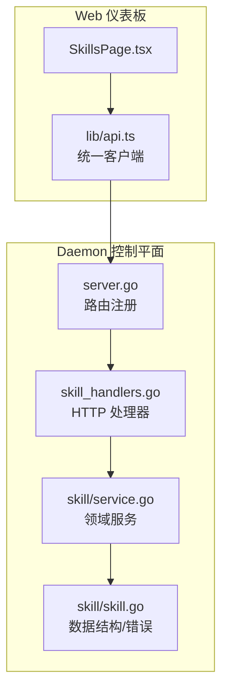
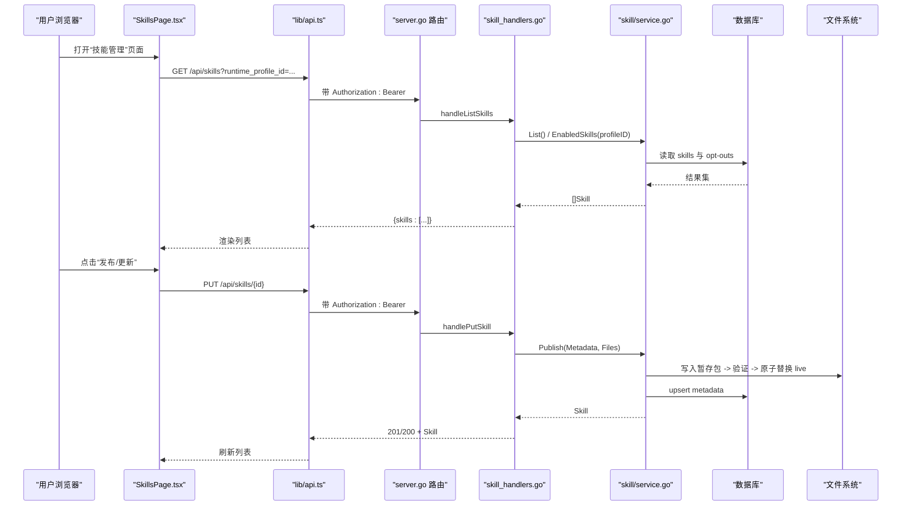
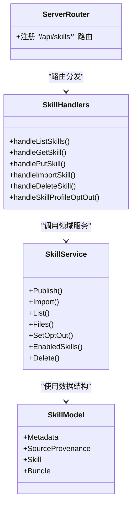

# 技能管理接口

<cite>
**本文引用的文件**   
- [internal/daemon/server.go](file://internal/daemon/server.go)
- [internal/daemon/skill_handlers.go](file://internal/daemon/skill_handlers.go)
- [internal/skill/service.go](file://internal/skill/service.go)
- [internal/skill/skill.go](file://internal/skill/skill.go)
- [web/src/pages/SkillsPage.tsx](file://web/src/pages/SkillsPage.tsx)
- [web/src/lib/api.ts](file://web/src/lib/api.ts)
</cite>

## 目录
1. [简介](#简介)
2. [项目结构](#项目结构)
3. [核心组件](#核心组件)
4. [架构总览](#架构总览)
5. [详细组件分析](#详细组件分析)
6. [依赖关系分析](#依赖关系分析)
7. [性能与一致性](#性能与一致性)
8. [故障排查指南](#故障排查指南)
9. [结论](#结论)
10. [附录：API 参考与示例](#附录api-参考与示例)

## 简介
本文件为“技能（Skill）管理”的 HTTP REST API 文档，覆盖以下能力：
- 技能列表查询（支持按运行配置视图过滤启用状态）
- 技能详情获取（含公开文件内容）
- 技能发布/更新（结构化元数据 + 文件包）
- 技能导入（受控的结构化包/引用导入）
- 技能删除（可选强制禁用后删除）
- 针对运行配置的启用/禁用（opt-out 机制）
- Web 仪表板中的技能管理界面使用方式与最佳实践

认证要求：所有 /api/* 请求均通过 Bearer Token 认证。前端在请求头中自动注入 Authorization: Bearer <token>。

## 项目结构
后端采用 Go 实现，HTTP 路由集中在服务启动处注册；技能管理的控制器位于独立文件中，业务逻辑由领域服务封装。前端 React 页面提供可视化操作并调用同一套 API。

图表来源
- [internal/daemon/server.go:612-619](file://internal/daemon/server.go#L612-L619)
- [internal/daemon/skill_handlers.go:31-184](file://internal/daemon/skill_handlers.go#L31-L184)
- [internal/skill/service.go:57-142](file://internal/skill/service.go#L57-L142)
- [internal/skill/skill.go:9-46](file://internal/skill/skill.go#L9-L46)
- [web/src/pages/SkillsPage.tsx:51-214](file://web/src/pages/SkillsPage.tsx#L51-L214)
- [web/src/lib/api.ts:20-97](file://web/src/lib/api.ts#L20-L97)

章节来源
- [internal/daemon/server.go:612-619](file://internal/daemon/server.go#L612-L619)
- [internal/daemon/skill_handlers.go:31-184](file://internal/daemon/skill_handlers.go#L31-L184)
- [internal/skill/service.go:57-142](file://internal/skill/service.go#L57-L142)
- [internal/skill/skill.go:9-46](file://internal/skill/skill.go#L9-L46)
- [web/src/pages/SkillsPage.tsx:51-214](file://web/src/pages/SkillsPage.tsx#L51-L214)
- [web/src/lib/api.ts:20-97](file://web/src/lib/api.ts#L20-L97)

## 核心组件
- 路由层：集中注册 /api/skills 系列端点。
- 控制器层：解析参数、校验输入、调用服务、返回 JSON。
- 领域服务层：持久化元数据、原子化发布/回滚、导入流程、启用/禁用策略、删除保护。
- 模型与错误：统一的 Skill 结构体与错误类型映射到 HTTP 状态码。
- 前端页面：提供创建/编辑/导入/启用禁用/删除等交互，并通过统一客户端发起认证请求。

章节来源
- [internal/daemon/server.go:612-619](file://internal/daemon/server.go#L612-L619)
- [internal/daemon/skill_handlers.go:31-184](file://internal/daemon/skill_handlers.go#L31-L184)
- [internal/skill/service.go:57-142](file://internal/skill/service.go#L57-L142)
- [internal/skill/skill.go:9-46](file://internal/skill/skill.go#L9-L46)
- [web/src/pages/SkillsPage.tsx:51-214](file://web/src/pages/SkillsPage.tsx#L51-L214)
- [web/src/lib/api.ts:20-97](file://web/src/lib/api.ts#L20-L97)

## 架构总览
下图展示了从浏览器到存储层的完整调用链，包括认证注入、路由分发、控制器处理、服务层事务与文件系统原子替换、以及错误映射。

图表来源
- [internal/daemon/server.go:612-619](file://internal/daemon/server.go#L612-L619)
- [internal/daemon/skill_handlers.go:78-109](file://internal/daemon/skill_handlers.go#L78-L109)
- [internal/skill/service.go:57-113](file://internal/skill/service.go#L57-L113)
- [web/src/pages/SkillsPage.tsx:120-140](file://web/src/pages/SkillsPage.tsx#L120-L140)
- [web/src/lib/api.ts:20-97](file://web/src/lib/api.ts#L20-L97)

## 详细组件分析

### 认证与安全
- 认证方式：Bearer Token。前端统一在请求头注入 Authorization: Bearer <token>。
- 令牌来源：URL 参数 token 或会话存储 pentest.authToken。
- 安全边界：导入接口拒绝包含命令执行字段的结构体，仅接受结构化包/引用。

章节来源
- [web/src/lib/api.ts:41-81](file://web/src/lib/api.ts#L41-L81)
- [internal/daemon/skill_handlers.go:111-137](file://internal/daemon/skill_handlers.go#L111-L137)

### 技能列表查询
- 端点：GET /api/skills
- 查询参数：
  - runtime_profile_id：可选。若提供，则返回该运行配置下的启用状态（基于 opt-out 表计算）。
- 响应体：{ skills: Skill[] }
- 行为说明：
  - 未传 profileId：返回全部技能，enabled 默认 true。
  - 传入 profileId：根据 opt-out 表计算 enabled 标记。
- 错误码：
  - 500：内部错误（如数据库异常）

章节来源
- [internal/daemon/server.go:612](file://internal/daemon/server.go#L612)
- [internal/daemon/skill_handlers.go:31-60](file://internal/daemon/skill_handlers.go#L31-L60)
- [internal/skill/service.go:155-176](file://internal/skill/service.go#L155-L176)
- [internal/skill/service.go:252-282](file://internal/skill/service.go#L252-L282)

### 技能详情获取
- 端点：GET /api/skills/{skill_id}
- 路径参数：skill_id
- 响应体：Skill（包含 files 键值对，内置技能的 UPSTREAM.md 会被过滤）
- 错误码：
  - 404：不存在
  - 500：内部错误

章节来源
- [internal/daemon/server.go:614](file://internal/daemon/server.go#L614)
- [internal/daemon/skill_handlers.go:62-76](file://internal/daemon/skill_handlers.go#L62-L76)
- [internal/skill/service.go:178-216](file://internal/skill/service.go#L178-L216)
- [internal/daemon/skill_handlers.go:186-198](file://internal/daemon/skill_handlers.go#L186-L198)

### 技能发布/更新
- 端点：PUT /api/skills/{skill_id}
- 路径参数：skill_id
- 请求体：
  - name：必填
  - description：可选
  - source_provenance：可选（kind/package/ref/source_url）
  - files：必填，键值对形式的文件集合（至少包含 SKILL.md）
- 行为说明：
  - 新建：返回 201
  - 更新：返回 200
  - 原子性：先写暂存包，校验通过后原子替换 live 目录，失败时回滚
- 错误码：
  - 400：无效 JSON 或校验失败
  - 404：skill_id 不存在（当作为更新场景时）
  - 500：内部错误

章节来源
- [internal/daemon/server.go:615](file://internal/daemon/server.go#L615)
- [internal/daemon/skill_handlers.go:78-109](file://internal/daemon/skill_handlers.go#L78-L109)
- [internal/skill/service.go:57-113](file://internal/skill/service.go#L57-L113)

### 技能导入（受控）
- 端点：POST /api/skills/import
- 请求体：
  - source_kind：必填
  - package：可选
  - ref：可选
  - source_url：可选
- 行为说明：
  - 仅接受结构化包/引用，拒绝包含命令执行字段的结构体
  - 导入成功后以 Publish 流程落盘并更新元数据
- 错误码：
  - 400：JSON 无效或包含不允许的命令字段
  - 500：内部错误

章节来源
- [internal/daemon/server.go:613](file://internal/daemon/server.go#L613)
- [internal/daemon/skill_handlers.go:111-137](file://internal/daemon/skill_handlers.go#L111-L137)
- [internal/skill/service.go:115-142](file://internal/skill/service.go#L115-L142)

### 技能删除
- 端点：DELETE /api/skills/{skill_id}
- 查询参数：
  - force_disable：布尔值（true/false），用于强制删除已启用的技能
- 行为说明：
  - 未设置 force_disable=true 且存在任意运行配置仍启用该技能：拒绝删除
  - 成功删除：返回 204 No Content
- 错误码：
  - 409：冲突（技能仍在被启用）
  - 404：不存在
  - 500：内部错误

章节来源
- [internal/daemon/server.go:616](file://internal/daemon/server.go#L616)
- [internal/daemon/skill_handlers.go:139-147](file://internal/daemon/skill_handlers.go#L139-L147)
- [internal/skill/service.go:301-356](file://internal/skill/service.go#L301-L356)

### 针对运行配置的启用/禁用（Opt-out）
- 端点：
  - PUT /api/skills/{skill_id}/profiles/{profile_id}/opt-out
  - DELETE /api/skills/{skill_id}/profiles/{profile_id}/opt-out
- 路径参数：skill_id、profile_id
- 行为说明：
  - PUT：为该运行配置添加 opt-out（即禁用）
  - DELETE：移除 opt-out（即启用）
  - 列表接口在传入 runtime_profile_id 时会据此计算 enabled 标记
- 错误码：
  - 404：skill 或 profile 不存在
  - 500：内部错误

章节来源
- [internal/daemon/server.go:617-618](file://internal/daemon/server.go#L617-L618)
- [internal/daemon/skill_handlers.go:149-165](file://internal/daemon/skill_handlers.go#L149-L165)
- [internal/skill/service.go:218-250](file://internal/skill/service.go#L218-L250)
- [internal/skill/service.go:252-282](file://internal/skill/service.go#L252-L282)

### 数据结构与错误映射
- Skill 结构体包含 id/name/description/source_provenance/bundle_path/created_at/updated_at
- SourceProvenance 包含 kind/package/ref/source_url/last_imported_at/local_modified
- 错误映射：
  - ErrInvalidSkill → 400
  - ErrNotFound → 404
  - ErrEnabled → 409
  - 其他 → 500

章节来源
- [internal/skill/skill.go:9-46](file://internal/skill/skill.go#L9-L46)
- [internal/daemon/skill_handlers.go:200-211](file://internal/daemon/skill_handlers.go#L200-L211)

### Web 仪表板使用说明
- 功能概览：
  - 选择运行配置视图，查看对应启用状态
  - 搜索与筛选（全部/已启用/已禁用）
  - 新建/编辑技能（填写 ID、名称、描述、SKILL.md、附加文件 JSON）
  - 导入技能（输入包名与版本/引用）
  - 切换启用/禁用（针对当前运行配置）
  - 删除技能（自动附带 force_disable=true）
- 交互要点：
  - 列表页顶部可刷新、新增
  - 右侧面板支持发布/编辑表单与导入面板
  - 内置技能不显示来源标签，ID/名称会去除前缀便于阅读
- 最佳实践：
  - 优先使用“导入”进行受控引入，避免直接命令执行
  - 发布前确保 SKILL.md 清晰描述触发条件与用法
  - 对敏感工具类技能，建议为特定运行配置设置 opt-out

章节来源
- [web/src/pages/SkillsPage.tsx:51-214](file://web/src/pages/SkillsPage.tsx#L51-L214)
- [web/src/pages/SkillsPage.tsx:630-679](file://web/src/pages/SkillsPage.tsx#L630-L679)
- [web/src/pages/SkillsPage.tsx:714-747](file://web/src/pages/SkillsPage.tsx#L714-L747)

## 依赖关系分析
- 路由到处理器：server.go 将 /api/skills 相关路径绑定至 skill_handlers.go 的方法。
- 处理器到服务：控制器仅做参数解析与错误映射，核心逻辑委托给 skill/service.go。
- 服务到存储：service 使用 store.DB 读写 skills 与 opt-out 表，同时操作文件系统完成原子发布。
- 前端到后端：SkillsPage.tsx 通过 lib/api.ts 发起请求，统一注入认证头。

图表来源
- [internal/daemon/server.go:612-619](file://internal/daemon/server.go#L612-L619)
- [internal/daemon/skill_handlers.go:31-184](file://internal/daemon/skill_handlers.go#L31-L184)
- [internal/skill/service.go:57-142](file://internal/skill/service.go#L57-L142)
- [internal/skill/skill.go:9-46](file://internal/skill/skill.go#L9-L46)

## 性能与一致性
- 列表接口：
  - 无 profileId：一次全量扫描
  - 有 profileId：额外查询 opt-out 表，时间复杂度 O(n+m)
- 发布接口：
  - 原子替换：先写 .staging，再 rename 到 live，失败回滚，保证一致性与可用性
- 删除接口：
  - 检查启用计数，必要时走事务删除 opt-out 与记录，最后清理文件系统
- 导入接口：
  - 限制请求体大小，防止过大负载

章节来源
- [internal/skill/service.go:57-113](file://internal/skill/service.go#L57-L113)
- [internal/skill/service.go:301-356](file://internal/skill/service.go#L301-L356)
- [internal/daemon/skill_handlers.go:111-137](file://internal/daemon/skill_handlers.go#L111-L137)

## 故障排查指南
- 常见错误码与原因：
  - 400：JSON 格式错误或校验失败（例如导入请求包含命令字段）
  - 404：技能或运行配置不存在
  - 409：尝试删除仍在被启用的技能（需先 opt-out 或加 force_disable=true）
  - 500：数据库或文件系统异常
- 定位步骤：
  - 确认请求携带 Authorization: Bearer
  - 核对路径参数与查询参数是否编码正确
  - 检查导入请求体是否为结构化字段
  - 查看服务端日志中的错误信息（通常包含具体错误文本）

章节来源
- [internal/daemon/skill_handlers.go:200-211](file://internal/daemon/skill_handlers.go#L200-L211)
- [web/src/lib/api.ts:20-39](file://web/src/lib/api.ts#L20-L39)

## 结论
技能管理 API 提供了完整的生命周期管理能力，结合运行配置维度的启用/禁用策略，既满足灵活编排又保障安全可控。发布流程采用原子替换与回滚，确保高可用与一致性。前端界面直观易用，适合日常管理与批量操作。

## 附录：API 参考与示例

### 通用约定
- 认证：Authorization: Bearer <token>
- 内容类型：application/json
- 时间戳：RFC3339Nano

### 端点清单
- GET /api/skills
  - 查询参数：runtime_profile_id（可选）
  - 响应：{ skills: Skill[] }
- GET /api/skills/{skill_id}
  - 响应：Skill（含 files）
- PUT /api/skills/{skill_id}
  - 请求体：{ name, description?, source_provenance?, files }
  - 响应：Skill（201 新建，200 更新）
- POST /api/skills/import
  - 请求体：{ source_kind, package?, ref?, source_url? }
  - 响应：Skill（201）
- DELETE /api/skills/{skill_id}
  - 查询参数：force_disable（可选）
  - 响应：204
- PUT /api/skills/{skill_id}/profiles/{profile_id}/opt-out
  - 响应：204
- DELETE /api/skills/{skill_id}/profiles/{profile_id}/opt-out
  - 响应：204

### 请求/响应示例（路径引用）
- 列表请求与响应结构参考：
  - [internal/daemon/skill_handlers.go:31-60](file://internal/daemon/skill_handlers.go#L31-L60)
- 详情请求与响应结构参考：
  - [internal/daemon/skill_handlers.go:62-76](file://internal/daemon/skill_handlers.go#L62-L76)
- 发布/更新请求体结构与响应参考：
  - [internal/daemon/skill_handlers.go:78-109](file://internal/daemon/skill_handlers.go#L78-L109)
- 导入请求体结构与响应参考：
  - [internal/daemon/skill_handlers.go:111-137](file://internal/daemon/skill_handlers.go#L111-L137)
- Opt-out 操作参考：
  - [internal/daemon/skill_handlers.go:149-165](file://internal/daemon/skill_handlers.go#L149-L165)

### 客户端集成要点（前端）
- 统一客户端自动注入认证头与错误提取：
  - [web/src/lib/api.ts:20-97](file://web/src/lib/api.ts#L20-L97)
- 页面调用示例（路径引用）：
  - 加载运行配置与技能列表：
    - [web/src/pages/SkillsPage.tsx:67-81](file://web/src/pages/SkillsPage.tsx#L67-L81)
  - 发布/更新技能：
    - [web/src/pages/SkillsPage.tsx:120-140](file://web/src/pages/SkillsPage.tsx#L120-L140)
  - 导入技能：
    - [web/src/pages/SkillsPage.tsx:142-161](file://web/src/pages/SkillsPage.tsx#L142-L161)
  - 切换启用/禁用：
    - [web/src/pages/SkillsPage.tsx:163-177](file://web/src/pages/SkillsPage.tsx#L163-L177)
  - 删除技能（自动附带 force_disable=true）：
    - [web/src/pages/SkillsPage.tsx:201-213](file://web/src/pages/SkillsPage.tsx#L201-L213)