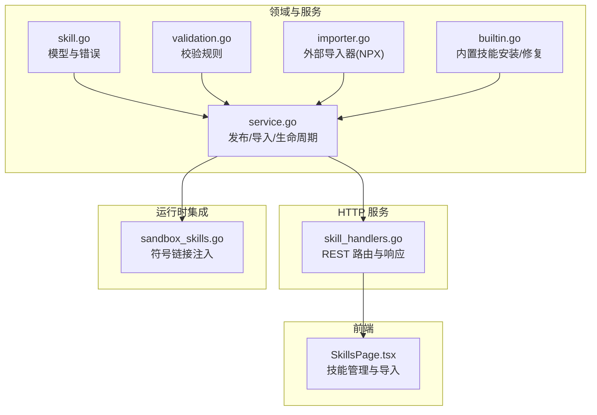
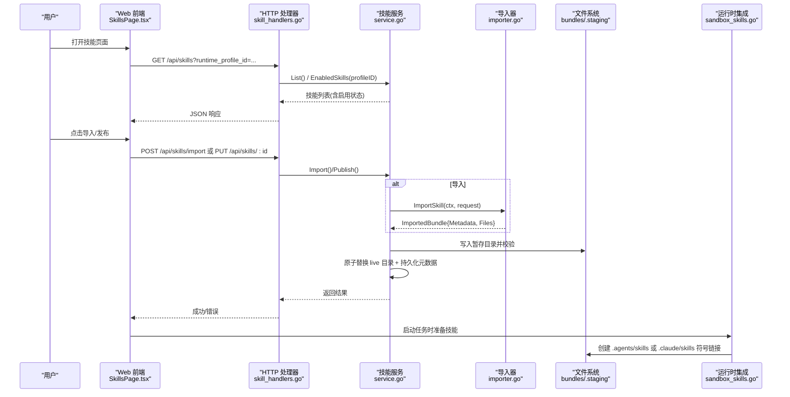
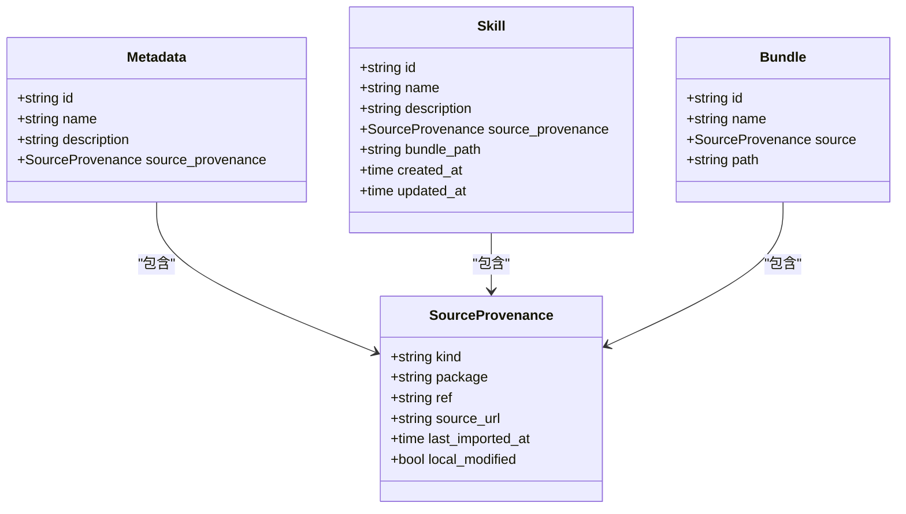
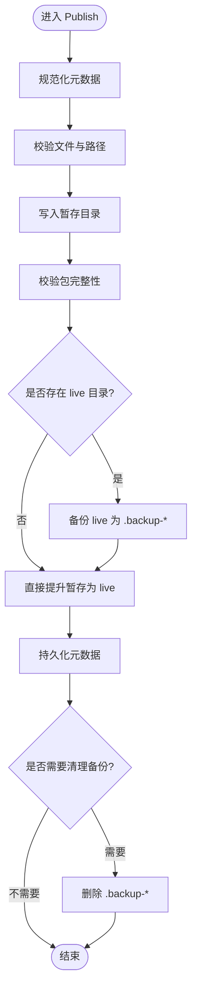
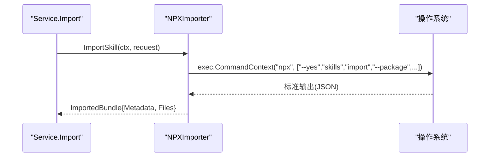
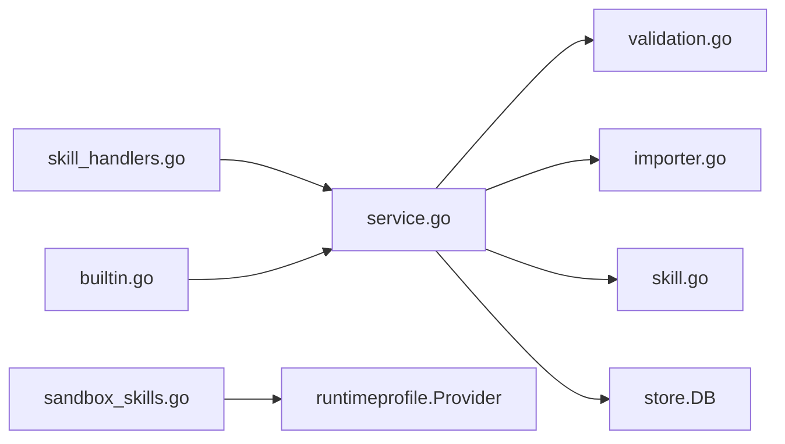

# 自定义技能开发

<cite>
**本文引用的文件**   
- [internal/skill/service.go](file://internal/skill/service.go)
- [internal/skill/skill.go](file://internal/skill/skill.go)
- [internal/skill/validation.go](file://internal/skill/validation.go)
- [internal/skill/importer.go](file://internal/skill/importer.go)
- [internal/skill/builtin.go](file://internal/skill/builtin.go)
- [internal/daemon/skill_handlers.go](file://internal/daemon/skill_handlers.go)
- [internal/runner/sandbox_skills.go](file://internal/runner/sandbox_skills.go)
- [internal/skill/builtins/assets/tooling-nmap/SKILL.md](file://internal/skill/builtins/assets/tooling-nmap/SKILL.md)
- [internal/skill/builtins/assets/vulnerabilities-sql-injection/SKILL.md](file://internal/skill/builtins/assets/vulnerabilities-sql-injection/SKILL.md)
- [.claude/skills/playwright-cli/SKILL.md](file://.claude/skills/playwright-cli/SKILL.md)
- [web/src/pages/SkillsPage.tsx](file://web/src/pages/SkillsPage.tsx)
- [internal/skill/skill_test.go](file://internal/skill/skill_test.go)
</cite>

## 目录
1. [简介](#简介)
2. [项目结构](#项目结构)
3. [核心组件](#核心组件)
4. [架构总览](#架构总览)
5. [详细组件分析](#详细组件分析)
6. [依赖关系分析](#依赖关系分析)
7. [性能与可观测性](#性能与可观测性)
8. [故障排查指南](#故障排查指南)
9. [结论](#结论)
10. [附录：SKILL.md 编写规范与示例](#附录skillmd-编写规范与示例)

## 简介
本指南面向希望从零开始开发“自定义技能包”的工程师，覆盖从项目初始化、SKILL.md 编写、依赖管理到测试策略的全流程。文档同时解释技能的生命周期（发布、导入、启用/禁用、删除）、导入导出机制、验证流程与错误处理，并提供完整的工作流、调试技巧与性能优化建议。内容基于代码仓库中的实际实现进行提炼，确保可操作性与准确性。

## 项目结构
技能系统由以下关键部分组成：
- 领域模型与校验：定义技能的元数据、来源追溯、错误类型以及包结构与路径校验规则。
- 服务层：负责技能的发布、导入、查询、启用/禁用、删除等核心操作，包含原子化发布与回滚保障。
- 内置技能：随守护进程打包的技能集合，支持安装、修复与清理。
- HTTP API：暴露技能列表、详情、发布、导入、启用/禁用、删除等接口。
- 运行时集成：将技能以符号链接方式注入沙箱工作目录与提供者主目录，供 Claude/Codex/Pi 等运行时发现。
- Web 前端：提供技能库浏览、搜索、过滤、启用/禁用与导入操作的界面。

图表来源
- [internal/skill/skill.go:1-47](file://internal/skill/skill.go#L1-L47)
- [internal/skill/validation.go:1-79](file://internal/skill/validation.go#L1-L79)
- [internal/skill/service.go:1-458](file://internal/skill/service.go#L1-L458)
- [internal/skill/builtin.go:1-360](file://internal/skill/builtin.go#L1-L360)
- [internal/skill/importer.go:1-47](file://internal/skill/importer.go#L1-L47)
- [internal/daemon/skill_handlers.go:1-221](file://internal/daemon/skill_handlers.go#L1-L221)
- [internal/runner/sandbox_skills.go:1-93](file://internal/runner/sandbox_skills.go#L1-L93)
- [web/src/pages/SkillsPage.tsx:51-81](file://web/src/pages/SkillsPage.tsx#L51-L81)

章节来源
- [internal/skill/service.go:1-458](file://internal/skill/service.go#L1-L458)
- [internal/skill/skill.go:1-47](file://internal/skill/skill.go#L1-L47)
- [internal/skill/validation.go:1-79](file://internal/skill/validation.go#L1-L79)
- [internal/skill/builtin.go:1-360](file://internal/skill/builtin.go#L1-L360)
- [internal/skill/importer.go:1-47](file://internal/skill/importer.go#L1-L47)
- [internal/daemon/skill_handlers.go:1-221](file://internal/daemon/skill_handlers.go#L1-L221)
- [internal/runner/sandbox_skills.go:1-93](file://internal/runner/sandbox_skills.go#L1-L93)
- [web/src/pages/SkillsPage.tsx:51-81](file://web/src/pages/SkillsPage.tsx#L51-L81)

## 核心组件
- 模型与错误
  - 元数据与来源追溯：ID、名称、描述、来源种类（如 npm、builtin、manual）、包名、版本引用、来源 URL、最近导入时间、本地修改标记。
  - 错误类型：无效技能、未找到、已启用（阻止删除）。
- 校验器
  - ID 格式正则约束；名称必填；包根必须为目录；SKILL.md 必须存在且非软链；禁止软链；相对路径不可逃逸根目录。
- 服务层
  - 发布：写入暂存目录 → 校验 → 原子替换 live 目录 → 持久化元数据；失败时回滚。
  - 导入：通过 Importer 接口拉取远程包（默认 NPXImporter），合并来源信息后调用发布。
  - 查询：按 ID 获取、列出全部、按运行配置读取“已启用”列表。
  - 启用/禁用：基于 profile 维度的 opt-out 表控制是否对某运行配置生效。
  - 删除：若仍被启用则拒绝（除非强制）；事务删除记录并清理 bundle 目录。
- 内置技能
  - 扫描嵌入资源，解析 SKILL.md 前导元数据，安装缺失项，修复来源与元数据，清理废弃旧 ID。
- HTTP 处理器
  - 列表/详情/发布/导入/删除/启用或禁用；统一错误映射；内置技能对外隐藏敏感 UPSTREAM.md。
- 运行时集成
  - 根据 Provider 在任务工作目录与提供者主目录创建 skills 符号链接，指向统一的技能根目录。

章节来源
- [internal/skill/skill.go:1-47](file://internal/skill/skill.go#L1-L47)
- [internal/skill/validation.go:1-79](file://internal/skill/validation.go#L1-L79)
- [internal/skill/service.go:1-458](file://internal/skill/service.go#L1-L458)
- [internal/skill/builtin.go:1-360](file://internal/skill/builtin.go#L1-L360)
- [internal/daemon/skill_handlers.go:1-221](file://internal/daemon/skill_handlers.go#L1-L221)
- [internal/runner/sandbox_skills.go:1-93](file://internal/runner/sandbox_skills.go#L1-L93)

## 架构总览
下图展示了从前端到后端再到运行时的端到端流程：用户在前端管理技能，后端通过服务层完成发布/导入/启停，运行时将技能注入沙箱以供 Agent 使用。

图表来源
- [web/src/pages/SkillsPage.tsx:51-81](file://web/src/pages/SkillsPage.tsx#L51-L81)
- [internal/daemon/skill_handlers.go:1-221](file://internal/daemon/skill_handlers.go#L1-L221)
- [internal/skill/service.go:1-458](file://internal/skill/service.go#L1-L458)
- [internal/skill/importer.go:1-47](file://internal/skill/importer.go#L1-L47)
- [internal/runner/sandbox_skills.go:1-93](file://internal/runner/sandbox_skills.go#L1-L93)

## 详细组件分析

### 组件一：技能模型与校验
- 模型要点
  - ID 需符合严格命名规范；Name 必填；Source 字段用于追踪来源（kind/package/ref/source_url/last_imported_at/local_modified）。
- 校验要点
  - 包根必须是目录；SKILL.md 必须存在且非软链；遍历所有文件禁止软链；相对路径不得出现空段、. 或 ..，防止路径穿越。
- 复杂度
  - 校验为 O(N) 遍历包内文件；正则匹配与字符串处理开销极小。

图表来源
- [internal/skill/skill.go:1-47](file://internal/skill/skill.go#L1-L47)

章节来源
- [internal/skill/skill.go:1-47](file://internal/skill/skill.go#L1-L47)
- [internal/skill/validation.go:1-79](file://internal/skill/validation.go#L1-L79)

### 组件二：服务层（发布/导入/生命周期）
- 发布流程
  - 规范化元数据 → 校验文件 → 写入暂存目录 → 校验包 → 备份现有 live → 原子重命名为新 live → 持久化元数据 → 清理备份。
  - 任何阶段失败均触发恢复逻辑，保证 live 一致性。
- 导入流程
  - 校验请求参数 → 调用 Importer（默认 NPXImporter）→ 合并来源信息 → 调用 Publish。
- 启用/禁用
  - 基于 profile 维度的 opt-out 表维护“未启用”集合；EnabledSkills 查询排除 opt-out。
- 删除
  - 若仍有 profile 启用该技能则拒绝（除非 force_disable=true）；事务删除 opt-out 与记录，再删除 bundle 目录。

图表来源
- [internal/skill/service.go:57-113](file://internal/skill/service.go#L57-L113)

章节来源
- [internal/skill/service.go:57-113](file://internal/skill/service.go#L57-L113)
- [internal/skill/service.go:115-142](file://internal/skill/service.go#L115-L142)
- [internal/skill/service.go:218-282](file://internal/skill/service.go#L218-L282)
- [internal/skill/service.go:301-356](file://internal/skill/service.go#L301-L356)

### 组件三：导入器（NPXImporter）
- 行为
  - 固定命令形状：npx --yes skills import --package <pkg> [--ref <ref>] [--source-url <url>] --json。
  - 输出结构化 JSON，解码为 ImportedBundle。
- 错误处理
  - 子进程退出码错误时返回带 stderr 文本的错误；其他 IO 错误包装返回。

图表来源
- [internal/skill/importer.go:18-46](file://internal/skill/importer.go#L18-L46)

章节来源
- [internal/skill/importer.go:1-47](file://internal/skill/importer.go#L1-47)

### 组件四：内置技能安装与修复
- 功能
  - 扫描嵌入资源，解析 SKILL.md 前导元数据（name/description）。
  - 若不存在则安装；若存在但来源为 builtin，则修复元数据与来源，并补全缺失 bundle。
  - 清理废弃旧 ID 与替代映射，迁移 opt-out 关系。
- 安全
  - 仅允许合法相对路径；禁止软链；只读嵌入资源。

章节来源
- [internal/skill/builtin.go:66-103](file://internal/skill/builtin.go#L66-L103)
- [internal/skill/builtin.go:164-220](file://internal/skill/builtin.go#L164-L220)
- [internal/skill/builtin.go:222-265](file://internal/skill/builtin.go#L222-L265)
- [internal/skill/builtin.go:267-360](file://internal/skill/builtin.go#L267-L360)

### 组件五：HTTP API 与错误映射
- 路由
  - 列表：GET /api/skills?runtime_profile_id=...
  - 详情：GET /api/skills/:skill_id
  - 发布：PUT /api/skills/:skill_id
  - 导入：POST /api/skills/import
  - 删除：DELETE /api/skills/:skill_id?force_disable=...
  - 启用/禁用：PUT/DELETE /api/skills/:skill_id/profiles/:profile_id/opt-out
- 错误映射
  - ErrInvalidSkill → 400；ErrNotFound → 404；ErrEnabled → 409；其余 → 500。
- 内置技能保护
  - 对外返回时过滤 UPSTREAM.md，避免泄露上游信息。

章节来源
- [internal/daemon/skill_handlers.go:31-110](file://internal/daemon/skill_handlers.go#L31-L110)
- [internal/daemon/skill_handlers.go:111-165](file://internal/daemon/skill_handlers.go#L111-L165)
- [internal/daemon/skill_handlers.go:167-221](file://internal/daemon/skill_handlers.go#L167-L221)

### 组件六：运行时集成（符号链接注入）
- 目标
  - 在任务工作目录与提供者主目录下创建 skills 符号链接，指向统一技能根目录。
- Provider 差异
  - Claude Code：.claude/skills
  - Codex/Pi：.agents/skills 或 agent/skills
- 幂等
  - 若链接已存在则跳过，避免覆盖用户自定义。

章节来源
- [internal/runner/sandbox_skills.go:14-81](file://internal/runner/sandbox_skills.go#L14-L81)

## 依赖关系分析
- 模块耦合
  - skill_handlers 依赖 service；service 依赖 store.DB 与 importer；builtin 依赖 embed.FS 与 service；sandbox_skills 依赖 runtimeprofile.Provider。
- 外部依赖
  - NPXImporter 依赖 npx 工具链；运行时依赖宿主文件系统与符号链接能力。
- 潜在循环
  - 当前无循环依赖；各层职责清晰。

图表来源
- [internal/daemon/skill_handlers.go:1-221](file://internal/daemon/skill_handlers.go#L1-L221)
- [internal/skill/service.go:1-458](file://internal/skill/service.go#L1-L458)
- [internal/skill/validation.go:1-79](file://internal/skill/validation.go#L1-L79)
- [internal/skill/importer.go:1-47](file://internal/skill/importer.go#L1-L47)
- [internal/skill/builtin.go:1-360](file://internal/skill/builtin.go#L1-L360)
- [internal/runner/sandbox_skills.go:1-93](file://internal/runner/sandbox_skills.go#L1-L93)

章节来源
- [internal/daemon/skill_handlers.go:1-221](file://internal/daemon/skill_handlers.go#L1-L221)
- [internal/skill/service.go:1-458](file://internal/skill/service.go#L1-L458)
- [internal/skill/builtin.go:1-360](file://internal/skill/builtin.go#L1-L360)
- [internal/runner/sandbox_skills.go:1-93](file://internal/runner/sandbox_skills.go#L1-L93)

## 性能与可观测性
- 发布性能
  - 暂存目录写入与校验为线性复杂度；原子重命名几乎零拷贝，适合频繁更新。
- 导入性能
  - 受网络与 npx 执行影响；建议在 CI 中缓存 node_modules 与 npx 包。
- 运行时发现
  - 符号链接注入为 O(1) 操作；避免重复创建链接。
- 可观测性建议
  - 在导入与发布前后记录耗时与文件大小；对 npx 子进程输出限制大小并记录首尾行便于定位问题。

[本节为通用指导，不直接分析具体文件]

## 故障排查指南
- 常见错误与定位
  - 无效技能（400）：检查 ID 格式、名称是否为空、包内是否存在软链或路径穿越。
  - 未找到（404）：确认 ID 正确、bundle 目录存在。
  - 已启用（409）：删除前需先禁用或在请求中设置 force_disable=true。
  - 导入失败：检查 npx 是否可用、包名与 ref 是否正确、网络连通性。
- 调试技巧
  - 查看暂存目录与 live 目录差异，确认原子替换是否生效。
  - 使用前端 Skills 页面筛选“已禁用”，快速定位 opt-out 配置。
  - 在运行时侧检查 .agents/skills 或 .claude/skills 符号链接是否指向预期路径。
- 参考用例
  - 单元测试覆盖了有效/非法包、原子发布、启用/禁用与删除生命周期。

章节来源
- [internal/daemon/skill_handlers.go:200-221](file://internal/daemon/skill_handlers.go#L200-L221)
- [internal/skill/skill_test.go:16-93](file://internal/skill/skill_test.go#L16-L93)
- [internal/skill/skill_test.go:95-151](file://internal/skill/skill_test.go#L95-L151)

## 结论
通过标准化的模型与校验、原子化的发布流程、可扩展的导入器与清晰的 HTTP API，技能系统提供了稳定、安全且易用的自定义技能管理能力。结合运行时符号链接注入，技能可在多种 Agent 环境中无缝发现与使用。遵循本文的开发工作流与最佳实践，可高效构建高质量的可复用技能包。

[本节为总结，不直接分析具体文件]

## 附录：SKILL.md 编写规范与示例
- 基本结构
  - 顶部前导元数据块（YAML 风格）：name、description。
  - 正文：攻击面、检测方法、关键漏洞、绕过技术、测试方法、验证步骤、误报说明、影响评估、提示与总结等。
- 安全与可自动化
  - 明确超时、重试、端口范围等边界条件；给出最小可行命令与失败恢复策略。
- 示例参考
  - 工具类技能：nmap 用法、两阶段扫描、安全基线命令。
  - 漏洞类技能：SQL 注入检测与利用方法、盲注与 OAST 通道、ORM 注入点。
  - 浏览器自动化技能：playwright-cli 常用命令、快照与调试、会话与存储管理。

章节来源
- [internal/skill/builtins/assets/tooling-nmap/SKILL.md:1-67](file://internal/skill/builtins/assets/tooling-nmap/SKILL.md#L1-L67)
- [internal/skill/builtins/assets/vulnerabilities-sql-injection/SKILL.md:1-191](file://internal/skill/builtins/assets/vulnerabilities-sql-injection/SKILL.md#L1-L191)
- [.claude/skills/playwright-cli/SKILL.md:1-421](file://.claude/skills/playwright-cli/SKILL.md#L1-L421)