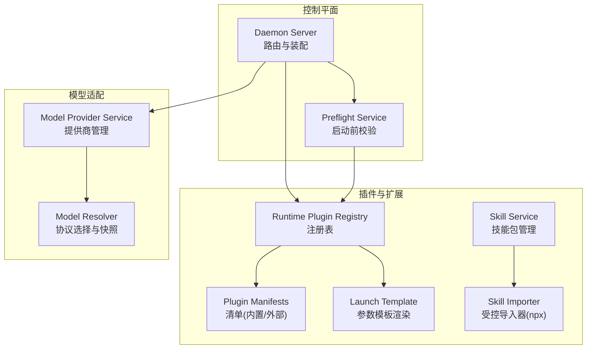
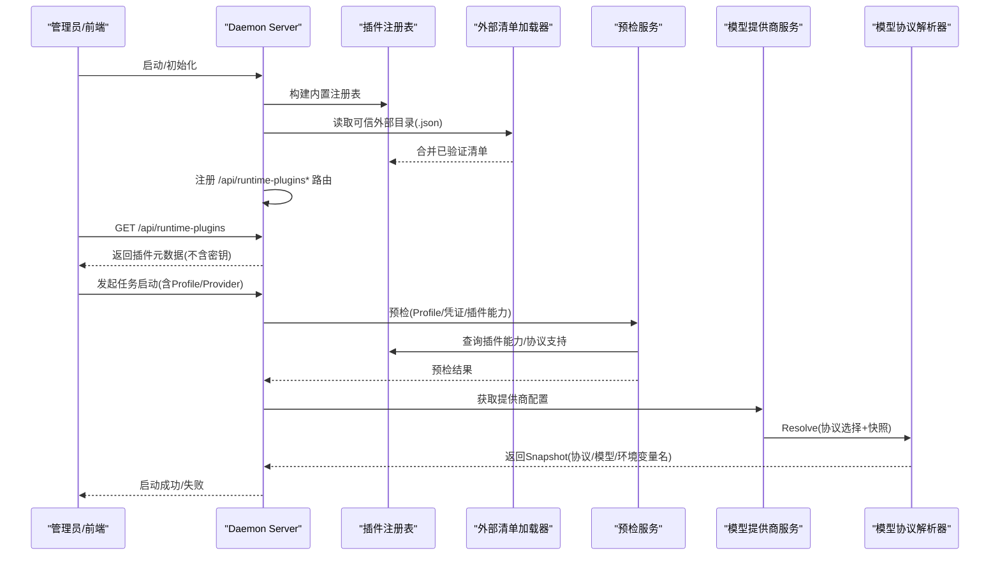
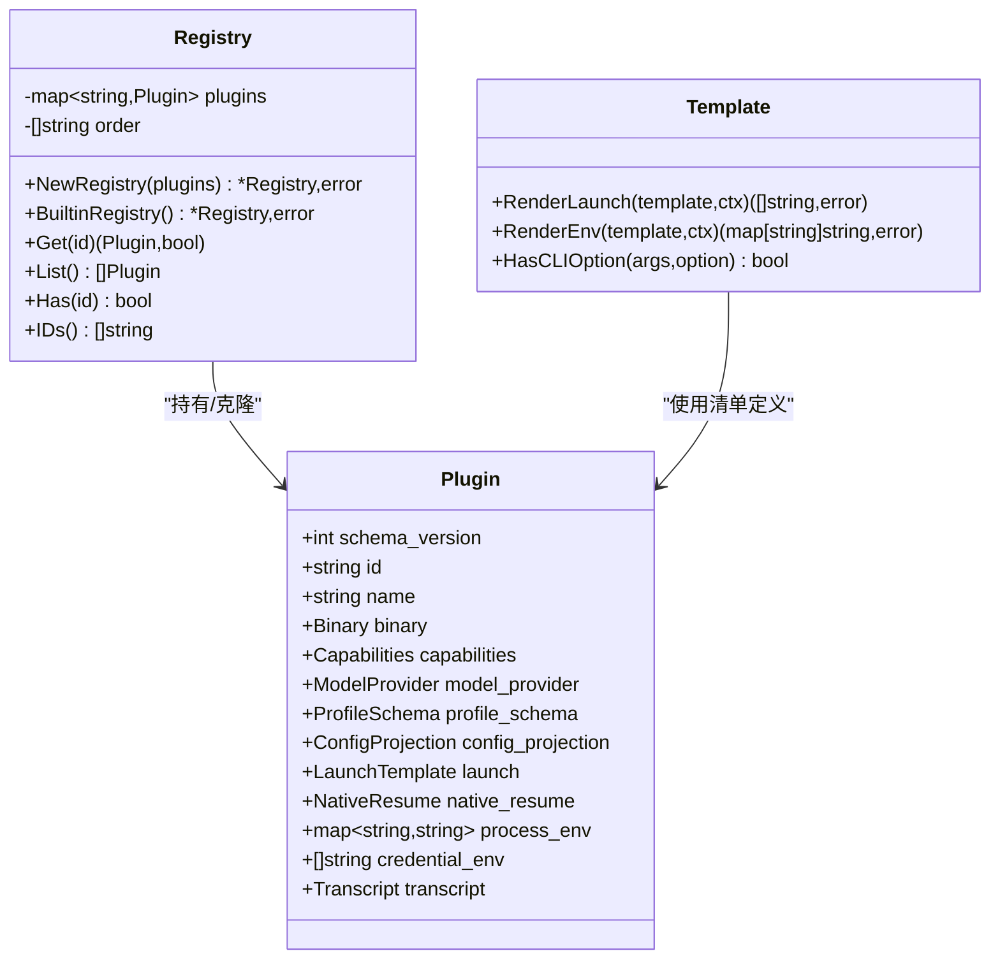
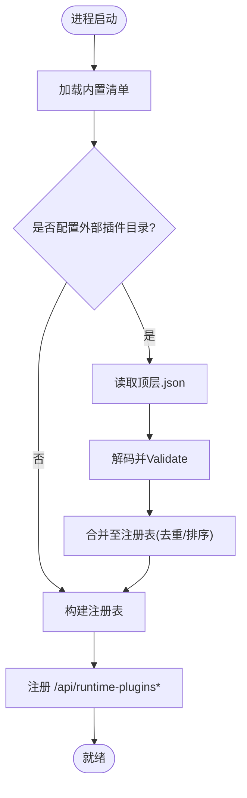
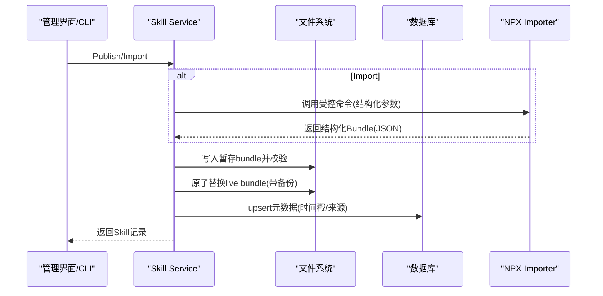
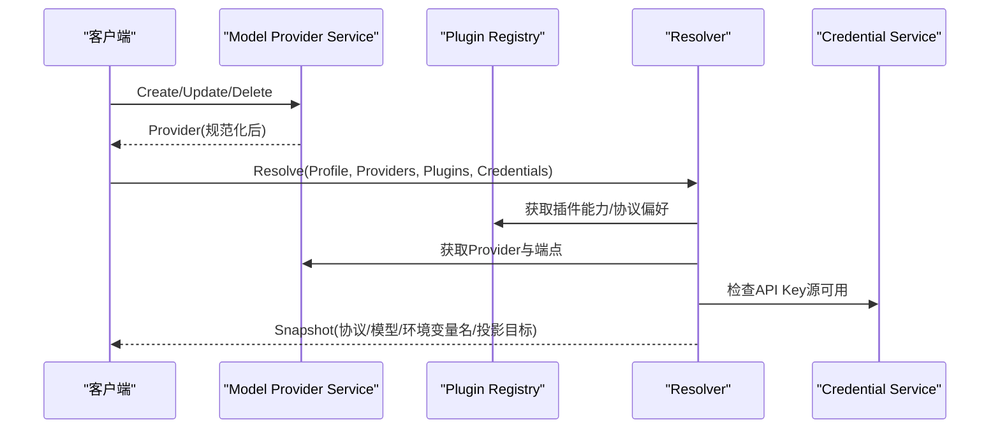
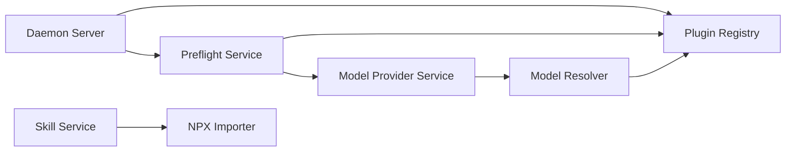

# 插件架构与扩展机制

<cite>
**本文引用的文件**   
- [README.md](file://README.md)
- [CONTEXT.md](file://CONTEXT.md)
- [plugin.go](file://internal/runtimeplugin/plugin.go)
- [registry.go](file://internal/runtimeplugin/registry.go)
- [builtin.go](file://internal/runtimeplugin/builtin.go)
- [template.go](file://internal/runtimeplugin/template.go)
- [loader.go](file://internal/runtimeplugin/loader.go)
- [runtime_plugin_handlers.go](file://internal/daemon/runtime_plugin_handlers.go)
- [server.go](file://internal/daemon/server.go)
- [preflight.go](file://internal/preflight/preflight.go)
- [resolver.go](file://internal/modelprovider/resolver.go)
- [modelprovider.go](file://internal/modelprovider/modelprovider.go)
- [service.go](file://internal/skill/service.go)
- [importer.go](file://internal/skill/importer.go)
</cite>

## 目录
1. [简介](#简介)
2. [项目结构](#项目结构)
3. [核心组件](#核心组件)
4. [架构总览](#架构总览)
5. [详细组件分析](#详细组件分析)
6. [依赖关系分析](#依赖关系分析)
7. [性能考量](#性能考量)
8. [故障排查指南](#故障排查指南)
9. [结论](#结论)
10. [附录：开发规范与示例](#附录开发规范与示例)

## 简介
本文件系统性阐述 CyberPenda 的插件架构与扩展机制，覆盖运行时插件（Runtime Plugin）、技能包（Skill）、模型提供商适配器（Model Provider）以及扩展加载、注册、生命周期管理。文档面向开发者与运维人员，提供从设计到落地的完整说明，包括接口契约、安全边界、版本兼容性与部署指南。

## 项目结构
CyberPenda 采用“控制平面 + 记忆平面 + 执行平面”的分层设计：
- 控制平面：Daemon HTTP/MCP 服务、任务编排、预检、配置投影
- 记忆平面：Blackboard v2（不在本文展开）
- 执行平面：Sandbox/Host Runner、Runtime Plugin 声明式适配、Transcript 解析

与插件体系相关的核心目录与文件：
- internal/runtimeplugin：运行时插件清单、注册表、模板渲染、内置插件
- internal/daemon：HTTP 路由与插件 API 暴露
- internal/preflight：启动前校验（包含插件能力检查）
- internal/modelprovider：模型提供商管理与协议选择
- internal/skill：技能包发布、导入、启用/禁用、打包投影

图表来源
- [server.go:204-234](file://internal/daemon/server.go#L204-L234)
- [preflight.go:95-132](file://internal/preflight/preflight.go#L95-L132)
- [registry.go:1-99](file://internal/runtimeplugin/registry.go#L1-L99)
- [builtin.go:1-221](file://internal/runtimeplugin/builtin.go#L1-L221)
- [template.go:1-166](file://internal/runtimeplugin/template.go#L1-L166)
- [modelprovider.go:1-745](file://internal/modelprovider/modelprovider.go#L1-L745)
- [resolver.go:1-145](file://internal/modelprovider/resolver.go#L1-L145)
- [service.go:1-458](file://internal/skill/service.go#L1-L458)
- [importer.go:1-47](file://internal/skill/importer.go#L1-L47)

章节来源
- [README.md:1-173](file://README.md#L1-L173)

## 核心组件
- 运行时插件（Runtime Plugin）
  - 以清单（Manifest）描述二进制、能力、模型协议支持、配置投影、启动参数模板、转录解析器、原生续跑等
  - 通过注册表集中管理，支持内置与可信外部目录加载
  - 提供公开 API 列出/查询插件元数据
- 技能包（Skill）
  - 运行时无关的可复用内容包，支持发布、导入、启用/禁用、按 Profile 生效
  - 受控导入器（npx skills import）保障导入过程可审计与安全
- 模型提供商适配器（Model Provider）
  - 全局非敏感模型服务配置，支持多端点、协议枚举、目录刷新
  - 与 Runtime Plugin 协作完成协议选择与运行期快照生成

章节来源
- [plugin.go:1-224](file://internal/runtimeplugin/plugin.go#L1-L224)
- [registry.go:1-99](file://internal/runtimeplugin/registry.go#L1-L99)
- [builtin.go:1-221](file://internal/runtimeplugin/builtin.go#L1-L221)
- [loader.go:1-49](file://internal/runtimeplugin/loader.go#L1-L49)
- [runtime_plugin_handlers.go:1-34](file://internal/daemon/runtime_plugin_handlers.go#L1-L34)
- [service.go:1-458](file://internal/skill/service.go#L1-L458)
- [importer.go:1-47](file://internal/skill/importer.go#L1-L47)
- [modelprovider.go:1-745](file://internal/modelprovider/modelprovider.go#L1-L745)
- [resolver.go:1-145](file://internal/modelprovider/resolver.go#L1-L145)

## 架构总览
下图展示插件发现、加载、注册、API 暴露、预检与模型协议选择的整体流程。

图表来源
- [server.go:204-234](file://internal/daemon/server.go#L204-L234)
- [runtime_plugin_handlers.go:1-34](file://internal/daemon/runtime_plugin_handlers.go#L1-L34)
- [loader.go:1-49](file://internal/runtimeplugin/loader.go#L1-L49)
- [registry.go:1-99](file://internal/runtimeplugin/registry.go#L1-L99)
- [preflight.go:95-132](file://internal/preflight/preflight.go#L95-L132)
- [resolver.go:1-145](file://internal/modelprovider/resolver.go#L1-L145)
- [modelprovider.go:1-745](file://internal/modelprovider/modelprovider.go#L1-L745)

## 详细组件分析

### 运行时插件（Runtime Plugin）
- 清单结构与校验
  - 字段涵盖：schema_version、id、name、binary、capabilities、model_provider、profile_schema、config_projection、launch、native_resume、process_env、credential_env、transcript
  - 严格白名单校验：ID 格式、必填项、未知类型/原语/协议/解析器、重复字段、凭据环境变量命名规则、单例选项合法性
- 注册表
  - 支持内置清单与外部可信目录加载；构造时去重并排序，Get/List 返回副本避免共享可变状态
- 模板渲染
  - 支持标量与列表占位符替换、可选参数省略、单例选项抑制默认值、空值过滤
- 内置插件
  - 提供 fake、codex、claude_code、pi 等典型运行时家族的能力、协议偏好、配置投影路径、启动参数与环境变量约定
- 外部清单加载
  - 仅读取顶层 .json，逐文件解码与校验，错误聚合上报

图表来源
- [plugin.go:1-224](file://internal/runtimeplugin/plugin.go#L1-L224)
- [registry.go:1-99](file://internal/runtimeplugin/registry.go#L1-L99)
- [template.go:1-166](file://internal/runtimeplugin/template.go#L1-L166)

章节来源
- [plugin.go:136-214](file://internal/runtimeplugin/plugin.go#L136-L214)
- [registry.go:13-27](file://internal/runtimeplugin/registry.go#L13-L27)
- [template.go:13-44](file://internal/runtimeplugin/template.go#L13-L44)
- [builtin.go:18-213](file://internal/runtimeplugin/builtin.go#L18-L213)
- [loader.go:13-47](file://internal/runtimeplugin/loader.go#L13-L47)

### 插件 API 与生命周期
- 生命周期阶段
  - 发现：内置清单 + 外部可信目录扫描
  - 加载：JSON 解码与 Validate 校验
  - 注册：注册表维护稳定有序 ID 列表
  - 暴露：GET /api/runtime-plugins 与 /api/runtime-plugins/{id}
  - 消费：预检、Profile 校验、Launch 参数渲染、Transcript 解析器选择
- 安全边界
  - 对外只返回公共元数据，不包含已解析的凭据值
  - 外部清单需显式信任目录，禁止递归与任意脚本执行

图表来源
- [builtin.go:1-221](file://internal/runtimeplugin/builtin.go#L1-L221)
- [loader.go:1-49](file://internal/runtimeplugin/loader.go#L1-L49)
- [registry.go:1-99](file://internal/runtimeplugin/registry.go#L1-L99)
- [runtime_plugin_handlers.go:1-34](file://internal/daemon/runtime_plugin_handlers.go#L1-L34)

章节来源
- [runtime_plugin_handlers.go:9-33](file://internal/daemon/runtime_plugin_handlers.go#L9-L33)
- [server.go:204-234](file://internal/daemon/server.go#L204-L234)

### 技能包（Skill）
- 能力概览
  - 发布：写入暂存区 -> 校验 -> 原子替换为 live bundle -> 持久化元数据
  - 导入：受控调用 npx skills import，结构化输入，拒绝 shell 注入
  - 启用/禁用：按 Profile 维度记录 opt-out，默认开启
  - 删除：若仍被启用则阻止，除非强制禁用
- 安全与一致性
  - 禁止符号链接、限制相对路径、备份回滚策略、事务性更新元数据

图表来源
- [service.go:57-113](file://internal/skill/service.go#L57-L113)
- [service.go:115-142](file://internal/skill/service.go#L115-L142)
- [service.go:301-356](file://internal/skill/service.go#L301-L356)
- [importer.go:18-46](file://internal/skill/importer.go#L18-L46)

章节来源
- [service.go:1-458](file://internal/skill/service.go#L1-L458)
- [importer.go:1-47](file://internal/skill/importer.go#L1-L47)

### 模型提供商适配器（Model Provider）
- 功能要点
  - 创建/更新/删除：规范化 base_url、endpoints、catalog；防止操作后缀误用；冲突检测
  - 目录刷新：基于 OpenAI-family 端点派生 /v1/models 地址，拉取模型列表并合并
  - 协议选择：结合 Runtime Plugin 的 supported_protocols 与 protocol_preference，优先用户 pin，其次偏好顺序
  - 快照生成：输出 endpoint_base_url、protocol、model、api_key_env、projection_target 等
- 与插件协同
  - 通过 runtime plugin 的 config_projection.primitive 决定目标投影原语
  - 预检阶段校验 API Key 源可用性（环境变量或凭证绑定）

图表来源
- [modelprovider.go:92-117](file://internal/modelprovider/modelprovider.go#L92-L117)
- [modelprovider.go:223-284](file://internal/modelprovider/modelprovider.go#L223-L284)
- [resolver.go:54-101](file://internal/modelprovider/resolver.go#L54-L101)
- [resolver.go:118-137](file://internal/modelprovider/resolver.go#L118-L137)

章节来源
- [modelprovider.go:1-745](file://internal/modelprovider/modelprovider.go#L1-L745)
- [resolver.go:1-145](file://internal/modelprovider/resolver.go#L1-L145)

## 依赖关系分析
- 耦合与内聚
  - runtimeplugin 自包含清单/注册表/模板，低耦合
  - daemon 通过注入 registry 与 preflight 组合装配
  - modelprovider 与 runtimeplugin 通过协议白名单与偏好进行弱耦合协作
- 外部依赖
  - 容器 CLI（docker/podman）用于 Sandbox Runner（不在本节代码范围）
  - npx skills import 作为受控导入入口
- 潜在循环依赖
  - 当前分层清晰，未见循环引用

图表来源
- [server.go:204-234](file://internal/daemon/server.go#L204-L234)
- [preflight.go:95-132](file://internal/preflight/preflight.go#L95-L132)
- [resolver.go:1-145](file://internal/modelprovider/resolver.go#L1-L145)
- [service.go:1-458](file://internal/skill/service.go#L1-L458)
- [importer.go:1-47](file://internal/skill/importer.go#L1-L47)

章节来源
- [server.go:204-234](file://internal/daemon/server.go#L204-L234)
- [preflight.go:95-132](file://internal/preflight/preflight.go#L95-L132)

## 性能考量
- 注册表构造一次性完成，后续 Get/List 为 O(1)/O(n) 且返回副本，避免并发写竞争
- 模板渲染为线性扫描，占位符替换开销小；建议合理组织 Launch Args 减少冗余
- 技能发布采用暂存+原子替换，避免部分写入导致的不一致
- 模型目录刷新按需触发，避免频繁网络请求

[本节为通用指导，不直接分析具体文件]

## 故障排查指南
- 插件清单无效
  - 现象：注册表构建失败或外部清单加载报错
  - 排查：确认 schema_version、id/name/binary.default、profile field type、projection primitive、transcript parser、credential_env 命名是否符合白名单
  - 参考：清单校验逻辑与错误信息
- 外部清单未生效
  - 现象：自定义插件未出现在 /api/runtime-plugins
  - 排查：确认目录配置、文件位于顶层、扩展名为 .json、无 JSON 语法错误
- 启动预检失败
  - 现象：任务启动被预检拦截
  - 排查：检查模型提供商是否满足插件 requirement、协议是否兼容、API Key 环境变量是否可用
- 技能导入失败
  - 现象：npx skills import 报错
  - 排查：检查传入 package/ref/source-url 是否合法、npx 是否可用、导出 JSON 是否可解析

章节来源
- [plugin.go:136-214](file://internal/runtimeplugin/plugin.go#L136-L214)
- [loader.go:13-47](file://internal/runtimeplugin/loader.go#L13-L47)
- [preflight.go:119-128](file://internal/preflight/preflight.go#L119-L128)
- [resolver.go:54-101](file://internal/modelprovider/resolver.go#L54-L101)
- [importer.go:18-46](file://internal/skill/importer.go#L18-L46)

## 结论
CyberPenda 的插件体系以“声明式清单 + 注册表 + 模板渲染”为核心，配合技能包的受控导入与模型提供商的协议抽象，实现了高内聚、低耦合、可扩展的执行生态。通过严格的校验与安全边界，确保在本地优先场景下的可控与可审计。

[本节为总结，不直接分析具体文件]

## 附录：开发规范与示例

### 运行时插件开发规范
- 清单要求
  - schema_version=1；id 符合正则；name 非空；binary.default 必填
  - profile_schema.fields.type 必须来自白名单；无重复字段名
  - config_projection.primitive 必须为已知原语；transcript.parser 必须为已知解析器
  - model_provider.requirement 为 none/optional/required；supported_protocols 与 preference 必须在白名单内
  - credential_env 仅允许变量名，不得包含值片段
- 模板与参数
  - 使用 {{key}} 占位符；支持列表与标量；注意单例选项抑制默认值
  - 避免引入敏感值；凭据通过环境变量名由运行时注入
- 能力声明
  - sandbox/host/mcp_config/streaming_transcript/resume 等能力如实声明，影响预检与 UI 行为

章节来源
- [plugin.go:98-134](file://internal/runtimeplugin/plugin.go#L98-L134)
- [plugin.go:136-214](file://internal/runtimeplugin/plugin.go#L136-L214)
- [template.go:13-44](file://internal/runtimeplugin/template.go#L13-L44)

### 外部插件清单加载与注册
- 将自定义清单放入受信任目录（仅顶层 .json）
- 启动时自动加载并合并至注册表；可通过 /api/runtime-plugins 查看
- 若出现重复 id 或校验失败，将在加载阶段报错并跳过该清单

章节来源
- [loader.go:13-47](file://internal/runtimeplugin/loader.go#L13-L47)
- [registry.go:13-27](file://internal/runtimeplugin/registry.go#L13-L27)
- [runtime_plugin_handlers.go:9-33](file://internal/daemon/runtime_plugin_handlers.go#L9-L33)

### 技能包开发与导入
- 包结构
  - 根目录为 skill id；包含 SKILL.md 与必要资源；禁止符号链接
- 发布流程
  - 暂存 -> 校验 -> 原子替换 -> 持久化元数据
- 导入方式
  - 通过 NPXImporter 调用 npx skills import，传入结构化参数，禁止 shell 拼接

章节来源
- [service.go:57-113](file://internal/skill/service.go#L57-L113)
- [service.go:178-216](file://internal/skill/service.go#L178-L216)
- [importer.go:18-46](file://internal/skill/importer.go#L18-L46)

### 模型提供商与协议选择
- 配置端点
  - 使用 base_url 与 endpoints 列表；禁止操作后缀；Anthropic 端点自动去除末段路径
- 目录刷新
  - 基于 OpenAI-family 端点派生 /v1/models；合并手动与刷新后的模型列表
- 协议选择
  - 优先用户 pin；否则按插件 protocol_preference 顺序匹配；不兼容则报错

章节来源
- [modelprovider.go:425-457](file://internal/modelprovider/modelprovider.go#L425-L457)
- [modelprovider.go:479-496](file://internal/modelprovider/modelprovider.go#L479-L496)
- [resolver.go:118-137](file://internal/modelprovider/resolver.go#L118-L137)

### 部署与运行提示
- 插件目录
  - 通过命令行参数或环境变量指定受信任的运行时插件目录
- 认证与监听
  - 非回环绑定需设置认证令牌；默认监听地址见 README
- 沙箱镜像
  - 可通过环境变量覆盖沙箱镜像标签

章节来源
- [README.md:110-126](file://README.md#L110-L126)