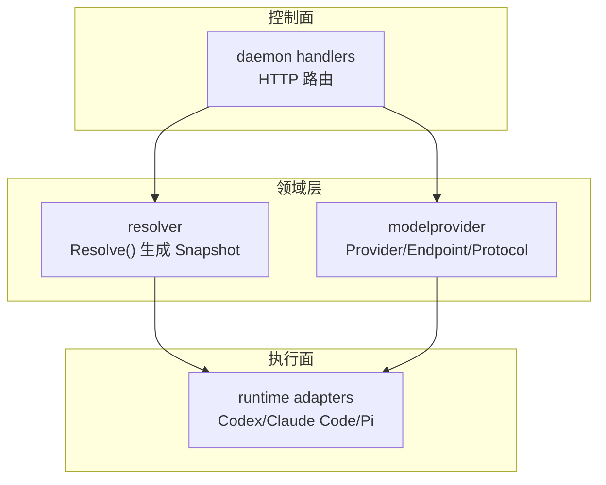
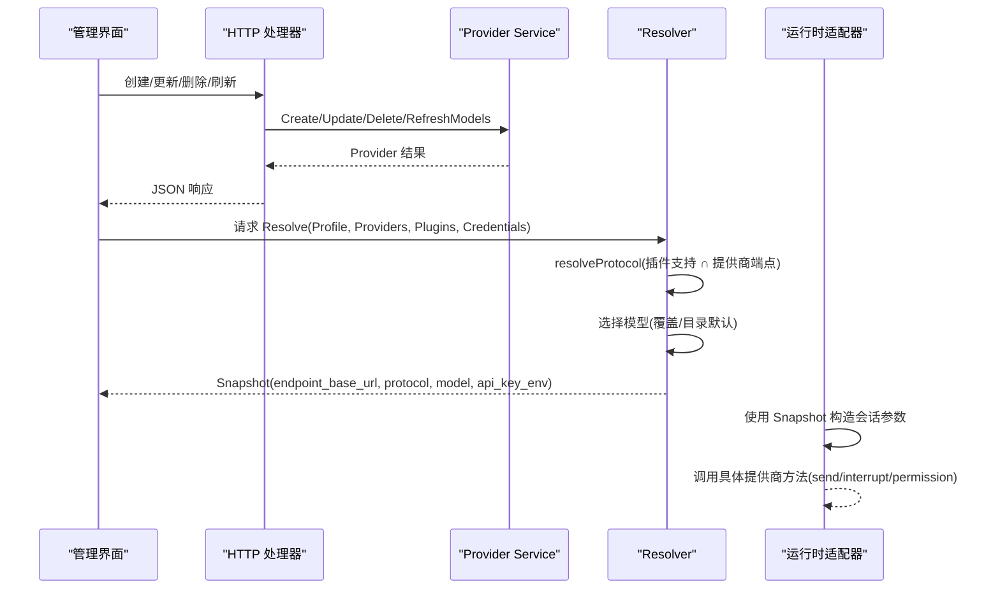
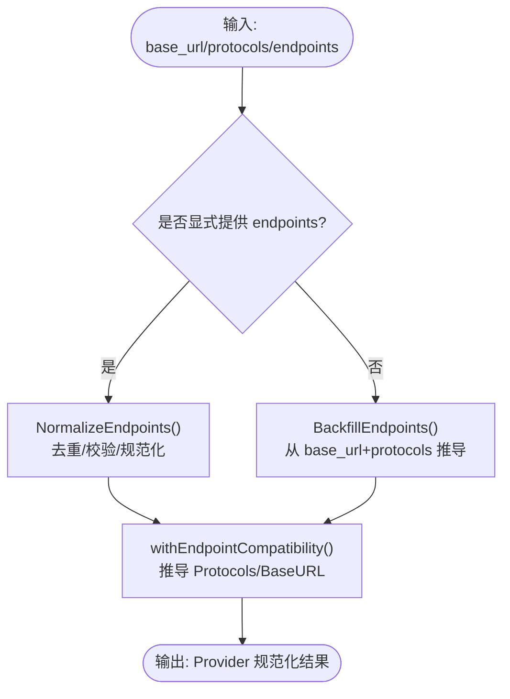
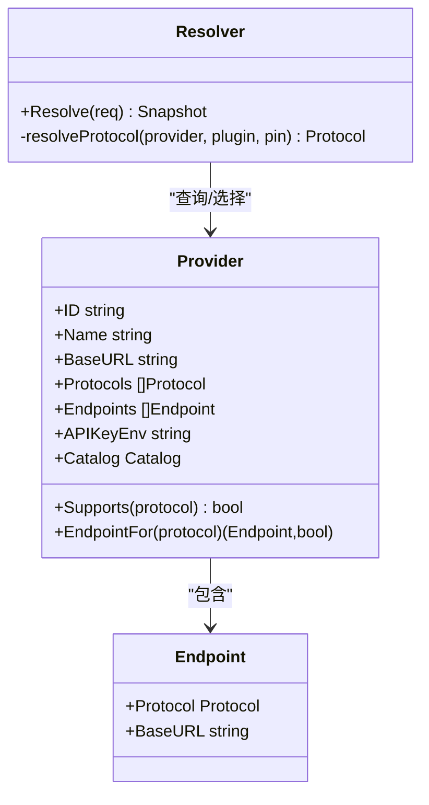
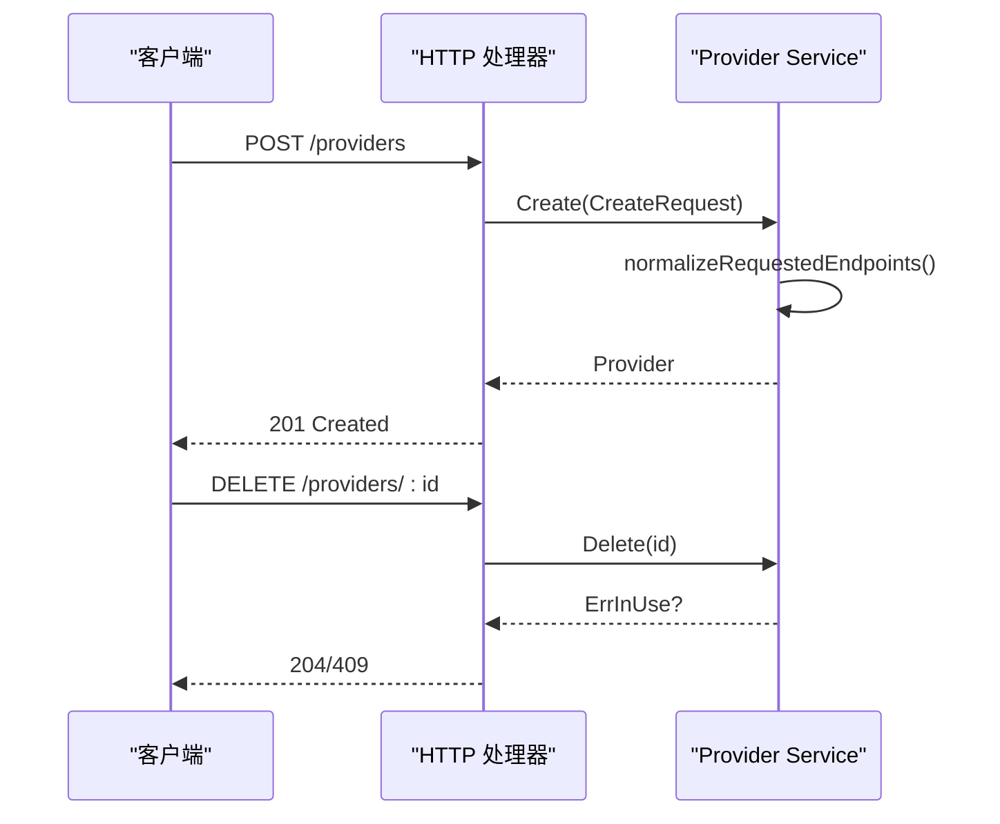
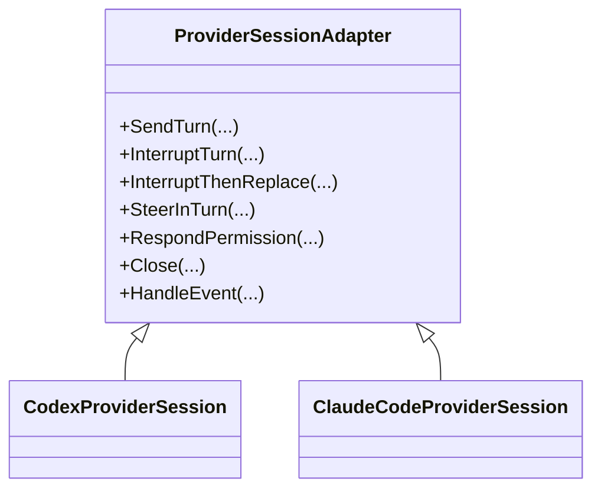
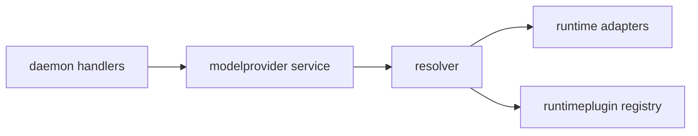

# 提供商架构设计

<cite>
**本文引用的文件**   
- [internal/modelprovider/modelprovider.go](file://internal/modelprovider/modelprovider.go)
- [internal/modelprovider/resolver.go](file://internal/modelprovider/resolver.go)
- [internal/daemon/modelprovider_handlers.go](file://internal/daemon/modelprovider_handlers.go)
- [internal/runtime/provider_adapters.go](file://internal/runtime/provider_adapters.go)
- [CONTEXT.md](file://CONTEXT.md)
</cite>

## 目录
1. [简介](#简介)
2. [项目结构](#项目结构)
3. [核心组件](#核心组件)
4. [架构总览](#架构总览)
5. [详细组件分析](#详细组件分析)
6. [依赖关系分析](#依赖关系分析)
7. [性能与可扩展性](#性能与可扩展性)
8. [故障排查指南](#故障排查指南)
9. [结论](#结论)
10. [附录](#附录)

## 简介
本文件聚焦 CyberPenda 的“模型提供商统一抽象层”设计，围绕 Provider、Endpoint、Protocol 等核心数据结构展开，系统阐述：
- 提供商发现机制（基于运行时插件声明的协议支持）
- 协议适配层（将不同 LLM 厂商 API 契约归一化为统一的会话与事件语义）
- 端点管理与配置规范化（URL 规范化、操作后缀校验、端点回填）
- 提供商生命周期管理（创建/更新/删除、引用保护、模型目录刷新）
- 依赖检查与错误处理策略（预检、环境密钥解析、兼容性与冲突检测）

目标是帮助开发者快速理解并扩展新的模型提供商与协议。

## 项目结构
与提供商抽象层直接相关的代码分布在以下模块：
- internal/modelprovider：领域模型、CRUD 服务、规范化与目录刷新
- internal/modelprovider/resolver.go：按运行时插件能力选择协议、生成快照
- internal/daemon/modelprovider_handlers.go：HTTP 接口暴露 CRUD 与刷新
- internal/runtime/provider_adapters.go：面向具体提供商的会话适配器（Codex/Claude Code/Pi）

图表来源
- [internal/modelprovider/modelprovider.go:46-56](file://internal/modelprovider/modelprovider.go#L46-L56)
- [internal/modelprovider/resolver.go:54-101](file://internal/modelprovider/resolver.go#L54-L101)
- [internal/daemon/modelprovider_handlers.go:27-86](file://internal/daemon/modelprovider_handlers.go#L27-L86)
- [internal/runtime/provider_adapters.go:717-800](file://internal/runtime/provider_adapters.go#L717-L800)

章节来源
- [internal/modelprovider/modelprovider.go:1-745](file://internal/modelprovider/modelprovider.go#L1-745)
- [internal/modelprovider/resolver.go:1-145](file://internal/modelprovider/resolver.go#L1-145)
- [internal/daemon/modelprovider_handlers.go:1-155](file://internal/daemon/modelprovider_handlers.go#L1-155)
- [internal/runtime/provider_adapters.go:1-800](file://internal/runtime/provider_adapters.go#L1-L800)
- [CONTEXT.md:219-237](file://CONTEXT.md#L219-L237)

## 核心组件
- Protocol：受支持的模型协议集合（如 openai_chat_completions、openai_responses、anthropic_messages），用于在运行时插件与提供商之间建立兼容性约束。
- Endpoint：绑定一个协议与其基础 URL（不含操作后缀），由管理界面或迁移工具维护。
- Provider：全局可复用的非机密模型服务配置，包含 ID、名称、基础 URL、端点列表、API Key 环境变量名、模型目录等。
- Catalog：存储模型标识符（手动与刷新两类）及默认模型，驱动下拉选择与覆盖逻辑。
- Resolver.Resolve：根据运行时插件能力、用户选择与提供商配置，解析出一次启动所需的 Snapshot（含 endpoint_base_url、protocol、model、api_key_env 等）。

这些类型共同构成“多提供商统一抽象层”，屏蔽底层差异，向上提供一致的发现、选择与投影能力。

章节来源
- [internal/modelprovider/modelprovider.go:21-56](file://internal/modelprovider/modelprovider.go#L21-L56)
- [internal/modelprovider/modelprovider.go:35-56](file://internal/modelprovider/modelprovider.go#L35-L56)
- [internal/modelprovider/resolver.go:25-45](file://internal/modelprovider/resolver.go#L25-L45)

## 架构总览
下图展示了从 HTTP 管理到运行时执行的端到端流程：管理端通过 HTTP 接口创建/更新提供商；解析器结合运行时插件能力选择协议并生成快照；运行时适配器将快照映射为具体提供商的会话参数与方法调用。

图表来源
- [internal/daemon/modelprovider_handlers.go:27-122](file://internal/daemon/modelprovider_handlers.go#L27-L122)
- [internal/modelprovider/modelprovider.go:92-117](file://internal/modelprovider/modelprovider.go#L92-L117)
- [internal/modelprovider/resolver.go:54-101](file://internal/modelprovider/resolver.go#L54-L101)
- [internal/runtime/provider_adapters.go:717-800](file://internal/runtime/provider_adapters.go#L717-L800)

## 详细组件分析

### 数据模型与规范化
- 协议白名单与去重：仅允许受支持的协议，重复项被忽略。
- 端点规范化：
  - 去除末尾斜杠，保留路径前缀（如 /v1、/api/anthropic）。
  - 拒绝已知操作后缀（messages、responses、chat/completions），避免将完整操作 URL 误存为基础 URL。
  - 当未显式提供端点时，支持从旧 base_url + protocols 自动回填端点，并对 anthropic_messages 做最终路径段裁剪以适配其版本化消息路径。
- 兼容性推导：
  - 若存在端点列表，则从端点推导 Protocols 与兼容 BaseURL。
  - 读取历史数据时进行向后兼容回填与规范化。
- 模型目录刷新：
  - 优先使用 OpenAI-family 端点（openai_chat_completions > openai_responses）作为源，拼接 /v1/models 获取模型列表。
  - 合并刷新结果与手动条目，保持去重与排序。

图表来源
- [internal/modelprovider/modelprovider.go:401-457](file://internal/modelprovider/modelprovider.go#L401-L457)
- [internal/modelprovider/modelprovider.go:530-559](file://internal/modelprovider/modelprovider.go#L530-L559)
- [internal/modelprovider/modelprovider.go:479-496](file://internal/modelprovider/modelprovider.go#L479-L496)

章节来源
- [internal/modelprovider/modelprovider.go:372-457](file://internal/modelprovider/modelprovider.go#L372-L457)
- [internal/modelprovider/modelprovider.go:530-559](file://internal/modelprovider/modelprovider.go#L530-L559)
- [internal/modelprovider/modelprovider.go:479-496](file://internal/modelprovider/modelprovider.go#L479-L496)

### 提供商发现与协议选择
- 运行时插件声明其支持的协议与偏好顺序。
- 解析器在“插件支持集 ∩ 提供商端点集”中查找：
  - 若用户在运行时配置中固定了协议，则必须同时满足插件支持与提供商端点。
  - 否则按插件的协议偏好顺序选择第一个兼容协议。
- 若无法找到兼容协议，返回不兼容错误，阻止启动。

图表来源
- [internal/modelprovider/modelprovider.go:46-56](file://internal/modelprovider/modelprovider.go#L46-L56)
- [internal/modelprovider/modelprovider.go:699-718](file://internal/modelprovider/modelprovider.go#L699-L718)
- [internal/modelprovider/resolver.go:118-137](file://internal/modelprovider/resolver.go#L118-L137)

章节来源
- [internal/modelprovider/resolver.go:54-101](file://internal/modelprovider/resolver.go#L54-L101)
- [internal/modelprovider/resolver.go:118-137](file://internal/modelprovider/resolver.go#L118-L137)

### 端点管理与配置规范化流程
- 创建/更新：
  - 支持两种模式：显式 endpoints 列表；或 base_url + protocols 组合，内部自动回填端点。
  - 保存前进行规范化与兼容性推导，确保后端一致。
- 删除保护：
  - 若仍有运行时配置文件引用该提供商，禁止删除，防止破坏现有任务。
- 模型目录刷新：
  - 从提供商的环境变量中读取 API Key，向 OpenAI-family 模型的 /v1/models 发起请求，合并结果。

图表来源
- [internal/daemon/modelprovider_handlers.go:27-51](file://internal/daemon/modelprovider_handlers.go#L27-L51)
- [internal/daemon/modelprovider_handlers.go:88-95](file://internal/daemon/modelprovider_handlers.go#L88-L95)
- [internal/modelprovider/modelprovider.go:92-117](file://internal/modelprovider/modelprovider.go#L92-L117)
- [internal/modelprovider/modelprovider.go:200-221](file://internal/modelprovider/modelprovider.go#L200-L221)

章节来源
- [internal/daemon/modelprovider_handlers.go:27-122](file://internal/daemon/modelprovider_handlers.go#L27-L122)
- [internal/modelprovider/modelprovider.go:92-117](file://internal/modelprovider/modelprovider.go#L92-L117)
- [internal/modelprovider/modelprovider.go:200-221](file://internal/modelprovider/modelprovider.go#L200-L221)

### 提供商生命周期管理
- 创建：生成稳定 ID、派生 API Key 环境变量名、写入数据库。
- 更新：选择性字段更新；若只改 base_url/protocols 而未提供 endpoints，则自动回填；合并目录。
- 删除：先检查引用计数，再物理删除。
- 刷新：按环境密钥访问上游模型列表，失败不覆盖已有目录。

章节来源
- [internal/modelprovider/modelprovider.go:92-117](file://internal/modelprovider/modelprovider.go#L92-L117)
- [internal/modelprovider/modelprovider.go:146-198](file://internal/modelprovider/modelprovider.go#L146-L198)
- [internal/modelprovider/modelprovider.go:200-221](file://internal/modelprovider/modelprovider.go#L200-L221)
- [internal/modelprovider/modelprovider.go:223-284](file://internal/modelprovider/modelprovider.go#L223-L284)

### 协议适配层与会话管理
- 统一会话抽象：
  - providerSessionAdapter 封装发送、中断、权限响应、轮询结算等通用逻辑，屏蔽各提供商差异。
  - 具体提供商（Codex、Claude Code、Pi）仅提供 wire 方法映射与参数组装。
- 事件归一化：
  - 将不同提供商的事件名映射为统一的生命周期状态（started/acknowledged/settled/completed/failed 等）。
- 运行期选择：
  - 每次 Turn 可独立选择模型提供商、模型与推理强度；对 Codex/Claude Code，切换提供商会触发重新投影与重启。

图表来源
- [internal/runtime/provider_adapters.go:58-92](file://internal/runtime/provider_adapters.go#L58-L92)
- [internal/runtime/provider_adapters.go:126-200](file://internal/runtime/provider_adapters.go#L126-L200)
- [internal/runtime/provider_adapters.go:717-800](file://internal/runtime/provider_adapters.go#L717-L800)

章节来源
- [internal/runtime/provider_adapters.go:58-92](file://internal/runtime/provider_adapters.go#L58-L92)
- [internal/runtime/provider_adapters.go:126-200](file://internal/runtime/provider_adapters.go#L126-L200)
- [internal/runtime/provider_adapters.go:717-800](file://internal/runtime/provider_adapters.go#L717-L800)

### 依赖检查与错误处理策略
- 预检（Preflight）：
  - 缺失提供商、不兼容协议、缺失模型、缺失 API Key 环境变量均会导致启动失败。
- 错误分类与映射：
  - 未找到、缺少必填字段、无效协议、重复协议、非法端点 URL、被引用不可删除等错误分别映射为 4xx/409/500。
- 幂等与冲突：
  - 会话层对同一 RequestID 的并发冲突进行检测与缓存命中，避免重复下发原生帧。

章节来源
- [internal/modelprovider/resolver.go:47-52](file://internal/modelprovider/resolver.go#L47-L52)
- [internal/daemon/modelprovider_handlers.go:139-154](file://internal/daemon/modelprovider_handlers.go#L139-L154)
- [internal/runtime/provider_adapters.go:461-510](file://internal/runtime/provider_adapters.go#L461-L510)

## 依赖关系分析
- 低耦合高内聚：
  - modelprovider 包专注领域模型与持久化，resolver 负责跨层选择，daemon handlers 仅做 HTTP 编排，runtime adapters 专注协议映射。
- 关键依赖链：
  - daemon handlers → modelprovider service → resolver → runtime adapters
  - runtime adapters 依赖运行时插件注册表以获取能力与协议偏好

图表来源
- [internal/daemon/modelprovider_handlers.go:27-86](file://internal/daemon/modelprovider_handlers.go#L27-L86)
- [internal/modelprovider/resolver.go:139-145](file://internal/modelprovider/resolver.go#L139-L145)
- [internal/runtime/provider_adapters.go:717-800](file://internal/runtime/provider_adapters.go#L717-L800)

章节来源
- [internal/daemon/modelprovider_handlers.go:1-155](file://internal/daemon/modelprovider_handlers.go#L1-L155)
- [internal/modelprovider/resolver.go:1-145](file://internal/modelprovider/resolver.go#L1-L145)
- [internal/runtime/provider_adapters.go:1-800](file://internal/runtime/provider_adapters.go#L1-L800)

## 性能与可扩展性
- 性能要点：
  - 端点与协议选择为 O(n) 线性扫描，n 为端点数/协议数，通常很小，开销可忽略。
  - 模型目录刷新为外部 I/O，建议异步与重试，失败不覆盖已有目录。
- 可扩展性建议：
  - 新增协议：在协议白名单中添加新值，并在运行时插件清单中声明支持。
  - 新增提供商：实现对应适配器（wire 方法与参数映射），复用统一会话抽象。
  - 端点规范：遵循“基础 URL 不含操作后缀”的规则，避免后续运行时拼接错误。

[本节为通用指导，无需源码引用]

## 故障排查指南
- 常见错误与定位：
  - 404 未找到：提供商 ID 不存在。
  - 400 参数错误：缺少名称/基础 URL、协议不支持、端点协议重复、端点 URL 包含操作后缀。
  - 409 冲突：提供商仍被运行时配置文件引用，需先解除引用再删除。
  - 预检失败：缺少 API Key 环境变量、不兼容协议、模型不在目录中。
- 诊断步骤：
  - 查看 HTTP 响应码与错误信息。
  - 确认提供商端点是否为“基础 URL”（不含 messages/responses/chat/completions）。
  - 检查环境变量是否已设置，或通过凭证绑定生效。
  - 若刷新模型目录失败，确认上游 /v1/models 可达且鉴权正确。

章节来源
- [internal/daemon/modelprovider_handlers.go:139-154](file://internal/daemon/modelprovider_handlers.go#L139-L154)
- [internal/modelprovider/modelprovider.go:425-434](file://internal/modelprovider/modelprovider.go#L425-L434)
- [internal/modelprovider/resolver.go:84-90](file://internal/modelprovider/resolver.go#L84-L90)

## 结论
CyberPenda 的多提供商统一抽象层通过清晰的领域模型（Provider/Endpoint/Protocol）、严格的配置规范化、基于运行时插件能力的协议选择与统一的会话适配，实现了“配置即能力、协议即契约”的可扩展架构。开发者只需关注协议映射与插件声明，即可低成本接入新的模型提供商。

[本节为总结，无需源码引用]

## 附录
- 术语对照（节选）：
  - Model Provider Endpoint：提供商端点，记录协议与基础 URL
  - Normalized Model Protocol Base URL：规范化后的协议基础 URL
  - Model Override：运行时配置中的模型覆盖
  - Reasoning Effort：推理强度（low/medium/high/xhigh/max）

章节来源
- [CONTEXT.md:219-237](file://CONTEXT.md#L219-L237)