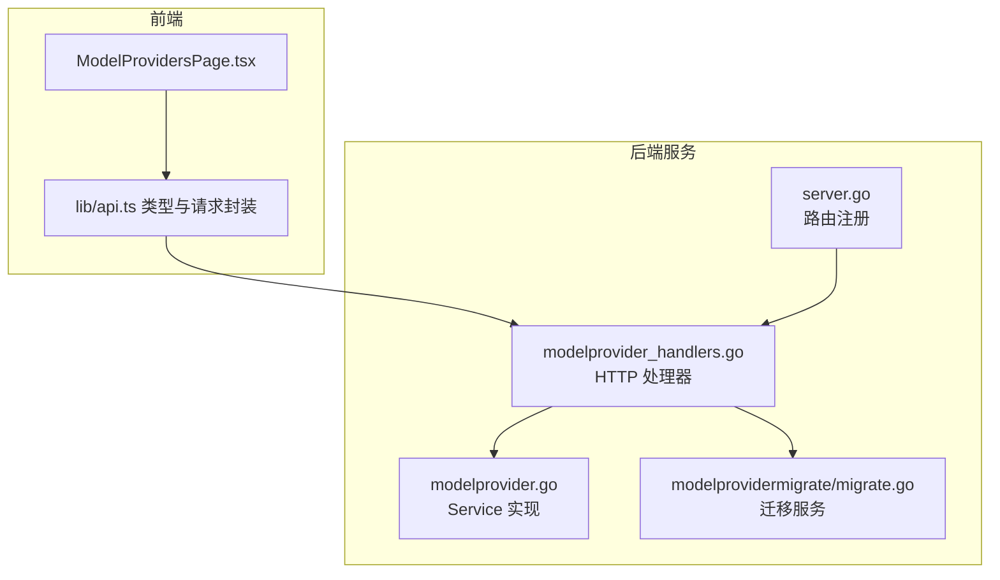
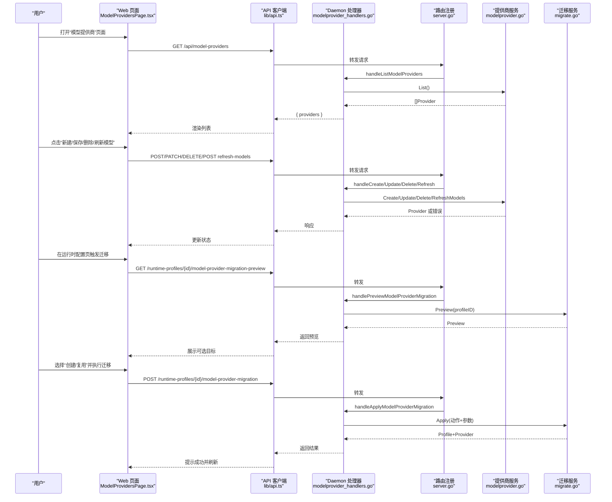
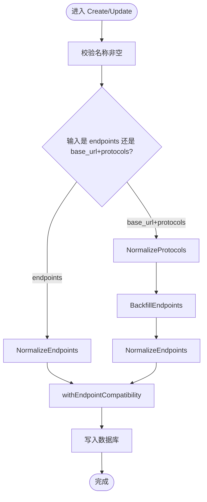
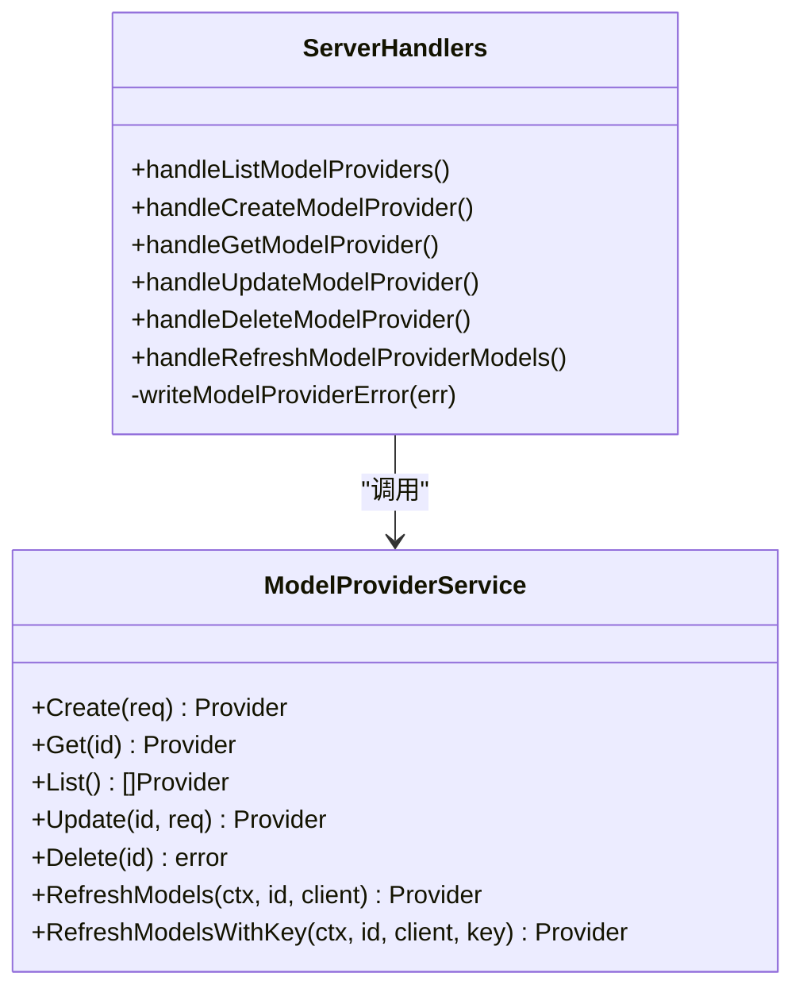
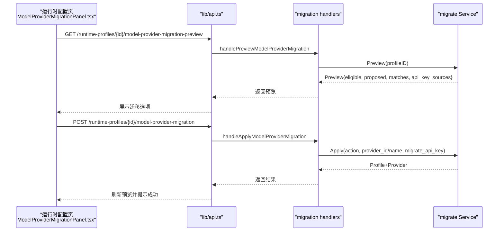
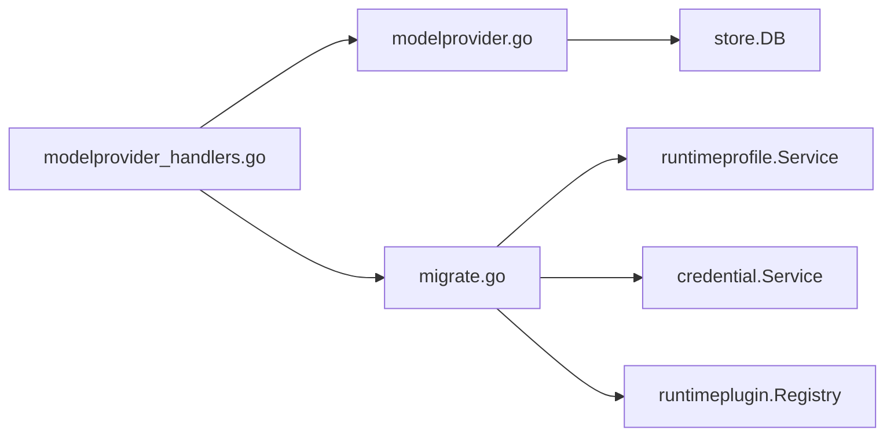

# 提供商管理

<cite>
**本文引用的文件**   
- [internal/modelprovider/modelprovider.go](file://internal/modelprovider/modelprovider.go)
- [internal/daemon/modelprovider_handlers.go](file://internal/daemon/modelprovider_handlers.go)
- [internal/daemon/server.go](file://internal/daemon/server.go)
- [web/src/pages/ModelProvidersPage.tsx](file://web/src/pages/ModelProvidersPage.tsx)
- [web/src/lib/api.ts](file://web/src/lib/api.ts)
- [internal/daemon/modelprovider_migration_handlers.go](file://internal/daemon/modelprovider_migration_handlers.go)
- [web/src/pages/ModelProviderMigrationPanel.tsx](file://web/src/pages/ModelProviderMigrationPanel.tsx)
- [internal/modelprovidermigrate/migrate.go](file://internal/modelprovidermigrate/migrate.go)
</cite>

## 目录
1. [简介](#简介)
2. [项目结构](#项目结构)
3. [核心组件](#核心组件)
4. [架构总览](#架构总览)
5. [详细组件分析](#详细组件分析)
6. [依赖关系分析](#依赖关系分析)
7. [性能与扩展性](#性能与扩展性)
8. [故障排除指南](#故障排除指南)
9. [结论](#结论)
10. [附录：API 参考](#附录api-参考)

## 简介
本文件面向“模型服务提供商（Model Provider）”的管理能力，覆盖创建、更新、删除、查询、配置校验、依赖检查、批量操作与迁移工具的使用说明。同时提供 Web 界面与 API 接口的使用方法、权限控制要点、审计日志与备份恢复的关联说明，以及常见管理场景的操作步骤与排障方法。

## 项目结构
提供商管理涉及后端服务层、HTTP 路由与处理器、前端页面与类型定义、以及迁移工具链。整体组织如下：
- 后端领域与服务：modelprovider 包负责数据模型、CRUD、校验、刷新目录等逻辑
- HTTP 接口：daemon 包中的 modelprovider_handlers.go 暴露 REST 端点
- 路由注册：server.go 中统一挂载 /api/model-providers 相关路径
- 前端页面：ModelProvidersPage.tsx 提供可视化编辑、保存、刷新、删除等操作
- 迁移工具：modelprovidermigrate 包用于将旧版运行时配置迁移为可复用的 Model Provider

图表来源
- [internal/daemon/server.go:602-617](file://internal/daemon/server.go#L602-L617)
- [internal/daemon/modelprovider_handlers.go:13-122](file://internal/daemon/modelprovider_handlers.go#L13-L122)
- [internal/modelprovider/modelprovider.go:84-221](file://internal/modelprovider/modelprovider.go#L84-L221)
- [web/src/pages/ModelProvidersPage.tsx:86-223](file://web/src/pages/ModelProvidersPage.tsx#L86-L223)
- [web/src/lib/api.ts:83-97](file://web/src/lib/api.ts#L83-L97)

章节来源
- [internal/daemon/server.go:602-617](file://internal/daemon/server.go#L602-L617)
- [internal/daemon/modelprovider_handlers.go:13-122](file://internal/daemon/modelprovider_handlers.go#L13-L122)
- [internal/modelprovider/modelprovider.go:84-221](file://internal/modelprovider/modelprovider.go#L84-L221)
- [web/src/pages/ModelProvidersPage.tsx:86-223](file://web/src/pages/ModelProvidersPage.tsx#L86-L223)
- [web/src/lib/api.ts:83-97](file://web/src/lib/api.ts#L83-L97)

## 核心组件
- 数据模型与约束
  - Provider：包含 id、name、base_url、protocols/endpoints、api_key_env、catalog、时间戳等字段
  - Endpoint：protocol + base_url 的组合，支持 OpenAI Chat Completions、OpenAI Responses、Anthropic Messages
  - Catalog：manual/refreshed/default_model 三要素，去重排序并维护默认模型
- Service 能力
  - Create/Update/Delete/List/Get：完整的 CRUD
  - RefreshModels/RefreshModelsWithKey：调用上游 /v1/models 刷新 catalog.refreshed
  - 规范化与校验：NormalizeBaseURL、NormalizeProtocols、NormalizeEndpoints、BackfillEndpoints、CatalogRefreshURL 等
  - 依赖检查：Delete 前检查是否被 runtime profile 引用
- 认证与凭据
  - api_key_env 由 provider ID 派生，结合 credential 系统解析实际密钥值
- 迁移工具
  - Preview/Apply：从旧版运行时配置提取 base_url、model、协议建议，生成或复用现有 Provider，并清理遗留字段

章节来源
- [internal/modelprovider/modelprovider.go:21-82](file://internal/modelprovider/modelprovider.go#L21-L82)
- [internal/modelprovider/modelprovider.go:92-221](file://internal/modelprovider/modelprovider.go#L92-L221)
- [internal/modelprovider/modelprovider.go:223-284](file://internal/modelprovider/modelprovider.go#L223-L284)
- [internal/modelprovider/modelprovider.go:372-496](file://internal/modelprovider/modelprovider.go#L372-L496)
- [internal/modelprovider/modelprovider.go:624-637](file://internal/modelprovider/modelprovider.go#L624-L637)
- [internal/modelprovidermigrate/migrate.go:100-170](file://internal/modelprovidermigrate/migrate.go#L100-L170)

## 架构总览
下图展示了从 Web 到后端的完整调用链路，包括提供商列表、创建、更新、删除、刷新模型目录，以及迁移预览与应用。

图表来源
- [internal/daemon/server.go:602-617](file://internal/daemon/server.go#L602-L617)
- [internal/daemon/modelprovider_handlers.go:13-122](file://internal/daemon/modelprovider_handlers.go#L13-L122)
- [internal/modelprovider/modelprovider.go:92-221](file://internal/modelprovider/modelprovider.go#L92-L221)
- [internal/daemon/modelprovider_migration_handlers.go:12-50](file://internal/daemon/modelprovider_migration_handlers.go#L12-L50)
- [internal/modelprovidermigrate/migrate.go:100-170](file://internal/modelprovidermigrate/migrate.go#L100-L170)
- [web/src/pages/ModelProvidersPage.tsx:86-223](file://web/src/pages/ModelProvidersPage.tsx#L86-L223)
- [web/src/pages/ModelProviderMigrationPanel.tsx:29-83](file://web/src/pages/ModelProviderMigrationPanel.tsx#L29-L83)
- [web/src/lib/api.ts:83-97](file://web/src/lib/api.ts#L83-L97)

## 详细组件分析

### 提供商数据模型与校验流程
- 支持的协议常量与校验集合
- 规范化函数族：
  - NormalizeBaseURL：去除尾部斜杠、校验 scheme/host
  - NormalizeProtocols：去空、去重、白名单校验
  - NormalizeEndpoints：协议合法性、重复检测、endpoint base URL 校验
  - BackfillEndpoints：根据 base_url 与 protocols 推导各协议 endpoint
  - CatalogRefreshURL：基于 OpenAI-family endpoint 拼接 /v1/models
- 存储编码/解码：JSON 序列化 protocols/endpoints/catalog；读取时反序列化为结构化对象
- 兼容性与回退：withEndpointCompatibility 保证 endpoints 存在时 protocols/base_url 一致

图表来源
- [internal/modelprovider/modelprovider.go:92-117](file://internal/modelprovider/modelprovider.go#L92-L117)
- [internal/modelprovider/modelprovider.go:146-198](file://internal/modelprovider/modelprovider.go#L146-L198)
- [internal/modelprovider/modelprovider.go:372-457](file://internal/modelprovider/modelprovider.go#L372-L457)
- [internal/modelprovider/modelprovider.go:555-559](file://internal/modelprovider/modelprovider.go#L555-L559)

章节来源
- [internal/modelprovider/modelprovider.go:21-82](file://internal/modelprovider/modelprovider.go#L21-L82)
- [internal/modelprovider/modelprovider.go:92-117](file://internal/modelprovider/modelprovider.go#L92-L117)
- [internal/modelprovider/modelprovider.go:146-198](file://internal/modelprovider/modelprovider.go#L146-L198)
- [internal/modelprovider/modelprovider.go:372-457](file://internal/modelprovider/modelprovider.go#L372-L457)
- [internal/modelprovider/modelprovider.go:555-559](file://internal/modelprovider/modelprovider.go#L555-L559)

### HTTP 接口与错误映射
- 路由注册：/api/model-providers 系列端点
- 处理器职责：
  - handleListModelProviders：返回列表
  - handleCreateModelProvider：创建并返回新 Provider
  - handleGetModelProvider：按 id 获取
  - handleUpdateModelProvider：部分更新
  - handleDeleteModelProvider：删除（含依赖检查）
  - handleRefreshModelProviderModels：刷新模型目录（优先使用已解析的凭据）
- 错误映射：NotFound/BadRequest/Conflict/InternalServerError 对应不同业务错误

图表来源
- [internal/daemon/server.go:602-617](file://internal/daemon/server.go#L602-L617)
- [internal/daemon/modelprovider_handlers.go:13-155](file://internal/daemon/modelprovider_handlers.go#L13-L155)
- [internal/modelprovider/modelprovider.go:84-221](file://internal/modelprovider/modelprovider.go#L84-L221)

章节来源
- [internal/daemon/server.go:602-617](file://internal/daemon/server.go#L602-L617)
- [internal/daemon/modelprovider_handlers.go:13-155](file://internal/daemon/modelprovider_handlers.go#L13-L155)

### Web 界面交互
- 列表与搜索：加载所有 Provider，支持按名称、URL、key 环境变量等模糊搜索
- 新建/编辑：
  - 支持“快速设置”：填写 base_url + 勾选协议，自动生成各协议 endpoint
  - 支持“高级设置”：直接维护 endpoints 列表
  - 支持手动模型清单与默认模型选择
- 凭据绑定：
  - 通过 Credential Binding 将 api_key_env 指向本地凭证或外部源
  - 保存时会尝试将输入的明文 API Key 写入本地凭证绑定
- 刷新模型：调用 /refresh-models 拉取 refreshed 列表
- 删除：二次确认后删除

章节来源
- [web/src/pages/ModelProvidersPage.tsx:86-223](file://web/src/pages/ModelProvidersPage.tsx#L86-L223)
- [web/src/pages/ModelProvidersPage.tsx:412-607](file://web/src/pages/ModelProvidersPage.tsx#L412-L607)
- [web/src/pages/ModelProvidersPage.tsx:663-670](file://web/src/pages/ModelProvidersPage.tsx#L663-L670)
- [web/src/lib/api.ts:180-228](file://web/src/lib/api.ts#L180-L228)

### 迁移工具（旧配置 -> 可复用 Provider）
- 预览阶段：
  - 从运行时配置的 legacy 字段（endpoint/env/API keys）推断 base_url、model、协议建议
  - 列出匹配的已有 Provider（按 base_url 匹配）
  - 显示可能的 API Key 来源（内联、credential binding、环境变量）
- 应用阶段：
  - 选择“创建新 Provider”或“复用已有 Provider”
  - 可选择将内联 API Key 迁移至 Provider 的凭据绑定
  - 清理运行时配置中的 legacy 字段，写入新的 model_provider_id 与必要覆盖项

图表来源
- [web/src/pages/ModelProviderMigrationPanel.tsx:29-83](file://web/src/pages/ModelProviderMigrationPanel.tsx#L29-L83)
- [internal/daemon/modelprovider_migration_handlers.go:12-50](file://internal/daemon/modelprovider_migration_handlers.go#L12-L50)
- [internal/modelprovidermigrate/migrate.go:100-170](file://internal/modelprovidermigrate/migrate.go#L100-L170)

章节来源
- [web/src/pages/ModelProviderMigrationPanel.tsx:29-83](file://web/src/pages/ModelProviderMigrationPanel.tsx#L29-L83)
- [internal/daemon/modelprovider_migration_handlers.go:12-50](file://internal/daemon/modelprovider_migration_handlers.go#L12-L50)
- [internal/modelprovidermigrate/migrate.go:100-170](file://internal/modelprovidermigrate/migrate.go#L100-L170)

## 依赖关系分析
- 耦合与内聚
  - daemon 处理器仅负责 HTTP 编解码与错误映射，业务逻辑集中在 modelprovider.Service
  - 迁移服务组合了 profiles、providers、creds、plugins，形成清晰的编排边界
- 外部依赖
  - 数据库：SQLite（通过 store.DB）
  - 凭据系统：credential.Service 解析 env/绑定
  - 上游模型目录：OpenAI-family /v1/models
- 潜在循环依赖
  - 当前未见循环引用；迁移服务依赖 provider 服务，但 provider 不反向依赖迁移服务

图表来源
- [internal/daemon/modelprovider_handlers.go:13-122](file://internal/daemon/modelprovider_handlers.go#L13-L122)
- [internal/modelprovider/modelprovider.go:84-117](file://internal/modelprovider/modelprovider.go#L84-L117)
- [internal/modelprovidermigrate/migrate.go:76-98](file://internal/modelprovidermigrate/migrate.go#L76-L98)

章节来源
- [internal/daemon/modelprovider_handlers.go:13-122](file://internal/daemon/modelprovider_handlers.go#L13-L122)
- [internal/modelprovider/modelprovider.go:84-117](file://internal/modelprovider/modelprovider.go#L84-L117)
- [internal/modelprovidermigrate/migrate.go:76-98](file://internal/modelprovidermigrate/migrate.go#L76-L98)

## 性能与扩展性
- 列表与查询
  - 列表按 created_at 排序，适合分页扩展（当前未实现分页）
- 刷新目录
  - 网络 I/O 受上游限制，建议缓存 refreshed 列表并在 UI 上显示更新时间
- 规范化计算
  - BackfillEndpoints 与 NormalizeEndpoints 均为轻量计算，对性能影响可忽略
- 并发安全
  - 当前 Service 无全局锁，依赖数据库事务与唯一约束保障一致性

[本节为通用指导，无需源码引用]

## 故障排除指南
- 常见错误码与含义
  - 400 Bad Request：缺少 name/base_url、不支持的 protocol、endpoint 重复、endpoint base URL 非法
  - 404 Not Found：Provider 不存在
  - 409 Conflict：删除失败，因为被运行时配置引用
  - 500 Internal Server Error：内部错误（如数据库异常、上游刷新失败）
- 典型问题定位
  - 无法刷新模型目录：确认 api_key_env 已正确配置且上游可达
  - 删除报错：先解除运行时配置对该 Provider 的引用
  - 迁移不可用：运行时配置尚未包含 legacy 字段或未满足迁移条件
- 调试建议
  - 查看浏览器控制台与网络面板的请求/响应体
  - 在后端日志中检索对应错误消息

章节来源
- [internal/daemon/modelprovider_handlers.go:139-155](file://internal/daemon/modelprovider_handlers.go#L139-L155)
- [internal/modelprovider/modelprovider.go:74-82](file://internal/modelprovider/modelprovider.go#L74-L82)
- [internal/modelprovider/modelprovider.go:223-284](file://internal/modelprovider/modelprovider.go#L223-L284)

## 结论
提供商管理模块以清晰的服务分层与严格的输入校验为核心，配合 Web 界面的友好交互与迁移工具，实现了从旧配置到新架构的平滑过渡。建议在后续版本中补充分页、批量操作与更丰富的审计日志输出，以提升大规模环境下的运维效率。

[本节为总结，无需源码引用]

## 附录：API 参考
- 列表
  - GET /api/model-providers
  - 响应：{ providers: ModelProvider[] }
- 创建
  - POST /api/model-providers
  - 请求体：{ name, base_url, protocols, endpoints, catalog }
  - 响应：创建的 Provider
- 获取
  - GET /api/model-providers/{id}
  - 响应：Provider
- 更新
  - PATCH /api/model-providers/{id}
  - 请求体：{ name?, base_url?, protocols?, endpoints?, catalog? }
  - 响应：更新的 Provider
- 删除
  - DELETE /api/model-providers/{id}
  - 响应：204 No Content
- 刷新模型目录
  - POST /api/model-providers/{id}/refresh-models
  - 响应：更新的 Provider（catalog.refreshed 可能变化）
- 迁移预览
  - GET /api/runtime-profiles/{id}/model-provider-migration-preview
  - 响应：ModelProviderMigrationPreview
- 迁移应用
  - POST /api/runtime-profiles/{id}/model-provider-migration
  - 请求体：{ action, provider_id?, provider_name?, migrate_api_key }
  - 响应：{ profile, provider }

章节来源
- [internal/daemon/server.go:602-617](file://internal/daemon/server.go#L602-L617)
- [internal/daemon/modelprovider_handlers.go:13-122](file://internal/daemon/modelprovider_handlers.go#L13-L122)
- [internal/daemon/modelprovider_migration_handlers.go:12-50](file://internal/daemon/modelprovider_migration_handlers.go#L12-L50)
- [web/src/lib/api.ts:180-228](file://web/src/lib/api.ts#L180-L228)