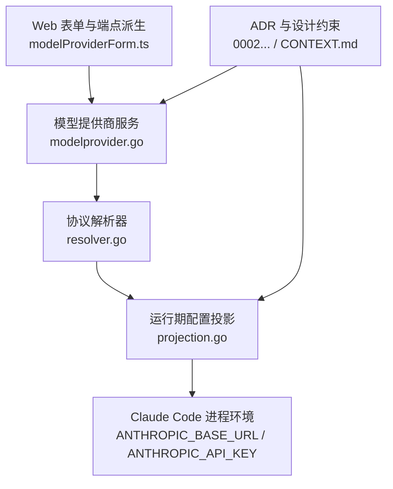
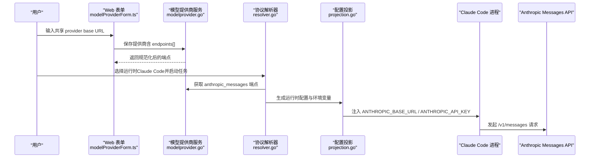
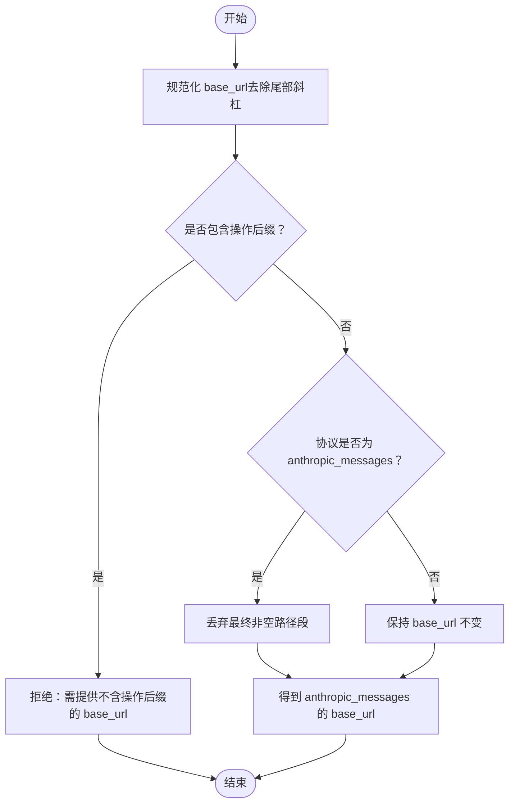
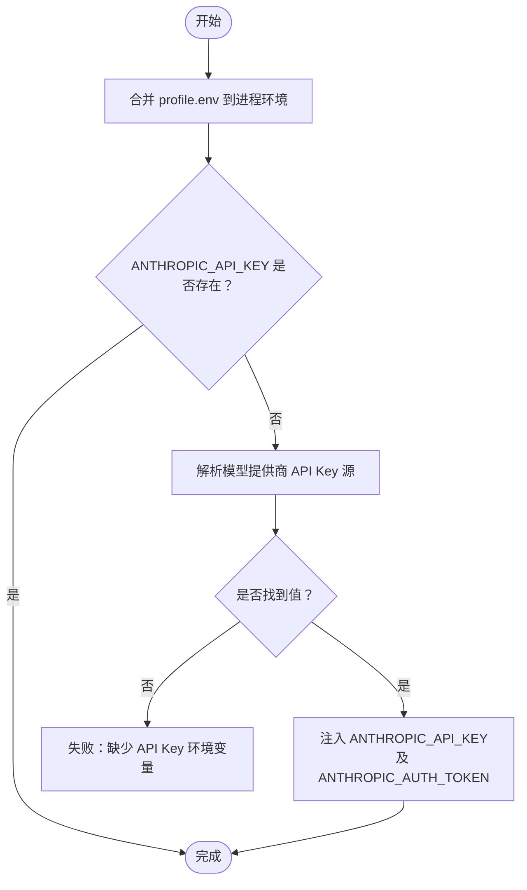
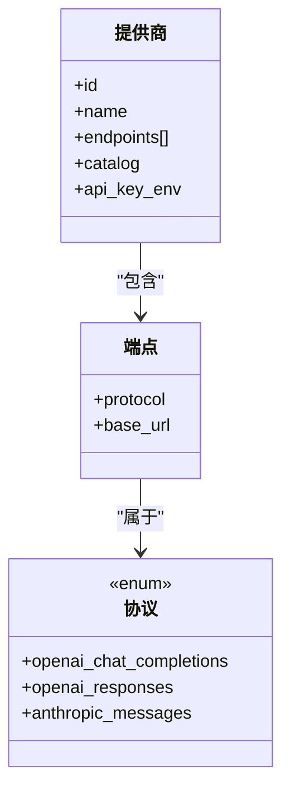
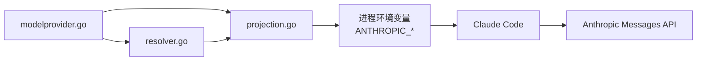

# Anthropic 提供商

<cite>
**本文引用的文件**   
- [internal/modelprovider/modelprovider.go](file://internal/modelprovider/modelprovider.go)
- [internal/modelprovider/resolver.go](file://internal/modelprovider/resolver.go)
- [internal/runner/projection.go](file://internal/runner/projection.go)
- [web/src/pages/modelProviderForm.ts](file://web/src/pages/modelProviderForm.ts)
- [docs/adr/0002-separate-model-providers-from-runtime-profiles.md](file://docs/adr/0002-separate-model-providers-from-runtime-profiles.md)
- [CONTEXT.md](file://CONTEXT.md)
</cite>

## 目录
1. [简介](#简介)
2. [项目结构](#项目结构)
3. [核心组件](#核心组件)
4. [架构总览](#架构总览)
5. [详细组件分析](#详细组件分析)
6. [依赖关系分析](#依赖关系分析)
7. [性能与可用性考虑](#性能与可用性考虑)
8. [故障排查指南](#故障排查指南)
9. [结论](#结论)
10. [附录：配置示例与最佳实践](#附录配置示例与最佳实践)

## 简介
本文件面向在系统中使用 Anthropic Messages API 的“Anthropic 提供商”配置与使用，重点说明：
- 协议标识与端点规范（anthropic_messages）
- Base URL 的特殊处理：丢弃最终路径段，以便运行时（Claude Code）自行追加版本化 messages 操作路径
- API 密钥环境变量设置（ANTHROPIC_API_KEY）及其来源解析
- 与 OpenAI 兼容层的关系（OpenAI Chat Completions / Responses 与 Anthropic Messages 并存时的选择策略）
- 完整配置步骤、常见问题与排错建议

## 项目结构
围绕 Anthropic 提供商的关键代码分布在以下模块：
- 模型提供商定义与端点规范化：internal/modelprovider
- 运行期配置投影与环境变量注入：internal/runner
- Web 前端快速设置与端点派生逻辑：web/src/pages/modelProviderForm.ts
- 设计决策与约束：docs/adr/0002... 与 CONTEXT.md

图表来源
- [internal/modelprovider/modelprovider.go:425-477](file://internal/modelprovider/modelprovider.go#L425-L477)
- [internal/modelprovider/resolver.go:54-101](file://internal/modelprovider/resolver.go#L54-L101)
- [internal/runner/projection.go:1252-1289](file://internal/runner/projection.go#L1252-L1289)
- [web/src/pages/modelProviderForm.ts:126-140](file://web/src/pages/modelProviderForm.ts#L126-L140)
- [docs/adr/0002-separate-model-providers-from-runtime-profiles.md:10-80](file://docs/adr/0002-separate-model-providers-from-runtime-profiles.md#L10-L80)

章节来源
- [internal/modelprovider/modelprovider.go:425-477](file://internal/modelprovider/modelprovider.go#L425-L477)
- [internal/modelprovider/resolver.go:54-101](file://internal/modelprovider/resolver.go#L54-L101)
- [internal/runner/projection.go:1252-1289](file://internal/runner/projection.go#L1252-L1289)
- [web/src/pages/modelProviderForm.ts:126-140](file://web/src/pages/modelProviderForm.ts#L126-L140)
- [docs/adr/0002-separate-model-providers-from-runtime-profiles.md:10-80](file://docs/adr/0002-separate-model-providers-from-runtime-profiles.md#L10-L80)

## 核心组件
- 模型提供商（Model Provider）
  - 存储每个提供商的端点列表（按协议区分），其中包含 anthropic_messages 端点的 base_url
  - 提供端点规范化、兼容性推导、以及“丢弃最终路径段”的适配逻辑
- 协议解析器（Resolver）
  - 根据运行时插件支持集合与用户/默认偏好，选择具体协议（如 anthropic_messages）
  - 校验模型目录与 API Key 环境变量是否就绪
- 运行期配置投影（Projection）
  - 将选定的端点 base_url 与模型、API Key 等写入目标运行时配置或进程环境变量
  - 对 Claude Code 特别处理：设置 ANTHROPIC_BASE_URL 与 ANTHROPIC_MODEL，并注入 ANTHROPIC_API_KEY
- Web 快速设置（前端）
  - 基于共享 provider base URL 自动派生各协议的 endpoint base URL
  - 对 anthropic_messages 执行“丢弃最终非空路径段”的派生规则

章节来源
- [internal/modelprovider/modelprovider.go:425-477](file://internal/modelprovider/modelprovider.go#L425-L477)
- [internal/modelprovider/resolver.go:54-101](file://internal/modelprovider/resolver.go#L54-L101)
- [internal/runner/projection.go:1252-1289](file://internal/runner/projection.go#L1252-L1289)
- [web/src/pages/modelProviderForm.ts:126-140](file://web/src/pages/modelProviderForm.ts#L126-L140)

## 架构总览
下图展示了从“创建/编辑模型提供商”到“运行时启动调用 Anthropic Messages API”的端到端流程。

图表来源
- [web/src/pages/modelProviderForm.ts:126-140](file://web/src/pages/modelProviderForm.ts#L126-L140)
- [internal/modelprovider/modelprovider.go:425-477](file://internal/modelprovider/modelprovider.go#L425-L477)
- [internal/modelprovider/resolver.go:54-101](file://internal/modelprovider/resolver.go#L54-L101)
- [internal/runner/projection.go:1252-1289](file://internal/runner/projection.go#L1252-L1289)

## 详细组件分析

### 组件一：Anthropic 端点与 Base URL 特殊处理
- 关键行为
  - anthropic_messages 的 base_url 必须不包含任何已知的“操作后缀”（如 /messages、/responses、/chat/completions）
  - 当从旧 base_url 回填或快速设置时，系统会对 anthropic_messages 执行“丢弃最终非空路径段”的适配，使 Claude Code 能自行追加其版本化 messages 路径
- 实现要点
  - 规范化与校验：拒绝以已知操作后缀结尾的 base_url
  - 丢弃最终路径段：仅删除最后一个非空路径段；若无可删段则保持不变
  - 兼容性与回退：保留其他协议（openai_chat_completions/openai_responses）的 base_url 不变

图表来源
- [internal/modelprovider/modelprovider.go:425-477](file://internal/modelprovider/modelprovider.go#L425-L477)
- [internal/modelprovider/modelprovider.go:576-592](file://internal/modelprovider/modelprovider.go#L576-L592)
- [web/src/pages/modelProviderForm.ts:126-140](file://web/src/pages/modelProviderForm.ts#L126-L140)

章节来源
- [internal/modelprovider/modelprovider.go:425-477](file://internal/modelprovider/modelprovider.go#L425-L477)
- [internal/modelprovider/modelprovider.go:576-592](file://internal/modelprovider/modelprovider.go#L576-L592)
- [web/src/pages/modelProviderForm.ts:126-140](file://web/src/pages/modelProviderForm.ts#L126-L140)

### 组件二：API 密钥环境变量（ANTHROPIC_API_KEY）
- 关键行为
  - 当使用 Anthropic 提供商时，系统会确保 ANTHROPIC_API_KEY 存在于 Claude Code 进程环境中
  - 若未显式设置，系统会从模型提供商的 API Key 源（环境变量或凭据解析）中注入
- 实现要点
  - 构建 Claude 进程环境时，优先合并 profile.env，再注入模型提供商 API Key
  - 同时设置 ANTHROPIC_AUTH_TOKEN 作为兼容别名（若未设置）

图表来源
- [internal/runner/projection.go:1252-1289](file://internal/runner/projection.go#L1252-L1289)

章节来源
- [internal/runner/projection.go:1252-1289](file://internal/runner/projection.go#L1252-L1289)

### 组件三：与 OpenAI 兼容层的关系
- 关键行为
  - 同一提供商可同时声明 openai_chat_completions、openai_responses、anthropic_messages 多个端点
  - 当未显式指定协议时，系统依据运行时插件的“协议偏好”选择；Pi 运行时偏好顺序为 openai_chat_completions > openai_responses > anthropic_messages
  - 对于 Anthropic 提供商，anthropic_messages 的 base_url 仍遵循“丢弃最终路径段”的规则
- 实现要点
  - 协议选择由解析器根据插件支持与偏好决定
  - 模型目录刷新仅针对 OpenAI 家族端点（/v1/models），不影响 Anthropic 端点

图表来源
- [internal/modelprovider/modelprovider.go:21-33](file://internal/modelprovider/modelprovider.go#L21-L33)
- [internal/modelprovider/modelprovider.go:41-56](file://internal/modelprovider/modelprovider.go#L41-L56)
- [internal/modelprovider/resolver.go:118-137](file://internal/modelprovider/resolver.go#L118-L137)
- [docs/adr/0002-separate-model-providers-from-runtime-profiles.md:10-80](file://docs/adr/0002-separate-model-providers-from-runtime-profiles.md#L10-L80)

章节来源
- [internal/modelprovider/modelprovider.go:21-33](file://internal/modelprovider/modelprovider.go#L21-L33)
- [internal/modelprovider/modelprovider.go:41-56](file://internal/modelprovider/modelprovider.go#L41-L56)
- [internal/modelprovider/resolver.go:118-137](file://internal/modelprovider/resolver.go#L118-L137)
- [docs/adr/0002-separate-model-providers-from-runtime-profiles.md:10-80](file://docs/adr/0002-separate-model-providers-from-runtime-profiles.md#L10-L80)

## 依赖关系分析
- 组件耦合
  - modelprovider 负责数据模型与端点规范化，被 resolver 与 projection 复用
  - resolver 依赖 runtimeplugin 的协议支持清单与偏好
  - projection 依赖 modelprovider 与 credential 服务，输出运行时配置与环境变量
- 外部依赖
  - 运行时（Claude Code）通过 ANTHROPIC_BASE_URL 与 ANTHROPIC_API_KEY 直接访问 Anthropic Messages API
  - 模型目录刷新依赖 OpenAI 风格的 /v1/models 接口（仅适用于 OpenAI 家族端点）

图表来源
- [internal/modelprovider/modelprovider.go:425-477](file://internal/modelprovider/modelprovider.go#L425-L477)
- [internal/modelprovider/resolver.go:54-101](file://internal/modelprovider/resolver.go#L54-L101)
- [internal/runner/projection.go:1252-1289](file://internal/runner/projection.go#L1252-L1289)

章节来源
- [internal/modelprovider/modelprovider.go:425-477](file://internal/modelprovider/modelprovider.go#L425-L477)
- [internal/modelprovider/resolver.go:54-101](file://internal/modelprovider/resolver.go#L54-L101)
- [internal/runner/projection.go:1252-1289](file://internal/runner/projection.go#L1252-L1289)

## 性能与可用性考虑
- 端点规范化与路径段丢弃为轻量字符串/URL 操作，开销极低
- 模型目录刷新仅针对 OpenAI 家族端点，避免不必要的网络请求
- 运行时配置投影仅在需要时触发（如切换提供商或模型），避免频繁重启

[本节为通用指导，不直接分析具体文件]

## 故障排查指南
- 错误：缺少 API Key 环境变量
  - 现象：预检或启动时报错提示缺少 ANTHROPIC_API_KEY
  - 解决：在宿主或沙箱环境中设置 ANTHROPIC_API_KEY，或通过凭据绑定注入
- 错误：Base URL 包含操作后缀
  - 现象：保存提供商时报错，指出 base_url 包含 messages/responses/chat/completions 等后缀
  - 解决：移除末尾的操作路径段，仅保留 base URL（例如 https://api.anthropic.com）
- 错误：协议不兼容
  - 现象：选择的运行时不支持 anthropic_messages，或提供商未声明该协议端点
  - 解决：在提供商中添加 anthropic_messages 端点，或切换到支持的运行时
- 问题：Anthropic 端点路径过长导致 404
  - 现象：传入的 anthropic_messages base_url 带有过多路径段
  - 解决：确认系统已执行“丢弃最终路径段”，并确保运行时能追加正确的 /v1/messages

章节来源
- [internal/runner/projection.go:1252-1289](file://internal/runner/projection.go#L1252-L1289)
- [internal/modelprovider/modelprovider.go:425-477](file://internal/modelprovider/modelprovider.go#L425-L477)
- [internal/modelprovider/resolver.go:54-101](file://internal/modelprovider/resolver.go#L54-L101)

## 结论
- 使用 Anthropic 提供商时，务必正确配置 anthropic_messages 端点的 base_url，并确保 ANTHROPIC_API_KEY 可用
- 系统会自动对 anthropic_messages 执行“丢弃最终路径段”的适配，以避免重复追加操作路径
- 与 OpenAI 兼容层共存时，协议选择遵循运行时插件偏好；Anthropic 端点不受模型目录刷新影响

[本节为总结性内容，不直接分析具体文件]

## 附录：配置示例与最佳实践
- 基础配置
  - 提供商名称：任意
  - 共享 provider base URL：https://api.anthropic.com
  - 协议端点：
    - anthropic_messages：base_url = https://api.anthropic.com（系统将自动丢弃最终路径段）
  - API Key 环境变量：ANTHROPIC_API_KEY
- 多协议共存
  - 如需同时支持 OpenAI 兼容层，可在同一提供商下添加 openai_chat_completions 与 openai_responses 端点
  - 未显式指定协议时，Pi 运行时会优先选择 openai_chat_completions，其次 openai_responses，最后 anthropic_messages
- 常见误区
  - 不要在 anthropic_messages 的 base_url 中包含 /messages 或 /v1/messages
  - 不要遗漏 ANTHROPIC_API_KEY，否则运行时无法认证
- 参考文档
  - 设计决策与约束参见 ADR 与上下文文档

章节来源
- [docs/adr/0002-separate-model-providers-from-runtime-profiles.md:10-80](file://docs/adr/0002-separate-model-providers-from-runtime-profiles.md#L10-L80)
- [CONTEXT.md:675-766](file://CONTEXT.md#L675-L766)