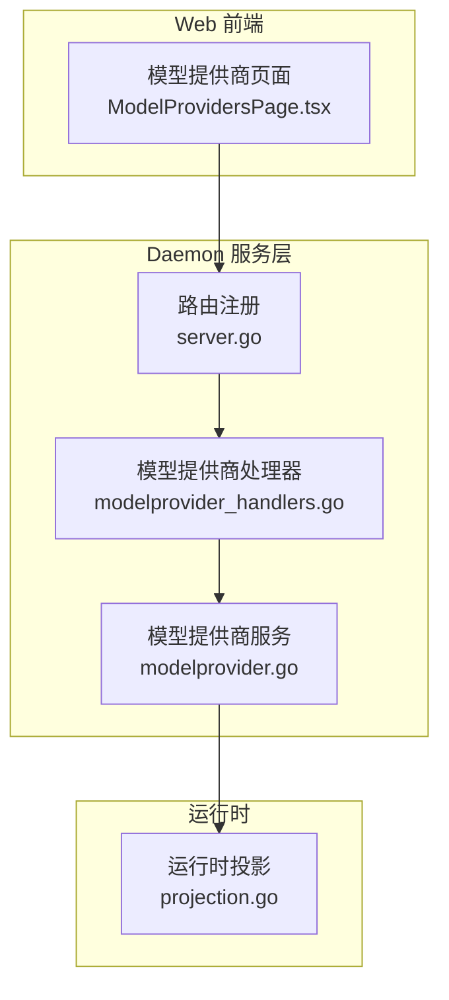
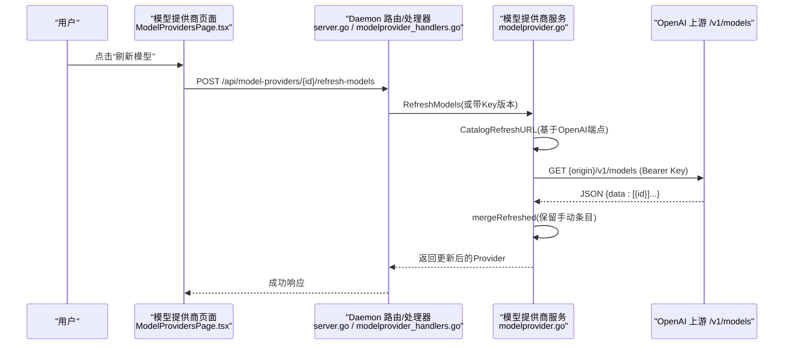
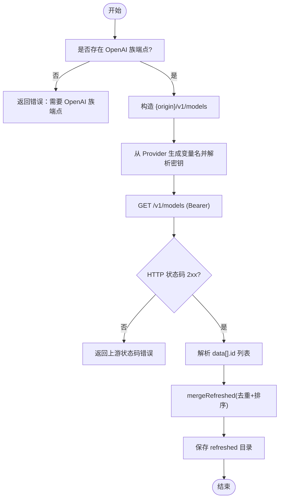
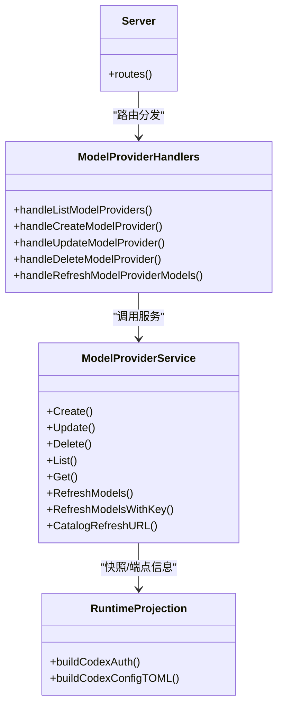

# OpenAI 提供商

<cite>
**本文引用的文件**
- [internal/modelprovider/modelprovider.go](file://internal/modelprovider/modelprovider.go)
- [internal/daemon/modelprovider_handlers.go](file://internal/daemon/modelprovider_handlers.go)
- [internal/daemon/server.go](file://internal/daemon/server.go)
- [web/src/pages/ModelProvidersPage.tsx](file://web/src/pages/ModelProvidersPage.tsx)
- [internal/runner/projection.go](file://internal/runner/projection.go)
- [web/src/pages/runtimeProfileForm.ts](file://web/src/pages/runtimeProfileForm.ts)
- [internal/modelprovidermigrate/migrate.go](file://internal/modelprovidermigrate/migrate.go)
</cite>

## 目录
1. [简介](#简介)
2. [项目结构](#项目结构)
3. [核心组件](#核心组件)
4. [架构总览](#架构总览)
5. [详细组件分析](#详细组件分析)
6. [依赖关系分析](#依赖关系分析)
7. [性能与可用性考虑](#性能与可用性考虑)
8. [故障排除指南](#故障排除指南)
9. [结论](#结论)
10. [附录：环境变量与配置示例](#附录环境变量与配置示例)

## 简介
本文件面向在系统中使用 OpenAI 提供商的用户与运维人员，聚焦以下目标：
- 说明对 OpenAI Chat Completions API 与 Responses API 的支持方式与差异
- 提供 Base URL、API 密钥、模型目录刷新等关键配置项的详细说明
- 给出可操作的环境变量配置示例（如 OPENAI_API_KEY）
- 解释支持的模型列表管理与自动发现机制
- 提供故障排除指南与最佳实践建议

## 项目结构
OpenAI 提供商能力由“后端服务 + Web 前端 + 运行时投影”三部分协同实现：
- 后端服务负责模型提供商的持久化、协议校验、目录刷新与鉴权解析
- Web 前端提供可视化的创建、编辑、刷新与管理界面
- 运行时投影将模型提供商配置转换为具体运行时的调用参数与环境变量

图表来源
- [internal/daemon/server.go:587-643](file://internal/daemon/server.go#L587-L643)
- [internal/daemon/modelprovider_handlers.go:1-155](file://internal/daemon/modelprovider_handlers.go#L1-L155)
- [internal/modelprovider/modelprovider.go:1-745](file://internal/modelprovider/modelprovider.go#L1-L745)
- [web/src/pages/ModelProvidersPage.tsx:1-696](file://web/src/pages/ModelProvidersPage.tsx#L1-L696)
- [internal/runner/projection.go:824-867](file://internal/runner/projection.go#L824-L867)

章节来源
- [internal/daemon/server.go:587-643](file://internal/daemon/server.go#L587-L643)
- [web/src/pages/ModelProvidersPage.tsx:1-696](file://web/src/pages/ModelProvidersPage.tsx#L1-L696)

## 核心组件
- 模型提供商服务：定义协议常量、端点与目录结构、规范化与合并逻辑、刷新接口
- 模型提供商 HTTP 处理器：暴露 REST 接口，处理创建、更新、删除、刷新等操作
- Web 管理页面：提供可视化配置、协议选择、目录维护与刷新入口
- 运行时投影：将模型提供商配置映射为运行时所需的 base_url、wire_api、认证环境变量等

章节来源
- [internal/modelprovider/modelprovider.go:21-33](file://internal/modelprovider/modelprovider.go#L21-L33)
- [internal/daemon/modelprovider_handlers.go:13-122](file://internal/daemon/modelprovider_handlers.go#L13-L122)
- [web/src/pages/ModelProvidersPage.tsx:30-40](file://web/src/pages/ModelProvidersPage.tsx#L30-L40)
- [internal/runner/projection.go:824-867](file://internal/runner/projection.go#L824-L867)

## 架构总览
下图展示了从 Web 到后端再到上游 OpenAI 模型的完整数据流，包括目录刷新流程。

图表来源
- [internal/daemon/modelprovider_handlers.go:97-122](file://internal/daemon/modelprovider_handlers.go#L97-L122)
- [internal/modelprovider/modelprovider.go:223-284](file://internal/modelprovider/modelprovider.go#L223-L284)
- [internal/modelprovider/modelprovider.go:479-496](file://internal/modelprovider/modelprovider.go#L479-L496)
- [web/src/pages/ModelProvidersPage.tsx:203-210](file://web/src/pages/ModelProvidersPage.tsx#L203-L210)

## 详细组件分析

### 协议支持：Chat Completions 与 Responses
- 系统内置两种 OpenAI 协议标识：openai_chat_completions 与 openai_responses
- 通过“端点列表”声明每个协议的 base_url；当未显式设置时，可由共享 base_url 推导
- 运行时根据所选插件偏好选择兼容协议，并将对应 base_url 传递给下游

章节来源
- [internal/modelprovider/modelprovider.go:21-33](file://internal/modelprovider/modelprovider.go#L21-L33)
- [internal/modelprovider/modelprovider.go:436-457](file://internal/modelprovider/modelprovider.go#L436-L457)
- [web/src/pages/ModelProvidersPage.tsx:30-40](file://web/src/pages/ModelProvidersPage.tsx#L30-L40)

### Base URL 配置与规范化
- 支持两种方式：
  - 单一 base_url：用于快速设置，系统会据此推导各协议端点
  - 多端点 endpoints[]：为不同协议分别指定 base_url
- 规范化规则：
  - 去除末尾斜杠
  - 拒绝包含已知操作后缀（如 messages、responses、chat/completions）的值
  - 针对 anthropic_messages 的特殊路径段裁剪规则不适用于 OpenAI 协议
- 兼容性：
  - 若仅设置了 base_url 而未设置 endpoints，系统会在读取时回填 endpoints

章节来源
- [internal/modelprovider/modelprovider.go:372-434](file://internal/modelprovider/modelprovider.go#L372-L434)
- [internal/modelprovider/modelprovider.go:436-457](file://internal/modelprovider/modelprovider.go#L436-L457)
- [internal/modelprovider/modelprovider.go:530-553](file://internal/modelprovider/modelprovider.go#L530-L553)

### API 密钥设置与注入
- 每个 Provider 自动生成一个 API 密钥环境变量名，形如 <PROVIDER_ID>_API_KEY
- 可通过“全局凭据绑定”或“本地字面量”为该变量提供值
- 运行时启动前，系统会从凭据源解析该变量并注入到任务环境
- 对于 Codex 运行时，还会将 OPENAI_API_KEY 作为认证键透传

章节来源
- [internal/modelprovider/modelprovider.go:624-637](file://internal/modelprovider/modelprovider.go#L624-L637)
- [internal/daemon/modelprovider_handlers.go:124-137](file://internal/daemon/modelprovider_handlers.go#L124-L137)
- [internal/runner/projection.go:856-867](file://internal/runner/projection.go#L856-L867)

### 模型目录刷新与自动发现
- 刷新接口：POST /api/model-providers/{id}/refresh-models
- 刷新 URL 构造：
  - 优先使用 openai_chat_completions 端点的 origin，其次 openai_responses
  - 固定追加 /v1/models 路径
- 刷新行为：
  - 使用 Bearer Token 携带 API 密钥
  - 解析返回的 data[].id 列表，覆盖 refreshed 字段
  - 保留 manual 字段中与 refreshed 不重复的条目
- 失败保护：
  - 刷新失败不会清空现有目录
  - 若无 OpenAI 族端点，刷新不可用并返回错误提示

图表来源
- [internal/modelprovider/modelprovider.go:223-284](file://internal/modelprovider/modelprovider.go#L223-L284)
- [internal/modelprovider/modelprovider.go:479-496](file://internal/modelprovider/modelprovider.go#L479-L496)
- [internal/modelprovider/modelprovider.go:667-674](file://internal/modelprovider/modelprovider.go#L667-L674)

章节来源
- [internal/daemon/modelprovider_handlers.go:97-122](file://internal/daemon/modelprovider_handlers.go#L97-L122)
- [internal/modelprovider/modelprovider.go:223-284](file://internal/modelprovider/modelprovider.go#L223-L284)
- [internal/modelprovider/modelprovider.go:479-496](file://internal/modelprovider/modelprovider.go#L479-L496)
- [web/src/pages/ModelProvidersPage.tsx:203-210](file://web/src/pages/ModelProvidersPage.tsx#L203-L210)

### 模型列表管理与默认模型
- 目录包含两类：
  - manual：用户手动输入
  - refreshed：从上游自动发现
- 合并策略：
  - refreshed 覆盖同名条目
  - manual 中不在 refreshed 中的条目保留
- 默认模型：
  - 可从合并后的目录中选择
  - 刷新后若默认模型不存在于新目录，仍会保存，但后续验证可能报错

章节来源
- [internal/modelprovider/modelprovider.go:639-674](file://internal/modelprovider/modelprovider.go#L639-L674)
- [web/src/pages/ModelProvidersPage.tsx:552-607](file://web/src/pages/ModelProvidersPage.tsx#L552-L607)

### 运行时投影与 wire_api
- 对于 Codex 运行时：
  - 若存在 endpoint 或 OPENAI_BASE_URL，则写入 model_provider、base_url、requires_openai_auth 等
  - CODEX_WIRE_API 决定使用 responses 或 chat_completions
  - OPENAI_API_KEY 被映射为认证键
- 对于其他运行时（如 Pi），模型选择与协议由插件清单与模型提供商端点共同决定

章节来源
- [internal/runner/projection.go:824-867](file://internal/runner/projection.go#L824-L867)
- [web/src/pages/runtimeProfileForm.ts:42-48](file://web/src/pages/runtimeProfileForm.ts#L42-L48)

## 依赖关系分析
- 模型提供商服务依赖数据库存储与 HTTP 客户端进行目录刷新
- 处理器依赖凭证服务解析密钥
- Web 页面依赖后端 REST 接口完成 CRUD 与刷新
- 运行时投影依赖模型提供商快照与插件清单

图表来源
- [internal/daemon/server.go:587-643](file://internal/daemon/server.go#L587-L643)
- [internal/daemon/modelprovider_handlers.go:13-122](file://internal/daemon/modelprovider_handlers.go#L13-L122)
- [internal/modelprovider/modelprovider.go:92-284](file://internal/modelprovider/modelprovider.go#L92-L284)
- [internal/runner/projection.go:824-867](file://internal/runner/projection.go#L824-L867)

章节来源
- [internal/daemon/server.go:587-643](file://internal/daemon/server.go#L587-L643)
- [internal/daemon/modelprovider_handlers.go:13-122](file://internal/daemon/modelprovider_handlers.go#L13-L122)
- [internal/modelprovider/modelprovider.go:92-284](file://internal/modelprovider/modelprovider.go#L92-L284)
- [internal/runner/projection.go:824-867](file://internal/runner/projection.go#L824-L867)

## 性能与可用性考虑
- 目录刷新为一次性管理动作，非任务启动自动触发，避免频繁网络开销
- 刷新失败不影响已有目录，保证可用性
- 端点规范化与去重减少无效请求与解析错误
- 建议在批量刷新前先确保密钥已正确绑定，避免多次失败重试

[本节为通用指导，无需引用具体文件]

## 故障排除指南
- 刷新不可用
  - 现象：返回错误提示缺少 OpenAI 族端点
  - 排查：确认 provider 至少配置了 openai_chat_completions 或 openai_responses 的 base_url
- 刷新失败
  - 现象：返回上游状态码错误或解析失败
  - 排查：检查网络连通性、代理配置、/v1/models 是否可达；确认密钥有效
- 目录未更新
  - 现象：refreshed 列表为空或未变化
  - 排查：确认上游返回格式符合 OpenAI 风格；检查手动条目是否与刷新结果冲突
- 无法启动任务
  - 现象：预检失败，提示缺少 API 密钥或协议不兼容
  - 排查：确认凭据绑定已生效；确认运行时插件与 provider 的协议交集非空

章节来源
- [internal/modelprovider/modelprovider.go:479-496](file://internal/modelprovider/modelprovider.go#L479-L496)
- [internal/modelprovider/modelprovider.go:223-284](file://internal/modelprovider/modelprovider.go#L223-L284)
- [internal/daemon/modelprovider_handlers.go:139-154](file://internal/daemon/modelprovider_handlers.go#L139-L154)

## 结论
通过统一的模型提供商抽象，系统同时支持 OpenAI Chat Completions 与 Responses 两种协议，并提供可视化管理、自动发现与安全的密钥注入。合理配置 base_url、启用目录刷新、维护默认模型，可在保障可用性的前提下提升模型选择的灵活性与可维护性。

[本节为总结，无需引用具体文件]

## 附录：环境变量与配置示例
- 基础配置
  - OPENAI_API_KEY：OpenAI 认证密钥（由运行时投影注入）
  - OPENAI_BASE_URL：可选，用于快速设置 OpenAI 兼容端点
- 运行时相关
  - CODEX_MODEL_PROVIDER：Codex 使用的模型提供商 ID
  - CODEX_WIRE_API：Codex 使用的协议（responses 或 chat_completions）
  - CODEX_PROVIDER_NAME：Codex 显示名称
- 凭据绑定
  - 通过全局凭据绑定为 <PROVIDER_ID>_API_KEY 提供值
  - 也可在模型提供商页面直接输入本地字面量密钥

章节来源
- [internal/runner/projection.go:824-867](file://internal/runner/projection.go#L824-L867)
- [internal/modelprovidermigrate/migrate.go:447-451](file://internal/modelprovidermigrate/migrate.go#L447-L451)
- [web/src/pages/runtimeProfileForm.ts:42-48](file://web/src/pages/runtimeProfileForm.ts#L42-L48)