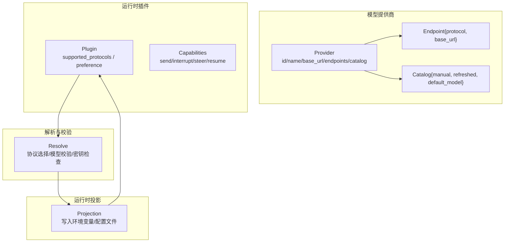
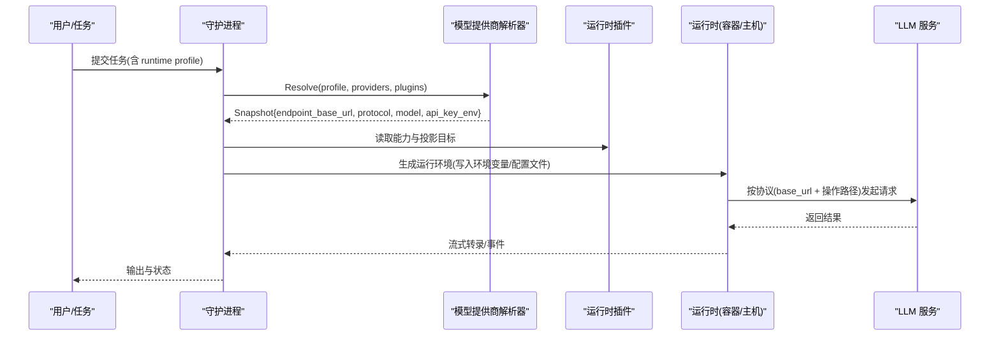
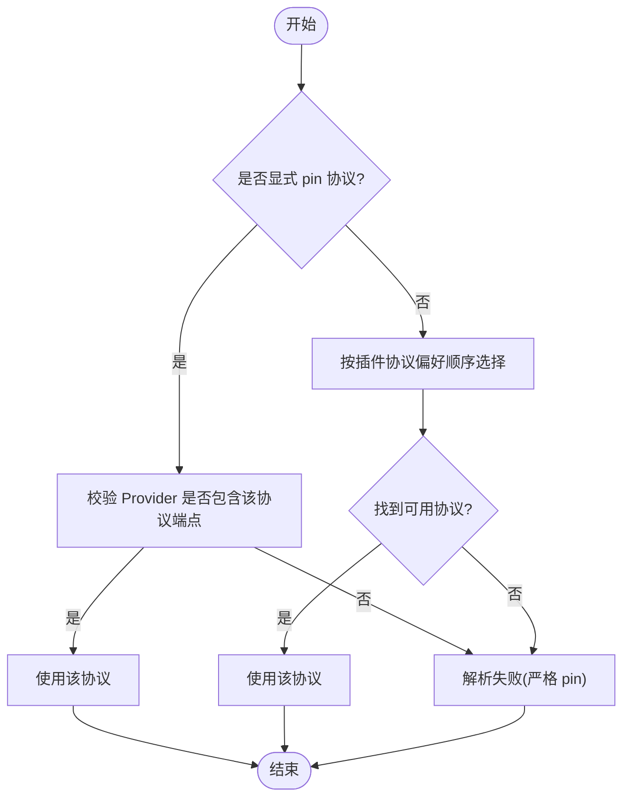
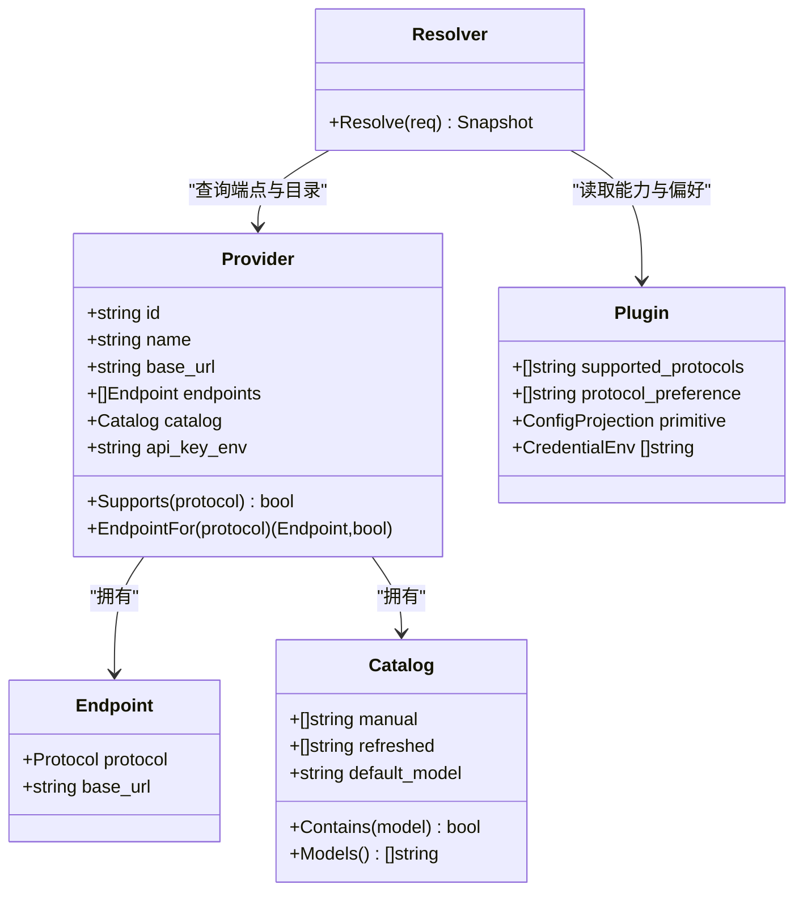

# 支持的提供商

<cite>
**本文引用的文件**   
- [internal/modelprovider/modelprovider.go](file://internal/modelprovider/modelprovider.go)
- [internal/modelprovider/resolver.go](file://internal/modelprovider/resolver.go)
- [internal/runtimeplugin/builtin.go](file://internal/runtimeplugin/builtin.go)
- [internal/runner/projection_endpoint_test.go](file://internal/runner/projection_endpoint_test.go)
- [web/src/pages/ModelProvidersPage.tsx](file://web/src/pages/ModelProvidersPage.tsx)
- [web/src/pages/modelProviderForm.test.ts](file://web/src/pages/modelProviderForm.test.ts)
- [internal/modelprovidermigrate/migrate.go](file://internal/modelprovidermigrate/migrate.go)
- [scripts/smoke-runtime-tasks-live.py](file://scripts/smoke-runtime-tasks-live.py)
- [docs/adr/0002-separate-model-providers-from-runtime-profiles.md](file://docs/adr/0002-separate-model-providers-from-runtime-profiles.md)
</cite>

## 目录
1. [简介](#简介)
2. [项目结构](#项目结构)
3. [核心组件](#核心组件)
4. [架构总览](#架构总览)
5. [详细组件分析](#详细组件分析)
6. [依赖关系分析](#依赖关系分析)
7. [性能与速率限制](#性能与速率限制)
8. [故障排除指南](#故障排除指南)
9. [结论](#结论)
10. [附录：配置示例与环境变量](#附录配置示例与环境变量)

## 简介
本文件面向已内置的 AI 提供商（OpenAI、Anthropic）在系统中的配置与使用，覆盖以下要点：
- 支持的协议与 API 规范差异：OpenAI Chat Completions、OpenAI Responses；Anthropic Messages。
- 认证方式与环境变量来源：由运行时插件声明并投影到运行环境。
- 端点解析与模型目录刷新：基于 Provider 的 Endpoint 列表与 Catalog。
- 最佳实践与选择建议：按运行时插件能力与协议偏好进行选择。
- 配置示例、环境变量设置与常见问题排查。

## 项目结构
系统通过“模型提供商（Model Provider）”抽象统一不同 LLM 服务，结合“运行时插件（Runtime Plugin）”将协议、端点、模型与凭据投影到具体运行时（Codex、Claude Code、Pi）。关键路径：
- 模型提供商定义与存储：internal/modelprovider/*
- 运行时插件注册与能力声明：internal/runtimeplugin/builtin.go
- 启动前解析与校验：internal/modelprovider/resolver.go
- 运行时端点投影与写入：internal/runner/*（测试中体现行为）
- Web UI 管理页面：web/src/pages/ModelProvidersPage.tsx 及相关表单逻辑

图表来源
- [internal/modelprovider/modelprovider.go:21-56](file://internal/modelprovider/modelprovider.go#L21-L56)
- [internal/runtimeplugin/builtin.go:44-84](file://internal/runtimeplugin/builtin.go#L44-L84)
- [internal/modelprovider/resolver.go:54-101](file://internal/modelprovider/resolver.go#L54-L101)

章节来源
- [internal/modelprovider/modelprovider.go:21-56](file://internal/modelprovider/modelprovider.go#L21-L56)
- [internal/runtimeplugin/builtin.go:44-84](file://internal/runtimeplugin/builtin.go#L44-L84)
- [internal/modelprovider/resolver.go:54-101](file://internal/modelprovider/resolver.go#L54-L101)

## 核心组件
- 模型提供商（Provider）
  - 字段：id、name、base_url、protocols（兼容旧数据）、endpoints（协议级 base_url）、api_key_env（生成的环境变量名）、catalog（模型清单与默认模型）。
  - 支持三种协议常量：openai_chat_completions、openai_responses、anthropic_messages。
- 端点（Endpoint）
  - 每个协议可独立指定 base_url；系统拒绝以操作后缀结尾的 base_url（如 /messages、/responses、/chat/completions）。
- 模型目录（Catalog）
  - manual 与 refreshed 合并去重，default_model 用于缺省模型选择。
- 运行时插件（Plugin）
  - 声明支持的协议与偏好顺序、能力集（发送/中断/替换/权限响应/恢复等），以及配置投影目标（如 settings.json、models.json）。
- 解析器（Resolver）
  - 根据 Profile 选择的 provider_id 与可选 protocol pin，结合插件支持集与 Provider 的 endpoints，严格解析协议与模型，并检查 API Key 环境变量是否可用。

章节来源
- [internal/modelprovider/modelprovider.go:21-56](file://internal/modelprovider/modelprovider.go#L21-L56)
- [internal/modelprovider/modelprovider.go:425-434](file://internal/modelprovider/modelprovider.go#L425-L434)
- [internal/modelprovider/modelprovider.go:639-674](file://internal/modelprovider/modelprovider.go#L639-L674)
- [internal/runtimeplugin/builtin.go:44-84](file://internal/runtimeplugin/builtin.go#L44-L84)
- [internal/modelprovider/resolver.go:54-101](file://internal/modelprovider/resolver.go#L54-L101)

## 架构总览
下图展示从任务启动到调用 LLM 的关键流程：Profile 选择 Provider → Resolver 解析协议与模型 → 运行时插件将端点、模型、API Key 投影到运行环境 → 运行时直接调用上游 LLM。

图表来源
- [internal/modelprovider/resolver.go:54-101](file://internal/modelprovider/resolver.go#L54-L101)
- [internal/runtimeplugin/builtin.go:44-84](file://internal/runtimeplugin/builtin.go#L44-L84)
- [internal/runner/projection_endpoint_test.go:64-98](file://internal/runner/projection_endpoint_test.go#L64-L98)

## 详细组件分析

### OpenAI 提供商（Chat Completions 与 Responses）
- 协议与端点
  - openai_chat_completions、openai_responses 均属于 OpenAI 家族；端点 base_url 不拼接操作后缀，操作路径由运行时决定。
  - 快速设置时，两者默认共享 Provider 的 base_url（保留版本段如 /v1）。
- 认证方式
  - 由运行时插件声明所需的环境变量（例如 OPENAI_API_KEY），并在运行时环境中注入。
- 模型目录刷新
  - 优先使用 openai_chat_completions 的 origin，其次 openai_responses，追加 /v1/models 进行刷新。
- 典型用法
  - Codex 运行时仅支持 openai_responses。
  - Pi 运行时支持 openai_chat_completions、openai_responses，并按偏好顺序选择。

章节来源
- [internal/modelprovider/modelprovider.go:479-496](file://internal/modelprovider/modelprovider.go#L479-L496)
- [internal/runtimeplugin/builtin.go:44-84](file://internal/runtimeplugin/builtin.go#L44-L84)
- [web/src/pages/modelProviderForm.test.ts:112-128](file://web/src/pages/modelProviderForm.test.ts#L112-L128)

### Anthropic 提供商（Messages）
- 协议与端点
  - anthropic_messages；当从旧 base_url 推导时，会移除最后一个非空路径段，以便运行时自行追加版本化 messages 路径。
- 认证方式
  - 运行时插件声明 ANTHROPIC_AUTH_TOKEN 或 ANTHROPIC_API_KEY 等环境变量，并在运行时注入。
- 模型目录刷新
  - 不支持通过 /v1/models 刷新（该能力仅限 OpenAI 家族）。
- 典型用法
  - Claude Code 运行时仅支持 anthropic_messages。
  - Pi 运行时也支持 anthropic_messages。

章节来源
- [internal/modelprovider/modelprovider.go:436-457](file://internal/modelprovider/modelprovider.go#L436-L457)
- [internal/runtimeplugin/builtin.go:85-154](file://internal/runtimeplugin/builtin.go#L85-L154)
- [docs/adr/0002-separate-model-providers-from-runtime-profiles.md:36-40](file://docs/adr/0002-separate-model-providers-from-runtime-profiles.md#L36-L40)

### 协议解析与严格 Pin 策略
- 若 Profile 显式 pin 了协议（如 openai_responses），而 Provider 未提供该协议端点，则解析失败，不会静默回退到其他可用协议。
- 未 pin 时，按运行时插件的 ProtocolPreference 顺序选择第一个同时被 Provider 支持的协议。

图表来源
- [internal/modelprovider/resolver.go:118-137](file://internal/modelprovider/resolver.go#L118-L137)
- [internal/modelprovider/resolver_test.go:362-380](file://internal/modelprovider/resolver_test.go#L362-L380)

章节来源
- [internal/modelprovider/resolver.go:118-137](file://internal/modelprovider/resolver.go#L118-L137)

### 运行时端点投影与写入
- 运行时插件将 endpoint_base_url、协议、模型与 API Key 环境变量投影到运行环境（如 settings.json、models.json 或进程环境变量）。
- 对 Anthropic，确保写入的是“去除操作后缀”的 base_url，避免重复拼接。

章节来源
- [internal/runner/projection_endpoint_test.go:64-98](file://internal/runner/projection_endpoint_test.go#L64-L98)
- [internal/runtimeplugin/builtin.go:85-154](file://internal/runtimeplugin/builtin.go#L85-L154)

### Web 管理与迁移
- Model Providers 页面支持创建/编辑 Provider，维护 endpoints[]、catalog、api_key_env 等。
- 支持“快速设置”：输入一个共享 base_url，自动推导各协议的 base_url（Anthropic 移除最后一段）。
- 提供从旧版 runtime profile 的模型字段迁移到 Model Provider 的能力，预览并确认后再应用。

章节来源
- [web/src/pages/ModelProvidersPage.tsx:30-42](file://web/src/pages/ModelProvidersPage.tsx#L30-L42)
- [web/src/pages/modelProviderForm.test.ts:112-128](file://web/src/pages/modelProviderForm.test.ts#L112-L128)
- [internal/modelprovidermigrate/migrate.go:100-170](file://internal/modelprovidermigrate/migrate.go#L100-L170)

## 依赖关系分析
- 模型提供商与运行时插件解耦：Provider 只描述协议与端点，Protocol 选择由插件声明的 supported_protocols 与 preference 驱动。
- 解析器依赖 Provider 的 endpoints 与 catalog，并结合 Profile 的 model_provider_id 与可选 protocol pin。
- 运行时通过插件的配置投影将端点与凭据注入到运行环境，不充当代理。

图表来源
- [internal/modelprovider/modelprovider.go:21-56](file://internal/modelprovider/modelprovider.go#L21-L56)
- [internal/modelprovider/modelprovider.go:699-744](file://internal/modelprovider/modelprovider.go#L699-L744)
- [internal/runtimeplugin/builtin.go:44-84](file://internal/runtimeplugin/builtin.go#L44-L84)
- [internal/modelprovider/resolver.go:54-101](file://internal/modelprovider/resolver.go#L54-L101)

章节来源
- [internal/modelprovider/modelprovider.go:21-56](file://internal/modelprovider/modelprovider.go#L21-L56)
- [internal/runtimeplugin/builtin.go:44-84](file://internal/runtimeplugin/builtin.go#L44-L84)
- [internal/modelprovider/resolver.go:54-101](file://internal/modelprovider/resolver.go#L54-L101)

## 性能与速率限制
- 模型目录刷新
  - 仅在需要时手动触发；失败不影响现有 catalog，成功会覆盖 refreshed 列表。
- 协议选择
  - 解析阶段完成，无额外网络开销；实际调用由运行时直接发起。
- 速率限制
  - 由上游 LLM 服务控制；建议在任务编排层实现重试与退避策略（不在本仓库内实现）。

[本节为通用指导，不直接分析具体文件]

## 故障排除指南
- 解析失败：严格 pin 协议但 Provider 未提供该协议端点
  - 现象：Resolve 报错，提示协议不兼容或缺失。
  - 处理：修正 Provider 的 endpoints，或取消/修改 protocol pin。
- 缺少 API Key 环境变量
  - 现象：CheckEnv=true 时报错，提示环境变量未配置。
  - 处理：按 Provider 的 api_key_env 设置对应环境变量，或通过凭据绑定注入。
- Anthropic 端点路径错误
  - 现象：调用 404 或路径不匹配。
  - 处理：确保 base_url 不包含操作后缀；系统会自动移除最后一段以适配运行时追加的路径。
- 模型不在目录中
  - 现象：Resolve 报缺失模型或无效模型。
  - 处理：更新 catalog（手动添加或刷新），并确保 default_model 或 profile override 有效。

章节来源
- [internal/modelprovider/resolver.go:47-52](file://internal/modelprovider/resolver.go#L47-L52)
- [internal/modelprovider/resolver.go:87-89](file://internal/modelprovider/resolver.go#L87-L89)
- [internal/modelprovider/modelprovider.go:425-434](file://internal/modelprovider/modelprovider.go#L425-L434)
- [internal/modelprovider/modelprovider.go:479-496](file://internal/modelprovider/modelprovider.go#L479-L496)

## 结论
- 系统通过统一的 Provider 抽象与插件化的运行时，将 OpenAI（Chat Completions、Responses）与 Anthropic（Messages）无缝接入。
- 协议选择遵循“严格 pin 优先、插件偏好次之”的策略，保证可预测性与安全性。
- 认证与端点由运行时插件负责投影，守护进程不代理 LLM 流量，便于扩展与审计。
- 推荐优先使用 Codex（OpenAI Responses）与 Claude Code（Anthropic Messages），Pi 作为多协议备选。

[本节为总结性内容，不直接分析具体文件]

## 附录：配置示例与环境变量
- 环境变量（由运行时插件声明）
  - OpenAI：OPENAI_API_KEY（或插件指定的其他键）
  - Anthropic：ANTHROPIC_AUTH_TOKEN、ANTHROPIC_API_KEY
  - 参考脚本中的读取与校验逻辑
- 快速设置（Web UI）
  - 输入共享 base_url（如 https://hub.example.com/v1），自动生成：
    - openai_chat_completions、openai_responses 的 base_url 保持原样
    - anthropic_messages 的 base_url 移除最后一段（如 /v1 → 根路径）
- 迁移旧版配置
  - 预览建议的 Provider（名称、base_url、协议、模型、API Key 来源），确认后创建并回填到 Profile，清理旧字段避免双源。

章节来源
- [scripts/smoke-runtime-tasks-live.py:337-365](file://scripts/smoke-runtime-tasks-live.py#L337-L365)
- [web/src/pages/modelProviderForm.test.ts:112-128](file://web/src/pages/modelProviderForm.test.ts#L112-L128)
- [internal/modelprovidermigrate/migrate.go:100-170](file://internal/modelprovidermigrate/migrate.go#L100-L170)