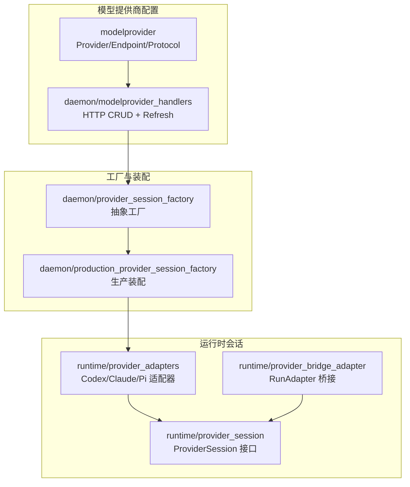
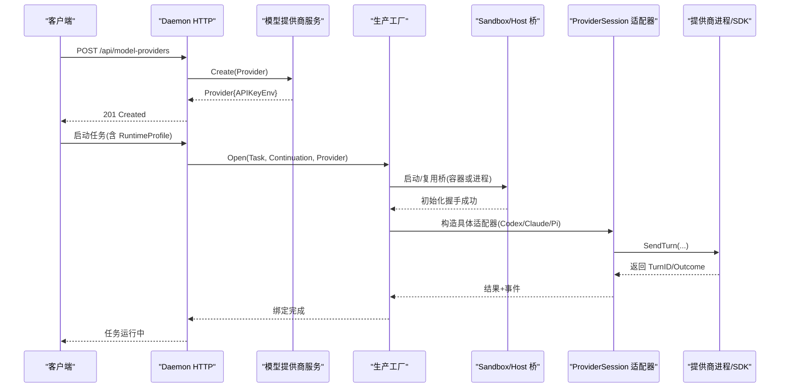
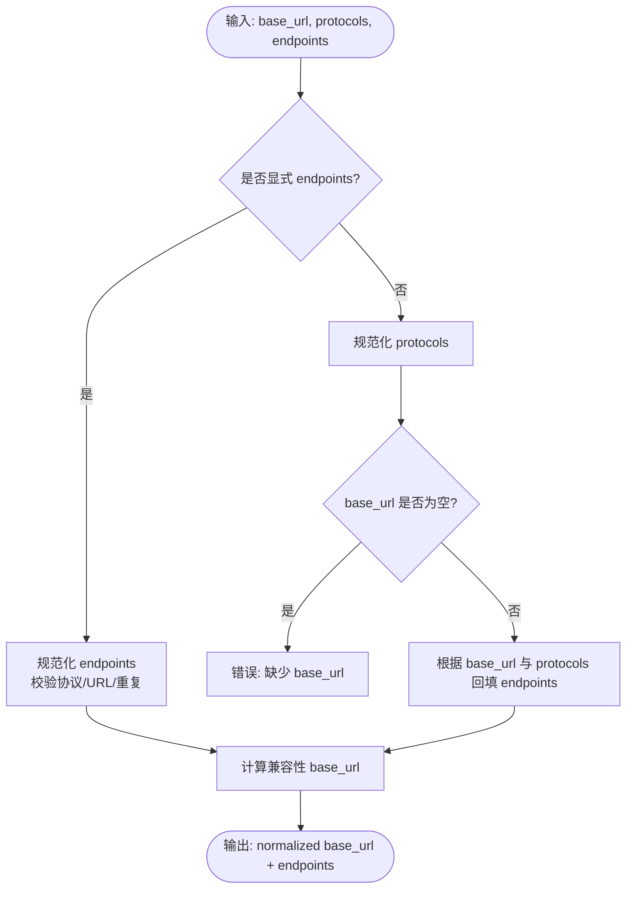
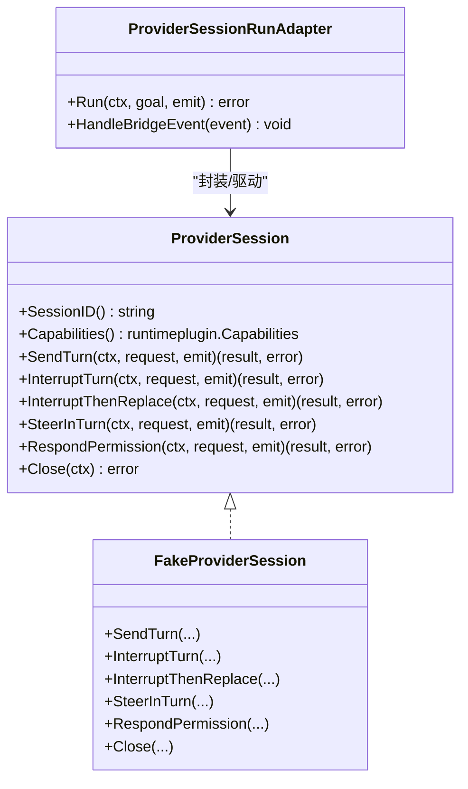
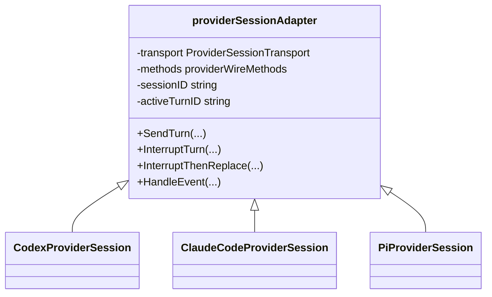
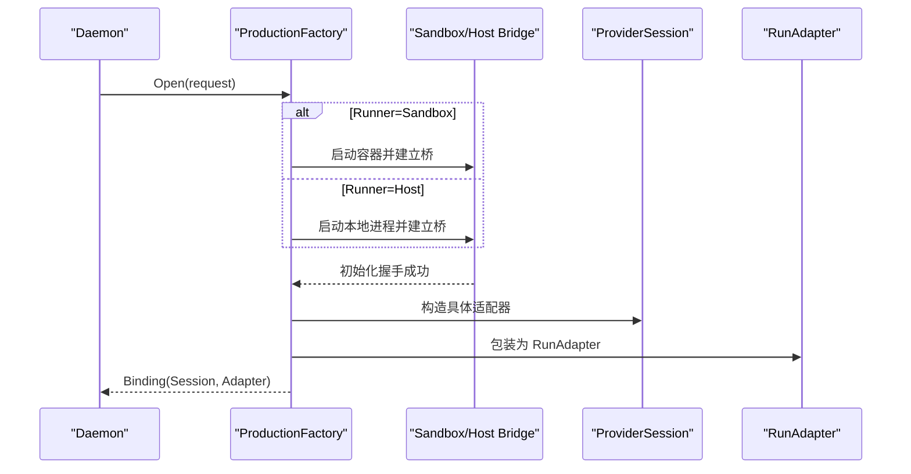
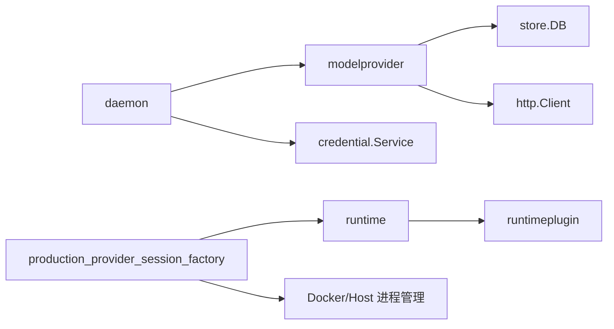

# 自定义提供商

<cite>
**本文引用的文件**   
- [internal/modelprovider/modelprovider.go](file://internal/modelprovider/modelprovider.go)
- [internal/daemon/modelprovider_handlers.go](file://internal/daemon/modelprovider_handlers.go)
- [internal/runtime/provider_session.go](file://internal/runtime/provider_session.go)
- [internal/runtime/provider_adapters.go](file://internal/runtime/provider_adapters.go)
- [internal/runtime/provider_bridge_adapter.go](file://internal/runtime/provider_bridge_adapter.go)
- [internal/daemon/provider_session_factory.go](file://internal/daemon/provider_session_factory.go)
- [internal/daemon/production_provider_session_factory.go](file://internal/daemon/production_provider_session_factory.go)
- [internal/modelprovider/resolver.go](file://internal/modelprovider/resolver.go)
- [internal/runtime/session_bridge_test.go](file://internal/runtime/session_bridge_test.go)
- [internal/runtime/provider_adapters_test.go](file://internal/runtime/provider_adapters_test.go)
</cite>

## 目录
1. [简介](#简介)
2. [项目结构](#项目结构)
3. [核心组件](#核心组件)
4. [架构总览](#架构总览)
5. [详细组件分析](#详细组件分析)
6. [依赖关系分析](#依赖关系分析)
7. [性能与可扩展性](#性能与可扩展性)
8. [测试策略](#测试策略)
9. [部署注意事项](#部署注意事项)
10. [结论](#结论)
11. [附录：开发模板与示例路径](#附录开发模板与示例路径)

## 简介
本指南面向希望扩展新的模型服务提供商（Model Provider）的开发者。内容涵盖：
- 协议定义与端点配置
- 认证机制与环境变量注入
- 运行时适配器接口与实现方式
- 与现有 Provider 接口的集成步骤
- 测试策略与生产部署注意事项

目标读者包括需要接入新模型服务（如 OpenAI、Anthropic、第三方兼容 API）或私有化推理服务的工程师。

## 项目结构
本项目围绕三大子系统组织：Blackboard v2 语义系统、Daemon HTTP 控制面、Runtime/Sandbox 执行面。自定义提供商适配主要涉及以下模块：
- 模型提供商配置与协议：internal/modelprovider
- Daemon 对提供商的 HTTP 管理：internal/daemon
- 运行时会话与控制通道：internal/runtime
- 生产环境工厂装配：internal/daemon/production_provider_session_factory

图表来源
- [internal/modelprovider/modelprovider.go:21-56](file://internal/modelprovider/modelprovider.go#L21-L56)
- [internal/daemon/modelprovider_handlers.go:13-122](file://internal/daemon/modelprovider_handlers.go#L13-L122)
- [internal/runtime/provider_session.go:140-152](file://internal/runtime/provider_session.go#L140-L152)
- [internal/runtime/provider_adapters.go:717-785](file://internal/runtime/provider_adapters.go#L717-L785)
- [internal/runtime/provider_bridge_adapter.go:16-47](file://internal/runtime/provider_bridge_adapter.go#L16-L47)
- [internal/daemon/provider_session_factory.go:35-41](file://internal/daemon/provider_session_factory.go#L35-L41)
- [internal/daemon/production_provider_session_factory.go:118-142](file://internal/daemon/production_provider_session_factory.go#L118-L142)

章节来源
- [internal/modelprovider/modelprovider.go:21-56](file://internal/modelprovider/modelprovider.go#L21-L56)
- [internal/daemon/modelprovider_handlers.go:13-122](file://internal/daemon/modelprovider_handlers.go#L13-L122)
- [internal/runtime/provider_session.go:140-152](file://internal/runtime/provider_session.go#L140-L152)
- [internal/runtime/provider_adapters.go:717-785](file://internal/runtime/provider_adapters.go#L717-L785)
- [internal/runtime/provider_bridge_adapter.go:16-47](file://internal/runtime/provider_bridge_adapter.go#L16-L47)
- [internal/daemon/provider_session_factory.go:35-41](file://internal/daemon/provider_session_factory.go#L35-L41)
- [internal/daemon/production_provider_session_factory.go:118-142](file://internal/daemon/production_provider_session_factory.go#L118-L142)

## 核心组件
- 模型提供商配置与协议
  - Protocol 枚举用于声明支持的协议族，当前包含 OpenAI Chat Completions、OpenAI Responses、Anthropic Messages。
  - Endpoint 描述每个协议的 BaseURL；支持按协议覆盖默认 BaseURL。
  - Provider 聚合 ID、名称、BaseURL、Protocols、Endpoints、Catalog、APIKeyEnv 等元数据。
  - Catalog 提供手动指定模型列表与自动刷新模型列表，并维护默认模型。
- 运行时会话接口
  - ProviderSession 定义了长生命周期会话能力：发送轮次、中断、中断后替换、轮内引导、权限响应、关闭等。
  - 通过 Capabilities 协商具体能力集，确保不同提供商的能力差异被显式表达。
- 适配器与桥接
  - provider_adapters 为 Codex、Claude Code、Pi 提供具体 wire 映射（方法名、参数结构、turnID 提取等）。
  - provider_bridge_adapter 将 ProviderSession 暴露为 Harness 可运行的 Adapter，负责首条 turn 与事件转发。
- 工厂与装配
  - ProviderSessionFactory 抽象了 Task 级会话打开流程，返回绑定后的 Session 与 Adapter。
  - ProductionProviderSessionFactory 在 Sandbox/Host 上完成进程/容器启动、初始化握手、会话身份持久化与清理。

章节来源
- [internal/modelprovider/modelprovider.go:21-56](file://internal/modelprovider/modelprovider.go#L21-L56)
- [internal/runtime/provider_session.go:140-152](file://internal/runtime/provider_session.go#L140-L152)
- [internal/runtime/provider_adapters.go:717-785](file://internal/runtime/provider_adapters.go#L717-L785)
- [internal/runtime/provider_bridge_adapter.go:16-47](file://internal/runtime/provider_bridge_adapter.go#L16-L47)
- [internal/daemon/provider_session_factory.go:35-41](file://internal/daemon/provider_session_factory.go#L35-L41)
- [internal/daemon/production_provider_session_factory.go:118-142](file://internal/daemon/production_provider_session_factory.go#L118-L142)

## 架构总览
下图展示了从 HTTP 创建/更新提供商到运行时发起一轮对话的关键调用链。

图表来源
- [internal/daemon/modelprovider_handlers.go:27-51](file://internal/daemon/modelprovider_handlers.go#L27-L51)
- [internal/modelprovider/modelprovider.go:92-117](file://internal/modelprovider/modelprovider.go#L92-L117)
- [internal/daemon/production_provider_session_factory.go:133-142](file://internal/daemon/production_provider_session_factory.go#L133-L142)
- [internal/runtime/provider_adapters.go:717-785](file://internal/runtime/provider_adapters.go#L717-L785)
- [internal/runtime/provider_bridge_adapter.go:70-112](file://internal/runtime/provider_bridge_adapter.go#L70-L112)

## 详细组件分析

### 协议与端点配置
- 协议类型
  - 使用 Protocol 常量表示支持的协议族。新增协议需在此处注册并加入校验集合。
- 端点规范
  - Endpoint.BaseURL 必须为合法 URL，且不能以操作后缀结尾（如 messages、responses、chat/completions）。
  - 支持为不同协议分别设置 BaseURL；若未显式设置，则根据 Provider.BaseURL 与 Protocols 回填生成。
- 模型目录
  - Catalog.Manual 与 Catalog.Refreshed 合并去重，Refreshed 优先覆盖 Manual。
  - 支持通过 OpenAI 风格 /v1/models 接口刷新模型列表。

图表来源
- [internal/modelprovider/modelprovider.go:498-528](file://internal/modelprovider/modelprovider.go#L498-L528)
- [internal/modelprovider/modelprovider.go:401-457](file://internal/modelprovider/modelprovider.go#L401-L457)
- [internal/modelprovider/modelprovider.go:555-566](file://internal/modelprovider/modelprovider.go#L555-L566)

章节来源
- [internal/modelprovider/modelprovider.go:21-56](file://internal/modelprovider/modelprovider.go#L21-L56)
- [internal/modelprovider/modelprovider.go:372-457](file://internal/modelprovider/modelprovider.go#L372-L457)
- [internal/modelprovider/modelprovider.go:479-496](file://internal/modelprovider/modelprovider.go#L479-L496)

### 认证机制与环境变量
- 每个 Provider 自动生成 APIKeyEnv 环境变量名，格式由 Provider ID 派生。
- 刷新模型时，服务端会从 Credential 解析器获取实际密钥值，并以 Bearer Token 形式请求上游。
- 建议将密钥通过外部密钥管理服务注入，避免硬编码。

章节来源
- [internal/modelprovider/modelprovider.go:624-637](file://internal/modelprovider/modelprovider.go#L624-L637)
- [internal/daemon/modelprovider_handlers.go:97-137](file://internal/daemon/modelprovider_handlers.go#L97-L137)

### 运行时会话接口与能力协商
- ProviderSession 接口定义了长会话的核心操作：SendTurn、InterruptTurn、InterruptThenReplace、SteerInTurn、RespondPermission、Close。
- Capabilities 用于协商能力集，例如 persistent_session、send_turn、interrupt_turn、in_turn_steer、permission_response、resume_session 等。
- 所有操作均要求稳定的 RequestID 作为幂等键，避免并发冲突与重复提交。

图表来源
- [internal/runtime/provider_session.go:140-152](file://internal/runtime/provider_session.go#L140-L152)
- [internal/runtime/provider_session.go:176-215](file://internal/runtime/provider_session.go#L176-L215)
- [internal/runtime/provider_bridge_adapter.go:16-47](file://internal/runtime/provider_bridge_adapter.go#L16-L47)

章节来源
- [internal/runtime/provider_session.go:140-152](file://internal/runtime/provider_session.go#L140-L152)
- [internal/runtime/provider_session.go:176-215](file://internal/runtime/provider_session.go#L176-L215)
- [internal/runtime/provider_bridge_adapter.go:16-47](file://internal/runtime/provider_bridge_adapter.go#L16-L47)

### 适配器实现模式（以 Codex/Claude/Pi 为例）
- 适配器通过 providerWireMethods 定义原生 wire 映射：
  - send/interrupt/permission 等方法名
  - params 函数将高层请求映射为底层 JSON-RPC 参数
  - turnID/sessionID 提取函数从响应中提取会话与轮次标识
- 通用 adapter 处理：
  - 能力检查、请求冲突检测、缓存与幂等
  - 事件归一化（started/acknowledged/settled/completed/failed）
  - 结算等待（waitForSettlement）保证中断后替换的一致性

图表来源
- [internal/runtime/provider_adapters.go:58-92](file://internal/runtime/provider_adapters.go#L58-L92)
- [internal/runtime/provider_adapters.go:717-785](file://internal/runtime/provider_adapters.go#L717-L785)

章节来源
- [internal/runtime/provider_adapters.go:58-92](file://internal/runtime/provider_adapters.go#L58-L92)
- [internal/runtime/provider_adapters.go:717-785](file://internal/runtime/provider_adapters.go#L717-L785)

### 工厂与装配（Sandbox/Host）
- ProviderSessionFactory 抽象了 Task 级会话打开流程，返回 ProviderSessionBinding（包含 Session 与 Adapter）。
- ProductionProviderSessionFactory 负责：
  - 选择 Runner（Sandbox/Host）
  - 启动桥进程/容器，建立非 PTY 双向通信
  - 执行初始化握手（initialize/claude/initialize/pi/get_state）
  - 构造具体 ProviderSession 适配器并绑定 RunAdapter
  - 记录容器/进程组身份以便重启清理

图表来源
- [internal/daemon/provider_session_factory.go:35-41](file://internal/daemon/provider_session_factory.go#L35-L41)
- [internal/daemon/production_provider_session_factory.go:133-142](file://internal/daemon/production_provider_session_factory.go#L133-L142)
- [internal/daemon/production_provider_session_factory.go:428-534](file://internal/daemon/production_provider_session_factory.go#L428-L534)

章节来源
- [internal/daemon/provider_session_factory.go:35-41](file://internal/daemon/provider_session_factory.go#L35-L41)
- [internal/daemon/production_provider_session_factory.go:133-142](file://internal/daemon/production_provider_session_factory.go#L133-L142)
- [internal/daemon/production_provider_session_factory.go:428-534](file://internal/daemon/production_provider_session_factory.go#L428-L534)

## 依赖关系分析
- modelprovider 层依赖 store 进行持久化，并通过 HTTP 客户端访问上游模型目录刷新接口。
- daemon 层通过 HTTP handlers 暴露 CRUD 与刷新接口，内部使用 credential 服务解析密钥。
- runtime 层通过 ProviderSession 抽象屏蔽不同提供商的差异，adapter 仅负责 wire 映射。
- production factory 依赖 Docker/Host 进程管理，统一封装桥的生命周期与清理。

图表来源
- [internal/modelprovider/modelprovider.go:84-90](file://internal/modelprovider/modelprovider.go#L84-L90)
- [internal/daemon/modelprovider_handlers.go:124-137](file://internal/daemon/modelprovider_handlers.go#L124-L137)
- [internal/runtime/provider_adapters.go:10-12](file://internal/runtime/provider_adapters.go#L10-L12)
- [internal/daemon/production_provider_session_factory.go:25-41](file://internal/daemon/production_provider_session_factory.go#L25-L41)

章节来源
- [internal/modelprovider/modelprovider.go:84-90](file://internal/modelprovider/modelprovider.go#L84-L90)
- [internal/daemon/modelprovider_handlers.go:124-137](file://internal/daemon/modelprovider_handlers.go#L124-L137)
- [internal/runtime/provider_adapters.go:10-12](file://internal/runtime/provider_adapters.go#L10-L12)
- [internal/daemon/production_provider_session_factory.go:25-41](file://internal/daemon/production_provider_session_factory.go#L25-L41)

## 性能与可扩展性
- 会话复用：同一 Task 的多次 Continuation 复用同一 ProviderSession，减少进程/容器启动开销。
- 能力协商：通过 Capabilities 精确控制可用操作，避免不必要的重试与失败路径。
- 幂等与缓存：基于 RequestID 的幂等键与结果缓存，提升网络抖动下的稳定性。
- 事件归一化：将不同提供商的事件统一为 lifecycle/steering 两类，降低上层处理复杂度。

[本节为通用指导，不直接分析具体文件]

## 测试策略
- 单元测试
  - 使用 fakeProviderTransport 模拟底层 JSON-RPC 响应与通知，验证适配器参数映射与事件流。
  - 使用 FakeProviderSession 模拟能力缺失、失败场景、手动确认等边界条件。
- 集成测试
  - 通过 session_bridge_test 验证多适配器共享同一桥的生命周期与容器计数。
  - 通过 launch_override_test 验证预设 Profile 的模型覆盖与 Provider 创建流程。
- 契约测试
  - 针对 Codex App Server、Claude Code SDK、Pi RPC 的 wire 行为编写契约用例，无需真实密钥。

章节来源
- [internal/runtime/provider_adapters_test.go:88-138](file://internal/runtime/provider_adapters_test.go#L88-L138)
- [internal/runtime/session_bridge_test.go:185-203](file://internal/runtime/session_bridge_test.go#L185-L203)
- [internal/daemon/launch_override_test.go:11-40](file://internal/daemon/launch_override_test.go#L11-L40)

## 部署注意事项
- 二进制与桥命令
  - 生产环境需安装 pentest-provider-bridge 与 Claude SDK bridge，并确保可执行权限与路径正确。
- 环境变量与密钥
  - 为每个 Provider 设置对应的 APIKeyEnv，建议使用外部密钥管理服务注入。
- 容器与进程隔离
  - Sandbox Runner 使用 Docker 容器隔离；Host Runner 使用本地进程组，注意资源限制与安全边界。
- 清理与恢复
  - 工厂会在 Close 或异常退出时清理容器/进程组与临时文件，确保无残留会话。

章节来源
- [internal/daemon/production_provider_session_factory.go:118-131](file://internal/daemon/production_provider_session_factory.go#L118-L131)
- [internal/daemon/production_provider_session_factory.go:406-426](file://internal/daemon/production_provider_session_factory.go#L406-L426)

## 结论
通过统一的 ProviderSession 接口与适配器模式，本项目实现了多模型提供商的可插拔接入。新增提供商只需：
- 定义协议与端点
- 实现 wire 映射（方法名、参数、turnID/sessionID 提取）
- 在工厂中注册对应 Runner 的装配逻辑
- 补充测试用例与部署说明

该设计兼顾了安全性（非 PTY、最小权限）、可靠性（幂等、结算等待）与可扩展性（能力协商、插件化）。

[本节为总结，不直接分析具体文件]

## 附录：开发模板与示例路径
- 协议与端点定义参考
  - [internal/modelprovider/modelprovider.go:21-56](file://internal/modelprovider/modelprovider.go#L21-L56)
  - [internal/modelprovider/modelprovider.go:401-457](file://internal/modelprovider/modelprovider.go#L401-L457)
- 认证与环境变量
  - [internal/modelprovider/modelprovider.go:624-637](file://internal/modelprovider/modelprovider.go#L624-L637)
  - [internal/daemon/modelprovider_handlers.go:97-137](file://internal/daemon/modelprovider_handlers.go#L97-L137)
- 运行时会话接口
  - [internal/runtime/provider_session.go:140-152](file://internal/runtime/provider_session.go#L140-L152)
- 适配器实现模板（以 Codex/Claude/Pi 为例）
  - [internal/runtime/provider_adapters.go:717-785](file://internal/runtime/provider_adapters.go#L717-L785)
- 工厂装配模板
  - [internal/daemon/provider_session_factory.go:35-41](file://internal/daemon/provider_session_factory.go#L35-L41)
  - [internal/daemon/production_provider_session_factory.go:133-142](file://internal/daemon/production_provider_session_factory.go#L133-L142)
- 测试用例参考
  - [internal/runtime/provider_adapters_test.go:88-138](file://internal/runtime/provider_adapters_test.go#L88-L138)
  - [internal/runtime/session_bridge_test.go:185-203](file://internal/runtime/session_bridge_test.go#L185-L203)