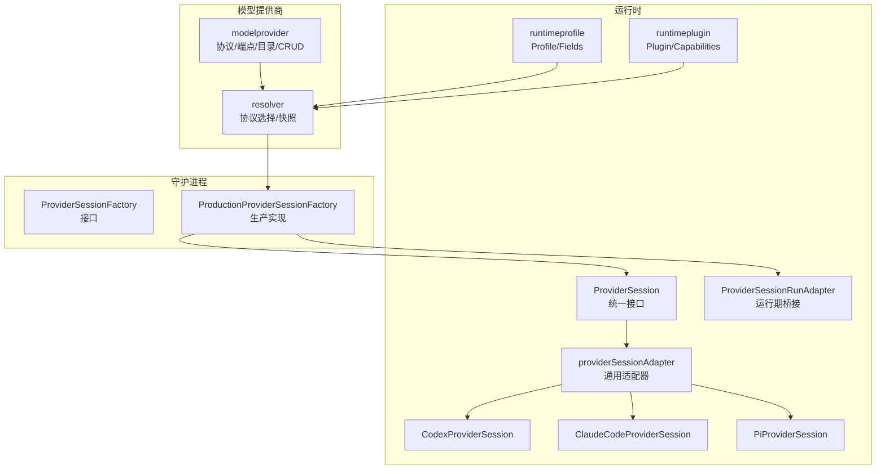
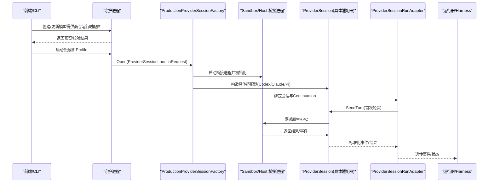
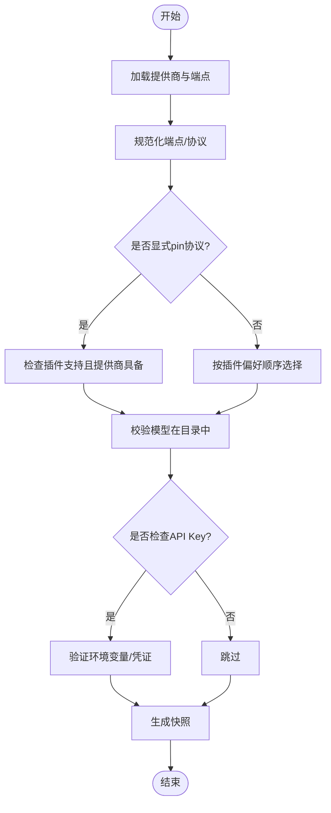
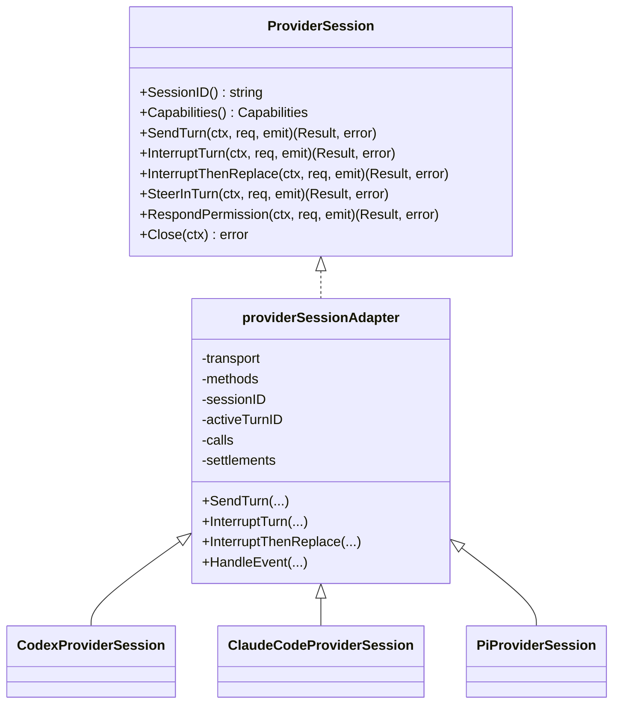
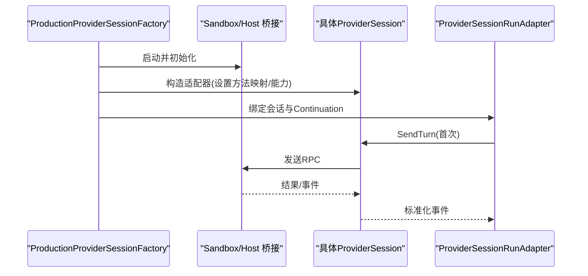
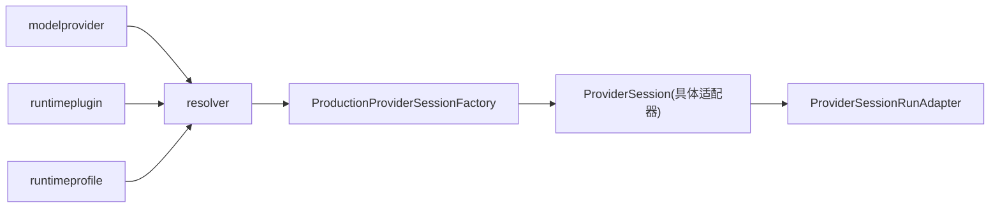

# 模型提供商适配器

<cite>
**本文引用的文件**   
- [internal/modelprovider/modelprovider.go](file://internal/modelprovider/modelprovider.go)
- [internal/modelprovider/resolver.go](file://internal/modelprovider/resolver.go)
- [internal/runtime/provider_session.go](file://internal/runtime/provider_session.go)
- [internal/runtime/provider_adapters.go](file://internal/runtime/provider_adapters.go)
- [internal/runtime/provider_bridge_adapter.go](file://internal/runtime/provider_bridge_adapter.go)
- [internal/daemon/provider_session_factory.go](file://internal/daemon/provider_session_factory.go)
- [internal/daemon/production_provider_session_factory.go](file://internal/daemon/production_provider_session_factory.go)
- [internal/runtimeplugin/plugin.go](file://internal/runtimeplugin/plugin.go)
- [internal/runtimeprofile/runtimeprofile.go](file://internal/runtimeprofile/runtimeprofile.go)
</cite>

## 目录
1. [引言](#引言)
2. [项目结构](#项目结构)
3. [核心组件](#核心组件)
4. [架构总览](#架构总览)
5. [详细组件分析](#详细组件分析)
6. [依赖关系分析](#依赖关系分析)
7. [性能与可扩展性](#性能与可扩展性)
8. [故障排查指南](#故障排查指南)
9. [结论](#结论)
10. [附录：新提供商适配器开发指南](#附录新提供商适配器开发指南)

## 引言
本文件系统性阐述 CyberPenda 的“模型提供商适配器”体系，覆盖统一抽象层、协议适配、会话管理、提供商发现与解析、认证来源、错误处理与幂等控制，以及新增提供商适配器的开发与集成测试方法。CyberPenda 将“模型提供商（Model Provider）”与“运行时（Runtime）”解耦：前者定义多厂商 API 协议与模型目录；后者通过插件声明式描述如何启动、通信与投影配置。适配器在运行时以持久化会话形式存在，提供发送轮次、中断、替换、权限响应与轮内引导等能力，并通过桥接进程与沙箱/宿主环境交互。

## 项目结构
围绕模型提供商适配的关键代码分布在以下模块：
- 模型提供商服务与解析：定义协议枚举、端点与目录、CRUD、刷新与规范化逻辑，以及基于运行时的协议选择与快照生成。
- 运行时插件与配置文件：声明式描述提供商能力、支持的协议、配置投影与启动模板。
- 运行时会话与适配器：统一的 ProviderSession 接口、通用会话适配器、具体提供商适配器（Codex、Claude Code、Pi），以及与桥接进程的交互。
- 工厂与会话绑定：生产环境下的会话工厂负责按 Runner（沙箱/宿主）和 Provider 类型拉起桥接进程、建立会话并绑定到任务生命周期。

图表来源
- [internal/modelprovider/modelprovider.go:1-120](file://internal/modelprovider/modelprovider.go#L1-L120)
- [internal/modelprovider/resolver.go:1-101](file://internal/modelprovider/resolver.go#L1-L101)
- [internal/runtimeplugin/plugin.go:1-120](file://internal/runtimeplugin/plugin.go#L1-L120)
- [internal/runtimeprofile/runtimeprofile.go:1-120](file://internal/runtimeprofile/runtimeprofile.go#L1-L120)
- [internal/runtime/provider_session.go:1-152](file://internal/runtime/provider_session.go#L1-L152)
- [internal/runtime/provider_adapters.go:1-120](file://internal/runtime/provider_adapters.go#L1-L120)
- [internal/daemon/provider_session_factory.go:1-92](file://internal/daemon/provider_session_factory.go#L1-L92)
- [internal/daemon/production_provider_session_factory.go:1-142](file://internal/daemon/production_provider_session_factory.go#L1-L142)

章节来源
- [internal/modelprovider/modelprovider.go:1-120](file://internal/modelprovider/modelprovider.go#L1-L120)
- [internal/modelprovider/resolver.go:1-101](file://internal/modelprovider/resolver.go#L1-L101)
- [internal/runtimeplugin/plugin.go:1-120](file://internal/runtimeplugin/plugin.go#L1-L120)
- [internal/runtimeprofile/runtimeprofile.go:1-120](file://internal/runtimeprofile/runtimeprofile.go#L1-L120)
- [internal/runtime/provider_session.go:1-152](file://internal/runtime/provider_session.go#L1-L152)
- [internal/runtime/provider_adapters.go:1-120](file://internal/runtime/provider_adapters.go#L1-L120)
- [internal/daemon/provider_session_factory.go:1-92](file://internal/daemon/provider_session_factory.go#L1-L92)
- [internal/daemon/production_provider_session_factory.go:1-142](file://internal/daemon/production_provider_session_factory.go#L1-L142)

## 核心组件
- 模型提供商服务（Service）
  - 职责：提供商 CRUD、端点与协议规范化、目录刷新、兼容性推导、API Key 环境变量名生成。
  - 关键概念：Protocol（openai_chat_completions/openai_responses/anthropic_messages）、Endpoint、Catalog、BaseURL 规范化、Backfill 兼容旧数据。
- 提供商解析器（Resolver）
  - 职责：根据运行时 Profile 与 Plugin 的能力集，选择协议、校验模型是否在目录中、检查 API Key 可用性，产出非敏感快照（Snapshot）。
- 运行时插件（Plugin）
  - 职责：声明式描述提供商二进制、支持平台、能力集（持久会话、SendTurn、InterruptThenReplace 等）、支持的协议及偏好、配置投影目标、转录解析器。
- 运行时配置（RuntimeProfile）
  - 职责：用户可编辑的全局配置，包含 provider、model、endpoint、model_provider_id、protocol pin、reasoning_effort、自定义参数、MCP 服务器等。
- 会话接口与通用适配器（ProviderSession + providerSessionAdapter）
  - 职责：统一控制面（SendTurn/InterruptTurn/InterruptThenReplace/SteerInTurn/RespondPermission/Close），幂等请求 ID、能力协商、事件归一化、结算等待。
- 具体提供商适配器
  - CodexProviderSession：映射 turn/start、turn/interrupt、item/permission/respond 等 RPC。
  - ClaudeCodeProviderSession：映射 claude/input、claude/interrupt、claude/permission/respond 等 RPC。
  - PiProviderSession：映射 pi/prompt、pi/abort、pi/steer、pi/permission/respond，并在 prompt 前执行 set_model/set_thinking_level。
- 运行期桥接适配器（ProviderSessionRunAdapter）
  - 职责：将 ProviderSession 暴露为 Harness 可运行的 Adapter，记录初始轮次选择、转发事件、持久化元数据。
- 会话工厂（ProviderSessionFactory + ProductionProviderSessionFactory）
  - 职责：按 Runner（Sandbox/Host）与 Provider 组装桥接进程、建立会话、绑定 Continuation、清理资源。

章节来源
- [internal/modelprovider/modelprovider.go:1-120](file://internal/modelprovider/modelprovider.go#L1-L120)
- [internal/modelprovider/resolver.go:1-101](file://internal/modelprovider/resolver.go#L1-L101)
- [internal/runtimeplugin/plugin.go:1-120](file://internal/runtimeplugin/plugin.go#L1-L120)
- [internal/runtimeprofile/runtimeprofile.go:1-120](file://internal/runtimeprofile/runtimeprofile.go#L1-L120)
- [internal/runtime/provider_session.go:1-152](file://internal/runtime/provider_session.go#L1-L152)
- [internal/runtime/provider_adapters.go:1-120](file://internal/runtime/provider_adapters.go#L1-L120)
- [internal/runtime/provider_bridge_adapter.go:1-128](file://internal/runtime/provider_bridge_adapter.go#L1-L128)
- [internal/daemon/provider_session_factory.go:1-92](file://internal/daemon/provider_session_factory.go#L1-L92)
- [internal/daemon/production_provider_session_factory.go:1-142](file://internal/daemon/production_provider_session_factory.go#L1-L142)

## 架构总览
下图展示从“配置与解析”到“会话装配与调用”的端到端流程。

图表来源
- [internal/daemon/production_provider_session_factory.go:133-223](file://internal/daemon/production_provider_session_factory.go#L133-L223)
- [internal/runtime/provider_adapters.go:729-803](file://internal/runtime/provider_adapters.go#L729-L803)
- [internal/runtime/provider_bridge_adapter.go:70-128](file://internal/runtime/provider_bridge_adapter.go#L70-L128)
- [internal/runtime/provider_session.go:140-152](file://internal/runtime/provider_session.go#L140-L152)

## 详细组件分析

### 模型提供商服务与解析
- 协议与端点
  - 协议常量：openai_chat_completions、openai_responses、anthropic_messages。
  - Endpoint 列表存储 {protocol, base_url}，拒绝已带操作后缀的 base_url（如 /messages、/responses、/chat/completions）。
  - Backfill 兼容旧字段：当仅存 base_url+protocols 时，自动推导 endpoints；对 anthropic_messages 会去掉最终路径段。
- 目录刷新
  - 使用 OpenAI 风格 /v1/models 获取模型列表，合并手动与刷新后的模型清单，去重排序。
- 解析器
  - 依据 Plugin 的 supported_protocols 与 protocol_preference 选择协议；若 Profile 显式 pin 协议则严格匹配。
  - 校验 model 存在于 Catalog；可选检查 API Key 是否可用（环境变量或凭证服务）。
  - 输出 Snapshot：包含 endpoint_base_url、protocol、model、api_key_env、projection_target 等非敏感信息。

图表来源
- [internal/modelprovider/modelprovider.go:372-457](file://internal/modelprovider/modelprovider.go#L372-L457)
- [internal/modelprovider/modelprovider.go:479-496](file://internal/modelprovider/modelprovider.go#L479-L496)
- [internal/modelprovider/resolver.go:54-101](file://internal/modelprovider/resolver.go#L54-L101)
- [internal/modelprovider/resolver.go:118-137](file://internal/modelprovider/resolver.go#L118-L137)

章节来源
- [internal/modelprovider/modelprovider.go:1-120](file://internal/modelprovider/modelprovider.go#L1-L120)
- [internal/modelprovider/modelprovider.go:372-457](file://internal/modelprovider/modelprovider.go#L372-L457)
- [internal/modelprovider/modelprovider.go:479-496](file://internal/modelprovider/modelprovider.go#L479-L496)
- [internal/modelprovider/resolver.go:54-101](file://internal/modelprovider/resolver.go#L54-L101)
- [internal/modelprovider/resolver.go:118-137](file://internal/modelprovider/resolver.go#L118-L137)

### 运行时插件与配置投影
- 插件声明
  - capabilities：persistent_session、send_turn、interrupt_turn、interrupt_then_replace、in_turn_steer、permission_response、resume_session 等。
  - model_provider：requirement、supported_protocols、protocol_preference。
  - config_projection.primitive：generic_config/codex_home/claude_settings/pi_agent 等，决定运行时配置投影目标。
- 配置投影
  - runtimeprofile.GeneratedConfig 输出非敏感预览；实际密钥在投影阶段注入。
  - 自定义参数校验防止与结构化字段冲突。

章节来源
- [internal/runtimeplugin/plugin.go:1-120](file://internal/runtimeplugin/plugin.go#L1-L120)
- [internal/runtimeprofile/runtimeprofile.go:348-433](file://internal/runtimeprofile/runtimeprofile.go#L348-L433)
- [internal/runtimeprofile/runtimeprofile.go:448-467](file://internal/runtimeprofile/runtimeprofile.go#L448-L467)

### 会话接口与通用适配器
- ProviderSession 接口
  - 能力：SendTurn、InterruptTurn、InterruptThenReplace、SteerInTurn、RespondPermission、Close。
  - 错误语义：不支持能力、会话关闭、请求冲突、上下文错误等。
- providerSessionAdapter
  - 幂等：request_id 绑定模式与指纹，避免重复提交。
  - 事件：统一生命周期事件（requested/started/acknowledged/settled/failed），并将提供商通知归一化为 Task 事件。
  - 结算：针对中断/替换等待终端信号，确保一致性。
  - 健康：ControlBusy、SessionClosed、SessionOffline、SessionUnexpectedOffline。

图表来源
- [internal/runtime/provider_session.go:140-152](file://internal/runtime/provider_session.go#L140-L152)
- [internal/runtime/provider_adapters.go:58-120](file://internal/runtime/provider_adapters.go#L58-L120)
- [internal/runtime/provider_adapters.go:729-803](file://internal/runtime/provider_adapters.go#L729-L803)
- [internal/runtime/provider_adapters.go:805-827](file://internal/runtime/provider_adapters.go#L805-L827)

章节来源
- [internal/runtime/provider_session.go:1-152](file://internal/runtime/provider_session.go#L1-L152)
- [internal/runtime/provider_adapters.go:58-120](file://internal/runtime/provider_adapters.go#L58-L120)
- [internal/runtime/provider_adapters.go:729-803](file://internal/runtime/provider_adapters.go#L729-L803)
- [internal/runtime/provider_adapters.go:805-827](file://internal/runtime/provider_adapters.go#L805-L827)

### 具体提供商适配器细节
- CodexProviderSession
  - 方法映射：turn/start、turn/interrupt、item/permission/respond。
  - 参数：threadId/turnId、input text、model、effort、permission 相关字段。
- ClaudeCodeProviderSession
  - 方法映射：claude/input、claude/interrupt、claude/permission/respond。
  - 参数：传递 model_provider_id、model、requested_reasoning_effort 等。
- PiProviderSession
  - 方法映射：pi/prompt、pi/abort、pi/steer、pi/permission/respond。
  - prepareSend：先 set_model（含 provider/modelId/model），再 set_thinking_level（level），最后 prompt。

章节来源
- [internal/runtime/provider_adapters.go:729-803](file://internal/runtime/provider_adapters.go#L729-L803)
- [internal/runtime/provider_adapters.go:805-827](file://internal/runtime/provider_adapters.go#L805-L827)
- [internal/runtime/provider_adapters.go:829-885](file://internal/runtime/provider_adapters.go#L829-L885)

### 运行期桥接适配器与工厂
- ProviderSessionRunAdapter
  - 将 ProviderSession 包装为 Adapter.Run，发送首次轮次，记录元数据，监听关闭信号。
- ProductionProviderSessionFactory
  - 按 Runner 分支：Sandbox 使用容器桥接，Host 使用本地进程桥接。
  - 按 Provider 分支：Codex、Claude Code、Pi 各自初始化流程与参数拼装。
  - 会话复用：同一 Task 的 Continuation 复用已有会话，仅重新绑定 Continuation。

图表来源
- [internal/daemon/production_provider_session_factory.go:133-223](file://internal/daemon/production_provider_session_factory.go#L133-L223)
- [internal/runtime/provider_bridge_adapter.go:70-128](file://internal/runtime/provider_bridge_adapter.go#L70-L128)

章节来源
- [internal/runtime/provider_bridge_adapter.go:1-128](file://internal/runtime/provider_bridge_adapter.go#L1-L128)
- [internal/daemon/provider_session_factory.go:1-92](file://internal/daemon/provider_session_factory.go#L1-L92)
- [internal/daemon/production_provider_session_factory.go:133-223](file://internal/daemon/production_provider_session_factory.go#L133-L223)

## 依赖关系分析
- 低耦合高内聚
  - 模型提供商服务与运行时插件/配置解耦，通过 Resolver 聚合选择策略。
  - 适配器通过 ProviderSessionTransport 与桥接进程通信，屏蔽底层差异。
- 直接依赖
  - resolver 依赖 modelprovider、runtimeplugin、runtimeprofile、credential。
  - production factory 依赖 runtime 的桥接注册表与具体适配器构造。
- 潜在循环
  - 当前分层清晰，未见循环依赖；插件与配置为只读声明，运行时消费其能力。

图表来源
- [internal/modelprovider/resolver.go:1-101](file://internal/modelprovider/resolver.go#L1-L101)
- [internal/daemon/production_provider_session_factory.go:133-223](file://internal/daemon/production_provider_session_factory.go#L133-L223)
- [internal/runtime/provider_bridge_adapter.go:70-128](file://internal/runtime/provider_bridge_adapter.go#L70-L128)

章节来源
- [internal/modelprovider/resolver.go:1-101](file://internal/modelprovider/resolver.go#L1-L101)
- [internal/daemon/production_provider_session_factory.go:133-223](file://internal/daemon/production_provider_session_factory.go#L133-L223)
- [internal/runtime/provider_bridge_adapter.go:70-128](file://internal/runtime/provider_bridge_adapter.go#L70-L128)

## 性能与可扩展性
- 会话复用与幂等
  - 同一 Task 的 Continuation 复用会话，减少进程/容器开销。
  - request_id 幂等缓存避免重复下发原生帧。
- 事件归一化与背压
  - 事件经适配器归一化后进入 Task 事件通道，避免原始协议负载过大影响上层。
- 健康检测
  - ControlBusy/SessionOffline/SessionUnexpectedOffline 帮助快速感知异常，避免无效重试。
- 扩展建议
  - 新增提供商：实现 ProviderSession 并注册到工厂；在 Plugin 中声明能力与协议；在 Resolver 中自然被选择。
  - 批量刷新目录：可并发发起 HTTP 请求，注意超时与限流。

[本节为通用指导，不直接分析具体文件]

## 故障排查指南
- 常见错误
  - 未找到提供商/缺失名称/BaseURL/协议无效/端点协议重复/端点 BaseURL 非法/被运行时配置引用无法删除。
  - 协议不兼容：Profile 显式 pin 的协议不在插件支持或提供商端点集合中。
  - 缺少模型：模型未在目录中或未配置默认模型。
  - API Key 未配置：环境变量或凭证服务不可用。
  - 会话冲突：同一会话并发不同控制操作、请求 ID 内容不一致。
- 定位步骤
  - 检查模型提供商端点与协议是否匹配插件支持。
  - 确认模型在目录中（手动或刷新）。
  - 校验环境变量或凭证绑定是否生效。
  - 查看会话健康状态与控制忙标志。
  - 核对请求 ID 幂等键与指纹一致性。

章节来源
- [internal/modelprovider/modelprovider.go:74-82](file://internal/modelprovider/modelprovider.go#L74-L82)
- [internal/modelprovider/resolver.go:47-52](file://internal/modelprovider/resolver.go#L47-L52)
- [internal/runtime/provider_session.go:40-90](file://internal/runtime/provider_session.go#L40-L90)

## 结论
CyberPenda 的模型提供商适配器体系通过“提供商服务 + 运行时插件 + 统一会话接口 + 具体适配器 + 工厂装配”的分层设计，实现了多厂商协议的统一抽象、严格的协议选择与校验、健壮的会话管理与事件归一化，以及面向沙箱/宿主的灵活装配。该架构便于扩展新的提供商，同时保证安全性（密钥不入配置）、可观测性（事件与快照）与稳定性（幂等与健康检测）。

[本节为总结，不直接分析具体文件]

## 附录：新提供商适配器开发指南

### 总体步骤
1. 声明插件
   - 在 Plugin 中声明 binary、capabilities、model_provider.supported_protocols 与 protocol_preference、config_projection.primitive、transcript.parser 等。
2. 实现 ProviderSession
   - 新建适配器类型，实现 ProviderSession 接口；在 providerSessionAdapter 基础上提供 wireMethods（send/interrupt/steer/permission/params/prepareSend/turnID/sessionID）。
3. 接入工厂
   - 在 ProductionProviderSessionFactory 中为新 Provider 添加分支，完成桥接进程启动、会话初始化与绑定。
4. 配置与解析
   - 确保 Resolver 能基于 Plugin 与 Profile 正确选择协议与模型；必要时调整 catalog 刷新 URL 或兼容逻辑。
5. 测试与集成
   - 使用 FakeProviderSession 进行单元测试；编写端到端测试覆盖启动、发送轮次、中断、替换、权限响应与关闭。

### 关键要点
- 协议与端点
  - 遵循 Protocol 常量与端点规范化规则；避免在 base_url 中包含操作后缀。
- 幂等与会话
  - 始终传入稳定 RequestID；利用 adapter 的 begin/end/store/cached 机制。
- 事件与结算
  - 正确处理 started/acknowledged/settled/failed 事件；中断/替换需等待结算。
- 健康与清理
  - 关注 ControlBusy/SessionOffline/SessionUnexpectedOffline；在工厂 onClose 回调中释放资源。

### 示例路径参考
- 插件声明与能力
  - [internal/runtimeplugin/plugin.go:1-120](file://internal/runtimeplugin/plugin.go#L1-L120)
- 适配器基类与通用逻辑
  - [internal/runtime/provider_adapters.go:58-120](file://internal/runtime/provider_adapters.go#L58-L120)
- 具体适配器示例（Codex/Claude/Pi）
  - [internal/runtime/provider_adapters.go:729-803](file://internal/runtime/provider_adapters.go#L729-L803)
  - [internal/runtime/provider_adapters.go:805-827](file://internal/runtime/provider_adapters.go#L805-L827)
  - [internal/runtime/provider_adapters.go:829-885](file://internal/runtime/provider_adapters.go#L829-L885)
- 工厂装配（Sandbox/Host）
  - [internal/daemon/production_provider_session_factory.go:133-223](file://internal/daemon/production_provider_session_factory.go#L133-L223)
- 运行期桥接适配器
  - [internal/runtime/provider_bridge_adapter.go:70-128](file://internal/runtime/provider_bridge_adapter.go#L70-L128)

章节来源
- [internal/runtimeplugin/plugin.go:1-120](file://internal/runtimeplugin/plugin.go#L1-L120)
- [internal/runtime/provider_adapters.go:58-120](file://internal/runtime/provider_adapters.go#L58-L120)
- [internal/runtime/provider_adapters.go:729-803](file://internal/runtime/provider_adapters.go#L729-L803)
- [internal/runtime/provider_adapters.go:805-827](file://internal/runtime/provider_adapters.go#L805-L827)
- [internal/runtime/provider_adapters.go:829-885](file://internal/runtime/provider_adapters.go#L829-L885)
- [internal/daemon/production_provider_session_factory.go:133-223](file://internal/daemon/production_provider_session_factory.go#L133-L223)
- [internal/runtime/provider_bridge_adapter.go:70-128](file://internal/runtime/provider_bridge_adapter.go#L70-L128)