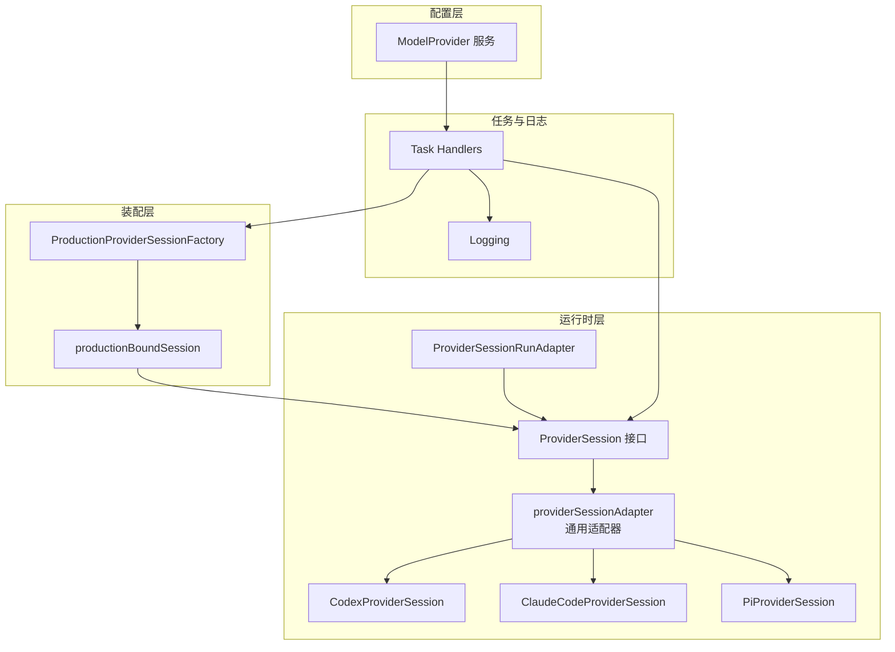
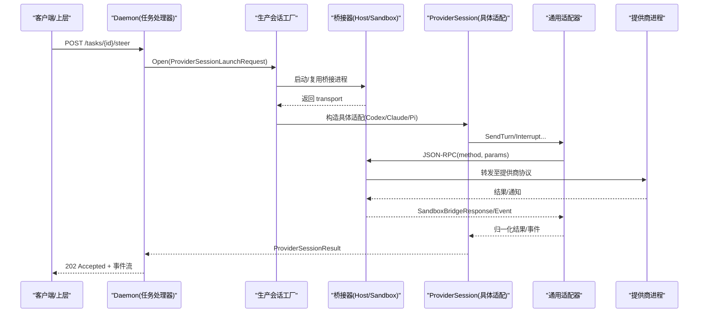
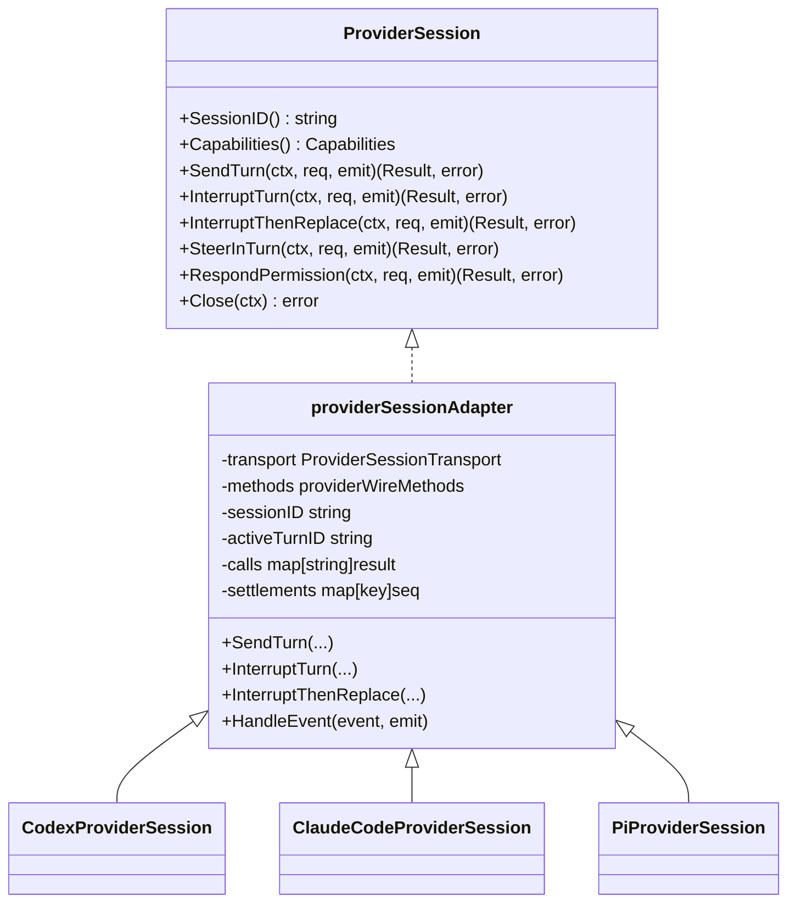
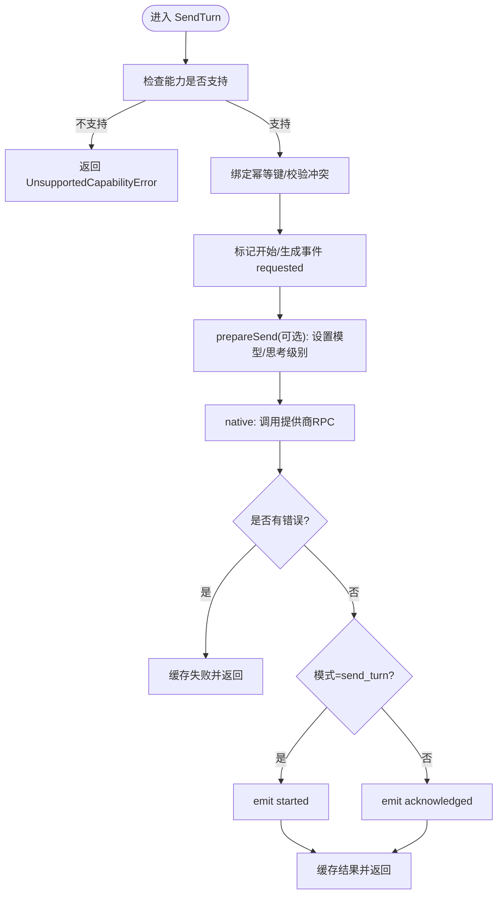
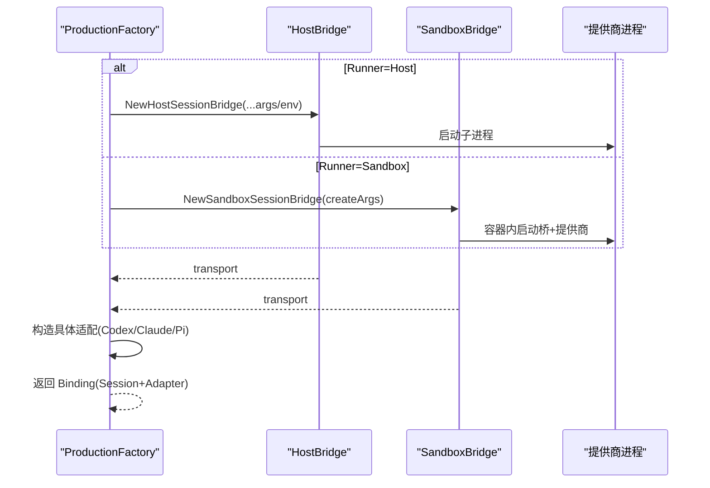
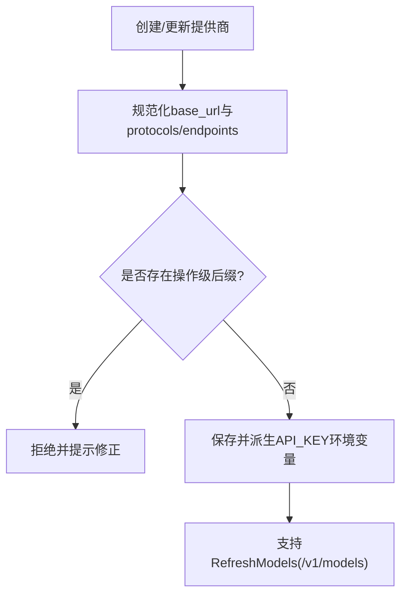
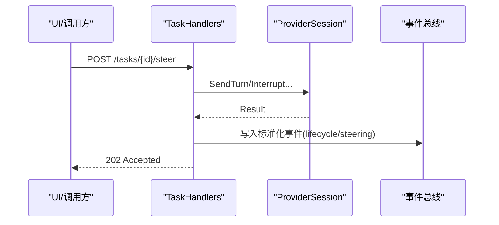
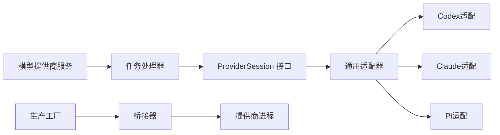

# 自定义提供商开发

<cite>
**本文引用的文件**   
- [internal/runtime/provider_session.go](file://internal/runtime/provider_session.go)
- [internal/runtime/provider_adapters.go](file://internal/runtime/provider_adapters.go)
- [internal/runtime/provider_bridge_adapter.go](file://internal/runtime/provider_bridge_adapter.go)
- [internal/daemon/provider_session_factory.go](file://internal/daemon/provider_session_factory.go)
- [internal/daemon/production_provider_session_factory.go](file://internal/daemon/production_provider_session_factory.go)
- [internal/modelprovider/modelprovider.go](file://internal/modelprovider/modelprovider.go)
- [internal/daemon/task_handlers.go](file://internal/daemon/task_handlers.go)
- [internal/daemon/logging.go](file://internal/daemon/logging.go)
- [internal/runtime/session_bridge.go](file://internal/runtime/session_bridge.go)
</cite>

## 目录
1. [简介](#简介)
2. [项目结构](#项目结构)
3. [核心组件](#核心组件)
4. [架构总览](#架构总览)
5. [详细组件分析](#详细组件分析)
6. [依赖关系分析](#依赖关系分析)
7. [性能与可靠性](#性能与可靠性)
8. [故障排查指南](#故障排查指南)
9. [结论](#结论)
10. [附录：开发模板与清单](#附录开发模板与清单)

## 简介
本指南面向需要在系统中接入“自定义AI提供商适配器”的开发者。你将学习如何基于现有接口实现新的提供商会话、桥接协议、请求/响应转换、认证集成、事件归一化、错误处理与测试方法，并了解调试技巧、性能优化建议与部署注意事项。

本项目采用分层设计：
- 运行时层（runtime）定义统一的提供商会话控制面（能力协商、幂等、事件归一化）。
- 生产装配层（daemon）负责在沙箱或宿主机上启动具体提供商进程并通过桥接器通信。
- 模型提供商配置（modelprovider）管理HTTP端点、协议族与模型目录刷新。
- 任务与日志（task、logging）提供可观测性与诊断信息。

## 项目结构
围绕“提供商适配器”的关键代码位于以下模块：
- runtime：ProviderSession 接口、通用适配器、具体提供商适配（Codex/Claude/Pi）、运行期桥接适配器。
- daemon：工厂模式组装持久化会话、选择宿主/沙箱路径、绑定生命周期。
- modelprovider：提供商元数据、协议族、端点规范化与模型目录刷新。
- task/logging：事件流与结构化日志。

图表来源
- [internal/runtime/provider_session.go:140-152](file://internal/runtime/provider_session.go#L140-L152)
- [internal/runtime/provider_adapters.go:727-785](file://internal/runtime/provider_adapters.go#L727-L785)
- [internal/runtime/provider_adapters.go:805-827](file://internal/runtime/provider_adapters.go#L805-L827)
- [internal/daemon/production_provider_session_factory.go:118-142](file://internal/daemon/production_provider_session_factory.go#L118-L142)
- [internal/daemon/provider_session_factory.go:35-41](file://internal/daemon/provider_session_factory.go#L35-L41)
- [internal/modelprovider/modelprovider.go:21-33](file://internal/modelprovider/modelprovider.go#L21-L33)
- [internal/daemon/task_handlers.go:219-246](file://internal/daemon/task_handlers.go#L219-L246)
- [internal/daemon/logging.go:76-87](file://internal/daemon/logging.go#L76-L87)

章节来源
- [internal/runtime/provider_session.go:140-152](file://internal/runtime/provider_session.go#L140-L152)
- [internal/runtime/provider_adapters.go:727-785](file://internal/runtime/provider_adapters.go#L727-L785)
- [internal/runtime/provider_adapters.go:805-827](file://internal/runtime/provider_adapters.go#L805-L827)
- [internal/daemon/production_provider_session_factory.go:118-142](file://internal/daemon/production_provider_session_factory.go#L118-L142)
- [internal/daemon/provider_session_factory.go:35-41](file://internal/daemon/provider_session_factory.go#L35-L41)
- [internal/modelprovider/modelprovider.go:21-33](file://internal/modelprovider/modelprovider.go#L21-L33)
- [internal/daemon/task_handlers.go:219-246](file://internal/daemon/task_handlers.go#L219-L246)
- [internal/daemon/logging.go:76-87](file://internal/daemon/logging.go#L76-L87)

## 核心组件
- ProviderSession 接口：统一控制面，包含发送轮次、中断、中断后替换、轮内引导、权限应答、关闭等能力。
- providerSessionAdapter：通用适配器，封装幂等键、能力检查、事件归一化、结算等待、状态机。
- 具体提供商适配：Codex/Claude/Pi 通过 providerWireMethods 映射到各自原生 RPC/命令。
- ProductionProviderSessionFactory：按 Runner（沙箱/宿主机）与 Provider 类型装配真实进程与桥接器。
- ModelProvider 服务：存储提供商元数据、端点、协议族、模型目录，并提供刷新能力。
- Task Handlers：将 HTTP 控制请求转换为 ProviderSessionRequest，并记录结构化事件。
- Logging：对 HTTP、任务、沙箱事件进行结构化输出，抑制高频轮询噪音。

章节来源
- [internal/runtime/provider_session.go:140-152](file://internal/runtime/provider_session.go#L140-L152)
- [internal/runtime/provider_adapters.go:58-92](file://internal/runtime/provider_adapters.go#L58-L92)
- [internal/runtime/provider_adapters.go:727-785](file://internal/runtime/provider_adapters.go#L727-L785)
- [internal/runtime/provider_adapters.go:805-827](file://internal/runtime/provider_adapters.go#L805-L827)
- [internal/daemon/production_provider_session_factory.go:118-142](file://internal/daemon/production_provider_session_factory.go#L118-L142)
- [internal/modelprovider/modelprovider.go:84-117](file://internal/modelprovider/modelprovider.go#L84-L117)
- [internal/daemon/task_handlers.go:219-246](file://internal/daemon/task_handlers.go#L219-L246)
- [internal/daemon/logging.go:76-87](file://internal/daemon/logging.go#L76-L87)

## 架构总览
下图展示了从 HTTP 控制到提供商进程的端到端调用链，以及事件回流路径。

图表来源
- [internal/daemon/task_handlers.go:219-246](file://internal/daemon/task_handlers.go#L219-L246)
- [internal/daemon/production_provider_session_factory.go:133-155](file://internal/daemon/production_provider_session_factory.go#L133-L155)
- [internal/runtime/provider_adapters.go:126-132](file://internal/runtime/provider_adapters.go#L126-L132)
- [internal/runtime/provider_adapters.go:339-393](file://internal/runtime/provider_adapters.go#L339-L393)
- [internal/runtime/session_bridge.go:87-87](file://internal/runtime/session_bridge.go#L87-L87)

## 详细组件分析

### 组件A：ProviderSession 接口与通用适配器
- 接口职责：定义跨提供商的统一控制语义（发送、中断、中断后替换、轮内引导、权限应答、关闭）。
- 通用适配器：
  - 能力协商：根据 capabilities 决定可用操作。
  - 幂等与冲突：以 RequestID 为幂等键，检测重复绑定与内容冲突。
  - 事件归一化：将不同提供商的事件映射为标准 outcome（requested/started/acknowledged/settled/failed）。
  - 结算等待：针对中断类操作，等待提供商侧 turn 终结信号。
  - 健康探测：支持 Closed/Terminated 通道判断离线与意外退出。

图表来源
- [internal/runtime/provider_session.go:140-152](file://internal/runtime/provider_session.go#L140-L152)
- [internal/runtime/provider_adapters.go:58-92](file://internal/runtime/provider_adapters.go#L58-L92)
- [internal/runtime/provider_adapters.go:727-785](file://internal/runtime/provider_adapters.go#L727-L785)
- [internal/runtime/provider_adapters.go:805-827](file://internal/runtime/provider_adapters.go#L805-L827)

章节来源
- [internal/runtime/provider_session.go:140-152](file://internal/runtime/provider_session.go#L140-L152)
- [internal/runtime/provider_adapters.go:58-92](file://internal/runtime/provider_adapters.go#L58-L92)
- [internal/runtime/provider_adapters.go:126-132](file://internal/runtime/provider_adapters.go#L126-L132)
- [internal/runtime/provider_adapters.go:339-393](file://internal/runtime/provider_adapters.go#L339-L393)
- [internal/runtime/provider_adapters.go:570-671](file://internal/runtime/provider_adapters.go#L570-L671)

### 组件B：具体提供商适配（Codex/Claude/Pi）
- Codex：使用 threadId/turnId，turn/start 输入为结构化数组；支持 effort 参数。
- Claude Code：通过 claude/input 发起查询，claude/interrupt 中断，claude/permission/respond 权限应答；长连接 Query 由 SDK 桥接管。
- Pi：pi/prompt、pi/abort、pi/steer、pi/permission/respond；在 send 前需先 set_model 再 set_thinking_level，顺序不可颠倒。

图表来源
- [internal/runtime/provider_adapters.go:282-337](file://internal/runtime/provider_adapters.go#L282-L337)
- [internal/runtime/provider_adapters.go:339-393](file://internal/runtime/provider_adapters.go#L339-L393)
- [internal/runtime/provider_adapters.go:829-885](file://internal/runtime/provider_adapters.go#L829-L885)

章节来源
- [internal/runtime/provider_adapters.go:727-785](file://internal/runtime/provider_adapters.go#L727-L785)
- [internal/runtime/provider_adapters.go:805-827](file://internal/runtime/provider_adapters.go#L805-L827)
- [internal/runtime/provider_adapters.go:829-885](file://internal/runtime/provider_adapters.go#L829-L885)

### 组件C：生产装配与桥接（Host/Sandbox）
- 工厂职责：根据 Runner 与 Provider 选择 Host 或 Sandbox 路径，启动桥接进程，建立 ProviderSession 并绑定 RunAdapter。
- Host 路径：直接启动提供商二进制或 SDK 桥，注入工作目录、环境变量与 Custom Args。
- Sandbox 路径：通过 Docker 创建容器，重写入口命令，以 pentest-provider-bridge 作为翻译层。
- 生命周期：Closed/Terminated 信号用于结束 Harness 等待；异常退出与显式关闭区分对待。

图表来源
- [internal/daemon/production_provider_session_factory.go:144-155](file://internal/daemon/production_provider_session_factory.go#L144-L155)
- [internal/daemon/production_provider_session_factory.go:428-534](file://internal/daemon/production_provider_session_factory.go#L428-L534)
- [internal/daemon/provider_session_factory.go:35-41](file://internal/daemon/provider_session_factory.go#L35-L41)

章节来源
- [internal/daemon/production_provider_session_factory.go:118-142](file://internal/daemon/production_provider_session_factory.go#L118-L142)
- [internal/daemon/production_provider_session_factory.go:144-155](file://internal/daemon/production_provider_session_factory.go#L144-L155)
- [internal/daemon/production_provider_session_factory.go:428-534](file://internal/daemon/production_provider_session_factory.go#L428-L534)
- [internal/daemon/provider_session_factory.go:35-41](file://internal/daemon/provider_session_factory.go#L35-L41)

### 组件D：模型提供商配置与刷新
- 协议族：openai_chat_completions、openai_responses、anthropic_messages。
- 端点规范化：禁止操作级后缀（如 /messages、/responses、/chat/completions），要求 base URL 指向协议根。
- 模型目录：支持手动维护与远程刷新（OpenAI 风格 /v1/models），合并去重排序。
- API Key：按 Provider ID 派生环境变量名，避免硬编码。

图表来源
- [internal/modelprovider/modelprovider.go:21-33](file://internal/modelprovider/modelprovider.go#L21-L33)
- [internal/modelprovider/modelprovider.go:372-434](file://internal/modelprovider/modelprovider.go#L372-L434)
- [internal/modelprovider/modelprovider.go:479-496](file://internal/modelprovider/modelprovider.go#L479-L496)
- [internal/modelprovider/modelprovider.go:624-637](file://internal/modelprovider/modelprovider.go#L624-L637)

章节来源
- [internal/modelprovider/modelprovider.go:21-33](file://internal/modelprovider/modelprovider.go#L21-L33)
- [internal/modelprovider/modelprovider.go:372-434](file://internal/modelprovider/modelprovider.go#L372-L434)
- [internal/modelprovider/modelprovider.go:479-496](file://internal/modelprovider/modelprovider.go#L479-L496)
- [internal/modelprovider/modelprovider.go:624-637](file://internal/modelprovider/modelprovider.go#L624-L637)

### 组件E：任务控制与事件流
- 任务控制器将 steer 请求转换为 ProviderSessionRequest，并写入标准化事件（含 request_id、session_id、mode、outcome 等）。
- 事件分类：lifecycle 与 steering，屏蔽敏感字段（message 不进入事件）。
- 错误呈现：将内部错误包装为稳定错误码与消息，避免泄露底层细节。

图表来源
- [internal/daemon/task_handlers.go:2326-2491](file://internal/daemon/task_handlers.go#L2326-L2491)
- [internal/runtime/provider_session.go:129-138](file://internal/runtime/provider_session.go#L129-L138)

章节来源
- [internal/daemon/task_handlers.go:2326-2491](file://internal/daemon/task_handlers.go#L2326-L2491)
- [internal/runtime/provider_session.go:129-138](file://internal/runtime/provider_session.go#L129-L138)

## 依赖关系分析
- 低耦合：ProviderSession 接口与具体适配解耦；通用适配器屏蔽差异。
- 明确边界：桥接器仅暴露 ProviderSessionTransport；原始协议帧不出现在高层事件。
- 外部依赖：Docker/宿主机进程、提供商二进制/SDK 桥、HTTP 客户端（模型目录刷新）。

图表来源
- [internal/runtime/provider_session.go:140-152](file://internal/runtime/provider_session.go#L140-L152)
- [internal/runtime/provider_adapters.go:727-785](file://internal/runtime/provider_adapters.go#L727-L785)
- [internal/daemon/production_provider_session_factory.go:118-142](file://internal/daemon/production_provider_session_factory.go#L118-L142)
- [internal/modelprovider/modelprovider.go:84-117](file://internal/modelprovider/modelprovider.go#L84-L117)
- [internal/daemon/task_handlers.go:219-246](file://internal/daemon/task_handlers.go#L219-L246)

章节来源
- [internal/runtime/provider_session.go:140-152](file://internal/runtime/provider_session.go#L140-L152)
- [internal/runtime/provider_adapters.go:727-785](file://internal/runtime/provider_adapters.go#L727-L785)
- [internal/daemon/production_provider_session_factory.go:118-142](file://internal/daemon/production_provider_session_factory.go#L118-L142)
- [internal/modelprovider/modelprovider.go:84-117](file://internal/modelprovider/modelprovider.go#L84-L117)
- [internal/daemon/task_handlers.go:219-246](file://internal/daemon/task_handlers.go#L219-L246)

## 性能与可靠性
- 幂等与缓存：同一 RequestID 的结果会被缓存，避免重复下发原生帧。
- 结算等待：中断类操作等待提供商 turn 终结，确保一致性。
- 健康探测：利用 Closed/Terminated 通道快速感知异常退出，减少无效重试。
- 日志降噪：抑制高频轮询 GET 的请求日志，聚焦关键事件。
- 资源清理：容器/进程组关闭时清理临时工件（如 Pi 的 auth/sessions）。

章节来源
- [internal/runtime/provider_adapters.go:502-523](file://internal/runtime/provider_adapters.go#L502-L523)
- [internal/runtime/provider_adapters.go:425-445](file://internal/runtime/provider_adapters.go#L425-L445)
- [internal/daemon/logging.go:76-87](file://internal/daemon/logging.go#L76-L87)
- [internal/daemon/production_provider_session_factory.go:416-426](file://internal/daemon/production_provider_session_factory.go#L416-L426)

## 故障排查指南
- 常见错误类型
  - 能力不支持：UnsupportedProviderSessionCapabilityError。
  - 会话关闭：ErrProviderSessionClosed。
  - 请求冲突：ErrProviderSessionRequestConflict。
  - 操作失败：ProviderSessionOperationError（Cause 保留内部细节）。
  - 桥接 RPC 错误：SandboxBridgeRPCError。
- 定位步骤
  - 查看任务事件中的 mode/outcome/request_id/session_id。
  - 核对 ProviderSession 能力集与当前操作匹配。
  - 检查桥接器 Closed/Terminated 信号，确认是否为意外退出。
  - 对于模型目录刷新失败，检查 base URL 是否合法且无操作级后缀。
- 日志与诊断
  - 使用结构化日志观察 HTTP 请求、任务阶段、沙箱事件。
  - 关注 custom_args 冲突的诊断输出，避免敏感信息泄露。

章节来源
- [internal/runtime/provider_session.go:40-90](file://internal/runtime/provider_session.go#L40-L90)
- [internal/runtime/session_bridge.go:87-87](file://internal/runtime/session_bridge.go#L87-L87)
- [internal/daemon/logging.go:137-170](file://internal/daemon/logging.go#L137-L170)
- [internal/modelprovider/modelprovider.go:372-434](file://internal/modelprovider/modelprovider.go#L372-L434)

## 结论
通过 ProviderSession 接口与通用适配器，系统实现了跨提供商的统一控制面；生产工厂负责在不同执行环境（Host/Sandbox）中装配桥接器与具体适配；模型提供商服务提供端点与目录管理能力。遵循本指南可实现新提供商适配器的安全、可靠与可观测集成。

## 附录：开发模板与清单

- 新增提供商适配步骤
  - 定义 providerWireMethods：send/interrupt/steer/permission/params/prepareSend/turnID/sessionID。
  - 实现 NewXxxProviderSession(config)，注册到适配层。
  - 在工厂中增加对应分支（Host/Sandbox）以启动桥接与初始化流程。
  - 若需要模型目录刷新，确保 base URL 符合规范并在 modelprovider 中声明协议族。
- 认证集成
  - 使用 Provider.APIKeyEnv 读取密钥，避免硬编码。
  - 刷新模型目录时使用 Authorization: Bearer <key>。
- 请求/响应转换
  - 在 params 函数中将高层字段映射为提供商原生字段。
  - 在 prepareSend 中完成前置设置（如 Pi 的 set_model/set_thinking_level）。
- 事件归一化
  - 使用 HandleEvent 将提供商通知映射为标准 outcome 与 correlation 字段。
- 错误处理
  - 返回 typed error（Unsupported/Conflict/OperationError），保持 Cause 可诊断。
- 测试方法
  - 使用 FakeProviderSession 模拟行为，断言事件与结果。
  - 使用 fakeProviderTransport 捕获 wire 请求与通知，验证参数映射。
- 调试技巧
  - 开启结构化日志，关注 task launch stage、sandbox phase、http 请求耗时。
  - 使用 RequestID 追踪一次操作的完整生命周期。
- 性能优化
  - 复用持久会话，避免频繁重启。
  - 合理设置超时与上下文取消，避免阻塞。
- 部署注意
  - Host：确保提供商二进制/SDK 桥存在且可执行，正确传递工作目录与环境变量。
  - Sandbox：镜像中包含桥与提供商，重写入口命令，保证网络与卷挂载策略。

章节来源
- [internal/runtime/provider_adapters.go:727-785](file://internal/runtime/provider_adapters.go#L727-L785)
- [internal/runtime/provider_adapters.go:805-827](file://internal/runtime/provider_adapters.go#L805-L827)
- [internal/daemon/production_provider_session_factory.go:144-155](file://internal/daemon/production_provider_session_factory.go#L144-L155)
- [internal/modelprovider/modelprovider.go:223-284](file://internal/modelprovider/modelprovider.go#L223-L284)
- [internal/daemon/logging.go:106-114](file://internal/daemon/logging.go#L106-L114)