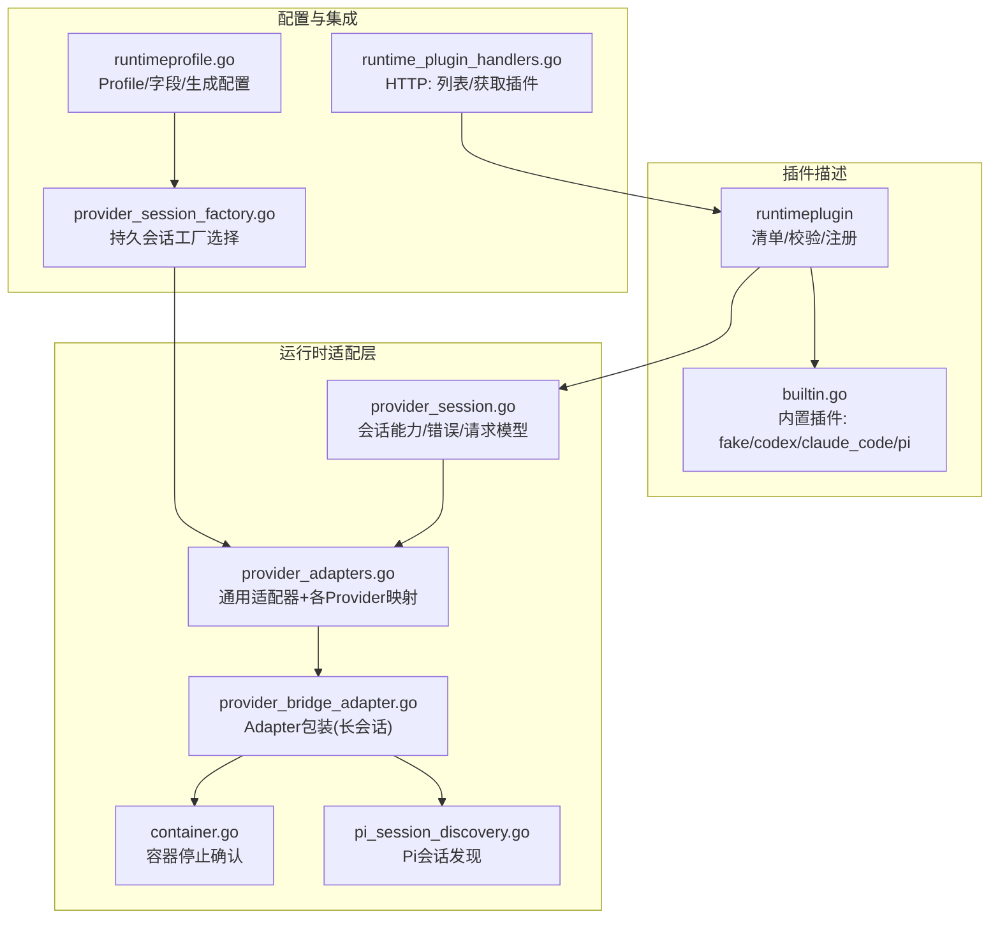
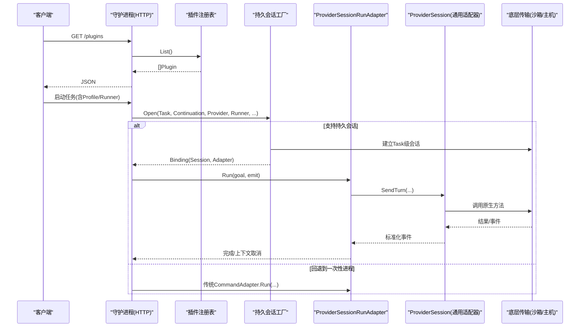
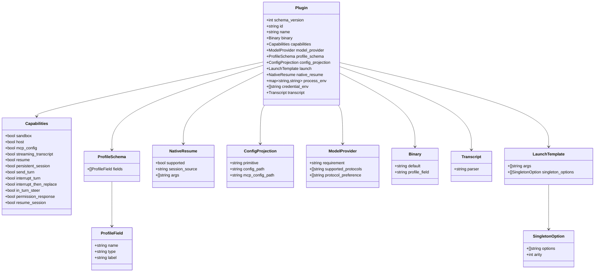
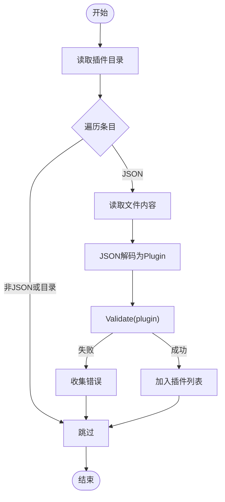
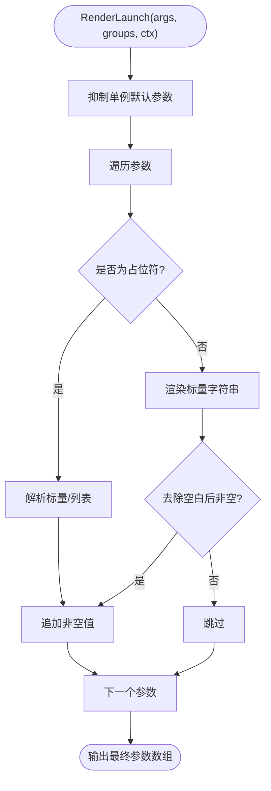
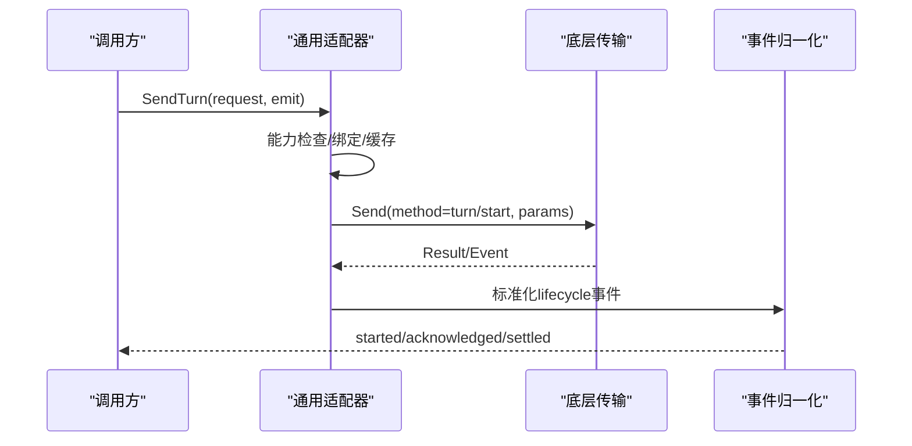
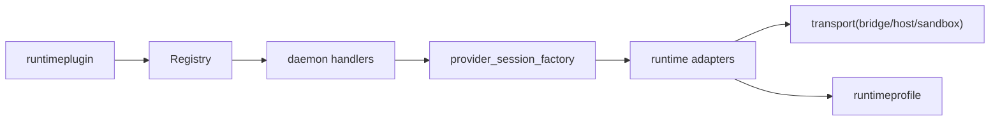

# 运行时插件系统

<cite>
**本文引用的文件**   
- [internal/runtimeplugin/plugin.go](file://internal/runtimeplugin/plugin.go)
- [internal/runtimeplugin/loader.go](file://internal/runtimeplugin/loader.go)
- [internal/runtimeplugin/registry.go](file://internal/runtimeplugin/registry.go)
- [internal/runtimeplugin/template.go](file://internal/runtimeplugin/template.go)
- [internal/runtimeplugin/builtin.go](file://internal/runtimeplugin/builtin.go)
- [internal/runtime/provider_session.go](file://internal/runtime/provider_session.go)
- [internal/runtime/provider_adapters.go](file://internal/runtime/provider_adapters.go)
- [internal/runtime/provider_bridge_adapter.go](file://internal/runtime/provider_bridge_adapter.go)
- [internal/runtime/container.go](file://internal/runtime/container.go)
- [internal/runtime/pi_session_discovery.go](file://internal/runtime/pi_session_discovery.go)
- [internal/daemon/runtime_plugin_handlers.go](file://internal/daemon/runtime_plugin_handlers.go)
- [internal/daemon/provider_session_factory.go](file://internal/daemon/provider_session_factory.go)
- [internal/runtimeprofile/runtimeprofile.go](file://internal/runtimeprofile/runtimeprofile.go)
</cite>

## 目录
1. [简介](#简介)
2. [项目结构](#项目结构)
3. [核心组件](#核心组件)
4. [架构总览](#架构总览)
5. [详细组件分析](#详细组件分析)
6. [依赖关系分析](#依赖关系分析)
7. [性能与可扩展性](#性能与可扩展性)
8. [故障排查指南](#故障排查指南)
9. [结论](#结论)
10. [附录：开发规范与示例](#附录开发规范与示例)

## 简介
本文件系统性阐述 CyberPenda 的“运行时插件系统”，围绕以下目标展开：
- 插件声明式配置、能力声明、二进制管理、启动模板与会话恢复机制
- 插件发现、加载、验证与注册流程
- 插件开发规范、接口定义、安全边界与版本兼容性
- 内置适配器实现模式（Codex、Claude Code、Pi）

该子系统将外部 AI 编程助手（CLI/SDK）以“插件”形式接入，通过统一的会话控制面与事件流，为任务提供可插拔、可沙箱化、可恢复的执行环境。

## 项目结构
运行时插件系统由“声明式插件描述 + 运行时适配层 + 持久化配置 + 守护进程集成”组成：
- 插件描述与注册：runtimeplugin 包负责解析、校验、注册插件清单
- 运行时适配层：runtime 包提供会话抽象、适配器封装、桥接与容器生命周期
- 运行期配置：runtimeprofile 包维护全局 Profile，驱动生成配置与字段校验
- 守护进程集成：daemon 暴露 HTTP API 列出/查询插件，并提供工厂创建持久会话

图表来源
- [internal/runtimeplugin/builtin.go:1-221](file://internal/runtimeplugin/builtin.go#L1-L221)
- [internal/runtimeplugin/plugin.go:1-224](file://internal/runtimeplugin/plugin.go#L1-L224)
- [internal/runtime/provider_session.go:1-505](file://internal/runtime/provider_session.go#L1-L505)
- [internal/runtime/provider_adapters.go:1-800](file://internal/runtime/provider_adapters.go#L1-L800)
- [internal/runtime/provider_bridge_adapter.go:1-128](file://internal/runtime/provider_bridge_adapter.go#L1-L128)
- [internal/runtime/container.go:1-89](file://internal/runtime/container.go#L1-L89)
- [internal/runtime/pi_session_discovery.go:1-86](file://internal/runtime/pi_session_discovery.go#L1-L86)
- [internal/runtimeprofile/runtimeprofile.go:1-526](file://internal/runtimeprofile/runtimeprofile.go#L1-L526)
- [internal/daemon/runtime_plugin_handlers.go:1-34](file://internal/daemon/runtime_plugin_handlers.go#L1-L34)
- [internal/daemon/provider_session_factory.go:1-92](file://internal/daemon/provider_session_factory.go#L1-L92)

章节来源
- [internal/runtimeplugin/plugin.go:1-224](file://internal/runtimeplugin/plugin.go#L1-L224)
- [internal/runtimeplugin/loader.go:1-49](file://internal/runtimeplugin/loader.go#L1-L49)
- [internal/runtimeplugin/registry.go:1-99](file://internal/runtimeplugin/registry.go#L1-L99)
- [internal/runtimeplugin/template.go:1-166](file://internal/runtimeplugin/template.go#L1-L166)
- [internal/runtimeplugin/builtin.go:1-221](file://internal/runtimeplugin/builtin.go#L1-L221)
- [internal/runtime/provider_session.go:1-505](file://internal/runtime/provider_session.go#L1-L505)
- [internal/runtime/provider_adapters.go:1-800](file://internal/runtime/provider_adapters.go#L1-L800)
- [internal/runtime/provider_bridge_adapter.go:1-128](file://internal/runtime/provider_bridge_adapter.go#L1-L128)
- [internal/runtime/container.go:1-89](file://internal/runtime/container.go#L1-L89)
- [internal/runtime/pi_session_discovery.go:1-86](file://internal/runtime/pi_session_discovery.go#L1-L86)
- [internal/runtimeprofile/runtimeprofile.go:1-526](file://internal/runtimeprofile/runtimeprofile.go#L1-L526)
- [internal/daemon/runtime_plugin_handlers.go:1-34](file://internal/daemon/runtime_plugin_handlers.go#L1-L34)
- [internal/daemon/provider_session_factory.go:1-92](file://internal/daemon/provider_session_factory.go#L1-L92)

## 核心组件
- 插件清单与校验
  - 数据结构：Plugin、Capabilities、Binary、ModelProvider、ProfileSchema、ConfigProjection、LaunchTemplate、NativeResume、Transcript
  - 校验规则：schema_version、id/name/binary.default、投影原语、模型提供者协议、转储解析器、启动参数、原生恢复参数、Profile字段类型、凭据环境变量命名等
- 插件发现与注册
  - 从目录扫描 .json 清单并逐一解码、校验
  - 注册表去重、排序、克隆返回，避免共享可变状态
- 启动模板渲染
  - 支持标量与列表占位符、可选参数抑制、单例选项组覆盖
  - 安全：禁止在模板中直接注入值；仅允许白名单键
- 会话能力与操作
  - 能力集：持久会话、发送轮次、中断、中断后替换、轮内引导、权限响应、恢复会话
  - 统一错误语义：冲突、关闭、不支持能力、操作失败
- 适配器与桥接
  - 通用适配器封装：幂等、事件归一化、结算等待、健康检测
  - ProviderSessionRunAdapter：将长会话包装成 Harness 可用的 Adapter
- 配置与集成
  - 全局 Profile 结构化字段、生成预览配置、自定义参数冲突校验
  - 守护进程 HTTP 暴露插件列表/详情；持久会话工厂按 Runner/Provider 选择路径

章节来源
- [internal/runtimeplugin/plugin.go:136-215](file://internal/runtimeplugin/plugin.go#L136-L215)
- [internal/runtimeplugin/loader.go:13-48](file://internal/runtimeplugin/loader.go#L13-L48)
- [internal/runtimeplugin/registry.go:13-99](file://internal/runtimeplugin/registry.go#L13-L99)
- [internal/runtimeplugin/template.go:13-166](file://internal/runtimeplugin/template.go#L13-L166)
- [internal/runtime/provider_session.go:14-152](file://internal/runtime/provider_session.go#L14-L152)
- [internal/runtime/provider_adapters.go:58-128](file://internal/runtime/provider_adapters.go#L58-L128)
- [internal/runtime/provider_bridge_adapter.go:16-128](file://internal/runtime/provider_bridge_adapter.go#L16-L128)
- [internal/runtimeprofile/runtimeprofile.go:75-116](file://internal/runtimeprofile/runtimeprofile.go#L75-L116)
- [internal/daemon/runtime_plugin_handlers.go:9-34](file://internal/daemon/runtime_plugin_handlers.go#L9-L34)
- [internal/daemon/provider_session_factory.go:13-92](file://internal/daemon/provider_session_factory.go#L13-L92)

## 架构总览
运行时插件系统的关键交互如下：
- 守护进程通过 runtime plugin handlers 暴露插件清单/详情
- 插件清单由 loader 扫描目录、validate 校验、registry 注册
- 启动时根据 Profile 与 Runner 选择是否使用“持久会话工厂”
- 持久会话工厂创建 ProviderSession，并通过 ProviderSessionRunAdapter 作为 Adapter 交给 Harness 驱动首回合
- 通用适配器封装对底层传输的调用、事件归一化、能力检查与结算等待
- 容器停止确认与 Pi 会话发现辅助资源回收与恢复

图表来源
- [internal/daemon/runtime_plugin_handlers.go:9-34](file://internal/daemon/runtime_plugin_handlers.go#L9-L34)
- [internal/runtimeplugin/registry.go:60-78](file://internal/runtimeplugin/registry.go#L60-L78)
- [internal/daemon/provider_session_factory.go:60-92](file://internal/daemon/provider_session_factory.go#L60-L92)
- [internal/runtime/provider_bridge_adapter.go:70-112](file://internal/runtime/provider_bridge_adapter.go#L70-L112)
- [internal/runtime/provider_adapters.go:126-192](file://internal/runtime/provider_adapters.go#L126-L192)

## 详细组件分析

### 插件清单与校验（runtimeplugin）
- 清单字段
  - schema_version、id、name、description、binary、capabilities、model_provider、profile_schema、config_projection、launch、native_resume、process_env、credential_env、transcript
- 校验要点
  - id 格式、必填项、投影原语白名单、模型提供者协议白名单与去重、转储解析器白名单、启动参数非空、原生恢复参数约束、Profile 字段类型白名单、凭据环境变量名不得包含值片段
- 内置插件
  - fake、codex、claude_code、pi，均声明能力、模型提供者要求、配置投影、启动模板、原生恢复与环境变量、凭据环境变量、转储解析器

图表来源
- [internal/runtimeplugin/plugin.go:19-96](file://internal/runtimeplugin/plugin.go#L19-L96)
- [internal/runtimeplugin/plugin.go:98-134](file://internal/runtimeplugin/plugin.go#L98-L134)
- [internal/runtimeplugin/builtin.go:18-213](file://internal/runtimeplugin/builtin.go#L18-L213)

章节来源
- [internal/runtimeplugin/plugin.go:136-215](file://internal/runtimeplugin/plugin.go#L136-L215)
- [internal/runtimeplugin/builtin.go:1-221](file://internal/runtimeplugin/builtin.go#L1-L221)

### 插件发现、加载与注册
- 发现：读取顶层目录，仅考虑 .json 文件
- 加载：逐文件解码 JSON 为 Plugin，并执行 Validate
- 注册：NewRegistry 去重、排序；Get/List/IDs 返回深拷贝，避免外部修改影响内部状态

图表来源
- [internal/runtimeplugin/loader.go:13-48](file://internal/runtimeplugin/loader.go#L13-L48)
- [internal/runtimeplugin/plugin.go:136-215](file://internal/runtimeplugin/plugin.go#L136-L215)

章节来源
- [internal/runtimeplugin/loader.go:13-48](file://internal/runtimeplugin/loader.go#L13-L48)
- [internal/runtimeplugin/registry.go:13-99](file://internal/runtimeplugin/registry.go#L13-L99)

### 启动模板渲染与单例选项抑制
- 渲染策略
  - 支持 {{key}} 标量与列表占位符
  - 可选前缀参数在值为空时自动抑制
  - 单例选项组：当用户传入 custom_args 包含某组选项时，抑制默认同组参数
- 安全
  - 仅允许白名单键；未闭合模板视为无效

图表来源
- [internal/runtimeplugin/template.go:13-84](file://internal/runtimeplugin/template.go#L13-L84)
- [internal/runtimeplugin/template.go:130-145](file://internal/runtimeplugin/template.go#L130-L145)

章节来源
- [internal/runtimeplugin/template.go:13-166](file://internal/runtimeplugin/template.go#L13-L166)

### 会话能力、错误与请求模型（runtime）
- 能力枚举：persistent_session、send_turn、interrupt_turn、interrupt_then_replace、in_turn_steer、permission_response、resume_session
- 模式枚举：send_turn、interrupt_turn、interrupt_then_replace、in_turn_steer、permission_response
- 关键错误：控制冲突、会话关闭、无效请求、请求ID冲突、不支持能力、操作失败
- 请求/结果：RequestID 幂等键；Result 携带会话ID、ProviderTurnID、Mode、Outcome

章节来源
- [internal/runtime/provider_session.go:14-152](file://internal/runtime/provider_session.go#L14-L152)
- [internal/runtime/provider_session.go:40-90](file://internal/runtime/provider_session.go#L40-L90)

### 通用适配器与事件归一化（provider_adapters）
- 通用适配器职责
  - 能力检查、请求绑定与冲突检测、缓存与幂等、结算等待（基于事件中的 turn/session 标识）
  - 事件归一化：将不同 provider 的事件映射为标准 lifecycle/steering/output 事件
- 具体 Provider 映射
  - Codex：turn/start、turn/interrupt、item/permission/respond
  - Claude Code：claude/input、claude/interrupt、claude/permission/respond
  - Pi：通过 prepareSend 设置模型/思考级别后再发送
- 健康与离线判断
  - 支持 Terminated/Closed 通道信号，区分显式关闭与非预期退出

图表来源
- [internal/runtime/provider_adapters.go:126-192](file://internal/runtime/provider_adapters.go#L126-L192)
- [internal/runtime/provider_adapters.go:570-671](file://internal/runtime/provider_adapters.go#L570-L671)

章节来源
- [internal/runtime/provider_adapters.go:58-128](file://internal/runtime/provider_adapters.go#L58-L128)
- [internal/runtime/provider_adapters.go:126-192](file://internal/runtime/provider_adapters.go#L126-L192)
- [internal/runtime/provider_adapters.go:570-671](file://internal/runtime/provider_adapters.go#L570-L671)

### 持久会话包装与 Harness 集成（provider_bridge_adapter）
- ProviderSessionRunAdapter 将长会话包装为 Adapter，供 Harness 驱动首回合
- 记录初始 Turn Selection（模型提供者、模型、推理努力），并在完成后记录元数据（容器ID/原生会话ID/路径）
- 处理 Bridge 事件转发至会话适配器进行归一化

章节来源
- [internal/runtime/provider_bridge_adapter.go:16-128](file://internal/runtime/provider_bridge_adapter.go#L16-L128)

### 容器停止确认与会话发现（container、pi_session_discovery）
- Docker 容器停止确认：读取 cidfile，轮询 inspect 状态，超时报错
- Pi 会话发现：扫描 sessions 目录最新 .jsonl，解析首个带会话ID的行，返回 NativeSessionMetadata

章节来源
- [internal/runtime/container.go:26-89](file://internal/runtime/container.go#L26-L89)
- [internal/runtime/pi_session_discovery.go:13-85](file://internal/runtime/pi_session_discovery.go#L13-L85)

### 守护进程集成（HTTP 与工厂）
- HTTP 接口
  - 列出插件：返回所有已注册插件
  - 获取插件：按 ID 返回单个插件
- 持久会话工厂
  - 根据 Runner 与 Provider 决定是否走持久会话路径
  - 校验返回的 Binding 必须包含有效 Session 与 Adapter

章节来源
- [internal/daemon/runtime_plugin_handlers.go:9-34](file://internal/daemon/runtime_plugin_handlers.go#L9-L34)
- [internal/daemon/provider_session_factory.go:60-92](file://internal/daemon/provider_session_factory.go#L60-L92)

### 运行期配置（runtimeprofile）
- 结构化字段：binary_path、model、endpoint、model_provider_id、reasoning_effort、custom_args、env、api_keys、credential_refs、runtime_extensions、mcp_servers、default_runner、sandbox_image
- 生成配置：只读预览，不包含敏感值；API Keys 脱敏展示
- 校验：自定义参数冲突、ReasoningEffort 规范化

章节来源
- [internal/runtimeprofile/runtimeprofile.go:75-116](file://internal/runtimeprofile/runtimeprofile.go#L75-L116)
- [internal/runtimeprofile/runtimeprofile.go:351-433](file://internal/runtimeprofile/runtimeprofile.go#L351-L433)
- [internal/runtimeprofile/runtimeprofile.go:448-467](file://internal/runtimeprofile/runtimeprofile.go#L448-L467)

## 依赖关系分析
- 低耦合高内聚
  - runtimeplugin 不依赖运行时细节，仅提供清单/校验/注册
  - runtime 层通过 ProviderSessionTransport 抽象与底层解耦
  - daemon 仅通过接口与工厂协作，不感知具体协议
- 潜在循环依赖
  - 当前未见循环导入；插件描述与运行时适配分层清晰
- 外部依赖点
  - 文件系统（插件清单、Pi 会话）、容器 CLI（Docker/Podman）、网络传输（沙箱桥接）

图表来源
- [internal/runtimeplugin/registry.go:13-99](file://internal/runtimeplugin/registry.go#L13-L99)
- [internal/daemon/runtime_plugin_handlers.go:9-34](file://internal/daemon/runtime_plugin_handlers.go#L9-L34)
- [internal/daemon/provider_session_factory.go:60-92](file://internal/daemon/provider_session_factory.go#L60-L92)
- [internal/runtime/provider_adapters.go:126-192](file://internal/runtime/provider_adapters.go#L126-L192)
- [internal/runtimeprofile/runtimeprofile.go:351-433](file://internal/runtimeprofile/runtimeprofile.go#L351-L433)

章节来源
- [internal/runtimeplugin/registry.go:13-99](file://internal/runtimeplugin/registry.go#L13-L99)
- [internal/daemon/runtime_plugin_handlers.go:9-34](file://internal/daemon/runtime_plugin_handlers.go#L9-L34)
- [internal/daemon/provider_session_factory.go:60-92](file://internal/daemon/provider_session_factory.go#L60-L92)
- [internal/runtime/provider_adapters.go:126-192](file://internal/runtime/provider_adapters.go#L126-L192)
- [internal/runtimeprofile/runtimeprofile.go:351-433](file://internal/runtimeprofile/runtimeprofile.go#L351-L433)

## 性能与可扩展性
- 模板渲染 O(n) 线性扫描，适合短参数列表
- 注册表访问 O(1) 查找，List/IDs 复制开销与插件数量线性相关
- 会话适配器缓存最近一次请求结果，减少重复调用
- 事件归一化采用轻量字符串匹配与 JSON 字段抽取，避免重型解析
- 扩展建议
  - 新增插件仅需声明清单与模板，无需改动运行时核心
  - 通过 Profile 字段与 ConfigProjection 灵活对接第三方工具配置

[本节为通用指导，不涉及具体文件分析]

## 故障排查指南
- 常见错误定位
  - 清单校验失败：检查 schema_version、id/name/binary.default、投影原语、协议白名单、转储解析器、启动参数、原生恢复参数、Profile 字段类型、凭据环境变量名
  - 会话控制冲突：同一 Task 会话并发控制操作导致
  - 不支持能力：插件未声明对应 capability，调用将被拒绝
  - 操作失败：底层传输错误或 RPC 错误，需查看 Cause
- 诊断手段
  - 通过 HTTP 接口列出/获取插件，确认注册正确
  - 观察标准化事件（lifecycle/steering/output）定位阶段
  - 容器停止确认日志帮助判断资源释放情况
  - Pi 会话发现失败时检查 sessions 目录与 .jsonl 文件可读性

章节来源
- [internal/runtimeplugin/plugin.go:136-215](file://internal/runtimeplugin/plugin.go#L136-L215)
- [internal/runtime/provider_session.go:40-90](file://internal/runtime/provider_session.go#L40-L90)
- [internal/daemon/runtime_plugin_handlers.go:9-34](file://internal/daemon/runtime_plugin_handlers.go#L9-L34)
- [internal/runtime/container.go:26-89](file://internal/runtime/container.go#L26-L89)
- [internal/runtime/pi_session_discovery.go:13-85](file://internal/runtime/pi_session_discovery.go#L13-L85)

## 结论
CyberPenda 的运行时插件系统通过“声明式清单 + 强校验 + 模板渲染 + 统一会话抽象”实现了高度可插拔的执行平面。内置适配器覆盖了主流 AI 编程助手，配合 Profile 与持久会话工厂，既保证了安全性与可恢复性，又提供了良好的扩展性与可观测性。

[本节为总结，不涉及具体文件分析]

## 附录：开发规范与示例

### 插件开发规范
- 清单字段
  - 必填：schema_version、id、name、binary.default、launch.args、transcript.parser
  - 能力：按需启用 sandbox/host/mcp_config/streaming_transcript/resume/persistent_session/send_turn/interrupt_turn/interrupt_then_replace/in_turn_steer/permission_response/resume_session
  - 模型提供者：requirement 可为 none/optional/required；supported_protocols 与 preference 需在白名单内
  - 配置投影：primitive 可为 none/generic_config/codex_home/claude_settings/pi_agent；必要时指定 config_path 与 mcp_config_path
  - 启动模板：args 使用 {{...}} 占位符；singleton_options 用于抑制默认参数
  - 原生恢复：native_resume.supported=true 时需声明 args 与 session_source
  - 环境变量：process_env 用于运行时环境；credential_env 仅列变量名，不可包含值片段
- 安全边界
  - 模板渲染仅允许白名单键；禁止在清单中硬编码密钥
  - 凭据通过 Profile 的 api_keys/credential_refs 注入，不在清单中出现
  - 事件归一化确保敏感信息不出现在 Task 事件载荷中

章节来源
- [internal/runtimeplugin/plugin.go:136-215](file://internal/runtimeplugin/plugin.go#L136-L215)
- [internal/runtimeplugin/template.go:130-145](file://internal/runtimeplugin/template.go#L130-L145)
- [internal/runtime/profile/profile.go:75-116](file://internal/runtimeprofile/runtimeprofile.go#L75-L116)

### 接口定义速览
- 插件清单：Plugin、Capabilities、Binary、ModelProvider、ProfileSchema、ConfigProjection、LaunchTemplate、NativeResume、Transcript
- 会话接口：ProviderSession（SendTurn/InterruptTurn/InterruptThenReplace/SteerInTurn/RespondPermission/Close）
- 适配器接口：Adapter（Name/Run），以及 metadataRecordingAdapter（SetMetadataRecorder）
- 工厂接口：ProviderSessionFactory（Open）

章节来源
- [internal/runtimeplugin/plugin.go:19-96](file://internal/runtimeplugin/plugin.go#L19-L96)
- [internal/runtime/provider_session.go:140-152](file://internal/runtime/provider_session.go#L140-L152)
- [internal/runtime/runtime.go:23-34](file://internal/runtime/runtime.go#L23-L34)
- [internal/daemon/provider_session_factory.go:35-41](file://internal/daemon/provider_session_factory.go#L35-L41)

### 内置适配器实现模式
- Codex
  - 能力：沙箱/主机、MCP 配置、流式转储、恢复、持久会话、轮次控制、权限响应、会话恢复
  - 模型提供者：openai_responses
  - 配置投影：codex_home -> runtime-home/codex/config.toml
  - 启动模板：{{binary}} + codex_subcommand + --model + exec_args + custom_args + goal_prefix + goal
  - 原生恢复：exec --model ... resume <session> <message>
  - 转储解析器：codex_json
- Claude Code
  - 能力：同上
  - 模型提供者：anthropic_messages
  - 配置投影：claude_settings -> runtime-home/claude/settings.json；MCP -> workdir/.mcp.json
  - 启动模板：--model/--settings/-p/--output-format stream-json/--verbose + custom_args + goal_prefix + goal
  - 原生恢复：--resume <session> --model --settings -p --output-format stream-json --verbose + custom_args + resumed_message
  - 转储解析器：claude_stream_json
- Pi
  - 能力：同上
  - 模型提供者：openai_chat_completions/openai_responses/anthropic_messages
  - 配置投影：pi_agent -> runtime-home/pi/agent/models.json；MCP -> runtime-home/pi/agent/mcp.json
  - 启动模板：{{binary}} + pi_provider_args + --model --mode json + custom_args + goal
  - 原生恢复：--session <session> + custom_args + resumed_message
  - 转储解析器：pi_json_session

章节来源
- [internal/runtimeplugin/builtin.go:44-213](file://internal/runtimeplugin/builtin.go#L44-L213)