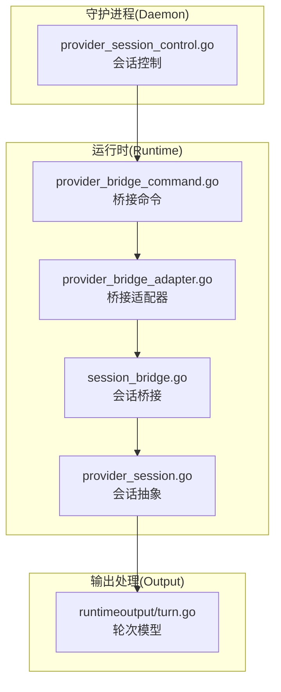
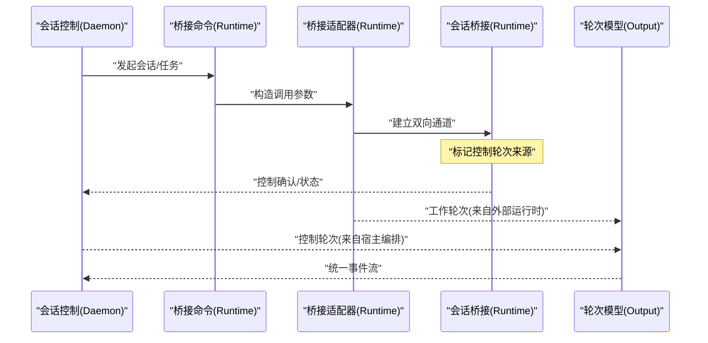
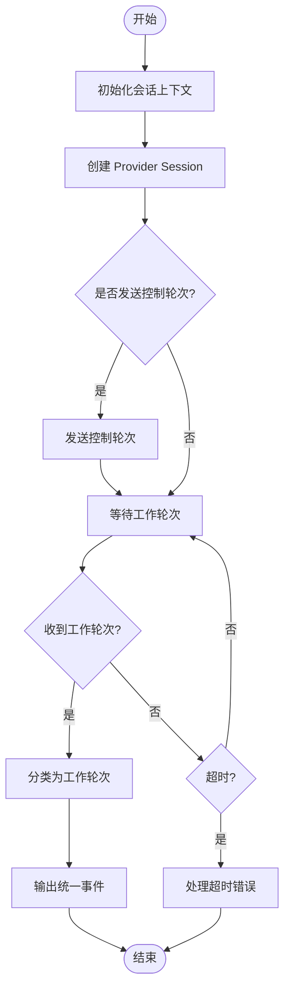
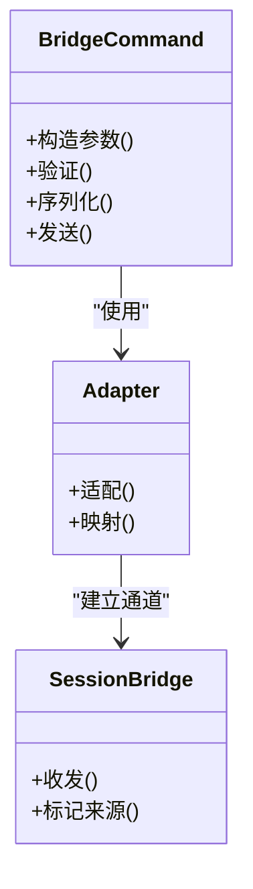

# 架构决策记录 0018 - 分离工作轮次与控制轮次

<cite>
**本文引用的文件**   
- [docs/adr/0018-separate-work-turns-from-harness-control-turns.md](file://docs/adr/0018-separate-work-turns-from-harness-control-turns.md)
- [internal/daemon/provider_session_control.go](file://internal/daemon/provider_session_control.go)
- [internal/runtime/provider_bridge_command.go](file://internal/runtime/provider_bridge_command.go)
- [internal/runtime/provider_bridge_adapter.go](file://internal/runtime/provider_bridge_adapter.go)
- [internal/runtime/session_bridge.go](file://internal/runtime/session_bridge.go)
- [internal/runtime/provider_session.go](file://internal/runtime/provider_session.go)
- [internal/runtimeoutput/turn.go](file://internal/runtimeoutput/turn.go)
</cite>

## 目录
1. [引言](#引言)
2. [项目结构](#项目结构)
3. [核心组件](#核心组件)
4. [架构总览](#架构总览)
5. [详细组件分析](#详细组件分析)
6. [依赖关系分析](#依赖关系分析)
7. [性能考量](#性能考量)
8. [故障排查指南](#故障排查指南)
9. [结论](#结论)

## 引言
本架构决策记录（ADR-0018）聚焦于“将工作轮次与控制轮次分离”的设计变更。其目标是在多提供者会话编排中，明确区分两类轮次：
- 工作轮次：由被调用的外部运行时（如 Codex、Claude Code、Pi 等）产生的实际执行与产出轮次。
- 控制轮次：由宿主侧编排器（Daemon/Provider Session）发出的调度、同步、状态更新等控制性轮次。

通过职责分离，提升可观测性、可恢复性与安全性边界，降低跨进程通信的耦合度，并为后续的黑板 v2 写入与投影合并提供更清晰的输入来源标识。

## 项目结构
围绕 ADR-0018 的相关代码主要分布在以下模块：
- Daemon 层：提供会话控制与调度入口，管理 Provider Session 生命周期。
- Runtime 层：封装与外部运行时的桥接命令、适配器与会话桥接。
- 输出处理层：对轮次进行解析与分类，统一为结构化事件流。

**图表来源** 
- [internal/daemon/provider_session_control.go](file://internal/daemon/provider_session_control.go)
- [internal/runtime/provider_bridge_command.go](file://internal/runtime/provider_bridge_command.go)
- [internal/runtime/provider_bridge_adapter.go](file://internal/runtime/provider_bridge_adapter.go)
- [internal/runtime/session_bridge.go](file://internal/runtime/session_bridge.go)
- [internal/runtime/provider_session.go](file://internal/runtime/provider_session.go)
- [internal/runtimeoutput/turn.go](file://internal/runtimeoutput/turn.go)

**章节来源**
- [docs/adr/0018-separate-work-turns-from-harness-control-turns.md](file://docs/adr/0018-separate-work-turns-from-harness-control-turns.md)

## 核心组件
- 会话控制（Daemon）：负责启动、协调与终止 Provider Session，并注入控制轮次。
- 桥接命令（Runtime）：封装对外部运行时的调用协议，确保控制与工作轮次的边界清晰。
- 桥接适配器（Runtime）：适配不同运行时实现，屏蔽差异，统一轮次语义。
- 会话桥接（Runtime）：维护双向通道，转发消息并标记轮次类型。
- 会话抽象（Runtime）：定义统一的会话接口，便于替换具体实现。
- 轮次模型（Output）：定义工作轮次与控制轮次的结构及转换规则。

**章节来源**
- [internal/daemon/provider_session_control.go](file://internal/daemon/provider_session_control.go)
- [internal/runtime/provider_bridge_command.go](file://internal/runtime/provider_bridge_command.go)
- [internal/runtime/provider_bridge_adapter.go](file://internal/runtime/provider_bridge_adapter.go)
- [internal/runtime/session_bridge.go](file://internal/runtime/session_bridge.go)
- [internal/runtime/provider_session.go](file://internal/runtime/provider_session.go)
- [internal/runtimeoutput/turn.go](file://internal/runtimeoutput/turn.go)

## 架构总览
下图展示了从守护进程到运行时再到输出处理的完整调用链，以及控制轮次与工作轮次的分流路径。

**图表来源** 
- [internal/daemon/provider_session_control.go](file://internal/daemon/provider_session_control.go)
- [internal/runtime/provider_bridge_command.go](file://internal/runtime/provider_bridge_command.go)
- [internal/runtime/provider_bridge_adapter.go](file://internal/runtime/provider_bridge_adapter.go)
- [internal/runtime/session_bridge.go](file://internal/runtime/session_bridge.go)
- [internal/runtimeoutput/turn.go](file://internal/runtimeoutput/turn.go)

## 详细组件分析

### 会话控制（Daemon）
- 职责：创建与管理 Provider Session，注入控制轮次，协调重试与超时。
- 关键点：
  - 控制轮次需携带明确的来源标识，以便下游消费端区分。
  - 与桥接命令之间采用最小化协议，避免泄露内部状态。
  - 错误路径需回滚或降级，保证会话一致性。

**图表来源** 
- [internal/daemon/provider_session_control.go](file://internal/daemon/provider_session_control.go)

**章节来源**
- [internal/daemon/provider_session_control.go](file://internal/daemon/provider_session_control.go)

### 桥接命令（Runtime）
- 职责：封装对外部运行时的调用，确保控制与工作轮次的边界。
- 关键点：
  - 命令构造阶段即确定轮次类型（控制 vs 工作）。
  - 参数校验与白名单限制，防止越权操作。
  - 日志与追踪信息需包含轮次来源标识。

**图表来源** 
- [internal/runtime/provider_bridge_command.go](file://internal/runtime/provider_bridge_command.go)
- [internal/runtime/provider_bridge_adapter.go](file://internal/runtime/provider_bridge_adapter.go)
- [internal/runtime/session_bridge.go](file://internal/runtime/session_bridge.go)

**章节来源**
- [internal/runtime/provider_bridge_command.go](file://internal/runtime/provider_bridge_command.go)
- [internal/runtime/provider_bridge_adapter.go](file://internal/runtime/provider_bridge_adapter.go)

### 会话桥接（Runtime）
- 职责：维护双向通道，转发消息并标记轮次来源。
- 关键点：
  - 入站消息按来源打标（宿主控制 vs 外部工作）。
  - 出站消息按目标路由（控制台、黑板、日志等）。
  - 异常隔离，避免工作轮次污染控制流。

**章节来源**
- [internal/runtime/session_bridge.go](file://internal/runtime/session_bridge.go)

### 会话抽象（Runtime）
- 职责：定义统一的会话接口，便于替换具体实现。
- 关键点：
  - 方法签名需体现轮次类型与来源。
  - 生命周期钩子用于资源清理与状态同步。

**章节来源**
- [internal/runtime/provider_session.go](file://internal/runtime/provider_session.go)

### 轮次模型（Output）
- 职责：定义工作轮次与控制轮次的结构及转换规则。
- 关键点：
  - 字段包含来源标识、时间戳、负载类型。
  - 支持扩展字段以兼容不同运行时。
  - 转换函数确保向后兼容。

**章节来源**
- [internal/runtimeoutput/turn.go](file://internal/runtimeoutput/turn.go)

## 依赖关系分析
下图展示了各组件之间的依赖关系，突出控制轮次与工作轮次的解耦点。

**图表来源** 
- [internal/daemon/provider_session_control.go](file://internal/daemon/provider_session_control.go)
- [internal/runtime/provider_bridge_command.go](file://internal/runtime/provider_bridge_command.go)
- [internal/runtime/provider_bridge_adapter.go](file://internal/runtime/provider_bridge_adapter.go)
- [internal/runtime/session_bridge.go](file://internal/runtime/session_bridge.go)
- [internal/runtime/provider_session.go](file://internal/runtime/provider_session.go)
- [internal/runtimeoutput/turn.go](file://internal/runtimeoutput/turn.go)

**章节来源**
- [internal/daemon/provider_session_control.go](file://internal/daemon/provider_session_control.go)
- [internal/runtime/provider_bridge_command.go](file://internal/runtime/provider_bridge_command.go)
- [internal/runtime/provider_bridge_adapter.go](file://internal/runtime/provider_bridge_adapter.go)
- [internal/runtime/session_bridge.go](file://internal/runtime/session_bridge.go)
- [internal/runtime/provider_session.go](file://internal/runtime/provider_session.go)
- [internal/runtimeoutput/turn.go](file://internal/runtimeoutput/turn.go)

## 性能考量
- 减少不必要的序列化：控制轮次与工作轮次分别走不同通道，避免混用导致的额外开销。
- 批处理与缓冲：在高吞吐场景下，对轮次进行批量处理以降低系统调用频率。
- 异步非阻塞：会话桥接采用异步 I/O，避免阻塞主循环。
- 资源回收：及时释放外部运行时连接，防止内存泄漏。

[本节为通用指导，无需特定文件引用]

## 故障排查指南
- 症状：控制轮次丢失或延迟
  - 检查会话控制层的超时配置与重试策略。
  - 查看桥接命令的参数校验是否过于严格。
- 症状：工作轮次被误判为控制轮次
  - 核对会话桥接的来源标记逻辑。
  - 验证轮次模型的字段完整性。
- 症状：外部运行时崩溃导致会话挂起
  - 检查会话抽象的生命周期钩子是否正确触发。
  - 确认异常隔离机制是否生效。

**章节来源**
- [internal/daemon/provider_session_control.go](file://internal/daemon/provider_session_control.go)
- [internal/runtime/session_bridge.go](file://internal/runtime/session_bridge.go)
- [internal/runtimeoutput/turn.go](file://internal/runtimeoutput/turn.go)

## 结论
通过将工作轮次与控制轮次分离，系统在可观测性、可恢复性与安全性方面得到显著提升。该设计为后续的黑板 v2 写入与投影合并提供了清晰的输入来源标识，同时降低了跨进程通信的耦合度。建议在生产环境中启用详细的轮次日志，并结合监控指标持续优化性能与稳定性。

[本节为总结性内容，无需特定文件引用]