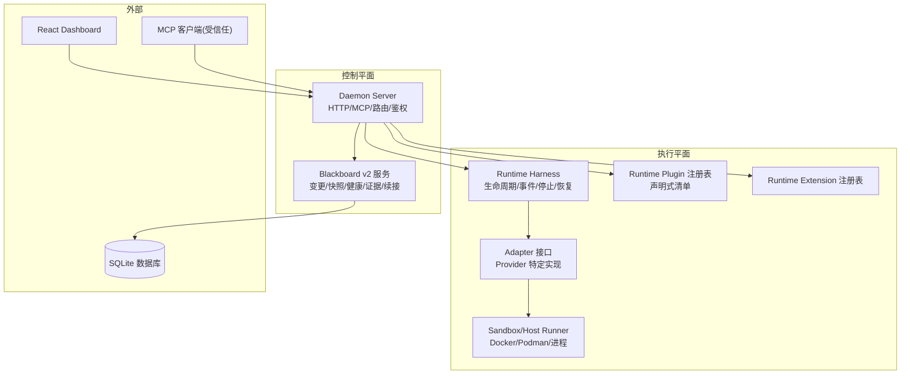
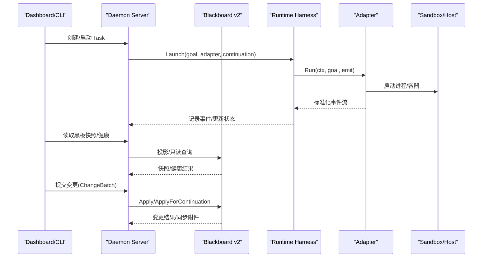
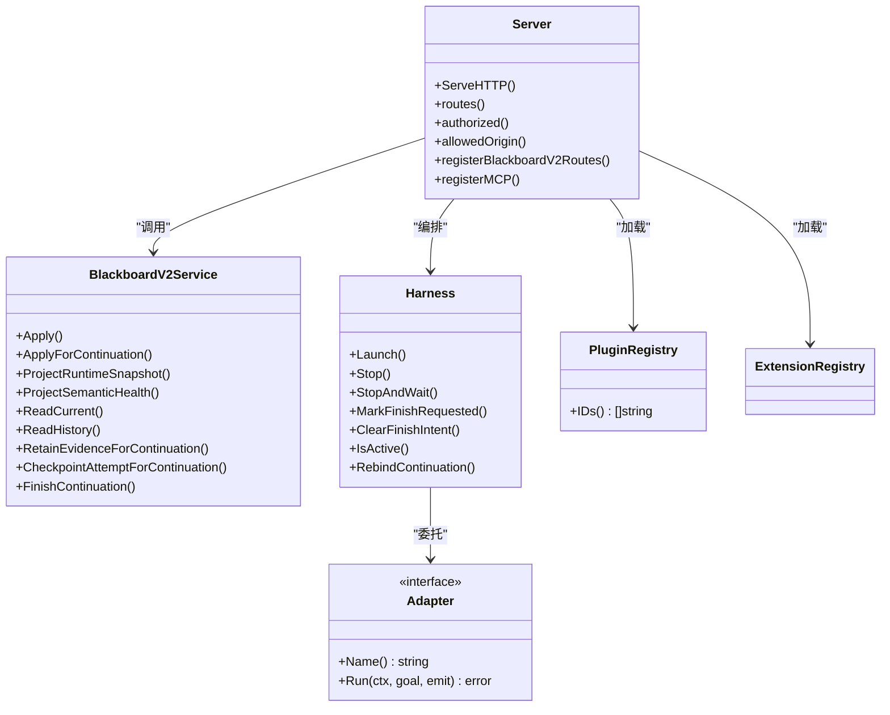
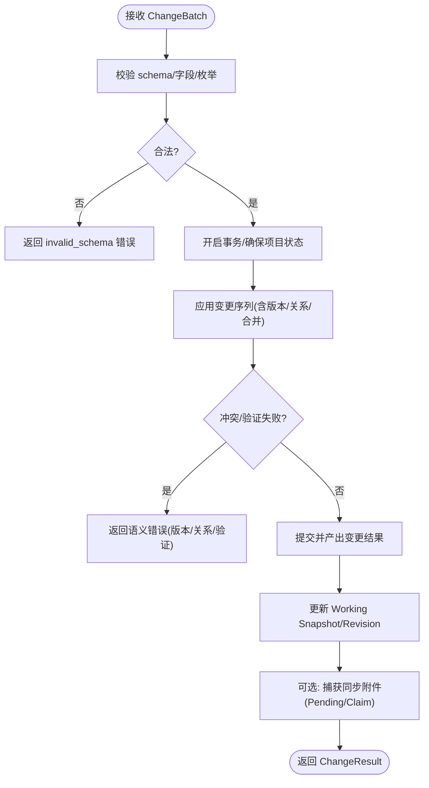
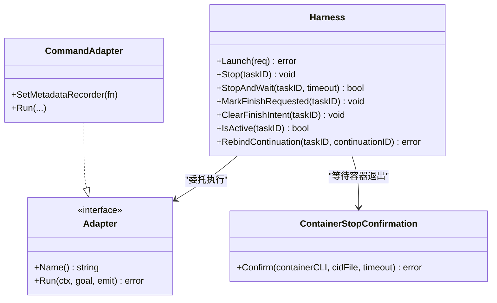
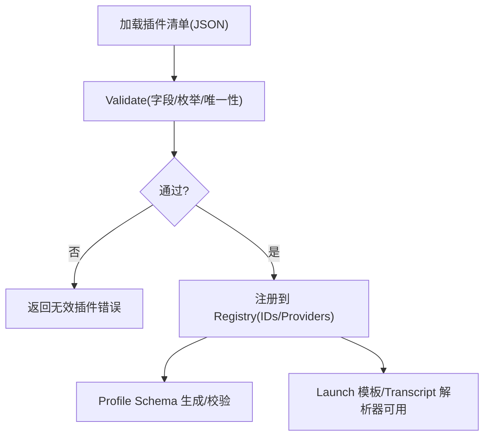
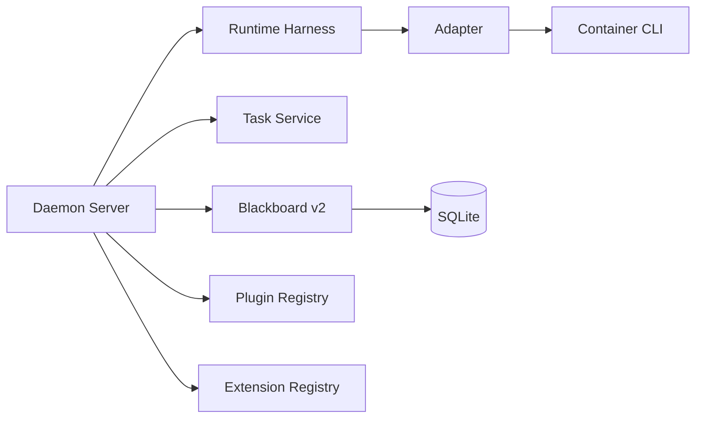

# 核心架构

<cite>
**本文引用的文件**   
- [README.md](file://README.md)
- [server.go](file://internal/daemon/server.go)
- [blackboard_v2_http.go](file://internal/daemon/blackboard_v2_http.go)
- [service.go](file://internal/blackboardv2/service.go)
- [runtime.go](file://internal/runtime/runtime.go)
- [container.go](file://internal/runtime/container.go)
- [plugin.go](file://internal/runtimeplugin/plugin.go)
- [mcp.go](file://internal/runner/mcp.go)
</cite>

## 目录
1. [简介](#简介)
2. [项目结构](#项目结构)
3. [核心组件](#核心组件)
4. [架构总览](#架构总览)
5. [详细组件分析](#详细组件分析)
6. [依赖关系分析](#依赖关系分析)
7. [性能考量](#性能考量)
8. [故障排查指南](#故障排查指南)
9. [结论](#结论)
10. [附录](#附录)

## 简介
CyberPenda 是一个本地优先的渗透测试代理，采用“控制平面（Daemon）—记忆平面（Blackboard v2）—执行平面（Runtime/Sandbox）”的分层架构。控制平面负责 HTTP/MCP 服务、任务编排与生命周期；记忆平面提供语义化、可审计、可投影的知识存储与变更流水线；执行平面通过声明式插件适配多种运行时（Codex、Claude Code、Pi），并以容器或宿主进程隔离运行。系统默认将数据持久化到本机 SQLite，并通过 React Dashboard 提供可视化操作界面。

## 项目结构
- 控制平面：Go daemon（HTTP + MCP + 嵌入式 UI）
- 记忆平面：Blackboard v2 语义服务（变更批处理、快照、健康诊断、证据保留、续接终态协调）
- 执行平面：Runtime Harness + 适配器（命令式/容器式）、插件注册表、扩展注册表、Profile 解析
- 周边能力：Skills、模型提供者、CLI、Web 前端、报告生成

图表来源
- [server.go:587-643](file://internal/daemon/server.go#L587-L643)
- [blackboard_v2_http.go:29-46](file://internal/daemon/blackboard_v2_http.go#L29-L46)
- [service.go:40-70](file://internal/blackboardv2/service.go#L40-L70)
- [runtime.go:46-69](file://internal/runtime/runtime.go#L46-L69)
- [plugin.go:19-34](file://internal/runtimeplugin/plugin.go#L19-L34)

章节来源
- [README.md:11-24](file://README.md#L11-L24)

## 核心组件
- Daemon Server：统一入口，负责鉴权、CORS/DNS 重绑定防护、静态资源、路由分发、Provider Session 工厂、Task 生命周期、MCP 服务、Blackboard v2 HTTP 端点。
- Blackboard v2：面向项目的语义状态机，支持 ChangeBatch 原子写入、Working Snapshot、历史分页、健康检查、证据保留、Attempt Checkpoint、Continuation Finish 等。
- Runtime Harness：封装 Adapter 生命周期，记录事件、维护活跃运行、支持 Stop/StopAndWait、Finish 意图、Rebind Continuation。
- Runtime Plugin：声明式 Provider 清单，描述二进制、能力、Profile Schema、Launch 模板、Transcript 解析器、原生恢复等。
- Runner/MCP：为受信任运行时注入上下文（ProjectID/TaskID/MCPURL/APIURL/Token），并生成 AGENTS.md 工作指引。

章节来源
- [server.go:83-118](file://internal/daemon/server.go#L83-L118)
- [blackboard_v2_http.go:29-46](file://internal/daemon/blackboard_v2_http.go#L29-L46)
- [service.go:40-70](file://internal/blackboardv2/service.go#L40-L70)
- [runtime.go:46-69](file://internal/runtime/runtime.go#L46-L69)
- [plugin.go:19-34](file://internal/runtimeplugin/plugin.go#L19-L34)
- [mcp.go:17-41](file://internal/runner/mcp.go#L17-L41)

## 架构总览
下图展示三层职责边界与关键交互：控制平面暴露 API/MCP，记忆平面提供强一致语义写入与只读投影，执行平面以插件驱动的方式启动真实 Agent 进程并在沙箱中隔离。

图表来源
- [server.go:587-643](file://internal/daemon/server.go#L587-L643)
- [blackboard_v2_http.go:97-125](file://internal/daemon/blackboard_v2_http.go#L97-L125)
- [service.go:644-656](file://internal/blackboardv2/service.go#L644-L656)
- [runtime.go:75-179](file://internal/runtime/runtime.go#L75-L179)

## 详细组件分析

### 控制平面（Daemon）
- 安全边界
  - DNS 重绑定防护：拒绝非回环 Origin，仅允许同域或 host.docker.internal。
  - 鉴权：支持 Bearer Token 与 Query token（用于无法设置头的 MCP 传输），以及 Project Interface Grant（仅限 Blackboard v2 HTTP/MCP）。
  - 公开路径白名单：健康探针、CORS 预检、静态资源。
- 路由组织
  - /api/* 管理面（项目、运行时配置、技能、凭据、任务等）
  - /api/v2/projects/{id}/blackboard/* 语义读写与证据/Checkpoint/Finish
  - /mcp 受信任工具集（六项 Blackboard v2 工具）
  - SPA 静态资源
- Provider Session 工厂模式
  - 通过可插拔工厂创建持久会话，支持中断后替换 Continuation 并复用宿主/容器身份元数据。

图表来源
- [server.go:83-118](file://internal/daemon/server.go#L83-L118)
- [server.go:587-643](file://internal/daemon/server.go#L587-L643)
- [blackboard_v2_http.go:29-46](file://internal/daemon/blackboard_v2_http.go#L29-L46)
- [service.go:40-70](file://internal/blackboardv2/service.go#L40-L70)
- [runtime.go:46-69](file://internal/runtime/runtime.go#L46-L69)
- [plugin.go:19-34](file://internal/runtimeplugin/plugin.go#L19-L34)

章节来源
- [server.go:383-411](file://internal/daemon/server.go#L383-L411)
- [server.go:431-461](file://internal/daemon/server.go#L431-L461)
- [server.go:518-534](file://internal/daemon/server.go#L518-L534)
- [server.go:587-643](file://internal/daemon/server.go#L587-L643)
- [blackboard_v2_http.go:52-95](file://internal/daemon/blackboard_v2_http.go#L52-L95)

### 记忆平面（Blackboard v2）
- 语义契约
  - ChangeBatch：schema/idempotency_key/changes 严格校验，未知字段拒绝。
  - Change：create/update/relate/unrelate/transition/supersede/merge 等闭联合类型。
  - Working Snapshot：供运行时快速消费当前知识子集。
- 一致性/幂等/同步
  - 原子写入、版本冲突检测、Idempotency-Key 精确回放、Pending 同步附件。
- 可信主体
  - Operator 与 Continuation 双通道鉴权；Continuation 写入需绑定 task/continuation 上下文。
- 健康与投影
  - 健康诊断、运行时快照投影、历史分页、证据保留、Attempt Checkpoint、Continuation Finish。

图表来源
- [service.go:72-120](file://internal/blackboardv2/service.go#L72-L120)
- [service.go:122-232](file://internal/blackboardv2/service.go#L122-L232)
- [service.go:644-656](file://internal/blackboardv2/service.go#L644-L656)
- [blackboard_v2_http.go:368-438](file://internal/daemon/blackboard_v2_http.go#L368-L438)

章节来源
- [service.go:40-70](file://internal/blackboardv2/service.go#L40-L70)
- [service.go:644-656](file://internal/blackboardv2/service.go#L644-L656)
- [blackboard_v2_http.go:97-125](file://internal/daemon/blackboard_v2_http.go#L97-L125)

### 执行平面（Runtime/Sandbox）
- Harness 职责
  - 启动/停止/等待、Finish 意图独占终态、事件归一化、Continuation 元数据记录、Rebind 替换。
- Adapter 抽象
  - 面向 Provider 的薄封装，负责进程/容器启动、输出扫描、敏感信息脱敏、元数据抽取。
- 容器退出确认
  - 基于 cidfile 轮询容器是否已退出，避免僵尸进程。
- 插件与扩展
  - 声明式清单定义二进制、能力、Profile Schema、Launch 模板、Transcript 解析器、原生恢复等。

图表来源
- [runtime.go:46-69](file://internal/runtime/runtime.go#L46-L69)
- [runtime.go:75-179](file://internal/runtime/runtime.go#L75-L179)
- [runtime.go:425-480](file://internal/runtime/runtime.go#L425-L480)
- [container.go:26-33](file://internal/runtime/container.go#L26-L33)
- [plugin.go:19-34](file://internal/runtimeplugin/plugin.go#L19-L34)

章节来源
- [runtime.go:75-179](file://internal/runtime/runtime.go#L75-L179)
- [container.go:26-33](file://internal/runtime/container.go#L26-L33)
- [plugin.go:136-214](file://internal/runtimeplugin/plugin.go#L136-L214)

### 插件架构与扩展机制
- 插件清单关键字段
  - id/name/description、binary.default、capabilities（sandbox/host/mcp/streaming/resume/persistent/in-turn-steer/permission-response 等）、model_provider、profile_schema.fields、config_projection.primitive、launch.args、native_resume、transcript.parser、process_env、credential_env。
- 校验规则
  - schema_version、id 正则、必填字段、唯一性、枚举白名单、单例选项合法性、凭证环境变量名规范。
- 扩展点
  - 通过注册表加载外部目录清单，动态发现 Provider 与 Profile 字段，驱动 Launch 模板与 Transcript 解析。

图表来源
- [plugin.go:19-34](file://internal/runtimeplugin/plugin.go#L19-L34)
- [plugin.go:136-214](file://internal/runtimeplugin/plugin.go#L136-L214)

章节来源
- [plugin.go:19-34](file://internal/runtimeplugin/plugin.go#L19-L34)
- [plugin.go:136-214](file://internal/runtimeplugin/plugin.go#L136-L214)

### 安全边界设计
- 网络与同源
  - 拒绝非回环 Origin，仅放行 localhost 与 host.docker.internal，防止 DNS 重绑定。
- 认证与授权
  - Daemon 级 Bearer/Query token；Blackboard v2 专用 Project Interface Grant（仅对 /api/v2 与 /mcp 生效）。
- 最小权限
  - 受信任 MCP 工具仅在 Continuation 上下文中具备写权限；Operator 读/写分离清晰。
- 数据与工件
  - Evidence 保留走受控根目录，SHA256 校验，ManagedPath 由服务端计算。

章节来源
- [server.go:518-534](file://internal/daemon/server.go#L518-L534)
- [server.go:431-461](file://internal/daemon/server.go#L431-L461)
- [blackboard_v2_http.go:52-95](file://internal/daemon/blackboard_v2_http.go#L52-L95)
- [service.go:644-656](file://internal/blackboardv2/service.go#L644-L656)

## 依赖关系分析
- 控制平面依赖
  - 记忆平面（Blackboard v2 Service）、任务服务、运行时 Harness、插件/扩展注册表、模型提供者、凭据服务、项目服务、预检服务。
- 执行平面依赖
  - 任务服务（事件/状态）、容器 CLI（Docker/Podman）、宿主进程组管理。
- 外部依赖
  - SQLite 存储、React 前端、MCP 客户端。

图表来源
- [server.go:83-118](file://internal/daemon/server.go#L83-L118)
- [runtime.go:46-69](file://internal/runtime/runtime.go#L46-L69)
- [plugin.go:19-34](file://internal/runtimeplugin/plugin.go#L19-L34)

章节来源
- [server.go:83-118](file://internal/daemon/server.go#L83-L118)
- [runtime.go:46-69](file://internal/runtime/runtime.go#L46-L69)

## 性能考量
- 原子写入与并发
  - Blackboard v2 使用事务与写锁，避免脏写；SQLite 忙锁映射为 storage_busy 重试提示。
- 只读优化
  - 快照与健康接口支持 ETag/If-None-Match，减少重复传输。
- 事件与日志
  - 事件归一化与脱敏在 Harness/CommandAdapter 层完成，避免泄露敏感信息。
- 资源回收
  - 重启时清理孤儿容器/进程组，避免资源泄漏。

章节来源
- [blackboard_v2_http.go:512-542](file://internal/daemon/blackboard_v2_http.go#L512-L542)
- [server.go:250-304](file://internal/daemon/server.go#L250-L304)
- [runtime.go:425-480](file://internal/runtime/runtime.go#L425-L480)

## 故障排查指南
- 常见错误码与含义
  - invalid_schema：请求体/字段不合法
  - authority_denied：鉴权/授权失败
  - not_found：资源不存在
  - closed_continuation：已关闭的 Continuation 被访问
  - version_conflict/key_conflict/relationship_conflict/idempotency_conflict/finish_conflict：并发/幂等冲突
  - semantic_validation/continuation_open_attempts/continuation_pending_writes/project_kind_mismatch：语义校验失败
  - internal：内部异常
  - storage_busy：SQLite 写入繁忙（建议重试）
- 定位步骤
  - 查看任务事件与时间线，确认 Lifecycle 阶段与错误原因
  - 检查 Blackboard v2 健康与快照，确认项目状态与 Revision
  - 核对 Idempotency-Key 与同步附件（sync），判断是否发生响应丢失重放
  - 若涉及容器，确认容器是否已退出（cidfile 轮询）

章节来源
- [blackboard_v2_http.go:612-642](file://internal/daemon/blackboard_v2_http.go#L612-L642)
- [blackboard_v2_http.go:512-542](file://internal/daemon/blackboard_v2_http.go#L512-L542)
- [container.go:26-33](file://internal/runtime/container.go#L26-L33)

## 结论
CyberPenda 通过清晰的三层分层与严格的语义契约，实现了可控、可审计、可扩展的渗透测试编排。控制平面聚焦于鉴权与编排，记忆平面保障语义一致性与可观测性，执行平面以插件化方式对接多类运行时，并以容器/宿主隔离确保安全边界。该设计为后续扩展新的 Provider、增强投影与报告能力提供了稳固基础。

## 附录
- 典型工作流
  - 创建项目与范围 → 配置模型提供者与运行时配置 → 选择 Skill/扩展 → 启动 Task → 通过 MCP/HTTP 持续写入黑板 → 生成报告
- 参考文档
  - README 中的快速开始、Make 目标与环境变量说明
  - docs/specs 下的 Blackboard v2 规格与迁移计划

章节来源
- [README.md:26-92](file://README.md#L26-L92)
- [README.md:110-147](file://README.md#L110-L147)