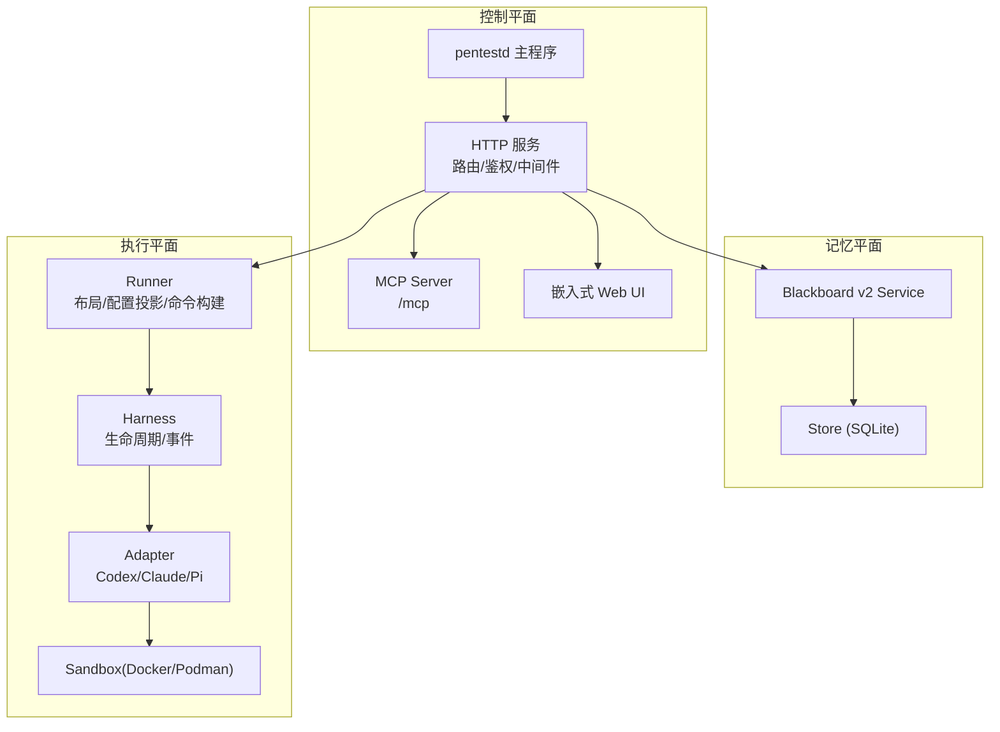
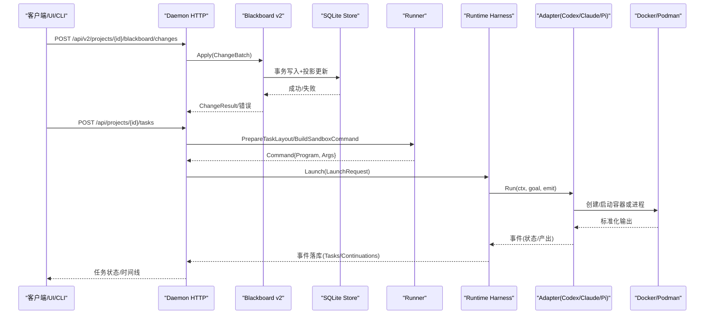
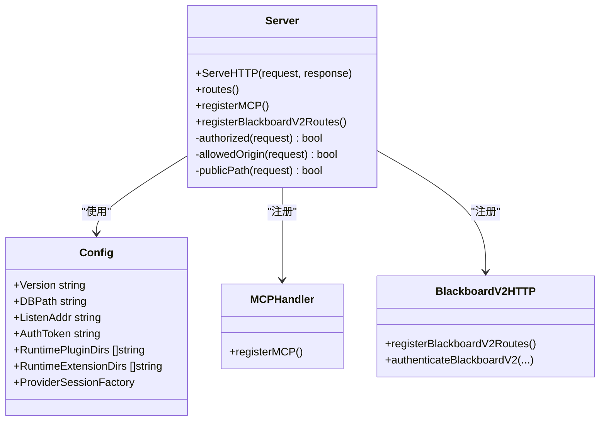
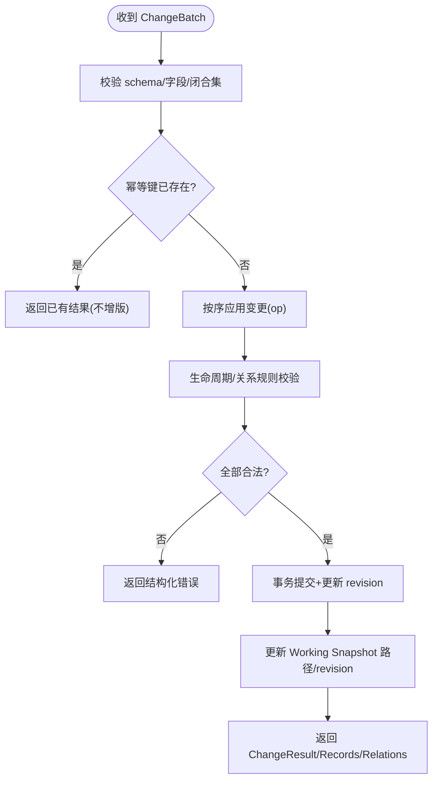
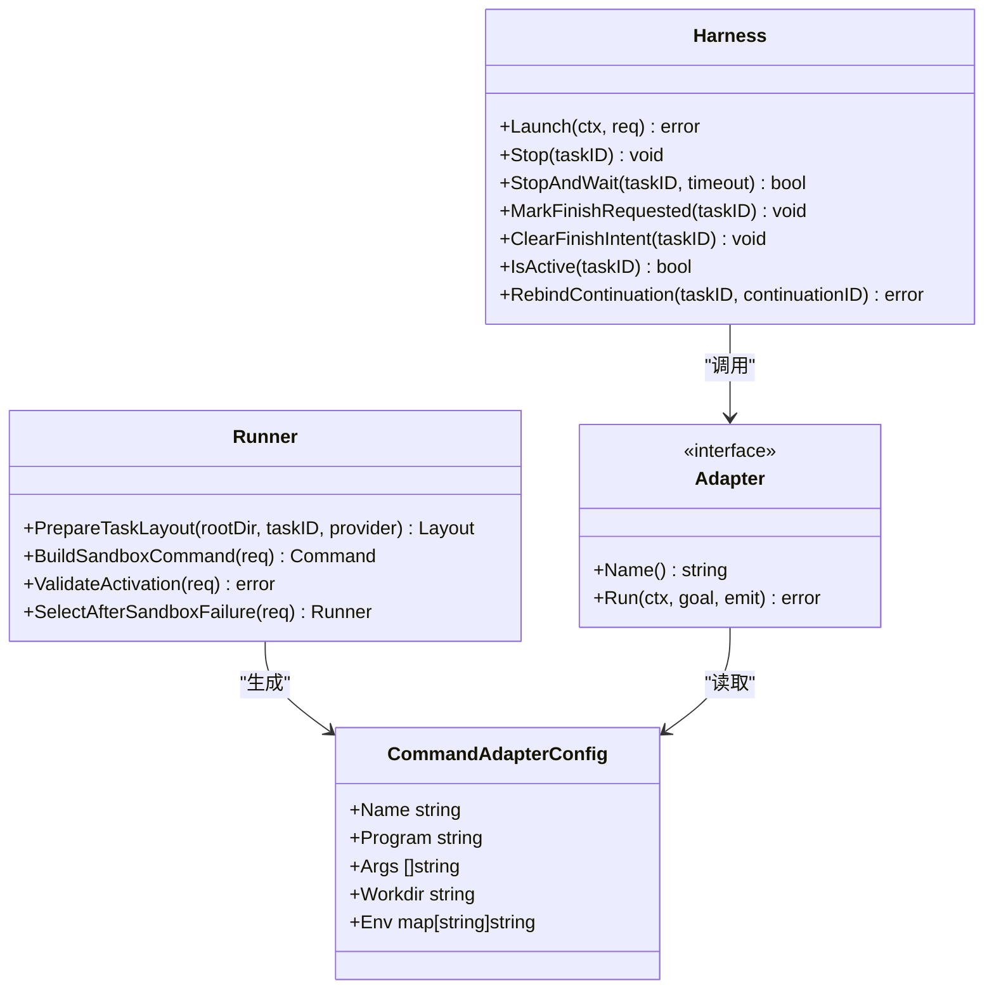
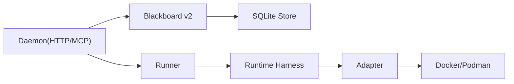

# 系统概览

<cite>
**本文引用的文件**   
- [README.md](file://README.md)
- [CONTEXT.md](file://CONTEXT.md)
- [cmd/pentestd/main.go](file://cmd/pentestd/main.go)
- [internal/daemon/server.go](file://internal/daemon/server.go)
- [internal/daemon/mcp_handlers.go](file://internal/daemon/mcp_handlers.go)
- [internal/daemon/blackboard_v2_http.go](file://internal/daemon/blackboard_v2_http.go)
- [internal/blackboardv2/service.go](file://internal/blackboardv2/service.go)
- [docs/specs/blackboard-v2-spec.md](file://docs/specs/blackboard-v2-spec.md)
- [internal/store/store.go](file://internal/store/store.go)
- [internal/runner/runner.go](file://internal/runner/runner.go)
- [internal/runtime/runtime.go](file://internal/runtime/runtime.go)
</cite>

## 目录
1. [引言](#引言)
2. [项目结构](#项目结构)
3. [核心组件](#核心组件)
4. [架构总览](#架构总览)
5. [详细组件分析](#详细组件分析)
6. [依赖关系分析](#依赖关系分析)
7. [性能与可扩展性](#性能与可扩展性)
8. [故障排查指南](#故障排查指南)
9. [结论](#结论)
10. [附录：学习路径与技术栈](#附录学习路径与技术栈)

## 引言
CyberPenda 是一个“本地优先”的渗透测试代理，围绕三层架构组织：控制平面（Daemon HTTP/MCP 服务）、记忆平面（Blackboard v2 语义存储）、执行平面（Runtime/Sandbox）。其目标是协调受控、可审计、可恢复的安全测试工作，将模型能力与工具链隔离在沙箱中运行，并通过语义化的 Blackboard 持久化知识、证据与发现。

- 控制平面负责 API 路由、鉴权、任务编排、MCP 工具暴露、UI 静态资源托管。
- 记忆平面提供原子、幂等、版本化的语义变更流水线，支撑快照、历史、健康诊断与投影合并。
- 执行平面通过 Runner/Harness/Adapter 抽象，支持 Docker/Podman 容器或宿主进程执行，并维护安全边界与生命周期。

本概览文档为初学者提供清晰的学习路径，并为高级开发者提供深入的技术洞察与架构图示。

**章节来源**
- [README.md:1-173](file://README.md#L1-L173)
- [CONTEXT.md:1-800](file://CONTEXT.md#L1-L800)

## 项目结构
仓库采用 Go 后端 + React 前端 + 容器化执行环境的组合。关键目录职责如下：
- cmd/pentestd：守护进程入口，解析参数、启动 HTTP 服务、装配各子系统。
- internal/daemon：HTTP 路由、认证中间件、MCP 服务器、任务与运行时控制器。
- internal/blackboardv2：Blackboard v2 语义服务，包含变更批处理、投影、历史、健康、证据保留等。
- internal/store：SQLite 连接与迁移，统一数据库访问。
- internal/runner：任务级文件系统布局、配置投影、容器命令构建。
- internal/runtime：运行时 Harness/Adapter，封装进程生命周期与事件流。
- web：React Dashboard，提供项目管理、任务控制、Blackboard 可视化等。
- docs/specs：规范文档，含 Blackboard v2 契约。

**图表来源**
- [cmd/pentestd/main.go:22-103](file://cmd/pentestd/main.go#L22-L103)
- [internal/daemon/server.go:587-643](file://internal/daemon/server.go#L587-L643)
- [internal/daemon/mcp_handlers.go:14-43](file://internal/daemon/mcp_handlers.go#L14-L43)
- [internal/blackboardv2/service.go:40-70](file://internal/blackboardv2/service.go#L40-L70)
- [internal/store/store.go:103-139](file://internal/store/store.go#L103-L139)
- [internal/runner/runner.go:106-137](file://internal/runner/runner.go#L106-L137)
- [internal/runtime/runtime.go:46-70](file://internal/runtime/runtime.go#L46-L70)

**章节来源**
- [README.md:149-161](file://README.md#L149-L161)
- [internal/daemon/server.go:587-643](file://internal/daemon/server.go#L587-L643)

## 核心组件
- Daemon HTTP 服务：集中式路由注册、请求鉴权、CORS/Origin 校验、静态资源服务、MCP 挂载。
- Blackboard v2 语义服务：ChangeBatch 原子写入、Working Snapshot 同步、History 分页、Health 诊断、Evidence 保留。
- Store（SQLite）：单连接、WAL 模式、权限收紧、迁移与 epoch 管理。
- Runner：任务根目录布局、Provider Home、Skills Root、Artifacts/Logs 目录；容器命令构建与安全挂载。
- Runtime Harness/Adapter：进程启动、输出扫描、事件记录、停止/等待、Finish 意图协调。

**章节来源**
- [internal/daemon/server.go:38-118](file://internal/daemon/server.go#L38-L118)
- [internal/blackboardv2/service.go:40-70](file://internal/blackboardv2/service.go#L40-L70)
- [internal/store/store.go:38-139](file://internal/store/store.go#L38-L139)
- [internal/runner/runner.go:32-137](file://internal/runner/runner.go#L32-L137)
- [internal/runtime/runtime.go:46-179](file://internal/runtime/runtime.go#L46-L179)

## 架构总览
下图展示三层架构及数据流向：控制平面接收外部请求，经鉴权后调用记忆平面进行语义读写；同时调度执行平面以容器或宿主方式运行具体 Runtime，并将结果回写到 Blackboard。

**图表来源**
- [internal/daemon/blackboard_v2_http.go:29-46](file://internal/daemon/blackboard_v2_http.go#L29-L46)
- [internal/blackboardv2/service.go:644-656](file://internal/blackboardv2/service.go#L644-L656)
- [internal/runner/runner.go:139-217](file://internal/runner/runner.go#L139-L217)
- [internal/runtime/runtime.go:75-179](file://internal/runtime/runtime.go#L75-L179)

## 详细组件分析

### 控制平面（Daemon HTTP 服务）
- 入口与装配：解析命令行与环境变量，构造 ProviderSessionFactory、Server 实例，启动 http.Server，优雅关闭。
- 路由与鉴权：集中注册 API 路由，统一 Origin 校验、Token/Bearer 鉴权、公共路径白名单。
- MCP 集成：挂载 /mcp，基于 Project Interface Grant 绑定可信 Continuation，禁用默认 localhost 保护以允许 host.docker.internal。
- 健康检查：/health 返回版本、DB、MCP、Runner 信息。

**图表来源**
- [cmd/pentestd/main.go:22-103](file://cmd/pentestd/main.go#L22-L103)
- [internal/daemon/server.go:38-118](file://internal/daemon/server.go#L38-L118)
- [internal/daemon/server.go:587-643](file://internal/daemon/server.go#L587-L643)
- [internal/daemon/mcp_handlers.go:14-43](file://internal/daemon/mcp_handlers.go#L14-L43)
- [internal/daemon/blackboard_v2_http.go:29-95](file://internal/daemon/blackboard_v2_http.go#L29-L95)

**章节来源**
- [cmd/pentestd/main.go:22-103](file://cmd/pentestd/main.go#L22-L103)
- [internal/daemon/server.go:383-501](file://internal/daemon/server.go#L383-L501)
- [internal/daemon/mcp_handlers.go:14-43](file://internal/daemon/mcp_handlers.go#L14-L43)
- [internal/daemon/blackboard_v2_http.go:29-95](file://internal/daemon/blackboard_v2_http.go#L29-L95)

### 记忆平面（Blackboard v2 语义存储）
- 语义契约：定义 runtime-blackboard/v2 快照、semantic-change-batch/v2 变更包、当前详情与历史分页、健康诊断。
- 原子写入：ChangeBatch 带幂等键，严格字段白名单与类型校验；支持 create/update/relate/unrelate/transition/supersede/merge。
- 快照与同步：每个 Continuation 拥有 Launch Pin 与 Working Snapshot；并发 Task 推进时发送变更通知并在下次信任同步点推送完整快照。
- 健康与投影：ProjectSemanticHealth 与 ProjectRuntimeSnapshot 用于运维与运行时上下文注入。

**图表来源**
- [docs/specs/blackboard-v2-spec.md:1-200](file://docs/specs/blackboard-v2-spec.md#L1-L200)
- [internal/blackboardv2/service.go:72-232](file://internal/blackboardv2/service.go#L72-L232)
- [internal/blackboardv2/service.go:644-656](file://internal/blackboardv2/service.go#L644-L656)

**章节来源**
- [docs/specs/blackboard-v2-spec.md:1-200](file://docs/specs/blackboard-v2-spec.md#L1-L200)
- [internal/blackboardv2/service.go:40-70](file://internal/blackboardv2/service.go#L40-L70)
- [internal/blackboardv2/service.go:644-656](file://internal/blackboardv2/service.go#L644-L656)

### 执行平面（Runtime/Sandbox）
- Runner：准备任务目录布局（workdir、runtime-home、skills、artifacts、logs），构建容器命令，支持只读挂载与网络模式。
- Harness：管理任务生命周期，记录事件，协调 Finish 意图，支持 StopAndWait 与 RebindContinuation。
- Adapter：面向不同 Provider（Codex/Claude Code/Pi）的薄适配层，标准化输出与元数据记录。
- Sandbox：通过 Docker/Podman 隔离进程、环境变量与文件系统，限制外发网络（可选 host_proxy_only）。

**图表来源**
- [internal/runner/runner.go:106-217](file://internal/runner/runner.go#L106-L217)
- [internal/runtime/runtime.go:46-179](file://internal/runtime/runtime.go#L46-L179)
- [internal/runtime/runtime.go:333-481](file://internal/runtime/runtime.go#L333-L481)

**章节来源**
- [internal/runner/runner.go:106-217](file://internal/runner/runner.go#L106-L217)
- [internal/runtime/runtime.go:46-179](file://internal/runtime/runtime.go#L46-L179)
- [internal/runtime/runtime.go:333-481](file://internal/runtime/runtime.go#L333-L481)

## 依赖关系分析
- 控制平面依赖记忆平面与服务端 Store，同时依赖 Runner/Harness/Adapter 完成执行。
- 记忆平面依赖 Store 进行事务写入与投影更新，对外暴露统一的语义接口。
- 执行平面依赖 Runner 构建命令与布局，通过 Harness 驱动 Adapter，最终由 Sandbox 提供隔离环境。

**图表来源**
- [internal/daemon/server.go:587-643](file://internal/daemon/server.go#L587-L643)
- [internal/blackboardv2/service.go:40-70](file://internal/blackboardv2/service.go#L40-L70)
- [internal/store/store.go:103-139](file://internal/store/store.go#L103-L139)
- [internal/runner/runner.go:106-217](file://internal/runner/runner.go#L106-L217)
- [internal/runtime/runtime.go:46-179](file://internal/runtime/runtime.go#L46-L179)

**章节来源**
- [internal/daemon/server.go:587-643](file://internal/daemon/server.go#L587-L643)
- [internal/blackboardv2/service.go:40-70](file://internal/blackboardv2/service.go#L40-L70)
- [internal/store/store.go:103-139](file://internal/store/store.go#L103-L139)
- [internal/runner/runner.go:106-217](file://internal/runner/runner.go#L106-L217)
- [internal/runtime/runtime.go:46-179](file://internal/runtime/runtime.go#L46-L179)

## 性能与可扩展性
- SQLite 单连接与 WAL 模式提升并发写稳定性；权限收紧避免敏感数据泄露。
- Blackboard v2 快照与增量同步减少模型上下文体积，提高长任务效率。
- Runner 的只读挂载与受限网络模式降低 I/O 与网络开销，增强安全性。
- 扩展点：Runtime Plugin 与 Extension 机制支持新增 Provider 与技能包，无需修改核心逻辑。

[本节为通用指导，不直接分析具体文件]

## 故障排查指南
- 非环回监听未设置 Token：守护进程拒绝启动，需设置 PENTEST_AUTH_TOKEN 或使用环回地址。
- Origin 校验失败：来自非环回或非 host.docker.internal 的请求将被拒绝，检查浏览器同源或 MCP 传输。
- 任务中断恢复：重启后会标记中断任务并清理残留容器/进程，必要时 Resume 重建 Continuation。
- Blackboard 写入失败：关注 ChangeBatch 字段合法性、幂等键重复、生命周期约束与关系规则。

**章节来源**
- [internal/daemon/server.go:174-185](file://internal/daemon/server.go#L174-L185)
- [internal/daemon/server.go:518-534](file://internal/daemon/server.go#L518-L534)
- [internal/daemon/server.go:250-304](file://internal/daemon/server.go#L250-L304)
- [internal/blackboardv2/service.go:644-656](file://internal/blackboardv2/service.go#L644-L656)

## 结论
CyberPenda 通过清晰的三层架构实现了可控、可审计、可恢复的渗透测试自动化。控制平面提供稳定 API 与 MCP 工具，记忆平面确保语义一致性与可追溯性，执行平面保障安全隔离与灵活扩展。该设计既适合初学者循序渐进理解，也为高级开发者提供了深入的扩展与优化空间。

[本节为总结，不直接分析具体文件]

## 附录：学习路径与技术栈
- 初学者路径
  - 了解领域术语与产品语言：阅读 CONTEXT.md。
  - 快速上手：根据 README.md 的 Quick start 搭建本地开发环境。
  - 理解三层架构：从 Daemon HTTP 路由与鉴权入手，再进入 Blackboard v2 语义契约，最后研究 Runner/Harness/Adapter。
- 高级开发者洞察
  - 深入 Blackboard v2 规范与实现：关注 ChangeBatch 闭合形状、快照同步与健康诊断。
  - 扩展 Runtime Plugin：参考内置插件与注册表，声明式适配新 Provider。
  - 安全与合规：Origin 校验、Token 鉴权、只读挂载、host_proxy_only 网络模式。

技术栈概述
- 后端：Go（HTTP、SQLite、容器 CLI 集成）
- 前端：React + Vite（Dashboard）
- 执行环境：Docker/Podman（沙箱隔离）
- 协议：MCP（Model Context Protocol）

**章节来源**
- [CONTEXT.md:1-800](file://CONTEXT.md#L1-L800)
- [README.md:26-108](file://README.md#L26-L108)
- [docs/specs/blackboard-v2-spec.md:1-200](file://docs/specs/blackboard-v2-spec.md#L1-L200)
- [internal/daemon/server.go:587-643](file://internal/daemon/server.go#L587-L643)
- [internal/runner/runner.go:106-217](file://internal/runner/runner.go#L106-L217)
- [internal/runtime/runtime.go:46-179](file://internal/runtime/runtime.go#L46-L179)