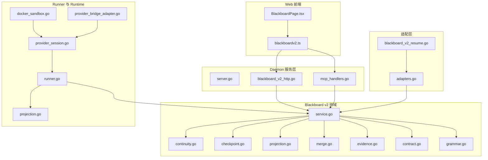
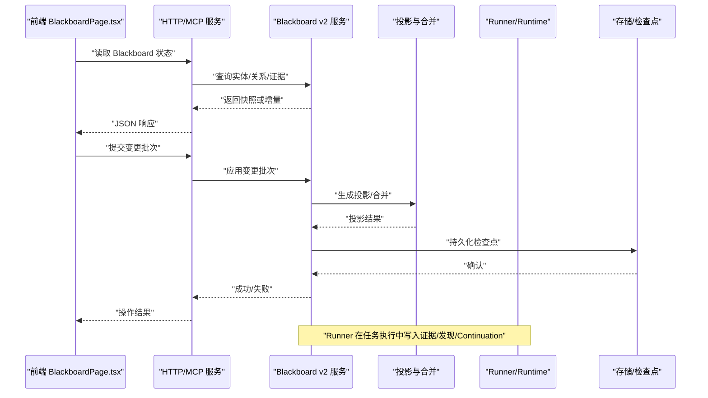
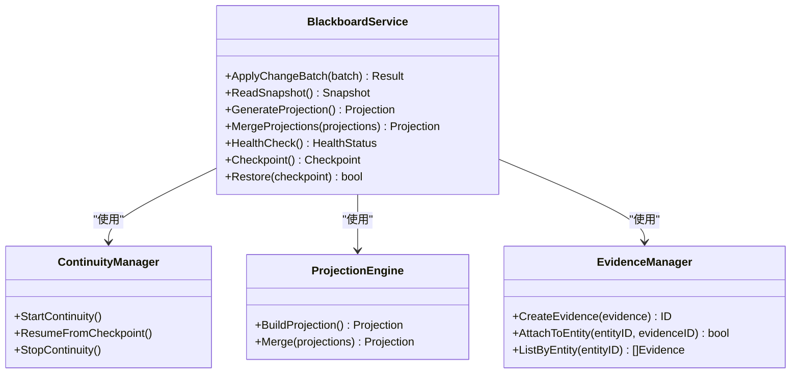
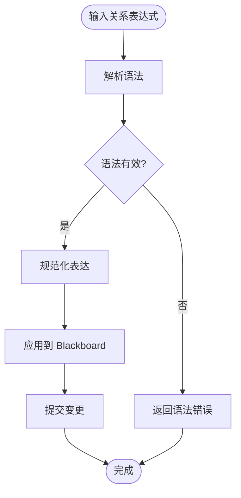
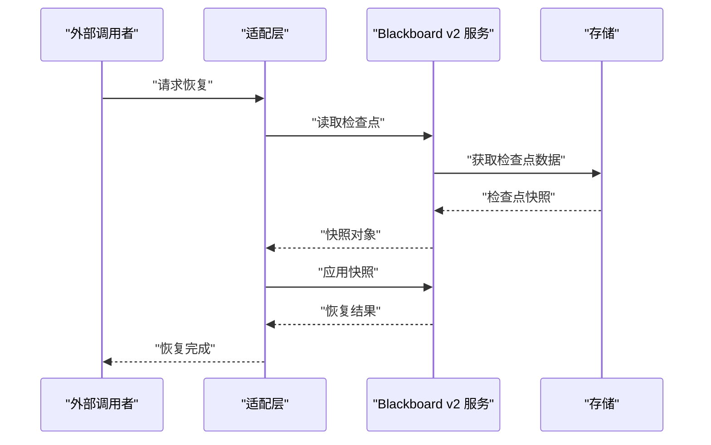
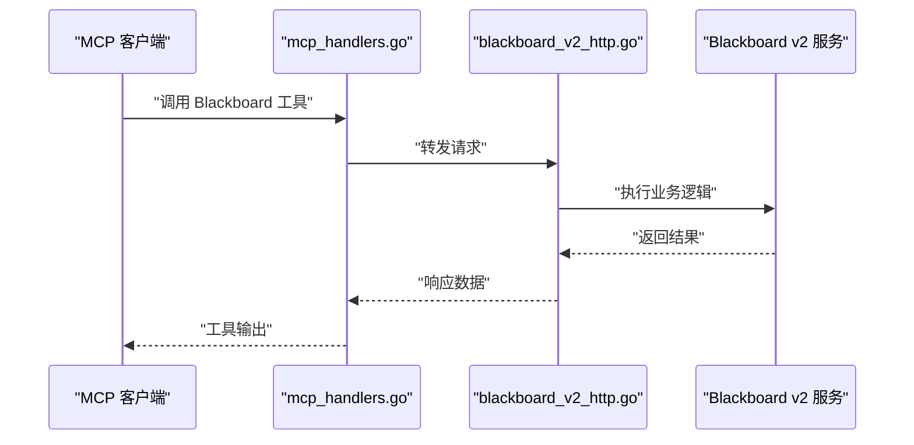
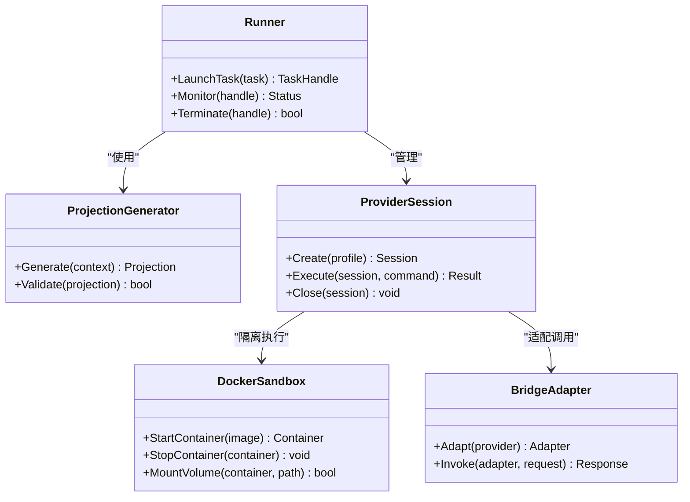
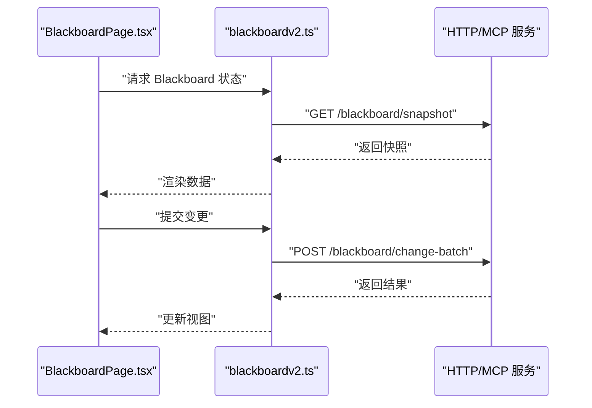
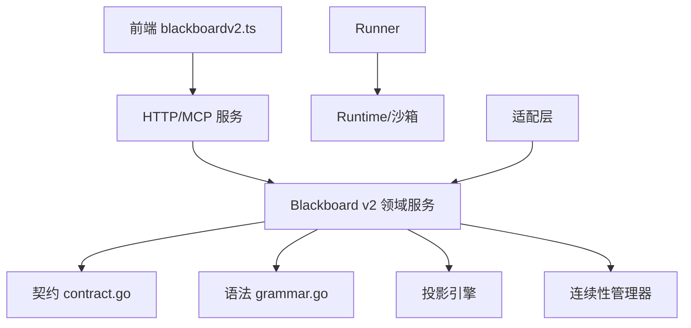

# Blackboard 集成层

<cite>
**本文引用的文件**   
- [internal/blackboardv2/service.go](file://internal/blackboardv2/service.go)
- [internal/blackboardv2/continuity.go](file://internal/blackboardv2/continuity.go)
- [internal/blackboardv2/checkpoint.go](file://internal/blackboardv2/checkpoint.go)
- [internal/blackboardv2/projection.go](file://internal/blackboardv2/projection.go)
- [internal/blackboardv2/merge.go](file://internal/blackboardv2/merge.go)
- [internal/blackboardv2/evidence.go](file://internal/blackboardv2/evidence.go)
- [internal/blackboardv2/fact_service_test.go](file://internal/blackboardv2/fact_service_test.go)
- [internal/blackboardv2/relationship_read_internal_test.go](file://internal/blackboardv2/relationship_read_internal_test.go)
- [internal/blackboardv2contract/contract.go](file://internal/blackboardv2contract/contract.go)
- [internal/blackboardv2contract/contractdata/openapi.json](file://internal/blackboardv2contract/contractdata/openapi.json)
- [internal/blackboardv2grammar/grammar.go](file://internal/blackboardv2grammar/grammar.go)
- [internal/adapters/adapters.go](file://internal/adapters/adapters.go)
- [internal/adapters/blackboard_v2_resume.go](file://internal/adapters/blackboard_v2_resume.go)
- [internal/daemon/server.go](file://internal/daemon/server.go)
- [internal/daemon/blackboard_v2_http.go](file://internal/daemon/blackboard_v2_http.go)
- [internal/daemon/mcp_handlers.go](file://internal/daemon/mcp_handlers.go)
- [internal/runner/runner.go](file://internal/runner/runner.go)
- [internal/runner/projection.go](file://internal/runner/projection.go)
- [internal/runtime/provider_session.go](file://internal/runtime/provider_session.go)
- [internal/runtime/docker_sandbox.go](file://internal/runtime/docker_sandbox.go)
- [internal/runtime/provider_bridge_adapter.go](file://internal/runtime/provider_bridge_adapter.go)
- [web/src/lib/blackboardv2.ts](file://web/src/lib/blackboardv2.ts)
- [web/src/pages/BlackboardPage.tsx](file://web/src/pages/BlackboardPage.tsx)
</cite>

## 目录
1. [简介](#简介)
2. [项目结构](#项目结构)
3. [核心组件](#核心组件)
4. [架构总览](#架构总览)
5. [详细组件分析](#详细组件分析)
6. [依赖关系分析](#依赖关系分析)
7. [性能考量](#性能考量)
8. [故障排查指南](#故障排查指南)
9. [结论](#结论)
10. [附录](#附录)

## 简介
本文件聚焦于 CyberPenda 的 Blackboard 集成层，围绕三大子系统展开：
- Blackboard v2 语义系统：实体、关系、证据、发现与 Continuation 的生命周期管理、变更批处理、投影合并与健康诊断。
- Daemon HTTP 服务层：对外暴露 REST API 与 MCP Server（六个 Blackboard v2 工具），负责任务生命周期、认证门控与 Provider Session 工厂。
- Runtime/Sandbox 运行时：容器隔离执行、Runtime Plugin 声明式适配器、Profile 解析与 Extension Pack 加载，确保 trusted tool 边界与沙箱安全。

文档以“从概念到实现”的方式组织，先给出整体架构与数据流，再深入关键模块的实现细节、依赖关系与优化建议，最后提供故障排查与最佳实践。

## 项目结构
Blackboard 集成层横跨 internal 与 web 两个主要区域：
- internal/blackboardv2：Blackboard v2 领域服务、连续性、检查点、投影与合并等核心能力。
- internal/blackboardv2contract：契约定义、OpenAPI 与关系类型清单。
- internal/blackboardv2grammar：关系语法与解析规则。
- internal/adapters：适配层，将外部调用映射到 Blackboard v2 接口，并支持恢复流程。
- internal/daemon：HTTP 路由、MCP 工具、任务与 Provider 会话控制。
- internal/runner：Runner 编排、投影生成与挂载策略。
- internal/runtime：Provider 会话、沙箱与桥接适配器。
- web/src/lib/blackboardv2.ts 与 web/src/pages/BlackboardPage.tsx：前端对 Blackboard v2 的访问与展示。

图表来源
- [internal/daemon/server.go](file://internal/daemon/server.go)
- [internal/daemon/blackboard_v2_http.go](file://internal/daemon/blackboard_v2_http.go)
- [internal/daemon/mcp_handlers.go](file://internal/daemon/mcp_handlers.go)
- [internal/blackboardv2/service.go](file://internal/blackboardv2/service.go)
- [internal/blackboardv2/continuity.go](file://internal/blackboardv2/continuity.go)
- [internal/blackboardv2/checkpoint.go](file://internal/blackboardv2/checkpoint.go)
- [internal/blackboardv2/projection.go](file://internal/blackboardv2/projection.go)
- [internal/blackboardv2/merge.go](file://internal/blackboardv2/merge.go)
- [internal/blackboardv2/evidence.go](file://internal/blackboardv2/evidence.go)
- [internal/blackboardv2contract/contract.go](file://internal/blackboardv2contract/contract.go)
- [internal/blackboardv2grammar/grammar.go](file://internal/blackboardv2grammar/grammar.go)
- [internal/adapters/adapters.go](file://internal/adapters/adapters.go)
- [internal/adapters/blackboard_v2_resume.go](file://internal/adapters/blackboard_v2_resume.go)
- [internal/runner/runner.go](file://internal/runner/runner.go)
- [internal/runner/projection.go](file://internal/runner/projection.go)
- [internal/runtime/provider_session.go](file://internal/runtime/provider_session.go)
- [internal/runtime/docker_sandbox.go](file://internal/runtime/docker_sandbox.go)
- [internal/runtime/provider_bridge_adapter.go](file://internal/runtime/provider_bridge_adapter.go)
- [web/src/lib/blackboardv2.ts](file://web/src/lib/blackboardv2.ts)
- [web/src/pages/BlackboardPage.tsx](file://web/src/pages/BlackboardPage.tsx)

章节来源
- [internal/blackboardv2/service.go](file://internal/blackboardv2/service.go)
- [internal/daemon/server.go](file://internal/daemon/server.go)
- [internal/runner/runner.go](file://internal/runner/runner.go)
- [internal/runtime/provider_session.go](file://internal/runtime/provider_session.go)
- [web/src/lib/blackboardv2.ts](file://web/src/lib/blackboardv2.ts)
- [web/src/pages/BlackboardPage.tsx](file://web/src/pages/BlackboardPage.tsx)

## 核心组件
- Blackboard v2 领域服务：集中管理实体、关系、证据、发现与 Continuation 的增删改查、批量变更、投影生成与合并、健康检查与连续性恢复。
- 契约与语法：通过 contract.go 与 openapi.json 定义数据模型与接口；grammar.go 提供关系语法的解析与校验。
- 适配层：adapters.go 与 blackboard_v2_resume.go 将外部调用（如 CLI、迁移、恢复）统一映射到 v2 接口，保证向后兼容与幂等性。
- Daemon 服务层：server.go 注册 HTTP 路由与 MCP 工具；blackboard_v2_http.go 暴露 Blackboard v2 的读写端点；mcp_handlers.go 实现六个 Blackboard v2 工具。
- Runner 与 Runtime：runner.go 协调任务执行与投影生成；runtime 层提供 Provider 会话、沙箱隔离与桥接适配器，确保可信工具边界。
- 前端集成：blackboardv2.ts 封装 API 调用；BlackboardPage.tsx 渲染 Blackboard 视图。

章节来源
- [internal/blackboardv2/service.go](file://internal/blackboardv2/service.go)
- [internal/blackboardv2contract/contract.go](file://internal/blackboardv2contract/contract.go)
- [internal/blackboardv2contract/contractdata/openapi.json](file://internal/blackboardv2contract/contractdata/openapi.json)
- [internal/blackboardv2grammar/grammar.go](file://internal/blackboardv2grammar/grammar.go)
- [internal/adapters/adapters.go](file://internal/adapters/adapters.go)
- [internal/adapters/blackboard_v2_resume.go](file://internal/adapters/blackboard_v2_resume.go)
- [internal/daemon/server.go](file://internal/daemon/server.go)
- [internal/daemon/blackboard_v2_http.go](file://internal/daemon/blackboard_v2_http.go)
- [internal/daemon/mcp_handlers.go](file://internal/daemon/mcp_handlers.go)
- [internal/runner/runner.go](file://internal/runner/runner.go)
- [internal/runtime/provider_session.go](file://internal/runtime/provider_session.go)
- [web/src/lib/blackboardv2.ts](file://web/src/lib/blackboardv2.ts)
- [web/src/pages/BlackboardPage.tsx](file://web/src/pages/BlackboardPage.tsx)

## 架构总览
Blackboard 集成层采用分层设计：
- 表现层：Web 前端通过 blackboardv2.ts 调用后端 API。
- 服务层：Daemon 提供 HTTP 与 MCP 接口，路由到 Blackboard v2 领域服务。
- 领域层：Blackboard v2 服务实现语义操作、投影与合并、连续性与检查点。
- 适配层：统一外部调用，支持恢复与迁移。
- 执行层：Runner 与 Runtime 负责任务编排、沙箱隔离与 Provider 会话管理。

图表来源
- [web/src/pages/BlackboardPage.tsx](file://web/src/pages/BlackboardPage.tsx)
- [web/src/lib/blackboardv2.ts](file://web/src/lib/blackboardv2.ts)
- [internal/daemon/blackboard_v2_http.go](file://internal/daemon/blackboard_v2_http.go)
- [internal/daemon/mcp_handlers.go](file://internal/daemon/mcp_handlers.go)
- [internal/blackboardv2/service.go](file://internal/blackboardv2/service.go)
- [internal/blackboardv2/projection.go](file://internal/blackboardv2/projection.go)
- [internal/blackboardv2/checkpoint.go](file://internal/blackboardv2/checkpoint.go)
- [internal/runner/runner.go](file://internal/runner/runner.go)

## 详细组件分析

### Blackboard v2 领域服务
- 职责：实体/关系/证据/发现/Continuation 的 CRUD、批量变更、投影生成与合并、健康检查、连续性恢复。
- 关键点：
  - 变更批处理：原子性提交，避免中间态不一致。
  - 投影合并：多源投影按版本合并，保证最终一致性。
  - 连续性：检查点与恢复，支持中断后继续执行。
  - 健康诊断：监控服务状态与依赖可用性。

图表来源
- [internal/blackboardv2/service.go](file://internal/blackboardv2/service.go)
- [internal/blackboardv2/continuity.go](file://internal/blackboardv2/continuity.go)
- [internal/blackboardv2/projection.go](file://internal/blackboardv2/projection.go)
- [internal/blackboardv2/evidence.go](file://internal/blackboardv2/evidence.go)

章节来源
- [internal/blackboardv2/service.go](file://internal/blackboardv2/service.go)
- [internal/blackboardv2/continuity.go](file://internal/blackboardv2/continuity.go)
- [internal/blackboardv2/projection.go](file://internal/blackboardv2/projection.go)
- [internal/blackboardv2/evidence.go](file://internal/blackboardv2/evidence.go)

### 契约与语法
- contract.go：定义 Blackboard v2 的数据模型与接口契约。
- openapi.json：描述 HTTP API 的请求/响应格式与端点。
- grammar.go：关系语法的解析与校验规则，确保语义一致性。

图表来源
- [internal/blackboardv2contract/contract.go](file://internal/blackboardv2contract/contract.go)
- [internal/blackboardv2contract/contractdata/openapi.json](file://internal/blackboardv2contract/contractdata/openapi.json)
- [internal/blackboardv2grammar/grammar.go](file://internal/blackboardv2grammar/grammar.go)

章节来源
- [internal/blackboardv2contract/contract.go](file://internal/blackboardv2contract/contract.go)
- [internal/blackboardv2contract/contractdata/openapi.json](file://internal/blackboardv2contract/contractdata/openapi.json)
- [internal/blackboardv2grammar/grammar.go](file://internal/blackboardv2grammar/grammar.go)

### 适配层与恢复
- adapters.go：将外部调用（CLI、迁移、恢复）映射到 Blackboard v2 接口。
- blackboard_v2_resume.go：实现恢复流程，确保中断后可从检查点继续。

图表来源
- [internal/adapters/adapters.go](file://internal/adapters/adapters.go)
- [internal/adapters/blackboard_v2_resume.go](file://internal/adapters/blackboard_v2_resume.go)
- [internal/blackboardv2/service.go](file://internal/blackboardv2/service.go)

章节来源
- [internal/adapters/adapters.go](file://internal/adapters/adapters.go)
- [internal/adapters/blackboard_v2_resume.go](file://internal/adapters/blackboard_v2_resume.go)

### Daemon 服务层
- server.go：注册 HTTP 路由与 MCP 工具。
- blackboard_v2_http.go：暴露 Blackboard v2 的读写端点。
- mcp_handlers.go：实现六个 Blackboard v2 工具，供 MCP 客户端调用。

图表来源
- [internal/daemon/server.go](file://internal/daemon/server.go)
- [internal/daemon/blackboard_v2_http.go](file://internal/daemon/blackboard_v2_http.go)
- [internal/daemon/mcp_handlers.go](file://internal/daemon/mcp_handlers.go)
- [internal/blackboardv2/service.go](file://internal/blackboardv2/service.go)

章节来源
- [internal/daemon/server.go](file://internal/daemon/server.go)
- [internal/daemon/blackboard_v2_http.go](file://internal/daemon/blackboard_v2_http.go)
- [internal/daemon/mcp_handlers.go](file://internal/daemon/mcp_handlers.go)

### Runner 与 Runtime
- runner.go：协调任务执行与投影生成。
- projection.go：根据任务上下文生成投影。
- provider_session.go：管理 Provider 会话生命周期。
- docker_sandbox.go：提供容器隔离执行环境。
- provider_bridge_adapter.go：桥接不同 Provider 的适配器。

图表来源
- [internal/runner/runner.go](file://internal/runner/runner.go)
- [internal/runner/projection.go](file://internal/runner/projection.go)
- [internal/runtime/provider_session.go](file://internal/runtime/provider_session.go)
- [internal/runtime/docker_sandbox.go](file://internal/runtime/docker_sandbox.go)
- [internal/runtime/provider_bridge_adapter.go](file://internal/runtime/provider_bridge_adapter.go)

章节来源
- [internal/runner/runner.go](file://internal/runner/runner.go)
- [internal/runner/projection.go](file://internal/runner/projection.go)
- [internal/runtime/provider_session.go](file://internal/runtime/provider_session.go)
- [internal/runtime/docker_sandbox.go](file://internal/runtime/docker_sandbox.go)
- [internal/runtime/provider_bridge_adapter.go](file://internal/runtime/provider_bridge_adapter.go)

### 前端集成
- blackboardv2.ts：封装 Blackboard v2 的 API 调用，提供类型安全的接口。
- BlackboardPage.tsx：渲染 Blackboard 视图，展示实体、关系与证据。

图表来源
- [web/src/pages/BlackboardPage.tsx](file://web/src/pages/BlackboardPage.tsx)
- [web/src/lib/blackboardv2.ts](file://web/src/lib/blackboardv2.ts)
- [internal/daemon/blackboard_v2_http.go](file://internal/daemon/blackboard_v2_http.go)

章节来源
- [web/src/lib/blackboardv2.ts](file://web/src/lib/blackboardv2.ts)
- [web/src/pages/BlackboardPage.tsx](file://web/src/pages/BlackboardPage.tsx)

## 依赖关系分析
Blackboard 集成层的依赖关系清晰分层：
- 前端依赖 Web API 库。
- 服务层依赖领域服务与契约定义。
- 领域服务依赖语法解析与投影引擎。
- Runner 依赖 Runtime 与沙箱。
- 适配层统一外部调用。

图表来源
- [web/src/lib/blackboardv2.ts](file://web/src/lib/blackboardv2.ts)
- [internal/daemon/blackboard_v2_http.go](file://internal/daemon/blackboard_v2_http.go)
- [internal/blackboardv2/service.go](file://internal/blackboardv2/service.go)
- [internal/blackboardv2contract/contract.go](file://internal/blackboardv2contract/contract.go)
- [internal/blackboardv2grammar/grammar.go](file://internal/blackboardv2grammar/grammar.go)
- [internal/runner/runner.go](file://internal/runner/runner.go)
- [internal/runtime/docker_sandbox.go](file://internal/runtime/docker_sandbox.go)
- [internal/adapters/adapters.go](file://internal/adapters/adapters.go)

章节来源
- [internal/blackboardv2/service.go](file://internal/blackboardv2/service.go)
- [internal/daemon/server.go](file://internal/daemon/server.go)
- [internal/runner/runner.go](file://internal/runner/runner.go)
- [internal/runtime/provider_session.go](file://internal/runtime/provider_session.go)

## 性能考量
- 变更批处理：减少网络往返与锁竞争，提升吞吐。
- 投影合并：增量合并而非全量重建，降低 CPU 与内存占用。
- 检查点：异步持久化，避免阻塞主流程。
- 沙箱隔离：按需启动容器，复用镜像与卷缓存。
- 连接池：数据库与外部 API 连接复用。

[本节为通用指导，不直接分析具体文件]

## 故障排查指南
- 常见问题：
  - 变更批次失败：检查语法校验与约束冲突。
  - 投影合并异常：验证版本一致性与依赖关系。
  - 连续性恢复失败：确认检查点完整性与存储可用性。
  - 沙箱启动失败：检查镜像拉取与权限配置。
- 调试建议：
  - 启用详细日志，记录变更批次与投影合并过程。
  - 使用健康检查端点监控系统状态。
  - 通过 MCP 工具逐步验证 Blackboard 操作。

章节来源
- [internal/blackboardv2/service.go](file://internal/blackboardv2/service.go)
- [internal/blackboardv2/checkpoint.go](file://internal/blackboardv2/checkpoint.go)
- [internal/daemon/server.go](file://internal/daemon/server.go)

## 结论
Blackboard 集成层通过分层设计与清晰的职责划分，实现了高内聚、低耦合的系统架构。Blackboard v2 领域服务提供强大的语义管理能力，Daemon 服务层统一对外接口，Runner 与 Runtime 确保执行安全与隔离。通过批处理、投影合并与连续性机制，系统在性能与可靠性方面具备良好表现。未来可进一步优化并发控制与资源利用率，提升整体吞吐与稳定性。

[本节为总结性内容，不直接分析具体文件]

## 附录
- 术语表：
  - Blackboard：系统的记忆平面，存储实体、关系、证据与发现。
  - Continuation：任务的延续状态，支持中断恢复。
  - 投影：基于当前状态的派生视图，用于快速查询与展示。
  - 沙箱：隔离的执行环境，确保可信工具边界。
- 参考文档：
  - [internal/blackboardv2/specs](file://docs/specs/)：Blackboard v2 规范与设计决策。
  - [internal/daemon/docs](file://docs/)：Daemon 服务与 MCP 工具说明。

[本节为补充信息，不直接分析具体文件]