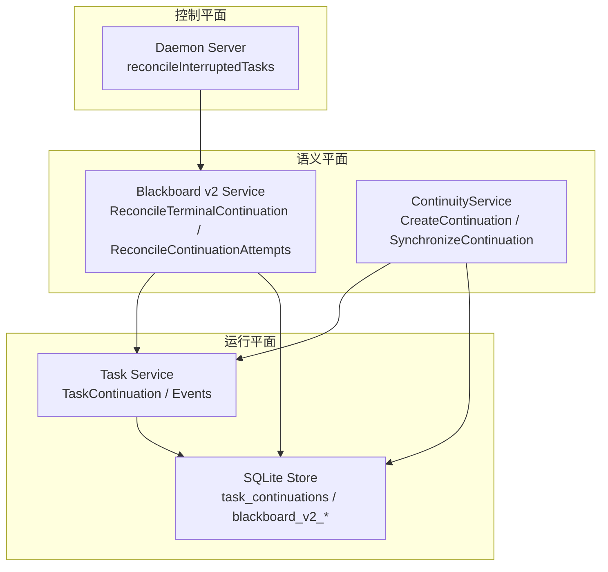
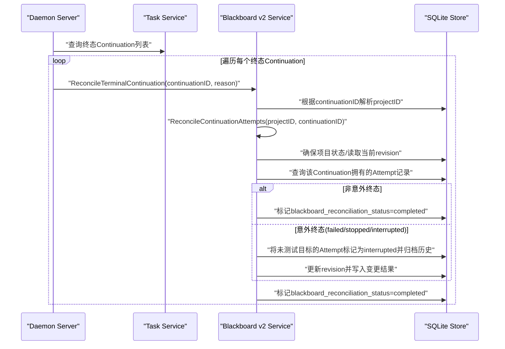
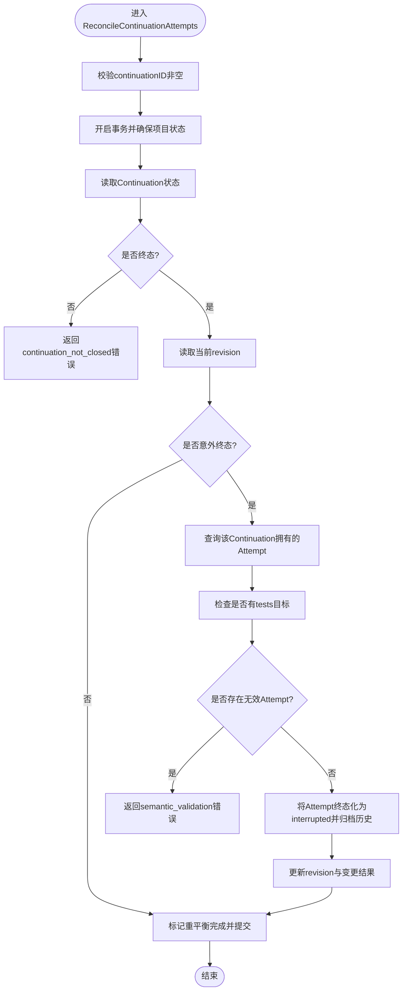
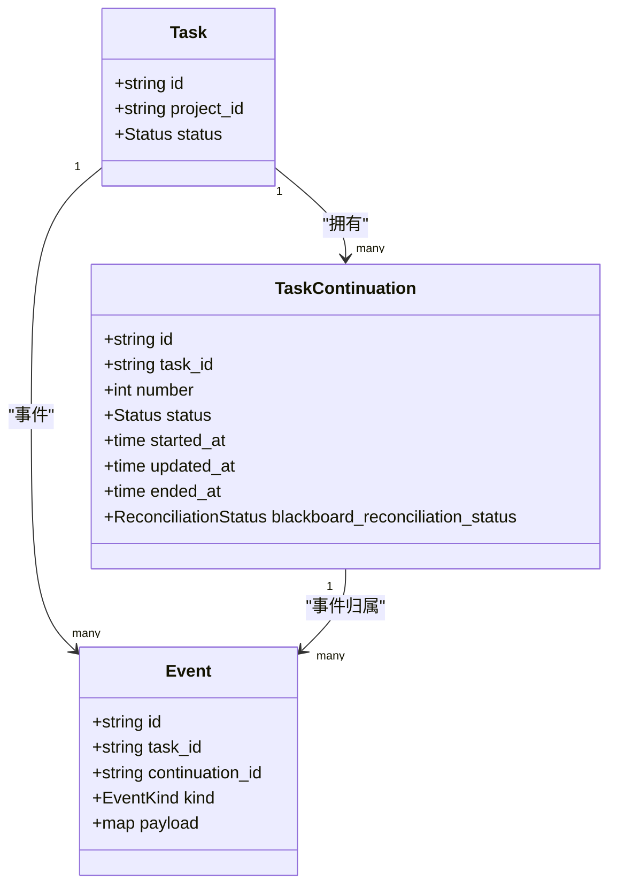
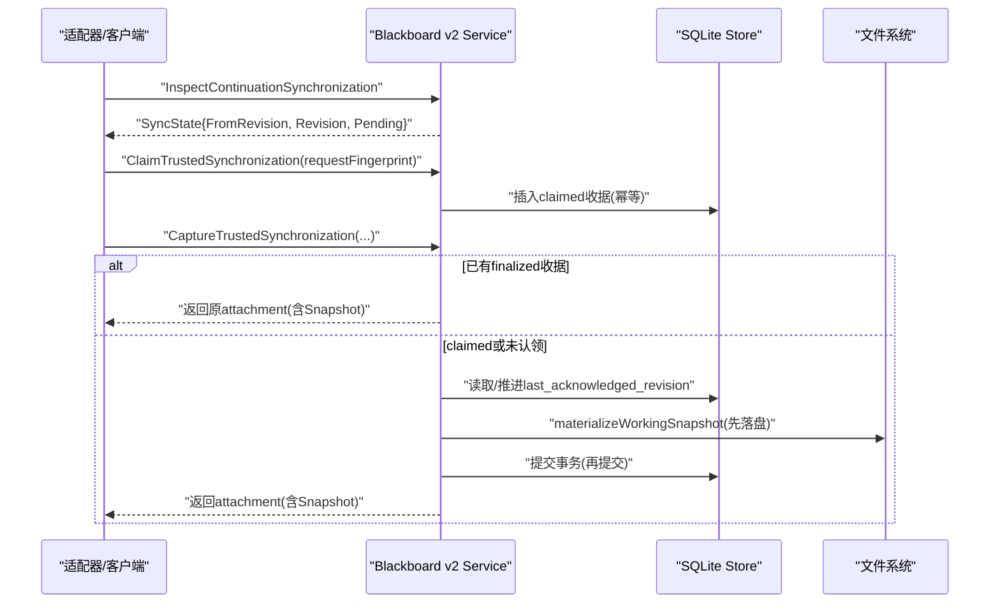
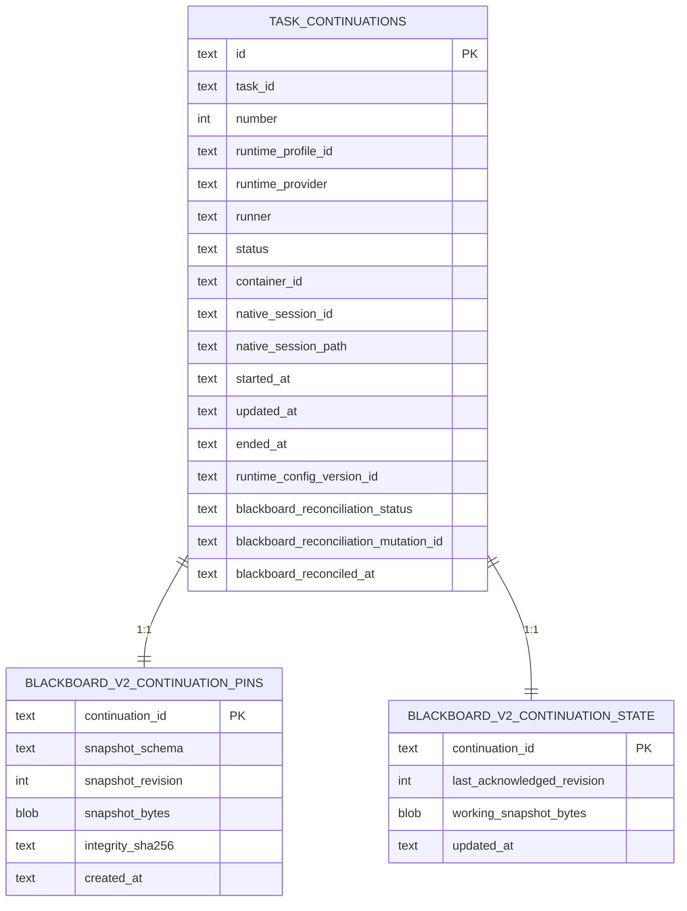
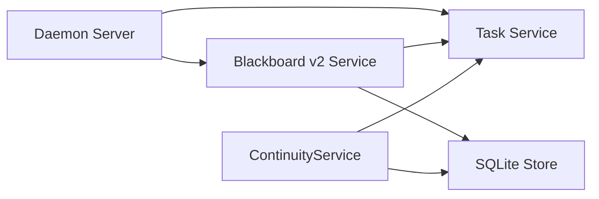

# Continuation生命周期管理

<cite>
**本文引用的文件**   
- [service.go](file://internal/blackboardv2/service.go)
- [continuity.go](file://internal/blackboardv2/continuity.go)
- [task.go](file://internal/task/task.go)
- [store.go](file://internal/store/store.go)
- [server.go](file://internal/daemon/server.go)
- [finish_task_resume_test.go](file://internal/daemon/finish_task_resume_test.go)
</cite>

## 目录
1. [引言](#引言)
2. [项目结构](#项目结构)
3. [核心组件](#核心组件)
4. [架构总览](#架构总览)
5. [详细组件分析](#详细组件分析)
6. [依赖关系分析](#依赖关系分析)
7. [性能与一致性考量](#性能与一致性考量)
8. [故障排查指南](#故障排查指南)
9. [结论](#结论)
10. [附录](#附录)

## 引言
本文件聚焦于Runtime Continuation的生命周期管理，围绕其创建、执行、恢复与终止的完整流程展开。重点解析ReconcileTerminalContinuation与ReconcileContinuationAttempts的职责边界、异常终止处理与尝试(Assertion)状态协调；阐明Continuation与Task的关系映射、项目状态同步与清理策略；给出Continuation ID生成规则、持久化存储格式与故障恢复机制；并提供实际使用场景与调试技巧，帮助读者在复杂并发与崩溃恢复场景中正确理解与排障。

## 项目结构
- 控制平面（Daemon）：负责任务启动、运行时活动监控、中断恢复与终态回调触发。
- 语义平面（Blackboard v2）：提供Continuation授权、同步、工作快照发布、以及终态后的尝试(Attempt)重平衡。
- 运行平面（Task/Store）：维护Task与Continuation实体、事件、状态迁移与数据库表结构。

图表来源
- [server.go:255-304](file://internal/daemon/server.go#L255-L304)
- [service.go:660-802](file://internal/blackboardv2/service.go#L660-L802)
- [continuity.go:764-880](file://internal/blackboardv2/continuity.go#L764-L880)
- [task.go:98-128](file://internal/task/task.go#L98-L128)
- [store.go:2089-2104](file://internal/store/store.go#L2089-L2104)

章节来源
- [server.go:255-304](file://internal/daemon/server.go#L255-L304)
- [service.go:660-802](file://internal/blackboardv2/service.go#L660-L802)
- [continuity.go:764-880](file://internal/blackboardv2/continuity.go#L764-L880)
- [task.go:98-128](file://internal/task/task.go#L98-L128)
- [store.go:2089-2104](file://internal/store/store.go#L2089-L2104)

## 核心组件
- TaskContinuation：表示一次具体的运行时实例，包含ID、编号、状态、时间戳、以及与Blackboard v2的重平衡标记等字段。
- Blackboard v2 Service：提供Continuation权威校验、同步、工作快照发布、以及终态后对Attempt的清理与重平衡。
- ContinuityService：负责Continuation的原子启动、Launch Pin与工作快照持久化、同步与回放。
- Daemon Server：在重启或异常时扫描终态Continuation并触发重平衡回调。

章节来源
- [task.go:98-128](file://internal/task/task.go#L98-L128)
- [service.go:41-49](file://internal/blackboardv2/service.go#L41-L49)
- [continuity.go:119-134](file://internal/blackboardv2/continuity.go#L119-L134)
- [server.go:255-304](file://internal/daemon/server.go#L255-L304)

## 架构总览
下图展示了从Daemon重启到终态Continuation重平衡的端到端流程，包括权限校验、项目状态检查、Attempt收集与终态化、以及重平衡完成标记。

图表来源
- [server.go:255-304](file://internal/daemon/server.go#L255-L304)
- [service.go:660-802](file://internal/blackboardv2/service.go#L660-L802)
- [task.go:950-983](file://internal/task/task.go#L950-L983)

## 详细组件分析

### ReconcileTerminalContinuation与ReconcileContinuationAttempts
- ReconcileTerminalContinuation：
  - 职责：作为服务端控制的回调入口，接收一个可信的Continuation身份与原因，解析其所属Project，并委托给ReconcileContinuationAttempts进行统一重平衡。
  - 关键行为：空ID拒绝；不存在返回权限错误；通过Join task_continuations与tasks获取projectID；失败包装为语义错误。
- ReconcileContinuationAttempts：
  - 职责：针对已终态的Continuation，将其“有效且打开”的Attempt移动到中断历史，或在正常终态下仅做重平衡标记。
  - 关键行为：
    - 事务内确保项目状态存在；读取当前revision。
    - 校验Continuation是否处于终态；否则拒绝。
    - 若为非意外终态（completed），直接标记重平衡完成。
    - 若是意外终态（failed/stopped/interrupted），查询该Continuation拥有且尚未被测试目标关联的Attempt，将其状态置为interrupted并归档历史，同时更新revision与变更结果。
    - 最终标记blackboard_reconciliation_status=completed并落盘。

图表来源
- [service.go:685-802](file://internal/blackboardv2/service.go#L685-L802)
- [service.go:2875-2887](file://internal/blackboardv2/service.go#L2875-L2887)
- [service.go:2900-2906](file://internal/blackboardv2/service.go#L2900-L2906)
- [service.go:3209-3225](file://internal/blackboardv2/service.go#L3209-L3225)
- [service.go:3231-3237](file://internal/blackboardv2/service.go#L3231-L3237)
- [service.go:2441-2465](file://internal/blackboardv2/service.go#L2441-L2465)
- [service.go:2577-2616](file://internal/blackboardv2/service.go#L2577-L2616)
- [service.go:3321-3350](file://internal/blackboardv2/service.go#L3321-L3350)

章节来源
- [service.go:660-680](file://internal/blackboardv2/service.go#L660-L680)
- [service.go:685-802](file://internal/blackboardv2/service.go#L685-L802)

### Continuation与Task的关系映射
- 一对多：一个Task可产生多个Continuation，按number递增；只有最新且未关闭的Continuation可写。
- 状态机：Continuation状态包括pending/running/paused/completed/failed/stopped/interrupted；其中completed/failed/stopped/interrupted为终态。
- 事件关联：Task事件可携带continuation_id，用于追踪具体运行时实例的行为。
- 活跃性判定：Live=true当且仅当Continuation可写且无更高number的Continuation存在。

图表来源
- [task.go:98-128](file://internal/task/task.go#L98-L128)
- [task.go:554-590](file://internal/task/task.go#L554-L590)
- [task.go:950-983](file://internal/task/task.go#L950-L983)

章节来源
- [task.go:98-128](file://internal/task/task.go#L98-L128)
- [task.go:554-590](file://internal/task/task.go#L554-L590)
- [task.go:950-983](file://internal/task/task.go#L950-L983)

### 项目状态同步与清理策略
- 同步协议：
  - Inspect/Authorize：校验Project/Task/Continuation绑定，计算Pending与LastAcknowledgedRevision。
  - Claim/Finalize：基于请求指纹保证幂等投递，避免重复或丢失同步附件。
  - Synchronize：推进Working Snapshot至当前Runtime Snapshot，先落盘再提交，失败回滚磁盘状态。
- 清理策略：
  - 终态后重平衡：意外终态会清理未测试的Attempt，避免遗留脏数据。
  - 工作快照文件：在失败路径上恢复之前的working snapshot字节或文件缺失状态，保持磁盘与事务一致。

图表来源
- [continuity.go:157-205](file://internal/blackboardv2/continuity.go#L157-L205)
- [continuity.go:227-325](file://internal/blackboardv2/continuity.go#L227-L325)
- [continuity.go:345-389](file://internal/blackboardv2/continuity.go#L345-L389)
- [continuity.go:647-751](file://internal/blackboardv2/continuity.go#L647-L751)

章节来源
- [continuity.go:157-205](file://internal/blackboardv2/continuity.go#L157-L205)
- [continuity.go:227-325](file://internal/blackboardv2/continuity.go#L227-L325)
- [continuity.go:345-389](file://internal/blackboardv2/continuity.go#L345-L389)
- [continuity.go:647-751](file://internal/blackboardv2/continuity.go#L647-L751)

### 异常终止处理与尝试(Assertion)状态协调
- 异常终止来源：
  - Daemon重启导致的中断：reconcileInterruptedTasks扫描终态Continuation并调用ReconcileTerminalContinuation。
  - 运行时离线/孤儿：runtime activity reconcile可能标记Task失败或中断，进而触发终态回调。
- Attempt协调：
  - 对于意外终态，系统会查找该Continuation拥有的Attempt，若缺少tests目标则视为无效并报错；否则将其终态化为interrupted并归档历史，确保语义完整性。

章节来源
- [server.go:255-304](file://internal/daemon/server.go#L255-L304)
- [service.go:685-802](file://internal/blackboardv2/service.go#L685-L802)

### Continuation ID生成规则
- 生成方式：采用16字节随机数转十六进制字符串；若随机源失败则回退为时间戳编码。
- 唯一性与安全性：ID具备高熵与不可预测性，适合作为能力令牌绑定的主体标识。

章节来源
- [task.go:1449-1455](file://internal/task/task.go#L1449-L1455)

### 持久化存储格式与故障恢复机制
- 表结构：
  - task_continuations：记录Continuation主键、TaskID、编号、运行时配置、状态、时间戳及重平衡标记。
  - blackboard_v2_continuation_pins：不可变Launch Pin，包含schema、revision、snapshot_bytes与SHA256摘要。
  - blackboard_v2_continuation_state：记录last_acknowledged_revision与working_snapshot_bytes。
- 恢复机制：
  - Launch Pin校验：读取pins表，验证schema与revision一致性，并比对SHA256摘要。
  - Working Snapshot校验：读取state表，校验envelope schema与revision，确保字节完整性。
  - 文件级恢复：materializeWorkingSnapshot失败时恢复之前文件或字节缺失状态，保证事务外可见状态与事务内一致。

图表来源
- [store.go:2089-2104](file://internal/store/store.go#L2089-L2104)
- [store.go:1103-1118](file://internal/store/store.go#L1103-L1118)
- [continuity.go:882-939](file://internal/blackboardv2/continuity.go#L882-L939)
- [continuity.go:900-939](file://internal/blackboardv2/continuity.go#L900-L939)

章节来源
- [store.go:2089-2104](file://internal/store/store.go#L2089-L2104)
- [store.go:1103-1118](file://internal/store/store.go#L1103-L1118)
- [continuity.go:882-939](file://internal/blackboardv2/continuity.go#L882-L939)
- [continuity.go:900-939](file://internal/blackboardv2/continuity.go#L900-L939)

### 实际使用场景与调试技巧
- 典型场景：
  - 任务重启后自动重平衡：Daemon启动时扫描终态Continuation，逐一调用ReconcileTerminalContinuation，确保Attempt状态一致。
  - 运行时崩溃恢复：通过ReadLaunchPin与MaterializeLaunchPin恢复初始快照，或通过SynchronizeContinuation推进工作快照。
- 调试技巧：
  - 查看终态Continuation列表：使用TerminalContinuations接口，确认blackboard_reconciliation_status是否为completed。
  - 核对事件流：通过Events接口过滤lifecycle事件，观察phase与reason，定位中断或替换Continuation的时机。
  - 校验快照一致性：对比pins表的integrity_sha256与snapshot_bytes，确保未被篡改。
  - 模拟失败注入：利用ContinuityFailureInjector在before_commit/after_bind_grant等阶段注入错误，验证回滚与恢复路径。

章节来源
- [task.go:950-983](file://internal/task/task.go#L950-L983)
- [task.go:554-590](file://internal/task/task.go#L554-L590)
- [continuity.go:882-939](file://internal/blackboardv2/continuity.go#L882-L939)
- [finish_task_resume_test.go:33-52](file://internal/daemon/finish_task_resume_test.go#L33-L52)

## 依赖关系分析
- Daemon依赖Task服务获取终态Continuation，并调用Blackboard v2 Service进行重平衡。
- Blackboard v2 Service依赖Task服务进行Continuation状态查询与事件追加，依赖Store进行读写。
- ContinuityService依赖Task与Store，负责Launch Pin与工作快照的原子持久化与恢复。

图表来源
- [server.go:255-304](file://internal/daemon/server.go#L255-L304)
- [service.go:660-802](file://internal/blackboardv2/service.go#L660-L802)
- [continuity.go:764-880](file://internal/blackboardv2/continuity.go#L764-L880)
- [task.go:950-983](file://internal/task/task.go#L950-L983)

章节来源
- [server.go:255-304](file://internal/daemon/server.go#L255-L304)
- [service.go:660-802](file://internal/blackboardv2/service.go#L660-L802)
- [continuity.go:764-880](file://internal/blackboardv2/continuity.go#L764-L880)
- [task.go:950-983](file://internal/task/task.go#L950-L983)

## 性能与一致性考量
- 幂等与重试：同步交付通过request fingerprint实现幂等，避免重复投递与丢失。
- 先落盘后提交：工作快照文件在事务提交前写入，失败时回滚磁盘状态，保证外部可见一致性。
- 最小变更：仅在意外终态时对Attempt进行终态化与归档，减少不必要的历史写入。
- 并发安全：通过锁与唯一约束防止并发冲突，确保同一Continuation在同一时刻只有一个open claim。

[本节为通用指导，不直接分析具体文件]

## 故障排查指南
- 常见问题：
  - authority_denied：Continuation不属于指定Project/Task，检查绑定与权限。
  - continuation_not_closed：尝试在非终态Continuation上进行重平衡，需等待终态。
  - semantic_validation：Attempt缺少tests目标，需修复后再重平衡。
- 定位步骤：
  - 查看终端Continuation列表与重平衡标记。
  - 检查对应Task的事件流，关注lifecycle事件的phase与reason。
  - 校验Launch Pin与Working Snapshot的一致性，必要时重新materialize。

章节来源
- [service.go:4853-4855](file://internal/blackboardv2/service.go#L4853-L4855)
- [service.go:660-680](file://internal/blackboardv2/service.go#L660-L680)
- [service.go:685-802](file://internal/blackboardv2/service.go#L685-L802)

## 结论
Continuation生命周期管理以Task为中心，结合Blackboard v2的语义一致性与Continuity的原子持久化，实现了从创建、执行、恢复到终止的全链路保障。ReconcileTerminalContinuation与ReconcileContinuationAttempts构成了终态重平衡的核心，确保Attempt状态与项目知识保持一致。通过严格的ID生成、快照校验与文件级恢复，系统在崩溃与并发场景下仍能提供强一致性与可恢复性。

[本节为总结性内容，不直接分析具体文件]

## 附录
- 术语说明：
  - Continuation：一次具体的运行时实例，承载Task的一次执行上下文。
  - Attempt：对某一目标的尝试，可能被多个Continuation共享但由特定Continuation拥有。
  - Working Snapshot：运行时可见的项目知识快照，随变更推进而更新。
  - Launch Pin：不可变的启动快照，用于恢复与校验。

[本节为概念性内容，不直接分析具体文件]