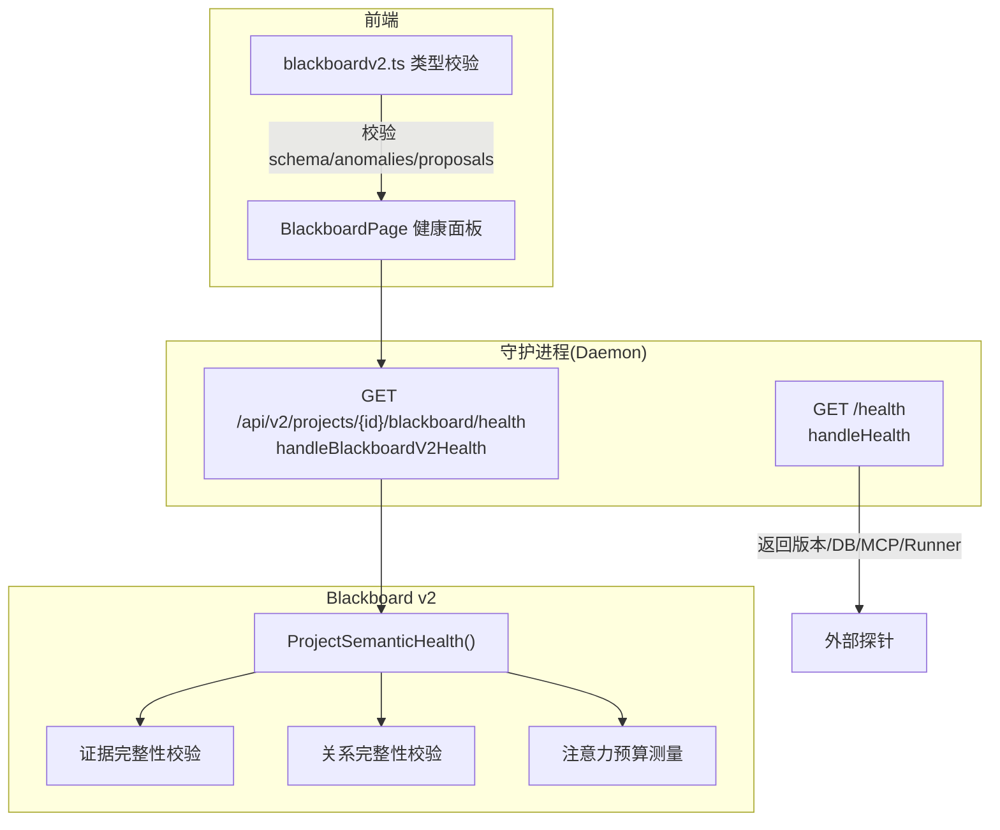
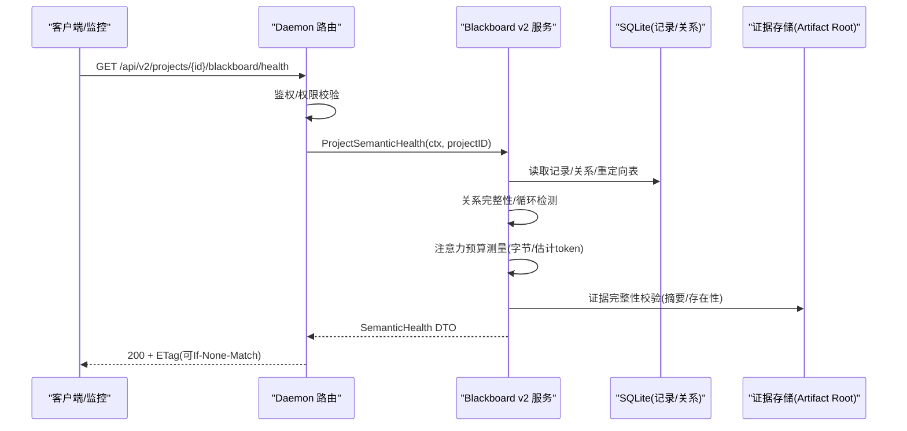
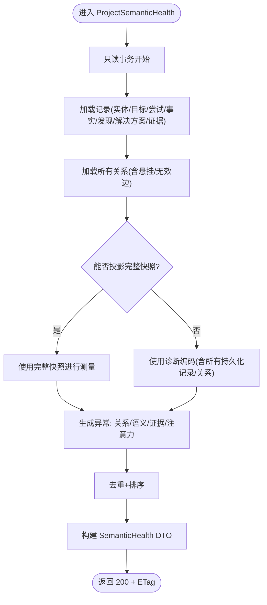
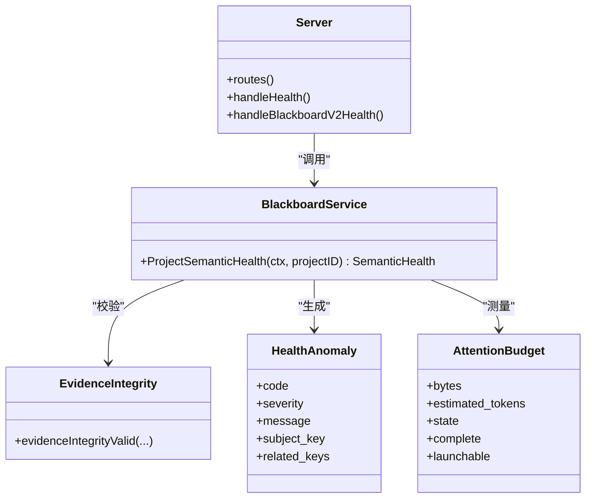

# 健康诊断与监控

<cite>
**本文引用的文件**   
- [internal/daemon/server.go](file://internal/daemon/server.go)
- [internal/daemon/blackboard_v2_http.go](file://internal/daemon/blackboard_v2_http.go)
- [internal/blackboardv2/health.go](file://internal/blackboardv2/health.go)
- [internal/blackboardv2/evidence.go](file://internal/blackboardv2/evidence.go)
- [internal/blackboardv2contract/contractdata/openapi.json](file://internal/blackboardv2contract/contractdata/openapi.json)
- [web/src/lib/blackboardv2.ts](file://web/src/lib/blackboardv2.ts)
- [web/src/pages/BlackboardPage.test.tsx](file://web/src/pages/BlackboardPage.test.tsx)
- [internal/daemon/mcp_test.go](file://internal/daemon/mcp_test.go)
- [internal/daemon/blackboard_v2_http_test.go](file://internal/daemon/blackboard_v2_http_test.go)
- [docs/adr/0004-use-compact-semantic-runtime-blackboard-snapshots.md](file://docs/adr/0004-use-compact-semantic-runtime-blackboard-snapshots.md)
- [docs/specs/blackboard-graph-storage.md](file://docs/specs/blackboard-graph-storage.md)
</cite>

## 目录
1. [简介](#简介)
2. [项目结构](#项目结构)
3. [核心组件](#核心组件)
4. [架构总览](#架构总览)
5. [详细组件分析](#详细组件分析)
6. [依赖关系分析](#依赖关系分析)
7. [性能考量](#性能考量)
8. [故障排查指南](#故障排查指南)
9. [结论](#结论)
10. [附录](#附录)

## 简介
本文件面向“健康诊断与监控”主题，聚焦 Blackboard v2 语义系统的健康检查能力、Daemon 层健康探针、以及前端对健康信息的消费。文档覆盖：
- Blackboard 健康端点的响应格式（服务状态、注意力预算、异常与建议）
- 数据库连接、存储空间与索引完整性验证的观测点
- 监控指标收集与分析建议（查询延迟、写入吞吐、内存使用）
- 自动化集成方案、告警规则配置与故障排查流程
- 性能基准测试、容量规划与扩容策略指导原则

## 项目结构
本项目为本地优先的渗透测试代理，包含 Go Daemon + React Dashboard + 沙箱运行时。与健康诊断相关的关键位置如下：
- Daemon HTTP 路由与全局健康探针
- Blackboard v2 健康接口实现与契约
- 前端对健康数据的校验与展示
- ADR 与存储规范中关于注意力预算与投影度量

图表来源
- [internal/daemon/server.go:587-674](file://internal/daemon/server.go#L587-L674)
- [internal/daemon/blackboard_v2_http.go:144-159](file://internal/daemon/blackboard_v2_http.go#L144-L159)
- [internal/blackboardv2/health.go:84-183](file://internal/blackboardv2/health.go#L84-L183)
- [web/src/pages/BlackboardPage.test.tsx:226-268](file://web/src/pages/BlackboardPage.test.tsx#L226-L268)
- [web/src/lib/blackboardv2.ts:863-895](file://web/src/lib/blackboardv2.ts#L863-L895)

章节来源
- [internal/daemon/server.go:587-674](file://internal/daemon/server.go#L587-L674)
- [internal/daemon/blackboard_v2_http.go:144-159](file://internal/daemon/blackboard_v2_http.go#L144-L159)
- [internal/blackboardv2/health.go:84-183](file://internal/blackboardv2/health.go#L84-L183)
- [web/src/pages/BlackboardPage.test.tsx:226-268](file://web/src/pages/BlackboardPage.test.tsx#L226-L268)
- [web/src/lib/blackboardv2.ts:863-895](file://web/src/lib/blackboardv2.ts#L863-L895)

## 核心组件
- 守护进程全局健康探针 GET /health
  - 返回版本、数据库状态、MCP 路径、Runner 环境信息；用于容器编排或负载均衡器的存活/就绪探测。
- Blackboard v2 语义健康 GET /api/v2/projects/{project_id}/blackboard/health
  - 基于当前图快照与持久化关系行进行确定性诊断，输出状态、注意力预算、异常与建议。
  - 支持 ETag 条件请求，保证幂等与缓存友好。
- 前端健康面板
  - 对后端返回的健康数据进行严格类型校验，并可视化状态、注意力预算与异常条目。

章节来源
- [internal/daemon/server.go:645-674](file://internal/daemon/server.go#L645-L674)
- [internal/daemon/blackboard_v2_http.go:144-159](file://internal/daemon/blackboard_v2_http.go#L144-L159)
- [internal/blackboardv2/health.go:84-183](file://internal/blackboardv2/health.go#L84-L183)
- [web/src/pages/BlackboardPage.test.tsx:226-268](file://web/src/pages/BlackboardPage.test.tsx#L226-L268)
- [web/src/lib/blackboardv2.ts:863-895](file://web/src/lib/blackboardv2.ts#L863-L895)

## 架构总览
Blackboard 健康诊断由三层协作完成：HTTP 接入层负责鉴权与条件缓存；领域服务层执行读取与诊断；数据层提供记录与关系视图。

图表来源
- [internal/daemon/blackboard_v2_http.go:144-159](file://internal/daemon/blackboard_v2_http.go#L144-L159)
- [internal/blackboardv2/health.go:84-183](file://internal/blackboardv2/health.go#L84-L183)
- [internal/blackboardv2/evidence.go:1057-1100](file://internal/blackboardv2/evidence.go#L1057-L1100)
- [internal/blackboardv2contract/contractdata/openapi.json:161-180](file://internal/blackboardv2contract/contractdata/openapi.json#L161-L180)

## 详细组件分析

### 守护进程全局健康探针 GET /health
- 功能
  - 返回版本、数据库状态、MCP 路径、Runner 运行根、沙箱镜像与容器 CLI 名称。
  - 作为存活探针，无需认证即可访问。
- 关键行为
  - 固定字段填充，未做深度依赖探测（如不主动写库）。
- 适用场景
  - 容器编排、反向代理、负载均衡器的心跳检查。

章节来源
- [internal/daemon/server.go:645-674](file://internal/daemon/server.go#L645-L674)
- [internal/daemon/mcp_test.go:11-31](file://internal/daemon/mcp_test.go#L11-L31)

### Blackboard v2 语义健康 GET /api/v2/projects/{project_id}/blackboard/health
- 鉴权与权限
  - 仅允许具备相应能力的主体访问，跨项目访问将被拒绝。
- 条件缓存
  - 返回 ETag，支持 If-None-Match 以获取 304 Not Modified。
- 响应体字段
  - schema、revision、status、attention、anomalies、proposals
  - attention 包含 bytes、estimated_tokens、state、complete、launchable、consolidation_offered、consolidation_required
- 语义健康要点
  - 即使快照不可用，仍会给出诊断型注意力测量，且不会阻止启动。
  - 注意力阈值：16K 健康目标、32K 警告、64K 需合并。

图表来源
- [internal/blackboardv2/health.go:84-183](file://internal/blackboardv2/health.go#L84-L183)
- [internal/blackboardv2/health.go:335-391](file://internal/blackboardv2/health.go#L335-L391)
- [internal/blackboardv2/health.go:433-621](file://internal/blackboardv2/health.go#L433-L621)
- [internal/blackboardv2/health.go:623-685](file://internal/blackboardv2/health.go#L623-L685)
- [internal/blackboardv2/health.go:793-810](file://internal/blackboardv2/health.go#L793-L810)

章节来源
- [internal/daemon/blackboard_v2_http.go:144-159](file://internal/daemon/blackboard_v2_http.go#L144-L159)
- [internal/blackboardv2/health.go:84-183](file://internal/blackboardv2/health.go#L84-L183)
- [internal/blackboardv2/health.go:335-391](file://internal/blackboardv2/health.go#L335-L391)
- [internal/blackboardv2/health.go:433-621](file://internal/blackboardv2/health.go#L433-L621)
- [internal/blackboardv2/health.go:623-685](file://internal/blackboardv2/health.go#L623-L685)
- [internal/blackboardv2/health.go:793-810](file://internal/blackboardv2/health.go#L793-L810)
- [internal/blackboardv2contract/contractdata/openapi.json:161-180](file://internal/blackboardv2contract/contractdata/openapi.json#L161-L180)
- [internal/daemon/blackboard_v2_http_test.go:198-249](file://internal/daemon/blackboard_v2_http_test.go#L198-L249)

### 数据库连接状态
- 全局健康探针 GET /health 中的 database.status 固定为 ok，表示守护进程已初始化数据库句柄。
- 若需要更严格的可用性探测（例如实际读写），可在上层编排中扩展该探针逻辑。

章节来源
- [internal/daemon/server.go:645-674](file://internal/daemon/server.go#L645-L674)

### 存储空间使用
- 证据存储位于 Artifact Root（默认与数据库同目录），健康诊断会校验证据完整性（存在性与摘要一致性）。
- 注意力预算测量基于 Runtime Snapshot 的精确字节数，反映语义内容大小，而非存储元数据。

章节来源
- [internal/daemon/server.go:170-173](file://internal/daemon/server.go#L170-L173)
- [internal/blackboardv2/health.go:155-174](file://internal/blackboardv2/health.go#L155-L174)
- [internal/blackboardv2/evidence.go:1057-1100](file://internal/blackboardv2/evidence.go#L1057-L1100)

### 索引与关系完整性验证
- 关系完整性检查包括：
  - 悬挂边（指向非当前端点）
  - 语法违规（关系两端类型不允许）
  - 原因约束违规（长度/必填）
  - 环检测（在有效端点间）
- Key 重定向完整性检查：
  - 指向缺失的 canonical
  - 形成链式重定向
  - 源仍存在当前记录

章节来源
- [internal/blackboardv2/health.go:335-391](file://internal/blackboardv2/health.go#L335-L391)
- [internal/blackboardv2/health.go:713-791](file://internal/blackboardv2/health.go#L713-L791)

### 注意力预算与语义健康状态
- 注意力预算阈值：
  - 16K：健康目标
  - 32K：警告
  - 64K：需合并
- 状态推导：
  - 根据异常严重级别计算整体 status（healthy/attention/warning/critical）
  - 当无法投影完整快照时，complete=false，但仍保持 launchable=true

章节来源
- [docs/adr/0004-use-compact-semantic-runtime-blackboard-snapshots.md:68-74](file://docs/adr/0004-use-compact-semantic-runtime-blackboard-snapshots.md#L68-L74)
- [internal/blackboardv2/health.go:404-431](file://internal/blackboardv2/health.go#L404-L431)
- [internal/blackboardv2/health.go:793-810](file://internal/blackboardv2/health.go#L793-L810)

### 前端健康面板与类型校验
- 前端通过 /api/v2/projects/{id}/blackboard/health 拉取健康数据，并在 UI 中显示状态、注意力预算与异常。
- 前端对响应体进行严格白名单校验，确保 code/action/approval_required 等字段符合契约。

章节来源
- [web/src/pages/BlackboardPage.test.tsx:226-268](file://web/src/pages/BlackboardPage.test.tsx#L226-L268)
- [web/src/lib/blackboardv2.ts:863-895](file://web/src/lib/blackboardv2.ts#L863-L895)

## 依赖关系分析
- HTTP 层依赖
  - 鉴权与权限模型（Continuation 能力）
  - 条件缓存（ETag/If-None-Match）
- 领域层依赖
  - 只读事务读取记录与关系
  - 证据完整性校验（持久化证据与引用结论的关系）
  - 注意力预算测量（基于快照字节与估计 token）
- 契约与测试
  - OpenAPI 契约定义健康端点参数与响应
  - 单元测试覆盖隔离性、幂等、异常组合与边界情况

图表来源
- [internal/daemon/server.go:587-674](file://internal/daemon/server.go#L587-L674)
- [internal/daemon/blackboard_v2_http.go:144-159](file://internal/daemon/blackboard_v2_http.go#L144-L159)
- [internal/blackboardv2/health.go:84-183](file://internal/blackboardv2/health.go#L84-L183)
- [internal/blackboardv2/evidence.go:1057-1100](file://internal/blackboardv2/evidence.go#L1057-L1100)

章节来源
- [internal/daemon/server.go:587-674](file://internal/daemon/server.go#L587-L674)
- [internal/daemon/blackboard_v2_http.go:144-159](file://internal/daemon/blackboard_v2_http.go#L144-L159)
- [internal/blackboardv2/health.go:84-183](file://internal/blackboardv2/health.go#L84-L183)
- [internal/blackboardv2/evidence.go:1057-1100](file://internal/blackboardv2/evidence.go#L1057-L1100)

## 性能考量
- 只读事务与确定性输出
  - 健康诊断使用只读事务，避免阻塞写入；输出确定性强，便于缓存与对比。
- 注意力预算测量
  - 基于快照字节与估计 token，阈值用于提示合并，不截断也不过滤语义内容。
- 存储与 I/O
  - 证据完整性校验涉及磁盘 IO，建议在高频轮询时结合 ETag 减少带宽与 CPU 消耗。
- 监控指标建议
  - 查询延迟：对 /health 与 /blackboard/health 的 P50/P95/P99 延迟采样
  - 写入吞吐：记录变更频率（ChangeBatch 提交速率）
  - 内存使用：进程 RSS/GC 统计，关注快照投影时的峰值
  - 关系扫描耗时：健康诊断中关系扫描与环检测的耗时占比
  - 证据校验失败率：证据缺失或摘要不一致的比例

章节来源
- [internal/blackboardv2/health.go:84-183](file://internal/blackboardv2/health.go#L84-L183)
- [docs/adr/0004-use-compact-semantic-runtime-blackboard-snapshots.md:68-74](file://docs/adr/0004-use-compact-semantic-runtime-blackboard-snapshots.md#L68-L74)
- [docs/specs/blackboard-graph-storage.md:386-413](file://docs/specs/blackboard-graph-storage.md#L386-L413)

## 故障排查指南
- 常见异常与定位
  - dangling_relationship：关系指向非当前端点，检查键重定向与删除历史
  - invalid_relationship：关系两端类型不允许或原因约束违规，核对语法与 reason
  - relationship_cycle：有效端点间出现环，检查业务逻辑是否引入自引用或闭环
  - missing_evidence：证据缺失或被标记 missing，尤其当支撑 confirmed/verified 结论时需优先处理
  - unresolved_contradiction：结论间矛盾未解决，评估冲突来源与优先级
  - redirect_integrity：重定向链或源仍存在记录，清理冗余或修复映射
- 注意力预算告警
  - warning：接近 32K，建议安排 Reason Task 合并
  - required：超过 64K，必须启动合并任务，避免上下文膨胀
- 快速验证步骤
  - 使用 ETag 条件请求确认响应稳定性
  - 对比 health 与 snapshot revision，防止混用不同版本
  - 针对 subject_key 与 related_keys 导航到具体记录详情

章节来源
- [internal/blackboardv2/health.go:335-391](file://internal/blackboardv2/health.go#L335-L391)
- [internal/blackboardv2/health.go:433-621](file://internal/blackboardv2/health.go#L433-L621)
- [internal/blackboardv2/health.go:623-685](file://internal/blackboardv2/health.go#L623-L685)
- [internal/blackboardv2/health.go:713-791](file://internal/blackboardv2/health.go#L713-L791)
- [web/src/pages/BlackboardPage.test.tsx:226-268](file://web/src/pages/BlackboardPage.test.tsx#L226-L268)

## 结论
Blackboard v2 健康诊断以只读、确定性、可缓存为核心设计，兼顾完整性与可操作性。通过注意力预算与异常分类，既能保障系统稳定，又能引导操作者采取合理的合并与修复动作。配合全局健康探针与前端校验，形成了从基础设施到语义层的完整健康观测体系。

## 附录

### API 定义与响应示例
- 端点
  - GET /api/v2/projects/{project_id}/blackboard/health
- 主要响应字段
  - schema: "blackboard-health/v2"
  - revision: 整数
  - status: "healthy" | "attention" | "warning" | "critical"
  - attention.bytes: 整数
  - attention.estimated_tokens: 整数
  - attention.state: "within_target" | "warning" | "required"
  - attention.complete: 布尔
  - attention.launchable: 布尔
  - attention.consolidation_offered: 布尔
  - attention.consolidation_required: 布尔
  - anomalies[].code/severity/message/subject_key/related_keys
  - proposals[].code/action/approval_required/required
- 条件缓存
  - 响应头包含 ETag；客户端可携带 If-None-Match 获取 304

章节来源
- [internal/blackboardv2contract/contractdata/openapi.json:161-180](file://internal/blackboardv2contract/contractdata/openapi.json#L161-L180)
- [internal/daemon/blackboard_v2_http_test.go:198-249](file://internal/daemon/blackboard_v2_http_test.go#L198-L249)

### 自动化集成与告警建议
- 集成方式
  - 使用 GET /health 作为存活探针
  - 定时轮询 /blackboard/health，结合 ETag 降低负载
- 告警规则
  - status=critical 立即告警
  - attention.state=required 触发高优告警
  - anomalies 中出现 missing_evidence 且 severity=critical 时告警
  - attention.estimated_tokens 持续高于 32K 超过 N 分钟触发预警
- 采集指标
  - 健康端点延迟分位值
  - 304 命中率（反映缓存有效性）
  - 异常计数按 code 聚合

章节来源
- [internal/daemon/server.go:645-674](file://internal/daemon/server.go#L645-L674)
- [internal/daemon/blackboard_v2_http_test.go:198-249](file://internal/daemon/blackboard_v2_http_test.go#L198-L249)
- [web/src/lib/blackboardv2.ts:863-895](file://web/src/lib/blackboardv2.ts#L863-L895)

### 性能基准与容量规划
- 基准测试建议
  - 并发读取健康端点，观察 P95/P99 延迟与错误率
  - 注入大量关系与证据，评估关系扫描与证据校验耗时
- 容量规划
  - 注意力预算阈值用于控制语义上下文规模，避免超出模型可用窗口
  - 证据存储与数据库体积增长应独立监控，不直接驱动语义合并
- 扩容策略
  - 水平扩展：多实例共享同一数据库，注意只读健康查询的缓存命中
  - 垂直扩展：提升 CPU/内存以应对大规模快照投影与证据校验

章节来源
- [docs/adr/0004-use-compact-semantic-runtime-blackboard-snapshots.md:68-74](file://docs/adr/0004-use-compact-semantic-runtime-blackboard-snapshots.md#L68-L74)
- [docs/specs/blackboard-graph-storage.md:386-413](file://docs/specs/blackboard-graph-storage.md#L386-L413)