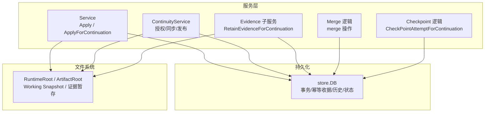
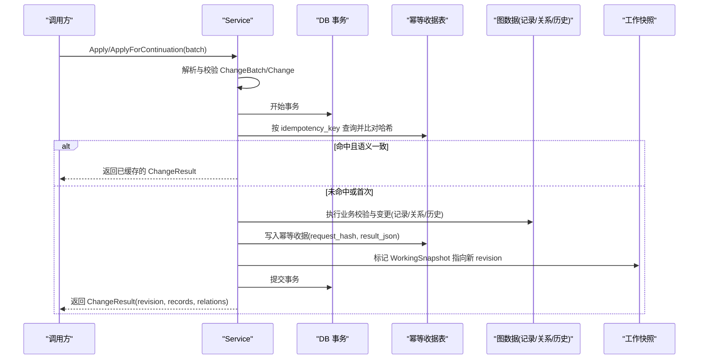
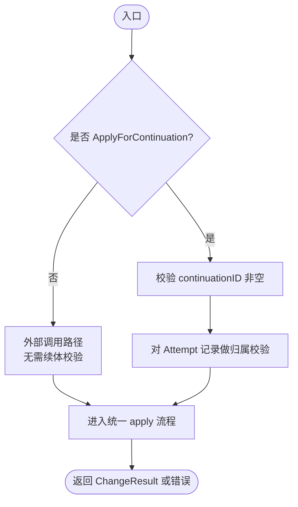
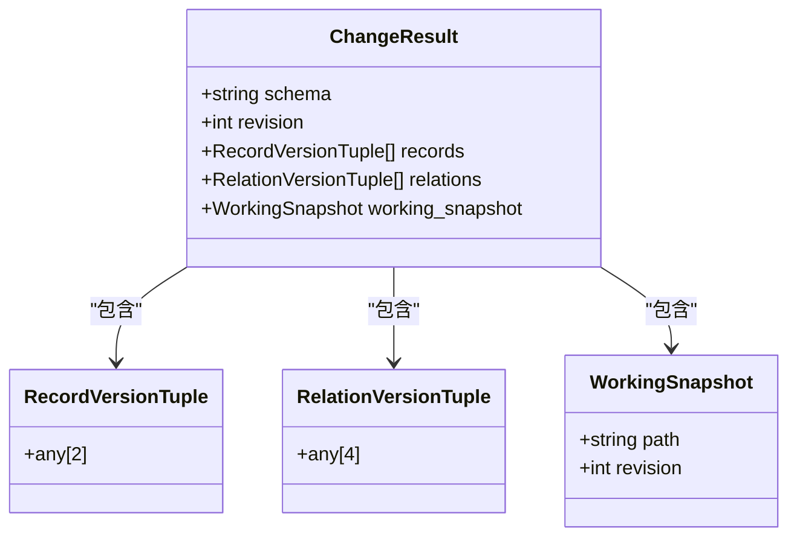
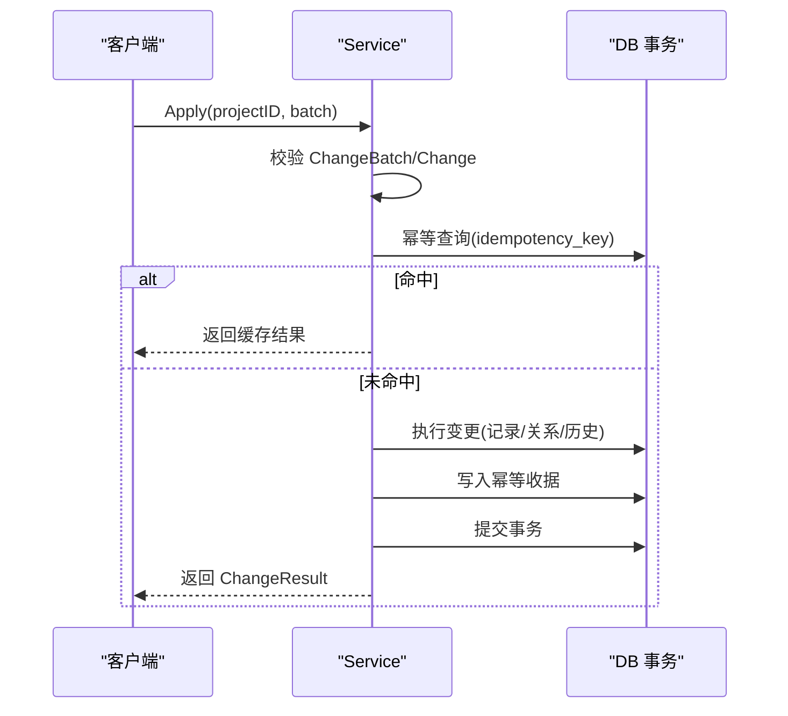
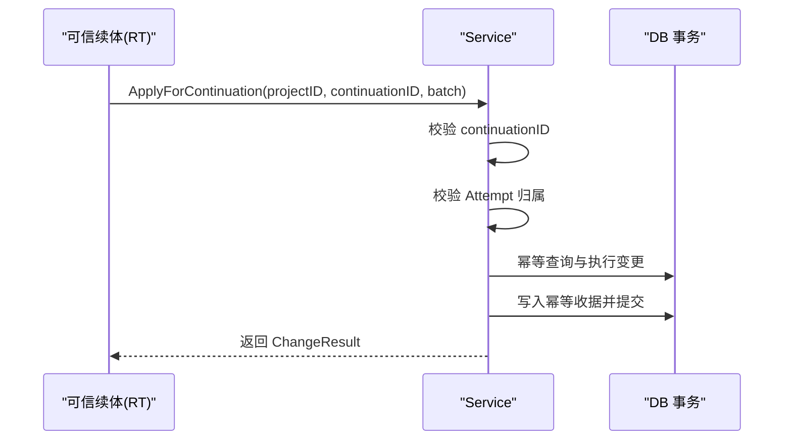
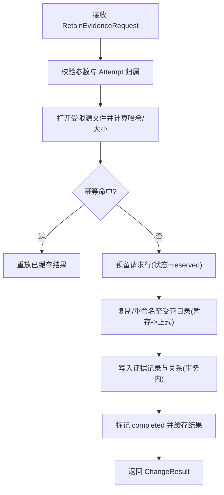
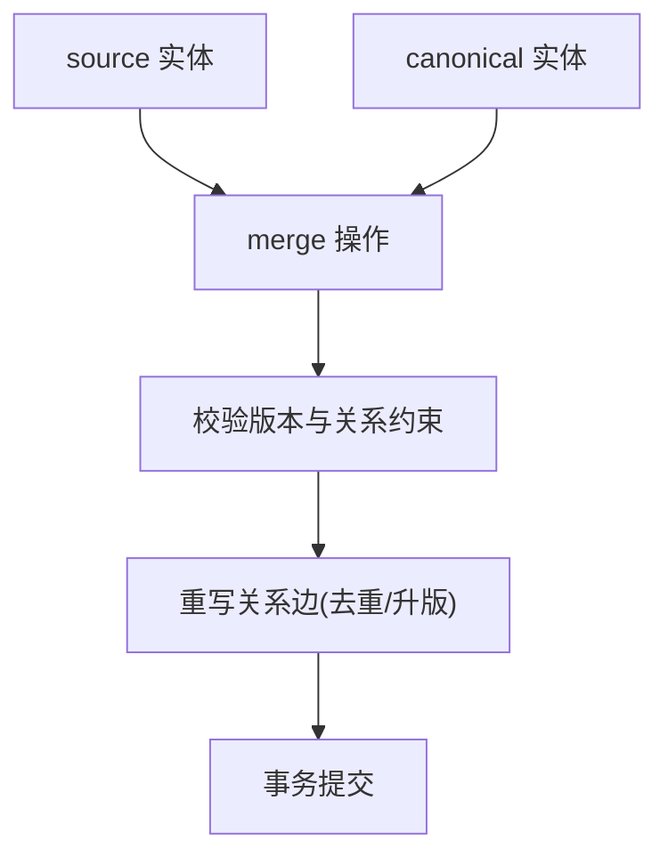
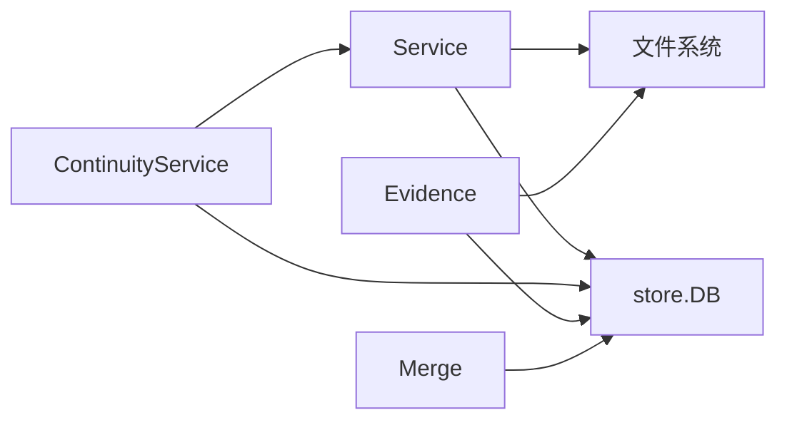

# 变更批处理与原子性

<cite>
**本文引用的文件**
- [service.go](file://internal/blackboardv2/service.go)
- [continuity.go](file://internal/blackboardv2/continuity.go)
- [evidence.go](file://internal/blackboardv2/evidence.go)
- [merge.go](file://internal/blackboardv2/merge.go)
- [checkpoint.go](file://internal/blackboardv2/checkpoint.go)
- [blackboard-graph-storage.md](file://docs/specs/blackboard-graph-storage.md)
</cite>

## 目录
1. [简介](#简介)
2. [项目结构](#项目结构)
3. [核心组件](#核心组件)
4. [架构总览](#架构总览)
5. [详细组件分析](#详细组件分析)
6. [依赖关系分析](#依赖关系分析)
7. [性能考量](#性能考量)
8. [故障排查指南](#故障排查指南)
9. [结论](#结论)
10. [附录](#附录)

## 简介
本文件聚焦于 Blackboard v2 的“变更批处理系统”，围绕 ChangeBatch 的原子性应用机制展开，涵盖幂等性键去重、事务边界控制与回滚策略；对比 Apply 与 ApplyForContinuation 的差异；解释 trusted Continuation 的身份验证与权限控制；说明变更结果 ChangeResult 的结构（修订号、受影响记录与关系元组）；并总结批量操作的错误处理模式、重试策略与并发安全保证。最后给出使用示例与性能优化建议。

## 项目结构
Blackboard v2 的变更批处理能力由服务层 Service 提供，并通过持久化存储 store.DB 完成事务写入；Continuity 子系统负责可信运行时续体的生命周期、同步与发布；Evidence 子系统负责受管证据文件的保留与语义发布；Merge 模块实现实体合并与关系重写；Checkpoint 为续体提供检查点更新。

图表来源
- [service.go:644-656](file://internal/blackboardv2/service.go#L644-L656)
- [continuity.go:154-205](file://internal/blackboardv2/continuity.go#L154-L205)
- [evidence.go:194-360](file://internal/blackboardv2/evidence.go#L194-L360)
- [merge.go:181-213](file://internal/blackboardv2/merge.go#L181-L213)
- [checkpoint.go:68-98](file://internal/blackboardv2/checkpoint.go#L68-L98)

章节来源
- [service.go:644-656](file://internal/blackboardv2/service.go#L644-L656)
- [continuity.go:154-205](file://internal/blackboardv2/continuity.go#L154-L205)
- [evidence.go:194-360](file://internal/blackboardv2/evidence.go#L194-L360)
- [merge.go:181-213](file://internal/blackboardv2/merge.go#L181-L213)
- [checkpoint.go:68-98](file://internal/blackboardv2/checkpoint.go#L68-L98)

## 核心组件
- ChangeBatch：语义变更信封，包含 schema、idempotency_key 与 changes 数组；强校验字段与类型，拒绝未知字段。
- Change：支持 create/update/relate/unrelate/transition/supersede/merge 等操作，每种操作有严格的字段白名单与约束。
- ChangeResult：返回 revision、records、relations 以及 WorkingSnapshot 指针，供调用方确认生效范围与后续读取。
- Service.Apply / ApplyForContinuation：前者用于外部调用者，后者要求传入 continuationID 以启用可信续体身份与权限校验。
- Continuity：负责续体绑定、同步、工作快照发布与请求指纹幂等投递。
- Evidence：受管证据保留流程，含幂等、完整性校验、原子提交与可恢复的重放。
- Merge：将 source 合并到 canonical，并重写相关关系，确保无环与版本一致。
- Checkpoint：为 open Attempt 生成带 idempotency_key 的 compact summary 更新。

章节来源
- [service.go:72-120](file://internal/blackboardv2/service.go#L72-L120)
- [service.go:122-232](file://internal/blackboardv2/service.go#L122-L232)
- [service.go:414-481](file://internal/blackboardv2/service.go#L414-L481)
- [service.go:644-656](file://internal/blackboardv2/service.go#L644-L656)
- [continuity.go:154-205](file://internal/blackboardv2/continuity.go#L154-L205)
- [evidence.go:194-360](file://internal/blackboardv2/evidence.go#L194-L360)
- [merge.go:181-213](file://internal/blackboardv2/merge.go#L181-L213)
- [checkpoint.go:68-98](file://internal/blackboardv2/checkpoint.go#L68-L98)

## 架构总览
ChangeBatch 的原子应用路径如下：
- 解析与校验：对 ChangeBatch 与每个 Change 进行严格 JSON 反序列化与白名单校验。
- 幂等性检查：计算请求哈希，查询幂等收据表，命中则直接返回已保存的结果。
- 权限与所有权：对于 ApplyForContinuation，校验 continuationID 存在且具备写权限；对涉及 Attempt 的记录进行归属校验。
- 事务执行：在单个数据库事务内执行所有变更（记录、关系、历史），并在同一事务中写入幂等收据。
- 结果构建：汇总变更的 records 与 relations，生成 ChangeResult 并附带 WorkingSnapshot 指针。
- 失败回滚：任何阶段失败均回滚事务，旧 revision 保持不变；成功但响应丢失可由相同 idempotency_key 重放恢复。

图表来源
- [service.go:644-656](file://internal/blackboardv2/service.go#L644-L656)
- [service.go:3294-3319](file://internal/blackboardv2/service.go#L3294-L3319)
- [service.go:3321-3350](file://internal/blackboardv2/service.go#L3321-L3350)
- [blackboard-graph-storage.md:499-518](file://docs/specs/blackboard-graph-storage.md#L499-L518)

## 详细组件分析

### 幂等性与事务边界
- 幂等键与冲突检测：
  - ChangeBatch 的 idempotency_key 必须非空且唯一；重复 key 会比对 request_hash，若语义不同则返回幂等冲突错误。
  - 幂等收据在同一事务中与图变更一起落盘，保证“要么全部成功，要么全部回滚”。
- 事务边界与回滚：
  - 所有图变更、历史写入、幂等收据写入均在同一事务中；失败即回滚，不会留下部分变更。
  - 成功但响应丢失时，通过相同 idempotency_key 重放可精确回放结果。
- 并发安全：
  - 幂等收据的唯一约束避免并发下重复消费；同一 key 的并发请求仅一次成功，其余被拒绝或重放。

章节来源
- [service.go:72-120](file://internal/blackboardv2/service.go#L72-L120)
- [service.go:3294-3319](file://internal/blackboardv2/service.go#L3294-L3319)
- [blackboard-graph-storage.md:499-518](file://docs/specs/blackboard-graph-storage.md#L499-L518)

### Apply 与 ApplyForContinuation 的区别
- Apply：
  - 不携带 continuationID，适用于外部调用者；不涉及续体权限校验。
- ApplyForContinuation：
  - 强制要求 continuationID 非空，否则返回权限不足错误。
  - 进入 apply 内部后，会对涉及 Attempt 的记录进行归属校验，确保只有创建该 Attempt 的可信续体才能修改它。
  - 适合 Runtime 侧在可信上下文中写入知识。

图表来源
- [service.go:644-656](file://internal/blackboardv2/service.go#L644-L656)
- [service.go:3239-3292](file://internal/blackboardv2/service.go#L3239-L3292)

章节来源
- [service.go:644-656](file://internal/blackboardv2/service.go#L644-L656)
- [service.go:3239-3292](file://internal/blackboardv2/service.go#L3239-L3292)

### Trusted Continuation 身份验证与权限控制
- 绑定与状态检查：
  - AuthorizeContinuationBinding 校验 Project/Task/Continuation 三者绑定关系，判断是否为 live（可写）及是否存在更新的续体。
  - InspectContinuationSynchronization 允许只读场景下的身份校验与同步状态检查。
- 同步与发布：
  - ClaimTrustedSynchronization/CaptureTrustedSynchronization 基于请求指纹进行幂等投递与最终一致性保障，确保工作快照字节与 ack 原子推进。
- 权限边界：
  - 关闭或已被替代的续体禁止写入；Attempt 的修改需满足 owner 校验。

章节来源
- [continuity.go:154-205](file://internal/blackboardv2/continuity.go#L154-L205)
- [continuity.go:221-325](file://internal/blackboardv2/continuity.go#L221-L325)
- [continuity.go:345-389](file://internal/blackboardv2/continuity.go#L345-L389)
- [continuity.go:647-751](file://internal/blackboardv2/continuity.go#L647-L751)
- [service.go:3227-3237](file://internal/blackboardv2/service.go#L3227-L3237)

### 变更结果 ChangeResult 结构
- Schema：固定为 semantic-change-result/v2。
- Revision：本次变更后的全局修订号。
- Records：受影响记录的 [key, version] 列表，按 key 排序。
- Relations：受影响关系的 [from, relation, to, version] 列表，按 from/relation/to 排序。
- WorkingSnapshot：指向运行时工作快照的路径与 revision，便于客户端增量拉取。

图表来源
- [service.go:414-481](file://internal/blackboardv2/service.go#L414-L481)
- [service.go:3321-3350](file://internal/blackboardv2/service.go#L3321-L3350)

章节来源
- [service.go:414-481](file://internal/blackboardv2/service.go#L414-L481)
- [service.go:3321-3350](file://internal/blackboardv2/service.go#L3321-L3350)

### 关键操作流程与时序

#### 1) 普通批处理 Apply
- 解析与校验 -> 幂等检查 -> 权限/所有权校验 -> 事务内执行 -> 写入幂等收据 -> 提交 -> 返回结果。

图表来源
- [service.go:644-656](file://internal/blackboardv2/service.go#L644-L656)
- [service.go:3294-3319](file://internal/blackboardv2/service.go#L3294-L3319)
- [service.go:3321-3350](file://internal/blackboardv2/service.go#L3321-L3350)

章节来源
- [service.go:644-656](file://internal/blackboardv2/service.go#L644-L656)
- [service.go:3294-3319](file://internal/blackboardv2/service.go#L3294-L3319)
- [service.go:3321-3350](file://internal/blackboardv2/service.go#L3321-L3350)

#### 2) 可信续体批处理 ApplyForContinuation
- 额外步骤：校验 continuationID 非空；对 Attempt 记录进行 owner 校验；其他流程与 Apply 一致。

图表来源
- [service.go:644-656](file://internal/blackboardv2/service.go#L644-L656)
- [service.go:3239-3292](file://internal/blackboardv2/service.go#L3239-L3292)
- [service.go:3294-3319](file://internal/blackboardv2/service.go#L3294-L3319)

章节来源
- [service.go:644-656](file://internal/blackboardv2/service.go#L644-L656)
- [service.go:3239-3292](file://internal/blackboardv2/service.go#L3239-L3292)
- [service.go:3294-3319](file://internal/blackboardv2/service.go#L3294-L3319)

#### 3) 证据保留 RetainEvidenceForContinuation
- 输入：RetainEvidenceRequest（含 idempotency_key、attempt、source_path 等）。
- 流程要点：
  - 校验 attempt 当前且 open，且属于当前续体。
  - 打开受限的文件根，计算 SHA256 与大小，规划内部路径与暂存路径。
  - 幂等检查：若已完成则重放结果；若已预留则校验源文件一致性。
  - 原子提交：先持久化文件与元数据，再写入语义证据记录与关系，最后标记 completed 并缓存结果。
  - 失败清理：在多个注入点支持崩溃恢复与资源回收。

图表来源
- [evidence.go:194-360](file://internal/blackboardv2/evidence.go#L194-L360)
- [evidence.go:412-474](file://internal/blackboardv2/evidence.go#L412-L474)
- [evidence.go:519-526](file://internal/blackboardv2/evidence.go#L519-L526)

章节来源
- [evidence.go:194-360](file://internal/blackboardv2/evidence.go#L194-L360)
- [evidence.go:412-474](file://internal/blackboardv2/evidence.go#L412-L474)
- [evidence.go:519-526](file://internal/blackboardv2/evidence.go#L519-L526)

#### 4) 实体合并 merge
- 行为：将 source 合并到 canonical，必要时重写关系边，确保无自环与无环约束，并维护版本顺序。
- 并发：同一 key 的并发 merge 仅一次成功，其余因幂等或版本冲突失败。

图表来源
- [merge.go:181-213](file://internal/blackboardv2/merge.go#L181-L213)

章节来源
- [merge.go:181-213](file://internal/blackboardv2/merge.go#L181-L213)

#### 5) 续体检查点 CheckpointAttemptForContinuation
- 用途：为 open Attempt 生成 compact summary 的更新，复用统一的原子历史与幂等机制。
- 要求：必须提供 idempotency_key，version 为正整数，summary 合法。

章节来源
- [checkpoint.go:68-98](file://internal/blackboardv2/checkpoint.go#L68-L98)

## 依赖关系分析
- Service 依赖 store.DB 进行事务读写；依赖文件系统（runtimeRoot/artifactRoot）进行工作快照与证据文件管理。
- Continuity 依赖 Service 的投影与快照能力，同时与 Task 服务交互以创建/管理续体。
- Evidence 依赖受限文件根与受管存储，结合幂等收据与语义提交保证一致性。
- Merge 依赖关系语法与循环检测，确保图不变式不被破坏。

图表来源
- [service.go:40-70](file://internal/blackboardv2/service.go#L40-L70)
- [continuity.go:119-134](file://internal/blackboardv2/continuity.go#L119-L134)
- [evidence.go:24-31](file://internal/blackboardv2/evidence.go#L24-L31)
- [merge.go:181-213](file://internal/blackboardv2/merge.go#L181-L213)

章节来源
- [service.go:40-70](file://internal/blackboardv2/service.go#L40-L70)
- [continuity.go:119-134](file://internal/blackboardv2/continuity.go#L119-L134)
- [evidence.go:24-31](file://internal/blackboardv2/evidence.go#L24-L31)
- [merge.go:181-213](file://internal/blackboardv2/merge.go#L181-L213)

## 性能考量
- 批量化与最小化变更：尽量在一个 ChangeBatch 中聚合相关变更，减少往返与事务开销。
- 幂等键设计：为每次业务动作生成稳定且唯一的 idempotency_key，避免重复执行与冲突。
- 关系操作合并：relate/unrelate 尽量批量提交，减少多次扫描与锁竞争。
- 工作快照发布：利用 WorkingSnapshot 指针进行增量拉取，避免全量读取。
- 并发控制：服务端通过幂等收据唯一约束与事务隔离保证并发安全，客户端应避免高并发重复提交相同 key。

## 故障排查指南
- 幂等冲突：
  - 现象：返回幂等冲突错误，提示 idempotency_key 已被不同语义使用。
  - 排查：核对 idempotency_key 是否与之前请求一致；若业务语义变化，应更换新的 key。
- 权限不足：
  - 现象：authority_denied，常见于缺少 continuationID 或 Attempt 归属不符。
  - 排查：确认续体状态为 pending/running/paused，且尝试修改的 Attempt 确由当前续体创建。
- 版本冲突：
  - 现象：version_conflict，提示目标记录版本不一致。
  - 排查：先读取当前版本，再构造 update/transition 请求。
- 证据完整性失败：
  - 现象：evidence_integrity_failed 或 evidence_source_changed。
  - 排查：检查源文件是否被替换或损坏；确保 idempotency_key 对应的源内容一致。
- 同步投递问题：
  - 现象：同步附件丢失或重复。
  - 排查：使用请求指纹进行幂等投递；确认 Claim/Finalize 流程完整，避免中途失败导致 Pending 残留。

章节来源
- [service.go:3294-3319](file://internal/blackboardv2/service.go#L3294-L3319)
- [service.go:3239-3292](file://internal/blackboardv2/service.go#L3239-L3292)
- [evidence.go:194-360](file://internal/blackboardv2/evidence.go#L194-L360)
- [continuity.go:221-325](file://internal/blackboardv2/continuity.go#L221-L325)

## 结论
Blackboard v2 的变更批处理系统以 ChangeBatch 为核心，通过严格的幂等键、事务边界与回滚策略，保证了语义变更的原子性与可重放性。Apply 与 ApplyForContinuation 分别面向外部与可信续体，后者引入续体身份与 Attempt 归属校验。ChangeResult 提供了明确的修订号与受影响范围，配合 WorkingSnapshot 指针实现高效增量同步。证据保留与合并操作进一步扩展了系统的可靠性与一致性。整体设计兼顾了安全性、可恢复性与性能。

## 附录

### 使用示例（路径指引）
- 普通批处理 Apply：
  - 参考测试用例中的 Apply 调用与断言，了解如何构造 ChangeBatch 与解析 ChangeResult。
  - 路径：[entity_service_test.go](file://internal/blackboardv2/entity_service_test.go)
- 可信续体批处理 ApplyForContinuation：
  - 参考续体上下文下的 ApplyForContinuation 用法与权限校验断言。
  - 路径：[fact_service_test.go](file://internal/blackboardv2/fact_service_test.go)
- 证据保留 RetainEvidenceForContinuation：
  - 参考证据保留的完整流程与幂等重放断言。
  - 路径：[evidence_service_test.go](file://internal/blackboardv2/evidence_service_test.go)
- 实体合并 merge：
  - 参考并发 merge 的幂等与结果一致性断言。
  - 路径：[merge_service_test.go](file://internal/blackboardv2/merge_service_test.go)
- 续体检查点 CheckpointAttemptForContinuation：
  - 参考检查点更新与幂等键要求的断言。
  - 路径：[checkpoint_service_test.go](file://internal/blackboardv2/checkpoint_service_test.go)

章节来源
- [entity_service_test.go:215-240](file://internal/blackboardv2/entity_service_test.go#L215-L240)
- [fact_service_test.go:596-801](file://internal/blackboardv2/fact_service_test.go#L596-L801)
- [evidence_service_test.go:124-577](file://internal/blackboardv2/evidence_service_test.go#L124-L577)
- [merge_service_test.go:855-885](file://internal/blackboardv2/merge_service_test.go#L855-L885)
- [checkpoint_service_test.go](file://internal/blackboardv2/checkpoint_service_test.go)