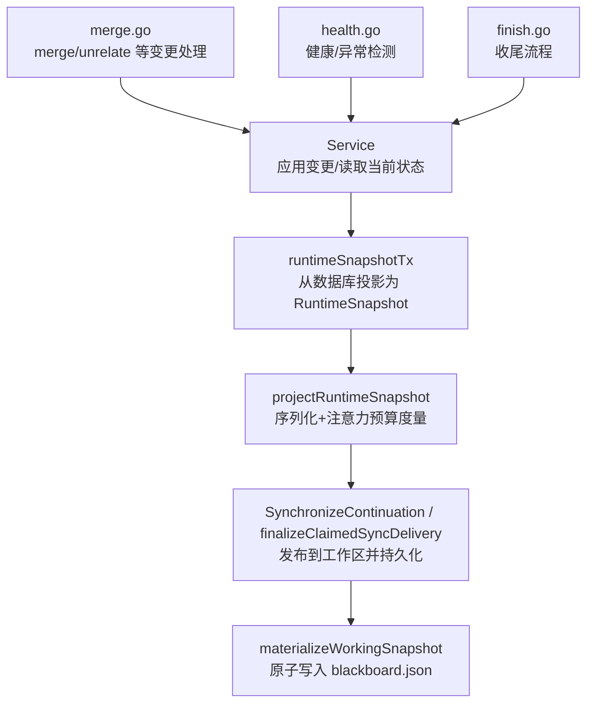
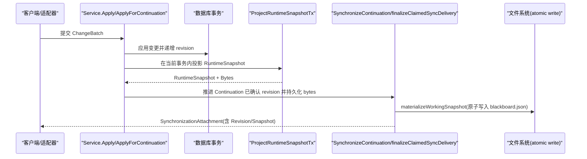
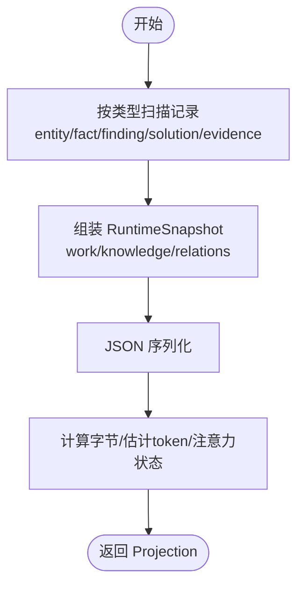
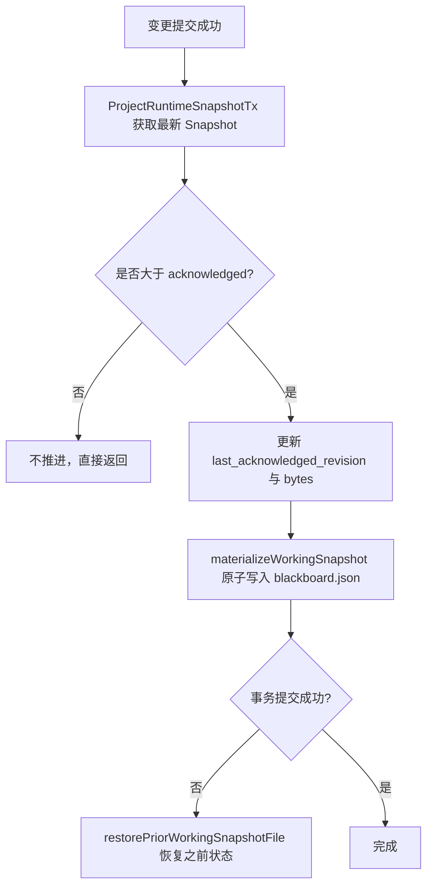
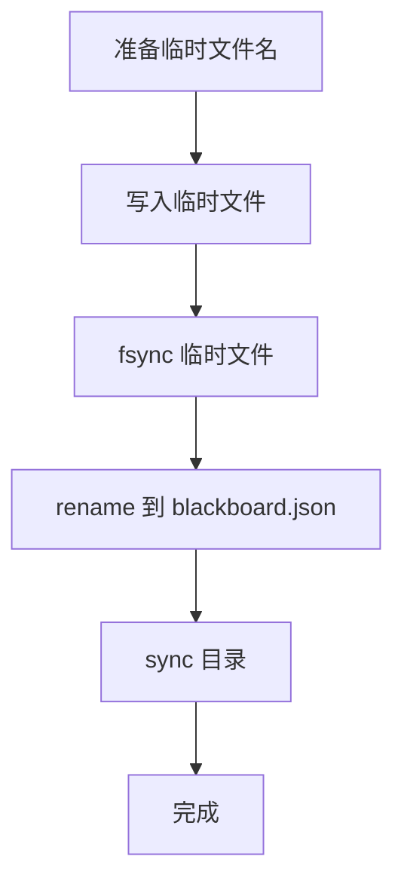
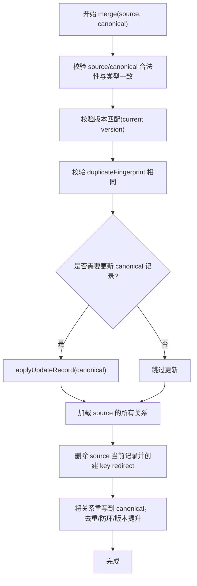
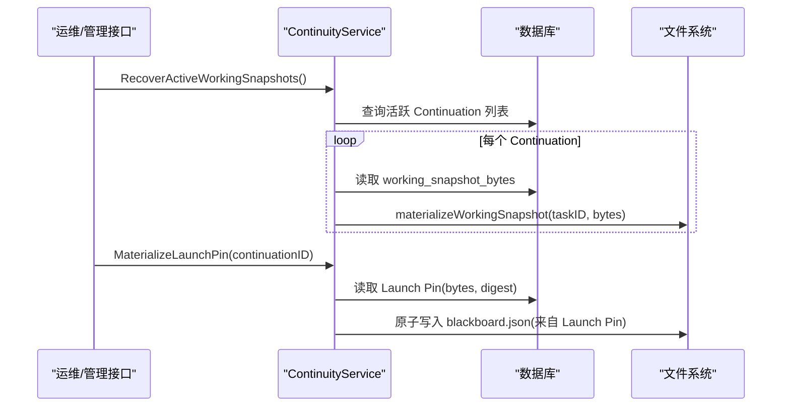
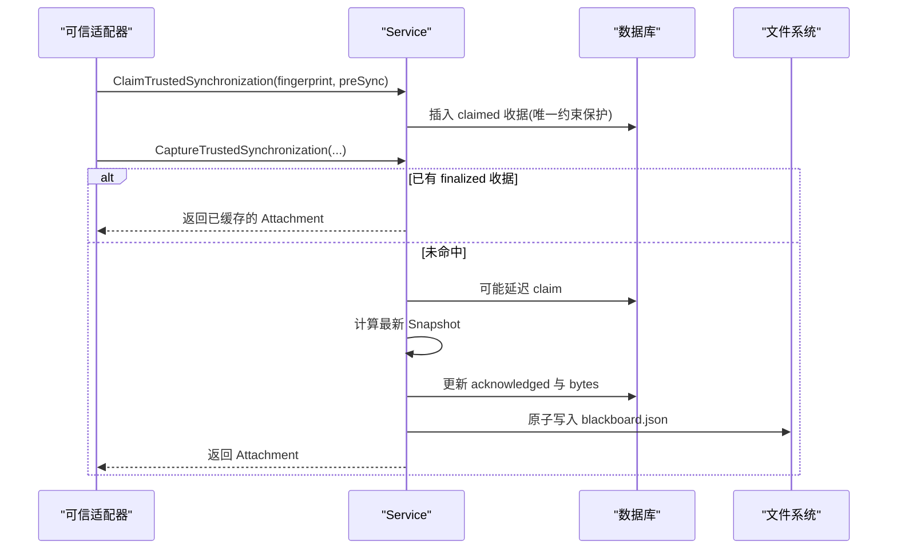
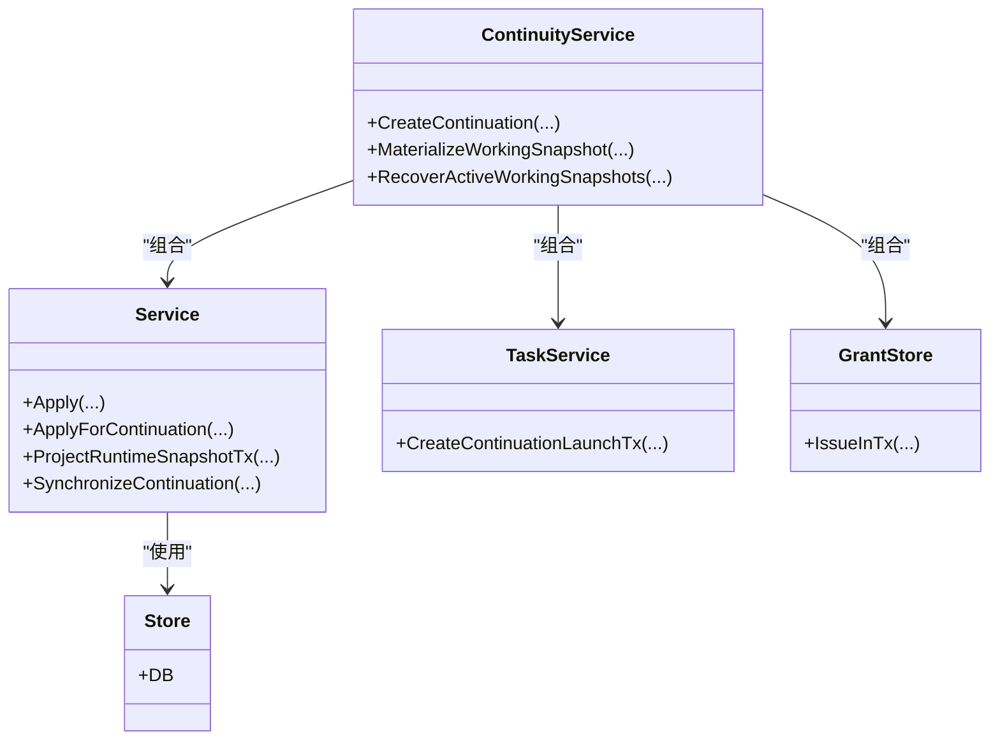

# 快照系统与投影合并

<cite>
**本文引用的文件**   
- [service.go](file://internal/blackboardv2/service.go)
- [continuity.go](file://internal/blackboardv2/continuity.go)
- [projection.go](file://internal/blackboardv2/projection.go)
- [merge.go](file://internal/blackboardv2/merge.go)
- [health.go](file://internal/blackboardv2/health.go)
- [finish.go](file://internal/blackboardv2/finish.go)
- [blackboard_v2.go](file://internal/pentestctl/blackboard_v2.go)
- [continuity_restore_test.go](file://internal/blackboardv2/continuity_restore_test.go)
</cite>

## 目录
1. [简介](#简介)
2. [项目结构](#项目结构)
3. [核心组件](#核心组件)
4. [架构总览](#架构总览)
5. [详细组件分析](#详细组件分析)
6. [依赖关系分析](#依赖关系分析)
7. [性能考量](#性能考量)
8. [故障排查指南](#故障排查指南)
9. [结论](#结论)
10. [附录](#附录)

## 简介
本文件围绕 Blackboard v2 的运行时快照系统，系统性阐述其设计原理与实现细节。重点覆盖：
- WorkingSnapshot、SnapshotWork、SnapshotKnowledge 的结构定义与语义
- 快照生成时机、增量更新策略与存储优化
- 投影（Projection）机制：将底层记录转换为运行时友好的紧凑格式
- 快照合并算法：冲突检测、版本选择与一致性保证
- 快照恢复流程、备份策略与性能监控指标
- 快照大小优化与传输效率提升的最佳实践

## 项目结构
Blackboard v2 的快照与投影相关能力集中在 internal/blackboardv2 包中，关键文件职责如下：
- service.go：定义 ChangeBatch/Change、RuntimeSnapshot、WorkingSnapshot、SnapshotWork/Knowledge 等核心 DTO；提供 RuntimeSnapshot 构建入口
- projection.go：ProjectRuntimeSnapshot 投影管线与注意力预算度量
- continuity.go：Continuation 生命周期、Working Snapshot 发布/同步/恢复、持久化与原子替换
- merge.go：merge 操作、冲突检测、关系重定向与版本选择
- health.go：健康检查、异常检测与证据完整性校验
- finish.go：Finish 流程中与 WorkingSnapshot 的交互
- pentestctl/blackboard_v2.go：CLI 侧对 WorkingSnapshot 的解码校验

图表来源
- [service.go:1388-1522](file://internal/blackboardv2/service.go#L1388-L1522)
- [projection.go:50-85](file://internal/blackboardv2/projection.go#L50-L85)
- [continuity.go:647-751](file://internal/blackboardv2/continuity.go#L647-L751)
- [continuity.go:1095-1147](file://internal/blackboardv2/continuity.go#L1095-L1147)
- [merge.go:91-238](file://internal/blackboardv2/merge.go#L91-L238)
- [health.go:190-289](file://internal/blackboardv2/health.go#L190-L289)
- [finish.go:56-61](file://internal/blackboardv2/finish.go#L56-L61)

章节来源
- [service.go:1-800](file://internal/blackboardv2/service.go#L1-L800)
- [projection.go:1-110](file://internal/blackboardv2/projection.go#L1-L110)
- [continuity.go:1-800](file://internal/blackboardv2/continuity.go#L1-L800)
- [merge.go:1-422](file://internal/blackboardv2/merge.go#L1-L422)
- [health.go:190-289](file://internal/blackboardv2/health.go#L190-L289)
- [finish.go:56-61](file://internal/blackboardv2/finish.go#L56-L61)
- [blackboard_v2.go:622-631](file://internal/pentestctl/blackboard_v2.go#L622-L631)

## 核心组件
本节聚焦快照系统的核心数据结构与职责边界。

- WorkingSnapshot：指向运行期工作快照的路径与版本号，供外部运行时读取
  - 字段：path、revision
  - 用途：作为 ChangeResult/FinishContinuationResult 的一部分返回给调用方，指示最新的工作快照位置与版本

- RuntimeSnapshot：运行时友好的“完整拓扑”视图，包含 work/knowledge/relations
  - Schema/Semantics/Revision：描述文档版本与语义说明
  - Work：开放工作项（Objectives/Attempts）
  - Knowledge：实体、事实、发现、解决方案、证据等当前知识
  - Relations：关系元组集合

- SnapshotWork：开放工作项分组
  - Objectives：目标（version/status/objective）
  - Attempts：尝试（version/status/summary）

- SnapshotKnowledge：当前知识分组
  - Entities/Facts/Findings/Solutions/Evidence：各自允许的最小字段集，便于快速消费

- AttentionBudgetState：注意力预算分类（within_target/above_target/warning/required），用于评估快照大小对模型上下文的影响

章节来源
- [service.go:415-481](file://internal/blackboardv2/service.go#L415-L481)
- [service.go:525-614](file://internal/blackboardv2/service.go#L525-L614)
- [projection.go:17-48](file://internal/blackboardv2/projection.go#L17-L48)

## 架构总览
下图展示了从语义变更到工作快照发布的端到端流程，以及投影与同步的关键环节。

图表来源
- [service.go:645-656](file://internal/blackboardv2/service.go#L645-L656)
- [service.go:1398-1522](file://internal/blackboardv2/service.go#L1398-L1522)
- [projection.go:60-85](file://internal/blackboardv2/projection.go#L60-L85)
- [continuity.go:647-751](file://internal/blackboardv2/continuity.go#L647-L751)
- [continuity.go:1095-1147](file://internal/blackboardv2/continuity.go#L1095-L1147)

## 详细组件分析

### 投影（Projection）机制
- 目标：将底层记录（entity/fact/finding/solution/evidence 等）转换为紧凑、稳定的运行时友好格式，避免历史与冗余字段进入工作快照
- 过程：
  - runtimeSnapshotTx：在事务内按类型扫描记录，组装为 RuntimeSnapshot
  - projectRuntimeSnapshot：序列化后计算字节数与估计 token 数，标注注意力预算状态
- 特点：
  - 只包含“当前”最小必要字段（allowlist），减少体积
  - 顺序稳定（key 排序），确保跨进程/重启可重复一致
  - 支持在事务内投影，保证与写路径一致的可见性

图表来源
- [service.go:1398-1522](file://internal/blackboardv2/service.go#L1398-L1522)
- [projection.go:70-85](file://internal/blackboardv2/projection.go#L70-L85)
- [projection.go:87-109](file://internal/blackboardv2/projection.go#L87-L109)

章节来源
- [service.go:1398-1522](file://internal/blackboardv2/service.go#L1398-L1522)
- [projection.go:50-85](file://internal/blackboardv2/projection.go#L50-L85)
- [projection.go:87-109](file://internal/blackboardv2/projection.go#L87-L109)

### 快照生成时机与增量更新策略
- 生成时机：
  - 每次 Apply/ApplyForContinuation 成功后，通过 ProjectRuntimeSnapshotTx 在当前事务内生成新的 RuntimeSnapshot
  - Finish 流程也会产出包含 WorkingSnapshot 的结果
- 增量更新策略：
  - 以 revision 为单调递增的全局版本
  - Continuation 维护 last_acknowledged_revision 与 working_snapshot_bytes
  - 当新 revision > acknowledged 时，才推进并持久化新的 working_snapshot_bytes
- 发布前-提交后回滚保障：
  - 先原子写入 blackboard.json，再提交事务；若提交失败，则恢复到之前的字节或移除文件，保证磁盘与数据库一致

图表来源
- [continuity.go:647-751](file://internal/blackboardv2/continuity.go#L647-L751)
- [continuity.go:1095-1147](file://internal/blackboardv2/continuity.go#L1095-L1147)
- [continuity.go:753-762](file://internal/blackboardv2/continuity.go#L753-L762)
- [finish.go:56-61](file://internal/blackboardv2/finish.go#L56-L61)

章节来源
- [continuity.go:647-751](file://internal/blackboardv2/continuity.go#L647-L751)
- [continuity.go:1095-1147](file://internal/blackboardv2/continuity.go#L1095-L1147)
- [continuity.go:753-762](file://internal/blackboardv2/continuity.go#L753-L762)
- [finish.go:56-61](file://internal/blackboardv2/finish.go#L56-L61)

### 存储优化与原子写入
- 原子写入：
  - 使用临时文件名 + rename 的方式原子替换 blackboard.json
  - 写入后 sync 目录，确保落盘
- 安全与隔离：
  - 限制 taskID 合法字符，防止路径穿越
  - 限定 .pentest 子目录，避免污染其他数据
- 恢复能力：
  - 在失败路径上精确恢复之前的字节或移除文件，保证幂等重试

图表来源
- [continuity.go:1095-1147](file://internal/blackboardv2/continuity.go#L1095-L1147)

章节来源
- [continuity.go:1095-1147](file://internal/blackboardv2/continuity.go#L1095-L1147)
- [continuity_restore_test.go:1-60](file://internal/blackboardv2/continuity_restore_test.go#L1-L60)

### 合并算法（Merge）：冲突检测、版本选择与一致性
- 适用对象：仅允许对“项目知识”类型（entity/fact/finding/solution/evidence）进行合并
- 前置校验：
  - source 与 canonical 必须不同且非重定向键
  - 两者类型必须一致
  - 版本必须匹配当前版本（乐观锁）
  - 必须存在经批准的本地相似候选指纹（duplicateFingerprint）
- 主流程：
  - 可选更新 canonical 记录（带 clear 字段）
  - 迁移所有涉及 source 的关系到 canonical，避免自环与冲突
  - 删除 source 当前记录，插入 key redirect（source -> canonical）
- 版本选择：
  - 关系重写版本取 max(原版本, 目标边最大版本)+1，避免覆盖
- 一致性保证：
  - 全部在事务内执行，失败回滚
  - 关系重排前做循环检测与冲突去重

图表来源
- [merge.go:91-238](file://internal/blackboardv2/merge.go#L91-L238)
- [merge.go:240-260](file://internal/blackboardv2/merge.go#L240-L260)
- [merge.go:345-421](file://internal/blackboardv2/merge.go#L345-L421)

章节来源
- [merge.go:91-238](file://internal/blackboardv2/merge.go#L91-L238)
- [merge.go:240-260](file://internal/blackboardv2/merge.go#L240-L260)
- [merge.go:345-421](file://internal/blackboardv2/merge.go#L345-L421)

### 快照恢复流程与备份策略
- 恢复流程：
  - RecoverActiveWorkingSnapshots：遍历活跃 Continuation，读取 working_snapshot_bytes 并重新 materialize
  - MaterializeLaunchPin：基于不可变 Launch Pin 的快照字节进行恢复（不覆盖已同步的工作快照）
  - 启动阶段也可通过 Precommit/BindGrant/UnbindGrant 钩子在事务前后进行投影与清理
- 备份策略：
  - 迁移工具提供 Verified Backup 能力，确保源库一致性
  - 工作快照本身通过原子写入与失败恢复保证强一致

图表来源
- [continuity.go:1005-1019](file://internal/blackboardv2/continuity.go#L1005-L1019)
- [continuity.go:962-976](file://internal/blackboardv2/continuity.go#L962-L976)
- [continuity.go:764-880](file://internal/blackboardv2/continuity.go#L764-L880)

章节来源
- [continuity.go:1005-1019](file://internal/blackboardv2/continuity.go#L1005-L1019)
- [continuity.go:962-976](file://internal/blackboardv2/continuity.go#L962-L976)
- [continuity.go:764-880](file://internal/blackboardv2/continuity.go#L764-L880)

### 同步与幂等投递（Trusted Synchronization）
- ClaimTrustedSynchronization：为有 idempotency fingerprint 的请求保留一次投递权，避免并发重复
- CaptureTrustedSynchronization：返回 SynchronizationAttachment（含 FromRevision/Revision/Snapshot），必要时重放已最终化的附件
- finalizeClaimedSyncDelivery：原子地推进 acknowledged、持久化 attachment 与 exact snapshot bytes，并在需要时重新发布到工作区

图表来源
- [continuity.go:221-325](file://internal/blackboardv2/continuity.go#L221-L325)
- [continuity.go:345-389](file://internal/blackboardv2/continuity.go#L345-L389)
- [continuity.go:435-611](file://internal/blackboardv2/continuity.go#L435-L611)

章节来源
- [continuity.go:221-325](file://internal/blackboardv2/continuity.go#L221-L325)
- [continuity.go:345-389](file://internal/blackboardv2/continuity.go#L345-L389)
- [continuity.go:435-611](file://internal/blackboardv2/continuity.go#L435-L611)

## 依赖关系分析
- Service 依赖 store.DB 进行读写；依赖 task.Service 与 grants 进行 Continuation 生命周期与授权绑定
- ContinuityService 组合 Service 与 task/grants，负责工作快照的发布、同步与恢复
- CLI（pentestctl）对 WorkingSnapshot 进行严格字段白名单校验，避免未知字段注入

图表来源
- [continuity.go:119-134](file://internal/blackboardv2/continuity.go#L119-L134)
- [service.go:41-70](file://internal/blackboardv2/service.go#L41-L70)

章节来源
- [continuity.go:119-134](file://internal/blackboardv2/continuity.go#L119-L134)
- [service.go:41-70](file://internal/blackboardv2/service.go#L41-L70)
- [blackboard_v2.go:622-631](file://internal/pentestctl/blackboard_v2.go#L622-L631)

## 性能考量
- 投影体积控制：
  - 使用注意力预算阈值（target/warning/required）评估快照大小，指导上层决策
  - 仅输出最小必要字段，避免历史与详情进入快照
- 写入路径优化：
  - 原子写入与 fsync 保证可靠性，同时减少多次拷贝
  - 仅在 revision 推进时更新 working_snapshot_bytes，避免无意义刷新
- 传输优化：
  - 使用 SynchronizationAttachment 的 from_revision 与 revision 差值，配合断点续传与幂等重放
  - 对于已 finalization 的 receipt，直接重放已缓存的 Attachment，降低重复计算

[本节为通用性能建议，不直接分析具体文件]

## 故障排查指南
- 常见错误码与场景：
  - authority_denied：Continuation 身份不匹配或未绑定
  - closed_continuation：Continuation 已关闭或已被替代
  - version_conflict：并发修改导致版本不一致
  - semantic_validation：字段长度/格式/语义校验失败
- 定位步骤：
  - 检查 LastAcknowledgedRevision 与当前 revision 的差异
  - 核对 working_snapshot_bytes 是否与磁盘 blackboard.json 一致
  - 查看同步收据（claimed/finalized）是否存在，避免重复投递
  - 验证 Launch Pin 的 schema/revision/digest 一致性
- 恢复手段：
  - 使用 RecoverActiveWorkingSnapshots 重建工作快照
  - 使用 MaterializeLaunchPin 强制从不可变快照恢复
  - 利用 restorePriorWorkingSnapshotFile 在失败路径上回滚磁盘状态

章节来源
- [continuity.go:157-205](file://internal/blackboardv2/continuity.go#L157-L205)
- [continuity.go:435-611](file://internal/blackboardv2/continuity.go#L435-L611)
- [continuity.go:962-976](file://internal/blackboardv2/continuity.go#L962-L976)
- [continuity.go:1005-1019](file://internal/blackboardv2/continuity.go#L1005-L1019)
- [continuity_restore_test.go:1-60](file://internal/blackboardv2/continuity_restore_test.go#L1-L60)

## 结论
Blackboard v2 的快照系统通过“紧凑投影 + 原子发布 + 幂等同步 + 严格合并”的组合，实现了高可靠、可扩展的运行时记忆平面。其设计兼顾了：
- 正确性：事务内投影、乐观锁与不可变 Launch Pin
- 一致性：发布前-提交后回滚与精确字节重放
- 可观测性：注意力预算与健康异常检测
- 可恢复性：活跃快照恢复与 Launch Pin 强制恢复

## 附录
- 最佳实践清单：
  - 控制文本长度与字段数量，避免超过注意力阈值
  - 使用 idempotency_key 与 request fingerprint 保障幂等
  - 优先使用 ProjectRuntimeSnapshotTx 在事务内投影，避免竞态
  - 合并前确保 duplicateFingerprint 已通过审批
  - 在 Finish 前确保所有 Attempt 均处于终态

[本节为总结性内容，不直接分析具体文件]