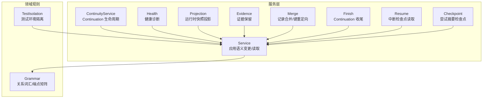
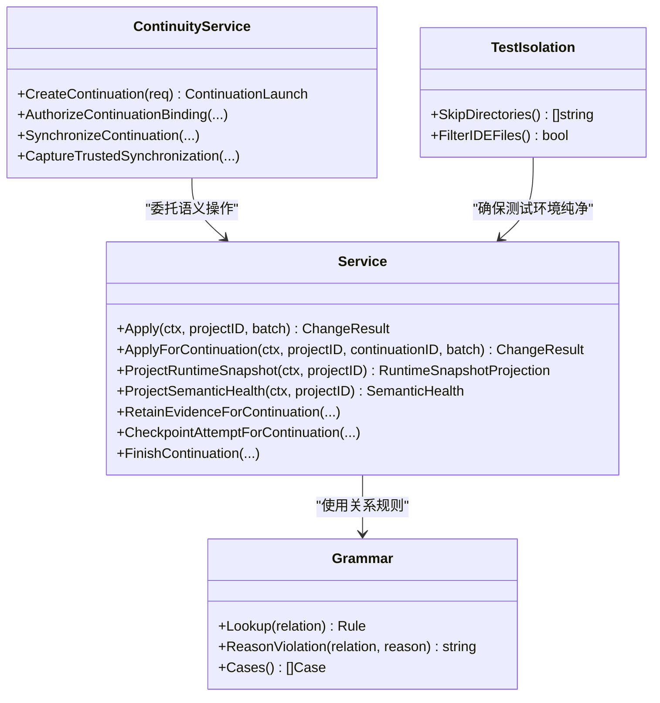
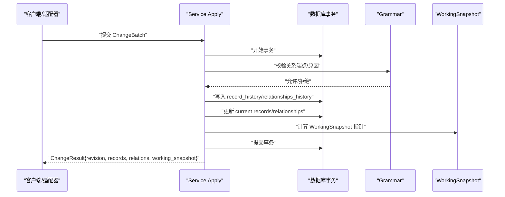
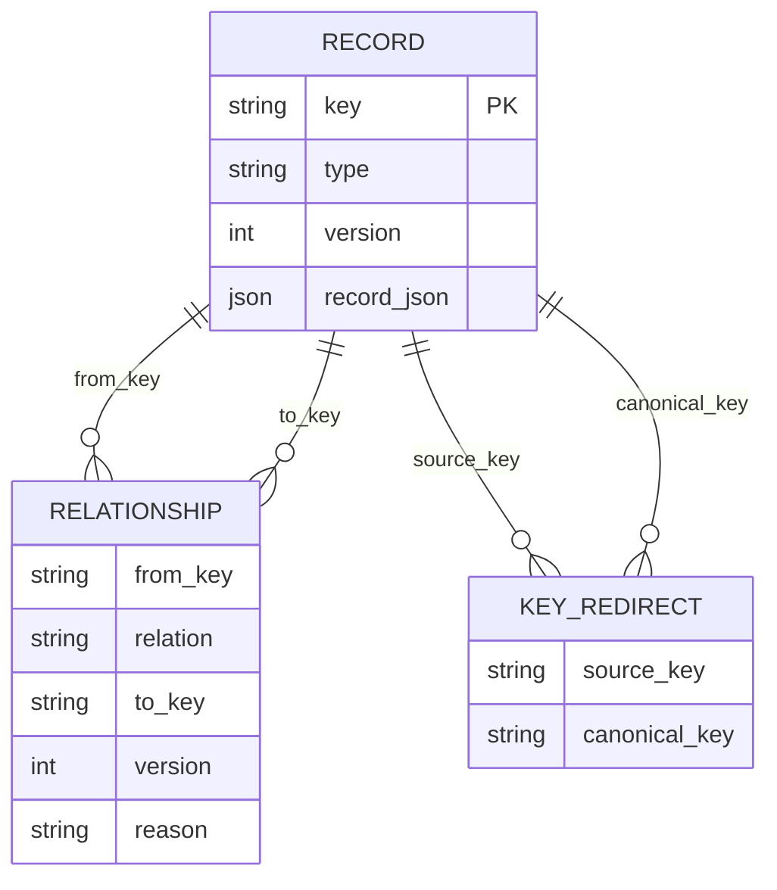
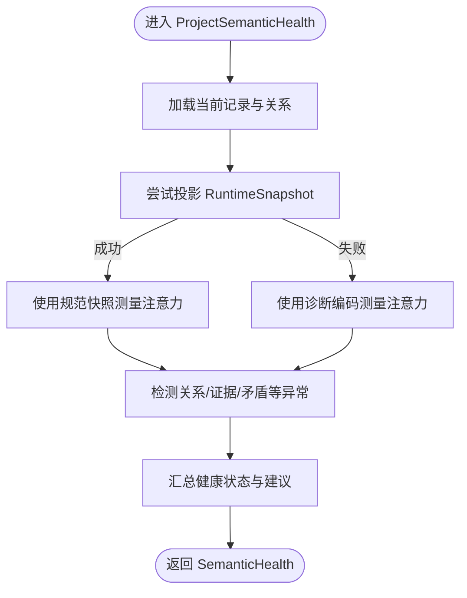
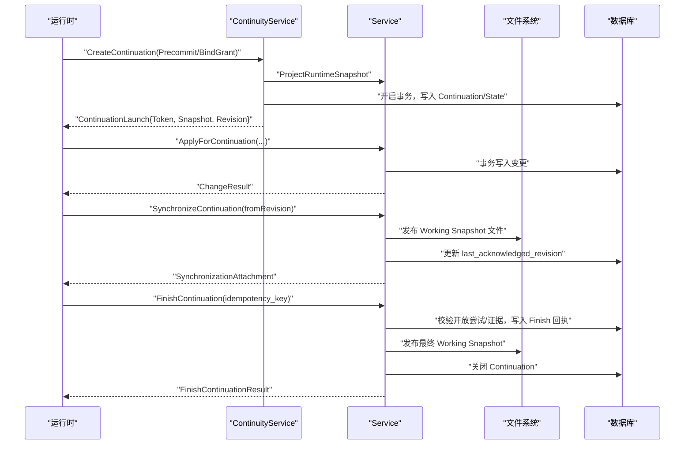
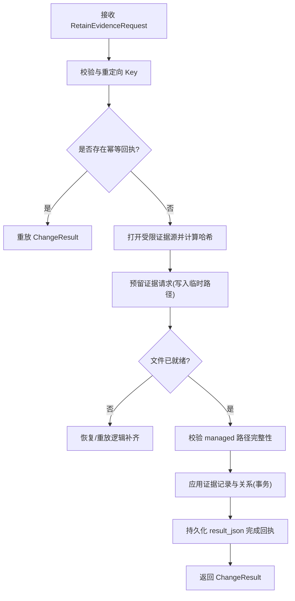
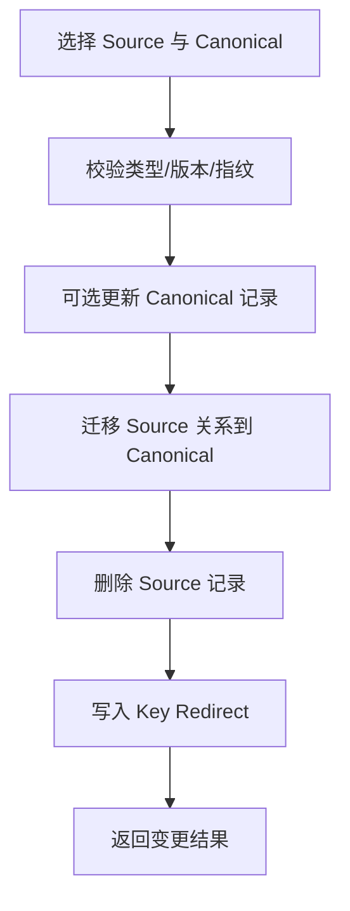
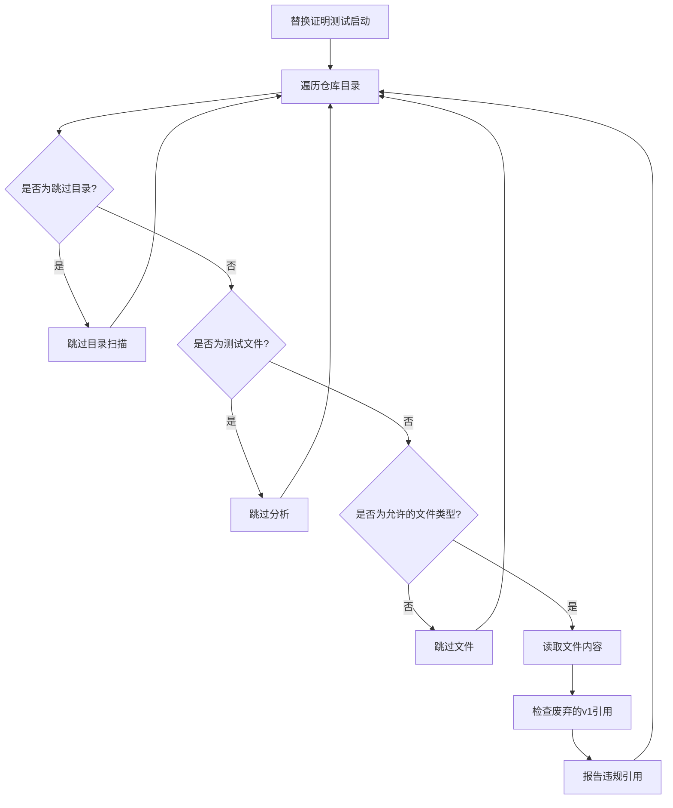
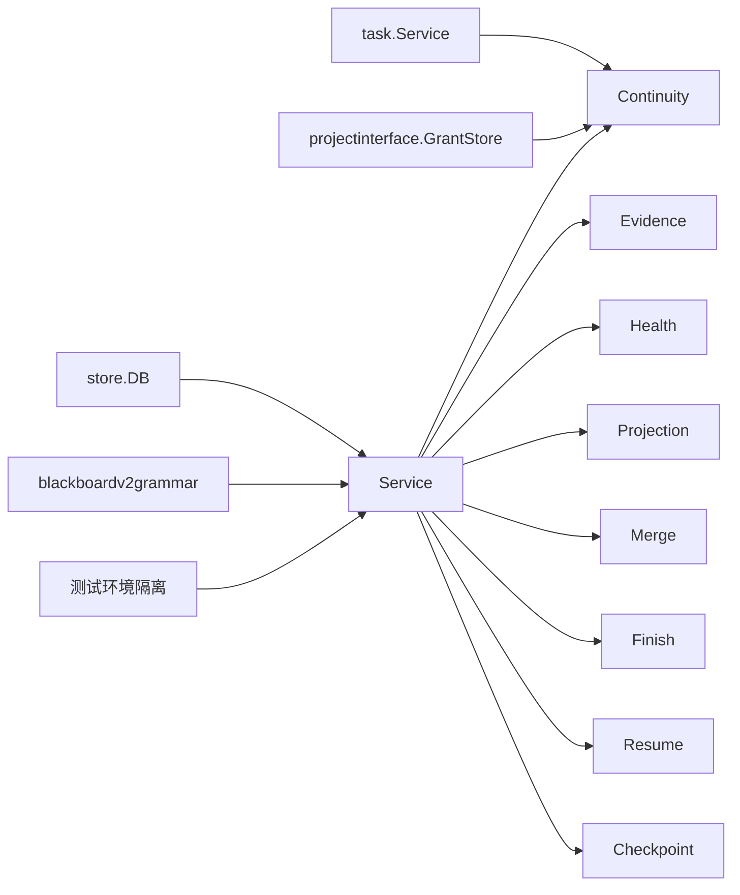

# 记忆平面 - Blackboard v2

<cite>
**本文引用的文件**   
- [service.go](file://internal/blackboardv2/service.go)
- [continuity.go](file://internal/blackboardv2/continuity.go)
- [projection.go](file://internal/blackboardv2/projection.go)
- [evidence.go](file://internal/blackboardv2/evidence.go)
- [health.go](file://internal/blackboardv2/health.go)
- [merge.go](file://internal/blackboardv2/merge.go)
- [checkpoint.go](file://internal/blackboardv2/checkpoint.go)
- [resume.go](file://internal/blackboardv2/resume.go)
- [finish.go](file://internal/blackboardv2/finish.go)
- [grammar.go](file://internal/blackboardv2grammar/grammar.go)
- [replacement_proof_test.go](file://internal/blackboardv2/replacement_proof_test.go)
</cite>

## 更新摘要
**所做更改**   
- 更新了测试环境隔离机制，添加了.qoder目录过滤以防止IDE特定文件干扰测试执行
- 增强了替换证明测试的可靠性，确保测试环境的纯净性
- 改进了测试扫描逻辑，排除开发工具生成的临时文件

## 目录
1. [引言](#引言)
2. [项目结构](#项目结构)
3. [核心组件](#核心组件)
4. [架构总览](#架构总览)
5. [详细组件分析](#详细组件分析)
6. [依赖关系分析](#依赖关系分析)
7. [性能考量](#性能考量)
8. [故障排查指南](#故障排查指南)
9. [结论](#结论)
10. [附录](#附录)

## 引言
本文件系统性阐述 Blackboard v2 语义化记忆平面的设计与实现，覆盖实体关系模型、版本控制、原子性变更批处理、快照恢复、Continuation 生命周期管理、健康诊断、投影合并与证据归档。文档同时给出数据一致性保证、并发控制与性能优化策略，并提供语义查询示例与扩展开发指南，帮助读者快速理解并安全扩展该子系统。

**更新** 增强了测试环境隔离机制，通过添加.qoder目录过滤确保测试执行的稳定性和可重复性。

## 项目结构
Blackboard v2 位于 internal/blackboardv2 包内，围绕 Service 提供统一的语义写入与读取能力；continuity 负责 Continuation 的创建、同步与终止；projection 提供运行时快照投影与注意力预算度量；evidence 负责受管证据文件的保留与完整性校验；health 提供只读健康诊断；merge 支持记录合并与键重定向；checkpoint/resume/finish 构成任务中断恢复与收尾流程；blackboardv2grammar 定义关系词汇与端点矩阵。

图表来源
- [service.go:40-70](file://internal/blackboardv2/service.go#L40-L70)
- [continuity.go:119-134](file://internal/blackboardv2/continuity.go#L119-L134)
- [health.go:84-183](file://internal/blackboardv2/health.go#L84-L183)
- [projection.go:50-85](file://internal/blackboardv2/projection.go#L50-L85)
- [evidence.go:194-360](file://internal/blackboardv2/evidence.go#L194-L360)
- [merge.go:91-238](file://internal/blackboardv2/merge.go#L91-L238)
- [finish.go:65-228](file://internal/blackboardv2/finish.go#L65-L228)
- [resume.go:21-81](file://internal/blackboardv2/resume.go#L21-L81)
- [checkpoint.go:71-98](file://internal/blackboardv2/checkpoint.go#L71-L98)
- [grammar.go:58-83](file://internal/blackboardv2grammar/grammar.go#L58-L83)
- [replacement_proof_test.go:42-44](file://internal/blackboardv2/replacement_proof_test.go#L42-L44)

章节来源
- [service.go:40-70](file://internal/blackboardv2/service.go#L40-L70)
- [continuity.go:119-134](file://internal/blackboardv2/continuity.go#L119-L134)
- [grammar.go:58-83](file://internal/blackboardv2grammar/grammar.go#L58-L83)

## 核心组件
- 语义变更与持久化：ChangeBatch/Change 作为不可变操作信封，统一封装 create/update/relate/unrelate/transition/supersede/merge 等语义操作；Apply 在事务中执行，返回 ChangeResult（包含 revision、变更记录、关系变更与 WorkingSnapshot 指针）。
- 运行时快照：RuntimeSnapshot 是面向运行时的紧凑视图，包含 Work（Objective/Attempt）与 Knowledge（Entity/Fact/Finding/Solution/Evidence），以及当前关系集合；ProjectRuntimeSnapshot 生成可序列化且带注意力预算度量的投影。
- 健康诊断：SemanticHealth 基于当前状态与快照字节进行只读诊断，输出异常与建议，不阻塞启动或修改知识。
- 证据归档：RetainEvidenceForContinuation 将受管文件原子落盘、校验完整性、建立证据记录与关系，支持幂等与离线恢复。
- 合并与键重定向：Record Merge 将源记录合并到规范记录，迁移关系并建立 Key Redirect，保持历史完整。
- Continuation 生命周期：Create/Authorize/Inspect/Synchronize/Capture/Finalize/Finish 形成可信运行时会话的端到端协议，确保工作快照与数据库一致。
- 检查点与恢复：CheckpointAttemptForContinuation 对 Attempt 摘要做版本化检查点；InterruptedAttemptCheckpoints 读取已终态 Continuation 的最终摘要用于恢复。
- **测试环境隔离**：通过目录过滤机制排除IDE特定文件和临时文件，确保测试环境的纯净性和可重复性。

章节来源
- [service.go:72-147](file://internal/blackboardv2/service.go#L72-L147)
- [service.go:414-481](file://internal/blackboardv2/service.go#L414-L481)
- [projection.go:50-85](file://internal/blackboardv2/projection.go#L50-L85)
- [health.go:84-183](file://internal/blackboardv2/health.go#L84-L183)
- [evidence.go:194-360](file://internal/blackboardv2/evidence.go#L194-L360)
- [merge.go:91-238](file://internal/blackboardv2/merge.go#L91-L238)
- [continuity.go:154-205](file://internal/blackboardv2/continuity.go#L154-L205)
- [checkpoint.go:71-98](file://internal/blackboardv2/checkpoint.go#L71-L98)
- [resume.go:21-81](file://internal/blackboardv2/resume.go#L21-L81)

## 架构总览
Blackboard v2 以 Service 为中心，对外暴露 Apply/Read/History/Snapshot/Health 等接口；ContinuityService 协调 Task 与 Project 边界，维护 Continuation 的令牌、工作快照与同步回执；Evidence 模块通过受限文件系统根与哈希校验保障证据完整性；Grammar 提供关系词汇与端点矩阵，贯穿写入验证与健康诊断。

图表来源
- [service.go:644-656](file://internal/blackboardv2/service.go#L644-L656)
- [continuity.go:764-800](file://internal/blackboardv2/continuity.go#L764-L800)
- [grammar.go:121-154](file://internal/blackboardv2grammar/grammar.go#L121-L154)
- [replacement_proof_test.go:42-44](file://internal/blackboardv2/replacement_proof_test.go#L42-L44)

## 详细组件分析

### 语义变更流水线与原子性
- 输入契约：ChangeBatch 强制 schema/idempotency_key/changes 三字段，拒绝未知字段；Change 按 op 分支解析为 create/update/relate/unrelate/transition/supersede/merge，严格白名单校验。
- 事务与版本：所有写路径在单事务内递增 revision，插入 record_history/relationship_history，更新 current records/relationships，最后返回 ChangeResult 包含变更后的 revision、受影响记录与关系版本元组。
- 幂等与冲突：idempotency_key 全局唯一约束，重复请求直接返回相同结果；version_conflict 保护并发更新；semantic_validation 统一错误码与路径定位。
- 关系语法：relate/unrelate 调用 grammar.Lookup 与 ReasonViolation 校验端点类型、自环、原因长度与冗余。

图表来源
- [service.go:72-147](file://internal/blackboardv2/service.go#L72-L147)
- [service.go:644-656](file://internal/blackboardv2/service.go#L644-L656)
- [grammar.go:121-154](file://internal/blackboardv2grammar/grammar.go#L121-L154)

章节来源
- [service.go:72-147](file://internal/blackboardv2/service.go#L72-L147)
- [service.go:644-656](file://internal/blackboardv2/service.go#L644-L656)
- [grammar.go:121-154](file://internal/blackboardv2grammar/grammar.go#L121-L154)

### 实体关系模型与版本控制
- 记录类型：entity/objective/attempt/fact/finding/solution/evidence，每种类型有对应 DTO 与 Patch 形状，禁止写入派生字段（如 severity/cvss_pending）。
- 版本控制：每条记录维护 version，update/transition/supersede 均要求显式 version；supersede 将旧记录归档并建立 supersedes 关系，新记录成为当前。
- 关系类型：about/part_of/tests/produced/evidences/supports/contradicts/derived_from/depends_on/satisfies/supersedes，由 grammar 定义端点矩阵与周期策略。

图表来源
- [service.go:234-396](file://internal/blackboardv2/service.go#L234-L396)
- [grammar.go:58-83](file://internal/blackboardv2grammar/grammar.go#L58-L83)
- [merge.go:230-238](file://internal/blackboardv2/merge.go#L230-L238)

章节来源
- [service.go:234-396](file://internal/blackboardv2/service.go#L234-L396)
- [grammar.go:58-83](file://internal/blackboardv2grammar/grammar.go#L58-L83)
- [merge.go:230-238](file://internal/blackboardv2/merge.go#L230-L238)

### 运行时快照与注意力预算
- 快照结构：RuntimeSnapshot 仅包含最小必要字段，Work 聚合 open Objective/Attempt，Knowledge 聚合当前 Entity/Fact/Finding/Solution/Evidence，Relations 为三元组（含可选 reason）。
- 注意力预算：MeasureRuntimeSnapshot 基于 UTF-8 字节估算 token 数，划分 within_target(≤16K)/above_target(>16K)/warning(≥32K)/required(≥64K)，Complete/Launchable 指示是否可启动。
- 健康诊断：当快照不可用时降级为"健康安全"的诊断编码，仍报告 attention 与 anomalies，但不阻断 launch。

图表来源
- [projection.go:50-85](file://internal/blackboardv2/projection.go#L50-L85)
- [health.go:84-183](file://internal/blackboardv2/health.go#L84-L183)

章节来源
- [projection.go:50-85](file://internal/blackboardv2/projection.go#L50-L85)
- [health.go:84-183](file://internal/blackboardv2/health.go#L84-L183)

### Continuation 生命周期管理
- 授权与绑定：AuthorizeContinuationBinding 校验 Project/Task/Continuation 绑定，返回 Live/Pending 状态与同步信息；InspectContinuationSynchronization 仅检查同步状态。
- 同步与回执：ClaimTrustedSynchronization 预留 pending notice；CaptureTrustedSynchronization 返回 SynchronizationAttachment（含 FromRevision/Revision/Snapshot），支持精确重试与断点续传。
- 发布与工作快照：SynchronizeContinuation 在事务外先发布 Working Snapshot 文件，再提交事务；失败时回滚磁盘状态，保证一致性。
- 收尾：FinishContinuation 要求无未完成 Evidence 与 open Attempts，持久化 Finish 回执，关闭 Continuation，并发布最终 Working Snapshot。

图表来源
- [continuity.go:764-800](file://internal/blackboardv2/continuity.go#L764-L800)
- [continuity.go:647-751](file://internal/blackboardv2/continuity.go#L647-L751)
- [finish.go:65-228](file://internal/blackboardv2/finish.go#L65-L228)

章节来源
- [continuity.go:154-205](file://internal/blackboardv2/continuity.go#L154-L205)
- [continuity.go:647-751](file://internal/blackboardv2/continuity.go#L647-L751)
- [finish.go:65-228](file://internal/blackboardv2/finish.go#L65-L228)

### 证据归档与完整性
- 请求校验：RetainEvidenceRequest 强校验 idempotency_key/key/version/attempt/source_path/artifact_type/summary/media_type/captured_at/links，拒绝未知字段。
- 安全访问：openRuntimeEvidenceSource 通过 os.Root 限制访问范围，拒绝符号链接与非普通文件，计算 SHA256 与 size。
- 幂等与恢复：reserveEvidenceRequest 阶段记录 tempPath/internalPath/publisherToken 等；ensureEvidencePublished 支持离线恢复与重放；applyRetainedEvidence 完成语义提交并持久化 result_json 以便重放。
- 健康联动：evidenceIntegrityAnomalies 检测 available 状态但缺失或校验失败的证据，结合目标结论严重性提升告警级别。

图表来源
- [evidence.go:194-360](file://internal/blackboardv2/evidence.go#L194-L360)
- [evidence.go:540-575](file://internal/blackboardv2/evidence.go#L540-L575)
- [evidence.go:788-800](file://internal/blackboardv2/evidence.go#L788-L800)

章节来源
- [evidence.go:194-360](file://internal/blackboardv2/evidence.go#L194-L360)
- [evidence.go:540-575](file://internal/blackboardv2/evidence.go#L540-L575)
- [evidence.go:788-800](file://internal/blackboardv2/evidence.go#L788-L800)

### 记录合并与键重定向
- 合并前提：source 与 canonical 必须同类型且非 redirect；duplicateFingerprint 基于规范化文本/定位器/值计算相似指纹，需人工批准。
- 合并过程：可选更新 canonical 记录（支持 Clear 清空字段），迁移 source 的关系至 canonical，删除 source 记录，写入 key_redirects，保留历史记录。
- 循环保护：validateMergedRelationshipCycle 针对 supports/derived_from/depends_on/part_of 等关系进行周期检测。

图表来源
- [merge.go:91-238](file://internal/blackboardv2/merge.go#L91-L238)
- [merge.go:310-335](file://internal/blackboardv2/merge.go#L310-L335)

章节来源
- [merge.go:91-238](file://internal/blackboardv2/merge.go#L91-L238)
- [merge.go:310-335](file://internal/blackboardv2/merge.go#L310-L335)

### 健康诊断与异常分类
- 异常来源：关系完整性（悬挂边/非法端点/周期）、注意力阈值、证据完整性、Key Redirect 完整性、未解决矛盾、孤立工作项等。
- 建议动作：当达到 warning/required 阈值时，提供 approval-required 的 Reason Task 合并建议，不自动截断或合并。
- 只读属性：健康诊断从不修改状态，也不阻塞启动。

章节来源
- [health.go:84-183](file://internal/blackboardv2/health.go#L84-L183)
- [health.go:335-391](file://internal/blackboardv2/health.go#L335-L391)
- [health.go:433-621](file://internal/blackboardv2/health.go#L433-L621)

### 检查点与恢复
- 检查点：CheckpointAttemptForContinuation 对 open Attempt 的 summary 做版本化更新，复用原子事务与 Working Snapshot。
- 恢复：InterruptedAttemptCheckpoints 仅在 Continuation 终态且 reconciliation=completed 时返回最多 MaxInterruptedAttemptCheckpoints 条最终摘要，供上层恢复。

章节来源
- [checkpoint.go:71-98](file://internal/blackboardv2/checkpoint.go#L71-L98)
- [resume.go:21-81](file://internal/blackboardv2/resume.go#L21-L81)

### 测试环境隔离与替换证明
**新增** 测试环境隔离机制确保替换证明测试的稳定性和可重复性，通过目录过滤排除IDE特定文件和临时文件。

- **目录过滤策略**：在替换证明测试中，明确跳过 `.git`、`.qoder`、`runs`、`web/node_modules`、`web/dist`、`internal/daemon/webfs/dist`、`docs` 等目录，防止IDE配置和构建产物干扰测试执行。
- **IDE文件防护**：特别添加 `.qoder` 目录过滤，防止Qoder IDE生成的配置文件和缓存文件影响测试结果的准确性。
- **测试扫描增强**：改进文件扫描逻辑，确保只分析生产代码和相关测试文件，排除开发工具和临时文件。
- **环境纯净性保证**：通过严格的目录过滤，确保测试在不同开发环境和CI环境中具有一致的行为。

图表来源
- [replacement_proof_test.go:32-81](file://internal/blackboardv2/replacement_proof_test.go#L32-L81)
- [replacement_proof_test.go:42-44](file://internal/blackboardv2/replacement_proof_test.go#L42-L44)

章节来源
- [replacement_proof_test.go:32-81](file://internal/blackboardv2/replacement_proof_test.go#L32-L81)
- [replacement_proof_test.go:42-44](file://internal/blackboardv2/replacement_proof_test.go#L42-L44)

## 依赖关系分析
- 内部依赖：Service 依赖 store.DB 与 blackboardv2grammar；ContinuityService 依赖 Service、task.Service 与 grantStore；Evidence 依赖受限文件系统根与配置。
- 外部集成：HTTP/MCP/CLI/Runner 通过 Service 接口访问语义状态；Web UI 通过 API 消费 Health/Snapshot/History。
- 耦合与内聚：Service 高内聚于语义操作；Continuity 聚焦会话与同步；Evidence 专注受管文件；Grammar 提供只读规则，降低耦合。

图表来源
- [service.go:40-70](file://internal/blackboardv2/service.go#L40-L70)
- [continuity.go:119-134](file://internal/blackboardv2/continuity.go#L119-L134)
- [grammar.go:121-154](file://internal/blackboardv2grammar/grammar.go#L121-L154)
- [replacement_proof_test.go:42-44](file://internal/blackboardv2/replacement_proof_test.go#L42-L44)

章节来源
- [service.go:40-70](file://internal/blackboardv2/service.go#L40-L70)
- [continuity.go:119-134](file://internal/blackboardv2/continuity.go#L119-L134)

## 性能考量
- 快照大小与注意力预算：MeasureRuntimeSnapshot 以 UTF-8 字节估算 token，超过 16K 提示关注，32K 警告，64K 要求合并；建议在达到阈值前发起 Reason Task 进行合并。
- 批量写入：ChangeBatch 支持多变更原子提交，减少往返与锁竞争；避免在单批次中包含超大文本字段导致整体超限。
- 证据 I/O：RetainEvidenceForContinuation 采用预分配临时路径与幂等回执，避免重复拷贝；尽量在沙箱内就近产出证据以减少跨卷移动。
- 健康诊断：ProjectSemanticHealth 优先使用规范快照，否则退化为诊断编码；避免频繁全量扫描大快照。
- **测试性能优化**：通过目录过滤减少不必要的文件扫描，提高替换证明测试的执行效率。

[本节为通用指导，无需源码引用]

## 故障排查指南
- 常见错误码与含义：
  - authority_denied：Continuation 未绑定或未拥有当前 Project/Task。
  - closed_continuation：Continuation 已关闭或被替换，不再具备写权限。
  - semantic_validation：字段/关系/原因/长度等违反语义规则。
  - version_conflict：并发更新导致版本不一致。
  - evidence_integrity_failed：证据文件缺失或哈希校验失败。
  - finish_conflict：Finish 幂等键被其他来源占用。
- 定位方法：
  - 查看 ChangeResult.Error.Path 定位具体 changes[index].field。
  - 使用 ReadHistory 对比变更前后记录与关系。
  - 使用 ProjectSemanticHealth 获取异常与建议。
  - 使用 InterruptedAttemptCheckpoints 确认中断前的最终摘要。
- **测试环境问题**：如果替换证明测试失败，检查是否有IDE配置文件（如.qoder目录）未被正确过滤，确保测试环境的纯净性。

章节来源
- [service.go:616-630](file://internal/blackboardv2/service.go#L616-L630)
- [health.go:84-183](file://internal/blackboardv2/health.go#L84-L183)
- [resume.go:21-81](file://internal/blackboardv2/resume.go#L21-L81)
- [replacement_proof_test.go:42-44](file://internal/blackboardv2/replacement_proof_test.go#L42-L44)

## 结论
Blackboard v2 以强契约的语义变更、严格的版本控制与关系语法、可靠的 Continuation 同步与收尾、完备的证据归档与健康诊断，构建了稳定可扩展的记忆平面。通过注意力预算与合并机制，系统在大上下文场景下仍能保持可观测性与可控性。**新增的测试环境隔离机制进一步确保了测试的稳定性和可重复性**。遵循本文档的设计与最佳实践，可在保证一致性的前提下高效扩展新的记录类型与关系。

[本节为总结，无需源码引用]

## 附录

### 语义查询示例
- 读取当前记录详情：
  - 调用 ReadCurrent(projectID, key) 获取 CurrentDetail，包含 Record 与 Relationships。
- 读取历史分页：
  - 调用 ReadHistory(projectID, key, HistoryOptions{Cursor, Limit}) 获取 SemanticHistory。
- 读取运行时快照：
  - 调用 RuntimeSnapshot(projectID) 获取 RuntimeSnapshot；或使用 ProjectRuntimeSnapshot 获取带注意力预算的投影。
- 健康诊断：
  - 调用 ProjectSemanticHealth(projectID) 获取 SemanticHealth，包括 Attention/Anomalies/Proposals。

章节来源
- [service.go:483-510](file://internal/blackboardv2/service.go#L483-L510)
- [projection.go:50-85](file://internal/blackboardv2/projection.go#L50-L85)
- [health.go:84-183](file://internal/blackboardv2/health.go#L84-L183)

### 扩展开发指南
- 新增记录类型：
  - 在 service.go 中定义 Record 子集与对应 DTO/Patch，并在 Record.MarshalJSON 中增加判别分支。
  - 在 grammar.go 中扩展关系端点矩阵与原因策略。
  - 在 health.go 中补充快照构建与异常检测逻辑。
- 新增关系类型：
  - 在 grammar.go 中添加 Rule，定义端点允许集、原因策略与周期策略。
  - 在 merge.go 中完善 validateMergedRelationshipCycle 的周期检测。
- 自定义证据类型：
  - 在 evidence.go 中扩展 RetainEvidenceRequest 校验与 openRuntimeEvidenceSource 的路径映射。
  - 在 health.go 中补充证据完整性检查与告警等级。
- 扩展 Continuation 钩子：
  - 在 continuity.go 的 CreateContinuation 中使用 Precommit/BindGrant/UnbindGrant 注入额外投影或凭据绑定。
- **测试环境配置**：
  - 在替换证明测试中，确保新的IDE目录被添加到跳过列表，防止干扰测试执行。
  - 定期审查测试环境隔离策略，适应新的开发工具和IDE需求。

章节来源
- [service.go:234-396](file://internal/blackboardv2/service.go#L234-L396)
- [grammar.go:58-83](file://internal/blackboardv2grammar/grammar.go#L58-L83)
- [health.go:190-289](file://internal/blackboardv2/health.go#L190-L289)
- [evidence.go:194-360](file://internal/blackboardv2/evidence.go#L194-L360)
- [continuity.go:764-800](file://internal/blackboardv2/continuity.go#L764-L800)
- [replacement_proof_test.go:42-44](file://internal/blackboardv2/replacement_proof_test.go#L42-L44)