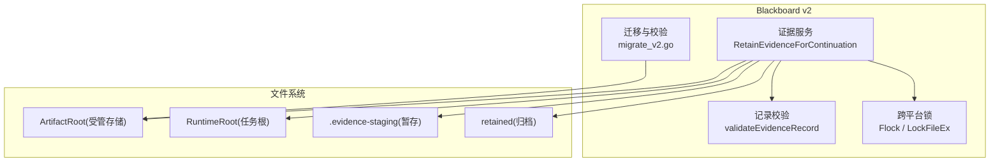
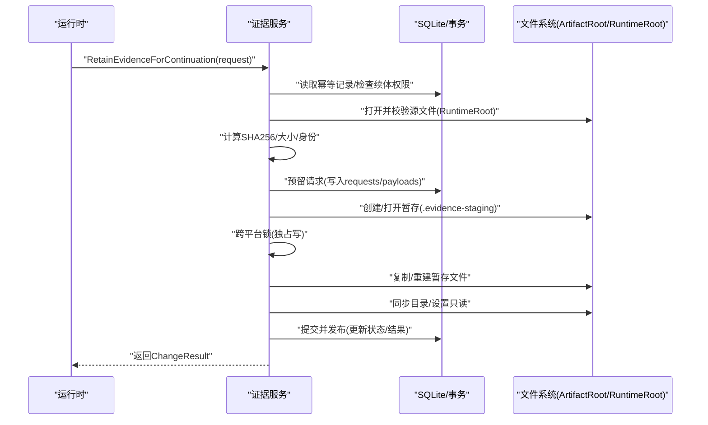
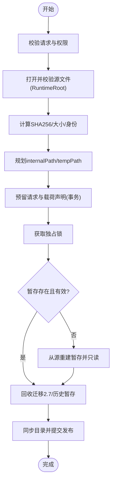
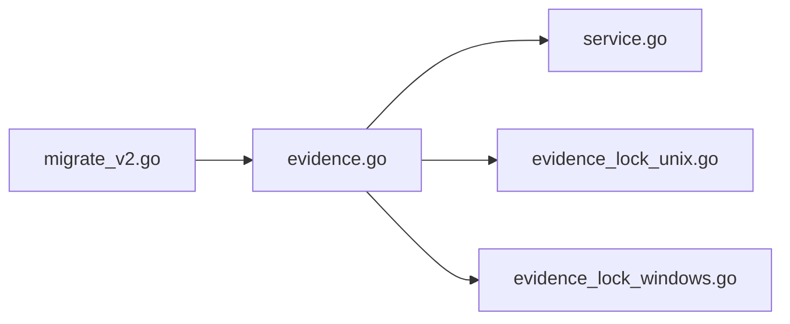

# 证据管理与归档

<cite>
**本文引用的文件**   
- [internal/blackboardv2/evidence.go](file://internal/blackboardv2/evidence.go)
- [internal/blackboardv2/service.go](file://internal/blackboardv2/service.go)
- [internal/blackboardv2/evidence_lock_unix.go](file://internal/blackboardv2/evidence_lock_unix.go)
- [internal/blackboardv2/evidence_lock_windows.go](file://internal/blackboardv2/evidence_lock_windows.go)
- [internal/blackboardmigration/migrate_v2.go](file://internal/blackboardmigration/migrate_v2.go)
- [internal/blackboardv2contract/contractdata/schemas/blackboard-v2.schema.json](file://internal/blackboardv2contract/contractdata/schemas/blackboard-v2.schema.json)
- [docs/specs/blackboard-graph-contract.md](file://docs/specs/blackboard-graph-contract.md)
- [internal/blackboardv2/evidence_service_test.go](file://internal/blackboardv2/evidence_service_test.go)
</cite>

## 目录
1. [简介](#简介)
2. [项目结构](#项目结构)
3. [核心组件](#核心组件)
4. [架构总览](#架构总览)
5. [详细组件分析](#详细组件分析)
6. [依赖关系分析](#依赖关系分析)
7. [性能与容量规划](#性能与容量规划)
8. [故障排查指南](#故障排查指南)
9. [结论](#结论)
10. [附录](#附录)

## 简介
本文件聚焦于证据管理系统，围绕 EvidenceRecord 的数据模型、ManagedPath 路径规划、SHA256 完整性校验、文件大小限制、跨平台文件锁定、证据捕获流程（从临时文件到永久归档）、证据检索 API、批量操作与清理策略、存储配置与磁盘空间管理、以及证据链完整性验证与安全访问控制的最佳实践进行系统化说明。目标是帮助读者快速理解并正确运维该子系统。

## 项目结构
证据管理位于 Blackboard v2 语义系统内，主要实现集中在 blackboardv2 包中，涉及：
- 证据请求与持久化：RetainEvidenceRequest、evidenceRequestRow、数据库表 blackboard_v2_evidence_requests 与 blackboard_v2_evidence_payloads
- 文件落盘与迁移：暂存区 .evidence-staging、目标目录 retained、历史兼容迁移路径
- 安全与一致性：openSecureRegularFile、openExistingSecureDirectory、相对根校验、符号链接拒绝、幂等与并发保护
- 跨平台锁：Unix Flock 与 Windows LockFileEx
- 迁移与校验：迁移 2.7 兼容路径、迁移期数据校验

图表来源
- [internal/blackboardv2/evidence.go:194-360](file://internal/blackboardv2/evidence.go#L194-L360)
- [internal/blackboardv2/service.go:4572-4602](file://internal/blackboardv2/service.go#L4572-L4602)
- [internal/blackboardv2/evidence_lock_unix.go:12-25](file://internal/blackboardv2/evidence_lock_unix.go#L12-L25)
- [internal/blackboardv2/evidence_lock_windows.go:13-40](file://internal/blackboardv2/evidence_lock_windows.go#L13-L40)
- [internal/blackboardmigration/migrate_v2.go:564-601](file://internal/blackboardmigration/migrate_v2.go#L564-L601)

章节来源
- [internal/blackboardv2/evidence.go:194-360](file://internal/blackboardv2/evidence.go#L194-L360)
- [internal/blackboardv2/service.go:4572-4602](file://internal/blackboardv2/service.go#L4572-L4602)

## 核心组件
- EvidenceConfig：提供 ArtifactRoot 与 RuntimeRoot，用于受管存储与工作区隔离
- RetainEvidenceRequest：运行时提交的证据保留请求，包含幂等键、源路径、类型、摘要、媒体类型、捕获时间、关联关系等
- evidenceRequestRow：请求行元数据，含哈希、源标识、大小、内部路径、暂存路径、发布令牌、状态、结果等
- 路径规划器：plannedEvidenceInternalPath、plannedEvidenceTempPath、migration27EvidenceTempPath、filesystemSafeEvidencePath、semanticEvidencePath
- 安全打开器：openSecureRegularFile、openExistingSecureDirectory、relativeWithinRoot
- 完整性校验：verifyManagedEvidencePayload、verifyJournaledEvidenceTemp、evidenceIntegrityValid
- 发布与恢复：ensureEvidencePublished、recoverMigration27EvidenceTemp、recoverPreviousEvidenceTemp、sweepLegacyEvidenceTemps
- 清理与GC：reclaimOrCleanupEvidencePayload、finalizeEvidencePayloadGC、removeClaimedEvidencePayload
- 跨平台锁：lockEvidencePublisherFile、unlockAndCloseEvidencePublisher（Unix Flock / Windows LockFileEx）

章节来源
- [internal/blackboardv2/evidence.go:24-59](file://internal/blackboardv2/evidence.go#L24-L59)
- [internal/blackboardv2/evidence.go:77-161](file://internal/blackboardv2/evidence.go#L77-L161)
- [internal/blackboardv2/evidence.go:173-192](file://internal/blackboardv2/evidence.go#L173-L192)
- [internal/blackboardv2/evidence.go:705-773](file://internal/blackboardv2/evidence.go#L705-L773)
- [internal/blackboardv2/evidence.go:577-647](file://internal/blackboardv2/evidence.go#L577-L647)
- [internal/blackboardv2/evidence.go:864-914](file://internal/blackboardv2/evidence.go#L864-L914)
- [internal/blackboardv2/evidence.go:1264-1400](file://internal/blackboardv2/evidence.go#L1264-L1400)
- [internal/blackboardv2/evidence.go:1649-1678](file://internal/blackboardv2/evidence.go#L1649-L1678)
- [internal/blackboardv2/evidence.go:2088-2174](file://internal/blackboardv2/evidence.go#L2088-L2174)
- [internal/blackboardv2/evidence_lock_unix.go:12-25](file://internal/blackboardv2/evidence_lock_unix.go#L12-L25)
- [internal/blackboardv2/evidence_lock_windows.go:13-40](file://internal/blackboardv2/evidence_lock_windows.go#L13-L40)

## 架构总览
证据保留主流程（简化序列图）：

图表来源
- [internal/blackboardv2/evidence.go:194-360](file://internal/blackboardv2/evidence.go#L194-L360)
- [internal/blackboardv2/evidence.go:788-848](file://internal/blackboardv2/evidence.go#L788-L848)
- [internal/blackboardv2/evidence.go:1264-1400](file://internal/blackboardv2/evidence.go#L1264-L1400)
- [internal/blackboardv2/evidence_lock_unix.go:12-25](file://internal/blackboardv2/evidence_lock_unix.go#L12-L25)
- [internal/blackboardv2/evidence_lock_windows.go:13-40](file://internal/blackboardv2/evidence_lock_windows.go#L13-L40)

## 详细组件分析

### EvidenceRecord 数据结构与约束
- 字段要求：status、artifact_type、summary、managed_path、sha256、size 为必填；media_type、source_path、captured_at 可选
- 值域与格式：
  - status：available 或 missing（当前写入时），superseded 仅出现在历史视图
  - artifact_type：受限枚举集合（如 http_exchange、screenshot、terminal_capture、log、pcap、file、binary、source_code、structured_data、report、other）
  - sha256：小写十六进制，长度固定 64
  - size：非负整数
  - captured_at：RFC3339 时间戳
- 文本长度限制：conciseText ≤ 512 字节，semanticText ≤ 1024 字节
- 校验入口：validateEvidenceRecord 对以上规则进行强校验

章节来源
- [internal/blackboardv2contract/contractdata/schemas/blackboard-v2.schema.json:426-473](file://internal/blackboardv2contract/contractdata/schemas/blackboard-v2.schema.json#L426-L473)
- [docs/specs/blackboard-graph-contract.md:342-360](file://docs/specs/blackboard-graph-contract.md#L342-L360)
- [internal/blackboardv2/service.go:4572-4602](file://internal/blackboardv2/service.go#L4572-L4602)
- [internal/blackboardv2/service.go:4604-4616](file://internal/blackboardv2/service.go#L4604-L4616)

### ManagedPath 路径规划与安全性
- 目标路径规划：projects/<project_digest>/retained/<sha256>/<filename>
- 暂存路径规划：<project_root>/.evidence-staging/<scope_hash>/<request_hash>
- 迁移兼容路径：.evidence-staging/<continuation_id_hex>/<key_hex>/<request_hash>
- 安全校验：
  - 禁止绝对路径、禁止 .. 越界、禁止符号链接
  - 组件名长度限制（≤255）
  - 语义路径与受管路径必须一致（semanticEvidencePath）
- 路径生成函数：plannedEvidenceInternalPath、plannedEvidenceTempPath、migration27EvidenceTempPath、filesystemSafeEvidencePath、semanticEvidencePath

章节来源
- [internal/blackboardv2/evidence.go:705-773](file://internal/blackboardv2/evidence.go#L705-L773)
- [internal/blackboardv2/evidence.go:751-762](file://internal/blackboardv2/evidence.go#L751-L762)

### SHA256 完整性校验与文件大小限制
- 源文件校验：openRuntimeEvidenceSource 在打开后即时计算 SHA256 与大小，并回绕指针
- 受管载荷校验：verifyManagedEvidencePayload 通过 openSecureRegularFile 打开并逐块计算哈希，比较大小与摘要
- 暂存校验：verifyJournaledEvidenceTemp 对暂存文件执行相同校验
- 失败语义：当校验失败返回“证据完整性失败”的语义错误码
- 文件大小限制：代码未实现全局上限拦截；建议结合部署侧配额与监控进行限制

章节来源
- [internal/blackboardv2/evidence.go:540-575](file://internal/blackboardv2/evidence.go#L540-L575)
- [internal/blackboardv2/evidence.go:864-914](file://internal/blackboardv2/evidence.go#L864-L914)
- [internal/blackboardv2/evidence.go:1102-1123](file://internal/blackboardv2/evidence.go#L1102-L1123)

### 跨平台文件锁定机制
- Unix：使用 syscall.Flock(LOCK_EX|LOCK_NB)，冲突返回“证据发布进行中”的可重试错误
- Windows：使用 windows.LockFileEx(独占、立即失败)，冲突返回相同语义错误
- 解锁与关闭：unlockAndCloseEvidencePublisher 统一释放锁并关闭句柄

章节来源
- [internal/blackboardv2/evidence_lock_unix.go:12-25](file://internal/blackboardv2/evidence_lock_unix.go#L12-L25)
- [internal/blackboardv2/evidence_lock_windows.go:13-40](file://internal/blackboardv2/evidence_lock_windows.go#L13-L40)

### 证据捕获流程：从临时文件到永久归档
- 幂等与重入：
  - 基于 idempotency_key + request_hash 去重，重复请求直接回放结果
  - 支持离线恢复：根据暂存、迁移2.7路径、历史遗留候选进行自愈
- 关键步骤：
  1) 解析与校验请求、校验 Attempt 与 Key 版本
  2) 打开并校验源文件（RuntimeRoot 下 workdir/artifacts）
  3) 计算 SHA256/大小/身份，规划 internalPath 与 tempPath
  4) 预留请求与载荷声明（事务）
  5) 获取独占锁，确保单发布者
  6) 若暂存不存在或不完整，从源重建并写入只读
  7) 尝试回收迁移2.7/上一版/历史遗留暂存
  8) 同步目录、提交并发布，更新状态与结果
- 失败点注入：通过 EvidenceFailurePoint 在多个边界注入失败以验证恢复

图表来源
- [internal/blackboardv2/evidence.go:194-360](file://internal/blackboardv2/evidence.go#L194-L360)
- [internal/blackboardv2/evidence.go:788-848](file://internal/blackboardv2/evidence.go#L788-L848)
- [internal/blackboardv2/evidence.go:1264-1400](file://internal/blackboardv2/evidence.go#L1264-L1400)

章节来源
- [internal/blackboardv2/evidence.go:194-360](file://internal/blackboardv2/evidence.go#L194-L360)
- [internal/blackboardv2/evidence.go:1264-1400](file://internal/blackboardv2/evidence.go#L1264-L1400)

### 证据检索 API、批量操作与清理策略
- 检索：
  - 当前证据读取：ReadCurrent 返回 EvidenceRecord，其中 managed_path 指向 artifacts/retained/<sha256>/<name>
  - 历史证据读取：historicalEvidenceRecord 支持 superseded 状态
- 批量：
  - 迁移期批量校验：validateEvidenceManagedPathsTx 遍历所有证据记录，校验 managed_path 不越界、文件存在且可计算 SHA256
- 清理与 GC：
  - 决策逻辑：若语义引用计数为 0 且无其他请求共享，则进入 GC；否则转移所有权给下一个请求者
  - GC 阶段：标记 state='gc'，删除文件，最终清理请求记录
  - 迁移兼容：迁移2.7路径与历史遗留暂存会被扫描与回收

章节来源
- [internal/blackboardv2contract/contractdata/schemas/blackboard-v2.schema.json:786-834](file://internal/blackboardv2contract/contractdata/schemas/blackboard-v2.schema.json#L786-L834)
- [internal/blackboardmigration/migrate_v2.go:564-601](file://internal/blackboardmigration/migrate_v2.go#L564-L601)
- [internal/blackboardv2/evidence.go:2088-2174](file://internal/blackboardv2/evidence.go#L2088-L2174)

### 证据链完整性验证
- 事实基础校验：factHasDurableBasis 要求 confirmed 的事实至少有一个有效的证据支撑（证据完整性校验通过）或来自成功的 producing Attempt
- 依赖收集：collectEvidenceDependentConfirmedFacts 与 collectSupportingFactDependentConfirmedFacts 用于评估变更影响面
- 变更前置校验：validateDependentConfirmedFactBases 阻止破坏已确认事实的证据链

章节来源
- [internal/blackboardv2/evidence.go:916-1100](file://internal/blackboardv2/evidence.go#L916-L1100)

### 安全访问控制与最佳实践
- 源路径白名单：仅允许 /task/workdir 与 /task/artifacts 下的相对路径，拒绝绝对路径与 .. 越界
- 目录与文件安全：openExistingSecureDirectory 与 openSecureRegularFile 拒绝符号链接与非普通文件，并在打开期间检测替换
- 幂等与并发：idempotency_key + request_hash 防重放；独占锁防止并发覆盖
- 最小权限：暂存文件设置为只读（0o400），减少误改风险
- 审计与追踪：result_json 保存每次发布的语义结果，便于回放与审计

章节来源
- [internal/blackboardv2/evidence.go:649-688](file://internal/blackboardv2/evidence.go#L649-L688)
- [internal/blackboardv2/evidence.go:577-647](file://internal/blackboardv2/evidence.go#L577-L647)
- [internal/blackboardv2/evidence.go:1391-1396](file://internal/blackboardv2/evidence.go#L1391-L1396)

## 依赖关系分析
- 模块耦合：
  - evidence.go 依赖 service.go 中的通用校验与转换工具
  - 跨平台锁通过 build tag 选择不同实现
  - 迁移模块 migrate_v2.go 依赖证据记录结构与路径规划
- 外部依赖：
  - 文件系统：os.Root、syscall/windows 原生接口
  - 数据库：SQLite 事务与查询
- 潜在循环：无直接循环依赖；证据服务通过 Service 方法组合调用

图表来源
- [internal/blackboardv2/evidence.go:1-22](file://internal/blackboardv2/evidence.go#L1-L22)
- [internal/blackboardv2/service.go:4572-4602](file://internal/blackboardv2/service.go#L4572-L4602)
- [internal/blackboardv2/evidence_lock_unix.go:1-10](file://internal/blackboardv2/evidence_lock_unix.go#L1-L10)
- [internal/blackboardv2/evidence_lock_windows.go:1-9](file://internal/blackboardv2/evidence_lock_windows.go#L1-L9)
- [internal/blackboardmigration/migrate_v2.go:564-601](file://internal/blackboardmigration/migrate_v2.go#L564-L601)

## 性能与容量规划
- I/O 优化：
  - 流式拷贝与增量校验，避免全量加载内存
  - 目录级 sync 与文件只读，降低后续读取开销
- 并发控制：
  - 独占锁避免多进程竞争同一文件
  - 幂等键与结果回放减少重复工作
- 容量管理：
  - 未实现全局文件大小上限，建议在部署层（容器卷配额、文件系统配额）实施
  - 定期运行迁移期校验与清理，避免残留暂存占用空间
- 监控指标建议：
  - 证据保留成功率/失败率（按错误码分类）
  - 暂存重建次数、GC 触发次数、平均耗时
  - 磁盘使用率与峰值 IOPS

[本节为通用指导，无需源码引用]

## 故障排查指南
- 常见错误码与定位：
  - evidence_integrity_failed：受管或暂存文件哈希/大小不一致，检查文件是否被篡改或损坏
  - evidence_source_changed：源文件在保留过程中被替换或内容变化，检查运行时工作目录
  - evidence_publication_in_progress：并发冲突，稍后重试
  - evidence_payload_gc_in_progress：GC 进行中，等待或重试
  - authority_denied/closed_continuation：权限或续体状态问题，检查任务与续体生命周期
- 复现与测试：
  - 长键清理、迁移2.7清理、替换竞态等场景已在测试中覆盖，可参考用例定位问题

章节来源
- [internal/blackboardv2/evidence_service_test.go:1469-1496](file://internal/blackboardv2/evidence_service_test.go#L1469-L1496)
- [internal/blackboardv2/evidence_service_test.go:1639-1655](file://internal/blackboardv2/evidence_service_test.go#L1639-L1655)
- [internal/blackboardv2/evidence_service_test.go:2169-2188](file://internal/blackboardv2/evidence_service_test.go#L2169-L2188)

## 结论
证据管理系统通过严格的输入校验、安全的文件访问、幂等与并发控制、跨平台锁、迁移兼容与健壮的重试恢复机制，实现了高可靠性的证据保留与归档。配合证据链完整性验证与最小权限原则，可有效保障证据的完整性与可追溯性。在生产环境中，建议结合部署层容量限制与监控告警，进一步提升稳定性与可观测性。

## 附录
- 术语
  - ArtifactRoot：受管存储根，存放归档后的证据文件
  - RuntimeRoot：任务根，包含 workdir 与 artifacts
  - 暂存区：.evidence-staging，用于原子写入与恢复
  - 归档目录：retained，按 sha256 分桶存放
- 相关规范
  - EvidenceArtifact 属性与状态机定义见黑图谱契约文档
  - JSON Schema 定义了证据记录的严格约束

章节来源
- [docs/specs/blackboard-graph-contract.md:342-360](file://docs/specs/blackboard-graph-contract.md#L342-L360)
- [internal/blackboardv2contract/contractdata/schemas/blackboard-v2.schema.json:426-473](file://internal/blackboardv2contract/contractdata/schemas/blackboard-v2.schema.json#L426-L473)