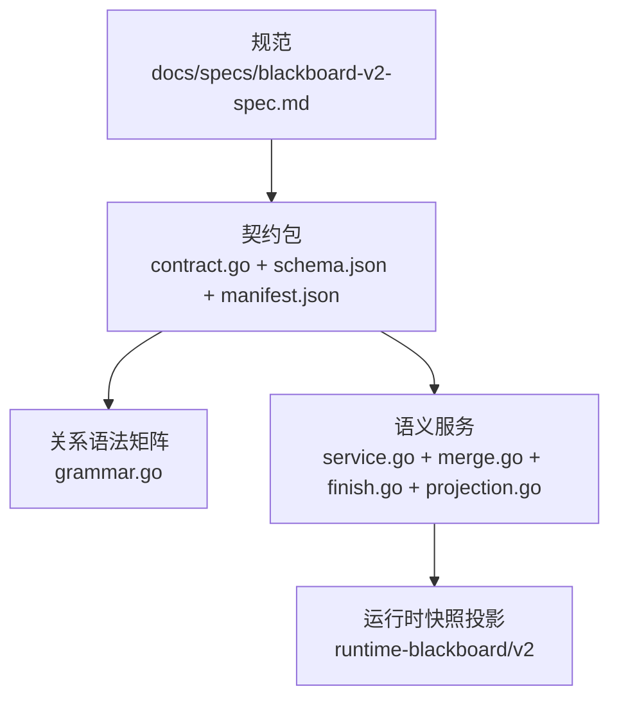
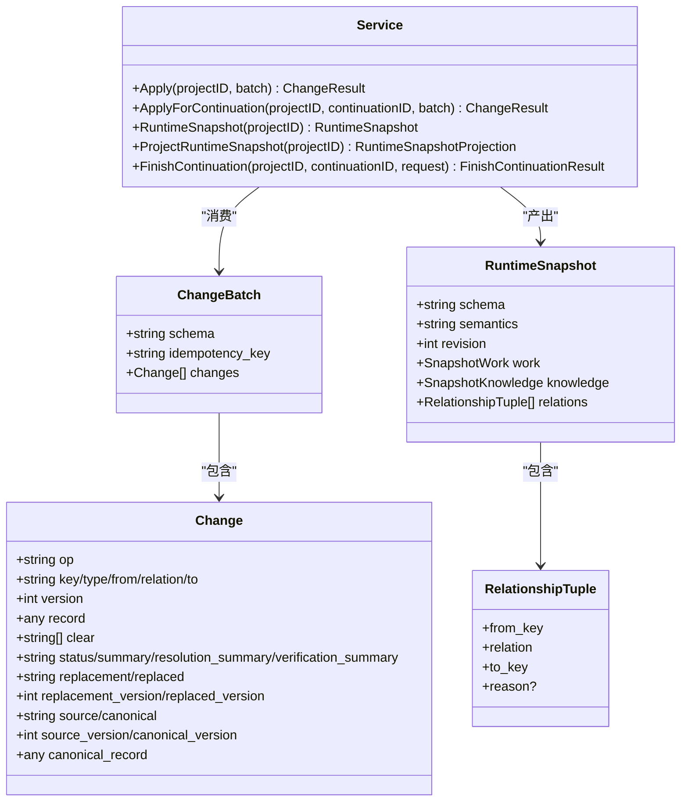
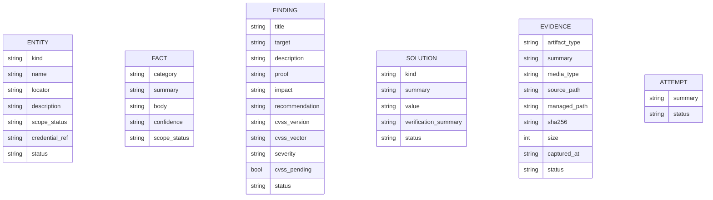
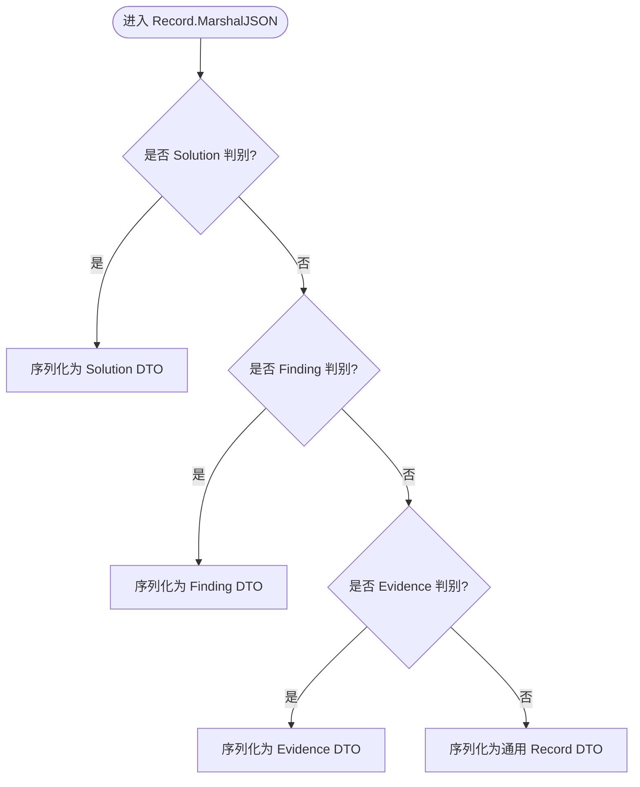
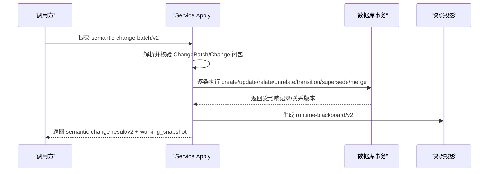
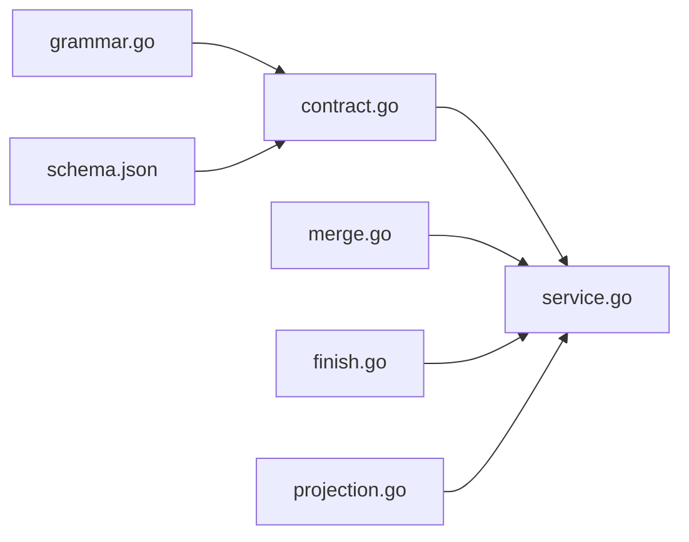

# 语义模型与数据契约

<cite>
**本文引用的文件**   
- [blackboard-v2-spec.md](file://docs/specs/blackboard-v2-spec.md)
- [blackboard-v2.schema.json](file://internal/blackboardv2contract/contractdata/schemas/blackboard-v2.schema.json)
- [manifest.json](file://internal/blackboardv2contract/contractdata/manifest.json)
- [contract.go](file://internal/blackboardv2contract/contract.go)
- [grammar.go](file://internal/blackboardv2grammar/grammar.go)
- [service.go](file://internal/blackboardv2/service.go)
- [merge.go](file://internal/blackboardv2/merge.go)
- [finish.go](file://internal/blackboardv2/finish.go)
- [projection.go](file://internal/blackboardv2/projection.go)
</cite>

## 目录
1. [引言](#引言)
2. [项目结构](#项目结构)
3. [核心组件](#核心组件)
4. [架构总览](#架构总览)
5. [详细组件分析](#详细组件分析)
6. [依赖关系分析](#依赖关系分析)
7. [性能考量](#性能考量)
8. [故障排查指南](#故障排查指南)
9. [结论](#结论)
10. [附录](#附录)

## 引言
本文件系统化阐述 Blackboard v2 的语义模型与数据契约，覆盖实体、事实、发现、解决方案、证据与尝试等记录类型；解释 Record 联合类型、Change 操作类型的语义约束与校验规则；说明版本控制机制、状态机转换规则与字段白名单限制；并给出 JSON Schema 契约验证、向后兼容性保证与扩展开发指南。文档同时提供数据建模示例与最佳实践，帮助读者在正确边界内构建与演进系统。

## 项目结构
Blackboard v2 的语义契约由“规范 + 契约包 + 语法矩阵 + 服务实现”四层组成：
- 规范层：定义语义模型、运行时快照、变更批次、同步附件、HTTP/MCP 接口等。
- 契约层：冻结的 JSON Schema、OpenAPI、可信工具清单与一致性样本（fixtures）。
- 语法层：关系词汇表与端点矩阵，用于关系合法性判定。
- 服务层：应用变更、投影快照、合并/替代/收尾等核心逻辑。

图表来源
- [blackboard-v2-spec.md:1-120](file://docs/specs/blackboard-v2-spec.md#L1-L120)
- [contract.go:1-120](file://internal/blackboardv2contract/contract.go#L1-L120)
- [grammar.go:1-120](file://internal/blackboardv2grammar/grammar.go#L1-L120)
- [service.go:1-120](file://internal/blackboardv2/service.go#L1-L120)

章节来源
- [blackboard-v2-spec.md:1-120](file://docs/specs/blackboard-v2-spec.md#L1-L120)
- [contract.go:1-120](file://internal/blackboardv2contract/contract.go#L1-L120)
- [grammar.go:1-120](file://internal/blackboardv2grammar/grammar.go#L1-L120)
- [service.go:1-120](file://internal/blackboardv2/service.go#L1-L120)

## 核心组件
本节聚焦 Blackboard v2 的核心数据结构与操作语义。

- 记录类型与关键字段
  - 实体(Entity)：kind/name/locator/description/scope_status/credential_ref/status=active
  - 探索目标(Objective)：objective/status=open
  - 尝试(Attempt)：summary/status=open
  - 事实(Fact)：category/summary/body/confidence/tentative或confirmed/scope_status
  - 发现(Finding)：title/target/description/proof/impact/recommendation/cvss_version/cvss_vector/severity/cvss_pending
  - 解决方案(Solution)：kind/value/summary/verification_summary/status=candidate或verified
  - 证据(Evidence)：artifact_type/summary/media_type/source_path/managed_path/sha256/size/captured_at/status=available或missing

- Record 联合类型
  - 统一 DTO Record 聚合所有记录类型的可序列化字段，通过判别式输出为具体类型 DTO，确保只暴露允许字段。

- Change 操作类型
  - create/update/relate/unrelate/transition/supersede/merge
  - 每个操作有严格的必填字段、可选字段与 clear 列表语义；未知字段拒绝。

- 版本控制
  - 每条记录与关系均有 version；批处理提交后递增 Project 级 revision；幂等键保障重试安全。

- 状态机与生命周期守卫
  - Objective 仅 open；Attempt 终端需 summary 且至少一个 tests 关系；Fact/Finding/Solution/Evidence 的确认/验证/废弃需满足支撑条件；supersede 要求同类型替换。

- 关系词汇与端点矩阵
  - 11 种关系类型，支持 reason 的三种关系仅限 supports/contradicts/depends_on；禁止自环；部分关系保持无环。

- 运行时快照与字段白名单
  - runtime-blackboard/v2 仅包含 work/knowledge/relations 三组，且按白名单裁剪字段；空组省略，null 不序列化。

- 文本长度限制
  - Key≤96 ASCII；主要语义文本≤1024 UTF-8 字节；可选描述/理由≤512 UTF-8 字节。

章节来源
- [blackboard-v2-spec.md:28-140](file://docs/specs/blackboard-v2-spec.md#L28-L140)
- [service.go:234-396](file://internal/blackboardv2/service.go#L234-L396)
- [service.go:72-232](file://internal/blackboardv2/service.go#L72-L232)
- [grammar.go:58-108](file://internal/blackboardv2grammar/grammar.go#L58-L108)
- [blackboard-v2.schema.json:101-508](file://internal/blackboardv2contract/contractdata/schemas/blackboard-v2.schema.json#L101-L508)
- [contract.go:410-473](file://internal/blackboardv2contract/contract.go#L410-L473)

## 架构总览
Blackboard v2 以“契约驱动”的方式组织代码：规范定义语义，契约包冻结 JSON Schema/OpenAPI/fixture，服务层严格遵循契约进行解析、校验与应用。

图表来源
- [service.go:72-147](file://internal/blackboardv2/service.go#L72-L147)
- [service.go:525-614](file://internal/blackboardv2/service.go#L525-L614)
- [service.go:494-496](file://internal/blackboardv2/service.go#L494-L496)

章节来源
- [service.go:72-147](file://internal/blackboardv2/service.go#L72-L147)
- [service.go:525-614](file://internal/blackboardv2/service.go#L525-L614)

## 详细组件分析

### 实体(Entity)、事实(Fact)、发现(Finding)、解决方案(Solution)、证据(Evidence)、尝试(Attempt)的数据结构
- 实体
  - 关键字段：status=active、kind、name、scope_status；可选 locator/description/credential_ref
  - 用途：描述被测试的目标对象（主机、服务、端点等）
- 事实
  - 关键字段：category、summary、confidence(tentative/confirmed)、scope_status；可选 body
  - 用途：记录可复用的项目知识，支持置信度演化
- 发现
  - 关键字段：status(unconfirmed/confirmed)、title；可选 target/description/proof/impact/recommendation/cvss_version/cvss_vector；severity 与 cvss_pending 派生
  - 用途：表达漏洞或问题，确认态需完整报告字段与有效 CVSS
- 解决方案
  - 关键字段：status(candidate/verified)、kind(answer/flag/procedure)、summary；可选 value/verification_summary
  - 用途：CTF 场景下的答案/标志/流程，验证态需值与验证摘要
- 证据
  - 关键字段：status(available/missing)、artifact_type、summary、managed_path、sha256、size；可选 media_type/source_path/captured_at
  - 用途：承载原始材料引用与完整性信息
- 尝试
  - 关键字段：status(open)，summary；终端态需 summary 且至少一个 tests 关系
  - 用途：封装一次探索过程，作为事实/发现的产生者

图表来源
- [blackboard-v2.schema.json:101-508](file://internal/blackboardv2contract/contractdata/schemas/blackboard-v2.schema.json#L101-L508)
- [service.go:234-396](file://internal/blackboardv2/service.go#L234-L396)

章节来源
- [blackboard-v2.schema.json:101-508](file://internal/blackboardv2contract/contractdata/schemas/blackboard-v2.schema.json#L101-L508)
- [service.go:234-396](file://internal/blackboardv2/service.go#L234-L396)

### Record 联合类型与序列化策略
- Record 是跨类型的统一 DTO，内部根据字段组合判别输出为 Solution/Finding/Evidence 或通用类型 DTO。
- 空字段省略，确保与契约白名单一致；Evidence 的零大小仍保留以满足契约。

图表来源
- [service.go:398-412](file://internal/blackboardv2/service.go#L398-L412)

章节来源
- [service.go:398-412](file://internal/blackboardv2/service.go#L398-L412)

### Change 操作类型与语义约束
- create：创建新记录，key 需在项目内唯一，record 必须闭合且符合类型 Schema
- update：基于当前 version 的部分更新，clear 显式清空可选字段
- transition：按类型合法状态机推进，必要时携带 terminal/verification 摘要
- relate/unrelate：建立/移除关系，reason 仅对 supports/contradicts/depends_on 允许
- supersede：原子地建立 supersedes 关系并将旧记录归档至历史
- merge：合并重复的项目知识，重定向 key，重写关系，可选更新规范记录

图表来源
- [service.go:72-232](file://internal/blackboardv2/service.go#L72-L232)
- [service.go:644-656](file://internal/blackboardv2/service.go#L644-L656)
- [service.go:414-481](file://internal/blackboardv2/service.go#L414-L481)

章节来源
- [service.go:72-232](file://internal/blackboardv2/service.go#L72-L232)
- [service.go:644-656](file://internal/blackboardv2/service.go#L644-L656)
- [service.go:414-481](file://internal/blackboardv2/service.go#L414-L481)

### 版本控制机制
- 记录与关系均维护 version；每次成功提交递增 project 级 revision
- 幂等键 idempotency_key 保证重试安全；相同语义的重放返回原结果
- 工作快照路径 .pentest/blackboard.json 与 revision 绑定，供运行时读取

章节来源
- [service.go:72-120](file://internal/blackboardv2/service.go#L72-L120)
- [service.go:414-481](file://internal/blackboardv2/service.go#L414-L481)

### 状态机转换规则与生命周期守卫
- Objective：仅 open；解决需来自 current 的 satisfies 关系
- Attempt：open→terminal(succeeded/failed/blocked/inconclusive/interrupted)；terminal 需 summary 且至少一个 tests 关系
- Fact：tentative↔confirmed；confirmed 需证据/已确认事实/受信任确认依据
- Finding：unconfirmed→confirmed；需完整报告字段与有效 CVSS 向量
- Solution：candidate→verified；需值与验证摘要
- Evidence：available/missing；superseded 需存在替换
- Supersede：同类型替换，旧记录入历史，新建 supersedes 关系

章节来源
- [blackboard-v2-spec.md:44-54](file://docs/specs/blackboard-v2-spec.md#L44-L54)
- [service.go:644-800](file://internal/blackboardv2/service.go#L644-L800)

### 字段白名单限制与运行时快照
- 运行时快照仅包含 work.knowledge.relations 三组，且按白名单裁剪字段
- 空组省略，null 不序列化；关系序列化为三元组或四元组（含 reason）

章节来源
- [blackboard-v2-spec.md:112-138](file://docs/specs/blackboard-v2-spec.md#L112-L138)
- [service.go:525-614](file://internal/blackboardv2/service.go#L525-L614)

### JSON Schema 契约验证与 UTF-8 字节限制
- 使用冻结的 blackboard-v2.schema.json 与 manifest.json 中的 fixtures 进行一致性校验
- 自定义校验器 enforce UTF-8 字节上限与迁移决策成员性

章节来源
- [contract.go:74-124](file://internal/blackboardv2contract/contract.go#L74-L124)
- [contract.go:339-473](file://internal/blackboardv2contract/contract.go#L339-L473)
- [manifest.json:1-120](file://internal/blackboardv2contract/contractdata/manifest.json#L1-L120)

### 向后兼容性与扩展开发指南
- 新增字段不得进入运行时快照或工具白名单，除非明确纳入契约与 fixture
- 关系词汇与端点矩阵集中管理，新增关系需更新 grammar.go 并在契约中声明
- 通过 ToolInputSchema 导出最小化 $defs 子集，避免泄露无关定义

章节来源
- [blackboard-v2-spec.md:307-310](file://docs/specs/blackboard-v2-spec.md#L307-L310)
- [contract.go:126-165](file://internal/blackboardv2contract/contract.go#L126-L165)
- [grammar.go:1-120](file://internal/blackboardv2grammar/grammar.go#L1-L120)

## 依赖关系分析
- 契约包对语法矩阵与 JSON Schema 库有直接依赖
- 服务层依赖 store 与 grammar，负责应用变更与快照投影
- 合并/替代/收尾等复杂逻辑位于独立模块，保持高内聚

图表来源
- [grammar.go:1-120](file://internal/blackboardv2grammar/grammar.go#L1-L120)
- [contract.go:1-120](file://internal/blackboardv2contract/contract.go#L1-L120)
- [service.go:1-120](file://internal/blackboardv2/service.go#L1-L120)
- [merge.go:1-120](file://internal/blackboardv2/merge.go#L1-L120)
- [finish.go:1-120](file://internal/blackboardv2/finish.go#L1-L120)
- [projection.go:1-110](file://internal/blackboardv2/projection.go#L1-L110)

章节来源
- [grammar.go:1-120](file://internal/blackboardv2grammar/grammar.go#L1-L120)
- [contract.go:1-120](file://internal/blackboardv2contract/contract.go#L1-L120)
- [service.go:1-120](file://internal/blackboardv2/service.go#L1-L120)
- [merge.go:1-120](file://internal/blackboardv2/merge.go#L1-L120)
- [finish.go:1-120](file://internal/blackboardv2/finish.go#L1-L120)
- [projection.go:1-110](file://internal/blackboardv2/projection.go#L1-L110)

## 性能考量
- 注意力预算：以精确字节估算 token 数，16K 健康目标，32K 警告，64K 需合并
- 快照始终完整且不截断，但建议通过合并/精简摘要/清理关系控制规模
- 关系循环检测与端点矩阵校验在写入时完成，避免后续读放大

章节来源
- [projection.go:1-110](file://internal/blackboardv2/projection.go#L1-L110)
- [blackboard-v2-spec.md:327-336](file://docs/specs/blackboard-v2-spec.md#L327-L336)

## 故障排查指南
- 版本冲突：检查 expected/current version 与 next_action 提示
- 语义校验失败：核对生命周期守卫、关系端点、reason 合法性与文本长度
- 证据完整性异常：确认 managed_path/sha256/size 与关联发现的状态
- Finish 冲突：确认 idempotency_key 归属与未完成的证据写入

章节来源
- [service.go:616-630](file://internal/blackboardv2/service.go#L616-L630)
- [merge.go:24-89](file://internal/blackboardv2/merge.go#L24-L89)
- [finish.go:65-124](file://internal/blackboardv2/finish.go#L65-L124)

## 结论
Blackboard v2 通过冻结契约与强校验的服务层，实现了稳定、可扩展且面向模型的语义记忆平面。其设计强调：
- 契约优先：JSON Schema/OpenAPI/fixtures 驱动开发与测试
- 强约束：状态机、关系矩阵、字段白名单与文本限制共同保障数据质量
- 可观测：注意力预算与健康诊断辅助治理规模与完整性
- 可演进：在不破坏运行时契约的前提下，通过合并/替代/关系优化维持长期健康

## 附录

### 数据建模示例与最佳实践
- 创建实体与事实，建立 about/supports 关系，逐步将 tentative fact 升级为 confirmed
- 使用 attempt 封装测试过程，产出 evidence，并以 evidences 关系支撑 finding
- 当发现重复知识时，使用 merge 合并到规范记录，并重写关系
- 用 supersede 替换过时事实，确保下游依赖不被孤立
- 严格控制摘要与理由长度，避免超出 UTF-8 字节限制

章节来源
- [manifest.json:141-390](file://internal/blackboardv2contract/contractdata/manifest.json#L141-L390)
- [blackboard-v2.schema.json:101-508](file://internal/blackboardv2contract/contractdata/schemas/blackboard-v2.schema.json#L101-L508)
- [grammar.go:58-108](file://internal/blackboardv2grammar/grammar.go#L58-L108)
- [contract.go:410-473](file://internal/blackboardv2contract/contract.go#L410-L473)