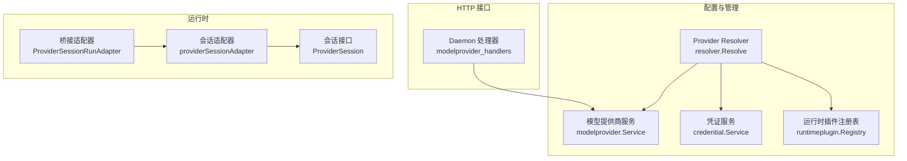
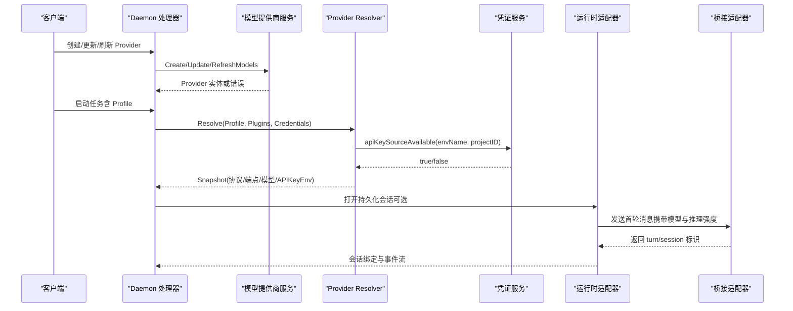
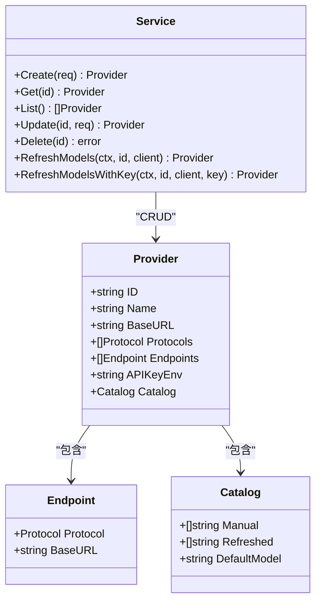
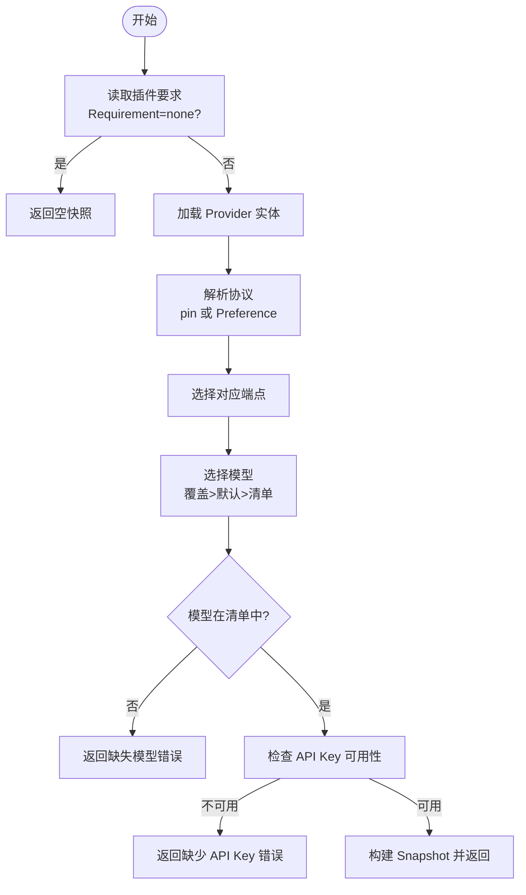
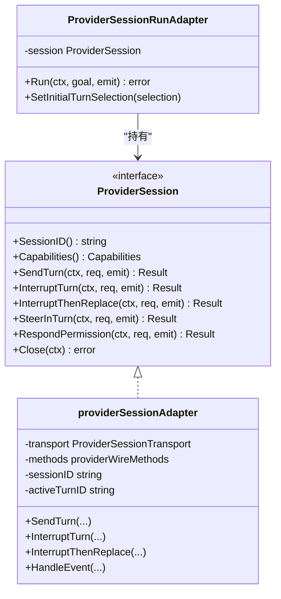
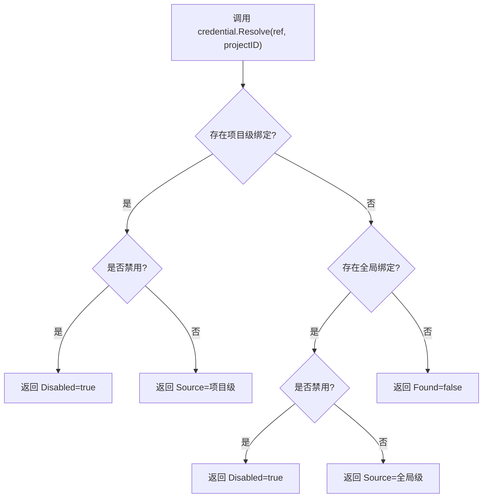
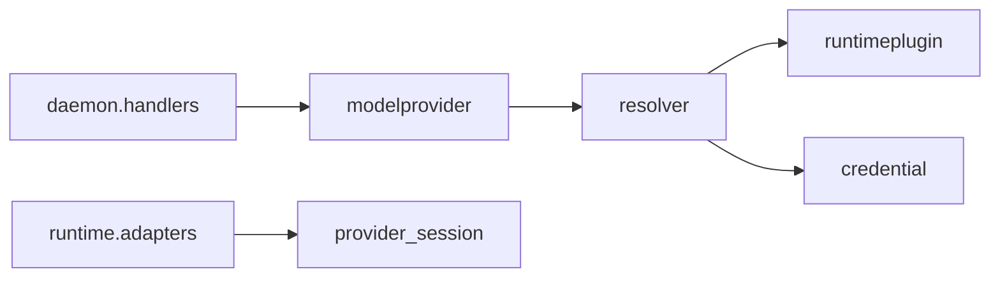

# 模型提供商

<cite>
**本文引用的文件**   
- [internal/modelprovider/modelprovider.go](file://internal/modelprovider/modelprovider.go)
- [internal/modelprovider/resolver.go](file://internal/modelprovider/resolver.go)
- [internal/daemon/modelprovider_handlers.go](file://internal/daemon/modelprovider_handlers.go)
- [internal/runtime/provider_adapters.go](file://internal/runtime/provider_adapters.go)
- [internal/runtime/provider_session.go](file://internal/runtime/provider_session.go)
- [internal/runtime/provider_bridge_adapter.go](file://internal/runtime/provider_bridge_adapter.go)
- [internal/runtimeplugin/builtin.go](file://internal/runtimeplugin/builtin.go)
- [internal/runtimeprofile/apikeys.go](file://internal/runtimeprofile/apikeys.go)
- [internal/credential/credential.go](file://internal/credential/credential.go)
- [internal/daemon/provider_session_factory.go](file://internal/daemon/provider_session_factory.go)
- [internal/daemon/production_provider_session_factory.go](file://internal/daemon/production_provider_session_factory.go)
</cite>

## 目录
1. [简介](#简介)
2. [项目结构](#项目结构)
3. [核心组件](#核心组件)
4. [架构总览](#架构总览)
5. [详细组件分析](#详细组件分析)
6. [依赖关系分析](#依赖关系分析)
7. [性能与可扩展性](#性能与可扩展性)
8. [故障排除指南](#故障排除指南)
9. [结论](#结论)
10. [附录：配置示例与自定义适配器开发](#附录：配置示例与自定义适配器开发)

## 简介
本文件系统性地说明“模型提供商管理”在本地优先的渗透测试代理中的设计与实现，覆盖以下目标：
- 多种 AI 提供商的适配机制、协议选择与运行时投影
- 全局 Provider 配置管理与 API Key 来源策略
- Provider Resolver 的工作原理（协议选择、模型清单、鉴权检查）
- 会话生命周期与持久化控制面（发送轮次、中断、替换、权限响应）
- 支持的提供商列表、配置示例与常见问题排查
- 自定义提供商适配器的开发与集成步骤

## 项目结构
围绕模型提供商的核心代码分布在如下模块：
- 模型提供商服务与解析器：定义 Provider 数据模型、端点与协议、模型清单刷新、API Key 环境变量生成；以及根据运行期插件能力进行协议与模型的选择。
- Daemon HTTP 接口：提供创建、更新、删除、列出、刷新模型清单等 REST 操作。
- 运行时适配器与会话：封装不同提供商的 wire 映射、统一会话控制语义、事件归一化、幂等与结算。
- 凭证与密钥管理：支持环境、文件、命令、字面量等多种来源，按作用域解析并投影到进程环境。
- 内置运行期插件：声明各运行器（Codex、Claude Code、Pi）对模型协议的偏好与支持。

图表来源
- [internal/modelprovider/modelprovider.go:84-117](file://internal/modelprovider/modelprovider.go#L84-L117)
- [internal/modelprovider/resolver.go:54-101](file://internal/modelprovider/resolver.go#L54-L101)
- [internal/daemon/modelprovider_handlers.go:27-51](file://internal/daemon/modelprovider_handlers.go#L27-L51)
- [internal/runtime/provider_adapters.go:58-92](file://internal/runtime/provider_adapters.go#L58-L92)
- [internal/runtime/provider_session.go:140-152](file://internal/runtime/provider_session.go#L140-L152)
- [internal/runtime/provider_bridge_adapter.go:45-47](file://internal/runtime/provider_bridge_adapter.go#L45-L47)

章节来源
- [internal/modelprovider/modelprovider.go:84-117](file://internal/modelprovider/modelprovider.go#L84-L117)
- [internal/modelprovider/resolver.go:54-101](file://internal/modelprovider/resolver.go#L54-L101)
- [internal/daemon/modelprovider_handlers.go:27-51](file://internal/daemon/modelprovider_handlers.go#L27-L51)
- [internal/runtime/provider_adapters.go:58-92](file://internal/runtime/provider_adapters.go#L58-L92)
- [internal/runtime/provider_session.go:140-152](file://internal/runtime/provider_session.go#L140-L152)
- [internal/runtime/provider_bridge_adapter.go:45-47](file://internal/runtime/provider_bridge_adapter.go#L45-L47)

## 核心组件
- 模型提供商服务（Service）
  - 负责 Provider 实体的增删改查、端点与协议规范化、模型清单合并与刷新、API Key 环境变量名生成。
  - 关键方法：Create/Update/Delete/List/Get、RefreshModels/RefreshModelsWithKey、NormalizeBaseURL/NormalizeEndpoints/BackfillEndpoints、CatalogRefreshURL、APIKeyEnv。
- Provider Resolver
  - 基于运行期插件的能力与偏好，结合 Profile 字段与 Provider 配置，解析出最终使用的协议、端点、模型与 API Key 来源。
  - 关键函数：Resolve、resolveProtocol、apiKeySourceAvailable。
- 会话适配器与接口
  - 抽象统一的会话控制语义：SendTurn、InterruptTurn、InterruptThenReplace、SteerInTurn、RespondPermission、Close。
  - 内部维护幂等键、请求冲突检测、事件归一化、结算等待。
- 凭证服务
  - 支持 env/file/command/literal 四种来源与作用域（global/project），提供 Resolve/Materialize 能力。
- 内置运行期插件
  - 声明各运行器（Codex、Claude Code、Pi）对模型协议的支持与偏好，以及配置投影路径与环境变量。

章节来源
- [internal/modelprovider/modelprovider.go:84-117](file://internal/modelprovider/modelprovider.go#L84-L117)
- [internal/modelprovider/resolver.go:54-101](file://internal/modelprovider/resolver.go#L54-L101)
- [internal/runtime/provider_session.go:140-152](file://internal/runtime/provider_session.go#L140-L152)
- [internal/credential/credential.go:214-245](file://internal/credential/credential.go#L214-L245)
- [internal/runtimeplugin/builtin.go:44-212](file://internal/runtimeplugin/builtin.go#L44-L212)

## 架构总览
下图展示了从 HTTP 请求到运行时调用的端到端流程，包括 Provider 解析、协议选择、模型清单校验、API Key 来源解析与注入、以及会话控制。

图表来源
- [internal/daemon/modelprovider_handlers.go:27-51](file://internal/daemon/modelprovider_handlers.go#L27-L51)
- [internal/modelprovider/resolver.go:54-101](file://internal/modelprovider/resolver.go#L54-L101)
- [internal/credential/credential.go:214-245](file://internal/credential/credential.go#L214-L245)
- [internal/runtime/provider_bridge_adapter.go:70-112](file://internal/runtime/provider_bridge_adapter.go#L70-L112)

## 详细组件分析

### 模型提供商服务（Service）
- 职责
  - 规范化 Base URL、端点与协议，防止误用操作级 URL（如 messages/chat/completions）。
  - 维护模型清单（手动 + 自动刷新），去重排序，保留默认模型。
  - 为每个 Provider 生成稳定的 API Key 环境变量名（由 Provider ID 派生）。
- 关键行为
  - 创建时自动生成 ID 与 APIKeyEnv，插入数据库。
  - 更新时支持回填端点（BackfillEndpoints）、合并 Catalog、兼容旧字段。
  - 删除前检查是否被运行期 Profile 引用。
  - 刷新模型清单通过 OpenAI 风格 /v1/models 接口拉取，仅保存 model id 列表。
- 复杂度与边界
  - 端点与协议规范化 O(n)，模型清单合并 O(m+n)。
  - 拒绝包含操作后缀的 base_url，避免将完整操作 URL 作为基础地址存储。

图表来源
- [internal/modelprovider/modelprovider.go:84-117](file://internal/modelprovider/modelprovider.go#L84-L117)
- [internal/modelprovider/modelprovider.go:223-284](file://internal/modelprovider/modelprovider.go#L223-L284)
- [internal/modelprovider/modelprovider.go:479-496](file://internal/modelprovider/modelprovider.go#L479-L496)
- [internal/modelprovider/modelprovider.go:624-637](file://internal/modelprovider/modelprovider.go#L624-L637)

章节来源
- [internal/modelprovider/modelprovider.go:84-117](file://internal/modelprovider/modelprovider.go#L84-L117)
- [internal/modelprovider/modelprovider.go:223-284](file://internal/modelprovider/modelprovider.go#L223-L284)
- [internal/modelprovider/modelprovider.go:479-496](file://internal/modelprovider/modelprovider.go#L479-L496)
- [internal/modelprovider/modelprovider.go:624-637](file://internal/modelprovider/modelprovider.go#L624-L637)

### Provider Resolver（解析器）
- 输入
  - 运行期 Profile（包含 provider_id、protocol pin、model_override 等）
  - 插件注册表（声明支持的协议与偏好）
  - 凭证服务（用于检查 API Key 是否可用）
- 输出
  - Snapshot：包含 model_provider_id、endpoint_base_url、base_url、protocol、model、api_key_env、api_key_source、projection_target
- 决策逻辑
  - 若插件不需要模型提供商则直接返回空快照。
  - 解析协议：优先使用 profile 中显式 pin，否则按插件定义的 ProtocolPreference 顺序选择第一个兼容协议。
  - 选择模型：Launch 覆盖 > Profile 覆盖 > Provider Catalog 默认模型；必须存在于 Catalog（Manual 或 Refreshed）。
  - 检查 API Key：若开启 CheckEnv，需确保环境变量或凭证绑定可解析且非空。

图表来源
- [internal/modelprovider/resolver.go:54-101](file://internal/modelprovider/resolver.go#L54-L101)
- [internal/modelprovider/resolver.go:118-137](file://internal/modelprovider/resolver.go#L118-L137)
- [internal/modelprovider/resolver.go:103-116](file://internal/modelprovider/resolver.go#L103-L116)

章节来源
- [internal/modelprovider/resolver.go:54-101](file://internal/modelprovider/resolver.go#L54-L101)
- [internal/modelprovider/resolver.go:118-137](file://internal/modelprovider/resolver.go#L118-L137)
- [internal/modelprovider/resolver.go:103-116](file://internal/modelprovider/resolver.go#L103-L116)

### 会话生命周期与控制面
- 会话接口
  - 提供 SendTurn、InterruptTurn、InterruptThenReplace、SteerInTurn、RespondPermission、Close 等方法。
  - 所有控制操作以 RequestID 作为幂等键，避免重复执行与冲突。
- 适配器实现
  - 统一处理能力协商、事件归一化、结算等待（针对中断/替换场景）。
  - 将不同提供商的 wire 方法映射到统一语义，并通过 SandboxBridge 传输。
- 桥接适配器
  - 将 Task 的目标（goal）与初始 Turn 选择（模型、推理强度）注入首次发送，后续控制复用同一会话。

图表来源
- [internal/runtime/provider_session.go:140-152](file://internal/runtime/provider_session.go#L140-L152)
- [internal/runtime/provider_adapters.go:58-92](file://internal/runtime/provider_adapters.go#L58-L92)
- [internal/runtime/provider_bridge_adapter.go:45-47](file://internal/runtime/provider_bridge_adapter.go#L45-L47)

章节来源
- [internal/runtime/provider_session.go:140-152](file://internal/runtime/provider_session.go#L140-L152)
- [internal/runtime/provider_adapters.go:58-92](file://internal/runtime/provider_adapters.go#L58-L92)
- [internal/runtime/provider_bridge_adapter.go:45-47](file://internal/runtime/provider_bridge_adapter.go#L45-L47)

### API Key 管理与凭证解析
- 来源类型
  - env：引用环境变量名
  - file：从文件读取
  - command：执行命令获取（默认禁用，需显式启用）
  - literal：直接存储值（对外响应会被脱敏）
- 作用域与优先级
  - 项目级绑定覆盖全局绑定；项目级禁用会阻断全局回退。
- 与 Provider 的关系
  - Provider 只记录 API Key 的环境变量名（由 Provider ID 派生），不存储密钥值。
  - 运行时通过凭证服务解析并投影到进程环境。

图表来源
- [internal/credential/credential.go:214-245](file://internal/credential/credential.go#L214-L245)
- [internal/modelprovider/modelprovider.go:624-637](file://internal/modelprovider/modelprovider.go#L624-L637)

章节来源
- [internal/credential/credential.go:214-245](file://internal/credential/credential.go#L214-L245)
- [internal/modelprovider/modelprovider.go:624-637](file://internal/modelprovider/modelprovider.go#L624-L637)

### 支持的提供商与协议
- 内置运行期插件及其模型协议支持
  - Codex：支持 openai_responses
  - Claude Code：支持 anthropic_messages
  - Pi：支持 openai_chat_completions、openai_responses、anthropic_messages
- 协议选择策略
  - 若 Profile 指定 protocol pin，则校验其是否在插件支持集内且 Provider 已配置该端点。
  - 否则按插件的 ProtocolPreference 顺序选择首个兼容协议。

章节来源
- [internal/runtimeplugin/builtin.go:44-212](file://internal/runtimeplugin/builtin.go#L44-L212)
- [internal/modelprovider/resolver.go:118-137](file://internal/modelprovider/resolver.go#L118-L137)

## 依赖关系分析
- 耦合与内聚
  - modelprovider 层与 runtime 层通过 resolver 解耦：前者专注配置与清单，后者关注运行时能力与协议偏好。
  - 会话适配器与具体提供商通过 wire methods 映射，保持高内聚低耦合。
- 外部依赖
  - 凭证服务提供密钥来源解析；HTTP 客户端用于刷新模型清单。
- 潜在循环依赖
  - 当前设计无循环依赖；Provider 服务不依赖运行时，运行时通过插件注册表反向查询能力。

图表来源
- [internal/modelprovider/resolver.go:54-101](file://internal/modelprovider/resolver.go#L54-L101)
- [internal/runtime/plugin/builtin.go:44-212](file://internal/runtimeplugin/builtin.go#L44-L212)
- [internal/daemon/modelprovider_handlers.go:27-51](file://internal/daemon/modelprovider_handlers.go#L27-L51)

章节来源
- [internal/modelprovider/resolver.go:54-101](file://internal/modelprovider/resolver.go#L54-L101)
- [internal/runtimeplugin/builtin.go:44-212](file://internal/runtimeplugin/builtin.go#L44-L212)
- [internal/daemon/modelprovider_handlers.go:27-51](file://internal/daemon/modelprovider_handlers.go#L27-L51)

## 性能与可扩展性
- 性能特性
  - 端点与协议规范化、模型清单合并均为线性时间复杂度，开销可控。
  - 会话适配器缓存最近一次调用结果，避免重复网络往返。
- 可扩展性
  - 新增提供商适配器仅需实现 wire methods 映射，无需改动统一会话语义。
  - 插件注册表集中声明协议支持与偏好，便于扩展新运行器。

[本节为通用指导，不涉及具体文件分析]

## 故障排除指南
- 常见错误与定位
  - 缺少 Provider 或模型：检查 Profile 的 model_provider_id 与 model_override，确认 Catalog 包含所选模型。
  - 协议不兼容：确认 Provider 已配置对应端点，且与插件支持集匹配。
  - API Key 未配置：检查 Provider 生成的环境变量名，或通过凭证服务在项目/全局作用域绑定。
  - 刷新模型清单失败：确认 OpenAI 风格 /v1/models 可达，且授权头正确。
- 诊断建议
  - 查看 Provider 详情中的 api_key_env 与 catalog.default_model。
  - 使用预检（Preflight）预览解析结果，确认 endpoint_base_url、protocol、model 与 API Key 状态。
  - 检查会话事件日志，关注 requested/acknowledged/settled/started/failed 等阶段。

章节来源
- [internal/modelprovider/resolver.go:54-101](file://internal/modelprovider/resolver.go#L54-L101)
- [internal/modelprovider/modelprovider.go:223-284](file://internal/modelprovider/modelprovider.go#L223-L284)
- [internal/daemon/modelprovider_handlers.go:139-154](file://internal/daemon/modelprovider_handlers.go#L139-L154)

## 结论
本系统通过“配置与服务分离”的设计，将模型提供商的管理与运行时适配解耦：
- 配置层提供稳定、可复用的 Provider 实体与模型清单；
- 解析层依据运行期插件能力动态选择协议与模型；
- 会话层统一控制语义，屏蔽不同提供商差异；
- 凭证层提供灵活、安全的密钥来源与投影机制。
该架构既满足多提供商接入需求，又具备良好的可扩展性与可观测性。

[本节为总结，不涉及具体文件分析]

## 附录：配置示例与自定义适配器开发

### 支持的提供商与协议
- Codex：openai_responses
- Claude Code：anthropic_messages
- Pi：openai_chat_completions、openai_responses、anthropic_messages

章节来源
- [internal/runtimeplugin/builtin.go:44-212](file://internal/runtimeplugin/builtin.go#L44-L212)

### 配置示例（概念性）
- 创建 Provider
  - name：显示名称
  - base_url：模型协议基础地址（不含 messages/chat/completions 等操作后缀）
  - protocols/endpoints：声明支持的协议与对应 base_url
  - catalog：手动添加模型 id 或设置默认模型
- 刷新模型清单
  - 触发后从 OpenAI 风格 /v1/models 拉取，仅保存 model id 列表
- API Key 配置
  - 通过凭证服务绑定 env/file/command/literal 来源
  - Provider 仅记录环境变量名（由 Provider ID 派生）

章节来源
- [internal/modelprovider/modelprovider.go:84-117](file://internal/modelprovider/modelprovider.go#L84-L117)
- [internal/modelprovider/modelprovider.go:223-284](file://internal/modelprovider/modelprovider.go#L223-L284)
- [internal/modelprovider/modelprovider.go:624-637](file://internal/modelprovider/modelprovider.go#L624-L637)
- [internal/credential/credential.go:214-245](file://internal/credential/credential.go#L214-L245)

### 自定义提供商适配器开发步骤
- 定义运行期插件
  - 在插件注册表中声明 Provider Requirement、SupportedProtocols、ProtocolPreference、CredentialEnv、ConfigProjection 等。
- 实现 wire methods 映射
  - 在适配器中实现 send/interrupt/permission 等方法的参数构造与元数据提取（turnID、sessionID）。
- 集成会话生命周期
  - 使用 providerSessionAdapter 统一管理幂等、事件与结算；必要时实现 PrepareSend 前置设置。
- 验证与测试
  - 使用 FakeProviderSession 模拟会话行为，覆盖成功、失败、中断、替换等路径。

章节来源
- [internal/runtimeplugin/builtin.go:44-212](file://internal/runtimeplugin/builtin.go#L44-L212)
- [internal/runtime/provider_adapters.go:58-92](file://internal/runtime/provider_adapters.go#L58-L92)
- [internal/runtime/provider_session.go:140-152](file://internal/runtime/provider_session.go#L140-L152)