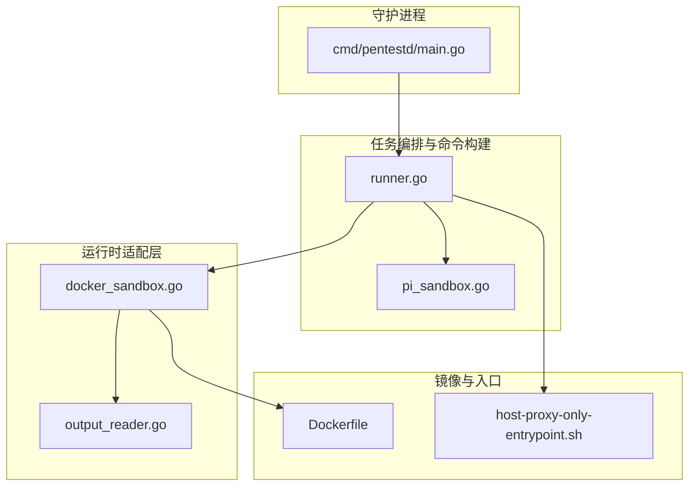
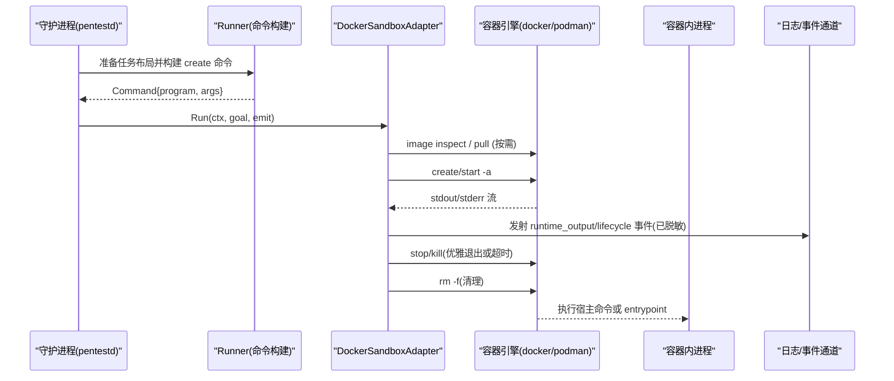
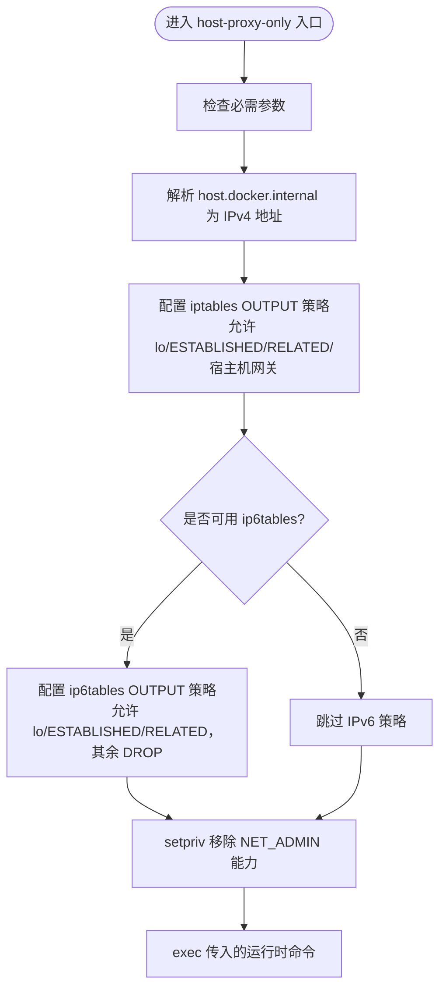
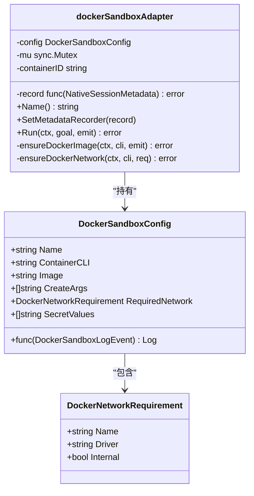
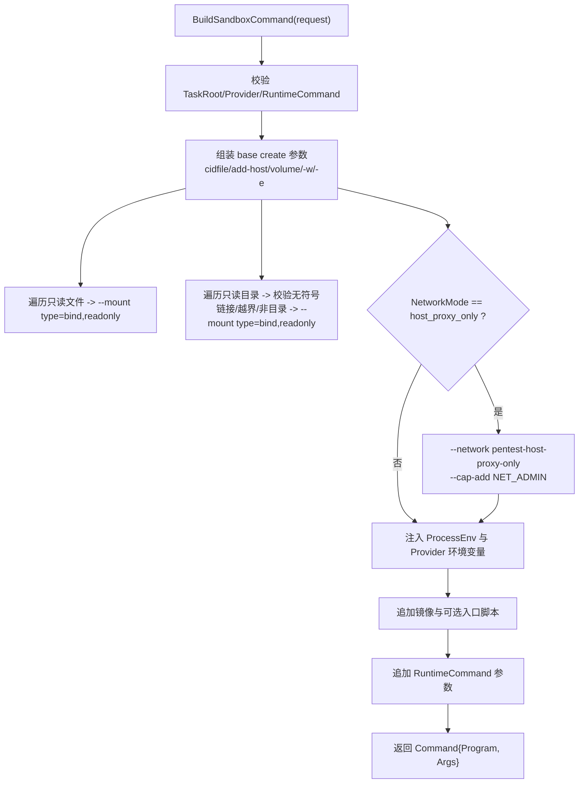
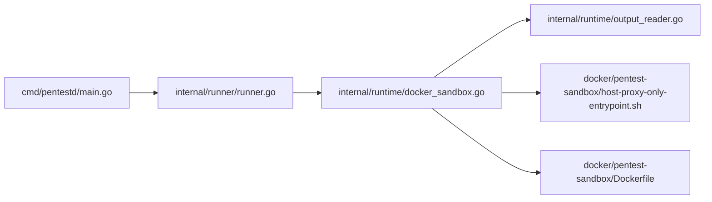

# Docker/Podman 沙箱执行

<cite>
**本文引用的文件**   
- [docker/pentest-sandbox/Dockerfile](file://docker/pentest-sandbox/Dockerfile)
- [docker/pentest-sandbox/host-proxy-only-entrypoint.sh](file://docker/pentest-sandbox/host-proxy-only-entrypoint.sh)
- [internal/runtime/docker_sandbox.go](file://internal/runtime/docker_sandbox.go)
- [internal/runner/runner.go](file://internal/runner/runner.go)
- [internal/runner/pi_sandbox.go](file://internal/runner/pi_sandbox.go)
- [internal/runtime/output_reader.go](file://internal/runtime/output_reader.go)
- [cmd/pentestd/main.go](file://cmd/pentestd/main.go)
</cite>

## 目录
1. [简介](#简介)
2. [项目结构](#项目结构)
3. [核心组件](#核心组件)
4. [架构总览](#架构总览)
5. [详细组件分析](#详细组件分析)
6. [依赖关系分析](#依赖关系分析)
7. [性能考量](#性能考量)
8. [故障排查指南](#故障排查指南)
9. [结论](#结论)

## 简介
本文件面向本地优先的渗透测试代理（Go daemon + React 仪表盘 + 沙箱运行时），聚焦于 Docker/Podman 沙箱执行环境。内容涵盖容器隔离机制、网络配置（host_proxy_only 模式）、文件系统挂载策略、权限控制与资源限制、Kali Linux 镜像定制与安全边界、只读文件与目录保护、沙箱启动流程、日志收集、进程管理与故障恢复等。

## 项目结构
围绕沙箱执行的关键代码与资产分布如下：
- 镜像构建与入口脚本：docker/pentest-sandbox/*
- 运行时适配器与容器生命周期管理：internal/runtime/*
- 任务布局与命令构建（含 host_proxy_only 网络模式）：internal/runner/*
- 输出扫描与脱敏：internal/runtime/output_reader.go
- 守护进程参数注入（container-cli 选择 docker/podman）：cmd/pentestd/main.go

图表来源
- [docker/pentest-sandbox/Dockerfile:1-145](file://docker/pentest-sandbox/Dockerfile#L1-L145)
- [docker/pentest-sandbox/host-proxy-only-entrypoint.sh:1-46](file://docker/pentest-sandbox/host-proxy-only-entrypoint.sh#L1-L46)
- [internal/runtime/docker_sandbox.go:1-505](file://internal/runtime/docker_sandbox.go#L1-L505)
- [internal/runtime/output_reader.go:1-104](file://internal/runtime/output_reader.go#L1-L104)
- [internal/runner/runner.go:1-306](file://internal/runner/runner.go#L1-L306)
- [internal/runner/pi_sandbox.go:1-55](file://internal/runner/pi_sandbox.go#L1-L55)
- [cmd/pentestd/main.go:30-122](file://cmd/pentestd/main.go#L30-L122)

章节来源
- [docker/pentest-sandbox/Dockerfile:1-145](file://docker/pentest-sandbox/Dockerfile#L1-L145)
- [docker/pentest-sandbox/host-proxy-only-entrypoint.sh:1-46](file://docker/pentest-sandbox/host-proxy-only-entrypoint.sh#L1-L46)
- [internal/runtime/docker_sandbox.go:1-505](file://internal/runtime/docker_sandbox.go#L1-L505)
- [internal/runner/runner.go:1-306](file://internal/runner/runner.go#L1-L306)
- [internal/runner/pi_sandbox.go:1-55](file://internal/runner/pi_sandbox.go#L1-L55)
- [internal/runtime/output_reader.go:1-104](file://internal/runtime/output_reader.go#L1-L104)
- [cmd/pentestd/main.go:30-122](file://cmd/pentestd/main.go#L30-L122)

## 核心组件
- 镜像与入口脚本
  - Kali 基础镜像，预装大量渗透工具链与 Node/Python/Golang 运行环境；提供 agent-browser、Claude Code、Codex、Pi 等 CLI 及桥接程序；内置 host-proxy-only 入口以在容器内实施出站过滤。
- 运行时适配器（DockerSandboxAdapter）
  - 负责镜像拉取、容器创建/启动/停止/清理、网络要求校验、事件与日志上报、输出流读取与敏感信息脱敏。
- 任务编排器（Runner）
  - 准备任务本地目录布局，生成容器 create 命令，支持 host_proxy_only 网络模式、只读文件/目录挂载、环境变量注入、Provider 专属 HOME 路径映射。
- 输出扫描器
  - 行级读取、超长行截断、忽略规则过滤、统一事件发射与元数据观察点。
- 守护进程参数
  - 通过命令行与环境变量选择 container-cli（docker/podman）与默认 sandbox image。

章节来源
- [docker/pentest-sandbox/Dockerfile:1-145](file://docker/pentest-sandbox/Dockerfile#L1-L145)
- [internal/runtime/docker_sandbox.go:1-505](file://internal/runtime/docker_sandbox.go#L1-L505)
- [internal/runner/runner.go:1-306](file://internal/runner/runner.go#L1-L306)
- [internal/runtime/output_reader.go:1-104](file://internal/runtime/output_reader.go#L1-L104)
- [cmd/pentestd/main.go:30-122](file://cmd/pentestd/main.go#L30-L122)

## 架构总览
下图展示了从守护进程到容器运行的端到端调用链，包括网络模式、镜像拉取、容器生命周期与日志采集。

图表来源
- [internal/runner/runner.go:139-217](file://internal/runner/runner.go#L139-L217)
- [internal/runtime/docker_sandbox.go:111-231](file://internal/runtime/docker_sandbox.go#L111-L231)
- [internal/runtime/output_reader.go:61-104](file://internal/runtime/output_reader.go#L61-L104)
- [cmd/pentestd/main.go:30-122](file://cmd/pentestd/main.go#L30-L122)

## 详细组件分析

### 容器镜像与入口脚本（Kali 定制与安全边界）
- 基础镜像与工具集
  - 基于 kali-rolling，安装 headless 套件、Node/npm、Golang、Python、常用安全工具（nmap/sqlmap/nuclei/subfinder/ffuf/dirsearch/gitleaks/nikto/netexec 等）。
  - 安装 Claude Code、Codex、Pi 等 Agent CLI，并提供 provider 协议桥接程序与非 PTY JSONL 通信能力。
  - 集成 agent-browser 与系统 Chromium，预置 skills 包以便沙箱内 Agent 使用。
- 安全与可观测性
  - 设置环境变量用于禁用非必要流量、标记沙箱环境、指定 skills 目录与浏览器可执行路径。
  - 将 provider 桥接源码置于镜像后期层，减少缓存失效范围。
- host-proxy-only 入口
  - 解析 host.docker.internal 获取宿主机网关地址，仅放行回环、已建立连接与宿主机网关 IPv4 流量；若启用 IPv6 则同步配置 ip6tables 策略。
  - 在 exec 前通过 setpriv 移除 NET_ADMIN 能力，防止运行时修改防火墙规则。

图表来源
- [docker/pentest-sandbox/host-proxy-only-entrypoint.sh:1-46](file://docker/pentest-sandbox/host-proxy-only-entrypoint.sh#L1-L46)

章节来源
- [docker/pentest-sandbox/Dockerfile:1-145](file://docker/pentest-sandbox/Dockerfile#L1-L145)
- [docker/pentest-sandbox/host-proxy-only-entrypoint.sh:1-46](file://docker/pentest-sandbox/host-proxy-only-entrypoint.sh#L1-L46)

### 运行时适配器（DockerSandboxAdapter）
- 职责
  - 确保所需 Docker 网络存在且满足驱动与 internal 属性约束。
  - 按需拉取镜像，透传进度与错误至事件与日志回调。
  - 创建并启动容器，分离 stdout/stderr 流，按行读取并脱敏后发射 runtime_output 事件。
  - 优雅停止（stop，失败则 kill），最终强制删除容器。
- 关键行为
  - 网络要求：当 RequiredNetwork 非空时，先 inspect 再按需 create，严格校验 driver 与 internal 标志。
  - 镜像拉取：inspect 失败且报告缺失时才 pull；对 stdout/stderr 进行行级扫描，记录 image_pull_started/completed/failed 阶段。
  - 生命周期：container_created/starting/stop_failed/cleanup_failed 等阶段事件。
  - 输出处理：使用 ReadBoundedLine 避免超大行阻塞，结合 adapters.Redact 对敏感值脱敏。

图表来源
- [internal/runtime/docker_sandbox.go:20-57](file://internal/runtime/docker_sandbox.go#L20-L57)
- [internal/runtime/docker_sandbox.go:365-428](file://internal/runtime/docker_sandbox.go#L365-L428)
- [internal/runtime/docker_sandbox.go:233-354](file://internal/runtime/docker_sandbox.go#L233-L354)
- [internal/runtime/docker_sandbox.go:111-231](file://internal/runtime/docker_sandbox.go#L111-L231)

章节来源
- [internal/runtime/docker_sandbox.go:1-505](file://internal/runtime/docker_sandbox.go#L1-L505)
- [internal/runtime/output_reader.go:1-104](file://internal/runtime/output_reader.go#L1-L104)

### 任务编排与命令构建（Runner）
- 任务布局
  - 在 task_root 下创建 workdir、runtime-home/<provider>、skills、artifacts、logs 等目录，权限 0700。
- 命令构建
  - 默认 program 为 docker（可通过参数覆盖为 podman），image 默认为 kalilinux/kali-rolling。
  - 挂载 task_root 到 /task，工作目录 /task/workdir，注入 PENTEST_TASK_ROOT。
  - 支持 ReadOnlyTaskFiles 与 ReadOnlyTaskDirs 的只读 bind mount，并对路径进行严格校验（禁止越界、符号链接、非目录等）。
  - 当 NetworkMode=host_proxy_only 时：
    - 添加 --network pentest-host-proxy-only 与 --cap-add NET_ADMIN（供入口脚本临时使用）。
    - 在镜像 CMD 之前插入 host-proxy-only 入口脚本作为容器入口。
  - Provider 专属环境变量：根据 Provider 类型设置 HOME 与专用 HOME 环境变量，使会话持久化落在任务卷中。
- Pi 包装器
  - 若镜像未预装 pi，则在首次使用时 npm install -g 指定包名/版本，随后 exec pi 并透传参数。

图表来源
- [internal/runner/runner.go:139-217](file://internal/runner/runner.go#L139-L217)
- [internal/runner/runner.go:219-243](file://internal/runner/runner.go#L219-L243)
- [internal/runner/runner.go:250-306](file://internal/runner/runner.go#L250-L306)
- [internal/runner/pi_sandbox.go:14-47](file://internal/runner/pi_sandbox.go#L14-L47)

章节来源
- [internal/runner/runner.go:1-306](file://internal/runner/runner.go#L1-L306)
- [internal/runner/pi_sandbox.go:1-55](file://internal/runner/pi_sandbox.go#L1-L55)

### 日志收集与输出处理
- 输出扫描
  - 使用 ScanOutputWithObserver 逐行读取 stdout/stderr，支持 observe 钩子提取元数据（如会话初始化记录）。
  - 超长行自动截断并标记 truncated，避免管道阻塞。
  - 通过 adapters.Redact 对 payload 中的敏感字段进行脱敏后再发射 runtime_output 事件。
- 镜像拉取日志
  - 将 image_pull_progress 文本与阶段事件同时写入事件通道与 Log 回调，便于上层聚合与审计。

章节来源
- [internal/runtime/output_reader.go:1-104](file://internal/runtime/output_reader.go#L1-L104)
- [internal/runtime/docker_sandbox.go:289-354](file://internal/runtime/docker_sandbox.go#L289-L354)

### 进程管理与故障恢复
- 优雅停止与强制终止
  - 先尝试 stop，失败或超时时升级为 kill，确保容器进程尽快退出。
- 资源清理
  - 无论成功或失败，均尝试 rm -f 清理容器；“不存在”视为成功清理。
- 停止确认
  - 通过 cidfile 轮询 inspect 状态，等待容器完全退出或已被 --rm 移除。

章节来源
- [internal/runtime/docker_sandbox.go:430-504](file://internal/runtime/docker_sandbox.go#L430-L504)
- [internal/runtime/container.go:1-89](file://internal/runtime/container.go#L1-L89)

### 网络配置（host_proxy_only 模式）
- 网络要求
  - Runner 在构建命令时，若选择 host_proxy_only，会附加 --network pentest-host-proxy-only 与 --cap-add NET_ADMIN。
  - 适配器在启动前 ensureDockerNetwork，要求 network 的 driver 与 internal 标志与预期一致，否则拒绝启动。
- 出站过滤
  - 容器入口脚本在启动运行时前设置 iptables/ip6tables 策略，仅允许回环、已建立连接与宿主机网关 IPv4 流量，其余 DROP。
  - 在 exec 前移除 NET_ADMIN，防止运行时篡改规则。

章节来源
- [internal/runner/runner.go:196-216](file://internal/runner/runner.go#L196-L216)
- [internal/runtime/docker_sandbox.go:365-428](file://internal/runtime/docker_sandbox.go#L365-L428)
- [docker/pentest-sandbox/host-proxy-only-entrypoint.sh:1-46](file://docker/pentest-sandbox/host-proxy-only-entrypoint.sh#L1-L46)

### 文件系统挂载策略与只读保护
- 任务卷
  - 整个 task_root 以读写方式挂载到 /task，workdir 作为默认工作目录。
- 只读文件/目录
  - ReadOnlyTaskFiles：相对路径必须位于 task_root 之下，生成 readonly bind mount。
  - ReadOnlyTaskDirs：除路径校验外，还禁止符号链接与跨层级逃逸，确保目录安全。
- Provider 家目录
  - 根据 Provider 类型设置 HOME 与专用 HOME 环境变量，使会话与配置持久化在任务卷中，便于重建后可恢复。

章节来源
- [internal/runner/runner.go:179-217](file://internal/runner/runner.go#L179-L217)
- [internal/runner/runner.go:219-243](file://internal/runner/runner.go#L219-L243)
- [internal/runner/runner.go:250-306](file://internal/runner/runner.go#L250-L306)

### 权限控制与资源限制
- 最小能力原则
  - 仅在 host_proxy_only 模式下授予 NET_ADMIN，并在入口脚本 exec 前移除该能力，避免运行时修改网络策略。
- 资源限制建议
  - 当前实现未硬编码 CPU/内存限制；可在外部通过容器引擎参数（如 --cpus/--memory）在 CreateArgs 中注入，以实现资源上限控制。

章节来源
- [docker/pentest-sandbox/host-proxy-only-entrypoint.sh:39-45](file://docker/pentest-sandbox/host-proxy-only-entrypoint.sh#L39-L45)
- [internal/runner/runner.go:196-216](file://internal/runner/runner.go#L196-L216)

## 依赖关系分析
- 守护进程
  - 通过命令行与环境变量选择 container-cli（docker/podman）与 sandbox image，并将这些参数传递给 Provider Session Factory 与 Daemon Server。
- Runner 与 Adapter
  - Runner 负责构造 create 命令；Adapter 负责执行容器生命周期操作与日志/事件上报。
- 输出与脱敏
  - 输出扫描器与适配器共同完成行级读取、截断、过滤与敏感信息脱敏。

图表来源
- [cmd/pentestd/main.go:30-122](file://cmd/pentestd/main.go#L30-L122)
- [internal/runner/runner.go:1-306](file://internal/runner/runner.go#L1-L306)
- [internal/runtime/docker_sandbox.go:1-505](file://internal/runtime/docker_sandbox.go#L1-L505)
- [internal/runtime/output_reader.go:1-104](file://internal/runtime/output_reader.go#L1-L104)
- [docker/pentest-sandbox/host-proxy-only-entrypoint.sh:1-46](file://docker/pentest-sandbox/host-proxy-only-entrypoint.sh#L1-L46)
- [docker/pentest-sandbox/Dockerfile:1-145](file://docker/pentest-sandbox/Dockerfile#L1-L145)

章节来源
- [cmd/pentestd/main.go:30-122](file://cmd/pentestd/main.go#L30-L122)
- [internal/runner/runner.go:1-306](file://internal/runner/runner.go#L1-L306)
- [internal/runtime/docker_sandbox.go:1-505](file://internal/runtime/docker_sandbox.go#L1-L505)
- [internal/runtime/output_reader.go:1-104](file://internal/runtime/output_reader.go#L1-L104)
- [docker/pentest-sandbox/host-proxy-only-entrypoint.sh:1-46](file://docker/pentest-sandbox/host-proxy-only-entrypoint.sh#L1-L46)
- [docker/pentest-sandbox/Dockerfile:1-145](file://docker/pentest-sandbox/Dockerfile#L1-L145)

## 性能考量
- 镜像拉取优化
  - 先 inspect 本地镜像，仅在缺失时 pull；拉取过程分片输出，避免一次性缓冲导致阻塞。
- 输出扫描
  - 行级读取与最大行长度限制，防止超大行撑爆缓冲区；截断后继续消费后续行，保证管道畅通。
- 资源上限
  - 建议在 CreateArgs 中注入 CPU/内存限制参数，由容器引擎层面保障多任务并发时的稳定性。

[本节为通用指导，不直接分析具体文件]

## 故障排查指南
- 常见错误定位
  - 镜像缺失：关注 image_pull_started/image_pull_failed 事件与日志回调；确认 registry 可达与凭据正确。
  - 网络不匹配：ensureDockerNetwork 校验失败时会提示期望与实际 driver/internal 不一致；需修正已有网络或重新创建。
  - 容器无法停止：stop 失败将升级为 kill；若仍残留，检查 rm -f 清理结果与是否存在其他进程占用。
  - 只读挂载失败：路径越界、符号链接或非目录会导致构建命令失败；检查 ReadOnlyTaskFiles/ReadOnlyTaskDirs 配置。
  - 出站被阻断：host_proxy_only 模式下仅允许宿主机网关与已建立连接；如需访问外部目标，请调整网络策略或改用默认网络模式。
- 诊断手段
  - 查看 lifecycle 事件与 runtime_output 事件，定位阶段与错误信息。
  - 使用 CIDFile 配合 inspect 确认容器状态。
  - 在宿主机上检查 iptables/ip6tables 策略与网络命名空间。

章节来源
- [internal/runtime/docker_sandbox.go:233-354](file://internal/runtime/docker_sandbox.go#L233-L354)
- [internal/runtime/docker_sandbox.go:365-428](file://internal/runtime/docker_sandbox.go#L365-L428)
- [internal/runtime/docker_sandbox.go:430-504](file://internal/runtime/docker_sandbox.go#L430-L504)
- [internal/runner/runner.go:179-243](file://internal/runner/runner.go#L179-L243)
- [docker/pentest-sandbox/host-proxy-only-entrypoint.sh:1-46](file://docker/pentest-sandbox/host-proxy-only-entrypoint.sh#L1-L46)

## 结论
本项目通过“Runner 构建命令 + Adapter 管理生命周期 + 入口脚本实施出站过滤”的分层设计，实现了高隔离、强可控的沙箱执行环境。Kali 镜像集成了丰富的工具链与 Agent 生态，host_proxy_only 模式在容器网络命名空间内实现严格的出站白名单，结合只读文件/目录与最小能力原则，有效收敛了攻击面。日志与事件体系贯穿镜像拉取、容器启动、输出采集与清理阶段，便于问题定位与合规审计。对于生产部署，建议结合容器引擎的资源限制参数与外部网络策略，进一步加固安全边界与稳定性。