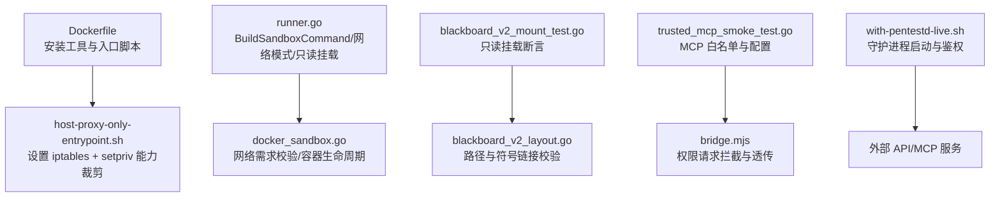
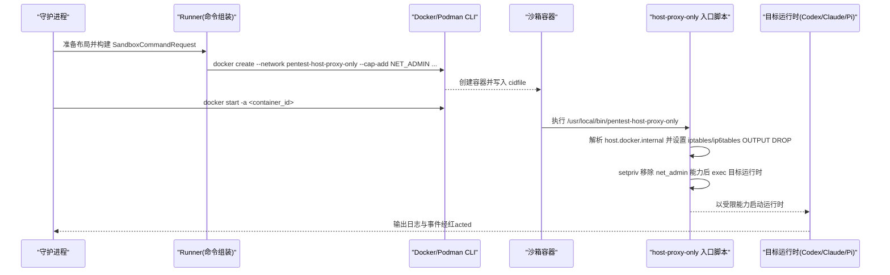
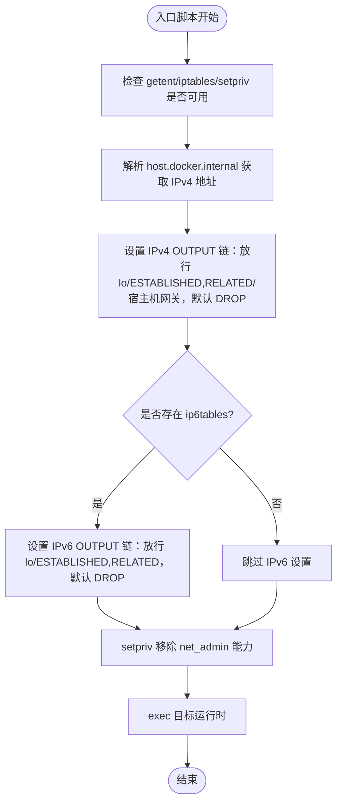
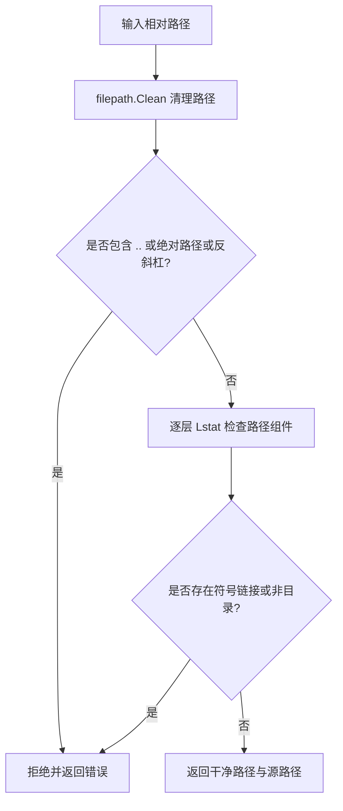
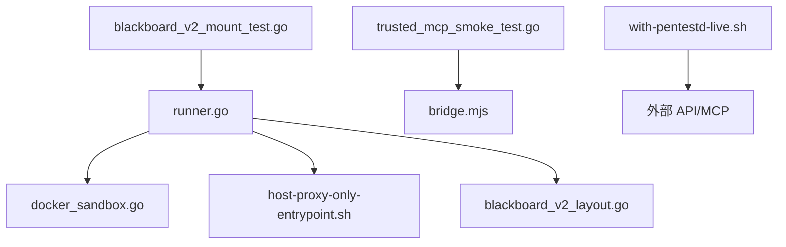

# 容器隔离与安全

<cite>
**本文引用的文件列表**
- [docker/pentest-sandbox/Dockerfile](file://docker/pentest-sandbox/Dockerfile)
- [docker/pentest-sandbox/host-proxy-only-entrypoint.sh](file://docker/pentest-sandbox/host-proxy-only-entrypoint.sh)
- [internal/runner/runner.go](file://internal/runner/runner.go)
- [internal/runtime/docker_sandbox.go](file://internal/runtime/docker_sandbox.go)
- [internal/runner/blackboard_v2_mount_test.go](file://internal/runner/blackboard_v2_mount_test.go)
- [internal/runner/blackboard_v2_layout.go](file://internal/runner/blackboard_v2_layout.go)
- [internal/skill/validation.go](file://internal/skill/validation.go)
- [internal/daemon/trusted_mcp_smoke_test.go](file://internal/daemon/trusted_mcp_smoke_test.go)
- [cmd/pentest-claude-sdk-bridge/bridge.mjs](file://cmd/pentest-claude-sdk-bridge/bridge.mjs)
- [scripts/with-pentestd-live.sh](file://scripts/with-pentestd-live.sh)
</cite>

## 目录
1. [简介](#简介)
2. [项目结构](#项目结构)
3. [核心组件](#核心组件)
4. [架构总览](#架构总览)
5. [详细组件分析](#详细组件分析)
6. [依赖关系分析](#依赖关系分析)
7. [性能与资源限制](#性能与资源限制)
8. [故障排查指南](#故障排查指南)
9. [结论](#结论)
10. [附录：安全配置最佳实践](#附录安全配置最佳实践)

## 简介
本文件聚焦于项目的容器隔离机制与安全边界，围绕以下主题展开：
- Docker/Podman 容器的命名空间隔离、cgroup 资源限制、Linux 能力裁剪
- host_proxy_only 网络模式的实现原理（iptables 规则、代理转发与访问控制）
- 文件系统挂载的安全考虑（只读绑定、路径验证、符号链接防护）
- 安全配置的最佳实践与常见漏洞防护建议

本项目采用“本地优先”的渗透测试代理架构，执行面通过容器化沙箱运行第三方 AI 编程代理与工具集。安全设计强调最小权限、最小暴露面与可审计性。

## 项目结构
与容器隔离与安全相关的核心位置如下：
- 镜像构建与基础环境：docker/pentest-sandbox/Dockerfile
- 主机代理仅模式入口脚本：docker/pentest-sandbox/host-proxy-only-entrypoint.sh
- 任务启动器与命令组装：internal/runner/runner.go
- 容器生命周期与网络要求校验：internal/runtime/docker_sandbox.go
- 只读挂载与路径校验相关测试与实现：internal/runner/blackboard_v2_mount_test.go、internal/runner/blackboard_v2_layout.go
- 技能包路径校验：internal/skill/validation.go
- MCP 可信工具白名单与配置注入：internal/daemon/trusted_mcp_smoke_test.go
- Claude SDK 桥接权限请求处理：cmd/pentest-claude-sdk-bridge/bridge.mjs
- 守护进程启动与鉴权令牌：scripts/with-pentestd-live.sh

图表来源
- [docker/pentest-sandbox/Dockerfile:124-144](file://docker/pentest-sandbox/Dockerfile#L124-L144)
- [docker/pentest-sandbox/host-proxy-only-entrypoint.sh:1-46](file://docker/pentest-sandbox/host-proxy-only-entrypoint.sh#L1-L46)
- [internal/runner/runner.go:142-217](file://internal/runner/runner.go#L142-L217)
- [internal/runtime/docker_sandbox.go:365-428](file://internal/runtime/docker_sandbox.go#L365-L428)
- [internal/runner/blackboard_v2_mount_test.go:16-40](file://internal/runner/blackboard_v2_mount_test.go#L16-L40)
- [internal/runner/blackboard_v2_layout.go:308-351](file://internal/runner/blackboard_v2_layout.go#L308-L351)
- [internal/daemon/trusted_mcp_smoke_test.go:52-89](file://internal/daemon/trusted_mcp_smoke_test.go#L52-L89)
- [cmd/pentest-claude-sdk-bridge/bridge.mjs:125-151](file://cmd/pentest-claude-sdk-bridge/bridge.mjs#L125-L151)
- [scripts/with-pentestd-live.sh:28-68](file://scripts/with-pentestd-live.sh#L28-L68)

章节来源
- [docker/pentest-sandbox/Dockerfile:1-145](file://docker/pentest-sandbox/Dockerfile#L1-L145)
- [docker/pentest-sandbox/host-proxy-only-entrypoint.sh:1-46](file://docker/pentest-sandbox/host-proxy-only-entrypoint.sh#L1-L46)
- [internal/runner/runner.go:142-217](file://internal/runner/runner.go#L142-L217)
- [internal/runtime/docker_sandbox.go:365-428](file://internal/runtime/docker_sandbox.go#L365-L428)
- [internal/runner/blackboard_v2_mount_test.go:16-40](file://internal/runner/blackboard_v2_mount_test.go#L16-L40)
- [internal/runner/blackboard_v2_layout.go:308-351](file://internal/runner/blackboard_v2_layout.go#L308-L351)
- [internal/skill/validation.go:67-78](file://internal/skill/validation.go#L67-L78)
- [internal/daemon/trusted_mcp_smoke_test.go:52-89](file://internal/daemon/trusted_mcp_smoke_test.go#L52-L89)
- [cmd/pentest-claude-sdk-bridge/bridge.mjs:125-151](file://cmd/pentest-claude-sdk-bridge/bridge.mjs#L125-L151)
- [scripts/with-pentestd-live.sh:28-68](file://scripts/with-pentestd-live.sh#L28-L68)

## 核心组件
- 镜像与入口脚本：提供 Kali 基础镜像、安全工具链、Agent 运行时与 host-proxy-only 入口脚本。
- Runner 命令组装：负责构建容器 create 参数，包括只读挂载、网络模式选择、环境变量注入。
- 运行时适配器：确保所需 Docker 网络存在且具备隔离属性，管理容器创建、启动、停止与清理。
- 路径与权限校验：对只读目录进行严格的路径与符号链接检查，防止越界与替换攻击。
- MCP 可信工具白名单：在沙箱内为 Agent 生成最小化的 MCP 工具允许列表，避免任意工具调用。
- 权限请求桥接：Claude SDK 桥接层对工具使用权限进行拦截与上报，支持中断与拒绝。
- 守护进程鉴权：对外部监听地址启用鉴权令牌，避免未授权访问。

章节来源
- [docker/pentest-sandbox/Dockerfile:124-144](file://docker/pentest-sandbox/Dockerfile#L124-L144)
- [internal/runner/runner.go:142-217](file://internal/runner/runner.go#L142-L217)
- [internal/runtime/docker_sandbox.go:365-428](file://internal/runtime/docker_sandbox.go#L365-L428)
- [internal/runner/blackboard_v2_mount_test.go:16-40](file://internal/runner/blackboard_v2_mount_test.go#L16-L40)
- [internal/runner/blackboard_v2_layout.go:308-351](file://internal/runner/blackboard_v2_layout.go#L308-L351)
- [internal/daemon/trusted_mcp_smoke_test.go:52-89](file://internal/daemon/trusted_mcp_smoke_test.go#L52-L89)
- [cmd/pentest-claude-sdk-bridge/bridge.mjs:125-151](file://cmd/pentest-claude-sdk-bridge/bridge.mjs#L125-L151)
- [scripts/with-pentestd-live.sh:28-68](file://scripts/with-pentestd-live.sh#L28-L68)

## 架构总览
下图展示了从任务启动到容器执行的端到端流程，以及 host_proxy_only 网络模式下 iptables 与能力裁剪的关键点。

图表来源
- [internal/runner/runner.go:142-217](file://internal/runner/runner.go#L142-L217)
- [internal/runtime/docker_sandbox.go:111-231](file://internal/runtime/docker_sandbox.go#L111-L231)
- [docker/pentest-sandbox/host-proxy-only-entrypoint.sh:1-46](file://docker/pentest-sandbox/host-proxy-only-entrypoint.sh#L1-L46)

## 详细组件分析

### host_proxy_only 网络模式与 iptables 策略
- 网络模式常量与入口脚本路径由 Runner 定义；当选择 host_proxy_only 时，Runner 会附加 --network 指定名称的网络，并添加 NET_ADMIN 能力以便在容器内设置防火墙规则。
- 入口脚本在容器启动早期完成以下工作：
  - 校验 getent、iptables、setpriv 可用
  - 解析 host.docker.internal 的 IPv4 地址
  - 清空并设置 OUTPUT 链默认 DROP，放行回环、已建立连接、以及仅允许访问宿主网关 IP
  - 若存在 ip6tables，同样设置 IPv6 出站默认 DROP 并放行必要流量
  - 使用 setpriv 将 net_admin 从 bounding/inh/ambient caps 中移除后再 exec 目标运行时，防止运行时修改防火墙规则

图表来源
- [docker/pentest-sandbox/host-proxy-only-entrypoint.sh:1-46](file://docker/pentest-sandbox/host-proxy-only-entrypoint.sh#L1-L46)
- [internal/runner/runner.go:196-216](file://internal/runner/runner.go#L196-L216)

章节来源
- [docker/pentest-sandbox/host-proxy-only-entrypoint.sh:1-46](file://docker/pentest-sandbox/host-proxy-only-entrypoint.sh#L1-L46)
- [internal/runner/runner.go:196-216](file://internal/runner/runner.go#L196-L216)

### 命名空间隔离与 Linux 能力裁剪
- 命名空间隔离：容器通过独立的网络命名空间运行，结合 Docker 自定义 bridge 网络与内部网络选项，限制跨网络通信。
- 能力裁剪：
  - 仅在 host_proxy_only 模式下临时授予 NET_ADMIN，用于在容器内设置 iptables 规则
  - 入口脚本在 exec 目标运行时前，使用 setpriv 移除 net_admin 能力，防止运行时篡改防火墙策略
- 其他能力：镜像未显式添加额外危险能力，遵循最小权限原则

章节来源
- [docker/pentest-sandbox/host-proxy-only-entrypoint.sh:39-45](file://docker/pentest-sandbox/host-proxy-only-entrypoint.sh#L39-L45)
- [internal/runner/runner.go:196-201](file://internal/runner/runner.go#L196-L201)

### cgroup 资源限制
- 当前代码未直接设置 CPU/内存等 cgroup 限制；如需限制，可在 Runner 构建容器参数时追加相应资源限制标志（例如 --cpus、--memory），或在 Docker/Podman 层面通过 profile 或系统级 cgroup 策略施加。
- 建议在部署环境中统一配置 cgroup v2 限制，并结合容器编排平台进行配额管理。

[本节为通用指导，不直接分析具体文件]

### 文件系统挂载与路径验证
- 只读绑定：
  - Runner 支持 ReadOnlyTaskFiles 与 ReadOnlyTaskDirs，将任务根下的文件或目录以 readonly 方式 bind-mount 进容器
  - 针对 .pentest 等关键目录，测试断言其父目录被只读挂载，且不允许直接挂载可替换的文件 inode（如 blackboard.json、scope.json）
- 路径验证：
  - confinedReadOnlyTaskDir 对相对路径进行清理与安全检查，禁止绝对路径、.. 逃逸、反斜杠、符号链接穿透
  - 逐层 Lstat 检查路径组件，确保均为目录且无符号链接，防止 TOCTOU 与软链接绕过
- 技能包路径校验：ValidateRelativeBundlePath 强制相对路径且不包含非法片段，防止越界加载

图表来源
- [internal/runner/runner.go:219-243](file://internal/runner/runner.go#L219-L243)
- [internal/runner/blackboard_v2_mount_test.go:16-40](file://internal/runner/blackboard_v2_mount_test.go#L16-L40)
- [internal/skill/validation.go:67-78](file://internal/skill/validation.go#L67-L78)

章节来源
- [internal/runner/runner.go:179-243](file://internal/runner/runner.go#L179-L243)
- [internal/runner/blackboard_v2_mount_test.go:16-40](file://internal/runner/blackboard_v2_mount_test.go#L16-L40)
- [internal/skill/validation.go:67-78](file://internal/skill/validation.go#L67-L78)

### MCP 可信工具白名单与权限桥接
- 可信工具白名单：测试断言在沙箱内生成的 MCP 配置仅包含受信任的工具名，避免任意工具调用带来的风险
- 权限桥接：Claude SDK 桥接层对工具使用权限进行拦截，记录请求上下文并支持中断与拒绝，确保工具调用需经过明确授权

章节来源
- [internal/daemon/trusted_mcp_smoke_test.go:52-89](file://internal/daemon/trusted_mcp_smoke_test.go#L52-L89)
- [cmd/pentest-claude-sdk-bridge/bridge.mjs:125-151](file://cmd/pentest-claude-sdk-bridge/bridge.mjs#L125-L151)

### 守护进程鉴权与外部访问控制
- 守护进程在非本地监听地址下需要鉴权令牌；脚本在未提供令牌时自动生成临时令牌并导出，供客户端与沙箱认证
- 该机制降低未授权访问风险，确保 API 与 MCP 接口仅对持有令牌的客户端开放

章节来源
- [scripts/with-pentestd-live.sh:28-68](file://scripts/with-pentestd-live.sh#L28-L68)

## 依赖关系分析
- Runner 依赖 Docker/Podman CLI 执行容器操作，并通过网络需求校验确保网络具备隔离属性
- 入口脚本依赖 iptables/ip6tables 与 setpriv，在容器内实施出站过滤与能力裁剪
- 路径校验逻辑依赖标准库的 filepath 与 os.Lstat，确保路径安全
- MCP 白名单与权限桥接依赖测试与桥接脚本，保障工具调用的最小权限

图表来源
- [internal/runner/runner.go:142-217](file://internal/runner/runner.go#L142-L217)
- [internal/runtime/docker_sandbox.go:365-428](file://internal/runtime/docker_sandbox.go#L365-L428)
- [docker/pentest-sandbox/host-proxy-only-entrypoint.sh:1-46](file://docker/pentest-sandbox/host-proxy-only-entrypoint.sh#L1-L46)
- [internal/runner/blackboard_v2_layout.go:308-351](file://internal/runner/blackboard_v2_layout.go#L308-L351)
- [internal/runner/blackboard_v2_mount_test.go:16-40](file://internal/runner/blackboard_v2_mount_test.go#L16-L40)
- [internal/daemon/trusted_mcp_smoke_test.go:52-89](file://internal/daemon/trusted_mcp_smoke_test.go#L52-L89)
- [cmd/pentest-claude-sdk-bridge/bridge.mjs:125-151](file://cmd/pentest-claude-sdk-bridge/bridge.mjs#L125-L151)
- [scripts/with-pentestd-live.sh:28-68](file://scripts/with-pentestd-live.sh#L28-L68)

章节来源
- [internal/runner/runner.go:142-217](file://internal/runner/runner.go#L142-L217)
- [internal/runtime/docker_sandbox.go:365-428](file://internal/runtime/docker_sandbox.go#L365-L428)
- [docker/pentest-sandbox/host-proxy-only-entrypoint.sh:1-46](file://docker/pentest-sandbox/host-proxy-only-entrypoint.sh#L1-L46)
- [internal/runner/blackboard_v2_layout.go:308-351](file://internal/runner/blackboard_v2_layout.go#L308-L351)
- [internal/runner/blackboard_v2_mount_test.go:16-40](file://internal/runner/blackboard_v2_mount_test.go#L16-L40)
- [internal/daemon/trusted_mcp_smoke_test.go:52-89](file://internal/daemon/trusted_mcp_smoke_test.go#L52-L89)
- [cmd/pentest-claude-sdk-bridge/bridge.mjs:125-151](file://cmd/pentest-claude-sdk-bridge/bridge.mjs#L125-L151)
- [scripts/with-pentestd-live.sh:28-68](file://scripts/with-pentestd-live.sh#L28-L68)

## 性能与资源限制
- 当前实现未内置 CPU/内存等 cgroup 限制；建议在部署层通过容器编排或系统 cgroup 策略进行统一管控
- 出站网络默认 DROP 的策略有助于减少不必要的网络开销与潜在恶意外联
- 只读挂载可减少写放大与竞争条件，提升数据一致性与安全性

[本节为通用指导，不直接分析具体文件]

## 故障排查指南
- 入口脚本缺少依赖：若 getent/iptables/setpriv 不可用，脚本会提前退出；需在镜像中安装对应工具
- 无法解析 host.docker.internal：入口脚本会在解析失败时退出；检查 Docker Desktop 或 Podman 的 host-gateway 配置
- IPv6 绕过风险：若启用了 IPv6 且未设置 ip6tables 规则，可能绕过出站限制；确保 ip6tables 规则生效
- 能力未被正确裁剪：若运行时仍拥有 net_admin，可能修改防火墙规则；确认 setpriv 参数与顺序正确
- 只读挂载失败：路径包含符号链接或越界时会报错；检查任务布局与只读目录配置
- MCP 工具缺失：若白名单未包含必要工具，Agent 将无法调用；核对 trusted_mcp 配置
- 守护进程未鉴权：非本地监听地址未设置令牌会导致未授权访问；检查 with-pentestd-live.sh 中的令牌生成与导出

章节来源
- [docker/pentest-sandbox/host-proxy-only-entrypoint.sh:1-46](file://docker/pentest-sandbox/host-proxy-only-entrypoint.sh#L1-L46)
- [internal/runner/runner.go:219-243](file://internal/runner/runner.go#L219-L243)
- [internal/daemon/trusted_mcp_smoke_test.go:52-89](file://internal/daemon/trusted_mcp_smoke_test.go#L52-L89)
- [scripts/with-pentestd-live.sh:28-68](file://scripts/with-pentestd-live.sh#L28-L68)

## 结论
本项目在容器隔离与安全方面采取了多项措施：
- 通过 host_proxy_only 网络模式与 iptables/ip6tables 出站过滤，限制容器对外访问
- 在入口脚本中使用 setpriv 裁剪 net_admin 能力，防止运行时篡改防火墙策略
- 对只读挂载进行严格的路径与符号链接校验，防止越界与替换攻击
- 通过 MCP 白名单与权限桥接，最小化工具调用权限
- 守护进程启用鉴权令牌，降低未授权访问风险

建议在生产环境中补充 cgroup 资源限制，并持续监控与审计容器行为，确保安全边界的稳健性。

[本节为总结，不直接分析具体文件]

## 附录：安全配置最佳实践
- 镜像最小化：仅安装必要的工具与依赖，定期更新基础镜像与依赖包
- 网络最小暴露：默认禁用出站，按需放行特定目标；优先使用内部网络与代理
- 能力最小化：仅在必要时授予有限能力，并在 exec 前移除
- 只读文件系统：尽可能将敏感目录与配置文件以只读方式挂载
- 路径校验：对所有用户可控路径进行严格校验，禁止符号链接与越界
- 鉴权与审计：对外部接口启用鉴权，记录关键操作与事件
- 资源限制：通过 cgroup 限制 CPU/内存，防止资源耗尽攻击
- 白名单策略：对工具调用与网络访问采用白名单，避免任意执行与外联

[本节为通用指导，不直接分析具体文件]