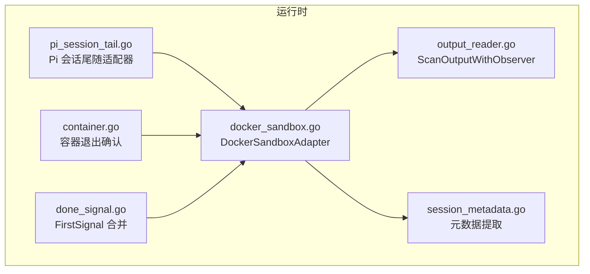
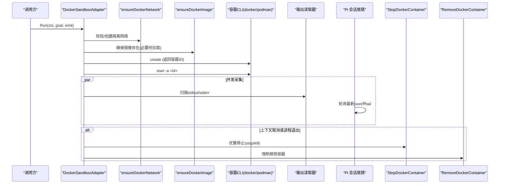
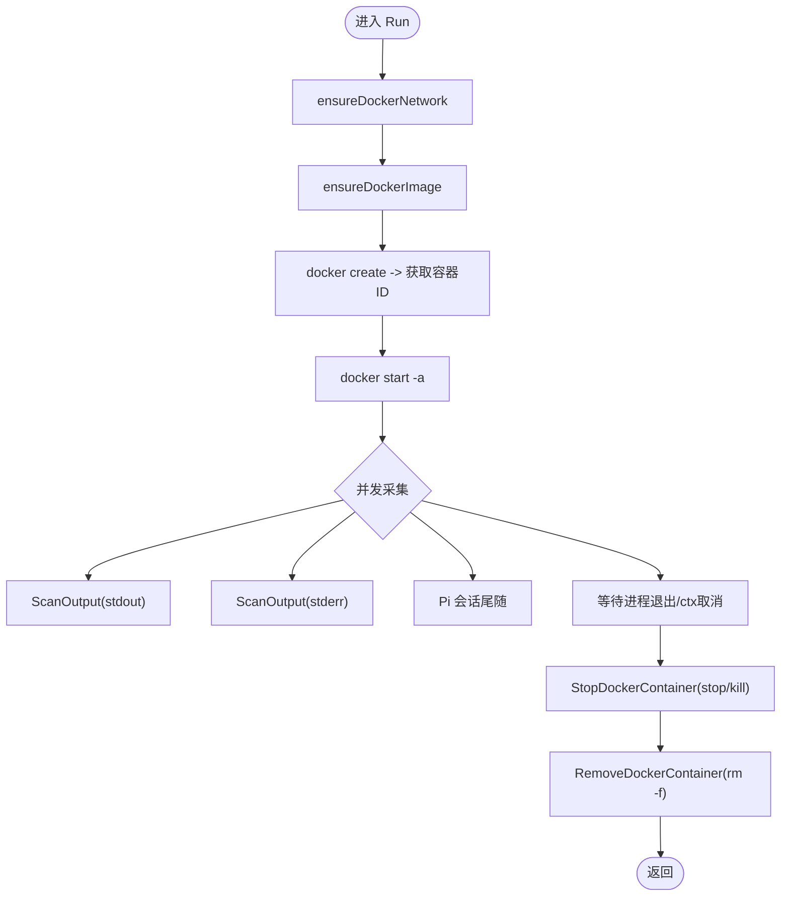
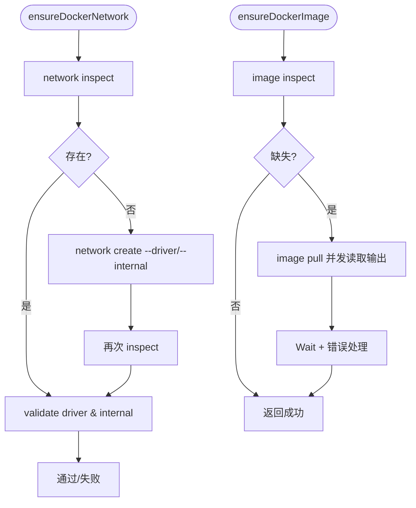
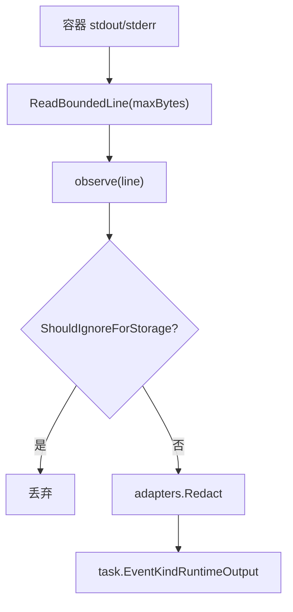
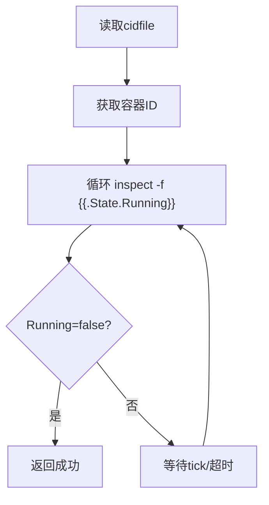
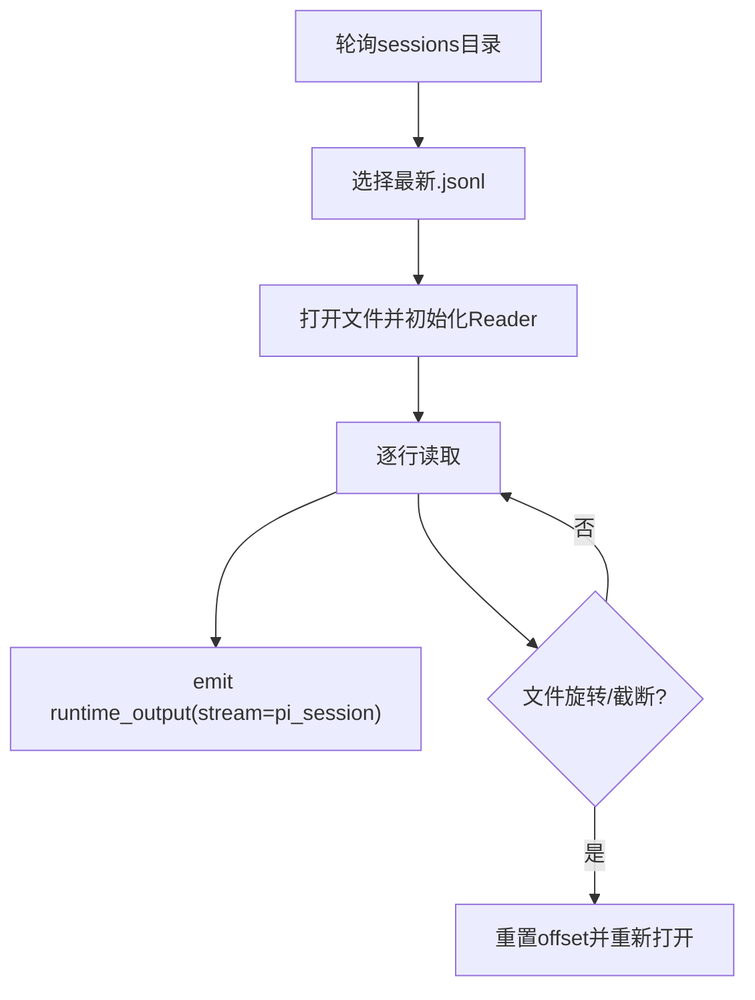
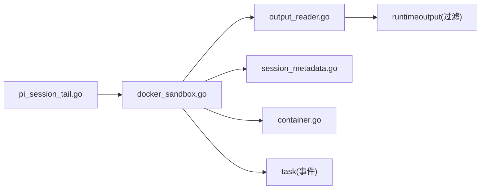

# 沙箱生命周期管理

<cite>
**本文引用的文件**
- [internal/runtime/docker_sandbox.go](file://internal/runtime/docker_sandbox.go)
- [internal/runtime/container.go](file://internal/runtime/container.go)
- [internal/runtime/output_reader.go](file://internal/runtime/output_reader.go)
- [internal/runtime/pi_session_tail.go](file://internal/runtime/pi_session_tail.go)
- [internal/runtime/pi_session_discovery.go](file://internal/runtime/pi_session_discovery.go)
- [internal/runtime/session_metadata.go](file://internal/runtime/session_metadata.go)
- [internal/runtime/done_signal.go](file://internal/runtime/done_signal.go)
</cite>

## 目录
1. [简介](#简介)
2. [项目结构](#项目结构)
3. [核心组件](#核心组件)
4. [架构总览](#架构总览)
5. [详细组件分析](#详细组件分析)
6. [依赖关系分析](#依赖关系分析)
7. [性能考量](#性能考量)
8. [故障排查指南](#故障排查指南)
9. [结论](#结论)

## 简介
本文件系统性阐述沙箱容器的完整生命周期管理，覆盖创建、启动、监控、停止与清理流程；说明 PID 1 进程发现机制、健康检查、日志收集与输出重定向；解释异常处理、资源泄漏防护与优雅关闭策略；并给出容器状态同步与故障恢复方案。同时深入解析 ensureDockerImage、ensureDockerNetwork 等关键函数的实现逻辑。

## 项目结构
围绕沙箱运行时的核心代码集中在 internal/runtime 包中，主要职责如下：
- DockerSandboxAdapter：负责镜像拉取、网络准备、容器创建/启动/停止/清理、输出扫描与事件上报。
- 输出读取器：提供行级安全扫描、超长行截断、敏感信息脱敏与事件发射。
- Pi 会话尾随适配器：在容器运行时并行跟踪 Pi 的会话 jsonl 文件，实时产出任务进度。
- 容器确认工具：基于 cidfile 轮询容器退出状态，确保资源完全释放。
- 元数据提取：从运行时 JSONL 记录中提取原生会话 ID、路径与容器 ID。
- 信号合并：将多个“完成”信号合并为单一一次性通道，简化并发结束语义。

图表来源
- [internal/runtime/docker_sandbox.go:111-231](file://internal/runtime/docker_sandbox.go#L111-L231)
- [internal/runtime/output_reader.go:61-104](file://internal/runtime/output_reader.go#L61-L104)
- [internal/runtime/pi_session_tail.go:62-71](file://internal/runtime/pi_session_tail.go#L62-L71)
- [internal/runtime/container.go:26-72](file://internal/runtime/container.go#L26-L72)
- [internal/runtime/session_metadata.go:8-46](file://internal/runtime/session_metadata.go#L8-L46)
- [internal/runtime/done_signal.go:5-31](file://internal/runtime/done_signal.go#L5-L31)

章节来源
- [internal/runtime/docker_sandbox.go:1-505](file://internal/runtime/docker_sandbox.go#L1-L505)
- [internal/runtime/output_reader.go:1-104](file://internal/runtime/output_reader.go#L1-L104)
- [internal/runtime/pi_session_tail.go:1-174](file://internal/runtime/pi_session_tail.go#L1-L174)
- [internal/runtime/container.go:1-89](file://internal/runtime/container.go#L1-L89)
- [internal/runtime/session_metadata.go:1-46](file://internal/runtime/session_metadata.go#L1-L46)
- [internal/runtime/done_signal.go:1-32](file://internal/runtime/done_signal.go#L1-L32)

## 核心组件
- DockerSandboxAdapter
  - 职责：确保镜像和网络可用；创建并启动容器；并发扫描 stdout/stderr；在上下文取消或进程结束时执行优雅停止与强制清理；通过事件总线上报生命周期与运行时输出。
  - 关键点：使用 exec.CommandContext 控制超时；StopDockerContainer 先 stop 后 kill；RemoveDockerContainer 强制删除；对缺失容器错误进行幂等处理。
- 输出读取器（ScanOutputWithObserver）
  - 职责：按行读取输出，支持超长行截断；过滤忽略行；对文本进行敏感信息脱敏；将事件以 task.EventKindRuntimeOutput 形式发出。
- Pi 会话尾随适配器（piSessionTailAdapter）
  - 职责：在容器 Run 期间并行 tail Pi 的 session jsonl 文件，将新行作为 runtime_output 事件发出；支持文件旋转与截断回退。
- 容器退出确认（ConfirmDockerContainerExited）
  - 职责：从 cidfile 读取容器 ID，轮询 inspect 直到容器非运行态或超时。
- 元数据提取（NativeSessionMetadataFromRuntimeLine）
  - 职责：从 JSONL 记录中抽取原生会话 ID、路径与容器 ID，供上层持久化与追踪。
- FirstSignal
  - 职责：将多个完成信号合并为一次性通道，简化多路等待。

章节来源
- [internal/runtime/docker_sandbox.go:111-231](file://internal/runtime/docker_sandbox.go#L111-L231)
- [internal/runtime/output_reader.go:61-104](file://internal/runtime/output_reader.go#L61-L104)
- [internal/runtime/pi_session_tail.go:62-71](file://internal/runtime/pi_session_tail.go#L62-L71)
- [internal/runtime/container.go:26-72](file://internal/runtime/container.go#L26-L72)
- [internal/runtime/session_metadata.go:8-46](file://internal/runtime/session_metadata.go#L8-L46)
- [internal/runtime/done_signal.go:5-31](file://internal/runtime/done_signal.go#L5-L31)

## 架构总览
下图展示了沙箱容器从准备到清理的关键调用链与并发模型。

图表来源
- [internal/runtime/docker_sandbox.go:111-231](file://internal/runtime/docker_sandbox.go#L111-L231)
- [internal/runtime/output_reader.go:61-104](file://internal/runtime/output_reader.go#L61-L104)
- [internal/runtime/pi_session_tail.go:62-71](file://internal/runtime/pi_session_tail.go#L62-L71)

## 详细组件分析

### 容器创建与启动流程
- 前置条件
  - 网络要求：若配置了 RequiredNetwork，则调用 ensureDockerNetwork 校验驱动与隔离属性，不存在则创建，存在则验证一致性。
  - 镜像要求：调用 ensureDockerImage 检查镜像是否存在，不存在则拉取，并将拉取进度与结果以事件上报。
- 容器创建
  - 使用 docker create 生成容器 ID，记录并上报 container_created 事件。
  - 设置元数据记录回调，用于持久化容器 ID。
- 容器启动与输出采集
  - 使用 docker start -a 启动并附加标准输出。
  - 并发启动两个 goroutine 分别扫描 stdout 与 stderr，使用 ScanOutputWithObserver 进行行级读取、脱敏与事件发射。
  - 同时启动 Pi 会话尾随 goroutine，实时将 jsonl 内容作为 runtime_output 事件发出。
- 退出与清理
  - 当 ctx 取消或子进程结束时，触发优雅停止：先尝试 stop，失败则 kill；随后强制 rm -f 清理容器。
  - 对“容器不存在”的错误视为成功，保证幂等性。

图表来源
- [internal/runtime/docker_sandbox.go:111-231](file://internal/runtime/docker_sandbox.go#L111-L231)
- [internal/runtime/output_reader.go:61-104](file://internal/runtime/output_reader.go#L61-L104)
- [internal/runtime/pi_session_tail.go:62-71](file://internal/runtime/pi_session_tail.go#L62-L71)

章节来源
- [internal/runtime/docker_sandbox.go:111-231](file://internal/runtime/docker_sandbox.go#L111-L231)

### 镜像拉取与网络准备（ensureDockerImage、ensureDockerNetwork）
- ensureDockerImage
  - 行为：image inspect 判断镜像是否存在；若报告缺失则执行 image pull，并发读取 stdout/stderr 上报进度；最终根据 Wait 结果决定成功或失败。
  - 错误处理：包装错误并上报 image_pull_failed 事件；支持上下文取消提前终止。
- ensureDockerNetwork
  - 行为：network inspect 查询现有网络；若不存在则 network create --driver/--internal 创建；再次 inspect 并 validate 驱动与隔离属性是否匹配预期。
  - 竞态保护：create 失败时二次 inspect，避免并发创建导致误判。
  - 安全性：不匹配期望配置直接报错，防止不安全网络被复用。

图表来源
- [internal/runtime/docker_sandbox.go:233-354](file://internal/runtime/docker_sandbox.go#L233-L354)
- [internal/runtime/docker_sandbox.go:365-428](file://internal/runtime/docker_sandbox.go#L365-L428)

章节来源
- [internal/runtime/docker_sandbox.go:233-354](file://internal/runtime/docker_sandbox.go#L233-L354)
- [internal/runtime/docker_sandbox.go:365-428](file://internal/runtime/docker_sandbox.go#L365-L428)

### 日志收集与输出重定向
- 行级读取与截断
  - ReadBoundedLine 支持超大行截断，避免阻塞管道；ScanOutputWithObserver 持续消费直至 EOF。
- 敏感信息脱敏
  - 所有输出经 adapters.Redact 处理后再发射，避免泄露密钥等敏感值。
- 忽略规则
  - 通过 ShouldIgnoreForStorage 过滤无关行，减少存储压力。
- Pi 会话实时输出
  - piSessionTailAdapter 并行 tail 最新 jsonl，遇到文件旋转或截断自动重置偏移量，保证连续性。

图表来源
- [internal/runtime/output_reader.go:18-104](file://internal/runtime/output_reader.go#L18-L104)
- [internal/runtime/pi_session_tail.go:73-148](file://internal/runtime/pi_session_tail.go#L73-L148)

章节来源
- [internal/runtime/output_reader.go:18-104](file://internal/runtime/output_reader.go#L18-L104)
- [internal/runtime/pi_session_tail.go:73-148](file://internal/runtime/pi_session_tail.go#L73-L148)

### PID 1 进程发现与健康检查
- PID 1 发现
  - 当前实现未直接探测容器内 PID 1；而是通过容器进程退出码与上下文取消来判定生命周期结束。
  - 如需定位 PID 1，可在容器内注入探针并通过 exec 命令查询，但仓库未包含该逻辑。
- 健康检查
  - 容器层：通过 ConfirmDockerContainerExited 轮询 inspect 的 State.Running 字段，直到 false 或超时。
  - 应用层：健康检查属于 Blackboard v2 语义系统范畴，不在 Runtime/Sandbox 模块内。

图表来源
- [internal/runtime/container.go:26-72](file://internal/runtime/container.go#L26-L72)

章节来源
- [internal/runtime/container.go:26-72](file://internal/runtime/container.go#L26-L72)

### 异常处理、资源泄漏防护与优雅关闭
- 优雅关闭
  - StopDockerContainer 先执行 stop，失败则升级为 kill，确保进程尽快退出。
  - RemoveDockerContainer 使用 rm -f 强制清理，避免残留容器占用资源。
- 幂等性
  - 对“容器不存在”的错误识别为成功，避免重复清理报错。
- 并发安全
  - 使用 sync.Mutex 保护元数据记录回调；使用 WaitGroup 等待输出扫描 goroutine 结束；使用 FirstSignal 合并多路完成信号。
- 上下文传播
  - 所有外部命令均使用 CommandContext，确保父上下文取消能中断子进程与网络 IO。

章节来源
- [internal/runtime/docker_sandbox.go:430-504](file://internal/runtime/docker_sandbox.go#L430-L504)
- [internal/runtime/done_signal.go:5-31](file://internal/runtime/done_signal.go#L5-L31)

### 容器状态同步与故障恢复策略
- 状态同步
  - 通过事件总线上报 container_created、container_starting、stop_failed、cleanup_failed 等阶段，便于上层 UI 与审计。
  - 元数据记录器可持久化容器 ID，配合 cidfile 与 inspect 保持状态一致。
- 故障恢复
  - 网络：若网络已存在但配置不符，拒绝启动，提示修复网络配置。
  - 镜像：拉取失败会包装错误并上报，上层可重试或回退。
  - 容器：stop/kill/rm 失败时上报具体错误，便于诊断；缺失容器视为成功，避免死锁。

章节来源
- [internal/runtime/docker_sandbox.go:151-190](file://internal/runtime/docker_sandbox.go#L151-L190)
- [internal/runtime/docker_sandbox.go:329-354](file://internal/runtime/docker_sandbox.go#L329-L354)
- [internal/runtime/docker_sandbox.go:365-428](file://internal/runtime/docker_sandbox.go#L365-L428)

### Pi 会话发现与尾随
- 会话发现
  - DiscoverPiSession 遍历 sessions 根目录，选择最新的 .jsonl 文件，解析第一条含 session_id 的记录返回。
- 会话尾随
  - tailPiSession 每 100ms 轮询最新文件，打开后逐行读取并作为 runtime_output 事件发出；检测文件大小缩小则重置偏移量重新读取。

图表来源
- [internal/runtime/pi_session_discovery.go:11-65](file://internal/runtime/pi_session_discovery.go#L11-L65)
- [internal/runtime/pi_session_tail.go:73-148](file://internal/runtime/pi_session_tail.go#L73-L148)

章节来源
- [internal/runtime/pi_session_discovery.go:11-65](file://internal/runtime/pi_session_discovery.go#L11-L65)
- [internal/runtime/pi_session_tail.go:73-148](file://internal/runtime/pi_session_tail.go#L73-L148)

## 依赖关系分析
- 内部依赖
  - docker_sandbox.go 依赖 output_reader.go（输出扫描）、session_metadata.go（元数据提取）、container.go（退出确认）。
  - pi_session_tail.go 依赖 runtimeoutput 过滤规则与 task 事件类型。
- 外部依赖
  - 通过 exec.CommandContext 调用容器 CLI（docker/podman），依赖其 CLI 行为与错误输出格式。
- 耦合与内聚
  - 适配器模式将不同运行时（如 Pi 尾随）组合进统一接口，提升内聚性与可测试性。
  - 事件驱动降低模块间耦合，便于扩展与观测。

图表来源
- [internal/runtime/docker_sandbox.go:111-231](file://internal/runtime/docker_sandbox.go#L111-L231)
- [internal/runtime/output_reader.go:61-104](file://internal/runtime/output_reader.go#L61-L104)
- [internal/runtime/pi_session_tail.go:62-71](file://internal/runtime/pi_session_tail.go#L62-L71)

章节来源
- [internal/runtime/docker_sandbox.go:111-231](file://internal/runtime/docker_sandbox.go#L111-L231)
- [internal/runtime/output_reader.go:61-104](file://internal/runtime/output_reader.go#L61-L104)
- [internal/runtime/pi_session_tail.go:62-71](file://internal/runtime/pi_session_tail.go#L62-L71)

## 性能考量
- 输出扫描
  - 单行最大长度限制避免内存暴涨；并发双通道读取减少阻塞风险。
- 网络与镜像
  - 镜像拉取与网络创建采用幂等设计，避免重复操作；网络校验在创建前完成，减少运行时风险。
- 轮询开销
  - Pi 会话尾随使用 100ms 间隔轮询，平衡实时性与 CPU 占用。
- 事件发射
  - 使用互斥锁保护 emit 调用，避免竞争；敏感信息脱敏在发射前完成，减少后续处理成本。

[本节为通用指导，无需源码引用]

## 故障排查指南
- 常见问题
  - 镜像拉取失败：检查网络连通性与镜像名称；查看 image_pull_failed 事件中的错误详情。
  - 网络配置不符：确保目标网络的 driver 与 internal 标志与预期一致；参考 validateDockerNetwork 的错误提示。
  - 容器无法停止：观察 stop_failed 事件；必要时手动执行 docker stop/kill/rm 清理。
  - 输出为空：确认容器内程序是否向 stdout/stderr 写入；检查 Pi 会话 jsonl 路径是否正确。
- 诊断步骤
  - 使用 DockerSandboxCreateArgs 检查实际传入的 create 参数与环境变量。
  - 通过 ConfirmDockerContainerExited 验证容器是否真正退出。
  - 检查事件流中的 lifecycle 与 runtime_output 事件，定位失败阶段。

章节来源
- [internal/runtime/docker_sandbox.go:151-190](file://internal/runtime/docker_sandbox.go#L151-L190)
- [internal/runtime/container.go:26-72](file://internal/runtime/container.go#L26-L72)

## 结论
本实现以适配器为核心，结合事件驱动与并发采集，提供了健壮的沙箱容器生命周期管理能力。通过严格的网络与镜像前置校验、优雅停止与幂等清理、以及完善的日志与元数据采集，系统在可用性、可观测性与安全性方面达到良好平衡。对于 PID 1 发现与应用层健康检查，可按需扩展 exec 探针与自定义健康端点，进一步丰富运行时诊断能力。